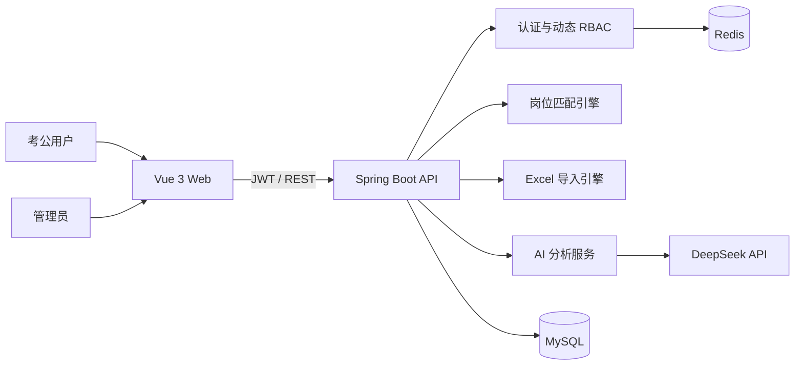

# 智能考公选岗系统

面向考公用户的岗位筛选、匹配与决策辅助平台。系统覆盖用户档案、规则匹配、岗位收藏与对比、数据看板、Excel 批量导入、动态 RBAC 权限以及 DeepSeek 辅助分析。

## 核心能力

- 匹配规则引擎：硬性过滤与软性评分解耦，规则以策略组件组合，便于扩展新的筛选和评分维度。
- 动态权限：Spring Security + JWT + Redis，实现用户—角色—资源授权及运行时权限缓存刷新。
- 数据导入：EasyExcel 逐行解析，使用策略模式支持岗位、招录比等不同导入类型，并提供模板映射与错误反馈。
- 官方自动采集：发现国考官方职位表、归档原件并预览差异，管理员审核后才发布；AI 仅辅助识别不规则表头。
- AI 辅助：由用户提供 DeepSeek API Key，对匹配结果和个人档案进行解释与问答；Key 仅保存在当前浏览器会话中。
- 前后端分离：Vue 3 管理与用户端，Spring Boot REST API，MySQL 持久化，Redis 缓存与验证码。

## 架构



后端按业务域拆分为 `auth`、`profile`、`position`、`match`、`favorite`、`importdata` 和 `ai`，避免继续在脚手架的单一 `ums` 模块中堆叠业务。更详细的调用关系见 [架构说明](docs/architecture.md)。

## 技术栈

- 后端：Java 8、Spring Boot 2.7、Spring Security、JWT、MyBatis-Plus、MySQL、Redis、EasyExcel
- 前端：Vue 3、Vite、Vue Router、Pinia、Element Plus、ECharts、Axios
- 工程化：Maven、npm、Docker Compose、GitHub Actions

## 快速开始

1. 创建 MySQL 数据库 `civil_service_assistance`，依次执行 `backend/sql/init.sql`、`business_schema.sql`、`init_role.sql`、`init_import_permission.sql` 和 `ensure_admin_role.sql`。`alter_*.sql` 仅用于旧数据库升级。
2. 复制 `.env.example` 为 `.env`，设置数据库密码和不少于 32 位的随机 `JWT_SECRET`。
3. 启动 Redis，然后启动后端：

   ```bash
   cd backend
   mvn spring-boot:run
   ```

4. 启动前端：

   ```bash
   cd frontend
   npm ci
   npm run dev
   ```

默认 API 端口为 `8080`。本地开发可通过 `EXPOSE_VERIFICATION_CODE=true` 在响应中查看验证码；生产环境固定关闭，需接入真实邮件发送服务。

## 国考官方数据自动采集

全新数据库的 `business_schema.sql` 已包含采集表；已有数据库须在升级后端前执行一次 [`ingestion_migration.sql`](backend/sql/ingestion_migration.sql)。管理端“官方自动采集”页可按年份启动任务。默认尝试从 `NATIONAL_EXAM_SOURCE_URL` 发现 Excel 或含单个 Excel 的 ZIP 附件，也可填入官网附件直链。仅允许 `NATIONAL_SOURCE_HOSTS` 中的 HTTPS 域名，跳转同样校验。原件按 SHA-256 归档到 `NATIONAL_ARCHIVE_DIR`（Docker Compose 已挂载持久卷）。

批次展示新增、更新、疑似撤销差异；职位代码重复、必填列缺失、人数无效，或新表行数低于现有官方岗位 80% 时会失败，旧数据保持不变。管理员核对来源和差异后才能整批发布或驳回；发布在后台事务中执行，失败则回到待审核并回滚整批变更。岗位查询及匹配只读取未删除、未撤销的岗位，手动 Excel 导入仍保留。

定时采集默认关闭。开启需设置 `NATIONAL_INGESTION_ENABLED=true`，并按招录年度更新 `NATIONAL_EXAM_YEAR`；`NATIONAL_INGESTION_CRON` 可调整触发时间。若官网改版、附件非 Excel/ZIP 或来源不可达，任务会失败，可提交官方附件直链重试，不会绕过来源校验或自动发布。可选的 `INGESTION_AI_API_KEY` 仅在规则无法识别表头时由服务端调用 DeepSeek；没有 Key 时直接报错等待人工处理。AI 不生成岗位字段，也不参与自动审核。当前任务恢复逻辑以单实例部署为前提：服务重启会将未完成采集标为失败、将未完成发布退回待审核。多实例部署需先引入分布式任务锁或队列。

## 质量检查

```bash
cd backend && mvn test
cd frontend && npm ci && npm run lint && npm run format:check && npm run build
```

GitHub Actions 会对每次推送和 Pull Request 执行上述测试、静态检查、构建以及高危依赖审计。

## 安全说明

- 仓库不保存数据库密码、JWT 密钥或第三方 API Key；生产环境必须通过环境变量注入。
- AI API Key 使用 `sessionStorage`，关闭标签页后清除；调用时经后端转发，但不会写入数据库或应用日志。
- `/ai/**`、`/admin/import/**` 与 `/admin/ingestion/**` 不在匿名白名单中，必须通过认证和资源权限校验。
- 上传文件、构建产物、IDE 配置及运行日志均已从版本控制中排除。

## 来源与许可

项目复用了 `mall-tiny` 的通用认证与权限基础能力，并在此基础上完成考公选岗业务、匹配规则、数据导入和 AI 模块的重构与扩展。原项目采用 Apache License 2.0，本仓库保留相应许可证与版权声明。
