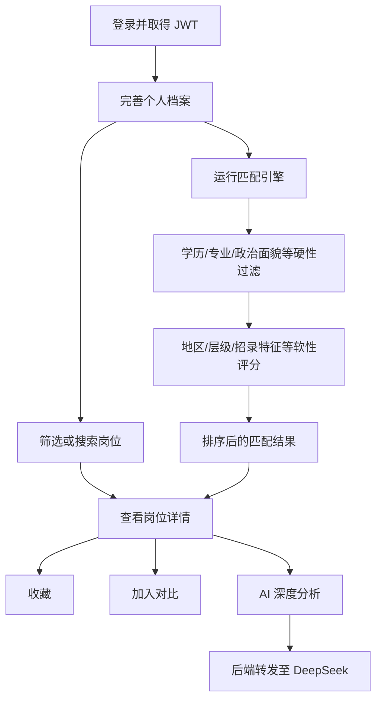
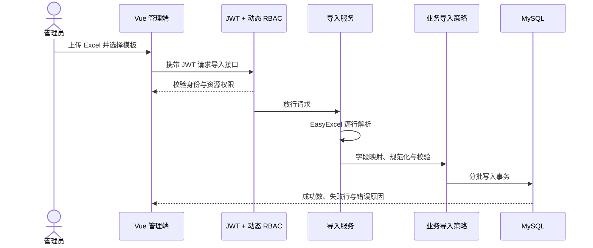

# 业务架构与主要流程

## 模块边界

| 模块 | 责任 |
| --- | --- |
| `auth` | 登录、注册、JWT、用户、角色、菜单、资源与动态授权 |
| `profile` | 考生学历、专业、政治面貌等个人档案 |
| `position` | 岗位检索、详情、统计与后台维护 |
| `match` | 硬性条件过滤、软性评分、匹配结果与预测记录 |
| `favorite` | 岗位收藏与用户侧清单 |
| `importdata` | Excel 上传、模板映射、校验及批量写入 |
| `ai` | 匹配解释和档案问答，负责对接 DeepSeek |

## 用户选岗流程

## 管理员导入流程

## 权限更新流程

管理员修改用户—角色或角色—资源关系后，服务清理对应 Redis 权限缓存；后续请求由动态安全元数据重新读取授权关系，因此不需要重启应用。
