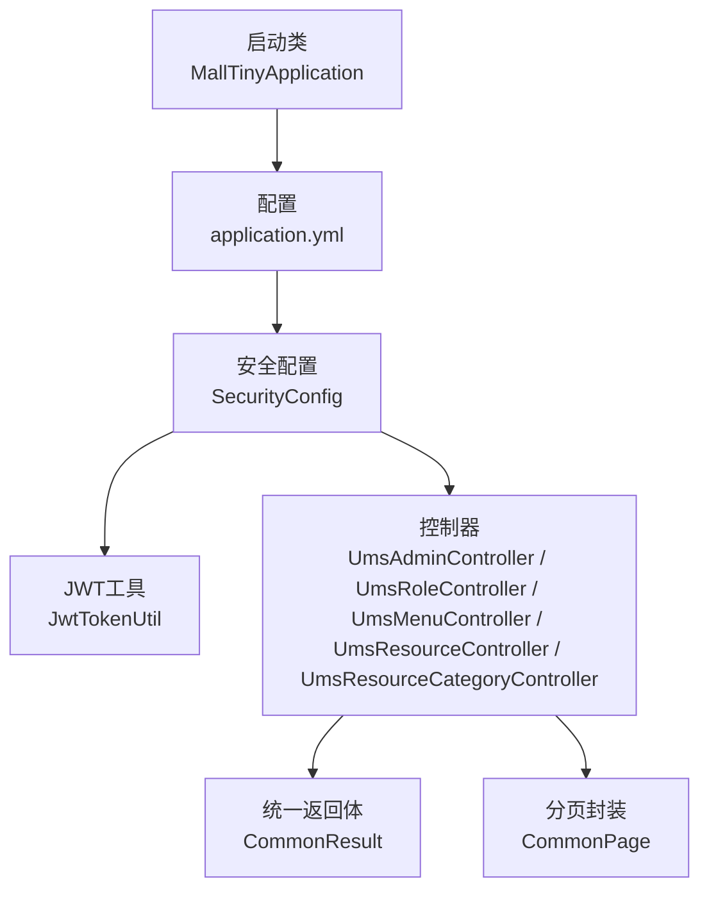
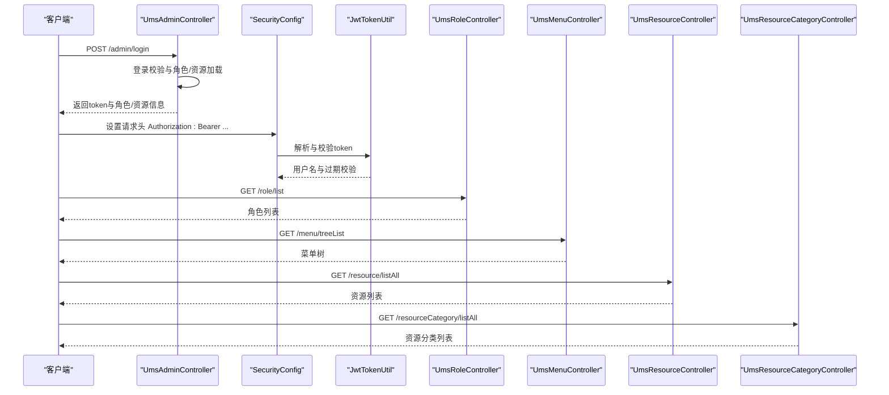
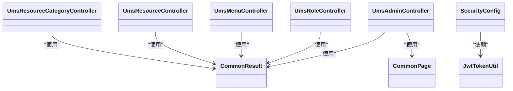
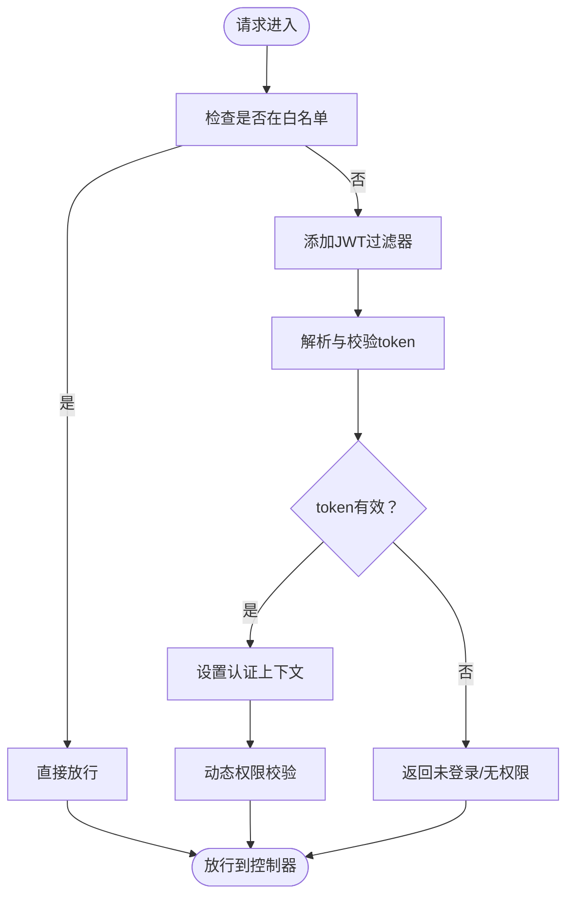

# API接口文档

<cite>
**本文引用的文件**
- [MallTinyApplication.java](file://src/main/java/com/macro/mall/tiny/MallTinyApplication.java)
- [application.yml](file://src/main/resources/application.yml)
- [CommonResult.java](file://src/main/java/com/macro/mall/tiny/common/api/CommonResult.java)
- [CommonPage.java](file://src/main/java/com/macro/mall/tiny/common/api/CommonPage.java)
- [ResultCode.java](file://src/main/java/com/macro/mall/tiny/common/api/ResultCode.java)
- [JwtTokenUtil.java](file://src/main/java/com/macro/mall/tiny/security/util/JwtTokenUtil.java)
- [SecurityConfig.java](file://src/main/java/com/macro/mall/tiny/security/config/SecurityConfig.java)
- [UmsAdminController.java](file://src/main/java/com/macro/mall/tiny/modules/ums/controller/UmsAdminController.java)
- [UmsRoleController.java](file://src/main/java/com/macro/mall/tiny/modules/ums/controller/UmsRoleController.java)
- [UmsMenuController.java](file://src/main/java/com/macro/mall/tiny/modules/ums/controller/UmsMenuController.java)
- [UmsResourceController.java](file://src/main/java/com/macro/mall/tiny/modules/ums/controller/UmsResourceController.java)
- [UmsResourceCategoryController.java](file://src/main/java/com/macro/mall/tiny/modules/ums/controller/UmsResourceCategoryController.java)
</cite>

## 目录
1. [简介](#简介)
2. [项目结构](#项目结构)
3. [核心组件](#核心组件)
4. [架构总览](#架构总览)
5. [详细组件分析](#详细组件分析)
6. [依赖关系分析](#依赖关系分析)
7. [性能与分页规范](#性能与分页规范)
8. [认证与授权](#认证与授权)
9. [错误处理与状态码](#错误处理与状态码)
10. [接口调用示例](#接口调用示例)
11. [测试指南与常见问题](#测试指南与常见问题)
12. [结论](#结论)

## 简介
本项目为基于 Spring Boot + MyBatis-Plus 的权限管理脚手架，提供用户管理、角色管理、菜单管理、资源与资源分类管理等模块的 RESTful API。系统采用 Spring Security + JWT 实现认证与授权，并通过统一返回体与分页封装提升接口一致性与易用性。

## 项目结构
- 启动类位于根包下，负责应用启动。
- 配置集中在 resources 下的 application.yml，包含 JWT、Redis、安全白名单等关键配置。
- 统一返回体与分页封装位于 common/api 包。
- 安全相关配置与工具位于 security 包。
- 权限管理模块（ums）的控制器、服务、映射、模型与 DTO 均按模块划分。

图表来源
- [MallTinyApplication.java:1-14](file://src/main/java/com/macro/mall/tiny/MallTinyApplication.java#L1-L14)
- [application.yml:1-57](file://src/main/resources/application.yml#L1-L57)
- [SecurityConfig.java:1-86](file://src/main/java/com/macro/mall/tiny/security/config/SecurityConfig.java#L1-L86)
- [JwtTokenUtil.java:1-171](file://src/main/java/com/macro/mall/tiny/security/util/JwtTokenUtil.java#L1-L171)
- [UmsAdminController.java:1-350](file://src/main/java/com/macro/mall/tiny/modules/ums/controller/UmsAdminController.java#L1-L350)
- [UmsRoleController.java:1-174](file://src/main/java/com/macro/mall/tiny/modules/ums/controller/UmsRoleController.java#L1-L174)
- [UmsMenuController.java:1-106](file://src/main/java/com/macro/mall/tiny/modules/ums/controller/UmsMenuController.java#L1-L106)
- [UmsResourceController.java:1-110](file://src/main/java/com/macro/mall/tiny/modules/ums/controller/UmsResourceController.java#L1-L110)
- [UmsResourceCategoryController.java:1-73](file://src/main/java/com/macro/mall/tiny/modules/ums/controller/UmsResourceCategoryController.java#L1-L73)
- [CommonResult.java:1-125](file://src/main/java/com/macro/mall/tiny/common/api/CommonResult.java#L1-L125)
- [CommonPage.java:1-72](file://src/main/java/com/macro/mall/tiny/common/api/CommonPage.java#L1-L72)

章节来源
- [MallTinyApplication.java:1-14](file://src/main/java/com/macro/mall/tiny/MallTinyApplication.java#L1-L14)
- [application.yml:1-57](file://src/main/resources/application.yml#L1-L57)

## 核心组件
- 统一返回体 CommonResult：提供成功、失败、参数校验失败、未登录、无权限等标准返回结构。
- 分页封装 CommonPage：将 MyBatis-Plus 的 Page 结果转换为统一分页结构。
- 错误码枚举 ResultCode：定义业务错误码与通用状态码。
- JWT 工具 JwtTokenUtil：生成、解析、刷新 Token 并进行有效性校验。
- 安全配置 SecurityConfig：配置白名单、无状态会话、JWT 过滤器与动态权限过滤器。

章节来源
- [CommonResult.java:1-125](file://src/main/java/com/macro/mall/tiny/common/api/CommonResult.java#L1-L125)
- [CommonPage.java:1-72](file://src/main/java/com/macro/mall/tiny/common/api/CommonPage.java#L1-L72)
- [ResultCode.java:1-38](file://src/main/java/com/macro/mall/tiny/common/api/ResultCode.java#L1-L38)
- [JwtTokenUtil.java:1-171](file://src/main/java/com/macro/mall/tiny/security/util/JwtTokenUtil.java#L1-L171)
- [SecurityConfig.java:1-86](file://src/main/java/com/macro/mall/tiny/security/config/SecurityConfig.java#L1-L86)

## 架构总览
系统采用前后端分离，后端通过 Spring MVC 暴露 RESTful 接口，Spring Security + JWT 实现认证与授权，动态权限过滤器支持运行时权限变更。

图表来源
- [UmsAdminController.java:166-196](file://src/main/java/com/macro/mall/tiny/modules/ums/controller/UmsAdminController.java#L166-L196)
- [SecurityConfig.java:46-84](file://src/main/java/com/macro/mall/tiny/security/config/SecurityConfig.java#L46-L84)
- [JwtTokenUtil.java:75-96](file://src/main/java/com/macro/mall/tiny/security/util/JwtTokenUtil.java#L75-L96)
- [UmsRoleController.java:95-101](file://src/main/java/com/macro/mall/tiny/modules/ums/controller/UmsRoleController.java#L95-L101)
- [UmsMenuController.java:86-92](file://src/main/java/com/macro/mall/tiny/modules/ums/controller/UmsMenuController.java#L86-L92)
- [UmsResourceController.java:94-99](file://src/main/java/com/macro/mall/tiny/modules/ums/controller/UmsResourceController.java#L94-L99)
- [UmsResourceCategoryController.java:27-33](file://src/main/java/com/macro/mall/tiny/modules/ums/controller/UmsResourceCategoryController.java#L27-L33)

## 详细组件分析

### 用户管理模块（/admin）
- 功能概览：用户注册、登录、刷新 Token、获取当前用户信息、登出、分页查询、更新、删除、修改状态、修改密码、分配角色、查询用户角色。
- 关键接口
  - POST /admin/register：注册
  - POST /admin/login：登录获取 token
  - GET /admin/refreshToken：刷新 token
  - GET /admin/info：获取当前用户信息（含菜单、角色、资源）
  - POST /admin/logout：登出
  - GET /admin/list：分页查询（keyword、pageSize、pageNum）
  - GET /admin/{id}：获取指定用户
  - POST /admin/update/{id}：修改用户
  - POST /admin/delete/{id}：删除用户
  - POST /admin/updateStatus/{id}：修改状态（status）
  - POST /admin/updatePassword：修改密码（旧密码、新密码、确认密码）
  - POST /admin/role/update：给用户分配角色（adminId、roleIds）
  - GET /admin/role/{adminId}：获取用户角色

章节来源
- [UmsAdminController.java:62-94](file://src/main/java/com/macro/mall/tiny/modules/ums/controller/UmsAdminController.java#L62-L94)
- [UmsAdminController.java:166-196](file://src/main/java/com/macro/mall/tiny/modules/ums/controller/UmsAdminController.java#L166-L196)
- [UmsAdminController.java:198-211](file://src/main/java/com/macro/mall/tiny/modules/ums/controller/UmsAdminController.java#L198-L211)
- [UmsAdminController.java:213-250](file://src/main/java/com/macro/mall/tiny/modules/ums/controller/UmsAdminController.java#L213-L250)
- [UmsAdminController.java:259-267](file://src/main/java/com/macro/mall/tiny/modules/ums/controller/UmsAdminController.java#L259-L267)
- [UmsAdminController.java:269-275](file://src/main/java/com/macro/mall/tiny/modules/ums/controller/UmsAdminController.java#L269-L275)
- [UmsAdminController.java:277-286](file://src/main/java/com/macro/mall/tiny/modules/ums/controller/UmsAdminController.java#L277-L286)
- [UmsAdminController.java:306-315](file://src/main/java/com/macro/mall/tiny/modules/ums/controller/UmsAdminController.java#L306-L315)
- [UmsAdminController.java:317-328](file://src/main/java/com/macro/mall/tiny/modules/ums/controller/UmsAdminController.java#L317-L328)
- [UmsAdminController.java:288-304](file://src/main/java/com/macro/mall/tiny/modules/ums/controller/UmsAdminController.java#L288-L304)
- [UmsAdminController.java:330-348](file://src/main/java/com/macro/mall/tiny/modules/ums/controller/UmsAdminController.java#L330-L348)

### 角色管理模块（/role）
- 功能概览：创建角色、给用户授予角色、查询用户角色、撤销用户角色、查询所有角色、查询角色已拥有资源ID、给角色分配资源。
- 关键接口
  - POST /role/create：创建角色
  - POST /role/grant：授予角色（adminId、roleId）
  - GET /role/user/{adminId}：查询用户角色
  - DELETE /role/revoke：撤销角色（adminId、roleId）
  - GET /role/list：查询所有角色
  - GET /role/resource/{roleId}：查询角色资源ID
  - POST /role/resource/assign：分配资源（roleId、resourceIds）

章节来源
- [UmsRoleController.java:34-43](file://src/main/java/com/macro/mall/tiny/modules/ums/controller/UmsRoleController.java#L34-L43)
- [UmsRoleController.java:45-65](file://src/main/java/com/macro/mall/tiny/modules/ums/controller/UmsRoleController.java#L45-L65)
- [UmsRoleController.java:67-73](file://src/main/java/com/macro/mall/tiny/modules/ums/controller/UmsRoleController.java#L67-L73)
- [UmsRoleController.java:75-93](file://src/main/java/com/macro/mall/tiny/modules/ums/controller/UmsRoleController.java#L75-L93)
- [UmsRoleController.java:95-101](file://src/main/java/com/macro/mall/tiny/modules/ums/controller/UmsRoleController.java#L95-L101)
- [UmsRoleController.java:103-113](file://src/main/java/com/macro/mall/tiny/modules/ums/controller/UmsRoleController.java#L103-L113)
- [UmsRoleController.java:115-124](file://src/main/java/com/macro/mall/tiny/modules/ums/controller/UmsRoleController.java#L115-L124)

### 菜单管理模块（/menu）
- 功能概览：新增菜单、修改菜单、获取菜单详情、删除菜单、分页查询（parentId、pageSize、pageNum）、树形列表、修改显示状态（hidden）。
- 关键接口
  - POST /menu/create：新增菜单
  - POST /menu/update/{id}：修改菜单
  - GET /menu/{id}：获取菜单详情
  - POST /menu/delete/{id}：删除菜单
  - GET /menu/list/{parentId}：分页查询
  - GET /menu/treeList：树形列表
  - POST /menu/updateHidden/{id}：修改隐藏状态（hidden）

章节来源
- [UmsMenuController.java:31-41](file://src/main/java/com/macro/mall/tiny/modules/ums/controller/UmsMenuController.java#L31-L41)
- [UmsMenuController.java:43-54](file://src/main/java/com/macro/mall/tiny/modules/ums/controller/UmsMenuController.java#L43-L54)
- [UmsMenuController.java:56-62](file://src/main/java/com/macro/mall/tiny/modules/ums/controller/UmsMenuController.java#L56-L62)
- [UmsMenuController.java:64-74](file://src/main/java/com/macro/mall/tiny/modules/ums/controller/UmsMenuController.java#L64-L74)
- [UmsMenuController.java:76-84](file://src/main/java/com/macro/mall/tiny/modules/ums/controller/UmsMenuController.java#L76-L84)
- [UmsMenuController.java:86-92](file://src/main/java/com/macro/mall/tiny/modules/ums/controller/UmsMenuController.java#L86-L92)
- [UmsMenuController.java:94-104](file://src/main/java/com/macro/mall/tiny/modules/ums/controller/UmsMenuController.java#L94-L104)

### 资源管理模块（/resource）
- 功能概览：新增资源、修改资源、获取资源详情、删除资源、分页模糊查询（categoryId、nameKeyword、urlKeyword、pageSize、pageNum）、查询所有资源、资源树（按分类分组）。
- 关键接口
  - POST /resource/create：新增资源
  - POST /resource/update/{id}：修改资源
  - GET /resource/{id}：获取资源详情
  - POST /resource/delete/{id}：删除资源
  - GET /resource/list：分页模糊查询
  - GET /resource/listAll：查询所有资源
  - GET /resource/tree：资源树

章节来源
- [UmsResourceController.java:34-45](file://src/main/java/com/macro/mall/tiny/modules/ums/controller/UmsResourceController.java#L34-L45)
- [UmsResourceController.java:47-59](file://src/main/java/com/macro/mall/tiny/modules/ums/controller/UmsResourceController.java#L47-L59)
- [UmsResourceController.java:61-67](file://src/main/java/com/macro/mall/tiny/modules/ums/controller/UmsResourceController.java#L61-L67)
- [UmsResourceController.java:69-80](file://src/main/java/com/macro/mall/tiny/modules/ums/controller/UmsResourceController.java#L69-L80)
- [UmsResourceController.java:82-92](file://src/main/java/com/macro/mall/tiny/modules/ums/controller/UmsResourceController.java#L82-L92)
- [UmsResourceController.java:94-99](file://src/main/java/com/macro/mall/tiny/modules/ums/controller/UmsResourceController.java#L94-L99)
- [UmsResourceController.java:102-108](file://src/main/java/com/macro/mall/tiny/modules/ums/controller/UmsResourceController.java#L102-L108)

### 资源分类管理模块（/resourceCategory）
- 功能概览：查询所有分类、新增分类、修改分类、删除分类。
- 关键接口
  - GET /resourceCategory/listAll：查询所有分类
  - POST /resourceCategory/create：新增分类
  - POST /resourceCategory/update/{id}：修改分类
  - POST /resourceCategory/delete/{id}：删除分类

章节来源
- [UmsResourceCategoryController.java:27-33](file://src/main/java/com/macro/mall/tiny/modules/ums/controller/UmsResourceCategoryController.java#L27-L33)
- [UmsResourceCategoryController.java:35-45](file://src/main/java/com/macro/mall/tiny/modules/ums/controller/UmsResourceCategoryController.java#L35-L45)
- [UmsResourceCategoryController.java:47-59](file://src/main/java/com/macro/mall/tiny/modules/ums/controller/UmsResourceCategoryController.java#L47-L59)
- [UmsResourceCategoryController.java:61-71](file://src/main/java/com/macro/mall/tiny/modules/ums/controller/UmsResourceCategoryController.java#L61-L71)

## 依赖关系分析
- 控制器依赖服务层，服务层依赖 Mapper 与 Model。
- 统一返回体与分页封装被各控制器复用。
- 安全配置依赖 JWT 过滤器与动态权限过滤器，白名单由配置文件提供。

图表来源
- [UmsAdminController.java:1-350](file://src/main/java/com/macro/mall/tiny/modules/ums/controller/UmsAdminController.java#L1-L350)
- [UmsRoleController.java:1-174](file://src/main/java/com/macro/mall/tiny/modules/ums/controller/UmsRoleController.java#L1-L174)
- [UmsMenuController.java:1-106](file://src/main/java/com/macro/mall/tiny/modules/ums/controller/UmsMenuController.java#L1-L106)
- [UmsResourceController.java:1-110](file://src/main/java/com/macro/mall/tiny/modules/ums/controller/UmsResourceController.java#L1-L110)
- [UmsResourceCategoryController.java:1-73](file://src/main/java/com/macro/mall/tiny/modules/ums/controller/UmsResourceCategoryController.java#L1-L73)
- [CommonResult.java:1-125](file://src/main/java/com/macro/mall/tiny/common/api/CommonResult.java#L1-L125)
- [CommonPage.java:1-72](file://src/main/java/com/macro/mall/tiny/common/api/CommonPage.java#L1-L72)
- [SecurityConfig.java:1-86](file://src/main/java/com/macro/mall/tiny/security/config/SecurityConfig.java#L1-L86)
- [JwtTokenUtil.java:1-171](file://src/main/java/com/macro/mall/tiny/security/util/JwtTokenUtil.java#L1-L171)

## 性能与分页规范
- 分页参数
  - pageSize：每页条数，默认 5
  - pageNum：页码，默认 1
- 排序规则
  - 菜单列表按 sort 字段降序排列
- 数据格式
  - 统一分页返回结构：pageNum、pageSize、totalPage、total、list
- 复杂度
  - 分页查询基于 MyBatis-Plus Page，时间复杂度 O(n)，空间复杂度 O(n)

章节来源
- [UmsMenuController.java:76-84](file://src/main/java/com/macro/mall/tiny/modules/ums/controller/UmsMenuController.java#L76-L84)
- [UmsMenuController.java:174-181](file://src/main/java/com/macro/mall/tiny/modules/ums/controller/UmsMenuController.java#L174-L181)
- [CommonPage.java:22-30](file://src/main/java/com/macro/mall/tiny/common/api/CommonPage.java#L22-L30)

## 认证与授权
- 认证机制
  - 登录成功后返回 token 与 tokenHead（前缀），后续请求在 Authorization 头中携带 Bearer token。
- 白名单
  - Swagger、静态资源、登录、注册、忘记密码、信息、登出、导入等接口免认证。
- 授权机制
  - 无状态会话（STATELESS），JWT 过滤器解析与校验 token。
  - 动态权限过滤器支持运行时权限变更。
- 密钥与过期
  - 密钥、过期时间、tokenHead 在配置文件中定义。

图表来源
- [application.yml:38-57](file://src/main/resources/application.yml#L38-L57)
- [SecurityConfig.java:46-84](file://src/main/java/com/macro/mall/tiny/security/config/SecurityConfig.java#L46-L84)
- [JwtTokenUtil.java:75-96](file://src/main/java/com/macro/mall/tiny/security/util/JwtTokenUtil.java#L75-L96)

章节来源
- [application.yml:24-28](file://src/main/resources/application.yml#L24-L28)
- [application.yml:38-57](file://src/main/resources/application.yml#L38-L57)
- [SecurityConfig.java:46-84](file://src/main/java/com/macro/mall/tiny/security/config/SecurityConfig.java#L46-L84)
- [JwtTokenUtil.java:117-122](file://src/main/java/com/macro/mall/tiny/security/util/JwtTokenUtil.java#L117-L122)

## 错误处理与状态码
- 统一返回体字段
  - code：状态码
  - message：提示信息
  - data：数据
- 通用状态码
  - 成功：200
  - 失败：500
  - 参数校验失败：400
  - 未登录/过期：401
  - 无权限：403
- 业务错误码示例
  - 导入会话不存在或已过期：1001
  - 导入文件格式无效：1002
  - 用户档案不存在：1003
  - 用户名已存在：1004
  - 旧密码不正确：1005
  - 两次输入密码不一致：1006
  - 邮箱未绑定：1007
  - 验证码错误或已过期：1008

章节来源
- [CommonResult.java:26-100](file://src/main/java/com/macro/mall/tiny/common/api/CommonResult.java#L26-L100)
- [ResultCode.java:7-38](file://src/main/java/com/macro/mall/tiny/common/api/ResultCode.java#L7-L38)

## 接口调用示例
- curl 示例（以登录为例）
  - POST http://localhost:8080/admin/login
  - 请求头：Content-Type: application/json
  - 请求体：{"username":"...","password":"..."}
  - 成功响应：包含 token 与 tokenHead
- Postman 步骤
  - 新建请求，选择 POST，填入上述 URL
  - Headers 添加 Content-Type: application/json
  - Body 选择 raw JSON，填入用户名与密码
  - 发送请求，复制返回的 token
  - 再次新建请求，Headers 添加 Authorization: Bearer <token>
- JavaScript fetch 示例
  - 登录获取 token 后，后续请求在 headers 中添加 Authorization: Bearer <token>

章节来源
- [UmsAdminController.java:166-196](file://src/main/java/com/macro/mall/tiny/modules/ums/controller/UmsAdminController.java#L166-L196)
- [application.yml:24-28](file://src/main/resources/application.yml#L24-L28)

## 测试指南与常见问题
- Swagger 文档
  - 访问 http://localhost:8080/swagger-ui/ 查看接口文档与示例
- 常见问题
  - 401 未登录：检查 Authorization 头是否正确携带 tokenHead 与 token
  - 403 无权限：确认用户角色与资源权限是否匹配
  - 分页不生效：确认 pageSize 与 pageNum 参数是否正确传递
  - 资源变更后权限未更新：调用资源/角色分配接口后需清除动态权限缓存（系统会在资源增删改后自动清理）
- 调试建议
  - 查看日志输出，定位参数校验与业务逻辑问题
  - 使用 Swagger 或 Postman 逐步验证接口链路

章节来源
- [UmsResourceController.java:39-44](file://src/main/java/com/macro/mall/tiny/modules/ums/controller/UmsResourceController.java#L39-L44)
- [UmsResourceController.java:53-58](file://src/main/java/com/macro/mall/tiny/modules/ums/controller/UmsResourceController.java#L53-L58)
- [UmsResourceController.java:74-79](file://src/main/java/com/macro/mall/tiny/modules/ums/controller/UmsResourceController.java#L74-L79)

## 结论
本项目提供了完善的权限管理 RESTful API，具备统一的返回体、分页规范、JWT 认证与动态权限控制能力。通过 Swagger 可快速查阅接口文档，结合白名单与安全配置，可满足大多数后台权限系统的开发需求。