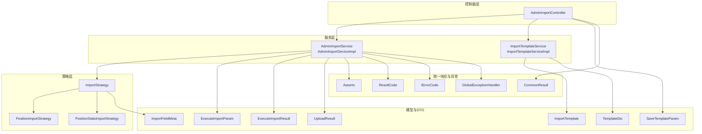
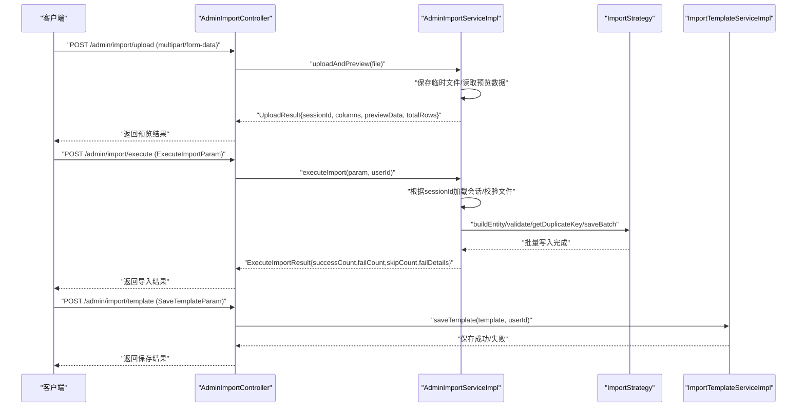
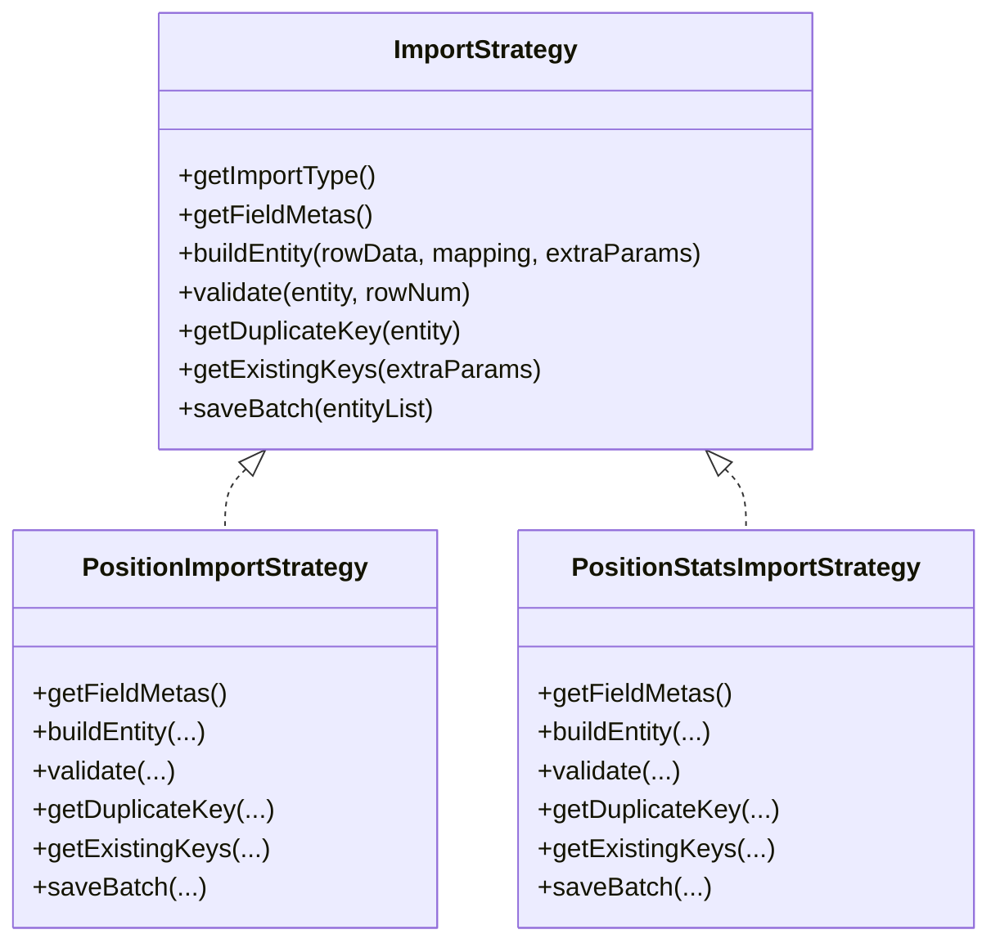
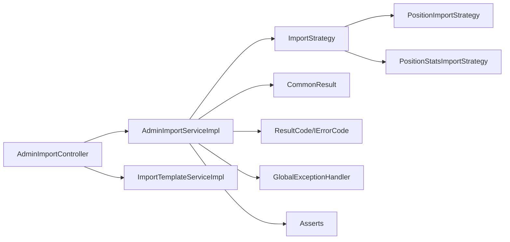

# Excel导入API

<cite>
**本文引用的文件**
- [AdminImportController.java](file://src/main/java/com/macro/mall/tiny/modules/ums/controller/AdminImportController.java)
- [AdminImportService.java](file://src/main/java/com/macro/mall/tiny/modules/ums/service/AdminImportService.java)
- [AdminImportServiceImpl.java](file://src/main/java/com/macro/mall/tiny/modules/ums/service/impl/AdminImportServiceImpl.java)
- [ImportStrategy.java](file://src/main/java/com/macro/mall/tiny/modules/ums/strategy/ImportStrategy.java)
- [PositionImportStrategy.java](file://src/main/java/com/macro/mall/tiny/modules/ums/strategy/PositionImportStrategy.java)
- [PositionStatsImportStrategy.java](file://src/main/java/com/macro/mall/tiny/modules/ums/strategy/PositionStatsImportStrategy.java)
- [ImportTemplateService.java](file://src/main/java/com/macro/mall/tiny/modules/ums/service/ImportTemplateService.java)
- [ImportTemplateServiceImpl.java](file://src/main/java/com/macro/mall/tiny/modules/ums/service/impl/ImportTemplateServiceImpl.java)
- [ImportTemplate.java](file://src/main/java/com/macro/mall/tiny/modules/ums/model/ImportTemplate.java)
- [ExecuteImportParam.java](file://src/main/java/com/macro/mall/tiny/modules/ums/dto/ExecuteImportParam.java)
- [ExecuteImportResult.java](file://src/main/java/com/macro/mall/tiny/modules/ums/dto/ExecuteImportResult.java)
- [UploadResult.java](file://src/main/java/com/macro/mall/tiny/modules/ums/dto/UploadResult.java)
- [ImportFieldMeta.java](file://src/main/java/com/macro/mall/tiny/modules/ums/dto/ImportFieldMeta.java)
- [TemplateDto.java](file://src/main/java/com/macro/mall/tiny/modules/ums/dto/TemplateDto.java)
- [SaveTemplateParam.java](file://src/main/java/com/macro/mall/tiny/modules/ums/dto/SaveTemplateParam.java)
- [CommonResult.java](file://src/main/java/com/macro/mall/tiny/common/api/CommonResult.java)
- [ResultCode.java](file://src/main/java/com/macro/mall/tiny/common/api/ResultCode.java)
- [IErrorCode.java](file://src/main/java/com/macro/mall/tiny/common/api/IErrorCode.java)
- [GlobalExceptionHandler.java](file://src/main/java/com/macro/mall/tiny/common/exception/GlobalExceptionHandler.java)
- [Asserts.java](file://src/main/java/com/macro/mall/tiny/common/exception/Asserts.java)
- [application.yml](file://src/main/resources/application.yml)
</cite>

## 目录
1. [简介](#简介)
2. [项目结构](#项目结构)
3. [核心组件](#核心组件)
4. [架构总览](#架构总览)
5. [详细组件分析](#详细组件分析)
6. [依赖分析](#依赖分析)
7. [性能考虑](#性能考虑)
8. [故障排查指南](#故障排查指南)
9. [结论](#结论)
10. [附录](#附录)

## 简介
本文件面向Excel导入模块的API接口文档，覆盖以下能力与场景：
- 文件上传与预览：支持Excel文件上传、格式校验、预览首几行数据与总行数统计
- 模板管理：模板列表查询、模板删除、模板保存（含字段映射）
- 批量导入：基于策略模式的多类型导入、数据校验、去重、批量写入
- 结果查询：导入成功/失败/跳过计数、失败明细、统计信息
- 异常处理：统一错误码、参数校验、业务规则校验失败、系统异常捕获
- 性能优化：大文件处理、内存管理、批量写入、定时清理临时文件
- 接口调用示例：模板下载流程、文件上传过程、批量导入执行、导入结果查询
- 配置参数、错误码、调试方法等技术细节

## 项目结构
Excel导入模块位于模块“ums”下，采用分层设计：
- 控制器层：AdminImportController 提供HTTP接口
- 服务层：AdminImportService 及其实现负责上传预览、导入执行、定时清理
- 策略层：ImportStrategy 及其具体实现（岗位、报录比）封装不同导入逻辑
- 模板层：ImportTemplateService/ServiceImpl + ImportTemplate 模型
- DTO层：ExecuteImportParam/Result、UploadResult、ImportFieldMeta、TemplateDto、SaveTemplateParam
- 统一响应与异常：CommonResult、ResultCode、IErrorCode、GlobalExceptionHandler、Asserts

图表来源
- [AdminImportController.java:31-147](file://src/main/java/com/macro/mall/tiny/modules/ums/controller/AdminImportController.java#L31-L147)
- [AdminImportServiceImpl.java:37-331](file://src/main/java/com/macro/mall/tiny/modules/ums/service/impl/AdminImportServiceImpl.java#L37-L331)
- [ImportTemplateServiceImpl.java:17-46](file://src/main/java/com/macro/mall/tiny/modules/ums/service/impl/ImportTemplateServiceImpl.java#L17-L46)
- [ImportStrategy.java:15-68](file://src/main/java/com/macro/mall/tiny/modules/ums/strategy/ImportStrategy.java#L15-L68)
- [PositionImportStrategy.java:15-230](file://src/main/java/com/macro/mall/tiny/modules/ums/strategy/PositionImportStrategy.java#L15-L230)
- [PositionStatsImportStrategy.java:17-151](file://src/main/java/com/macro/mall/tiny/modules/ums/strategy/PositionStatsImportStrategy.java#L17-L151)

章节来源
- [AdminImportController.java:31-147](file://src/main/java/com/macro/mall/tiny/modules/ums/controller/AdminImportController.java#L31-L147)
- [AdminImportServiceImpl.java:37-331](file://src/main/java/com/macro/mall/tiny/modules/ums/service/impl/AdminImportServiceImpl.java#L37-L331)

## 核心组件
- 控制器 AdminImportController：提供导入类型列表、字段元数据、文件上传预览、执行导入、模板列表、删除模板、保存模板等接口
- 服务 AdminImportService/Impl：实现上传预览、执行导入、定时清理临时文件；通过策略模式分发不同导入类型
- 策略接口 ImportStrategy 及实现 PositionImportStrategy、PositionStatsImportStrategy：封装字段元数据、实体构建、校验、去重、批量保存
- 模板服务 ImportTemplateService/Impl + ImportTemplate：模板持久化、查询、保存
- DTO/Model：ExecuteImportParam/Result、UploadResult、ImportFieldMeta、TemplateDto、SaveTemplateParam、ImportTemplate

章节来源
- [AdminImportController.java:31-147](file://src/main/java/com/macro/mall/tiny/modules/ums/controller/AdminImportController.java#L31-L147)
- [AdminImportService.java:12-33](file://src/main/java/com/macro/mall/tiny/modules/ums/service/AdminImportService.java#L12-L33)
- [AdminImportServiceImpl.java:37-331](file://src/main/java/com/macro/mall/tiny/modules/ums/service/impl/AdminImportServiceImpl.java#L37-L331)
- [ImportStrategy.java:15-68](file://src/main/java/com/macro/mall/tiny/modules/ums/strategy/ImportStrategy.java#L15-L68)
- [PositionImportStrategy.java:15-230](file://src/main/java/com/macro/mall/tiny/modules/ums/strategy/PositionImportStrategy.java#L15-L230)
- [PositionStatsImportStrategy.java:17-151](file://src/main/java/com/macro/mall/tiny/modules/ums/strategy/PositionStatsImportStrategy.java#L17-L151)
- [ImportTemplateService.java:12-33](file://src/main/java/com/macro/mall/tiny/modules/ums/service/ImportTemplateService.java#L12-L33)
- [ImportTemplateServiceImpl.java:17-46](file://src/main/java/com/macro/mall/tiny/modules/ums/service/impl/ImportTemplateServiceImpl.java#L17-L46)
- [ImportTemplate.java:15-58](file://src/main/java/com/macro/mall/tiny/modules/ums/model/ImportTemplate.java#L15-L58)
- [ExecuteImportParam.java:12-48](file://src/main/java/com/macro/mall/tiny/modules/ums/dto/ExecuteImportParam.java#L12-L48)
- [ExecuteImportResult.java:12-68](file://src/main/java/com/macro/mall/tiny/modules/ums/dto/ExecuteImportResult.java#L12-L68)
- [UploadResult.java:11-33](file://src/main/java/com/macro/mall/tiny/modules/ums/dto/UploadResult.java#L11-L33)
- [ImportFieldMeta.java:10-34](file://src/main/java/com/macro/mall/tiny/modules/ums/dto/ImportFieldMeta.java#L10-L34)
- [TemplateDto.java:9-33](file://src/main/java/com/macro/mall/tiny/modules/ums/dto/TemplateDto.java#L9-L33)
- [SaveTemplateParam.java:9-31](file://src/main/java/com/macro/mall/tiny/modules/ums/dto/SaveTemplateParam.java#L9-L31)

## 架构总览
Excel导入整体流程分为三步：上传预览 → 执行导入 → 结果统计。系统通过策略模式解耦不同导入类型，使用EasyExcel进行流式读取，结合批量写入与去重策略提升性能。

图表来源
- [AdminImportController.java:61-93](file://src/main/java/com/macro/mall/tiny/modules/ums/controller/AdminImportController.java#L61-L93)
- [AdminImportServiceImpl.java:99-257](file://src/main/java/com/macro/mall/tiny/modules/ums/service/impl/AdminImportServiceImpl.java#L99-L257)
- [ImportStrategy.java:25-67](file://src/main/java/com/macro/mall/tiny/modules/ums/strategy/ImportStrategy.java#L25-L67)
- [ImportTemplateServiceImpl.java:39-45](file://src/main/java/com/macro/mall/tiny/modules/ums/service/impl/ImportTemplateServiceImpl.java#L39-L45)

## 详细组件分析

### 控制器层：AdminImportController
- 接口概览
  - GET /admin/import/types：获取支持的导入类型列表
  - GET /admin/import/fields：获取指定导入类型的字段元数据
  - POST /admin/import/upload：上传Excel并预览（仅允许.xlsx/.xls）
  - POST /admin/import/execute：执行导入（需提供sessionId与字段映射）
  - GET /admin/import/templates：获取模板列表（可按导入类型过滤）
  - DELETE /admin/import/template/{id}：删除模板
  - POST /admin/import/template：保存模板（含列映射）

- 权限控制
  - 模板管理相关接口使用注解鉴权，确保具备相应权限才可操作

- 参数与返回
  - 上传预览返回 UploadResult，包含会话ID、列名、预览数据、总行数
  - 执行导入返回 ExecuteImportResult，包含成功/失败/跳过计数及失败明细
  - 模板接口返回统一响应包装

章节来源
- [AdminImportController.java:43-146](file://src/main/java/com/macro/mall/tiny/modules/ums/controller/AdminImportController.java#L43-L146)
- [CommonResult.java](file://src/main/java/com/macro/mall/tiny/common/api/CommonResult.java)

### 服务层：AdminImportService/Impl
- 功能职责
  - 上传并预览：保存临时文件、使用EasyExcel读取前5行预览、记录总行数与列头
  - 执行导入：根据sessionId定位会话、读取Excel、逐行构建实体、校验、去重、批量保存
  - 定时清理：定期删除过期临时文件（默认1小时）

- 会话管理
  - 以sessionId为键缓存会话信息（文件路径、列名、创建时间），过期自动清理

- 批量处理
  - 每批1000条写入，减少事务开销与内存占用

- 错误处理
  - 会话过期、文件失效、参数非法等场景抛出统一错误码

章节来源
- [AdminImportService.java:12-33](file://src/main/java/com/macro/mall/tiny/modules/ums/service/AdminImportService.java#L12-L33)
- [AdminImportServiceImpl.java:99-311](file://src/main/java/com/macro/mall/tiny/modules/ums/service/impl/AdminImportServiceImpl.java#L99-L311)

### 策略层：ImportStrategy 及实现
- 策略接口
  - getImportType：返回导入类型
  - getFieldMetas：返回字段元数据（字段名、标签、是否必填、描述）
  - buildEntity：根据行数据与列映射构建实体
  - validate：业务规则校验
  - getDuplicateKey：生成去重键
  - getExistingKeys：获取数据库中已存在键集合
  - saveBatch：批量保存

- 岗位导入策略 PositionImportStrategy
  - 字段：部门、职位名称、专业要求、学历要求、政治面貌要求、是否限应届、招录人数、年份
  - 校验：必填项、年份范围、学历/政治面貌枚举、人数>0
  - 去重键：年份+部门+职位名称
  - 学历/政治面貌标准化：支持关键词映射与别名归一化

- 报录比导入策略 PositionStatsImportStrategy
  - 字段：部门、职位名称、报名人数、最低进面分、最高进面分、年份
  - 校验：必填项、年份范围、报名人数≥0、最低分≤最高分
  - 去重键：年份+部门+职位名称

图表来源
- [ImportStrategy.java:15-68](file://src/main/java/com/macro/mall/tiny/modules/ums/strategy/ImportStrategy.java#L15-L68)
- [PositionImportStrategy.java:15-230](file://src/main/java/com/macro/mall/tiny/modules/ums/strategy/PositionImportStrategy.java#L15-L230)
- [PositionStatsImportStrategy.java:17-151](file://src/main/java/com/macro/mall/tiny/modules/ums/strategy/PositionStatsImportStrategy.java#L17-L151)

章节来源
- [ImportStrategy.java:15-68](file://src/main/java/com/macro/mall/tiny/modules/ums/strategy/ImportStrategy.java#L15-L68)
- [PositionImportStrategy.java:65-186](file://src/main/java/com/macro/mall/tiny/modules/ums/strategy/PositionImportStrategy.java#L65-L186)
- [PositionStatsImportStrategy.java:23-132](file://src/main/java/com/macro/mall/tiny/modules/ums/strategy/PositionStatsImportStrategy.java#L23-L132)

### 模板管理：ImportTemplateService/Impl + ImportTemplate
- 模板查询：全部、按导入类型、按名称
- 模板保存：记录创建人、创建/更新时间
- 模板DTO：对外展示模板基本信息与列映射JSON

章节来源
- [ImportTemplateService.java:12-33](file://src/main/java/com/macro/mall/tiny/modules/ums/service/ImportTemplateService.java#L12-L33)
- [ImportTemplateServiceImpl.java:17-46](file://src/main/java/com/macro/mall/tiny/modules/ums/service/impl/ImportTemplateServiceImpl.java#L17-L46)
- [ImportTemplate.java:15-58](file://src/main/java/com/macro/mall/tiny/modules/ums/model/ImportTemplate.java#L15-L58)
- [TemplateDto.java:9-33](file://src/main/java/com/macro/mall/tiny/modules/ums/dto/TemplateDto.java#L9-L33)
- [SaveTemplateParam.java:9-31](file://src/main/java/com/macro/mall/tiny/modules/ums/dto/SaveTemplateParam.java#L9-L31)

### 数据传输对象与模型
- ExecuteImportParam：导入类型、会话ID、字段映射、年份、模板名称、是否保存模板
- ExecuteImportResult：成功/失败/跳过计数、失败明细（行号、数据、原因）
- UploadResult：会话ID、列名、预览数据、总行数
- ImportFieldMeta：字段元数据（fieldName、label、required、description）
- TemplateDto/SaveTemplateParam：模板DTO与保存参数

章节来源
- [ExecuteImportParam.java:12-48](file://src/main/java/com/macro/mall/tiny/modules/ums/dto/ExecuteImportParam.java#L12-L48)
- [ExecuteImportResult.java:12-68](file://src/main/java/com/macro/mall/tiny/modules/ums/dto/ExecuteImportResult.java#L12-L68)
- [UploadResult.java:11-33](file://src/main/java/com/macro/mall/tiny/modules/ums/dto/UploadResult.java#L11-L33)
- [ImportFieldMeta.java:10-34](file://src/main/java/com/macro/mall/tiny/modules/ums/dto/ImportFieldMeta.java#L10-L34)
- [TemplateDto.java:9-33](file://src/main/java/com/macro/mall/tiny/modules/ums/dto/TemplateDto.java#L9-L33)
- [SaveTemplateParam.java:9-31](file://src/main/java/com/macro/mall/tiny/modules/ums/dto/SaveTemplateParam.java#L9-L31)

## 依赖分析
- 控制器依赖服务与模板服务，服务依赖策略接口与模板服务
- 策略实现依赖对应领域服务（如岗位、报录比服务）进行批量保存与去重键查询
- 统一响应与异常处理贯穿各层，保证错误码与异常信息一致

图表来源
- [AdminImportController.java:37-41](file://src/main/java/com/macro/mall/tiny/modules/ums/controller/AdminImportController.java#L37-L41)
- [AdminImportServiceImpl.java:45-49](file://src/main/java/com/macro/mall/tiny/modules/ums/service/impl/AdminImportServiceImpl.java#L45-L49)
- [ImportStrategy.java:15-20](file://src/main/java/com/macro/mall/tiny/modules/ums/strategy/ImportStrategy.java#L15-L20)
- [PositionImportStrategy.java:18-19](file://src/main/java/com/macro/mall/tiny/modules/ums/strategy/PositionImportStrategy.java#L18-L19)
- [PositionStatsImportStrategy.java:20-21](file://src/main/java/com/macro/mall/tiny/modules/ums/strategy/PositionStatsImportStrategy.java#L20-L21)

章节来源
- [AdminImportController.java:37-41](file://src/main/java/com/macro/mall/tiny/modules/ums/controller/AdminImportController.java#L37-L41)
- [AdminImportServiceImpl.java:45-49](file://src/main/java/com/macro/mall/tiny/modules/ums/service/impl/AdminImportServiceImpl.java#L45-L49)

## 性能考虑
- 大文件处理
  - 使用EasyExcel流式读取，避免一次性加载整表到内存
  - 仅预览前5行与总行数，降低IO与内存压力
- 内存管理
  - 会话信息缓存使用ConcurrentHashMap，过期自动清理
  - 批量写入阈值为1000条，平衡吞吐与内存占用
- 并发控制
  - 会话缓存为单实例，读写受线程安全保护；批量写入在事务内执行
- 定时清理
  - 每小时清理过期临时文件，防止磁盘膨胀

章节来源
- [AdminImportServiceImpl.java:100-157](file://src/main/java/com/macro/mall/tiny/modules/ums/service/impl/AdminImportServiceImpl.java#L100-L157)
- [AdminImportServiceImpl.java:232-246](file://src/main/java/com/macro/mall/tiny/modules/ums/service/impl/AdminImportServiceImpl.java#L232-L246)
- [AdminImportServiceImpl.java:297-311](file://src/main/java/com/macro/mall/tiny/modules/ums/service/impl/AdminImportServiceImpl.java#L297-L311)

## 故障排查指南
- 常见错误与处理
  - 会话过期：当sessionId无效或文件不存在时，返回导入会话过期错误码
  - 文件格式不正确：仅支持.xlsx/.xls
  - 业务规则校验失败：validate返回具体失败原因，记录在失败明细中
  - 系统异常：由全局异常处理器捕获并返回统一错误格式
- 调试建议
  - 开启服务日志，观察会话缓存清理与导入批次写入日志
  - 检查临时目录权限与空间，确保临时文件可写可删
  - 核对字段映射与年份参数，确保extraParams正确传递

章节来源
- [AdminImportServiceImpl.java:178-185](file://src/main/java/com/macro/mall/tiny/modules/ums/service/impl/AdminImportServiceImpl.java#L178-L185)
- [AdminImportController.java:71-78](file://src/main/java/com/macro/mall/tiny/modules/ums/controller/AdminImportController.java#L71-L78)
- [GlobalExceptionHandler.java](file://src/main/java/com/macro/mall/tiny/common/exception/GlobalExceptionHandler.java)
- [Asserts.java](file://src/main/java/com/macro/mall/tiny/common/exception/Asserts.java)

## 结论
Excel导入模块通过清晰的分层与策略模式，实现了灵活、可扩展、高性能的批量数据导入能力。统一的错误处理与模板管理进一步提升了可用性与可维护性。建议在生产环境中配合合理的文件大小限制、并发控制与监控告警，保障系统稳定性。

## 附录

### 接口定义与调用示例

- 获取导入类型列表
  - 方法：GET
  - 路径：/admin/import/types
  - 权限：导入模板管理
  - 返回：支持的导入类型数组（code/label）

- 获取字段元数据
  - 方法：GET
  - 路径：/admin/import/fields?type={type}
  - 权限：导入模板管理
  - 返回：字段元数据列表（fieldName/label/required/description）

- 上传Excel并预览
  - 方法：POST
  - 路径：/admin/import/upload
  - 参数：multipart/form-data，file字段
  - 返回：UploadResult（sessionId/columns/previewData/totalRows）
  - 校验：仅允许.xlsx/.xls

- 执行导入
  - 方法：POST
  - 路径：/admin/import/execute
  - 请求体：ExecuteImportParam（importType/sessionId/mapping/year/templateName/saveAsTemplate）
  - 返回：ExecuteImportResult（successCount/failCount/skipCount/failDetails）
  - 权限：Excel导入执行

- 获取模板列表
  - 方法：GET
  - 路径：/admin/import/templates?importType={type}
  - 权限：导入模板管理
  - 返回：模板DTO列表

- 删除模板
  - 方法：DELETE
  - 路径：/admin/import/template/{id}
  - 权限：ums:import:template
  - 返回：操作结果

- 保存模板
  - 方法：POST
  - 路径：/admin/import/template
  - 请求体：SaveTemplateParam（templateName/description/columnMapping/importType）
  - 权限：ums:import:template
  - 返回：保存结果

- 模板下载（概念说明）
  - 当前仓库未提供模板下载接口，可在前端或另行开发静态资源下载能力

章节来源
- [AdminImportController.java:43-146](file://src/main/java/com/macro/mall/tiny/modules/ums/controller/AdminImportController.java#L43-L146)
- [ExecuteImportParam.java:12-48](file://src/main/java/com/macro/mall/tiny/modules/ums/dto/ExecuteImportParam.java#L12-L48)
- [ExecuteImportResult.java:12-68](file://src/main/java/com/macro/mall/tiny/modules/ums/dto/ExecuteImportResult.java#L12-L68)
- [UploadResult.java:11-33](file://src/main/java/com/macro/mall/tiny/modules/ums/dto/UploadResult.java#L11-L33)
- [ImportFieldMeta.java:10-34](file://src/main/java/com/macro/mall/tiny/modules/ums/dto/ImportFieldMeta.java#L10-L34)
- [TemplateDto.java:9-33](file://src/main/java/com/macro/mall/tiny/modules/ums/dto/TemplateDto.java#L9-L33)
- [SaveTemplateParam.java:9-31](file://src/main/java/com/macro/mall/tiny/modules/ums/dto/SaveTemplateParam.java#L9-L31)

### 数据验证规则与导入策略
- 岗位导入（position）
  - 必填：部门、职位名称
  - 年份：2000-2100
  - 学历：支持“专科/本科/硕士研究生/博士研究生/大专/硕士/博士”
  - 政治面貌：支持“不限/中共党员/共青团员/民主党派/群众”
  - 招录人数：>0
  - 去重键：年份+部门+职位名称

- 报录比导入（position_stats）
  - 必填：部门、职位名称、报名人数
  - 年份：2000-2100
  - 报名人数：≥0
  - 分数：最低分≤最高分

章节来源
- [PositionImportStrategy.java:140-165](file://src/main/java/com/macro/mall/tiny/modules/ums/strategy/PositionImportStrategy.java#L140-L165)
- [PositionStatsImportStrategy.java:88-111](file://src/main/java/com/macro/mall/tiny/modules/ums/strategy/PositionStatsImportStrategy.java#L88-L111)

### 配置参数
- 临时文件路径
  - 配置项：import.temp-path
  - 默认值：./temp/import/
  - 作用：上传后临时文件存放目录

章节来源
- [AdminImportServiceImpl.java:42-43](file://src/main/java/com/macro/mall/tiny/modules/ums/service/impl/AdminImportServiceImpl.java#L42-L43)
- [application.yml](file://src/main/resources/application.yml)

### 错误码定义
- 统一错误码接口：IErrorCode
- 常见错误码（示例）
  - 导入会话过期：IMPORT_SESSION_EXPIRED
  - 导入文件无效：IMPORT_FILE_INVALID
- 统一响应包装：CommonResult.success()/failed()

章节来源
- [IErrorCode.java](file://src/main/java/com/macro/mall/tiny/common/api/IErrorCode.java)
- [ResultCode.java](file://src/main/java/com/macro/mall/tiny/common/api/ResultCode.java)
- [CommonResult.java](file://src/main/java/com/macro/mall/tiny/common/api/CommonResult.java)