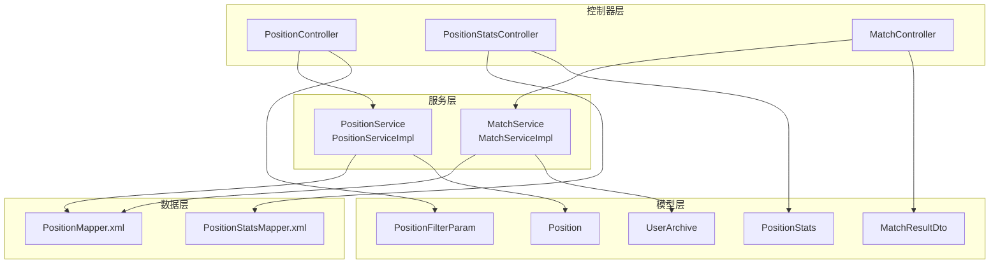
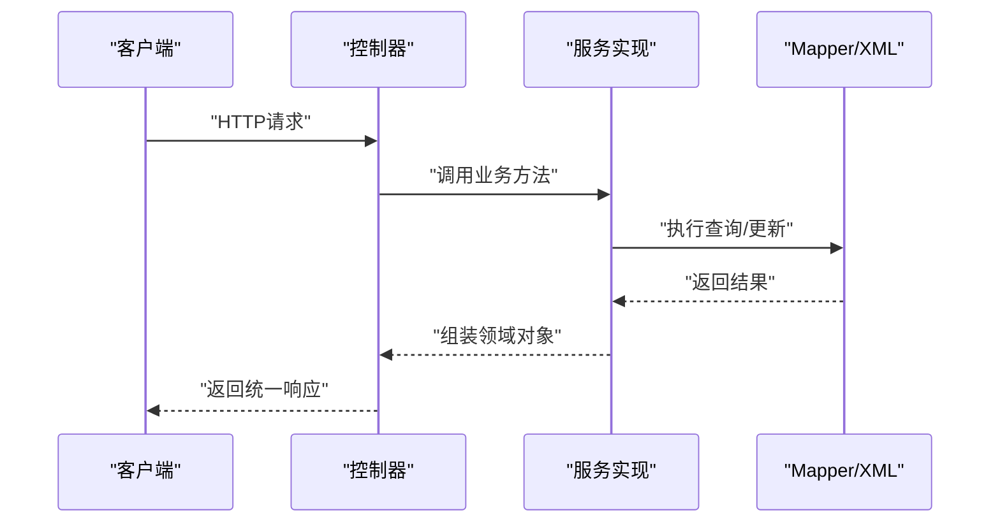
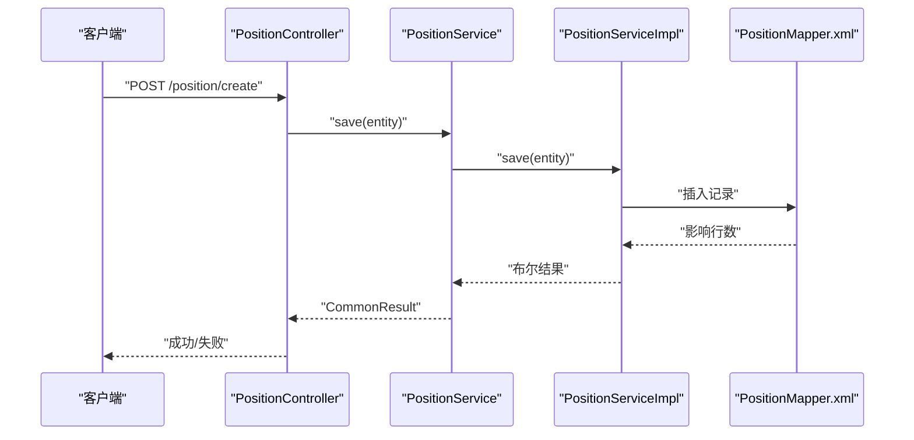
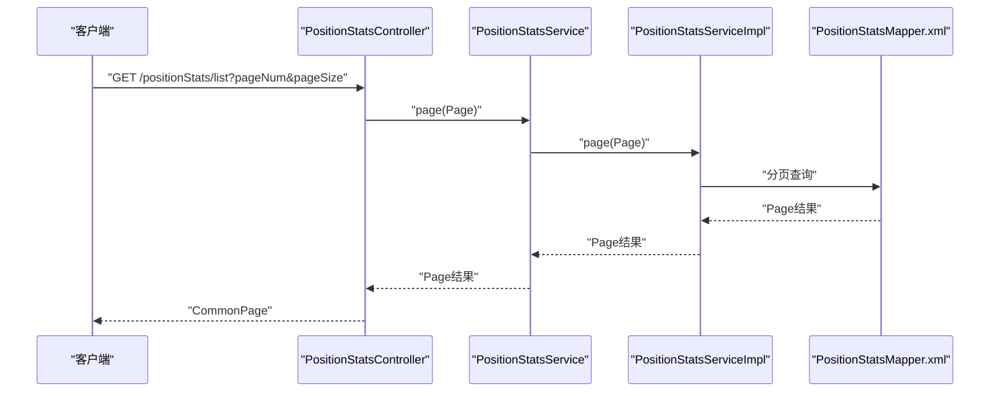
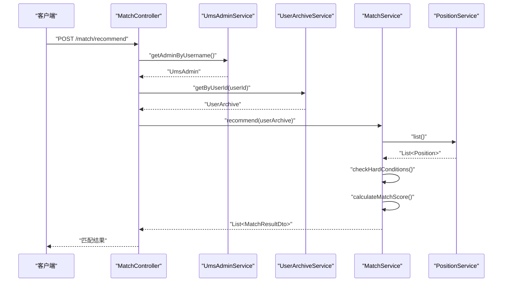
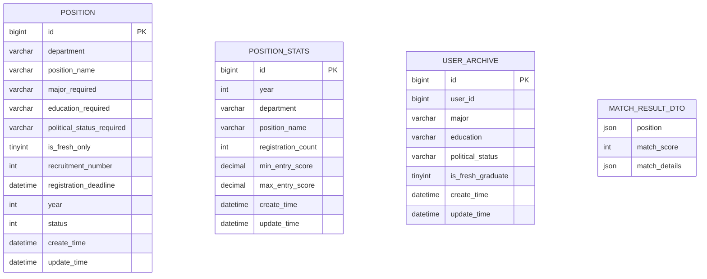
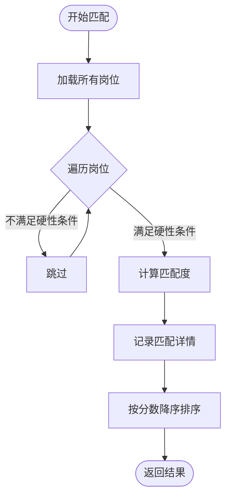
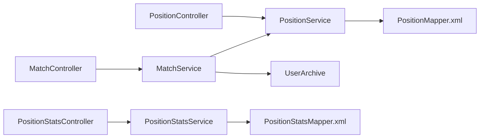

# 岗位管理API

<cite>
**本文引用的文件**
- [PositionController.java](file://src/main/java/com/macro/mall/tiny/modules/ums/controller/PositionController.java)
- [PositionStatsController.java](file://src/main/java/com/macro/mall/tiny/modules/ums/controller/PositionStatsController.java)
- [MatchController.java](file://src/main/java/com/macro/mall/tiny/modules/ums/controller/MatchController.java)
- [Position.java](file://src/main/java/com/macro/mall/tiny/modules/ums/model/Position.java)
- [PositionStats.java](file://src/main/java/com/macro/mall/tiny/modules/ums/model/PositionStats.java)
- [UserArchive.java](file://src/main/java/com/macro/mall/tiny/modules/ums/model/UserArchive.java)
- [PositionFilterParam.java](file://src/main/java/com/macro/mall/tiny/modules/ums/dto/PositionFilterParam.java)
- [MatchResultDto.java](file://src/main/java/com/macro/mall/tiny/modules/ums/dto/MatchResultDto.java)
- [PositionService.java](file://src/main/java/com/macro/mall/tiny/modules/ums/service/PositionService.java)
- [MatchService.java](file://src/main/java/com/macro/mall/tiny/modules/ums/service/MatchService.java)
- [PositionServiceImpl.java](file://src/main/java/com/macro/mall/tiny/modules/ums/service/impl/PositionServiceImpl.java)
- [MatchServiceImpl.java](file://src/main/java/com/macro/mall/tiny/modules/ums/service/impl/MatchServiceImpl.java)
- [PositionMapper.xml](file://src/main/resources/mapper/ums/PositionMapper.xml)
- [PositionStatsMapper.xml](file://src/main/resources/mapper/ums/PositionStatsMapper.xml)
- [README.md](file://README.md)
</cite>

## 目录
1. [简介](#简介)
2. [项目结构](#项目结构)
3. [核心组件](#核心组件)
4. [架构总览](#架构总览)
5. [详细组件分析](#详细组件分析)
6. [依赖分析](#依赖分析)
7. [性能考虑](#性能考虑)
8. [故障排查指南](#故障排查指南)
9. [结论](#结论)
10. [附录](#附录)

## 简介
本文件面向“岗位管理”模块，提供完整的API接口文档与技术实现说明，覆盖岗位CRUD、筛选、统计、智能匹配等能力。内容包括：
- 岗位管理API：创建、更新、删除、分页列表、条件筛选、统计查询
- 统计分析接口：报录比/分数线数据的增删改查与查询
- 智能匹配接口：基于用户档案的岗位推荐、匹配度计算与排序
- 数据模型：岗位、统计、用户档案、匹配结果等核心实体
- 业务规则：岗位分类与筛选、统计口径、匹配评分机制
- 实践示例：岗位创建流程、统计查询过程、智能匹配算法

## 项目结构
岗位管理模块位于 ums（用户权限管理）子模块下，采用典型的分层架构：
- 控制器层：对外暴露REST接口
- DTO/Model层：数据传输与持久化模型
- Service层：业务逻辑与策略
- Mapper/XML层：MyBatis映射

图表来源
- [PositionController.java:1-119](file://src/main/java/com/macro/mall/tiny/modules/ums/controller/PositionController.java#L1-L119)
- [PositionStatsController.java:1-82](file://src/main/java/com/macro/mall/tiny/modules/ums/controller/PositionStatsController.java#L1-L82)
- [MatchController.java:1-67](file://src/main/java/com/macro/mall/tiny/modules/ums/controller/MatchController.java#L1-L67)
- [PositionService.java:1-47](file://src/main/java/com/macro/mall/tiny/modules/ums/service/PositionService.java#L1-L47)
- [MatchService.java:1-21](file://src/main/java/com/macro/mall/tiny/modules/ums/service/MatchService.java#L1-L21)
- [PositionServiceImpl.java:1-219](file://src/main/java/com/macro/mall/tiny/modules/ums/service/impl/PositionServiceImpl.java#L1-L219)
- [MatchServiceImpl.java:1-367](file://src/main/java/com/macro/mall/tiny/modules/ums/service/impl/MatchServiceImpl.java#L1-L367)
- [PositionMapper.xml:1-22](file://src/main/resources/mapper/ums/PositionMapper.xml#L1-L22)
- [PositionStatsMapper.xml:1-19](file://src/main/resources/mapper/ums/PositionStatsMapper.xml#L1-L19)

章节来源
- [README.md:100-115](file://README.md#L100-L115)

## 核心组件
- 岗位实体：岗位基本信息、要求与状态
- 统计实体：报录比/分数线统计
- 用户档案：用户教育、专业、政治面貌、应届身份
- 筛选参数：年份、部门、学历/政治面貌等级、是否限应届等
- 匹配结果：岗位、匹配度分数、匹配详情

章节来源
- [Position.java:1-68](file://src/main/java/com/macro/mall/tiny/modules/ums/model/Position.java#L1-L68)
- [PositionStats.java:1-59](file://src/main/java/com/macro/mall/tiny/modules/ums/model/PositionStats.java#L1-L59)
- [UserArchive.java:1-55](file://src/main/java/com/macro/mall/tiny/modules/ums/model/UserArchive.java#L1-L55)
- [PositionFilterParam.java:1-41](file://src/main/java/com/macro/mall/tiny/modules/ums/dto/PositionFilterParam.java#L1-L41)
- [MatchResultDto.java:1-32](file://src/main/java/com/macro/mall/tiny/modules/ums/dto/MatchResultDto.java#L1-L32)

## 架构总览
岗位管理API遵循“控制器-服务-数据访问”的分层设计，控制器负责HTTP协议与参数解析，服务层封装业务规则，数据访问层通过MyBatis映射数据库。

图表来源
- [PositionController.java:37-95](file://src/main/java/com/macro/mall/tiny/modules/ums/controller/PositionController.java#L37-L95)
- [PositionStatsController.java:30-80](file://src/main/java/com/macro/mall/tiny/modules/ums/controller/PositionStatsController.java#L30-L80)
- [MatchController.java:41-65](file://src/main/java/com/macro/mall/tiny/modules/ums/controller/MatchController.java#L41-L65)
- [PositionServiceImpl.java:38-86](file://src/main/java/com/macro/mall/tiny/modules/ums/service/impl/PositionServiceImpl.java#L38-L86)
- [MatchServiceImpl.java:110-148](file://src/main/java/com/macro/mall/tiny/modules/ums/service/impl/MatchServiceImpl.java#L110-L148)

## 详细组件分析

### 岗位管理API
- 接口概览
  - 创建岗位：POST /position/create
  - 更新岗位：POST /position/update/{id}
  - 删除岗位：POST /position/delete/{id}
  - 获取岗位：GET /position/{id}
  - 分页列表：GET /position/list
  - 条件筛选：POST /position/filter
  - 报录比统计：GET /position/stats

- 关键实现要点
  - 岗位筛选支持年份、部门模糊匹配、学历/政治面貌等级筛选、是否限应届等条件，且默认过滤已删除记录
  - 删除采用“逻辑删除”，将状态置为已删除
  - 统计查询支持按部门、职位名称、年份过滤，并按年份降序排列

图表来源
- [PositionController.java:37-46](file://src/main/java/com/macro/mall/tiny/modules/ums/controller/PositionController.java#L37-L46)
- [PositionService.java:20-30](file://src/main/java/com/macro/mall/tiny/modules/ums/service/PositionService.java#L20-L30)
- [PositionServiceImpl.java:36-46](file://src/main/java/com/macro/mall/tiny/modules/ums/service/impl/PositionServiceImpl.java#L36-L46)
- [PositionMapper.xml:5-19](file://src/main/resources/mapper/ums/PositionMapper.xml#L5-L19)

章节来源
- [PositionController.java:37-117](file://src/main/java/com/macro/mall/tiny/modules/ums/controller/PositionController.java#L37-L117)
- [PositionServiceImpl.java:38-86](file://src/main/java/com/macro/mall/tiny/modules/ums/service/impl/PositionServiceImpl.java#L38-L86)
- [PositionMapper.xml:5-19](file://src/main/resources/mapper/ums/PositionMapper.xml#L5-L19)

### 岗位统计API
- 接口概览
  - 创建统计：POST /positionStats/create
  - 更新统计：POST /positionStats/update/{id}
  - 删除统计：POST /positionStats/delete/{id}
  - 获取统计：GET /positionStats/{id}
  - 分页列表：GET /positionStats/list

- 关键实现要点
  - 统计实体包含年份、部门、职位名称、报名人数、最低/最高进面分等字段
  - 控制器提供标准的增删改查与分页接口

图表来源
- [PositionStatsController.java:72-80](file://src/main/java/com/macro/mall/tiny/modules/ums/controller/PositionStatsController.java#L72-L80)
- [PositionStatsMapper.xml:5-16](file://src/main/resources/mapper/ums/PositionStatsMapper.xml#L5-L16)

章节来源
- [PositionStatsController.java:30-80](file://src/main/java/com/macro/mall/tiny/modules/ums/controller/PositionStatsController.java#L30-L80)
- [PositionStatsMapper.xml:5-16](file://src/main/resources/mapper/ums/PositionStatsMapper.xml#L5-L16)

### 岗位智能匹配API
- 接口概览
  - 一键匹配推荐：POST /match/recommend
- 工作流
  - 校验登录态与用户档案完整性
  - 查询所有岗位，逐条检查硬性条件
  - 计算匹配度（专业、学历、政治面貌）
  - 按匹配度降序排序返回

图表来源
- [MatchController.java:41-65](file://src/main/java/com/macro/mall/tiny/modules/ums/controller/MatchController.java#L41-L65)
- [MatchServiceImpl.java:110-148](file://src/main/java/com/macro/mall/tiny/modules/ums/service/impl/MatchServiceImpl.java#L110-L148)
- [PositionService.java:20-25](file://src/main/java/com/macro/mall/tiny/modules/ums/service/PositionService.java#L20-L25)

章节来源
- [MatchController.java:41-65](file://src/main/java/com/macro/mall/tiny/modules/ums/controller/MatchController.java#L41-L65)
- [MatchService.java:12-19](file://src/main/java/com/macro/mall/tiny/modules/ums/service/MatchService.java#L12-L19)
- [MatchServiceImpl.java:110-367](file://src/main/java/com/macro/mall/tiny/modules/ums/service/impl/MatchServiceImpl.java#L110-L367)

### 数据模型与字段说明
- 岗位（Position）
  - 字段：部门、职位名称、专业要求、学历要求、政治面貌要求、是否限应届、招录人数、报名截止时间、年份、状态、创建/更新时间
- 统计（PositionStats）
  - 字段：年份、部门、职位名称、报名人数、最低进面分、最高进面分、创建/更新时间
- 用户档案（UserArchive）
  - 字段：用户ID、专业、学历、政治面貌、是否应届、创建/更新时间
- 匹配结果（MatchResultDto）
  - 字段：岗位、匹配度分数、匹配详情

图表来源
- [Position.java:23-67](file://src/main/java/com/macro/mall/tiny/modules/ums/model/Position.java#L23-L67)
- [PositionStats.java:26-58](file://src/main/java/com/macro/mall/tiny/modules/ums/model/PositionStats.java#L26-L58)
- [UserArchive.java:25-54](file://src/main/java/com/macro/mall/tiny/modules/ums/model/UserArchive.java#L25-L54)
- [MatchResultDto.java:16-31](file://src/main/java/com/macro/mall/tiny/modules/ums/dto/MatchResultDto.java#L16-L31)

章节来源
- [Position.java:23-67](file://src/main/java/com/macro/mall/tiny/modules/ums/model/Position.java#L23-L67)
- [PositionStats.java:26-58](file://src/main/java/com/macro/mall/tiny/modules/ums/model/PositionStats.java#L26-L58)
- [UserArchive.java:25-54](file://src/main/java/com/macro/mall/tiny/modules/ums/model/UserArchive.java#L25-L54)
- [MatchResultDto.java:16-31](file://src/main/java/com/macro/mall/tiny/modules/ums/dto/MatchResultDto.java#L16-L31)

### 匹配算法与评分机制
- 硬性条件
  - 学历：用户学历等级 ≥ 岗位要求等级
  - 是否限应届：岗位限应届时，用户需为应届毕业生
  - 政治面貌：用户政治面貌等级 ≥ 岗位要求等级
- 匹配度计算
  - 专业：完全匹配+30分；属于同一专业大类+15分；否则0分
  - 学历：超出要求+10分；刚好满足+5分；否则0分
  - 政治面貌：满足要求+5分
- 结果排序
  - 按匹配度从高到低排序

图表来源
- [MatchServiceImpl.java:110-148](file://src/main/java/com/macro/mall/tiny/modules/ums/service/impl/MatchServiceImpl.java#L110-L148)
- [MatchServiceImpl.java:234-265](file://src/main/java/com/macro/mall/tiny/modules/ums/service/impl/MatchServiceImpl.java#L234-L265)

章节来源
- [MatchServiceImpl.java:150-229](file://src/main/java/com/macro/mall/tiny/modules/ums/service/impl/MatchServiceImpl.java#L150-L229)
- [MatchServiceImpl.java:231-367](file://src/main/java/com/macro/mall/tiny/modules/ums/service/impl/MatchServiceImpl.java#L231-L367)

### 数据验证与业务规则
- 岗位筛选
  - 年份、部门名称、是否限应届为精确/范围条件
  - 学历/政治面貌支持“等级上限”筛选（该等级及以下）
- 删除策略
  - 采用逻辑删除，将状态置为“已删除”
- 统计查询
  - 支持按部门、职位名称、年份过滤，按年份降序
- 匹配前置条件
  - 需要登录态与完整用户档案

章节来源
- [PositionServiceImpl.java:38-86](file://src/main/java/com/macro/mall/tiny/modules/ums/service/impl/PositionServiceImpl.java#L38-L86)
- [PositionServiceImpl.java:196-218](file://src/main/java/com/macro/mall/tiny/modules/ums/service/impl/PositionServiceImpl.java#L196-L218)
- [PositionController.java:97-117](file://src/main/java/com/macro/mall/tiny/modules/ums/controller/PositionController.java#L97-L117)
- [MatchController.java:41-65](file://src/main/java/com/macro/mall/tiny/modules/ums/controller/MatchController.java#L41-L65)

## 依赖分析
- 控制器依赖服务接口，服务实现依赖Mapper/XML进行数据访问
- 匹配服务依赖岗位列表与用户档案
- 筛选参数与匹配结果作为DTO参与接口交互

图表来源
- [PositionController.java:31-35](file://src/main/java/com/macro/mall/tiny/modules/ums/controller/PositionController.java#L31-L35)
- [PositionStatsController.java:27-28](file://src/main/java/com/macro/mall/tiny/modules/ums/controller/PositionStatsController.java#L27-L28)
- [MatchController.java:32-39](file://src/main/java/com/macro/mall/tiny/modules/ums/controller/MatchController.java#L32-L39)
- [MatchServiceImpl.java:33-34](file://src/main/java/com/macro/mall/tiny/modules/ums/service/impl/MatchServiceImpl.java#L33-L34)

章节来源
- [PositionController.java:31-35](file://src/main/java/com/macro/mall/tiny/modules/ums/controller/PositionController.java#L31-L35)
- [PositionStatsController.java:27-28](file://src/main/java/com/macro/mall/tiny/modules/ums/controller/PositionStatsController.java#L27-L28)
- [MatchController.java:32-39](file://src/main/java/com/macro/mall/tiny/modules/ums/controller/MatchController.java#L32-L39)
- [MatchServiceImpl.java:33-34](file://src/main/java/com/macro/mall/tiny/modules/ums/service/impl/MatchServiceImpl.java#L33-L34)

## 性能考虑
- 分页查询：使用MyBatis-Plus Page对象进行分页，避免一次性加载大量数据
- 筛选优化：对常用过滤字段（年份、部门、状态）建议建立索引
- 匹配性能：匹配算法遍历所有岗位，建议在数据量较大时增加缓存或分页匹配
- Excel导入：批量导入时注意内存占用与事务回滚控制

## 故障排查指南
- 统一响应
  - 成功/失败均通过统一结果包装返回，便于前端处理
- 参数校验
  - 接口参数建议结合Bean Validation进行校验（项目已集成）
- 日志追踪
  - 匹配服务包含详细日志，可用于定位问题
- 常见问题
  - 未登录或用户档案缺失：一键匹配接口会返回相应错误
  - 删除后仍可见：确认是否使用逻辑删除与过滤条件

章节来源
- [MatchController.java:41-65](file://src/main/java/com/macro/mall/tiny/modules/ums/controller/MatchController.java#L41-L65)
- [MatchServiceImpl.java:31](file://src/main/java/com/macro/mall/tiny/modules/ums/service/impl/MatchServiceImpl.java#L31)

## 结论
岗位管理模块提供了完善的岗位CRUD、筛选、统计与智能匹配能力，配合清晰的数据模型与业务规则，能够支撑从岗位发布到智能推荐的完整流程。建议在生产环境中进一步完善索引、缓存与监控，确保高并发场景下的稳定性与性能。

## 附录
- 接口调用示例（路径指引）
  - 岗位创建：POST /position/create（Body为岗位对象）
  - 岗位更新：POST /position/update/{id}（Body为岗位对象）
  - 岗位删除：POST /position/delete/{id}
  - 岗位详情：GET /position/{id}
  - 岗位分页：GET /position/list?pageNum&pageSize
  - 岗位筛选：POST /position/filter（Body为筛选参数）
  - 报录比统计：GET /position/stats?department&positionName&year
  - 统计管理：POST /positionStats/create、POST /positionStats/update/{id}、POST /positionStats/delete/{id}、GET /positionStats/{id}、GET /positionStats/list?pageNum&pageSize
  - 智能匹配：POST /match/recommend（需登录）

章节来源
- [README.md:100-115](file://README.md#L100-L115)
- [PositionController.java:37-117](file://src/main/java/com/macro/mall/tiny/modules/ums/controller/PositionController.java#L37-L117)
- [PositionStatsController.java:30-80](file://src/main/java/com/macro/mall/tiny/modules/ums/controller/PositionStatsController.java#L30-L80)
- [MatchController.java:41-65](file://src/main/java/com/macro/mall/tiny/modules/ums/controller/MatchController.java#L41-L65)