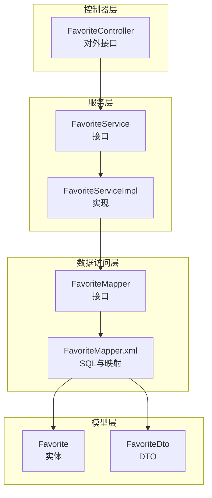
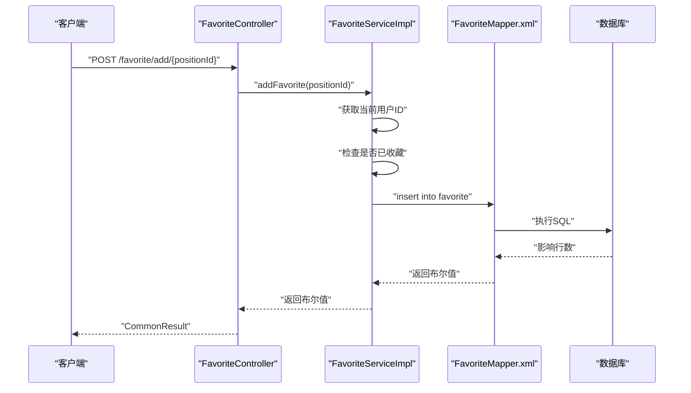
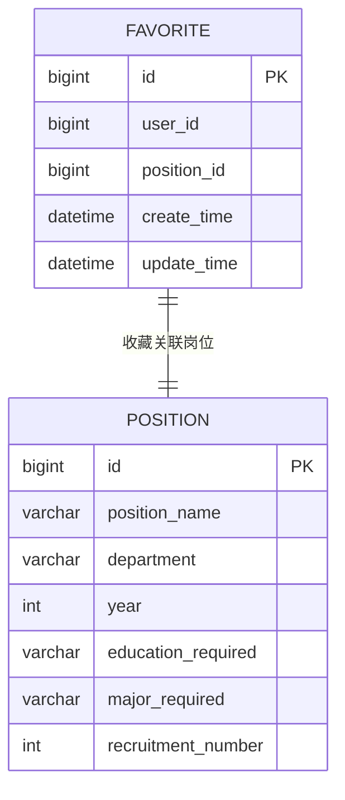
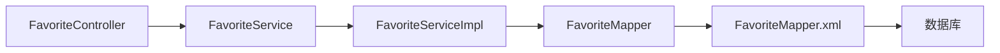

# 收藏管理API

<cite>
**本文引用的文件**
- [FavoriteController.java](file://src/main/java/com/macro/mall/tiny/modules/ums/controller/FavoriteController.java)
- [FavoriteService.java](file://src/main/java/com/macro/mall/tiny/modules/ums/service/FavoriteService.java)
- [FavoriteServiceImpl.java](file://src/main/java/com/macro/mall/tiny/modules/ums/service/impl/FavoriteServiceImpl.java)
- [Favorite.java](file://src/main/java/com/macro/mall/tiny/modules/ums/model/Favorite.java)
- [FavoriteDto.java](file://src/main/java/com/macro/mall/tiny/modules/ums/dto/FavoriteDto.java)
- [FavoriteMapper.java](file://src/main/java/com/macro/mall/tiny/modules/ums/mapper/FavoriteMapper.java)
- [FavoriteMapper.xml](file://src/main/resources/mapper/ums/FavoriteMapper.xml)
- [mall_tiny.sql](file://sql/mall_tiny.sql)
</cite>

## 目录
1. [简介](#简介)
2. [项目结构](#项目结构)
3. [核心组件](#核心组件)
4. [架构总览](#架构总览)
5. [详细组件分析](#详细组件分析)
6. [依赖分析](#依赖分析)
7. [性能考虑](#性能考虑)
8. [故障排查指南](#故障排查指南)
9. [结论](#结论)
10. [附录](#附录)

## 简介
本文件面向收藏管理模块的API接口文档，覆盖收藏CRUD与业务操作、收藏列表与分页查询、收藏状态检查、收藏DTO映射与权限控制等。同时对收藏数据模型进行说明，并给出典型调用示例与最佳实践建议。

## 项目结构
收藏管理模块位于ums子系统下，采用经典的分层架构：
- 控制器层：对外暴露REST接口
- 服务层：封装业务逻辑与权限校验
- 数据访问层：MyBatis映射XML负责SQL与DTO结果集映射
- 模型层：实体类与DTO类分别承载持久化与传输需求

**图表来源**
- [FavoriteController.java:1-131](file://src/main/java/com/macro/mall/tiny/modules/ums/controller/FavoriteController.java#L1-L131)
- [FavoriteService.java:1-55](file://src/main/java/com/macro/mall/tiny/modules/ums/service/FavoriteService.java#L1-L55)
- [FavoriteServiceImpl.java:1-109](file://src/main/java/com/macro/mall/tiny/modules/ums/service/impl/FavoriteServiceImpl.java#L1-L109)
- [FavoriteMapper.java:1-36](file://src/main/java/com/macro/mall/tiny/modules/ums/mapper/FavoriteMapper.java#L1-L36)
- [FavoriteMapper.xml:1-64](file://src/main/resources/mapper/ums/FavoriteMapper.xml#L1-L64)
- [Favorite.java:1-44](file://src/main/java/com/macro/mall/tiny/modules/ums/model/Favorite.java#L1-L44)
- [FavoriteDto.java:1-43](file://src/main/java/com/macro/mall/tiny/modules/ums/dto/FavoriteDto.java#L1-L43)

**章节来源**
- [FavoriteController.java:1-131](file://src/main/java/com/macro/mall/tiny/modules/ums/controller/FavoriteController.java#L1-L131)
- [FavoriteService.java:1-55](file://src/main/java/com/macro/mall/tiny/modules/ums/service/FavoriteService.java#L1-L55)
- [FavoriteServiceImpl.java:1-109](file://src/main/java/com/macro/mall/tiny/modules/ums/service/impl/FavoriteServiceImpl.java#L1-L109)
- [FavoriteMapper.java:1-36](file://src/main/java/com/macro/mall/tiny/modules/ums/mapper/FavoriteMapper.java#L1-L36)
- [FavoriteMapper.xml:1-64](file://src/main/resources/mapper/ums/FavoriteMapper.xml#L1-L64)
- [Favorite.java:1-44](file://src/main/java/com/macro/mall/tiny/modules/ums/model/Favorite.java#L1-L44)
- [FavoriteDto.java:1-43](file://src/main/java/com/macro/mall/tiny/modules/ums/dto/FavoriteDto.java#L1-L43)

## 核心组件
- 控制器：提供收藏添加、修改、删除、详情、列表、我的收藏、我的收藏分页、是否收藏等接口
- 服务接口与实现：封装收藏业务逻辑、权限校验、去重判断、分页查询
- 映射接口与XML：定义收藏列表与分页查询的SQL，以及实体与DTO的映射关系
- 实体与DTO：收藏实体与携带岗位信息的收藏DTO

**章节来源**
- [FavoriteController.java:22-131](file://src/main/java/com/macro/mall/tiny/modules/ums/controller/FavoriteController.java#L22-L131)
- [FavoriteService.java:18-55](file://src/main/java/com/macro/mall/tiny/modules/ums/service/FavoriteService.java#L18-L55)
- [FavoriteServiceImpl.java:27-109](file://src/main/java/com/macro/mall/tiny/modules/ums/service/impl/FavoriteServiceImpl.java#L27-L109)
- [FavoriteMapper.java:19-35](file://src/main/java/com/macro/mall/tiny/modules/ums/mapper/FavoriteMapper.java#L19-L35)
- [FavoriteMapper.xml:5-64](file://src/main/resources/mapper/ums/FavoriteMapper.xml#L5-L64)
- [Favorite.java:23-44](file://src/main/java/com/macro/mall/tiny/modules/ums/model/Favorite.java#L23-L44)
- [FavoriteDto.java:15-43](file://src/main/java/com/macro/mall/tiny/modules/ums/dto/FavoriteDto.java#L15-L43)

## 架构总览
收藏管理API遵循标准的MVC分层，请求通过控制器进入，服务层完成鉴权与业务处理，数据访问层执行SQL并返回DTO结果。

**图表来源**
- [FavoriteController.java:84-92](file://src/main/java/com/macro/mall/tiny/modules/ums/controller/FavoriteController.java#L84-L92)
- [FavoriteServiceImpl.java:30-47](file://src/main/java/com/macro/mall/tiny/modules/ums/service/impl/FavoriteServiceImpl.java#L30-L47)
- [FavoriteMapper.xml:28-43](file://src/main/resources/mapper/ums/FavoriteMapper.xml#L28-L43)

## 详细组件分析

### 控制器层：FavoriteController
- 收藏添加：POST /favorite/create（通用实体保存）
- 收藏修改：POST /favorite/update/{id}
- 收藏删除：POST /favorite/delete/{id}
- 收藏详情：GET /favorite/{id}
- 收藏列表：GET /favorite/list?pageNum&pageSize
- 便捷收藏：POST /favorite/add/{positionId}
- 便捷取消：POST /favorite/remove/{positionId}
- 我的收藏列表：GET /favorite/my
- 我的收藏分页：GET /favorite/my/page?pageNum&pageSize
- 是否收藏：GET /favorite/isFavorite/{positionId}

权限与返回：
- 所有接口均使用统一响应包装
- 便捷收藏/取消/我的收藏/是否收藏等依赖服务层从安全上下文提取当前用户ID

**章节来源**
- [FavoriteController.java:31-131](file://src/main/java/com/macro/mall/tiny/modules/ums/controller/FavoriteController.java#L31-L131)

### 服务层：FavoriteService 与 FavoriteServiceImpl
职责与要点：
- addFavorite：获取当前用户ID，若为空则失败；若已收藏则直接返回成功；否则创建收藏记录
- removeFavorite：按用户与岗位ID删除收藏
- getMyFavorites：返回当前用户收藏列表（DTO）
- getMyFavoritesPage：分页返回当前用户收藏列表（DTO）
- isFavorite：按用户与岗位ID判断是否已收藏
- 权限校验：通过Spring Security上下文获取当前用户ID

去重机制：
- 在添加收藏前先查询是否存在相同用户+岗位的记录，避免重复插入

**章节来源**
- [FavoriteService.java:18-55](file://src/main/java/com/macro/mall/tiny/modules/ums/service/FavoriteService.java#L18-L55)
- [FavoriteServiceImpl.java:29-92](file://src/main/java/com/macro/mall/tiny/modules/ums/service/impl/FavoriteServiceImpl.java#L29-L92)

### 数据访问层：FavoriteMapper 与 FavoriteMapper.xml
- selectFavoriteListByUserId：内连接position表，按收藏时间倒序返回收藏DTO列表
- selectFavoritePageByUserId：同上，支持分页
- 结果映射：FavoriteDtoMap将收藏记录与岗位信息映射到DTO

注意：
- SQL中使用INNER JOIN关联position表以填充岗位名称、部门、年份、学历要求、专业要求、招录人数等字段
- 排序依据为收藏创建时间（create_time）

**章节来源**
- [FavoriteMapper.java:21-34](file://src/main/java/com/macro/mall/tiny/modules/ums/mapper/FavoriteMapper.java#L21-L34)
- [FavoriteMapper.xml:14-61](file://src/main/resources/mapper/ums/FavoriteMapper.xml#L14-L61)

### 数据模型：Favorite 与 FavoriteDto
- Favorite（实体）：包含自增主键、用户ID、岗位ID、创建与更新时间
- FavoriteDto（传输对象）：在收藏基础上扩展岗位名称、部门、年份、收藏时间、学历要求、专业要求、招录人数等字段

**图表来源**
- [Favorite.java:27-40](file://src/main/java/com/macro/mall/tiny/modules/ums/model/Favorite.java#L27-L40)
- [FavoriteDto.java:19-41](file://src/main/java/com/macro/mall/tiny/modules/ums/dto/FavoriteDto.java#L19-L41)
- [FavoriteMapper.xml:28-61](file://src/main/resources/mapper/ums/FavoriteMapper.xml#L28-L61)

**章节来源**
- [Favorite.java:23-44](file://src/main/java/com/macro/mall/tiny/modules/ums/model/Favorite.java#L23-L44)
- [FavoriteDto.java:15-43](file://src/main/java/com/macro/mall/tiny/modules/ums/dto/FavoriteDto.java#L15-L43)
- [FavoriteMapper.xml:5-64](file://src/main/resources/mapper/ums/FavoriteMapper.xml#L5-L64)

## 依赖分析
- 控制器依赖服务接口
- 服务实现依赖Mapper接口
- Mapper XML依赖数据库表结构（favorite、position）
- 权限控制依赖Spring Security上下文

**图表来源**
- [FavoriteController.java:28-29](file://src/main/java/com/macro/mall/tiny/modules/ums/controller/FavoriteController.java#L28-L29)
- [FavoriteServiceImpl.java:7-13](file://src/main/java/com/macro/mall/tiny/modules/ums/service/impl/FavoriteServiceImpl.java#L7-L13)
- [FavoriteMapper.java:6-7](file://src/main/java/com/macro/mall/tiny/modules/ums/mapper/FavoriteMapper.java#L6-L7)
- [FavoriteMapper.xml:3](file://src/main/resources/mapper/ums/FavoriteMapper.xml#L3)

**章节来源**
- [FavoriteController.java:28-29](file://src/main/java/com/macro/mall/tiny/modules/ums/controller/FavoriteController.java#L28-L29)
- [FavoriteServiceImpl.java:7-13](file://src/main/java/com/macro/mall/tiny/modules/ums/service/impl/FavoriteServiceImpl.java#L7-L13)
- [FavoriteMapper.java:6-7](file://src/main/java/com/macro/mall/tiny/modules/ums/mapper/FavoriteMapper.java#L6-L7)
- [FavoriteMapper.xml:3](file://src/main/resources/mapper/ums/FavoriteMapper.xml#L3)

## 性能考虑
- 查询优化：收藏列表与分页查询基于INNER JOIN，建议在user_id与position_id建立合适索引以提升查询效率
- 去重策略：添加收藏前先查询是否已存在，避免重复写入
- 分页参数：列表与我的收藏分页接口提供pageNum与pageSize参数，建议前端合理设置分页大小
- DTO映射：通过XML结果映射一次性返回所需岗位信息，减少多次查询

[本节为通用性能建议，不直接分析具体文件]

## 故障排查指南
常见问题与定位思路：
- 未登录或用户ID为空：便捷收藏/取消/我的收藏/是否收藏等接口会检查当前用户ID，若为空则返回失败
- 重复收藏：添加收藏时已内置去重逻辑，如仍出现异常，检查数据库唯一性约束与事务一致性
- SQL映射错误：确认FavoriteMapper.xml中的列名与表结构一致，特别是create_time映射到DTO的favoriteTime
- 权限不足：确保调用方具备相应权限，控制器层依赖Spring Security进行认证

**章节来源**
- [FavoriteServiceImpl.java:97-107](file://src/main/java/com/macro/mall/tiny/modules/ums/service/impl/FavoriteServiceImpl.java#L97-L107)
- [FavoriteMapper.xml:15-25](file://src/main/resources/mapper/ums/FavoriteMapper.xml#L15-L25)

## 结论
收藏管理模块提供了完善的收藏CRUD与便捷操作接口，结合服务层的权限校验与去重机制，能够稳定支撑收藏列表、分页查询与状态检查等核心业务。通过清晰的分层设计与DTO映射，实现了收藏与岗位信息的一体化展示。

[本节为总结性内容，不直接分析具体文件]

## 附录

### 接口定义与调用示例

- 收藏添加（通用）
  - 方法：POST
  - 路径：/favorite/create
  - 请求体：Favorite实体
  - 返回：CommonResult

- 收藏修改
  - 方法：POST
  - 路径：/favorite/update/{id}
  - 请求体：Favorite实体
  - 返回：CommonResult

- 收藏删除
  - 方法：POST
  - 路径：/favorite/delete/{id}
  - 返回：CommonResult

- 收藏详情
  - 方法：GET
  - 路径：/favorite/{id}
  - 返回：Favorite实体

- 收藏列表（分页）
  - 方法：GET
  - 路径：/favorite/list
  - 参数：pageNum（默认1）、pageSize（默认5）
  - 返回：分页的Favorite列表

- 便捷收藏
  - 方法：POST
  - 路径：/favorite/add/{positionId}
  - 返回：CommonResult

- 便捷取消
  - 方法：POST
  - 路径：/favorite/remove/{positionId}
  - 返回：CommonResult

- 我的收藏列表
  - 方法：GET
  - 路径：/favorite/my
  - 返回：FavoriteDto列表

- 我的收藏分页
  - 方法：GET
  - 路径：/favorite/my/page
  - 参数：pageNum（默认1）、pageSize（默认10）
  - 返回：分页的FavoriteDto列表

- 是否收藏
  - 方法：GET
  - 路径：/favorite/isFavorite/{positionId}
  - 返回：布尔值

调用示例（流程示意）：
- 收藏添加流程：客户端调用“便捷收藏”接口 → 服务层获取当前用户ID并去重检查 → 插入收藏记录 → 返回成功
- 收藏列表展示：客户端调用“我的收藏分页”接口 → 服务层分页查询收藏列表 → 返回包含岗位信息的DTO分页结果
- 统计查询：当前模块未提供专门的收藏统计接口，可基于收藏列表与岗位信息进行二次统计（例如按部门/年份聚合）

**章节来源**
- [FavoriteController.java:31-131](file://src/main/java/com/macro/mall/tiny/modules/ums/controller/FavoriteController.java#L31-L131)
- [FavoriteServiceImpl.java:30-79](file://src/main/java/com/macro/mall/tiny/modules/ums/service/impl/FavoriteServiceImpl.java#L30-L79)
- [FavoriteMapper.xml:28-61](file://src/main/resources/mapper/ums/FavoriteMapper.xml#L28-L61)

### 权限控制与去重机制
- 权限控制：通过Spring Security从上下文中获取当前用户ID，所有与“我的收藏”相关的接口均依赖此机制
- 去重机制：添加收藏前查询是否存在相同用户+岗位的记录，避免重复收藏

**章节来源**
- [FavoriteServiceImpl.java:97-92](file://src/main/java/com/macro/mall/tiny/modules/ums/service/impl/FavoriteServiceImpl.java#L97-L92)
- [FavoriteServiceImpl.java:30-47](file://src/main/java/com/macro/mall/tiny/modules/ums/service/impl/FavoriteServiceImpl.java#L30-L47)

### 数据库表结构与约束
- 收藏表：包含自增主键、用户ID、岗位ID、创建与更新时间
- 岗位表：包含岗位名称、部门、年份、学历要求、专业要求、招录人数等字段
- 关系：收藏表通过position_id关联岗位表

说明：收藏表结构与关联字段以XML映射为准，具体字段与索引请参考映射文件与数据库实际结构。

**章节来源**
- [FavoriteMapper.xml:5-12](file://src/main/resources/mapper/ums/FavoriteMapper.xml#L5-L12)
- [FavoriteMapper.xml:28-61](file://src/main/resources/mapper/ums/FavoriteMapper.xml#L28-L61)