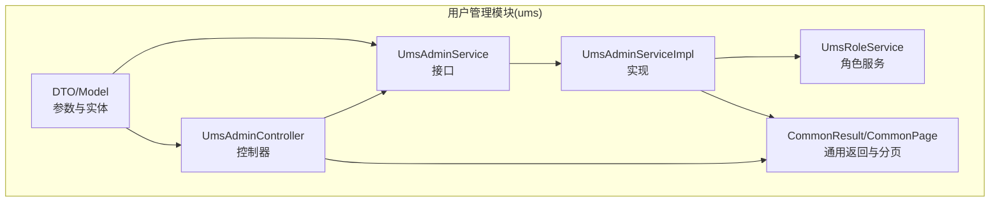
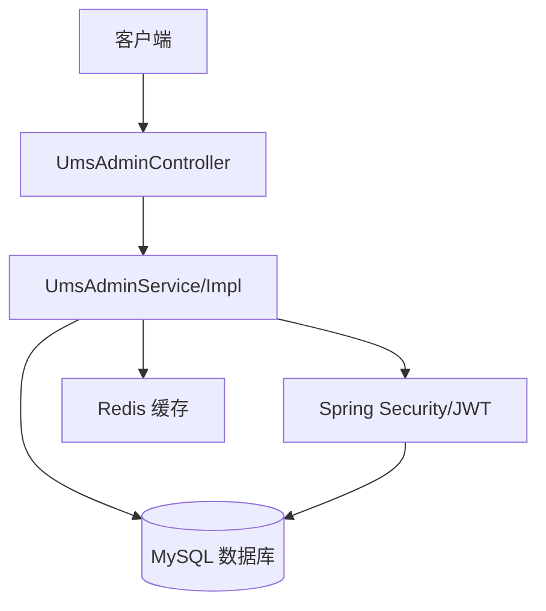
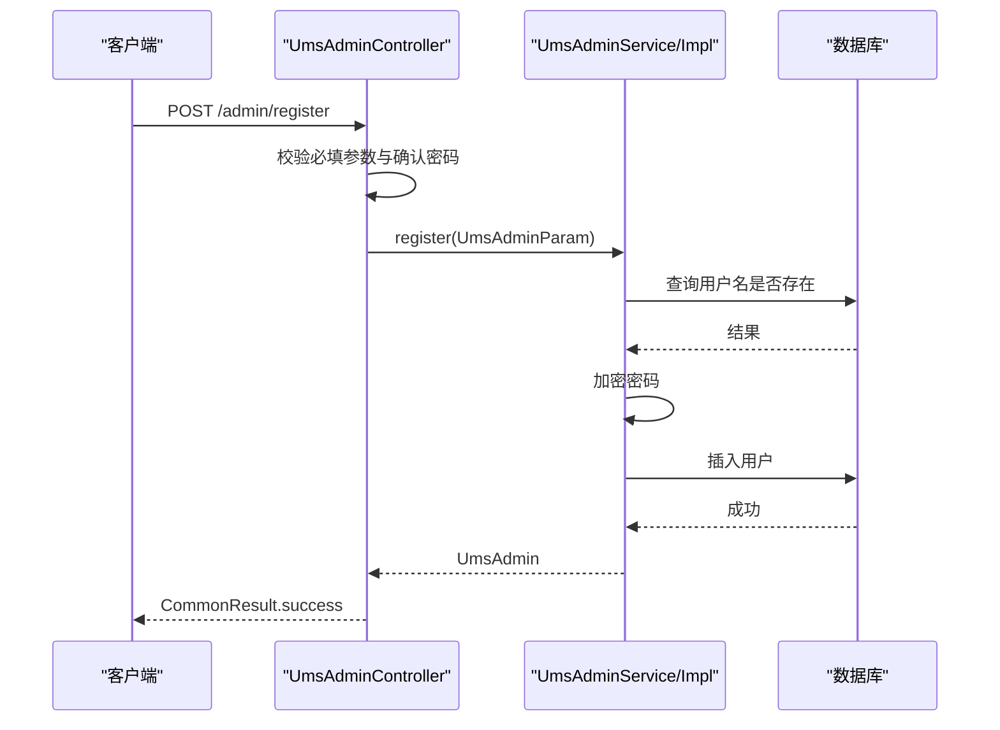
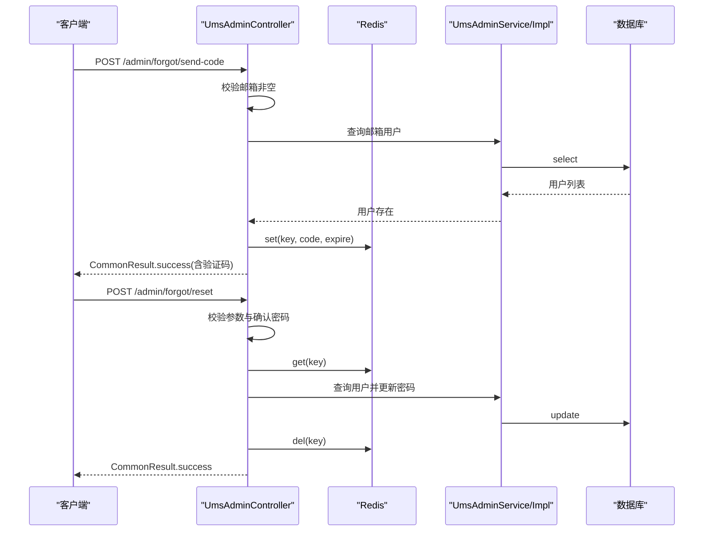
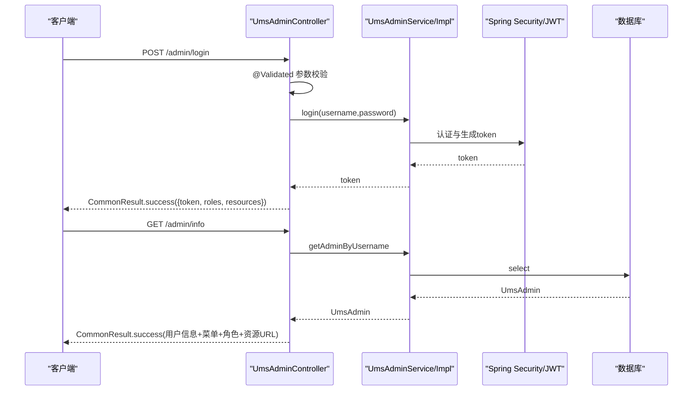
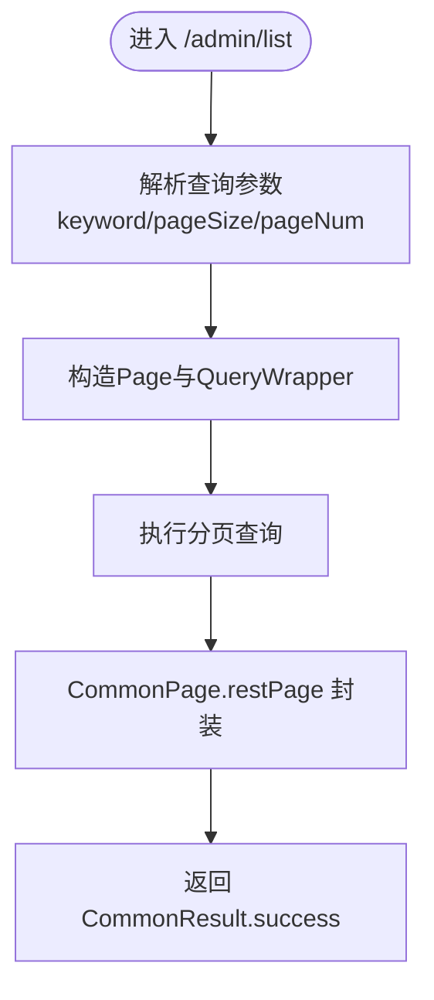
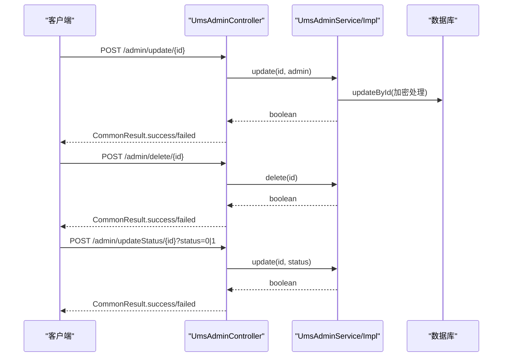
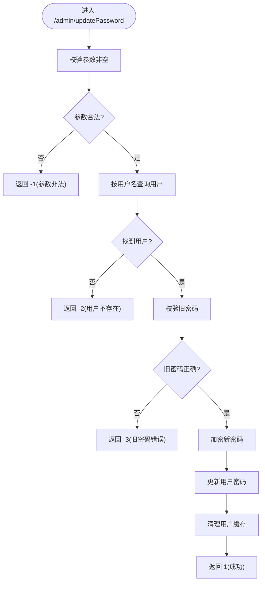
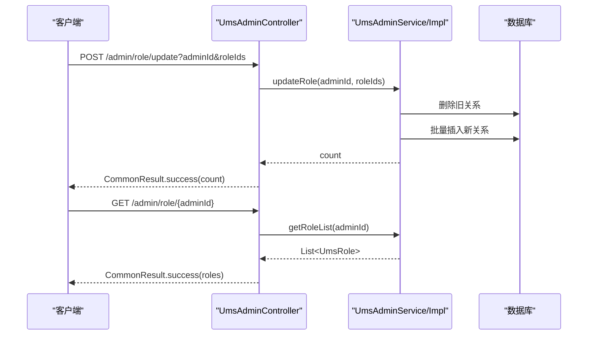
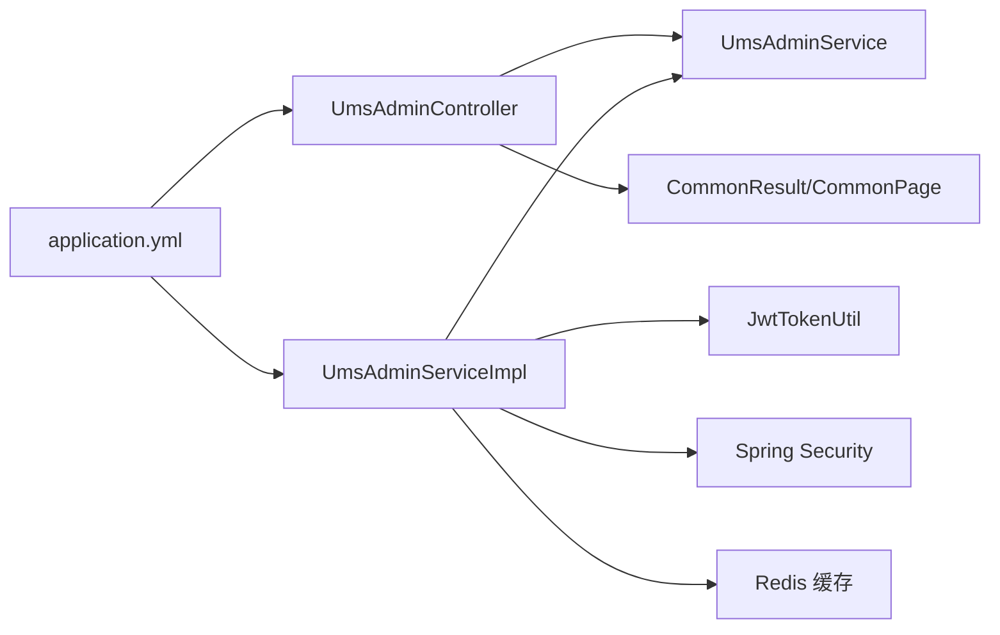

# 用户管理API

<cite>
**本文引用的文件**
- [UmsAdminController.java](file://src/main/java/com/macro/mall/tiny/modules/ums/controller/UmsAdminController.java)
- [UmsAdminService.java](file://src/main/java/com/macro/mall/tiny/modules/ums/service/UmsAdminService.java)
- [UmsAdminServiceImpl.java](file://src/main/java/com/macro/mall/tiny/modules/ums/service/impl/UmsAdminServiceImpl.java)
- [UmsRoleService.java](file://src/main/java/com/macro/mall/tiny/modules/ums/service/UmsRoleService.java)
- [UmsAdminParam.java](file://src/main/java/com/macro/mall/tiny/modules/ums/dto/UmsAdminParam.java)
- [UpdateAdminPasswordParam.java](file://src/main/java/com/macro/mall/tiny/modules/ums/dto/UpdateAdminPasswordParam.java)
- [UmsAdminLoginParam.java](file://src/main/java/com/macro/mall/tiny/modules/ums/dto/UmsAdminLoginParam.java)
- [UmsAdmin.java](file://src/main/java/com/macro/mall/tiny/modules/ums/model/UmsAdmin.java)
- [UmsRole.java](file://src/main/java/com/macro/mall/tiny/modules/ums/model/UmsRole.java)
- [UmsResource.java](file://src/main/java/com/macro/mall/tiny/modules/ums/model/UmsResource.java)
- [CommonPage.java](file://src/main/java/com/macro/mall/tiny/common/api/CommonPage.java)
- [CommonResult.java](file://src/main/java/com/macro/mall/tiny/common/api/CommonResult.java)
- [application.yml](file://src/main/resources/application.yml)
- [UmsAdminControllerTest.java](file://src/test/java/com/macro/mall/tiny/modules/ums/controller/UmsAdminControllerTest.java)
- [README.md](file://README.md)
</cite>

## 目录
1. [简介](#简介)
2. [项目结构](#项目结构)
3. [核心组件](#核心组件)
4. [架构总览](#架构总览)
5. [详细组件分析](#详细组件分析)
6. [依赖分析](#依赖分析)
7. [性能考虑](#性能考虑)
8. [故障排查指南](#故障排查指南)
9. [结论](#结论)
10. [附录](#附录)

## 简介
本文件为“用户管理模块”的API接口文档，覆盖用户CRUD、分页查询、登录/登出、密码修改、状态管理、角色分配与查询等能力。文档同时给出统一分页规范、参数校验规则、权限控制要求以及常见错误处理机制，并提供典型调用示例与最佳实践。

## 项目结构
用户管理模块位于 ums 子模块下，采用按职责分层的组织方式：
- controller 层：对外暴露REST接口，负责请求接收、参数校验、响应封装
- service 层：业务逻辑编排，含缓存、鉴权、密码编码等
- mapper/model/dto：数据模型与传输对象
- common：通用返回体、分页封装
- resources：配置文件与MyBatis映射XML

图表来源
- [UmsAdminController.java:1-350](file://src/main/java/com/macro/mall/tiny/modules/ums/controller/UmsAdminController.java#L1-L350)
- [UmsAdminService.java:1-90](file://src/main/java/com/macro/mall/tiny/modules/ums/service/UmsAdminService.java#L1-L90)
- [UmsAdminServiceImpl.java:1-272](file://src/main/java/com/macro/mall/tiny/modules/ums/service/impl/UmsAdminServiceImpl.java#L1-L272)
- [UmsRoleService.java:1-59](file://src/main/java/com/macro/mall/tiny/modules/ums/service/UmsRoleService.java#L1-L59)
- [CommonResult.java:1-125](file://src/main/java/com/macro/mall/tiny/common/api/CommonResult.java#L1-L125)
- [CommonPage.java:1-72](file://src/main/java/com/macro/mall/tiny/common/api/CommonPage.java#L1-L72)

章节来源
- [README.md:61-87](file://README.md#L61-L87)

## 核心组件
- 控制器：UmsAdminController 提供用户注册、登录、刷新token、获取当前用户信息、登出、分页查询、详情、更新、删除、状态变更、密码修改、角色分配与查询等接口
- 服务接口：UmsAdminService 定义用户相关业务契约
- 服务实现：UmsAdminServiceImpl 实现注册、登录、分页查询、更新、删除、角色分配、密码修改、资源权限加载等
- 角色服务：UmsRoleService 提供角色相关能力（菜单、资源、分页）
- DTO/Model：UmsAdminParam、UpdateAdminPasswordParam、UmsAdminLoginParam、UmsAdmin、UmsRole、UmsResource
- 通用封装：CommonResult、CommonPage

章节来源
- [UmsAdminController.java:43-350](file://src/main/java/com/macro/mall/tiny/modules/ums/controller/UmsAdminController.java#L43-L350)
- [UmsAdminService.java:19-89](file://src/main/java/com/macro/mall/tiny/modules/ums/service/UmsAdminService.java#L19-L89)
- [UmsAdminServiceImpl.java:48-272](file://src/main/java/com/macro/mall/tiny/modules/ums/service/impl/UmsAdminServiceImpl.java#L48-L272)
- [UmsRoleService.java:16-59](file://src/main/java/com/macro/mall/tiny/modules/ums/service/UmsRoleService.java#L16-L59)
- [UmsAdminParam.java:14-33](file://src/main/java/com/macro/mall/tiny/modules/ums/dto/UmsAdminParam.java#L14-L33)
- [UpdateAdminPasswordParam.java:13-26](file://src/main/java/com/macro/mall/tiny/modules/ums/dto/UpdateAdminPasswordParam.java#L13-L26)
- [UmsAdminLoginParam.java:13-23](file://src/main/java/com/macro/mall/tiny/modules/ums/dto/UmsAdminLoginParam.java#L13-L23)
- [UmsAdmin.java:21-59](file://src/main/java/com/macro/mall/tiny/modules/ums/model/UmsAdmin.java#L21-L59)
- [UmsRole.java:21-51](file://src/main/java/com/macro/mall/tiny/modules/ums/model/UmsRole.java#L21-L51)
- [UmsResource.java:21-49](file://src/main/java/com/macro/mall/tiny/modules/ums/model/UmsResource.java#L21-L49)
- [CommonResult.java:7-125](file://src/main/java/com/macro/mall/tiny/common/api/CommonResult.java#L7-L125)
- [CommonPage.java:12-72](file://src/main/java/com/macro/mall/tiny/common/api/CommonPage.java#L12-L72)

## 架构总览
用户管理API遵循典型的分层架构，控制器负责HTTP协议细节，服务层承载业务规则，数据访问层由MyBatis-Plus提供支持。系统通过Spring Security与JWT实现认证与授权，Redis用于缓存用户与资源列表，提升性能与一致性。

图表来源
- [UmsAdminController.java:43-350](file://src/main/java/com/macro/mall/tiny/modules/ums/controller/UmsAdminController.java#L43-L350)
- [UmsAdminServiceImpl.java:48-272](file://src/main/java/com/macro/mall/tiny/modules/ums/service/impl/UmsAdminServiceImpl.java#L48-L272)
- [application.yml:24-57](file://src/main/resources/application.yml#L24-L57)

## 详细组件分析

### 用户注册
- 接口：POST /admin/register
- 功能：校验必填参数、确认密码一致性、检查用户名唯一性、加密保存
- 关键点：密码使用PasswordEncoder加密；成功返回通用成功响应
- 参数校验：用户名与密码非空；确认密码需与新密码一致；用户名不可重复
- 响应：CommonResult.success

图表来源
- [UmsAdminController.java:62-94](file://src/main/java/com/macro/mall/tiny/modules/ums/controller/UmsAdminController.java#L62-L94)
- [UmsAdminServiceImpl.java:78-96](file://src/main/java/com/macro/mall/tiny/modules/ums/service/impl/UmsAdminServiceImpl.java#L78-L96)
- [UmsAdminParam.java:14-33](file://src/main/java/com/macro/mall/tiny/modules/ums/dto/UmsAdminParam.java#L14-L33)

章节来源
- [UmsAdminController.java:62-94](file://src/main/java/com/macro/mall/tiny/modules/ums/controller/UmsAdminController.java#L62-L94)
- [UmsAdminServiceImpl.java:78-96](file://src/main/java/com/macro/mall/tiny/modules/ums/service/impl/UmsAdminServiceImpl.java#L78-L96)
- [UmsAdminParam.java:14-33](file://src/main/java/com/macro/mall/tiny/modules/ums/dto/UmsAdminParam.java#L14-L33)

### 忘记密码（验证码）
- 发送验证码：POST /admin/forgot/send-code
  - 校验邮箱非空，查询是否存在该邮箱用户，生成6位数字验证码，存入Redis并设置过期时间，返回提示与验证码（演示）
- 重置密码：POST /admin/forgot/reset
  - 校验参数完整性、新旧密码一致性、验证码有效性，查找用户并更新密码，清除缓存，删除验证码

图表来源
- [UmsAdminController.java:96-164](file://src/main/java/com/macro/mall/tiny/modules/ums/controller/UmsAdminController.java#L96-L164)
- [UmsAdminServiceImpl.java:234-254](file://src/main/java/com/macro/mall/tiny/modules/ums/service/impl/UmsAdminServiceImpl.java#L234-L254)

章节来源
- [UmsAdminController.java:96-164](file://src/main/java/com/macro/mall/tiny/modules/ums/controller/UmsAdminController.java#L96-L164)
- [UmsAdminServiceImpl.java:234-254](file://src/main/java/com/macro/mall/tiny/modules/ums/service/impl/UmsAdminServiceImpl.java#L234-L254)

### 登录/登出/刷新Token/当前用户信息
- 登录：POST /admin/login
  - 参数校验（用户名/密码非空），调用服务登录，生成JWT，返回token与角色、资源URL列表
- 刷新Token：GET /admin/refreshToken
  - 从请求头读取Authorization，调用服务刷新
- 当前用户信息：GET /admin/info
  - 通过Security上下文获取当前用户，返回基础信息、菜单、角色、资源URL
- 登出：POST /admin/logout
  - 返回通用成功响应（实际登出由前端移除本地token）

图表来源
- [UmsAdminController.java:166-257](file://src/main/java/com/macro/mall/tiny/modules/ums/controller/UmsAdminController.java#L166-L257)
- [UmsAdminServiceImpl.java:98-151](file://src/main/java/com/macro/mall/tiny/modules/ums/service/impl/UmsAdminServiceImpl.java#L98-L151)
- [UmsAdminLoginParam.java:13-23](file://src/main/java/com/macro/mall/tiny/modules/ums/dto/UmsAdminLoginParam.java#L13-L23)

章节来源
- [UmsAdminController.java:166-257](file://src/main/java/com/macro/mall/tiny/modules/ums/controller/UmsAdminController.java#L166-L257)
- [UmsAdminServiceImpl.java:98-151](file://src/main/java/com/macro/mall/tiny/modules/ums/service/impl/UmsAdminServiceImpl.java#L98-L151)
- [UmsAdminLoginParam.java:13-23](file://src/main/java/com/macro/mall/tiny/modules/ums/dto/UmsAdminLoginParam.java#L13-L23)

### 分页查询与详情
- 分页查询用户列表：GET /admin/list
  - 支持关键字keyword（用户名/昵称模糊匹配）、pageSize、pageNum
  - 返回CommonPage封装的分页结果
- 获取指定用户：GET /admin/{id}

图表来源
- [UmsAdminController.java:259-267](file://src/main/java/com/macro/mall/tiny/modules/ums/controller/UmsAdminController.java#L259-L267)
- [UmsAdminServiceImpl.java:153-163](file://src/main/java/com/macro/mall/tiny/modules/ums/service/impl/UmsAdminServiceImpl.java#L153-L163)
- [CommonPage.java:22-30](file://src/main/java/com/macro/mall/tiny/common/api/CommonPage.java#L22-L30)

章节来源
- [UmsAdminController.java:259-267](file://src/main/java/com/macro/mall/tiny/modules/ums/controller/UmsAdminController.java#L259-L267)
- [UmsAdminServiceImpl.java:153-163](file://src/main/java/com/macro/mall/tiny/modules/ums/service/impl/UmsAdminServiceImpl.java#L153-L163)
- [CommonPage.java:22-30](file://src/main/java/com/macro/mall/tiny/common/api/CommonPage.java#L22-L30)

### 用户更新、删除、状态变更
- 更新用户：POST /admin/update/{id}
  - 若提交的新密码与原加密一致则忽略；否则加密后更新；清理缓存
- 删除用户：POST /admin/delete/{id}
  - 删除用户并清理相关缓存
- 更新状态：POST /admin/updateStatus/{id}?status=0|1

图表来源
- [UmsAdminController.java:277-328](file://src/main/java/com/macro/mall/tiny/modules/ums/controller/UmsAdminController.java#L277-L328)
- [UmsAdminServiceImpl.java:165-191](file://src/main/java/com/macro/mall/tiny/modules/ums/service/impl/UmsAdminServiceImpl.java#L165-L191)

章节来源
- [UmsAdminController.java:277-328](file://src/main/java/com/macro/mall/tiny/modules/ums/controller/UmsAdminController.java#L277-L328)
- [UmsAdminServiceImpl.java:165-191](file://src/main/java/com/macro/mall/tiny/modules/ums/service/impl/UmsAdminServiceImpl.java#L165-L191)

### 密码修改（当前密码验证 + 新密码设置）
- 接口：POST /admin/updatePassword
- 参数：username、oldPassword、newPassword（确认密码不在接口内校验，但服务端会保证新旧一致）
- 校验逻辑：
  - 参数非空校验
  - 通过username查询用户是否存在
  - 使用PasswordEncoder校验旧密码
  - 加密新密码并更新，清理用户缓存
- 返回值：成功返回正数；参数非法返回-1；用户不存在返回-2；旧密码错误返回-3

图表来源
- [UmsAdminController.java:288-304](file://src/main/java/com/macro/mall/tiny/modules/ums/controller/UmsAdminController.java#L288-L304)
- [UmsAdminServiceImpl.java:233-254](file://src/main/java/com/macro/mall/tiny/modules/ums/service/impl/UmsAdminServiceImpl.java#L233-L254)
- [UpdateAdminPasswordParam.java:13-26](file://src/main/java/com/macro/mall/tiny/modules/ums/dto/UpdateAdminPasswordParam.java#L13-L26)

章节来源
- [UmsAdminController.java:288-304](file://src/main/java/com/macro/mall/tiny/modules/ums/controller/UmsAdminController.java#L288-L304)
- [UmsAdminServiceImpl.java:233-254](file://src/main/java/com/macro/mall/tiny/modules/ums/service/impl/UmsAdminServiceImpl.java#L233-L254)
- [UpdateAdminPasswordParam.java:13-26](file://src/main/java/com/macro/mall/tiny/modules/ums/dto/UpdateAdminPasswordParam.java#L13-L26)

### 角色分配与查询
- 分配角色：POST /admin/role/update
  - 参数：adminId、roleIds（List<Long>）
  - 先删除旧关系，再批量插入新关系；清理资源缓存
- 查询用户角色：GET /admin/role/{adminId}
  - 返回该用户的角色列表

图表来源
- [UmsAdminController.java:330-348](file://src/main/java/com/macro/mall/tiny/modules/ums/controller/UmsAdminController.java#L330-L348)
- [UmsAdminServiceImpl.java:193-213](file://src/main/java/com/macro/mall/tiny/modules/ums/service/impl/UmsAdminServiceImpl.java#L193-L213)
- [UmsRoleService.java:16-59](file://src/main/java/com/macro/mall/tiny/modules/ums/service/UmsRoleService.java#L16-L59)

章节来源
- [UmsAdminController.java:330-348](file://src/main/java/com/macro/mall/tiny/modules/ums/controller/UmsAdminController.java#L330-L348)
- [UmsAdminServiceImpl.java:193-213](file://src/main/java/com/macro/mall/tiny/modules/ums/service/impl/UmsAdminServiceImpl.java#L193-L213)
- [UmsRoleService.java:16-59](file://src/main/java/com/macro/mall/tiny/modules/ums/service/UmsRoleService.java#L16-L59)

## 依赖分析
- 控制器依赖服务接口与通用返回封装
- 服务实现依赖Mapper、缓存服务、JWT工具、Spring Security
- 配置文件定义JWT头、白名单路径、Redis键空间等

图表来源
- [UmsAdminController.java:43-350](file://src/main/java/com/macro/mall/tiny/modules/ums/controller/UmsAdminController.java#L43-L350)
- [UmsAdminServiceImpl.java:48-272](file://src/main/java/com/macro/mall/tiny/modules/ums/service/impl/UmsAdminServiceImpl.java#L48-L272)
- [application.yml:24-57](file://src/main/resources/application.yml#L24-L57)

章节来源
- [UmsAdminController.java:43-350](file://src/main/java/com/macro/mall/tiny/modules/ums/controller/UmsAdminController.java#L43-L350)
- [UmsAdminServiceImpl.java:48-272](file://src/main/java/com/macro/mall/tiny/modules/ums/service/impl/UmsAdminServiceImpl.java#L48-L272)
- [application.yml:24-57](file://src/main/resources/application.yml#L24-L57)

## 性能考虑
- 缓存策略：用户信息与资源列表通过Redis缓存，减少数据库压力；更新/删除后及时清理缓存
- 分页查询：使用MyBatis-Plus Page对象，避免一次性加载全量数据
- 密码处理：使用PasswordEncoder进行加密，避免明文存储
- Token管理：JWT作为无状态认证载体，结合白名单与过期策略

## 故障排查指南
- 登录失败
  - 现象：返回参数校验失败或用户名/密码错误
  - 排查：确认请求体格式、用户名/密码非空；检查服务端日志
- 注册失败
  - 现象：返回操作失败或用户名重复
  - 排查：确认用户名唯一性；检查密码加密流程
- 密码修改失败
  - 现象：返回参数非法、用户不存在、旧密码错误
  - 排查：核对username、oldPassword、newPassword；确认旧密码正确
- 角色分配异常
  - 现象：返回失败
  - 排查：确认adminId与roleIds有效；检查数据库事务与缓存清理

章节来源
- [UmsAdminControllerTest.java:50-182](file://src/test/java/com/macro/mall/tiny/modules/ums/controller/UmsAdminControllerTest.java#L50-L182)
- [UmsAdminController.java:166-257](file://src/main/java/com/macro/mall/tiny/modules/ums/controller/UmsAdminController.java#L166-L257)
- [UmsAdminServiceImpl.java:233-254](file://src/main/java/com/macro/mall/tiny/modules/ums/service/impl/UmsAdminServiceImpl.java#L233-L254)

## 结论
用户管理API围绕Spring Security与JWT实现了完善的认证与授权体系，配合Redis缓存与MyBatis-Plus分页，具备良好的扩展性与性能表现。通过统一的返回体与分页规范，便于前后端协作与接口治理。

## 附录

### 统一分页规范
- 查询参数
  - keyword：可选，支持用户名/昵称模糊匹配
  - pageSize：可选，默认5，最大限制可在服务端控制
  - pageNum：可选，默认1
- 返回结构
  - 使用CommonPage封装：pageNum、pageSize、totalPage、total、list
  - 服务端通过CommonPage.restPage(Page)转换

章节来源
- [UmsAdminController.java:259-267](file://src/main/java/com/macro/mall/tiny/modules/ums/controller/UmsAdminController.java#L259-L267)
- [UmsAdminServiceImpl.java:153-163](file://src/main/java/com/macro/mall/tiny/modules/ums/service/impl/UmsAdminServiceImpl.java#L153-L163)
- [CommonPage.java:22-30](file://src/main/java/com/macro/mall/tiny/common/api/CommonPage.java#L22-L30)

### 参数验证规则
- 登录参数：用户名与密码均非空
- 注册参数：用户名与密码非空，确认密码需与密码一致
- 忘记密码：邮箱非空，验证码非空，新旧密码一致
- 密码修改：username、oldPassword、newPassword非空

章节来源
- [UmsAdminLoginParam.java:13-23](file://src/main/java/com/macro/mall/tiny/modules/ums/dto/UmsAdminLoginParam.java#L13-L23)
- [UmsAdminParam.java:14-33](file://src/main/java/com/macro/mall/tiny/modules/ums/dto/UmsAdminParam.java#L14-L33)
- [UpdateAdminPasswordParam.java:13-26](file://src/main/java/com/macro/mall/tiny/modules/ums/dto/UpdateAdminPasswordParam.java#L13-L26)
- [UmsAdminController.java:62-94](file://src/main/java/com/macro/mall/tiny/modules/ums/controller/UmsAdminController.java#L62-L94)

### 权限控制要求
- 白名单路径：Swagger、登录、注册、忘记密码、当前用户信息、登出等
- 非白名单接口需携带Authorization头（JWT），由Spring Security拦截校验

章节来源
- [application.yml:38-57](file://src/main/resources/application.yml#L38-L57)
- [README.md:300-313](file://README.md#L300-L313)

### 接口调用示例（步骤说明）
- 用户注册流程
  1) 准备注册参数（用户名、密码、确认密码、昵称、邮箱）
  2) 调用 POST /admin/register
  3) 校验返回结果，成功后可进行登录
- 管理员用户管理
  1) 登录获取token
  2) 分页查询用户：GET /admin/list?keyword=&pageSize=&pageNum=
  3) 获取单个用户：GET /admin/{id}
  4) 更新用户：POST /admin/update/{id}
  5) 删除用户：POST /admin/delete/{id}
  6) 更新状态：POST /admin/updateStatus/{id}?status=0|1
- 密码修改
  1) 准备参数（username、oldPassword、newPassword）
  2) 调用 POST /admin/updatePassword
  3) 校验返回状态码（1为成功，-1/-2/-3为不同失败原因）

章节来源
- [UmsAdminController.java:62-328](file://src/main/java/com/macro/mall/tiny/modules/ums/controller/UmsAdminController.java#L62-L328)
- [UmsAdminServiceImpl.java:78-96](file://src/main/java/com/macro/mall/tiny/modules/ums/service/impl/UmsAdminServiceImpl.java#L78-L96)
- [UmsAdminControllerTest.java:112-182](file://src/test/java/com/macro/mall/tiny/modules/ums/controller/UmsAdminControllerTest.java#L112-L182)