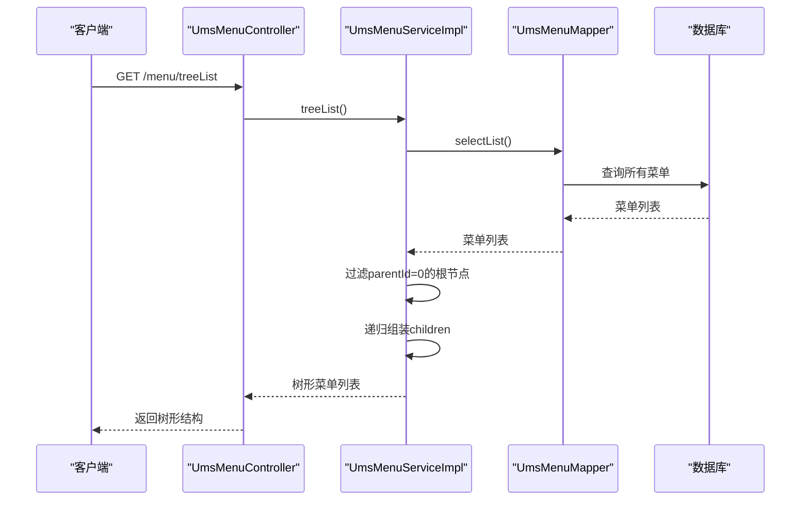
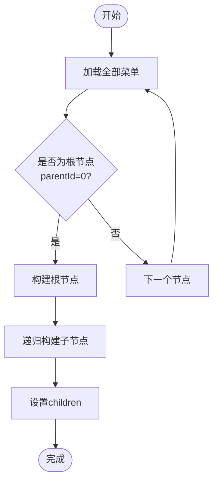
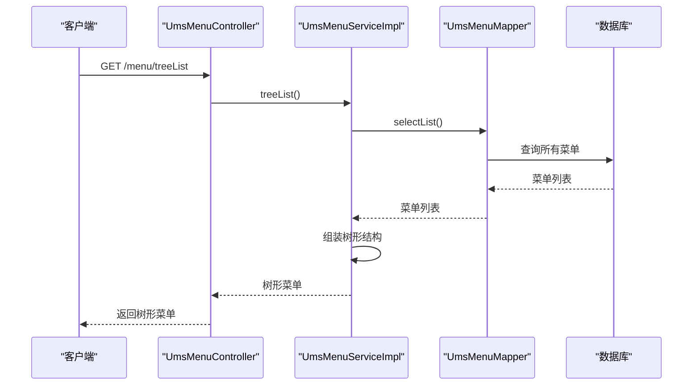
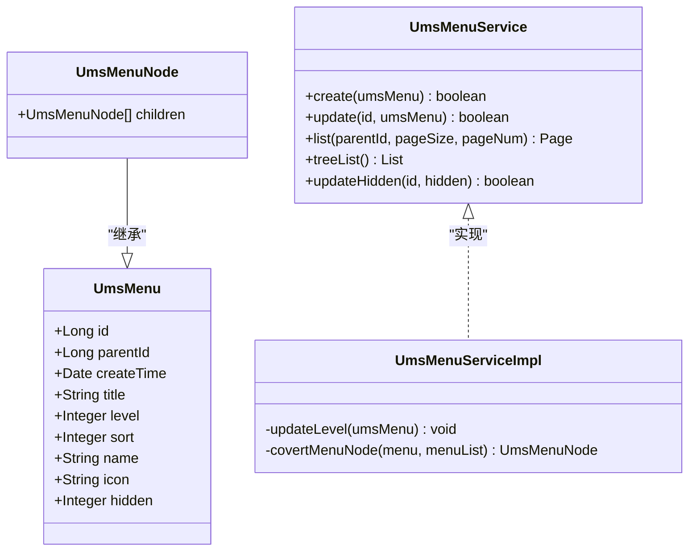
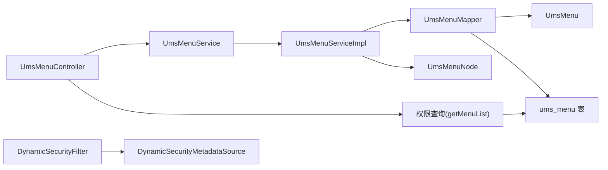
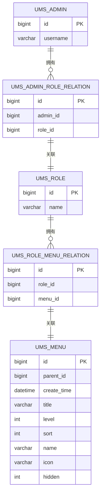

# 菜单管理API

<cite>
**本文引用的文件**
- [UmsMenuController.java](file://src/main/java/com/macro/mall/tiny/modules/ums/controller/UmsMenuController.java)
- [UmsMenuService.java](file://src/main/java/com/macro/mall/tiny/modules/ums/service/UmsMenuService.java)
- [UmsMenuServiceImpl.java](file://src/main/java/com/macro/mall/tiny/modules/ums/service/impl/UmsMenuServiceImpl.java)
- [UmsMenu.java](file://src/main/java/com/macro/mall/tiny/modules/ums/model/UmsMenu.java)
- [UmsMenuNode.java](file://src/main/java/com/macro/mall/tiny/modules/ums/dto/UmsMenuNode.java)
- [UmsMenuMapper.java](file://src/main/java/com/macro/mall/tiny/modules/ums/mapper/UmsMenuMapper.java)
- [UmsMenuMapper.xml](file://src/main/resources/mapper/ums/UmsMenuMapper.xml)
- [mall_tiny.sql](file://sql/mall_tiny.sql)
- [UmsAdminService.java](file://src/main/java/com/macro/mall/tiny/modules/ums/service/UmsAdminService.java)
- [UmsAdminServiceImpl.java](file://src/main/java/com/macro/mall/tiny/modules/ums/service/impl/UmsAdminServiceImpl.java)
- [DynamicSecurityFilter.java](file://src/main/java/com/macro/mall/tiny/security/component/DynamicSecurityFilter.java)
- [DynamicSecurityMetadataSource.java](file://src/main/java/com/macro/mall/tiny/security/component/DynamicSecurityMetadataSource.java)
- [DynamicSecurityService.java](file://src/main/java/com/macro/mall/tiny/security/component/DynamicSecurityService.java)
</cite>

## 目录
1. [简介](#简介)
2. [项目结构](#项目结构)
3. [核心组件](#核心组件)
4. [架构总览](#架构总览)
5. [详细组件分析](#详细组件分析)
6. [依赖分析](#依赖分析)
7. [性能考虑](#性能考虑)
8. [故障排查指南](#故障排查指南)
9. [结论](#结论)
10. [附录](#附录)

## 简介
本文件面向“菜单管理”模块，提供完整的API接口文档，覆盖菜单CRUD、树形结构获取、动态菜单生成、权限控制与校验、排序机制与层级管理等能力。文档以代码为依据，结合数据库表结构与安全组件，给出接口定义、调用流程、数据模型、依赖关系与最佳实践。

## 项目结构
菜单管理模块位于模块化目录 ums 下，采用典型的分层架构：
- 控制层：UmsMenuController 提供REST接口
- 服务层：UmsMenuService 定义接口，UmsMenuServiceImpl 实现业务逻辑
- 数据访问层：UmsMenuMapper 及 XML 映射
- 模型与DTO：UmsMenu（实体）、UmsMenuNode（树节点）
- 权限与安全：基于角色的菜单权限查询，配合动态权限过滤器

```mermaid
graph TB
subgraph "控制层"
C1["UmsMenuController<br/>REST接口"]
end
subgraph "服务层"
S1["UmsMenuService<br/>接口"]
S2["UmsMenuServiceImpl<br/>实现"]
end
subgraph "数据访问层"
M1["UmsMenuMapper<br/>接口"]
M2["UmsMenuMapper.xml<br/>SQL映射"]
end
subgraph "模型与DTO"
D1["UmsMenu<br/>菜单实体"]
D2["UmsMenuNode<br/>树节点DTO"]
end
subgraph "权限与安全"
P1["UmsMenuMapper.getMenuList<br/>按用户查询菜单"]
F1["DynamicSecurityFilter<br/>动态权限过滤"]
F2["DynamicSecurityMetadataSource<br/>动态元数据源"]
end
C1 --> S1
S1 < --> S2
S2 --> M1
M1 --> M2
S2 --> D1
S2 --> D2
P1 --> D1
F1 --> F2
```

图表来源
- [UmsMenuController.java:1-106](file://src/main/java/com/macro/mall/tiny/modules/ums/controller/UmsMenuController.java#L1-L106)
- [UmsMenuService.java:1-41](file://src/main/java/com/macro/mall/tiny/modules/ums/service/UmsMenuService.java#L1-L41)
- [UmsMenuServiceImpl.java:1-95](file://src/main/java/com/macro/mall/tiny/modules/ums/service/impl/UmsMenuServiceImpl.java#L1-L95)
- [UmsMenuMapper.java:1-29](file://src/main/java/com/macro/mall/tiny/modules/ums/mapper/UmsMenuMapper.java#L1-L29)
- [UmsMenuMapper.xml:1-62](file://src/main/resources/mapper/ums/UmsMenuMapper.xml#L1-L62)
- [UmsMenu.java:1-58](file://src/main/java/com/macro/mall/tiny/modules/ums/model/UmsMenu.java#L1-L58)
- [UmsMenuNode.java:1-20](file://src/main/java/com/macro/mall/tiny/modules/ums/dto/UmsMenuNode.java#L1-L20)
- [DynamicSecurityFilter.java:1-83](file://src/main/java/com/macro/mall/tiny/security/component/DynamicSecurityFilter.java#L1-L83)
- [DynamicSecurityMetadataSource.java:1-65](file://src/main/java/com/macro/mall/tiny/security/component/DynamicSecurityMetadataSource.java#L1-L65)

章节来源
- [UmsMenuController.java:1-106](file://src/main/java/com/macro/mall/tiny/modules/ums/controller/UmsMenuController.java#L1-L106)
- [UmsMenuService.java:1-41](file://src/main/java/com/macro/mall/tiny/modules/ums/service/UmsMenuService.java#L1-L41)
- [UmsMenuServiceImpl.java:1-95](file://src/main/java/com/macro/mall/tiny/modules/ums/service/impl/UmsMenuServiceImpl.java#L1-L95)
- [UmsMenuMapper.java:1-29](file://src/main/java/com/macro/mall/tiny/modules/ums/mapper/UmsMenuMapper.java#L1-L29)
- [UmsMenuMapper.xml:1-62](file://src/main/resources/mapper/ums/UmsMenuMapper.xml#L1-L62)
- [UmsMenu.java:1-58](file://src/main/java/com/macro/mall/tiny/modules/ums/model/UmsMenu.java#L1-L58)
- [UmsMenuNode.java:1-20](file://src/main/java/com/macro/mall/tiny/modules/ums/dto/UmsMenuNode.java#L1-L20)
- [DynamicSecurityFilter.java:1-83](file://src/main/java/com/macro/mall/tiny/security/component/DynamicSecurityFilter.java#L1-L83)
- [DynamicSecurityMetadataSource.java:1-65](file://src/main/java/com/macro/mall/tiny/security/component/DynamicSecurityMetadataSource.java#L1-L65)

## 核心组件
- 控制器：提供菜单CRUD、树形列表、显示状态更新等HTTP接口
- 服务接口与实现：负责菜单层级计算、树形组装、分页查询、显示状态更新
- 数据访问：提供按用户/角色查询菜单的SQL映射
- 模型与DTO：菜单实体与树节点DTO，支持父子关系与层级展示
- 权限与安全：通过角色关联菜单，结合动态权限过滤实现菜单级权限控制

章节来源
- [UmsMenuController.java:1-106](file://src/main/java/com/macro/mall/tiny/modules/ums/controller/UmsMenuController.java#L1-L106)
- [UmsMenuService.java:1-41](file://src/main/java/com/macro/mall/tiny/modules/ums/service/UmsMenuService.java#L1-L41)
- [UmsMenuServiceImpl.java:1-95](file://src/main/java/com/macro/mall/tiny/modules/ums/service/impl/UmsMenuServiceImpl.java#L1-L95)
- [UmsMenuMapper.java:1-29](file://src/main/java/com/macro/mall/tiny/modules/ums/mapper/UmsMenuMapper.java#L1-L29)
- [UmsMenuMapper.xml:1-62](file://src/main/resources/mapper/ums/UmsMenuMapper.xml#L1-L62)
- [UmsMenu.java:1-58](file://src/main/java/com/macro/mall/tiny/modules/ums/model/UmsMenu.java#L1-L58)
- [UmsMenuNode.java:1-20](file://src/main/java/com/macro/mall/tiny/modules/ums/dto/UmsMenuNode.java#L1-L20)

## 架构总览
菜单管理的典型调用链路如下：



图表来源
- [UmsMenuController.java:86-92](file://src/main/java/com/macro/mall/tiny/modules/ums/controller/UmsMenuController.java#L86-L92)
- [UmsMenuServiceImpl.java:65-93](file://src/main/java/com/macro/mall/tiny/modules/ums/service/impl/UmsMenuServiceImpl.java#L65-L93)
- [UmsMenuMapper.xml:18-39](file://src/main/resources/mapper/ums/UmsMenuMapper.xml#L18-L39)

## 详细组件分析

### 接口定义与调用示例

- 菜单创建
  - 方法：POST
  - 路径：/menu/create
  - 请求体：UmsMenu 对象（包含标题、父级ID、前端名称、图标、排序等）
  - 响应：CommonResult<Boolean>
  - 处理流程：服务层设置创建时间、计算层级、保存

- 菜单更新
  - 方法：POST
  - 路径：/menu/update/{id}
  - 请求体：UmsMenu 对象
  - 响应：CommonResult<Boolean>
  - 处理流程：服务层更新前重新计算层级并持久化

- 菜单详情
  - 方法：GET
  - 路径：/menu/{id}
  - 响应：CommonResult<UmsMenu>

- 菜单删除
  - 方法：POST
  - 路径：/menu/delete/{id}
  - 响应：CommonResult<Boolean>

- 菜单列表（按父级分页）
  - 方法：GET
  - 路径：/menu/list/{parentId}
  - 参数：pageSize、pageNum
  - 响应：CommonResult<CommonPage<UmsMenu>>
  - 排序：按 sort 字段降序

- 菜单树形结构
  - 方法：GET
  - 路径：/menu/treeList
  - 响应：CommonResult<List<UmsMenuNode>>
  - 特性：父子关系、层级显示、动态菜单生成基础

- 更新显示状态
  - 方法：POST
  - 路径：/menu/updateHidden/{id}
  - 参数：hidden（0显示/1隐藏）
  - 响应：CommonResult<Boolean>

章节来源
- [UmsMenuController.java:31-104](file://src/main/java/com/macro/mall/tiny/modules/ums/controller/UmsMenuController.java#L31-L104)
- [UmsMenuServiceImpl.java:24-80](file://src/main/java/com/macro/mall/tiny/modules/ums/service/impl/UmsMenuServiceImpl.java#L24-L80)

### 树形结构与层级管理

- 层级计算
  - 无父级（parentId=0）为一级菜单（level=0）
  - 有父级时，level = 父级level + 1
  - 更新菜单时会重新计算层级，确保层级一致性

- 树形组装
  - 先查询全部菜单
  - 以 parentId=0 的菜单为根
  - 递归查找每个节点的子节点，形成 children 列表



图表来源
- [UmsMenuServiceImpl.java:65-93](file://src/main/java/com/macro/mall/tiny/modules/ums/service/impl/UmsMenuServiceImpl.java#L65-L93)

章节来源
- [UmsMenuServiceImpl.java:34-47](file://src/main/java/com/macro/mall/tiny/modules/ums/service/impl/UmsMenuServiceImpl.java#L34-L47)
- [UmsMenuServiceImpl.java:65-93](file://src/main/java/com/macro/mall/tiny/modules/ums/service/impl/UmsMenuServiceImpl.java#L65-L93)

### 菜单排序机制
- 排序字段：sort（整型）
- 默认排序：分页查询时按 sort 降序排列
- 拖拽排序：可通过更新菜单的 sort 值实现前后顺序调整
- 层级管理：level 字段由服务层自动维护，保证父子层级关系正确

章节来源
- [UmsMenuServiceImpl.java:57-63](file://src/main/java/com/macro/mall/tiny/modules/ums/service/impl/UmsMenuServiceImpl.java#L57-L63)
- [UmsMenu.java:44](file://src/main/java/com/macro/mall/tiny/modules/ums/model/UmsMenu.java#L44)
- [UmsMenu.java:42](file://src/main/java/com/macro/mall/tiny/modules/ums/model/UmsMenu.java#L42)

### 动态菜单生成与权限控制
- 用户可访问菜单
  - 通过 UmsMenuMapper 的 getMenuList 查询：基于用户-角色-菜单三表关联，去重并按菜单字段映射
  - SQL 关键点：LEFT JOIN 角色菜单关系表，筛选有效菜单并按 id 分组

- 角色可访问菜单
  - 通过 getMenuListByRoleId 查询：基于角色-菜单关系表直接关联

- 权限继承规则
  - 用户权限 = 所有角色权限的并集
  - 若用户被赋予多个角色，则其可访问菜单为各角色菜单的合并

- 动态菜单生成原理
  - 后端：按用户查询可访问菜单，组装树形结构返回
  - 前端：接收树形菜单，渲染路由与侧边栏
  - 权限校验：结合动态权限过滤器，对受保护资源进行访问控制



图表来源
- [UmsMenuController.java:86-92](file://src/main/java/com/macro/mall/tiny/modules/ums/controller/UmsMenuController.java#L86-L92)
- [UmsMenuServiceImpl.java:65-93](file://src/main/java/com/macro/mall/tiny/modules/ums/service/impl/UmsMenuServiceImpl.java#L65-L93)
- [UmsMenuMapper.xml:18-39](file://src/main/resources/mapper/ums/UmsMenuMapper.xml#L18-L39)

章节来源
- [UmsMenuMapper.java:19-26](file://src/main/java/com/macro/mall/tiny/modules/ums/mapper/UmsMenuMapper.java#L19-L26)
- [UmsMenuMapper.xml:18-59](file://src/main/resources/mapper/ums/UmsMenuMapper.xml#L18-L59)
- [UmsMenuServiceImpl.java:65-93](file://src/main/java/com/macro/mall/tiny/modules/ums/service/impl/UmsMenuServiceImpl.java#L65-L93)

### 类图（代码级）



图表来源
- [UmsMenu.java:25-57](file://src/main/java/com/macro/mall/tiny/modules/ums/model/UmsMenu.java#L25-L57)
- [UmsMenuNode.java:14-19](file://src/main/java/com/macro/mall/tiny/modules/ums/dto/UmsMenuNode.java#L14-L19)
- [UmsMenuService.java:15-40](file://src/main/java/com/macro/mall/tiny/modules/ums/service/UmsMenuService.java#L15-L40)
- [UmsMenuServiceImpl.java:22-94](file://src/main/java/com/macro/mall/tiny/modules/ums/service/impl/UmsMenuServiceImpl.java#L22-L94)

## 依赖分析
- 控制器依赖服务接口
- 服务实现依赖Mapper与模型
- Mapper依赖数据库表结构
- 权限查询依赖用户-角色-菜单三张表
- 动态权限过滤依赖动态元数据源与忽略路径配置



图表来源
- [UmsMenuController.java:28-29](file://src/main/java/com/macro/mall/tiny/modules/ums/controller/UmsMenuController.java#L28-L29)
- [UmsMenuServiceImpl.java:22](file://src/main/java/com/macro/mall/tiny/modules/ums/service/impl/UmsMenuServiceImpl.java#L22)
- [UmsMenuMapper.java:17](file://src/main/java/com/macro/mall/tiny/modules/ums/mapper/UmsMenuMapper.java#L17)
- [UmsMenu.java:25-57](file://src/main/java/com/macro/mall/tiny/modules/ums/model/UmsMenu.java#L25-L57)
- [UmsMenuMapper.xml:18-39](file://src/main/resources/mapper/ums/UmsMenuMapper.xml#L18-L39)
- [DynamicSecurityFilter.java:23-82](file://src/main/java/com/macro/mall/tiny/security/component/DynamicSecurityFilter.java#L23-L82)
- [DynamicSecurityMetadataSource.java:18-64](file://src/main/java/com/macro/mall/tiny/security/component/DynamicSecurityMetadataSource.java#L18-L64)

章节来源
- [UmsMenuController.java:28-29](file://src/main/java/com/macro/mall/tiny/modules/ums/controller/UmsMenuController.java#L28-L29)
- [UmsMenuServiceImpl.java:22](file://src/main/java/com/macro/mall/tiny/modules/ums/service/impl/UmsMenuServiceImpl.java#L22)
- [UmsMenuMapper.java:17](file://src/main/java/com/macro/mall/tiny/modules/ums/mapper/UmsMenuMapper.java#L17)
- [UmsMenuMapper.xml:18-39](file://src/main/resources/mapper/ums/UmsMenuMapper.xml#L18-L39)
- [DynamicSecurityFilter.java:23-82](file://src/main/java/com/macro/mall/tiny/security/component/DynamicSecurityFilter.java#L23-L82)
- [DynamicSecurityMetadataSource.java:18-64](file://src/main/java/com/macro/mall/tiny/security/component/DynamicSecurityMetadataSource.java#L18-L64)

## 性能考虑
- 树形构建：一次性查询全量菜单，再在内存中组装，适合中小规模菜单（建议控制在千级以内）
- 分页查询：列表接口按父级分页并按 sort 降序，避免全量加载
- 权限查询：按用户查询菜单使用多表LEFT JOIN，建议在角色-菜单关系表上建立索引
- 缓存策略：可对用户可访问菜单结果进行短期缓存，降低重复查询开销
- 排序与层级：层级计算在写入/更新时执行，避免运行时重复计算

## 故障排查指南
- 树形为空
  - 检查是否存在 parentId=0 的根节点
  - 确认菜单数据是否完整导入
  - 参考：[UmsMenuServiceImpl.java:68-70](file://src/main/java/com/macro/mall/tiny/modules/ums/service/impl/UmsMenuServiceImpl.java#L68-L70)，[mall_tiny.sql:110-133](file://sql/mall_tiny.sql#L110-L133)

- 层级不正确
  - 确认父级菜单存在且 level 正确
  - 更新菜单时会重新计算层级，检查更新流程
  - 参考：[UmsMenuServiceImpl.java:34-47](file://src/main/java/com/macro/mall/tiny/modules/ums/service/impl/UmsMenuServiceImpl.java#L34-L47)

- 排序异常
  - 检查 sort 字段是否为整型且合理
  - 列表接口默认按 sort 降序，确认前端渲染逻辑
  - 参考：[UmsMenuServiceImpl.java:60-62](file://src/main/java/com/macro/mall/tiny/modules/ums/service/impl/UmsMenuServiceImpl.java#L60-L62)，[UmsMenu.java:44](file://src/main/java/com/macro/mall/tiny/modules/ums/model/UmsMenu.java#L44)

- 动态菜单不生效
  - 确认用户已绑定角色
  - 确认角色已绑定菜单
  - 检查权限查询SQL是否返回预期结果
  - 参考：[UmsMenuMapper.xml:18-39](file://src/main/resources/mapper/ums/UmsMenuMapper.xml#L18-L39)

- 权限校验失败
  - 检查动态权限过滤器是否生效
  - 确认忽略路径配置是否正确
  - 参考：[DynamicSecurityFilter.java:40-66](file://src/main/java/com/macro/mall/tiny/security/component/DynamicSecurityFilter.java#L40-L66)，[DynamicSecurityMetadataSource.java:34-52](file://src/main/java/com/macro/mall/tiny/security/component/DynamicSecurityMetadataSource.java#L34-L52)

章节来源
- [UmsMenuServiceImpl.java:34-47](file://src/main/java/com/macro/mall/tiny/modules/ums/service/impl/UmsMenuServiceImpl.java#L34-L47)
- [UmsMenuServiceImpl.java:60-62](file://src/main/java/com/macro/mall/tiny/modules/ums/service/impl/UmsMenuServiceImpl.java#L60-L62)
- [UmsMenuMapper.xml:18-39](file://src/main/resources/mapper/ums/UmsMenuMapper.xml#L18-L39)
- [DynamicSecurityFilter.java:40-66](file://src/main/java/com/macro/mall/tiny/security/component/DynamicSecurityFilter.java#L40-L66)
- [DynamicSecurityMetadataSource.java:34-52](file://src/main/java/com/macro/mall/tiny/security/component/DynamicSecurityMetadataSource.java#L34-L52)

## 结论
菜单管理模块提供了完善的菜单CRUD、树形结构与动态菜单生成能力，并通过角色-菜单关联实现了灵活的权限控制。服务层负责层级与树形组装，控制器提供标准REST接口，数据访问层通过SQL映射实现高效查询。结合动态权限过滤，可实现菜单级的细粒度访问控制。建议在生产环境中关注菜单规模、排序与层级一致性、以及权限查询的性能优化。

## 附录

### 数据模型图



图表来源
- [mall_tiny.sql:94-105](file://sql/mall_tiny.sql#L94-L105)
- [mall_tiny.sql:69-75](file://sql/mall_tiny.sql#L69-L75)
- [mall_tiny.sql:135-147](file://sql/mall_tiny.sql#L135-L147)

### 接口调用示例（路径参考）
- 获取菜单树形结构
  - 请求：GET /menu/treeList
  - 响应：List<UmsMenuNode>
  - 参考：[UmsMenuController.java:86-92](file://src/main/java/com/macro/mall/tiny/modules/ums/controller/UmsMenuController.java#L86-L92)，[UmsMenuServiceImpl.java:65-93](file://src/main/java/com/macro/mall/tiny/modules/ums/service/impl/UmsMenuServiceImpl.java#L65-L93)

- 根据用户获取可访问菜单（动态菜单生成）
  - 请求：GET /menu/treeList（后端按当前用户查询）
  - 查询SQL：UmsMenuMapper.getMenuList
  - 参考：[UmsMenuMapper.xml:18-39](file://src/main/resources/mapper/ums/UmsMenuMapper.xml#L18-L39)

- 菜单权限验证（资源级）
  - 配置：DynamicSecurityService.loadDataSource
  - 过滤：DynamicSecurityFilter
  - 元数据：DynamicSecurityMetadataSource
  - 参考：[DynamicSecurityService.java:11-16](file://src/main/java/com/macro/mall/tiny/security/component/DynamicSecurityService.java#L11-L16)，[DynamicSecurityFilter.java:40-66](file://src/main/java/com/macro/mall/tiny/security/component/DynamicSecurityFilter.java#L40-L66)，[DynamicSecurityMetadataSource.java:34-52](file://src/main/java/com/macro/mall/tiny/security/component/DynamicSecurityMetadataSource.java#L34-L52)