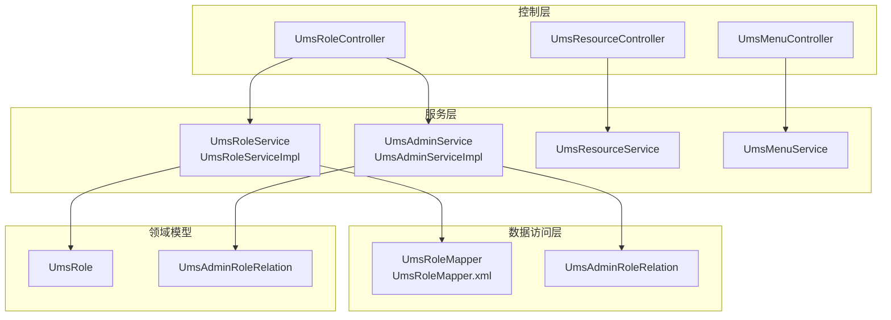
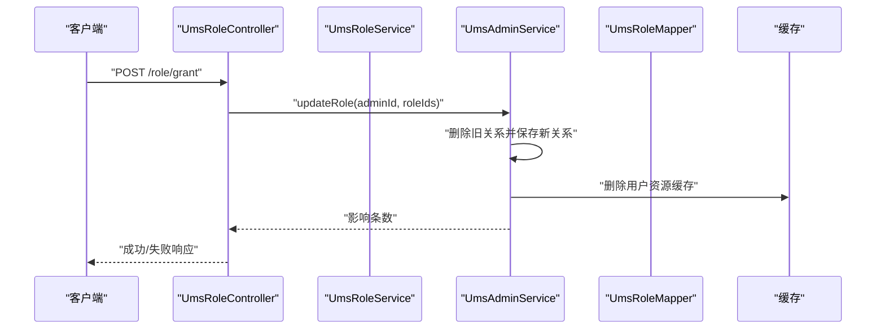
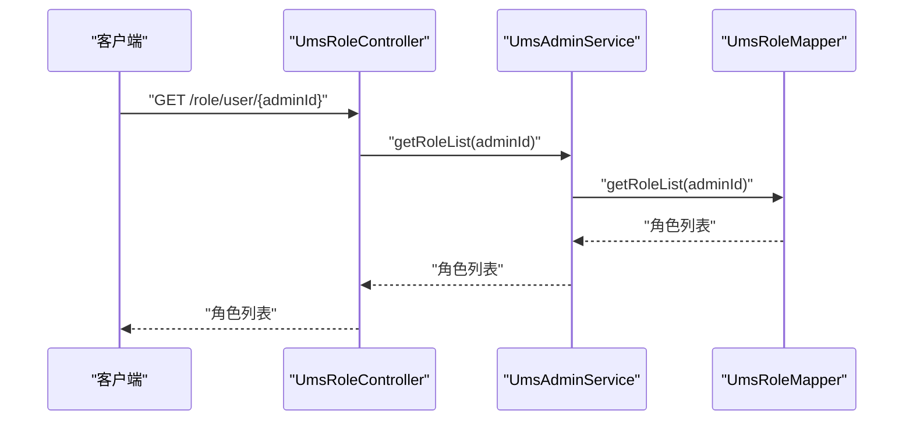
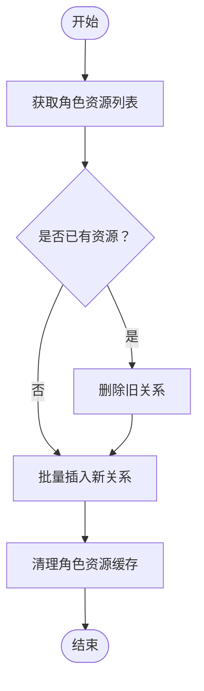
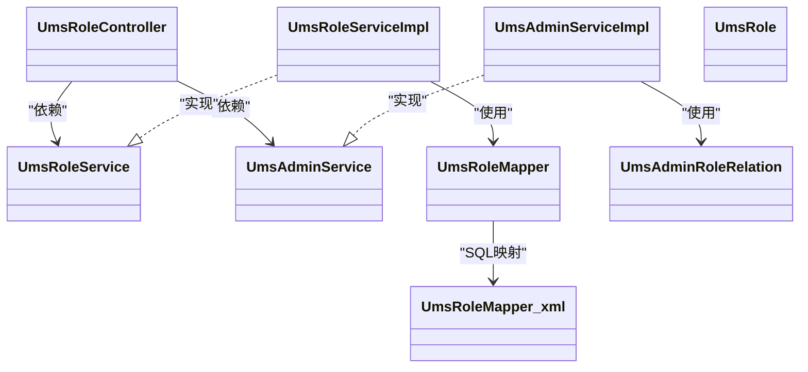

# 角色管理API

<cite>
**本文引用的文件**
- [UmsRoleController.java](file://src/main/java/com/macro/mall/tiny/modules/ums/controller/UmsRoleController.java)
- [UmsRoleService.java](file://src/main/java/com/macro/mall/tiny/modules/ums/service/UmsRoleService.java)
- [UmsRoleServiceImpl.java](file://src/main/java/com/macro/mall/tiny/modules/ums/service/impl/UmsRoleServiceImpl.java)
- [UmsRole.java](file://src/main/java/com/macro/mall/tiny/modules/ums/model/UmsRole.java)
- [UmsRoleMapper.java](file://src/main/java/com/macro/mall/tiny/modules/ums/mapper/UmsRoleMapper.java)
- [UmsRoleMapper.xml](file://src/main/resources/mapper/ums/UmsRoleMapper.xml)
- [UmsAdminService.java](file://src/main/java/com/macro/mall/tiny/modules/ums/service/UmsAdminService.java)
- [UmsAdminServiceImpl.java](file://src/main/java/com/macro/mall/tiny/modules/ums/service/impl/UmsAdminServiceImpl.java)
- [UmsAdminRoleRelation.java](file://src/main/java/com/macro/mall/tiny/modules/ums/model/UmsAdminRoleRelation.java)
- [UmsResourceController.java](file://src/main/java/com/macro/mall/tiny/modules/ums/controller/UmsResourceController.java)
- [UmsMenuController.java](file://src/main/java/com/macro/mall/tiny/modules/ums/controller/UmsMenuController.java)
- [UmsResourceService.java](file://src/main/java/com/macro/mall/tiny/modules/ums/service/UmsResourceService.java)
- [UmsMenuService.java](file://src/main/java/com/macro/mall/tiny/modules/ums/service/UmsMenuService.java)
- [init_role.sql](file://sql/init_role.sql)
- [README.md](file://README.md)
</cite>

## 目录
1. [简介](#简介)
2. [项目结构](#项目结构)
3. [核心组件](#核心组件)
4. [架构总览](#架构总览)
5. [详细组件分析](#详细组件分析)
6. [依赖分析](#依赖分析)
7. [性能考虑](#性能考虑)
8. [故障排查指南](#故障排查指南)
9. [结论](#结论)
10. [附录](#附录)

## 简介
本文件聚焦“角色管理”模块的API接口文档，覆盖角色CRUD、角色与用户关系管理、角色与资源/菜单权限分配、以及RBAC权限模型的实现要点。同时提供最佳实践建议、权限验证规则、角色层级与冲突处理的技术细节，并给出完整的接口调用示例路径，帮助开发者快速理解与落地。

## 项目结构
角色管理模块位于权限管理子系统（ums）下，采用典型的分层架构：Controller（接口）、Service（业务）、Mapper/DAO（数据访问）、Model（实体）、XML（SQL映射）。角色相关的核心文件如下：
- 控制器：UmsRoleController
- 服务接口与实现：UmsRoleService、UmsRoleServiceImpl
- 实体与映射：UmsRole、UmsRoleMapper、UmsRoleMapper.xml
- 用户与角色关系：UmsAdminService、UmsAdminServiceImpl、UmsAdminRoleRelation
- 资源与菜单：UmsResourceController、UmsMenuController、UmsResourceService、UmsMenuService
- 初始化脚本：init_role.sql

图表来源
- [UmsRoleController.java:1-174](file://src/main/java/com/macro/mall/tiny/modules/ums/controller/UmsRoleController.java#L1-L174)
- [UmsRoleService.java:1-59](file://src/main/java/com/macro/mall/tiny/modules/ums/service/UmsRoleService.java#L1-L59)
- [UmsRoleServiceImpl.java:1-117](file://src/main/java/com/macro/mall/tiny/modules/ums/service/impl/UmsRoleServiceImpl.java#L1-L117)
- [UmsRoleMapper.java:1-25](file://src/main/java/com/macro/mall/tiny/modules/ums/mapper/UmsRoleMapper.java#L1-L25)
- [UmsRoleMapper.xml:1-23](file://src/main/resources/mapper/ums/UmsRoleMapper.xml#L1-L23)
- [UmsAdminService.java:1-90](file://src/main/java/com/macro/mall/tiny/modules/ums/service/UmsAdminService.java#L1-L90)
- [UmsAdminServiceImpl.java:1-272](file://src/main/java/com/macro/mall/tiny/modules/ums/service/impl/UmsAdminServiceImpl.java#L1-L272)
- [UmsAdminRoleRelation.java:1-37](file://src/main/java/com/macro/mall/tiny/modules/ums/model/UmsAdminRoleRelation.java#L1-L37)

章节来源
- [README.md:59-114](file://README.md#L59-L114)

## 核心组件
- 角色实体：UmsRole，包含角色标识、名称、描述、状态、排序、创建时间等字段。
- 角色服务：UmsRoleService 提供角色创建、删除、分页查询、角色菜单/资源查询与分配等能力；UmsRoleServiceImpl 实现具体逻辑，含事务性资源/菜单分配、缓存清理等。
- 用户-角色关系：UmsAdminService 提供用户角色关系的增删改与查询；UmsAdminServiceImpl 实现关系重建与缓存失效。
- 角色控制器：UmsRoleController 提供角色CRUD、用户角色授予/撤销、角色资源ID列表查询、资源分配等REST接口。
- 映射与查询：UmsRoleMapper 提供“根据用户ID获取角色列表”的SQL；UmsRoleMapper.xml 中定义了该查询。

章节来源
- [UmsRole.java:1-51](file://src/main/java/com/macro/mall/tiny/modules/ums/model/UmsRole.java#L1-L51)
- [UmsRoleService.java:1-59](file://src/main/java/com/macro/mall/tiny/modules/ums/service/UmsRoleService.java#L1-L59)
- [UmsRoleServiceImpl.java:1-117](file://src/main/java/com/macro/mall/tiny/modules/ums/service/impl/UmsRoleServiceImpl.java#L1-L117)
- [UmsAdminService.java:1-90](file://src/main/java/com/macro/mall/tiny/modules/ums/service/UmsAdminService.java#L1-L90)
- [UmsAdminServiceImpl.java:1-272](file://src/main/java/com/macro/mall/tiny/modules/ums/service/impl/UmsAdminServiceImpl.java#L1-L272)
- [UmsRoleController.java:1-174](file://src/main/java/com/macro/mall/tiny/modules/ums/controller/UmsRoleController.java#L1-L174)
- [UmsRoleMapper.java:1-25](file://src/main/java/com/macro/mall/tiny/modules/ums/mapper/UmsRoleMapper.java#L1-L25)
- [UmsRoleMapper.xml:1-23](file://src/main/resources/mapper/ums/UmsRoleMapper.xml#L1-L23)

## 架构总览
角色管理遵循经典的三层架构，结合Spring Security与动态权限元数据源，实现基于角色的访问控制（RBAC）。用户登录后，系统根据其角色集合加载可访问资源/菜单，动态决策放行或拒绝。

图表来源
- [UmsRoleController.java:45-65](file://src/main/java/com/macro/mall/tiny/modules/ums/controller/UmsRoleController.java#L45-L65)
- [UmsAdminServiceImpl.java:193-213](file://src/main/java/com/macro/mall/tiny/modules/ums/service/impl/UmsAdminServiceImpl.java#L193-L213)

## 详细组件分析

### 角色CRUD与查询接口
- 创建角色
  - 方法：POST /role/create
  - 参数：UmsRole（名称、描述、状态等）
  - 行为：调用UmsRoleService.create，设置默认值并持久化
- 查询所有角色
  - 方法：GET /role/list
  - 参数：keyword、pageSize、pageNum（通过Service分页查询）
  - 返回：分页角色列表
- 获取角色详情
  - 方法：GET /role/{id}
  - 说明：当前控制器未提供该接口，可通过资源/菜单查询替代或扩展
- 更新角色
  - 方法：POST /role/update/{id}
  - 说明：当前控制器未提供该接口，可通过资源/菜单分配或扩展实现
- 删除角色
  - 方法：POST /role/delete/{id}
  - 行为：调用UmsRoleService.delete，删除角色并清理相关缓存

章节来源
- [UmsRoleController.java:34-43](file://src/main/java/com/macro/mall/tiny/modules/ums/controller/UmsRoleController.java#L34-L43)
- [UmsRoleController.java:95-101](file://src/main/java/com/macro/mall/tiny/modules/ums/controller/UmsRoleController.java#L95-L101)
- [UmsRoleService.java:17-25](file://src/main/java/com/macro/mall/tiny/modules/ums/service/UmsRoleService.java#L17-L25)
- [UmsRoleServiceImpl.java:47-52](file://src/main/java/com/macro/mall/tiny/modules/ums/service/impl/UmsRoleServiceImpl.java#L47-L52)

### 角色与用户关系管理
- 授予用户角色
  - 方法：POST /role/grant
  - 参数：GrantRoleParam（adminId、roleId）
  - 行为：先读取用户已有角色，追加新角色后调用UmsAdminService.updateRole重建关系
- 撤销用户角色
  - 方法：DELETE /role/revoke
  - 参数：GrantRoleParam（adminId、roleId）
  - 行为：过滤掉目标角色后重建关系
- 查询用户角色列表
  - 方法：GET /role/user/{adminId}
  - 行为：调用UmsAdminService.getRoleList，底层通过UmsRoleMapper.xml执行SQL

图表来源
- [UmsRoleController.java:67-73](file://src/main/java/com/macro/mall/tiny/modules/ums/controller/UmsRoleController.java#L67-L73)
- [UmsAdminServiceImpl.java:215-218](file://src/main/java/com/macro/mall/tiny/modules/ums/service/impl/UmsAdminServiceImpl.java#L215-L218)
- [UmsRoleMapper.xml:16-20](file://src/main/resources/mapper/ums/UmsRoleMapper.xml#L16-L20)

章节来源
- [UmsRoleController.java:45-93](file://src/main/java/com/macro/mall/tiny/modules/ums/controller/UmsRoleController.java#L45-L93)
- [UmsAdminService.java:62-68](file://src/main/java/com/macro/mall/tiny/modules/ums/service/UmsAdminService.java#L62-L68)
- [UmsAdminServiceImpl.java:193-218](file://src/main/java/com/macro/mall/tiny/modules/ums/service/impl/UmsAdminServiceImpl.java#L193-L218)
- [UmsRoleMapper.xml:16-20](file://src/main/resources/mapper/ums/UmsRoleMapper.xml#L16-L20)

### 角色与资源/菜单权限分配（RBAC）
- 获取角色已拥有的资源ID列表
  - 方法：GET /role/resource/{roleId}
  - 行为：调用UmsRoleService.listResource，返回资源ID列表
- 给角色分配资源
  - 方法：POST /role/resource/assign
  - 参数：AssignResourceParam（roleId、resourceIds）
  - 行为：调用UmsRoleService.allocResource，先清空旧关系再批量插入新关系，并清理缓存
- 获取角色菜单列表
  - 方法：GET /role/menu/{roleId}
  - 行为：调用UmsRoleService.listMenu，返回菜单列表
- 给角色分配菜单
  - 方法：POST /role/menu/assign
  - 参数：AssignMenuParam（roleId、menuIds）
  - 行为：调用UmsRoleService.allocMenu，先清空旧关系再批量插入新关系

图表来源
- [UmsRoleServiceImpl.java:75-115](file://src/main/java/com/macro/mall/tiny/modules/ums/service/impl/UmsRoleServiceImpl.java#L75-L115)

章节来源
- [UmsRoleController.java:103-124](file://src/main/java/com/macro/mall/tiny/modules/ums/controller/UmsRoleController.java#L103-L124)
- [UmsRoleService.java:40-57](file://src/main/java/com/macro/mall/tiny/modules/ums/service/UmsRoleService.java#L40-L57)
- [UmsRoleServiceImpl.java:75-115](file://src/main/java/com/macro/mall/tiny/modules/ums/service/impl/UmsRoleServiceImpl.java#L75-L115)

### 资源与菜单管理（支撑RBAC）
- 资源管理
  - 创建/修改/删除/分页查询/树形结构查询等接口由UmsResourceController提供
  - 动态权限元数据源在资源变更时会清理缓存，确保权限生效
- 菜单管理
  - 创建/修改/删除/分页查询/树形列表/显示状态切换等接口由UmsMenuController提供

章节来源
- [UmsResourceController.java:1-110](file://src/main/java/com/macro/mall/tiny/modules/ums/controller/UmsResourceController.java#L1-L110)
- [UmsMenuController.java:1-106](file://src/main/java/com/macro/mall/tiny/modules/ums/controller/UmsMenuController.java#L1-L106)

## 依赖分析
- 控制器到服务：UmsRoleController 依赖 UmsRoleService 与 UmsAdminService
- 服务到数据访问：UmsRoleServiceImpl 依赖 UmsRoleMapper、UmsMenuMapper、UmsResourceMapper、UmsRoleMenuRelationService、UmsRoleResourceRelationService
- 关系模型：UmsAdminRoleRelation 作为用户与角色的多对多中间表
- 查询依赖：UmsRoleMapper.xml 提供“根据用户ID获取角色列表”的SQL

图表来源
- [UmsRoleController.java:1-174](file://src/main/java/com/macro/mall/tiny/modules/ums/controller/UmsRoleController.java#L1-L174)
- [UmsRoleService.java:1-59](file://src/main/java/com/macro/mall/tiny/modules/ums/service/UmsRoleService.java#L1-L59)
- [UmsRoleServiceImpl.java:1-117](file://src/main/java/com/macro/mall/tiny/modules/ums/service/impl/UmsRoleServiceImpl.java#L1-L117)
- [UmsAdminService.java:1-90](file://src/main/java/com/macro/mall/tiny/modules/ums/service/UmsAdminService.java#L1-L90)
- [UmsAdminServiceImpl.java:1-272](file://src/main/java/com/macro/mall/tiny/modules/ums/service/impl/UmsAdminServiceImpl.java#L1-L272)
- [UmsRoleMapper.java:1-25](file://src/main/java/com/macro/mall/tiny/modules/ums/mapper/UmsRoleMapper.java#L1-L25)
- [UmsRoleMapper.xml:1-23](file://src/main/resources/mapper/ums/UmsRoleMapper.xml#L1-L23)
- [UmsAdminRoleRelation.java:1-37](file://src/main/java/com/macro/mall/tiny/modules/ums/model/UmsAdminRoleRelation.java#L1-L37)

## 性能考虑
- 批量关系维护：角色-资源/角色-菜单分配采用批量插入，减少多次往返数据库的开销
- 缓存清理：分配资源后清理角色/用户资源缓存，避免脏读，但需注意缓存失效带来的瞬时压力
- 分页查询：角色列表支持分页，建议在高并发场景下配合索引优化
- 事务边界：分配资源/菜单在Service层使用事务，保证一致性

## 故障排查指南
- 授权接口返回失败
  - 检查请求体参数是否正确（adminId、roleId、resourceIds等）
  - 确认用户是否存在且状态正常
- 权限未生效
  - 资源/菜单变更后需清理动态权限元数据缓存
  - 检查用户资源缓存是否被清理（用户资源列表缓存会在角色关系变更时清理）
- 角色删除失败
  - 检查是否有关联的用户或资源/菜单关系未清理

章节来源
- [UmsRoleServiceImpl.java:50-51](file://src/main/java/com/macro/mall/tiny/modules/ums/service/impl/UmsRoleServiceImpl.java#L50-L51)
- [UmsAdminServiceImpl.java:209-212](file://src/main/java/com/macro/mall/tiny/modules/ums/service/impl/UmsAdminServiceImpl.java#L209-L212)
- [UmsResourceController.java:34-44](file://src/main/java/com/macro/mall/tiny/modules/ums/controller/UmsResourceController.java#L34-L44)

## 结论
本角色管理模块提供了完善的RBAC能力：角色CRUD、用户角色关系管理、角色与资源/菜单权限分配。通过清晰的分层设计与事务保障，能够满足权限系统的常见需求。建议在生产环境中结合缓存策略与监控体系，持续优化权限加载与缓存命中率。

## 附录

### 接口清单与调用示例路径
- 创建角色
  - 路径：POST /role/create
  - 示例：[UmsRoleController.java:34-43](file://src/main/java/com/macro/mall/tiny/modules/ums/controller/UmsRoleController.java#L34-L43)
- 查询所有角色
  - 路径：GET /role/list
  - 示例：[UmsRoleController.java:95-101](file://src/main/java/com/macro/mall/tiny/modules/ums/controller/UmsRoleController.java#L95-L101)
- 授予用户角色
  - 路径：POST /role/grant
  - 示例：[UmsRoleController.java:45-65](file://src/main/java/com/macro/mall/tiny/modules/ums/controller/UmsRoleController.java#L45-L65)
- 撤销用户角色
  - 路径：DELETE /role/revoke
  - 示例：[UmsRoleController.java:75-93](file://src/main/java/com/macro/mall/tiny/modules/ums/controller/UmsRoleController.java#L75-L93)
- 查询用户角色列表
  - 路径：GET /role/user/{adminId}
  - 示例：[UmsRoleController.java:67-73](file://src/main/java/com/macro/mall/tiny/modules/ums/controller/UmsRoleController.java#L67-L73)
- 获取角色资源ID列表
  - 路径：GET /role/resource/{roleId}
  - 示例：[UmsRoleController.java:103-113](file://src/main/java/com/macro/mall/tiny/modules/ums/controller/UmsRoleController.java#L103-L113)
- 分配角色资源
  - 路径：POST /role/resource/assign
  - 示例：[UmsRoleController.java:115-124](file://src/main/java/com/macro/mall/tiny/modules/ums/controller/UmsRoleController.java#L115-L124)
- 获取角色菜单列表
  - 路径：GET /role/menu/{roleId}
  - 示例：[UmsRoleService.java:40](file://src/main/java/com/macro/mall/tiny/modules/ums/service/UmsRoleService.java#L40)
- 分配角色菜单
  - 路径：POST /role/menu/assign
  - 示例：[UmsRoleService.java:50-51](file://src/main/java/com/macro/mall/tiny/modules/ums/service/UmsRoleService.java#L50-L51)

### RBAC最佳实践
- 角色命名规范
  - 使用语义化前缀区分职责域（如“数据-”、“运营-”、“系统-”），避免歧义
- 权限设计原则
  - 最小权限：仅授予完成任务所需的最小集合
  - 职责分离：敏感操作拆分为多个角色协作
  - 基于资源：优先以资源维度建模权限，菜单与资源解耦
- 角色继承与层级
  - 若需层级，可在业务层抽象“父角色”概念，通过组合方式复用权限
- 冲突处理
  - 当同一资源存在多个角色授权时，遵循“允许集合”的合并策略；若出现显式拒绝，应以拒绝为准
- 缓存与一致性
  - 权限变更后及时清理缓存；对热点用户/角色增加缓存预热

### 初始化与示例
- 默认角色初始化
  - SQL脚本：[init_role.sql:1-31](file://sql/init_role.sql#L1-L31)
- 登录与授权流程
  - 参考项目说明中的登录与授权流程，结合Swagger-UI进行接口测试

章节来源
- [init_role.sql:1-31](file://sql/init_role.sql#L1-L31)
- [README.md:300-313](file://README.md#L300-L313)