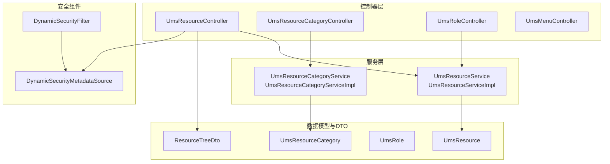
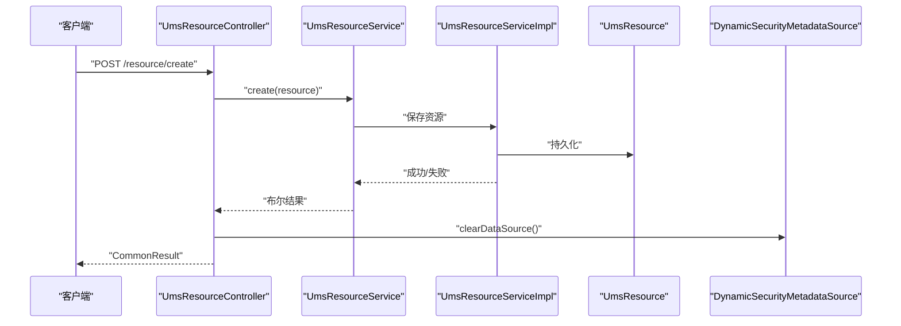
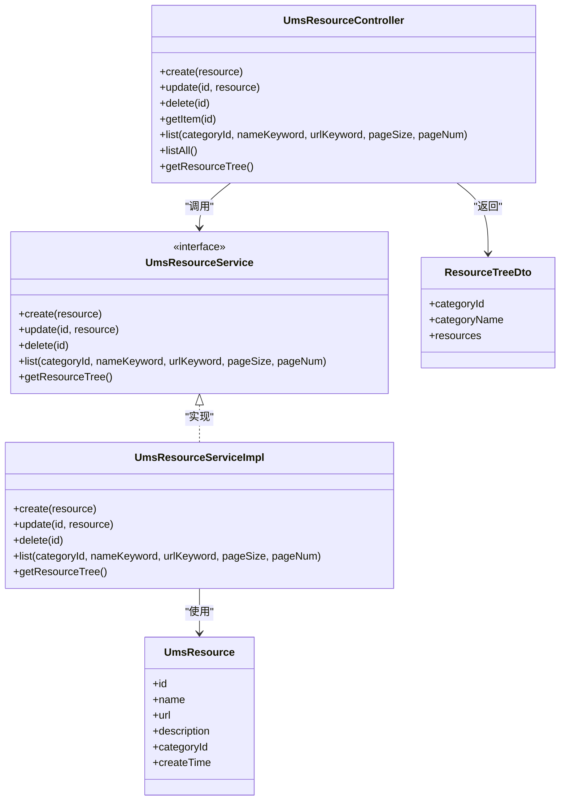
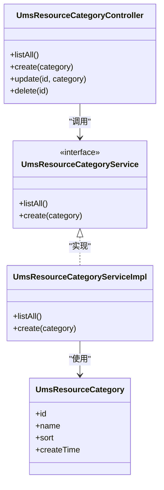
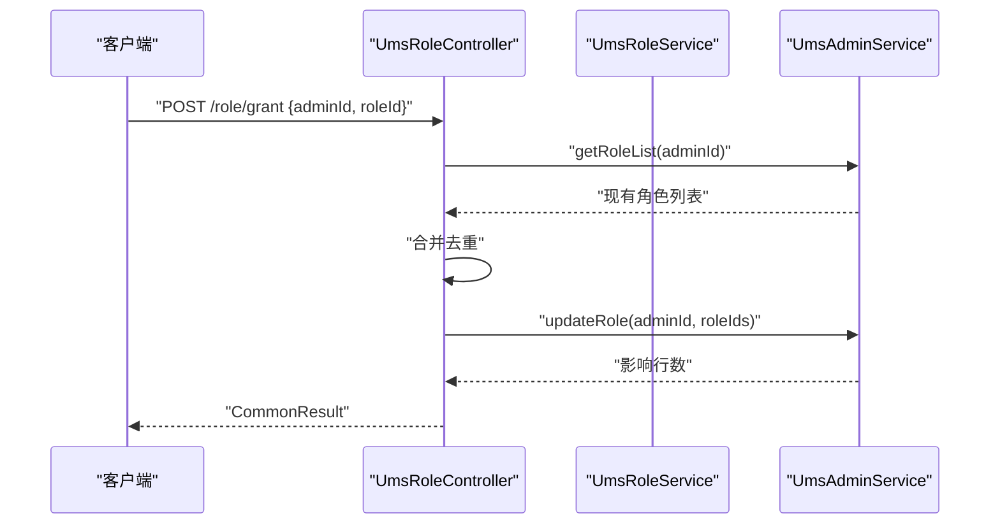
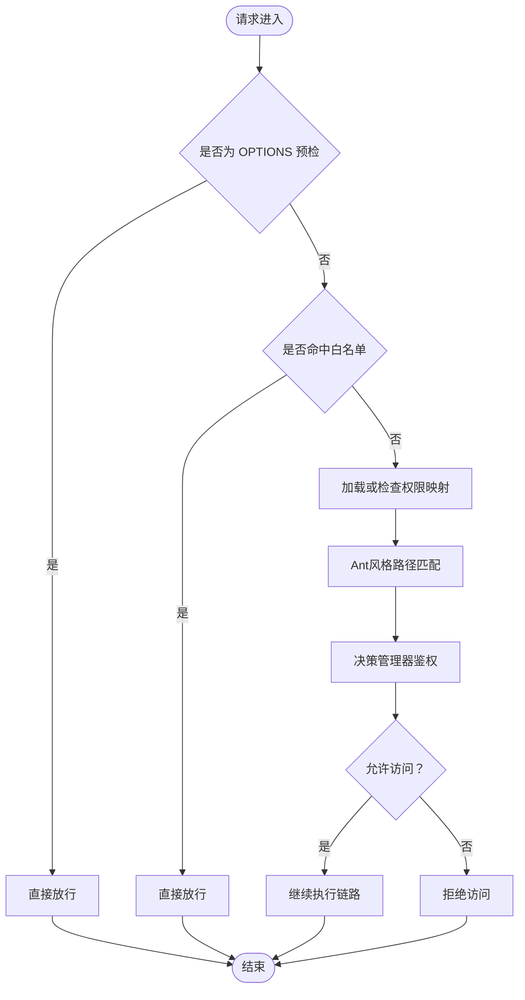
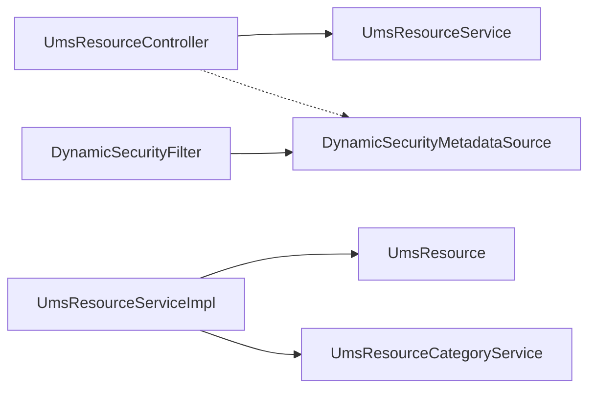

# 资源管理API

<cite>
**本文引用的文件**
- [UmsResourceController.java](file://src/main/java/com/macro/mall/tiny/modules/ums/controller/UmsResourceController.java)
- [UmsResourceCategoryController.java](file://src/main/java/com/macro/mall/tiny/modules/ums/controller/UmsResourceCategoryController.java)
- [UmsRoleController.java](file://src/main/java/com/macro/mall/tiny/modules/ums/controller/UmsRoleController.java)
- [UmsMenuController.java](file://src/main/java/com/macro/mall/tiny/modules/ums/controller/UmsMenuController.java)
- [UmsResourceService.java](file://src/main/java/com/macro/mall/tiny/modules/ums/service/UmsResourceService.java)
- [UmsResourceServiceImpl.java](file://src/main/java/com/macro/mall/tiny/modules/ums/service/impl/UmsResourceServiceImpl.java)
- [UmsResourceCategoryService.java](file://src/main/java/com/macro/mall/tiny/modules/ums/service/UmsResourceCategoryService.java)
- [UmsResourceCategoryServiceImpl.java](file://src/main/java/com/macro/mall/tiny/modules/ums/service/impl/UmsResourceCategoryServiceImpl.java)
- [UmsResource.java](file://src/main/java/com/macro/mall/tiny/modules/ums/model/UmsResource.java)
- [UmsResourceCategory.java](file://src/main/java/com/macro/mall/tiny/modules/ums/model/UmsResourceCategory.java)
- [UmsRole.java](file://src/main/java/com/macro/mall/tiny/modules/ums/model/UmsRole.java)
- [ResourceTreeDto.java](file://src/main/java/com/macro/mall/tiny/modules/ums/dto/ResourceTreeDto.java)
- [DynamicSecurityMetadataSource.java](file://src/main/java/com/macro/mall/tiny/security/component/DynamicSecurityMetadataSource.java)
- [DynamicSecurityFilter.java](file://src/main/java/com/macro/mall/tiny/security/component/DynamicSecurityFilter.java)
</cite>

## 目录
1. [简介](#简介)
2. [项目结构](#项目结构)
3. [核心组件](#核心组件)
4. [架构总览](#架构总览)
5. [详细组件分析](#详细组件分析)
6. [依赖分析](#依赖分析)
7. [性能考虑](#性能考虑)
8. [故障排查指南](#故障排查指南)
9. [结论](#结论)
10. [附录](#附录)

## 简介
本文件面向资源管理模块的API接口文档，覆盖权限资源的CRUD操作、资源分类管理、资源与角色的权限分配、权限控制机制（URL级与按钮级）、动态权限加载、权限设计原则与最佳实践，并提供可落地的接口调用示例与性能优化建议。读者无需深入后端实现即可理解如何通过REST接口完成资源与权限的全生命周期管理。

## 项目结构
资源管理相关模块位于 ums 包下，采用按功能域分层组织：
- 控制器层：对外暴露REST接口，负责参数接收、结果封装与调用服务层
- 服务层：定义业务接口与实现类，处理数据校验、分页查询、树形组装等
- 数据模型：对应数据库表结构，包含资源、资源分类、角色等
- DTO：用于树形结构等跨层传输对象
- 安全组件：动态权限元数据源与过滤器，支撑URL级权限控制

图表来源
- [UmsResourceController.java:26-108](file://src/main/java/com/macro/mall/tiny/modules/ums/controller/UmsResourceController.java#L26-L108)
- [UmsResourceCategoryController.java:22-71](file://src/main/java/com/macro/mall/tiny/modules/ums/controller/UmsResourceCategoryController.java#L22-L71)
- [UmsRoleController.java:25-124](file://src/main/java/com/macro/mall/tiny/modules/ums/controller/UmsRoleController.java#L25-L124)
- [UmsMenuController.java:25-91](file://src/main/java/com/macro/mall/tiny/modules/ums/controller/UmsMenuController.java#L25-L91)
- [UmsResourceService.java:15-39](file://src/main/java/com/macro/mall/tiny/modules/ums/service/UmsResourceService.java#L15-L39)
- [UmsResourceServiceImpl.java:27-99](file://src/main/java/com/macro/mall/tiny/modules/ums/service/impl/UmsResourceServiceImpl.java#L27-L99)
- [UmsResourceCategoryServiceImpl.java:18-32](file://src/main/java/com/macro/mall/tiny/modules/ums/service/impl/UmsResourceCategoryServiceImpl.java#L18-L32)
- [UmsResource.java:25-48](file://src/main/java/com/macro/mall/tiny/modules/ums/model/UmsResource.java#L25-L48)
- [UmsResourceCategory.java:25-42](file://src/main/java/com/macro/mall/tiny/modules/ums/model/UmsResourceCategory.java#L25-L42)
- [UmsRole.java:25-50](file://src/main/java/com/macro/mall/tiny/modules/ums/model/UmsRole.java#L25-L50)
- [ResourceTreeDto.java:14-23](file://src/main/java/com/macro/mall/tiny/modules/ums/dto/ResourceTreeDto.java#L14-L23)
- [DynamicSecurityMetadataSource.java:18-64](file://src/main/java/com/macro/mall/tiny/security/component/DynamicSecurityMetadataSource.java#L18-L64)
- [DynamicSecurityFilter.java:23-82](file://src/main/java/com/macro/mall/tiny/security/component/DynamicSecurityFilter.java#L23-L82)

章节来源
- [UmsResourceController.java:26-108](file://src/main/java/com/macro/mall/tiny/modules/ums/controller/UmsResourceController.java#L26-L108)
- [UmsResourceCategoryController.java:22-71](file://src/main/java/com/macro/mall/tiny/modules/ums/controller/UmsResourceCategoryController.java#L22-L71)
- [UmsRoleController.java:25-124](file://src/main/java/com/macro/mall/tiny/modules/ums/controller/UmsRoleController.java#L25-L124)
- [UmsMenuController.java:25-91](file://src/main/java/com/macro/mall/tiny/modules/ums/controller/UmsMenuController.java#L25-L91)

## 核心组件
- 资源控制器：提供资源的创建、更新、删除、详情查询、分页查询、全部查询、资源树形结构获取
- 资源分类控制器：提供分类的创建、更新、删除、全部查询
- 角色控制器：提供角色创建、用户角色授予/撤销、查询用户角色、查询角色已拥有资源ID、为角色分配资源
- 菜单控制器：提供菜单的增删改查、树形列表、显示状态切换
- 服务层：封装资源与分类的CRUD、分页查询、资源树组装逻辑
- 安全组件：动态权限元数据源与过滤器，支持URL级权限控制与动态刷新

章节来源
- [UmsResourceController.java:26-108](file://src/main/java/com/macro/mall/tiny/modules/ums/controller/UmsResourceController.java#L26-L108)
- [UmsResourceCategoryController.java:22-71](file://src/main/java/com/macro/mall/tiny/modules/ums/controller/UmsResourceCategoryController.java#L22-L71)
- [UmsRoleController.java:25-124](file://src/main/java/com/macro/mall/tiny/modules/ums/controller/UmsRoleController.java#L25-L124)
- [UmsMenuController.java:25-91](file://src/main/java/com/macro/mall/tiny/modules/ums/controller/UmsMenuController.java#L25-L91)
- [UmsResourceService.java:15-39](file://src/main/java/com/macro/mall/tiny/modules/ums/service/UmsResourceService.java#L15-L39)
- [UmsResourceServiceImpl.java:27-99](file://src/main/java/com/macro/mall/tiny/modules/ums/service/impl/UmsResourceServiceImpl.java#L27-L99)
- [UmsResourceCategoryServiceImpl.java:18-32](file://src/main/java/com/macro/mall/tiny/modules/ums/service/impl/UmsResourceCategoryServiceImpl.java#L18-L32)
- [DynamicSecurityMetadataSource.java:18-64](file://src/main/java/com/macro/mall/tiny/security/component/DynamicSecurityMetadataSource.java#L18-L64)
- [DynamicSecurityFilter.java:23-82](file://src/main/java/com/macro/mall/tiny/security/component/DynamicSecurityFilter.java#L23-L82)

## 架构总览
资源管理API围绕“控制器-服务-数据模型”三层展开，配合Spring Security动态权限组件实现URL级权限控制。资源树形结构由服务层聚合资源分类与资源数据生成，供前端按需展示。

图表来源
- [UmsResourceController.java:34-45](file://src/main/java/com/macro/mall/tiny/modules/ums/controller/UmsResourceController.java#L34-L45)
- [UmsResourceService.java:16-19](file://src/main/java/com/macro/mall/tiny/modules/ums/service/UmsResourceService.java#L16-L19)
- [UmsResourceServiceImpl.java:34-37](file://src/main/java/com/macro/mall/tiny/modules/ums/service/impl/UmsResourceServiceImpl.java#L34-L37)
- [DynamicSecurityMetadataSource.java:29-32](file://src/main/java/com/macro/mall/tiny/security/component/DynamicSecurityMetadataSource.java#L29-L32)

## 详细组件分析

### 资源管理接口
- 资源创建
  - 方法与路径：POST /resource/create
  - 请求体：资源对象（包含名称、URL、描述、分类ID等）
  - 返回：通用响应包装
  - 关键点：创建后清空动态权限元数据源，确保下次请求重新加载最新权限规则
  - 章节来源
    - [UmsResourceController.java:34-45](file://src/main/java/com/macro/mall/tiny/modules/ums/controller/UmsResourceController.java#L34-L45)
    - [UmsResourceService.java:16-19](file://src/main/java/com/macro/mall/tiny/modules/ums/service/UmsResourceService.java#L16-L19)
    - [UmsResourceServiceImpl.java:34-37](file://src/main/java/com/macro/mall/tiny/modules/ums/service/impl/UmsResourceServiceImpl.java#L34-L37)
    - [DynamicSecurityMetadataSource.java:29-32](file://src/main/java/com/macro/mall/tiny/security/component/DynamicSecurityMetadataSource.java#L29-L32)

- 资源更新
  - 方法与路径：POST /resource/update/{id}
  - 请求体：资源对象（含变更字段）
  - 返回：通用响应包装
  - 关键点：更新后清理缓存中受影响的资源列表，保证后续权限校验命中最新数据
  - 章节来源
    - [UmsResourceController.java:47-59](file://src/main/java/com/macro/mall/tiny/modules/ums/controller/UmsResourceController.java#L47-L59)
    - [UmsResourceServiceImpl.java:40-44](file://src/main/java/com/macro/mall/tiny/modules/ums/service/impl/UmsResourceServiceImpl.java#L40-L44)

- 资源删除
  - 方法与路径：POST /resource/delete/{id}
  - 返回：通用响应包装
  - 关键点：删除后清理缓存中受影响的资源列表，同时清空动态权限元数据源
  - 章节来源
    - [UmsResourceController.java:69-80](file://src/main/java/com/macro/mall/tiny/modules/ums/controller/UmsResourceController.java#L69-L80)
    - [UmsResourceServiceImpl.java:48-52](file://src/main/java/com/macro/mall/tiny/modules/ums/service/impl/UmsResourceServiceImpl.java#L48-L52)
    - [DynamicSecurityMetadataSource.java:29-32](file://src/main/java/com/macro/mall/tiny/security/component/DynamicSecurityMetadataSource.java#L29-L32)

- 获取资源详情
  - 方法与路径：GET /resource/{id}
  - 返回：资源对象
  - 章节来源
    - [UmsResourceController.java:61-67](file://src/main/java/com/macro/mall/tiny/modules/ums/controller/UmsResourceController.java#L61-L67)

- 分页查询资源
  - 方法与路径：GET /resource/list
  - 查询参数：categoryId（可选）、nameKeyword（可选）、urlKeyword（可选）、pageSize、pageNum
  - 返回：分页资源列表
  - 章节来源
    - [UmsResourceController.java:82-92](file://src/main/java/com/macro/mall/tiny/modules/ums/controller/UmsResourceController.java#L82-L92)
    - [UmsResourceServiceImpl.java:54-69](file://src/main/java/com/macro/mall/tiny/modules/ums/service/impl/UmsResourceServiceImpl.java#L54-L69)

- 查询所有资源
  - 方法与路径：GET /resource/listAll
  - 返回：资源列表
  - 章节来源
    - [UmsResourceController.java:94-100](file://src/main/java/com/macro/mall/tiny/modules/ums/controller/UmsResourceController.java#L94-L100)

- 获取资源树（按分类分组）
  - 方法与路径：GET /resource/tree
  - 返回：资源树DTO列表（每个元素包含分类ID、分类名与该分类下的资源列表）
  - 章节来源
    - [UmsResourceController.java:102-108](file://src/main/java/com/macro/mall/tiny/modules/ums/controller/UmsResourceController.java#L102-L108)
    - [UmsResourceServiceImpl.java:71-99](file://src/main/java/com/macro/mall/tiny/modules/ums/service/impl/UmsResourceServiceImpl.java#L71-L99)
    - [ResourceTreeDto.java:14-23](file://src/main/java/com/macro/mall/tiny/modules/ums/dto/ResourceTreeDto.java#L14-L23)

图表来源
- [UmsResourceController.java:26-108](file://src/main/java/com/macro/mall/tiny/modules/ums/controller/UmsResourceController.java#L26-L108)
- [UmsResourceService.java:15-39](file://src/main/java/com/macro/mall/tiny/modules/ums/service/UmsResourceService.java#L15-L39)
- [UmsResourceServiceImpl.java:27-99](file://src/main/java/com/macro/mall/tiny/modules/ums/service/impl/UmsResourceServiceImpl.java#L27-L99)
- [UmsResource.java:25-48](file://src/main/java/com/macro/mall/tiny/modules/ums/model/UmsResource.java#L25-L48)
- [ResourceTreeDto.java:14-23](file://src/main/java/com/macro/mall/tiny/modules/ums/dto/ResourceTreeDto.java#L14-L23)

### 资源分类管理接口
- 分类创建
  - 方法与路径：POST /resourceCategory/create
  - 请求体：分类对象（名称、排序等）
  - 返回：通用响应包装
  - 章节来源
    - [UmsResourceCategoryController.java:35-45](file://src/main/java/com/macro/mall/tiny/modules/ums/controller/UmsResourceCategoryController.java#L35-L45)
    - [UmsResourceCategoryServiceImpl.java:28-31](file://src/main/java/com/macro/mall/tiny/modules/ums/service/impl/UmsResourceCategoryServiceImpl.java#L28-L31)

- 分类更新
  - 方法与路径：POST /resourceCategory/update/{id}
  - 请求体：分类对象（含ID）
  - 返回：通用响应包装
  - 章节来源
    - [UmsResourceCategoryController.java:47-59](file://src/main/java/com/macro/mall/tiny/modules/ums/controller/UmsResourceCategoryController.java#L47-L59)
    - [UmsResourceCategoryServiceImpl.java:20-25](file://src/main/java/com/macro/mall/tiny/modules/ums/service/impl/UmsResourceCategoryServiceImpl.java#L20-L25)

- 分类删除
  - 方法与路径：POST /resourceCategory/delete/{id}
  - 返回：通用响应包装
  - 章节来源
    - [UmsResourceCategoryController.java:61-71](file://src/main/java/com/macro/mall/tiny/modules/ums/controller/UmsResourceCategoryController.java#L61-L71)

- 查询所有分类
  - 方法与路径：GET /resourceCategory/listAll
  - 返回：分类列表（按sort降序）
  - 章节来源
    - [UmsResourceCategoryController.java:27-33](file://src/main/java/com/macro/mall/tiny/modules/ums/controller/UmsResourceCategoryController.java#L27-L33)
    - [UmsResourceCategoryServiceImpl.java:20-25](file://src/main/java/com/macro/mall/tiny/modules/ums/service/impl/UmsResourceCategoryServiceImpl.java#L20-L25)

图表来源
- [UmsResourceCategoryController.java:22-71](file://src/main/java/com/macro/mall/tiny/modules/ums/controller/UmsResourceCategoryController.java#L22-L71)
- [UmsResourceCategoryService.java](file://src/main/java/com/macro/mall/tiny/modules/ums/service/UmsResourceCategoryService.java)
- [UmsResourceCategoryServiceImpl.java:18-32](file://src/main/java/com/macro/mall/tiny/modules/ums/service/impl/UmsResourceCategoryServiceImpl.java#L18-L32)
- [UmsResourceCategory.java:25-42](file://src/main/java/com/macro/mall/tiny/modules/ums/model/UmsResourceCategory.java#L25-L42)

### 资源权限分配与角色管理接口
- 创建角色
  - 方法与路径：POST /role/create
  - 请求体：角色对象（名称、描述、状态、排序等）
  - 返回：通用响应包装
  - 章节来源
    - [UmsRoleController.java:34-43](file://src/main/java/com/macro/mall/tiny/modules/ums/controller/UmsRoleController.java#L34-L43)

- 给用户分配角色
  - 方法与路径：POST /role/grant
  - 请求体：GrantRoleParam（adminId、roleId）
  - 行为：合并用户已有角色与新角色，去重后更新
  - 返回：通用响应包装
  - 章节来源
    - [UmsRoleController.java:45-65](file://src/main/java/com/macro/mall/tiny/modules/ums/controller/UmsRoleController.java#L45-L65)

- 查询用户的角色列表
  - 方法与路径：GET /role/user/{adminId}
  - 返回：角色列表
  - 章节来源
    - [UmsRoleController.java:67-73](file://src/main/java/com/macro/mall/tiny/modules/ums/controller/UmsRoleController.java#L67-L73)

- 撤销用户角色
  - 方法与路径：DELETE /role/revoke
  - 请求体：GrantRoleParam（adminId、roleId）
  - 行为：移除指定角色后更新
  - 返回：通用响应包装
  - 章节来源
    - [UmsRoleController.java:75-93](file://src/main/java/com/macro/mall/tiny/modules/ums/controller/UmsRoleController.java#L75-L93)

- 查询所有角色
  - 方法与路径：GET /role/list
  - 返回：角色列表
  - 章节来源
    - [UmsRoleController.java:95-101](file://src/main/java/com/macro/mall/tiny/modules/ums/controller/UmsRoleController.java#L95-L101)

- 获取角色已拥有的资源ID列表
  - 方法与路径：GET /role/resource/{roleId}
  - 返回：资源ID列表
  - 章节来源
    - [UmsRoleController.java:103-113](file://src/main/java/com/macro/mall/tiny/modules/ums/controller/UmsRoleController.java#L103-L113)

- 为角色分配资源
  - 方法与路径：POST /role/resource/assign
  - 请求体：AssignResourceParam（roleId、resourceIds）
  - 返回：分配数量或失败
  - 章节来源
    - [UmsRoleController.java:115-124](file://src/main/java/com/macro/mall/tiny/modules/ums/controller/UmsRoleController.java#L115-L124)

图表来源
- [UmsRoleController.java:45-65](file://src/main/java/com/macro/mall/tiny/modules/ums/controller/UmsRoleController.java#L45-L65)

### 菜单管理接口（与权限UI呈现相关）
- 菜单创建/更新/删除/详情
  - 方法与路径：POST /menu/create、POST /menu/update/{id}、POST /menu/delete/{id}、GET /menu/{id}
  - 返回：通用响应包装或菜单对象
  - 章节来源
    - [UmsMenuController.java:31-74](file://src/main/java/com/macro/mall/tiny/modules/ums/controller/UmsMenuController.java#L31-L74)

- 分页查询菜单
  - 方法与路径：GET /menu/list/{parentId}
  - 参数：pageSize、pageNum
  - 返回：分页菜单列表
  - 章节来源
    - [UmsMenuController.java:76-84](file://src/main/java/com/macro/mall/tiny/modules/ums/controller/UmsMenuController.java#L76-L84)

- 树形结构返回菜单列表
  - 方法与路径：GET /menu/treeList
  - 返回：树形节点列表
  - 章节来源
    - [UmsMenuController.java:86-92](file://src/main/java/com/macro/mall/tiny/modules/ums/controller/UmsMenuController.java#L86-L92)

- 修改菜单显示状态
  - 方法与路径：POST /menu/updateHidden/{id}
  - 参数：hidden（0/1）
  - 返回：通用响应包装
  - 章节来源
    - [UmsMenuController.java:94-104](file://src/main/java/com/macro/mall/tiny/modules/ums/controller/UmsMenuController.java#L94-L104)

### 权限控制机制与动态权限加载
- URL级权限验证
  - 动态权限元数据源：在启动时加载权限规则映射，运行时根据请求路径匹配规则
  - 过滤器：拦截请求，跳过白名单与OPTIONS预检，调用决策管理器进行鉴权
  - 清理策略：当资源/角色/权限关系发生变更时，清空元数据缓存，确保下次请求重新加载
  - 章节来源
    - [DynamicSecurityMetadataSource.java:24-52](file://src/main/java/com/macro/mall/tiny/security/component/DynamicSecurityMetadataSource.java#L24-L52)
    - [DynamicSecurityFilter.java:40-66](file://src/main/java/com/macro/mall/tiny/security/component/DynamicSecurityFilter.java#L40-L66)

图表来源
- [DynamicSecurityFilter.java:40-66](file://src/main/java/com/macro/mall/tiny/security/component/DynamicSecurityFilter.java#L40-L66)
- [DynamicSecurityMetadataSource.java:34-52](file://src/main/java/com/macro/mall/tiny/security/component/DynamicSecurityMetadataSource.java#L34-L52)

### 权限设计原则与最佳实践
- 权限粒度划分
  - 建议以“资源+HTTP方法+路径”作为最小权限单元，便于精细化控制
  - 对于菜单与按钮，建议通过资源URL与前端指令（如按钮事件）映射到具体资源项
- 权限命名规范
  - 统一采用“模块:操作:资源”的层级命名，例如“ums:role:create”
  - 路径与方法组合建议遵循REST风格，避免歧义
- 权限继承关系
  - 角色间可建立继承关系（若需要），但建议优先通过“资源集合”组合实现，减少复杂度
- 动态权限加载
  - 变更后立即清理缓存，确保权限规则即时生效
  - 白名单与预检请求应明确配置，避免误拦截
- 章节来源
  - [UmsResourceController.java:38-39](file://src/main/java/com/macro/mall/tiny/modules/ums/controller/UmsResourceController.java#L38-L39)
  - [UmsResourceController.java:53-54](file://src/main/java/com/macro/mall/tiny/modules/ums/controller/UmsResourceController.java#L53-L54)
  - [DynamicSecurityFilter.java:52-58](file://src/main/java/com/macro/mall/tiny/security/component/DynamicSecurityFilter.java#L52-L58)
  - [DynamicSecurityMetadataSource.java:29-32](file://src/main/java/com/macro/mall/tiny/security/component/DynamicSecurityMetadataSource.java#L29-L32)

### 接口调用示例（场景化）
- 资源权限配置
  - 步骤
    1) 创建资源分类：POST /resourceCategory/create
    2) 创建资源：POST /resource/create
    3) 为角色分配资源：POST /role/resource/assign
  - 章节来源
    - [UmsResourceCategoryController.java:35-45](file://src/main/java/com/macro/mall/tiny/modules/ums/controller/UmsResourceCategoryController.java#L35-L45)
    - [UmsResourceController.java:34-45](file://src/main/java/com/macro/mall/tiny/modules/ums/controller/UmsResourceController.java#L34-L45)
    - [UmsRoleController.java:115-124](file://src/main/java/com/macro/mall/tiny/modules/ums/controller/UmsRoleController.java#L115-L124)

- 权限验证流程
  - 步骤
    1) 客户端发起请求
    2) 过滤器跳过白名单与OPTIONS
    3) 元数据源匹配路径并返回所需权限
    4) 决策管理器判断是否授权
  - 章节来源
    - [DynamicSecurityFilter.java:40-66](file://src/main/java/com/macro/mall/tiny/security/component/DynamicSecurityFilter.java#L40-L66)
    - [DynamicSecurityMetadataSource.java:34-52](file://src/main/java/com/macro/mall/tiny/security/component/DynamicSecurityMetadataSource.java#L34-L52)

- 动态权限加载
  - 场景：新增/删除资源或调整角色-资源关系后
  - 步骤
    1) 调用资源/角色变更接口
    2) 控制器侧清空动态权限元数据源
    3) 下次请求触发重新加载
  - 章节来源
    - [UmsResourceController.java:38-39](file://src/main/java/com/macro/mall/tiny/modules/ums/controller/UmsResourceController.java#L38-L39)
    - [UmsResourceController.java:53-54](file://src/main/java/com/macro/mall/tiny/modules/ums/controller/UmsResourceController.java#L53-L54)
    - [UmsResourceController.java:74-75](file://src/main/java/com/macro/mall/tiny/modules/ums/controller/UmsResourceController.java#L74-L75)
    - [DynamicSecurityMetadataSource.java:29-32](file://src/main/java/com/macro/mall/tiny/security/component/DynamicSecurityMetadataSource.java#L29-L32)

## 依赖分析
- 控制器与服务层
  - 控制器仅依赖服务接口，解耦具体实现
  - 服务实现依赖Mapper与缓存服务，负责业务逻辑与数据组装
- 安全组件与控制器
  - 资源控制器在变更后主动清空动态权限元数据源，确保权限规则一致性
- 数据模型
  - 资源与分类模型分别对应ums_resource与ums_resource_category表
  - 角色模型对应ums_role表

图表来源
- [UmsResourceController.java:26-108](file://src/main/java/com/macro/mall/tiny/modules/ums/controller/UmsResourceController.java#L26-L108)
- [UmsResourceService.java:15-39](file://src/main/java/com/macro/mall/tiny/modules/ums/service/UmsResourceService.java#L15-L39)
- [UmsResourceServiceImpl.java:27-99](file://src/main/java/com/macro/mall/tiny/modules/ums/service/impl/UmsResourceServiceImpl.java#L27-L99)
- [UmsResource.java:25-48](file://src/main/java/com/macro/mall/tiny/modules/ums/model/UmsResource.java#L25-L48)
- [DynamicSecurityMetadataSource.java:18-64](file://src/main/java/com/macro/mall/tiny/security/component/DynamicSecurityMetadataSource.java#L18-L64)
- [DynamicSecurityFilter.java:23-82](file://src/main/java/com/macro/mall/tiny/security/component/DynamicSecurityFilter.java#L23-L82)

章节来源
- [UmsResourceController.java:26-108](file://src/main/java/com/macro/mall/tiny/modules/ums/controller/UmsResourceController.java#L26-L108)
- [UmsResourceService.java:15-39](file://src/main/java/com/macro/mall/tiny/modules/ums/service/UmsResourceService.java#L15-L39)
- [UmsResourceServiceImpl.java:27-99](file://src/main/java/com/macro/mall/tiny/modules/ums/service/impl/UmsResourceServiceImpl.java#L27-L99)
- [UmsResource.java:25-48](file://src/main/java/com/macro/mall/tiny/modules/ums/model/UmsResource.java#L25-L48)
- [DynamicSecurityMetadataSource.java:18-64](file://src/main/java/com/macro/mall/tiny/security/component/DynamicSecurityMetadataSource.java#L18-L64)
- [DynamicSecurityFilter.java:23-82](file://src/main/java/com/macro/mall/tiny/security/component/DynamicSecurityFilter.java#L23-L82)

## 性能考虑
- 分页查询
  - 使用分页组件限制单页规模，避免一次性加载过多资源
  - 章节来源
    - [UmsResourceController.java:82-92](file://src/main/java/com/macro/mall/tiny/modules/ums/controller/UmsResourceController.java#L82-L92)
    - [UmsResourceServiceImpl.java:54-69](file://src/main/java/com/macro/mall/tiny/modules/ums/service/impl/UmsResourceServiceImpl.java#L54-L69)

- 缓存策略
  - 更新/删除资源后清理相关缓存键，降低脏读风险
  - 章节来源
    - [UmsResourceServiceImpl.java:43-51](file://src/main/java/com/macro/mall/tiny/modules/ums/service/impl/UmsResourceServiceImpl.java#L43-L51)

- 动态权限缓存
  - 变更后清空元数据缓存，避免重复加载；在高并发场景下建议引入分布式锁或幂等设计
  - 章节来源
    - [UmsResourceController.java:38-39](file://src/main/java/com/macro/mall/tiny/modules/ums/controller/UmsResourceController.java#L38-L39)
    - [UmsResourceController.java:53-54](file://src/main/java/com/macro/mall/tiny/modules/ums/controller/UmsResourceController.java#L53-L54)
    - [UmsResourceController.java:74-75](file://src/main/java/com/macro/mall/tiny/modules/ums/controller/UmsResourceController.java#L74-L75)
    - [DynamicSecurityMetadataSource.java:29-32](file://src/main/java/com/macro/mall/tiny/security/component/DynamicSecurityMetadataSource.java#L29-L32)

- 白名单与预检
  - 明确白名单与OPTIONS预检，减少不必要的鉴权开销
  - 章节来源
    - [DynamicSecurityFilter.java:46-58](file://src/main/java/com/macro/mall/tiny/security/component/DynamicSecurityFilter.java#L46-L58)

## 故障排查指南
- 变更后权限未生效
  - 检查控制器是否调用了清空动态权限元数据源的方法
  - 章节来源
    - [UmsResourceController.java:38-39](file://src/main/java/com/macro/mall/tiny/modules/ums/controller/UmsResourceController.java#L38-L39)
    - [UmsResourceController.java:53-54](file://src/main/java/com/macro/mall/tiny/modules/ums/controller/UmsResourceController.java#L53-L54)
    - [UmsResourceController.java:74-75](file://src/main/java/com/macro/mall/tiny/modules/ums/controller/UmsResourceController.java#L74-L75)
    - [DynamicSecurityMetadataSource.java:29-32](file://src/main/java/com/macro/mall/tiny/security/component/DynamicSecurityMetadataSource.java#L29-L32)

- 资源树为空或不完整
  - 检查资源与分类是否存在、资源是否正确关联分类ID
  - 章节来源
    - [UmsResourceServiceImpl.java:71-99](file://src/main/java/com/macro/mall/tiny/modules/ums/service/impl/UmsResourceServiceImpl.java#L71-L99)
    - [UmsResource.java:44-45](file://src/main/java/com/macro/mall/tiny/modules/ums/model/UmsResource.java#L44-L45)

- 分页查询结果异常
  - 检查查询参数（categoryId、nameKeyword、urlKeyword）与分页参数（pageSize、pageNum）
  - 章节来源
    - [UmsResourceController.java:82-92](file://src/main/java/com/macro/mall/tiny/modules/ums/controller/UmsResourceController.java#L82-L92)
    - [UmsResourceServiceImpl.java:54-69](file://src/main/java/com/macro/mall/tiny/modules/ums/service/impl/UmsResourceServiceImpl.java#L54-L69)

## 结论
资源管理API提供了完善的资源与分类CRUD、树形结构查询、角色与资源的分配能力，并通过动态权限组件实现了URL级权限控制与即时生效的权限加载机制。结合合理的权限设计原则与性能优化策略，可在保证安全性的同时提升系统可用性与扩展性。

## 附录
- 常用HTTP状态码
  - 成功：200 OK
  - 失败：400 Bad Request 或 500 Internal Server Error（由通用响应包装）
- 常用请求头
  - Content-Type：application/json
  - Authorization：Bearer Token（如使用JWT）