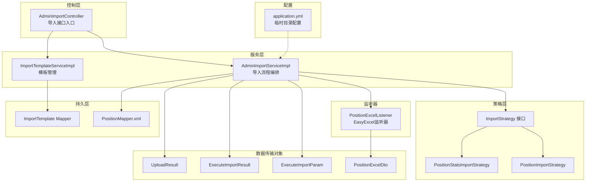
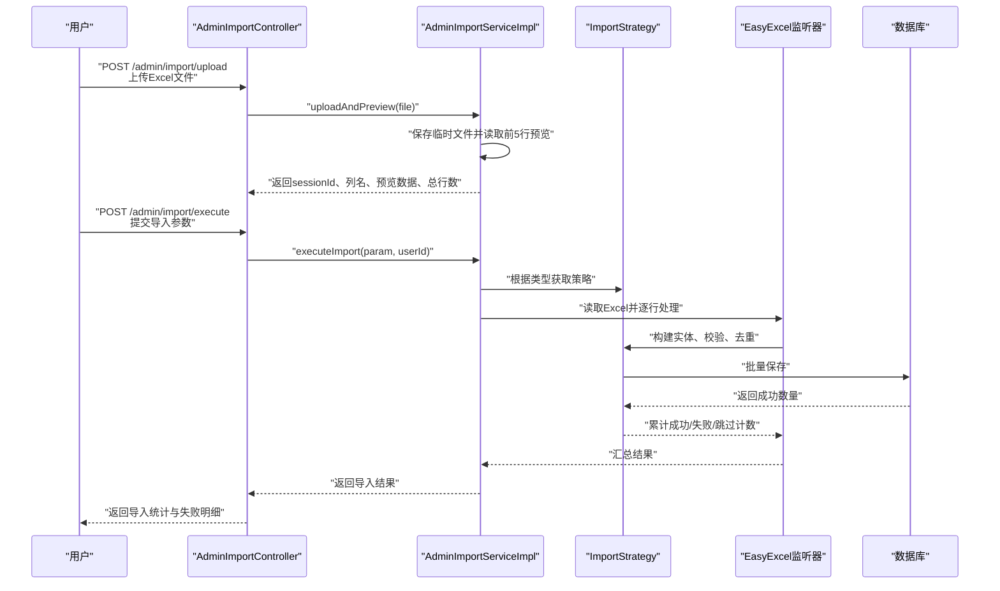
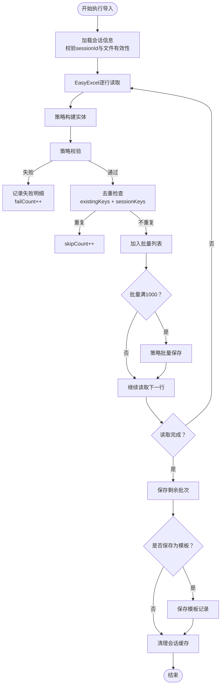
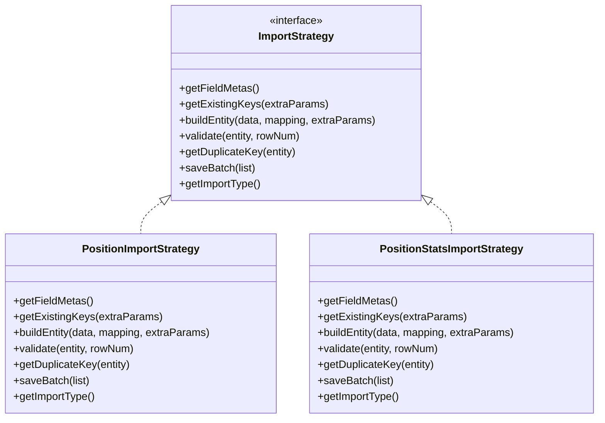
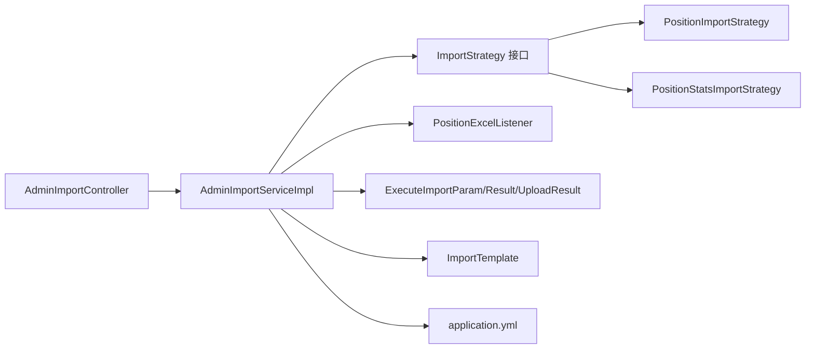

# Excel数据导入系统

<cite>
**本文引用的文件**
- [AdminImportController.java](file://src/main/java/com/macro/mall/tiny/modules/ums/controller/AdminImportController.java)
- [AdminImportServiceImpl.java](file://src/main/java/com/macro/mall/tiny/modules/ums/service/impl/AdminImportServiceImpl.java)
- [AdminImportService.java](file://src/main/java/com/macro/mall/tiny/modules/ums/service/AdminImportService.java)
- [PositionExcelListener.java](file://src/main/java/com/macro/mall/tiny/modules/ums/listener/PositionExcelListener.java)
- [ImportStrategy.java](file://src/main/java/com/macro/mall/tiny/modules/ums/strategy/ImportStrategy.java)
- [PositionImportStrategy.java](file://src/main/java/com/macro/mall/tiny/modules/ums/strategy/PositionImportStrategy.java)
- [PositionStatsImportStrategy.java](file://src/main/java/com/macro/mall/tiny/modules/ums/strategy/PositionStatsImportStrategy.java)
- [ImportTypeEnum.java](file://src/main/java/com/macro/mall/tiny/modules/ums/strategy/ImportTypeEnum.java)
- [ExecuteImportParam.java](file://src/main/java/com/macro/mall/tiny/modules/ums/dto/ExecuteImportParam.java)
- [ExecuteImportResult.java](file://src/main/java/com/macro/mall/tiny/modules/ums/dto/ExecuteImportResult.java)
- [UploadResult.java](file://src/main/java/com/macro/mall/tiny/modules/ums/dto/UploadResult.java)
- [ImportTemplate.java](file://src/main/java/com/macro/mall/tiny/modules/ums/model/ImportTemplate.java)
- [ImportTemplateService.java](file://src/main/java/com/macro/mall/tiny/modules/ums/service/ImportTemplateService.java)
- [ImportTemplateServiceImpl.java](file://src/main/java/com/macro/mall/tiny/modules/ums/service/impl/ImportTemplateServiceImpl.java)
- [PositionExcelDto.java](file://src/main/java/com/macro/mall/tiny/modules/ums/dto/PositionExcelDto.java)
- [PositionService.java](file://src/main/java/com/macro/mall/tiny/modules/ums/service/PositionService.java)
- [PositionServiceImpl.java](file://src/main/java/com/macro/mall/tiny/modules/ums/service/impl/PositionServiceImpl.java)
- [PositionMapper.java](file://src/main/resources/mapper/ums/PositionMapper.xml)
- [application.yml](file://src/main/resources/application.yml)
</cite>

## 目录
1. [简介](#简介)
2. [项目结构](#项目结构)
3. [核心组件](#核心组件)
4. [架构总览](#架构总览)
5. [详细组件分析](#详细组件分析)
6. [依赖分析](#依赖分析)
7. [性能考虑](#性能考虑)
8. [故障排查指南](#故障排查指南)
9. [结论](#结论)
10. [附录](#附录)

## 简介
本系统是一个基于Spring Boot与MyBatis Plus的企业级Excel数据导入平台，支持多类型数据导入（如岗位信息、岗位统计等），采用策略模式解耦不同导入类型，结合EasyExcel实现高性能的流式读取与批量写入。系统提供模板化导入能力，支持字段映射、格式校验、重复检测、错误回传与批量保存策略，覆盖从“模板下载—上传预览—执行导入—结果反馈”的完整闭环。

## 项目结构
系统采用按模块分层的组织方式，导入相关的核心代码集中在ums模块中，包含控制器、服务、策略、监听器、DTO、模型与Mapper等层次。

图表来源
- [AdminImportController.java:31-147](file://src/main/java/com/macro/mall/tiny/modules/ums/controller/AdminImportController.java#L31-L147)
- [AdminImportServiceImpl.java:37-331](file://src/main/java/com/macro/mall/tiny/modules/ums/service/impl/AdminImportServiceImpl.java#L37-L331)
- [ImportTemplateServiceImpl.java](file://src/main/java/com/macro/mall/tiny/modules/ums/service/impl/ImportTemplateServiceImpl.java)
- [ImportStrategy.java](file://src/main/java/com/macro/mall/tiny/modules/ums/strategy/ImportStrategy.java)
- [PositionImportStrategy.java](file://src/main/java/com/macro/mall/tiny/modules/ums/strategy/PositionImportStrategy.java)
- [PositionStatsImportStrategy.java](file://src/main/java/com/macro/mall/tiny/modules/ums/strategy/PositionStatsImportStrategy.java)
- [PositionExcelListener.java:20-239](file://src/main/java/com/macro/mall/tiny/modules/ums/listener/PositionExcelListener.java#L20-L239)
- [ExecuteImportParam.java:12-48](file://src/main/java/com/macro/mall/tiny/modules/ums/dto/ExecuteImportParam.java#L12-L48)
- [ExecuteImportResult.java:12-68](file://src/main/java/com/macro/mall/tiny/modules/ums/dto/ExecuteImportResult.java#L12-L68)
- [UploadResult.java:11-33](file://src/main/java/com/macro/mall/tiny/modules/ums/dto/UploadResult.java#L11-L33)
- [PositionExcelDto.java](file://src/main/java/com/macro/mall/tiny/modules/ums/dto/PositionExcelDto.java)
- [PositionMapper.java](file://src/main/resources/mapper/ums/PositionMapper.xml)
- [application.yml](file://src/main/resources/application.yml)

章节来源
- [AdminImportController.java:31-147](file://src/main/java/com/macro/mall/tiny/modules/ums/controller/AdminImportController.java#L31-L147)
- [AdminImportServiceImpl.java:37-331](file://src/main/java/com/macro/mall/tiny/modules/ums/service/impl/AdminImportServiceImpl.java#L37-L331)

## 核心组件
- 控制器层：提供导入类型查询、字段元数据获取、文件上传预览、执行导入、模板管理等REST接口。
- 服务层：负责导入流程编排、会话管理、策略选择、批量读取与保存、定时清理临时文件。
- 策略层：定义统一的导入策略接口，不同业务类型（岗位、岗位统计）实现各自的策略，解耦业务差异。
- 监听器层：基于EasyExcel的监听器，实现流式读取、逐行校验、去重、批量保存。
- DTO与模型：封装导入参数、结果、上传预览数据以及模板模型。
- 持久层：MyBatis XML映射文件，提供批量插入等SQL支持。

章节来源
- [AdminImportController.java:31-147](file://src/main/java/com/macro/mall/tiny/modules/ums/controller/AdminImportController.java#L31-L147)
- [AdminImportService.java:12-33](file://src/main/java/com/macro/mall/tiny/modules/ums/service/AdminImportService.java#L12-L33)
- [AdminImportServiceImpl.java:37-331](file://src/main/java/com/macro/mall/tiny/modules/ums/service/impl/AdminImportServiceImpl.java#L37-L331)
- [ImportStrategy.java](file://src/main/java/com/macro/mall/tiny/modules/ums/strategy/ImportStrategy.java)
- [PositionExcelListener.java:20-239](file://src/main/java/com/macro/mall/tiny/modules/ums/listener/PositionExcelListener.java#L20-L239)
- [ExecuteImportParam.java:12-48](file://src/main/java/com/macro/mall/tiny/modules/ums/dto/ExecuteImportParam.java#L12-L48)
- [ExecuteImportResult.java:12-68](file://src/main/java/com/macro/mall/tiny/modules/ums/dto/ExecuteImportResult.java#L12-L68)
- [UploadResult.java:11-33](file://src/main/java/com/macro/mall/tiny/modules/ums/dto/UploadResult.java#L11-L33)
- [ImportTemplate.java:15-58](file://src/main/java/com/macro/mall/tiny/modules/ums/model/ImportTemplate.java#L15-L58)

## 架构总览
系统采用“控制器-服务-策略-监听器-持久层”的分层架构，配合EasyExcel实现高性能流式读取与批量写入；通过策略模式实现多导入类型的统一入口与差异化处理；通过模板机制复用字段映射与导入逻辑。

图表来源
- [AdminImportController.java:61-93](file://src/main/java/com/macro/mall/tiny/modules/ums/controller/AdminImportController.java#L61-L93)
- [AdminImportServiceImpl.java:99-257](file://src/main/java/com/macro/mall/tiny/modules/ums/service/impl/AdminImportServiceImpl.java#L99-L257)
- [PositionExcelListener.java:82-121](file://src/main/java/com/macro/mall/tiny/modules/ums/listener/PositionExcelListener.java#L82-L121)

## 详细组件分析

### 控制器：AdminImportController
- 提供导入类型列表、字段元数据、上传预览、执行导入、模板列表、删除与保存模板等接口。
- 对外暴露权限注解，确保导入相关操作的安全性。
- 统一返回包装结果，便于前端展示与处理。

章节来源
- [AdminImportController.java:31-147](file://src/main/java/com/macro/mall/tiny/modules/ums/controller/AdminImportController.java#L31-L147)

### 服务：AdminImportServiceImpl
- 初始化阶段扫描并注册所有导入策略，避免泛型注入问题。
- 上传预览：生成会话ID、保存临时文件、使用EasyExcel读取前5行作为预览，同时缓存会话信息（文件路径、列名、创建时间）。
- 执行导入：根据会话信息定位临时文件，读取Excel并逐行处理，调用策略进行实体构建、校验、去重与批量保存。
- 批量策略：默认批量大小为1000，读完后一次性保存，减少数据库往返。
- 会话清理：定时任务清理超过1小时的临时文件与会话缓存。

图表来源
- [AdminImportServiceImpl.java:159-257](file://src/main/java/com/macro/mall/tiny/modules/ums/service/impl/AdminImportServiceImpl.java#L159-L257)

章节来源
- [AdminImportServiceImpl.java:37-331](file://src/main/java/com/macro/mall/tiny/modules/ums/service/impl/AdminImportServiceImpl.java#L37-L331)

### 策略模式：ImportStrategy与具体实现
- 接口职责：定义字段元数据、现有键集合、实体构建、校验、去重键生成、批量保存等方法，屏蔽不同业务类型的差异。
- 具体策略：
  - 岗位导入策略：实现岗位相关字段的映射、校验与批量保存。
  - 岗位统计导入策略：实现统计相关字段的映射、校验与批量保存。
- 策略选择：通过导入类型枚举与ApplicationContext收集的策略映射进行选择。

图表来源
- [ImportStrategy.java](file://src/main/java/com/macro/mall/tiny/modules/ums/strategy/ImportStrategy.java)
- [PositionImportStrategy.java](file://src/main/java/com/macro/mall/tiny/modules/ums/strategy/PositionImportStrategy.java)
- [PositionStatsImportStrategy.java](file://src/main/java/com/macro/mall/tiny/modules/ums/strategy/PositionStatsImportStrategy.java)

章节来源
- [ImportStrategy.java](file://src/main/java/com/macro/mall/tiny/modules/ums/strategy/ImportStrategy.java)
- [PositionImportStrategy.java](file://src/main/java/com/macro/mall/tiny/modules/ums/strategy/PositionImportStrategy.java)
- [PositionStatsImportStrategy.java](file://src/main/java/com/macro/mall/tiny/modules/ums/strategy/PositionStatsImportStrategy.java)
- [ImportTypeEnum.java](file://src/main/java/com/macro/mall/tiny/modules/ums/strategy/ImportTypeEnum.java)

### 监听器：PositionExcelListener（兼容旧实现）
- 流式读取：基于EasyExcel监听器，逐行读取并处理。
- 校验与去重：对必填字段、年份范围、枚举值、人数等进行校验；通过组合键（年份+部门+职位名称）进行去重。
- 批量保存：达到1000条触发一次批量保存，减少数据库压力。
- 结果汇总：记录成功、失败、跳过数量，并在最后保存剩余数据。

章节来源
- [PositionExcelListener.java:20-239](file://src/main/java/com/macro/mall/tiny/modules/ums/listener/PositionExcelListener.java#L20-L239)

### DTO与模型
- ExecuteImportParam：导入参数，包含导入类型、会话ID、列映射、年份、模板名称与保存标记。
- ExecuteImportResult：导入结果，包含成功/失败/跳过计数与失败明细。
- UploadResult：上传预览结果，包含会话ID、列名、预览数据与总行数。
- ImportTemplate：模板模型，包含模板名称、描述、导入类型、列映射JSON与创建者信息。
- PositionExcelDto：岗位Excel数据传输对象，承载各字段映射。

章节来源
- [ExecuteImportParam.java:12-48](file://src/main/java/com/macro/mall/tiny/modules/ums/dto/ExecuteImportParam.java#L12-L48)
- [ExecuteImportResult.java:12-68](file://src/main/java/com/macro/mall/tiny/modules/ums/dto/ExecuteImportResult.java#L12-L68)
- [UploadResult.java:11-33](file://src/main/java/com/macro/mall/tiny/modules/ums/dto/UploadResult.java#L11-L33)
- [ImportTemplate.java:15-58](file://src/main/java/com/macro/mall/tiny/modules/ums/model/ImportTemplate.java#L15-L58)
- [PositionExcelDto.java](file://src/main/java/com/macro/mall/tiny/modules/ums/dto/PositionExcelDto.java)

### 持久层与模板管理
- 模板服务：提供模板列表、保存模板、按导入类型筛选等功能。
- Mapper：提供批量插入等SQL支持，配合策略实现批量保存。
- 配置：通过application.yml设置导入临时目录，避免跨平台路径问题。

章节来源
- [ImportTemplateService.java](file://src/main/java/com/macro/mall/tiny/modules/ums/service/ImportTemplateService.java)
- [ImportTemplateServiceImpl.java](file://src/main/java/com/macro/mall/tiny/modules/ums/service/impl/ImportTemplateServiceImpl.java)
- [PositionMapper.java](file://src/main/resources/mapper/ums/PositionMapper.xml)
- [application.yml](file://src/main/resources/application.yml)

## 依赖分析
- 控制器依赖服务接口与策略枚举，保证对外接口稳定。
- 服务实现依赖EasyExcel、Hutool工具库、ApplicationContext以动态发现策略Bean。
- 策略依赖服务层提供的批量保存能力与业务实体。
- 监听器依赖策略接口与服务层批量保存能力。
- 模板管理依赖模板模型与持久层Mapper。

图表来源
- [AdminImportController.java:31-147](file://src/main/java/com/macro/mall/tiny/modules/ums/controller/AdminImportController.java#L31-L147)
- [AdminImportServiceImpl.java:37-331](file://src/main/java/com/macro/mall/tiny/modules/ums/service/impl/AdminImportServiceImpl.java#L37-L331)
- [ImportStrategy.java](file://src/main/java/com/macro/mall/tiny/modules/ums/strategy/ImportStrategy.java)
- [PositionImportStrategy.java](file://src/main/java/com/macro/mall/tiny/modules/ums/strategy/PositionImportStrategy.java)
- [PositionStatsImportStrategy.java](file://src/main/java/com/macro/mall/tiny/modules/ums/strategy/PositionStatsImportStrategy.java)
- [PositionExcelListener.java:20-239](file://src/main/java/com/macro/mall/tiny/modules/ums/listener/PositionExcelListener.java#L20-L239)
- [ExecuteImportParam.java:12-48](file://src/main/java/com/macro/mall/tiny/modules/ums/dto/ExecuteImportParam.java#L12-L48)
- [ExecuteImportResult.java:12-68](file://src/main/java/com/macro/mall/tiny/modules/ums/dto/ExecuteImportResult.java#L12-L68)
- [UploadResult.java:11-33](file://src/main/java/com/macro/mall/tiny/modules/ums/dto/UploadResult.java#L11-L33)
- [ImportTemplate.java:15-58](file://src/main/java/com/macro/mall/tiny/modules/ums/model/ImportTemplate.java#L15-L58)
- [application.yml](file://src/main/resources/application.yml)

## 性能考虑
- 流式读取：使用EasyExcel逐行读取，避免一次性加载整个Excel到内存，降低内存峰值。
- 批量写入：默认批量大小为1000，减少数据库往返次数，提升吞吐量。
- 会话缓存：上传后将临时文件路径与列名缓存于内存，避免重复IO；定时清理过期会话，释放内存。
- 去重策略：利用existingKeys与sessionKeys双重去重，避免重复入库与重复校验开销。
- 并发控制：当前实现未引入线程池或队列，建议在高并发场景下增加异步导入与队列化处理，避免阻塞主线程。
- 大文件处理：建议限制单次导入行数与文件大小，结合分片上传与断点续传机制（可扩展）。

## 故障排查指南
- 会话过期：当sessionId无效或对应临时文件不存在时，返回会话过期错误，需重新上传。
- 文件格式错误：仅支持.xlsx与.xls格式，非Excel文件将被拒绝。
- 字段映射异常：mapping中的列索引需与实际列一致，否则可能导致空值或错位。
- 校验失败：策略校验失败会在结果中记录失败明细，逐行定位问题。
- 批量保存异常：若某一批次保存失败，系统会记录失败数量与明细，不影响已成功部分。
- 模板保存失败：保存模板时需提供模板名称与正确的导入类型。

章节来源
- [AdminImportController.java:61-79](file://src/main/java/com/macro/mall/tiny/modules/ums/controller/AdminImportController.java#L61-L79)
- [AdminImportServiceImpl.java:174-257](file://src/main/java/com/macro/mall/tiny/modules/ums/service/impl/AdminImportServiceImpl.java#L174-L257)
- [ExecuteImportResult.java:38-68](file://src/main/java/com/macro/mall/tiny/modules/ums/dto/ExecuteImportResult.java#L38-L68)

## 结论
本系统通过策略模式与EasyExcel实现了可扩展、高性能的Excel导入能力，具备完善的字段映射、校验、去重与批量保存机制。通过模板化导入与会话管理，提升了用户体验与可维护性。建议在生产环境中进一步完善并发控制、错误恢复与监控告警，以支撑更大规模的数据导入场景。

## 附录

### 导入流程示例（从模板下载到数据入库）
- 步骤1：获取导入类型列表与字段元数据，确认导入类型与字段含义。
- 步骤2：下载对应模板，按字段要求填写数据。
- 步骤3：上传Excel文件，系统返回会话ID与预览数据。
- 步骤4：核对预览数据，确认字段映射与数据质量。
- 步骤5：提交执行导入参数（包含会话ID、字段映射、年份、是否保存模板等），系统开始逐行读取与处理。
- 步骤6：查看导入结果，包含成功/失败/跳过数量与失败明细，必要时修正后重新导入。

章节来源
- [AdminImportController.java:43-93](file://src/main/java/com/macro/mall/tiny/modules/ums/controller/AdminImportController.java#L43-L93)
- [AdminImportServiceImpl.java:99-257](file://src/main/java/com/macro/mall/tiny/modules/ums/service/impl/AdminImportServiceImpl.java#L99-L257)

### 导入模板设计规范
- 字段映射：模板中字段名称与策略定义保持一致，列索引从0开始。
- 数据验证：年份、人数等数值字段需满足范围与格式要求；枚举字段需在允许范围内。
- 错误反馈：失败明细包含行号、原始数据与失败原因，便于快速修复。
- 保存模板：可将本次字段映射保存为模板，便于后续复用。

章节来源
- [ExecuteImportParam.java:25-47](file://src/main/java/com/macro/mall/tiny/modules/ums/dto/ExecuteImportParam.java#L25-L47)
- [ExecuteImportResult.java:38-68](file://src/main/java/com/macro/mall/tiny/modules/ums/dto/ExecuteImportResult.java#L38-L68)
- [ImportTemplate.java:34-42](file://src/main/java/com/macro/mall/tiny/modules/ums/model/ImportTemplate.java#L34-L42)

### 扩展导入功能的最佳实践
- 新增导入类型：新增策略实现类，实现ImportStrategy接口，并在初始化阶段自动注册。
- 自定义校验：在策略中扩展validate方法，覆盖业务特定的校验规则。
- 批量策略：根据数据量调整批量大小，平衡内存占用与吞吐量。
- 监控与日志：为导入过程添加埋点与日志，便于追踪性能瓶颈与异常。
- 异步与队列：在高并发场景下引入消息队列与异步任务，实现削峰填谷。

章节来源
- [ImportStrategy.java](file://src/main/java/com/macro/mall/tiny/modules/ums/strategy/ImportStrategy.java)
- [AdminImportServiceImpl.java:61-72](file://src/main/java/com/macro/mall/tiny/modules/ums/service/impl/AdminImportServiceImpl.java#L61-L72)