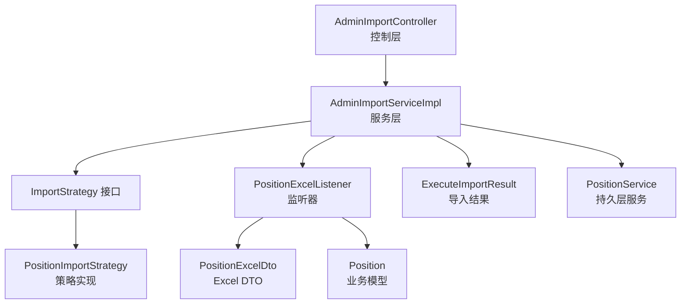
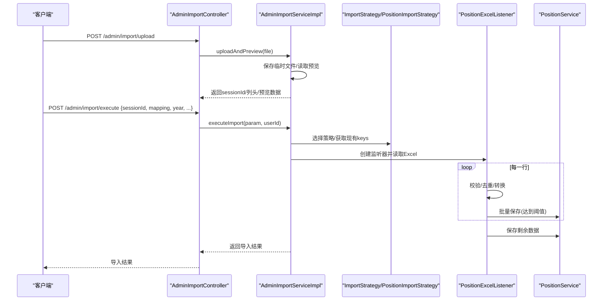
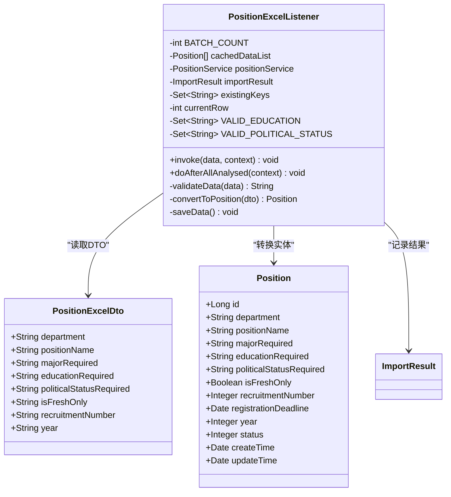
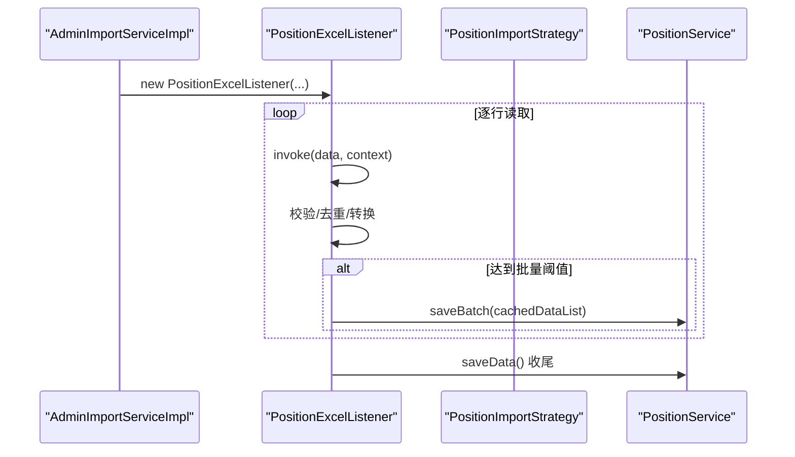
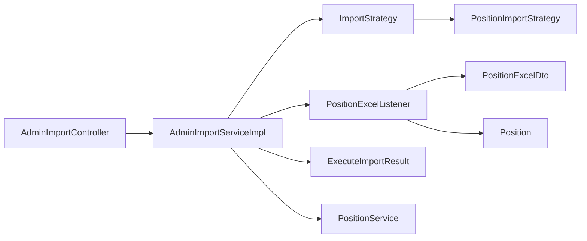
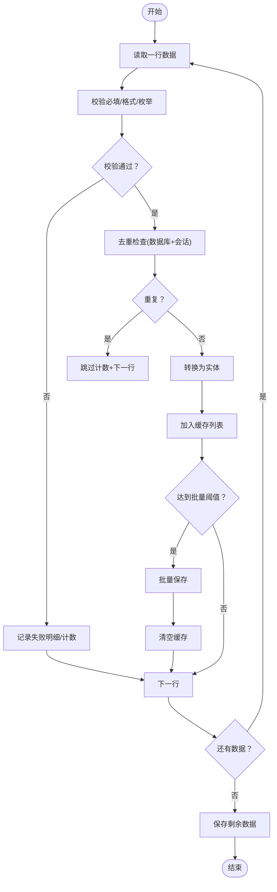

# Excel监听器设计

<cite>
**本文引用的文件**
- [PositionExcelListener.java](file://src/main/java/com/macro/mall/tiny/modules/ums/listener/PositionExcelListener.java)
- [PositionExcelDto.java](file://src/main/java/com/macro/mall/tiny/modules/ums/dto/PositionExcelDto.java)
- [AdminImportServiceImpl.java](file://src/main/java/com/macro/mall/tiny/modules/ums/service/impl/AdminImportServiceImpl.java)
- [AdminImportController.java](file://src/main/java/com/macro/mall/tiny/modules/ums/controller/AdminImportController.java)
- [PositionImportStrategy.java](file://src/main/java/com/macro/mall/tiny/modules/ums/strategy/PositionImportStrategy.java)
- [ImportStrategy.java](file://src/main/java/com/macro/mall/tiny/modules/ums/strategy/ImportStrategy.java)
- [ImportTypeEnum.java](file://src/main/java/com/macro/mall/tiny/modules/ums/strategy/ImportTypeEnum.java)
- [Position.java](file://src/main/java/com/macro/mall/tiny/modules/ums/model/Position.java)
- [ImportResult.java](file://src/main/java/com/macro/mall/tiny/modules/ums/dto/ImportResult.java)
- [ExecuteImportParam.java](file://src/main/java/com/macro/mall/tiny/modules/ums/dto/ExecuteImportParam.java)
- [ExecuteImportResult.java](file://src/main/java/com/macro/mall/tiny/modules/ums/dto/ExecuteImportResult.java)
- [PositionService.java](file://src/main/java/com/macro/mall/tiny/modules/ums/service/PositionService.java)
</cite>

## 目录
1. [简介](#简介)
2. [项目结构](#项目结构)
3. [核心组件](#核心组件)
4. [架构总览](#架构总览)
5. [详细组件分析](#详细组件分析)
6. [依赖分析](#依赖分析)
7. [性能考虑](#性能考虑)
8. [故障排查指南](#故障排查指南)
9. [结论](#结论)
10. [附录](#附录)

## 简介
本文件围绕Excel导入子系统中的“监听器设计”展开，重点解析基于EasyExcel的监听器工作原理与实现机制，涵盖以下主题：
- PositionExcelListener类的设计思路、数据读取流程与事件处理机制
- 监听器的数据转换过程：从Excel单元格数据到业务DTO对象的映射规则、字段验证逻辑、数据类型转换
- 批量处理策略：内存管理、批量保存、事务控制等关键点
- 错误处理机制：数据格式错误、业务规则校验失败、重复数据检测
- 性能优化建议：大数据量处理、内存使用优化、并发控制
- 扩展指南：如何为不同导入类型实现自定义监听器与策略

## 项目结构
本项目采用模块化与分层架构，Excel导入功能主要分布在以下包与类中：
- 控制层：AdminImportController 提供导入接口与模板管理
- 服务层：AdminImportServiceImpl 实现导入流程编排、事务控制与会话管理
- 策略层：ImportStrategy 接口及其实现（如 PositionImportStrategy）负责通用导入流程
- 监听器层：PositionExcelListener 基于EasyExcel ReadListener，面向具体Excel DTO的监听器
- DTO/模型：PositionExcelDto、Position、ImportResult、ExecuteImportParam/Result 等
- 枚举：ImportTypeEnum 定义导入类型

图表来源
- [AdminImportController.java:31-148](file://src/main/java/com/macro/mall/tiny/modules/ums/controller/AdminImportController.java#L31-L148)
- [AdminImportServiceImpl.java:37-332](file://src/main/java/com/macro/mall/tiny/modules/ums/service/impl/AdminImportServiceImpl.java#L37-L332)
- [ImportStrategy.java:15-68](file://src/main/java/com/macro/mall/tiny/modules/ums/strategy/ImportStrategy.java#L15-L68)
- [PositionImportStrategy.java:15-231](file://src/main/java/com/macro/mall/tiny/modules/ums/strategy/PositionImportStrategy.java#L15-L231)
- [PositionExcelListener.java:20-240](file://src/main/java/com/macro/mall/tiny/modules/ums/listener/PositionExcelListener.java#L20-L240)
- [PositionExcelDto.java:10-36](file://src/main/java/com/macro/mall/tiny/modules/ums/dto/PositionExcelDto.java#L10-L36)
- [Position.java:23-67](file://src/main/java/com/macro/mall/tiny/modules/ums/model/Position.java#L23-L67)
- [ExecuteImportResult.java:12-68](file://src/main/java/com/macro/mall/tiny/modules/ums/dto/ExecuteImportResult.java#L12-L68)
- [PositionService.java:20-46](file://src/main/java/com/macro/mall/tiny/modules/ums/service/PositionService.java#L20-L46)

章节来源
- [AdminImportController.java:31-148](file://src/main/java/com/macro/mall/tiny/modules/ums/controller/AdminImportController.java#L31-L148)
- [AdminImportServiceImpl.java:37-332](file://src/main/java/com/macro/mall/tiny/modules/ums/service/impl/AdminImportServiceImpl.java#L37-L332)

## 核心组件
- 监听器 PositionExcelListener：实现 ReadListener<PositionExcelDto>，负责逐行读取、校验、去重、转换与批量保存
- DTO PositionExcelDto：声明Excel列与字段的映射关系
- 策略接口 ImportStrategy：定义通用构建实体、校验、去重、批量保存等能力
- 策略实现 PositionImportStrategy：针对岗位导入的具体实现
- 服务 AdminImportServiceImpl：统一编排导入流程、事务控制、会话管理与模板保存
- 控制器 AdminImportController：对外暴露导入接口与模板管理接口
- 结果模型 ImportResult/ExecuteImportResult：记录成功/失败/跳过与失败明细
- 业务模型 Position：持久化实体
- 服务 PositionService：提供批量保存等能力

章节来源
- [PositionExcelListener.java:20-240](file://src/main/java/com/macro/mall/tiny/modules/ums/listener/PositionExcelListener.java#L20-L240)
- [PositionExcelDto.java:10-36](file://src/main/java/com/macro/mall/tiny/modules/ums/dto/PositionExcelDto.java#L10-L36)
- [ImportStrategy.java:15-68](file://src/main/java/com/macro/mall/tiny/modules/ums/strategy/ImportStrategy.java#L15-L68)
- [PositionImportStrategy.java:15-231](file://src/main/java/com/macro/mall/tiny/modules/ums/strategy/PositionImportStrategy.java#L15-L231)
- [AdminImportServiceImpl.java:37-332](file://src/main/java/com/macro/mall/tiny/modules/ums/service/impl/AdminImportServiceImpl.java#L37-L332)
- [AdminImportController.java:31-148](file://src/main/java/com/macro/mall/tiny/modules/ums/controller/AdminImportController.java#L31-L148)
- [ImportResult.java:12-41](file://src/main/java/com/macro/mall/tiny/modules/ums/dto/ImportResult.java#L12-L41)
- [ExecuteImportResult.java:12-68](file://src/main/java/com/macro/mall/tiny/modules/ums/dto/ExecuteImportResult.java#L12-L68)
- [Position.java:23-67](file://src/main/java/com/macro/mall/tiny/modules/ums/model/Position.java#L23-L67)
- [PositionService.java:20-46](file://src/main/java/com/macro/mall/tiny/modules/ums/service/PositionService.java#L20-L46)

## 架构总览
整体流程分为“上传预览”和“执行导入”两阶段：
- 上传预览：保存临时文件，使用EasyExcel读取前N行作为预览，并缓存会话信息
- 执行导入：根据导入类型选择策略，逐行读取Excel，构建实体、校验、去重、批量保存；最终清理会话

图表来源
- [AdminImportController.java:62-93](file://src/main/java/com/macro/mall/tiny/modules/ums/controller/AdminImportController.java#L62-L93)
- [AdminImportServiceImpl.java:100-257](file://src/main/java/com/macro/mall/tiny/modules/ums/service/impl/AdminImportServiceImpl.java#L100-L257)
- [PositionExcelListener.java:82-121](file://src/main/java/com/macro/mall/tiny/modules/ums/listener/PositionExcelListener.java#L82-L121)
- [PositionImportStrategy.java:83-137](file://src/main/java/com/macro/mall/tiny/modules/ums/strategy/PositionImportStrategy.java#L83-L137)
- [PositionService.java:30](file://src/main/java/com/macro/mall/tiny/modules/ums/service/PositionService.java#L30)

## 详细组件分析

### 监听器 PositionExcelListener 设计与实现
- 设计目标
  - 基于EasyExcel ReadListener，逐行读取 PositionExcelDto
  - 在内存中累积一定数量后批量写入，避免内存溢出
  - 对必填字段、格式、枚举值进行校验
  - 去重：基于“年份+部门+职位名称”的组合键
  - 将Excel DTO转换为业务实体 Position 并入库

- 关键实现要点
  - 批量阈值：固定批次大小，达到阈值触发保存
  - 缓存列表：使用期望容量初始化，降低扩容成本
  - 校验逻辑：必填项、年份范围、枚举值、人数正数等
  - 去重策略：使用Set维护已存在键，同时避免Excel内重复
  - 转换逻辑：字段清洗、布尔值映射、整数转换、默认值填充
  - 收尾处理：分析完成后保存剩余数据

图表来源
- [PositionExcelListener.java:20-240](file://src/main/java/com/macro/mall/tiny/modules/ums/listener/PositionExcelListener.java#L20-L240)
- [PositionExcelDto.java:10-36](file://src/main/java/com/macro/mall/tiny/modules/ums/dto/PositionExcelDto.java#L10-L36)
- [Position.java:23-67](file://src/main/java/com/macro/mall/tiny/modules/ums/model/Position.java#L23-L67)

章节来源
- [PositionExcelListener.java:20-240](file://src/main/java/com/macro/mall/tiny/modules/ums/listener/PositionExcelListener.java#L20-L240)

### 数据读取流程与事件处理机制
- 读取入口
  - 控制器接收文件并调用服务层上传与预览
  - 服务层使用EasyExcel读取Excel，回调 AnalysisEventListener
- 事件处理
  - 头部回调：收集列标题
  - 行回调：构建行数据、调用策略/监听器进行校验、去重、转换与累加
  - 结束回调：保存剩余数据

图表来源
- [AdminImportServiceImpl.java:204-246](file://src/main/java/com/macro/mall/tiny/modules/ums/service/impl/AdminImportServiceImpl.java#L204-L246)
- [PositionExcelListener.java:82-121](file://src/main/java/com/macro/mall/tiny/modules/ums/listener/PositionExcelListener.java#L82-L121)
- [PositionService.java:30](file://src/main/java/com/macro/mall/tiny/modules/ums/service/PositionService.java#L30)

章节来源
- [AdminImportServiceImpl.java:100-257](file://src/main/java/com/macro/mall/tiny/modules/ums/service/impl/AdminImportServiceImpl.java#L100-L257)

### 数据转换与映射规则
- 映射规则
  - 通过注解声明列索引与字段对应关系
  - 监听器/策略均以DTO/Map形式接收单元格值
- 字段验证
  - 必填项：部门、职位名称、年份
  - 年份：整数且在合理范围内
  - 枚举：学历、政治面貌限定集合
  - 人数：正整数
- 类型转换
  - 字符串清洗：trim
  - 布尔映射：支持多形态（数字/中文/布尔字符串）
  - 整数转换：默认值填充
- 去重键
  - 年份+部门+职位名称组合键

章节来源
- [PositionExcelDto.java:10-36](file://src/main/java/com/macro/mall/tiny/modules/ums/dto/PositionExcelDto.java#L10-L36)
- [PositionExcelListener.java:126-187](file://src/main/java/com/macro/mall/tiny/modules/ums/listener/PositionExcelListener.java#L126-L187)
- [PositionImportStrategy.java:140-165](file://src/main/java/com/macro/mall/tiny/modules/ums/strategy/PositionImportStrategy.java#L140-L165)

### 批量处理策略
- 内存管理
  - 固定批次大小，减少频繁扩容
  - 分批清空缓存列表，释放内存
- 批量保存
  - 监听器：达到阈值调用服务层批量保存
  - 通用策略：逐行构建实体，满批保存
- 事务控制
  - 服务层方法开启事务，保证导入一致性
  - 失败回滚，确保数据一致

章节来源
- [PositionExcelListener.java:25-30](file://src/main/java/com/macro/mall/tiny/modules/ums/listener/PositionExcelListener.java#L25-L30)
- [PositionExcelListener.java:112-114](file://src/main/java/com/macro/mall/tiny/modules/ums/listener/PositionExcelListener.java#L112-L114)
- [AdminImportServiceImpl.java:160](file://src/main/java/com/macro/mall/tiny/modules/ums/service/impl/AdminImportServiceImpl.java#L160)
- [AdminImportServiceImpl.java:232-236](file://src/main/java/com/macro/mall/tiny/modules/ums/service/impl/AdminImportServiceImpl.java#L232-L236)

### 错误处理机制
- 数据格式错误
  - 年份/人数解析异常：返回格式错误提示
- 业务规则校验失败
  - 必填字段缺失、枚举值不在允许集合、人数非正
- 重复数据检测
  - 监听器：基于Set检查Excel内重复
  - 通用策略：结合数据库已有数据与会话内重复键
- 失败明细
  - 记录行号、原始数据与失败原因，便于定位

章节来源
- [PositionExcelListener.java:86-102](file://src/main/java/com/macro/mall/tiny/modules/ums/listener/PositionExcelListener.java#L86-L102)
- [PositionExcelListener.java:126-187](file://src/main/java/com/macro/mall/tiny/modules/ums/listener/PositionExcelListener.java#L126-L187)
- [AdminImportServiceImpl.java:213-219](file://src/main/java/com/macro/mall/tiny/modules/ums/service/impl/AdminImportServiceImpl.java#L213-L219)
- [ExecuteImportResult.java:38-67](file://src/main/java/com/macro/mall/tiny/modules/ums/dto/ExecuteImportResult.java#L38-L67)

### 扩展指南：自定义监听器与策略
- 新增导入类型步骤
  - 定义DTO：声明Excel列与字段映射
  - 实现策略：实现 ImportStrategy 接口，提供构建实体、校验、去重、批量保存
  - 控制器：新增类型枚举与字段元数据接口
  - 服务层：复用通用导入流程，或按需定制监听器
- 监听器适配
  - 若采用监听器模式，实现 ReadListener<T>，遵循批量阈值、去重、转换与收尾保存
- 最佳实践
  - 统一校验与去重逻辑，避免重复实现
  - 明确默认值与容错策略
  - 保持事务边界清晰

章节来源
- [ImportStrategy.java:15-68](file://src/main/java/com/macro/mall/tiny/modules/ums/strategy/ImportStrategy.java#L15-L68)
- [PositionImportStrategy.java:15-231](file://src/main/java/com/macro/mall/tiny/modules/ums/strategy/PositionImportStrategy.java#L15-L231)
- [ImportTypeEnum.java:9-40](file://src/main/java/com/macro/mall/tiny/modules/ums/strategy/ImportTypeEnum.java#L9-L40)
- [AdminImportController.java:43-59](file://src/main/java/com/macro/mall/tiny/modules/ums/controller/AdminImportController.java#L43-L59)

## 依赖分析
- 组件耦合
  - 监听器依赖服务层与结果模型，职责单一，内聚性高
  - 服务层通过策略接口解耦不同导入类型
  - 控制器仅负责接口与鉴权，不参与业务细节
- 外部依赖
  - EasyExcel：提供读取回调与监听器机制
  - Spring：事务、Bean装配、定时任务
- 可能的循环依赖
  - 未发现直接循环依赖；策略通过ApplicationContext收集，避免泛型注入问题

图表来源
- [AdminImportController.java:31-148](file://src/main/java/com/macro/mall/tiny/modules/ums/controller/AdminImportController.java#L31-L148)
- [AdminImportServiceImpl.java:37-332](file://src/main/java/com/macro/mall/tiny/modules/ums/service/impl/AdminImportServiceImpl.java#L37-L332)
- [ImportStrategy.java:15-68](file://src/main/java/com/macro/mall/tiny/modules/ums/strategy/ImportStrategy.java#L15-L68)
- [PositionImportStrategy.java:15-231](file://src/main/java/com/macro/mall/tiny/modules/ums/strategy/PositionImportStrategy.java#L15-L231)
- [PositionExcelListener.java:20-240](file://src/main/java/com/macro/mall/tiny/modules/ums/listener/PositionExcelListener.java#L20-L240)
- [PositionExcelDto.java:10-36](file://src/main/java/com/macro/mall/tiny/modules/ums/dto/PositionExcelDto.java#L10-L36)
- [Position.java:23-67](file://src/main/java/com/macro/mall/tiny/modules/ums/model/Position.java#L23-L67)
- [ExecuteImportResult.java:12-68](file://src/main/java/com/macro/mall/tiny/modules/ums/dto/ExecuteImportResult.java#L12-L68)
- [PositionService.java:20-46](file://src/main/java/com/macro/mall/tiny/modules/ums/service/PositionService.java#L20-L46)

章节来源
- [AdminImportServiceImpl.java:61-72](file://src/main/java/com/macro/mall/tiny/modules/ums/service/impl/AdminImportServiceImpl.java#L61-L72)

## 性能考虑
- 大数据量处理
  - 固定批次大小，平衡吞吐与内存占用
  - 逐行读取，避免一次性加载全部数据
- 内存使用优化
  - 使用期望容量初始化缓存列表
  - 批量保存后及时清空缓存
- 并发控制
  - 单次导入在服务层开启事务，避免并发写入导致的重复与脏数据
  - 临时文件与会话缓存使用线程安全容器
- I/O与网络
  - 上传文件先落盘，再读取，避免内存峰值
  - 定时清理过期临时文件，释放磁盘空间

## 故障排查指南
- 常见问题
  - 文件格式不正确：检查扩展名与MIME类型
  - 会话过期：确认sessionId是否有效
  - 列映射错误：核对字段与列索引
  - 校验失败：查看失败明细中的行号与原因
- 调试技巧
  - 启用日志：关注服务层导入流程与事务边界
  - 逐步缩小：先验证预览，再执行导入
  - 单元测试：针对校验与转换逻辑编写断言

章节来源
- [AdminImportController.java:62-79](file://src/main/java/com/macro/mall/tiny/modules/ums/controller/AdminImportController.java#L62-L79)
- [AdminImportServiceImpl.java:177-185](file://src/main/java/com/macro/mall/tiny/modules/ums/service/impl/AdminImportServiceImpl.java#L177-L185)
- [ExecuteImportResult.java:38-67](file://src/main/java/com/macro/mall/tiny/modules/ums/dto/ExecuteImportResult.java#L38-L67)

## 结论
本设计以EasyExcel监听器为核心，结合策略模式与服务层编排，实现了可扩展、可维护、高性能的Excel导入体系。通过明确的校验、去重与批量保存机制，以及完善的错误反馈与事务控制，能够稳定支撑各类业务数据导入场景。开发者可据此快速扩展新的导入类型，并在保证性能与一致性的前提下提升用户体验。

## 附录
- 关键流程图：监听器逐行处理与批量保存

图表来源
- [PositionExcelListener.java:82-121](file://src/main/java/com/macro/mall/tiny/modules/ums/listener/PositionExcelListener.java#L82-L121)
- [AdminImportServiceImpl.java:204-246](file://src/main/java/com/macro/mall/tiny/modules/ums/service/impl/AdminImportServiceImpl.java#L204-L246)