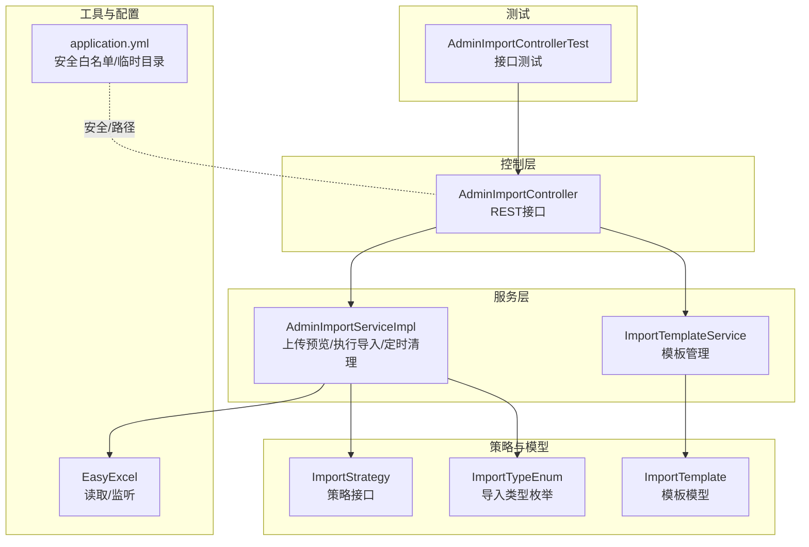
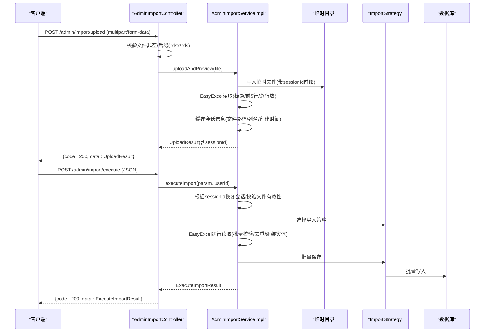
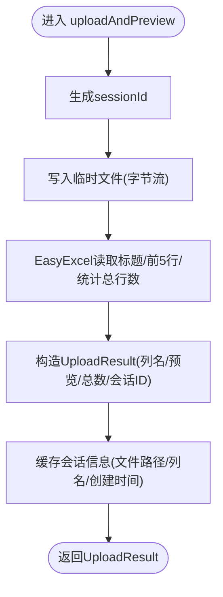
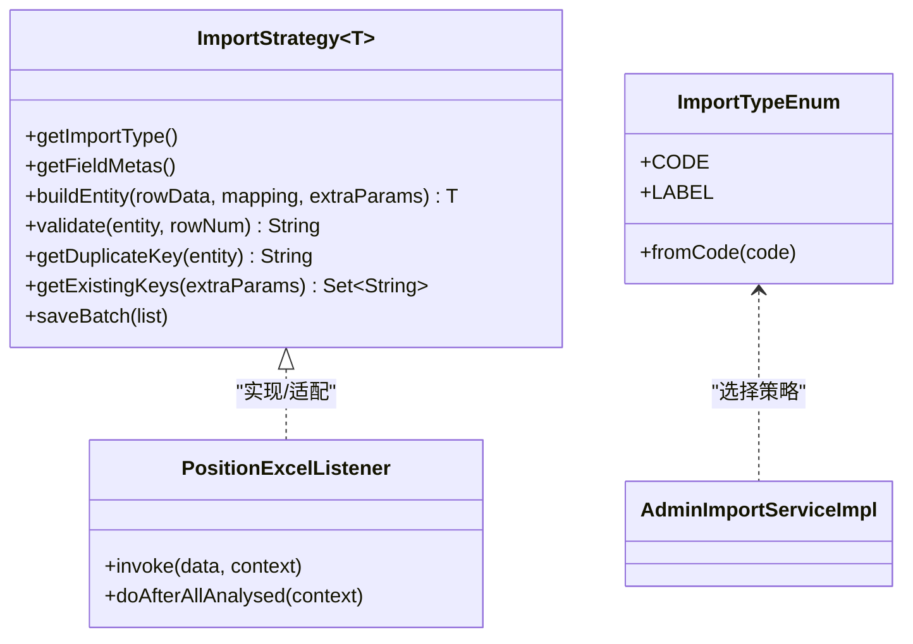
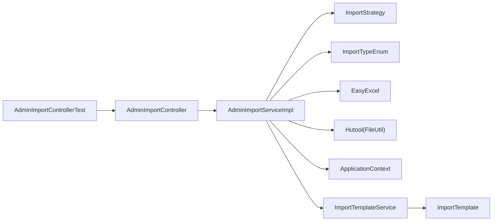
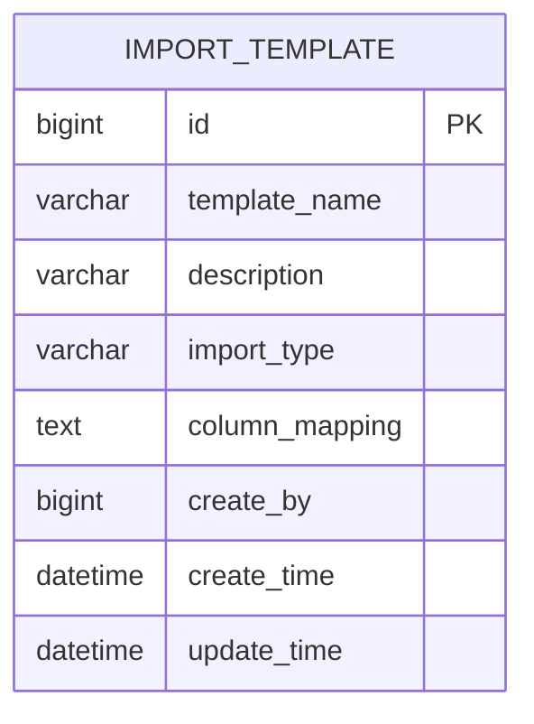

# Excel文件上传与处理

<cite>
**本文引用的文件**
- [AdminImportController.java](file://src/main/java/com/macro/mall/tiny/modules/ums/controller/AdminImportController.java)
- [AdminImportServiceImpl.java](file://src/main/java/com/macro/mall/tiny/modules/ums/service/impl/AdminImportServiceImpl.java)
- [AdminImportService.java](file://src/main/java/com/macro/mall/tiny/modules/ums/service/AdminImportService.java)
- [UploadResult.java](file://src/main/java/com/macro/mall/tiny/modules/ums/dto/UploadResult.java)
- [ExecuteImportParam.java](file://src/main/java/com/macro/mall/tiny/modules/ums/dto/ExecuteImportParam.java)
- [ExecuteImportResult.java](file://src/main/java/com/macro/mall/tiny/modules/ums/dto/ExecuteImportResult.java)
- [ImportStrategy.java](file://src/main/java/com/macro/mall/tiny/modules/ums/strategy/ImportStrategy.java)
- [ImportTypeEnum.java](file://src/main/java/com/macro/mall/tiny/modules/ums/strategy/ImportTypeEnum.java)
- [PositionExcelListener.java](file://src/main/java/com/macro/mall/tiny/modules/ums/listener/PositionExcelListener.java)
- [ImportTemplate.java](file://src/main/java/com/macro/mall/tiny/modules/ums/model/ImportTemplate.java)
- [ImportTemplateService.java](file://src/main/java/com/macro/mall/tiny/modules/ums/service/ImportTemplateService.java)
- [application.yml](file://src/main/resources/application.yml)
- [AdminImportControllerTest.java](file://src/test/java/com/macro/mall/tiny/modules/ums/controller/AdminImportControllerTest.java)
- [ResultCode.java](file://src/main/java/com/macro/mall/tiny/common/api/ResultCode.java)
- [Asserts.java](file://src/main/java/com/macro/mall/tiny/common/exception/Asserts.java)
- [import_template.sql](file://sql/import_template.sql)
</cite>

## 目录
1. [简介](#简介)
2. [项目结构](#项目结构)
3. [核心组件](#核心组件)
4. [架构总览](#架构总览)
5. [详细组件分析](#详细组件分析)
6. [依赖分析](#依赖分析)
7. [性能考虑](#性能考虑)
8. [故障排查指南](#故障排查指南)
9. [结论](#结论)
10. [附录](#附录)

## 简介
本文件围绕Excel文件上传与处理功能进行系统化说明，覆盖接口设计、参数处理、格式与大小限制、安全检查、数据读取与预览、错误处理机制、安全防护策略、完整流程示例以及扩展与优化建议。目标读者为后端与全栈开发者，帮助快速理解并安全高效地集成Excel导入能力。

## 项目结构
Excel导入模块位于“ums”子系统内，采用“控制层-服务层-策略层-监听器/DTO/模型”的分层架构，并通过EasyExcel实现高性能读取与分批写入。

图表来源
- [AdminImportController.java:31-148](file://src/main/java/com/macro/mall/tiny/modules/ums/controller/AdminImportController.java#L31-L148)
- [AdminImportServiceImpl.java:37-332](file://src/main/java/com/macro/mall/tiny/modules/ums/service/impl/AdminImportServiceImpl.java#L37-L332)
- [ImportStrategy.java:15-69](file://src/main/java/com/macro/mall/tiny/modules/ums/strategy/ImportStrategy.java#L15-L69)
- [ImportTypeEnum.java:9-41](file://src/main/java/com/macro/mall/tiny/modules/ums/strategy/ImportTypeEnum.java#L9-L41)
- [ImportTemplate.java:15-59](file://src/main/java/com/macro/mall/tiny/modules/ums/model/ImportTemplate.java#L15-L59)
- [application.yml:38-57](file://src/main/resources/application.yml#L38-L57)
- [AdminImportControllerTest.java:37-155](file://src/test/java/com/macro/mall/tiny/modules/ums/controller/AdminImportControllerTest.java#L37-L155)

章节来源
- [AdminImportController.java:31-148](file://src/main/java/com/macro/mall/tiny/modules/ums/controller/AdminImportController.java#L31-L148)
- [AdminImportServiceImpl.java:37-332](file://src/main/java/com/macro/mall/tiny/modules/ums/service/impl/AdminImportServiceImpl.java#L37-L332)
- [application.yml:38-57](file://src/main/resources/application.yml#L38-L57)

## 核心组件
- 控制器：提供“获取导入类型”“获取字段元数据”“上传并预览”“执行导入”“模板管理”等接口，统一鉴权与返回包装。
- 服务实现：负责临时文件落盘、EasyExcel读取、预览数据生成、会话缓存、批量导入、模板保存、定时清理等。
- 策略接口：以策略模式支持多类型导入，定义构建实体、校验、去重、批量保存等规范。
- DTO与模型：封装上传预览结果、执行参数、执行结果、模板模型等。
- 安全配置：白名单放行导入接口，结合Spring Security注解保护。

章节来源
- [AdminImportController.java:31-148](file://src/main/java/com/macro/mall/tiny/modules/ums/controller/AdminImportController.java#L31-L148)
- [AdminImportServiceImpl.java:37-332](file://src/main/java/com/macro/mall/tiny/modules/ums/service/impl/AdminImportServiceImpl.java#L37-L332)
- [ImportStrategy.java:15-69](file://src/main/java/com/macro/mall/tiny/modules/ums/strategy/ImportStrategy.java#L15-L69)
- [UploadResult.java:11-34](file://src/main/java/com/macro/mall/tiny/modules/ums/dto/UploadResult.java#L11-L34)
- [ExecuteImportParam.java:12-49](file://src/main/java/com/macro/mall/tiny/modules/ums/dto/ExecuteImportParam.java#L12-L49)
- [ExecuteImportResult.java:12-69](file://src/main/java/com/macro/mall/tiny/modules/ums/dto/ExecuteImportResult.java#L12-L69)
- [ImportTemplate.java:15-59](file://src/main/java/com/macro/mall/tiny/modules/ums/model/ImportTemplate.java#L15-L59)
- [application.yml:38-57](file://src/main/resources/application.yml#L38-L57)

## 架构总览
Excel导入整体流程分为“上传预览”和“执行导入”两步，均通过会话ID关联同一临时文件，确保一致性与可回溯性。

图表来源
- [AdminImportController.java:61-93](file://src/main/java/com/macro/mall/tiny/modules/ums/controller/AdminImportController.java#L61-L93)
- [AdminImportServiceImpl.java:99-179](file://src/main/java/com/macro/mall/tiny/modules/ums/service/impl/AdminImportServiceImpl.java#L99-L179)
- [ImportStrategy.java:15-69](file://src/main/java/com/macro/mall/tiny/modules/ums/strategy/ImportStrategy.java#L15-L69)

## 详细组件分析

### 控制层：AdminImportController
- 接口职责
  - 获取导入类型列表：返回导入类型枚举的code与label。
  - 获取字段元数据：根据类型获取目标字段元数据，供前端列映射。
  - 上传并预览：校验文件非空与后缀，调用服务生成预览数据与会话ID。
  - 执行导入：接收执行参数（类型、会话ID、列映射、年份、模板名等），调用服务执行导入。
  - 模板管理：列出/删除/保存模板。
- 安全与鉴权
  - 使用注解对导入类型查询与模板管理接口进行权限控制。
  - 白名单在配置中放行/admin/import/**，结合后端注解共同保障安全。
- 返回包装
  - 统一使用CommonResult包装，便于前端处理。

章节来源
- [AdminImportController.java:43-147](file://src/main/java/com/macro/mall/tiny/modules/ums/controller/AdminImportController.java#L43-L147)
- [application.yml:56-56](file://src/main/resources/application.yml#L56-L56)

### 服务层：AdminImportServiceImpl
- 临时文件与会话
  - 读取配置中的临时目录，确保目录存在；上传时以“sessionId_原文件名”命名，避免冲突。
  - 将会话信息（sessionId、文件绝对路径、列名、创建时间）放入并发缓存，用于后续导入阶段恢复。
- 上传预览逻辑（uploadAndPreview）
  - 生成UUID作为sessionId，写入临时文件。
  - 使用EasyExcel读取标题行（列名）、前5行预览数据与总行数。
  - 将sessionId、列名、预览数据、总行数封装为UploadResult返回。
- 执行导入逻辑（executeImport/doImport）
  - 根据sessionId恢复会话，校验文件是否存在；若不存在则抛出会话过期/文件无效错误。
  - 依据导入类型选择对应策略，构建额外参数（如year），获取数据库中已存在键集合与会话内去重集合。
  - EasyExcel逐行读取，按策略构建实体、校验、去重，达到批量阈值（默认1000）后调用策略批量保存。
  - 可选保存为模板（当请求携带模板名且勾选保存）。
  - 清理会话缓存。
- 定时清理
  - 每小时扫描一次会话缓存，清理超过1小时的过期文件与缓存项。

图表来源
- [AdminImportServiceImpl.java:99-157](file://src/main/java/com/macro/mall/tiny/modules/ums/service/impl/AdminImportServiceImpl.java#L99-L157)

章节来源
- [AdminImportServiceImpl.java:37-332](file://src/main/java/com/macro/mall/tiny/modules/ums/service/impl/AdminImportServiceImpl.java#L37-L332)

### 策略模式：ImportStrategy 与 ImportTypeEnum
- 策略接口
  - 提供构建实体、字段元数据、校验、去重键、已有键集合、批量保存等方法，屏蔽不同导入类型的差异。
- 导入类型
  - 当前支持“岗位信息”“报录比数据”，可通过类型枚举扩展更多类型。
- 位置监听器（示例）
  - PositionExcelListener展示了基于EasyExcel监听器的读取与校验思路，适合历史版本或特定场景，新版本主流程由策略与服务实现统一处理。

图表来源
- [ImportStrategy.java:15-69](file://src/main/java/com/macro/mall/tiny/modules/ums/strategy/ImportStrategy.java#L15-L69)
- [ImportTypeEnum.java:9-41](file://src/main/java/com/macro/mall/tiny/modules/ums/strategy/ImportTypeEnum.java#L9-L41)
- [PositionExcelListener.java:20-80](file://src/main/java/com/macro/mall/tiny/modules/ums/listener/PositionExcelListener.java#L20-L80)

章节来源
- [ImportStrategy.java:15-69](file://src/main/java/com/macro/mall/tiny/modules/ums/strategy/ImportStrategy.java#L15-L69)
- [ImportTypeEnum.java:9-41](file://src/main/java/com/macro/mall/tiny/modules/ums/strategy/ImportTypeEnum.java#L9-L41)
- [PositionExcelListener.java:20-240](file://src/main/java/com/macro/mall/tiny/modules/ums/listener/PositionExcelListener.java#L20-L240)

### DTO与模型
- UploadResult：包含sessionId、列名列表、预览数据（前5行）、总行数。
- ExecuteImportParam：包含导入类型、会话ID、列映射（字段名→Excel列索引）、年份、模板名、是否保存模板。
- ExecuteImportResult：包含成功数、失败数、跳过数及失败详情列表。
- ImportTemplate：模板模型，持久化列映射JSON与导入类型。

章节来源
- [UploadResult.java:11-34](file://src/main/java/com/macro/mall/tiny/modules/ums/dto/UploadResult.java#L11-L34)
- [ExecuteImportParam.java:12-49](file://src/main/java/com/macro/mall/tiny/modules/ums/dto/ExecuteImportParam.java#L12-L49)
- [ExecuteImportResult.java:12-69](file://src/main/java/com/macro/mall/tiny/modules/ums/dto/ExecuteImportResult.java#L12-L69)
- [ImportTemplate.java:15-59](file://src/main/java/com/macro/mall/tiny/modules/ums/model/ImportTemplate.java#L15-L59)

### 安全与配置
- 安全白名单：配置中明确放行/admin/import/**，结合后端注解实现细粒度权限控制。
- 文件类型校验：后缀严格限制为“.xlsx”或“.xls”。
- 会话有效期：服务端缓存会话并定时清理，避免临时文件长期占用磁盘。
- 路径与文件名：临时文件名包含sessionId前缀，降低冲突概率；清理时删除对应文件。

章节来源
- [application.yml:38-57](file://src/main/resources/application.yml#L38-L57)
- [AdminImportController.java:61-79](file://src/main/java/com/macro/mall/tiny/modules/ums/controller/AdminImportController.java#L61-L79)
- [AdminImportServiceImpl.java:294-311](file://src/main/java/com/macro/mall/tiny/modules/ums/service/impl/AdminImportServiceImpl.java#L294-L311)

## 依赖分析
- 控制器依赖服务实现与模板服务，服务实现依赖策略接口、EasyExcel、Hutool工具、应用上下文收集策略实例。
- 策略接口与导入类型枚举构成策略分发核心，监听器可作为历史实现参考。
- 测试覆盖上传预览、空文件、错误格式、执行导入、会话过期等关键场景。

图表来源
- [AdminImportController.java:37-42](file://src/main/java/com/macro/mall/tiny/modules/ums/controller/AdminImportController.java#L37-L42)
- [AdminImportServiceImpl.java:42-72](file://src/main/java/com/macro/mall/tiny/modules/ums/service/impl/AdminImportServiceImpl.java#L42-L72)
- [ImportStrategy.java:15-69](file://src/main/java/com/macro/mall/tiny/modules/ums/strategy/ImportStrategy.java#L15-L69)
- [ImportTemplateService.java](file://src/main/java/com/macro/mall/tiny/modules/ums/service/ImportTemplateService.java)
- [ImportTemplate.java:15-59](file://src/main/java/com/macro/mall/tiny/modules/ums/model/ImportTemplate.java#L15-L59)
- [AdminImportControllerTest.java:37-155](file://src/test/java/com/macro/mall/tiny/modules/ums/controller/AdminImportControllerTest.java#L37-L155)

章节来源
- [AdminImportServiceImpl.java:42-72](file://src/main/java/com/macro/mall/tiny/modules/ums/service/impl/AdminImportServiceImpl.java#L42-L72)
- [AdminImportControllerTest.java:37-155](file://src/test/java/com/macro/mall/tiny/modules/ums/controller/AdminImportControllerTest.java#L37-L155)

## 性能考虑
- 分批读取与批量写入：EasyExcel监听器逐行读取，策略批量保存，阈值默认1000，兼顾内存与吞吐。
- 会话缓存：使用并发Map缓存会话信息，避免重复IO；定时任务清理过期文件，释放磁盘空间。
- 临时文件命名：以sessionId前缀命名，避免同名冲突，提升并发安全性。
- 建议
  - 根据业务规模调整批量阈值，平衡内存占用与数据库压力。
  - 对于超大文件，可在服务端增加文件大小限制与进度上报机制。
  - 引入异步导入与队列，避免阻塞主线程。

[本节为通用性能建议，无需具体文件分析]

## 故障排查指南
- 常见错误与处理
  - 上传文件为空：返回失败提示“上传文件不能为空”。
  - 文件格式不正确：仅允许“.xlsx/.xls”，否则提示格式错误。
  - 会话不存在或已过期：执行导入时若会话缓存缺失或文件被清理，返回错误码1001。
  - 文件无效：会话存在但文件已被删除，返回错误码1002。
- 错误码定义
  - 导入会话不存在或已过期：1001
  - 导入文件格式无效：1002
- 断言与异常
  - 通过断言工具抛出业务异常，配合全局异常处理器返回统一格式。

章节来源
- [AdminImportController.java:61-79](file://src/main/java/com/macro/mall/tiny/modules/ums/controller/AdminImportController.java#L61-L79)
- [AdminImportServiceImpl.java:177-185](file://src/main/java/com/macro/mall/tiny/modules/ums/service/impl/AdminImportServiceImpl.java#L177-L185)
- [ResultCode.java:14-15](file://src/main/java/com/macro/mall/tiny/common/api/ResultCode.java#L14-L15)
- [Asserts.java:10-18](file://src/main/java/com/macro/mall/tiny/common/exception/Asserts.java#L10-L18)
- [AdminImportControllerTest.java:82-106](file://src/test/java/com/macro/mall/tiny/modules/ums/controller/AdminImportControllerTest.java#L82-L106)

## 结论
该Excel导入模块通过清晰的分层设计与策略模式，实现了对多类型导入的支持；结合EasyExcel的高性能读取与分批写入、会话缓存与定时清理机制，既保证了易用性也兼顾了性能与安全。建议在生产环境中配合文件大小限制、异步导入与监控告警，持续优化用户体验与系统稳定性。

[本节为总结性内容，无需具体文件分析]

## 附录

### 完整上传与执行流程示例
- 步骤1：上传Excel并预览
  - 请求：POST /admin/import/upload（multipart/form-data，字段名file）
  - 校验：非空、后缀为.xlsx或.xls
  - 返回：UploadResult（包含sessionId、列名、预览数据、总行数）
- 步骤2：执行导入
  - 请求：POST /admin/import/execute（JSON）
  - 参数：importType、sessionId、mapping（字段名→列索引）、year、templateName（可选）、saveAsTemplate（可选）
  - 处理：根据sessionId恢复会话，策略校验与去重，批量保存，返回导入结果
- 步骤3：模板管理（可选）
  - 列表/删除/保存模板，模板持久化列映射JSON

章节来源
- [AdminImportController.java:61-93](file://src/main/java/com/macro/mall/tiny/modules/ums/controller/AdminImportController.java#L61-L93)
- [AdminImportServiceImpl.java:99-179](file://src/main/java/com/macro/mall/tiny/modules/ums/service/impl/AdminImportServiceImpl.java#L99-L179)
- [ExecuteImportParam.java:12-49](file://src/main/java/com/macro/mall/tiny/modules/ums/dto/ExecuteImportParam.java#L12-L49)

### 数据模型与模板表

图表来源
- [import_template.sql:1-12](file://sql/import_template.sql#L1-L12)
- [ImportTemplate.java:15-59](file://src/main/java/com/macro/mall/tiny/modules/ums/model/ImportTemplate.java#L15-L59)