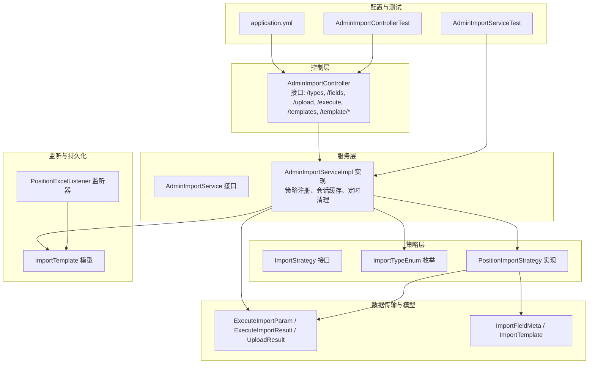
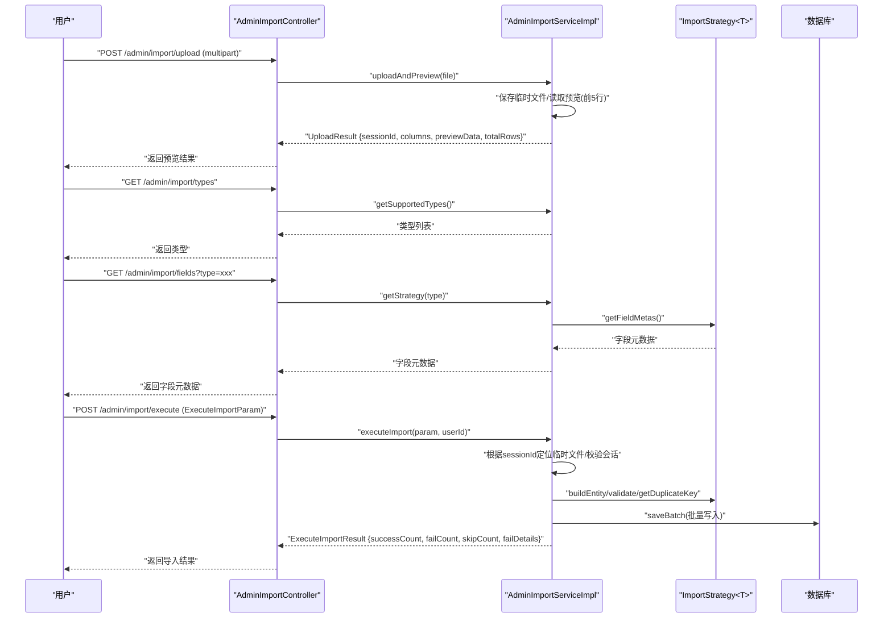
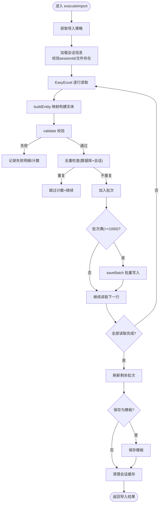
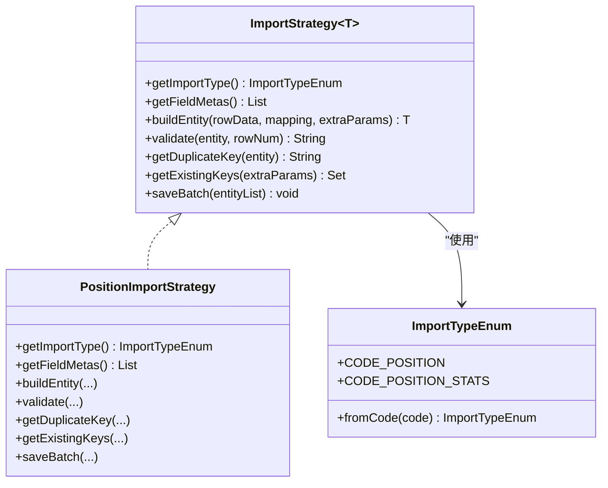
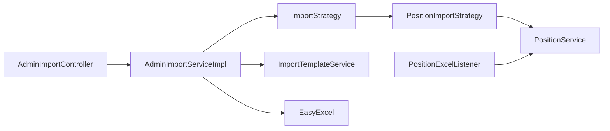

# 导入功能设计

<cite>
**本文引用的文件**   
- [AdminImportController.java](file://src/main/java/com/macro/mall/tiny/modules/ums/controller/AdminImportController.java)
- [AdminImportService.java](file://src/main/java/com/macro/mall/tiny/modules/ums/service/AdminImportService.java)
- [AdminImportServiceImpl.java](file://src/main/java/com/macro/mall/tiny/modules/ums/service/impl/AdminImportServiceImpl.java)
- [ImportStrategy.java](file://src/main/java/com/macro/mall/tiny/modules/ums/strategy/ImportStrategy.java)
- [ImportTypeEnum.java](file://src/main/java/com/macro/mall/tiny/modules/ums/strategy/ImportTypeEnum.java)
- [PositionImportStrategy.java](file://src/main/java/com/macro/mall/tiny/modules/ums/strategy/PositionImportStrategy.java)
- [ExecuteImportParam.java](file://src/main/java/com/macro/mall/tiny/modules/ums/dto/ExecuteImportParam.java)
- [ExecuteImportResult.java](file://src/main/java/com/macro/mall/tiny/modules/ums/dto/ExecuteImportResult.java)
- [UploadResult.java](file://src/main/java/com/macro/mall/tiny/modules/ums/dto/UploadResult.java)
- [ImportFieldMeta.java](file://src/main/java/com/macro/mall/tiny/modules/ums/dto/ImportFieldMeta.java)
- [ImportTemplate.java](file://src/main/java/com/macro/mall/tiny/modules/ums/model/ImportTemplate.java)
- [PositionExcelListener.java](file://src/main/java/com/macro/mall/tiny/modules/ums/listener/PositionExcelListener.java)
- [AdminImportControllerTest.java](file://src/test/java/com/macro/mall/tiny/modules/ums/controller/AdminImportControllerTest.java)
- [AdminImportServiceTest.java](file://src/test/java/com/macro/mall/tiny/modules/ums/service/AdminImportServiceTest.java)
- [application.yml](file://src/main/resources/application.yml)
- [import_template.sql](file://sql/import_template.sql)
</cite>

## 目录
1. [简介](#简介)
2. [项目结构](#项目结构)
3. [核心组件](#核心组件)
4. [架构总览](#架构总览)
5. [详细组件分析](#详细组件分析)
6. [依赖分析](#依赖分析)
7. [性能考虑](#性能考虑)
8. [故障排查指南](#故障排查指南)
9. [结论](#结论)
10. [附录](#附录)

## 简介
本文件系统化阐述“导入功能”的整体设计与实现，覆盖文件上传处理、格式验证、数据预览、批量导入执行等核心流程；详解 AdminImportController 的接口设计与使用场景；剖析导入服务层的实现逻辑（文件校验、数据解析、错误处理、事务管理）；给出从文件上传到数据入库的完整流程示例；并提供错误处理策略与扩展指导。

## 项目结构
导入功能主要分布在 ums 模块，涉及控制器、服务层、策略模式、DTO、模型与监听器等层次，配合模板持久化与定时清理机制，形成可扩展的导入体系。

图表来源
- [AdminImportController.java:1-148](file://src/main/java/com/macro/mall/tiny/modules/ums/controller/AdminImportController.java#L1-L148)
- [AdminImportServiceImpl.java:1-332](file://src/main/java/com/macro/mall/tiny/modules/ums/service/impl/AdminImportServiceImpl.java#L1-L332)
- [ImportStrategy.java:1-69](file://src/main/java/com/macro/mall/tiny/modules/ums/strategy/ImportStrategy.java#L1-L69)
- [ImportTypeEnum.java:1-41](file://src/main/java/com/macro/mall/tiny/modules/ums/strategy/ImportTypeEnum.java#L1-L41)
- [PositionImportStrategy.java:1-231](file://src/main/java/com/macro/mall/tiny/modules/ums/strategy/PositionImportStrategy.java#L1-L231)
- [ExecuteImportParam.java:1-49](file://src/main/java/com/macro/mall/tiny/modules/ums/dto/ExecuteImportParam.java#L1-L49)
- [ExecuteImportResult.java:1-69](file://src/main/java/com/macro/mall/tiny/modules/ums/dto/ExecuteImportResult.java#L1-L69)
- [UploadResult.java:1-34](file://src/main/java/com/macro/mall/tiny/modules/ums/dto/UploadResult.java#L1-L34)
- [ImportFieldMeta.java:1-35](file://src/main/java/com/macro/mall/tiny/modules/ums/dto/ImportFieldMeta.java#L1-L35)
- [ImportTemplate.java:1-59](file://src/main/java/com/macro/mall/tiny/modules/ums/model/ImportTemplate.java#L1-L59)
- [PositionExcelListener.java:1-240](file://src/main/java/com/macro/mall/tiny/modules/ums/listener/PositionExcelListener.java#L1-L240)
- [application.yml:1-57](file://src/main/resources/application.yml#L1-L57)
- [AdminImportControllerTest.java:1-155](file://src/test/java/com/macro/mall/tiny/modules/ums/controller/AdminImportControllerTest.java#L1-L155)
- [AdminImportServiceTest.java:1-329](file://src/test/java/com/macro/mall/tiny/modules/ums/service/AdminImportServiceTest.java#L1-L329)

章节来源
- [AdminImportController.java:1-148](file://src/main/java/com/macro/mall/tiny/modules/ums/controller/AdminImportController.java#L1-L148)
- [AdminImportServiceImpl.java:1-332](file://src/main/java/com/macro/mall/tiny/modules/ums/service/impl/AdminImportServiceImpl.java#L1-L332)

## 核心组件
- 控制器 AdminImportController：提供导入类型查询、字段元数据、Excel上传预览、执行导入、模板管理等接口，并进行权限控制。
- 服务层 AdminImportService/Impl：负责会话管理、文件预览、批量导入、策略分发、模板保存、定时清理过期文件。
- 策略层 ImportStrategy/ImportTypeEnum/PositionImportStrategy：以策略模式支持多导入类型，定义字段元数据、实体构建、校验、去重、批量保存等。
- DTO 与模型：ExecuteImportParam/Result、UploadResult、ImportFieldMeta、ImportTemplate。
- 监听器 PositionExcelListener：基于 EasyExcel 的监听式读取与导入（历史实现，仍具参考价值）。
- 配置与测试：application.yml 中开放导入接口白名单；单元/集成测试覆盖上传、执行、解析等关键路径。

章节来源
- [AdminImportController.java:43-93](file://src/main/java/com/macro/mall/tiny/modules/ums/controller/AdminImportController.java#L43-L93)
- [AdminImportService.java:12-33](file://src/main/java/com/macro/mall/tiny/modules/ums/service/AdminImportService.java#L12-L33)
- [AdminImportServiceImpl.java:37-332](file://src/main/java/com/macro/mall/tiny/modules/ums/service/impl/AdminImportServiceImpl.java#L37-L332)
- [ImportStrategy.java:15-68](file://src/main/java/com/macro/mall/tiny/modules/ums/strategy/ImportStrategy.java#L15-L68)
- [ImportTypeEnum.java:9-40](file://src/main/java/com/macro/mall/tiny/modules/ums/strategy/ImportTypeEnum.java#L9-L40)
- [PositionImportStrategy.java:15-231](file://src/main/java/com/macro/mall/tiny/modules/ums/strategy/PositionImportStrategy.java#L15-L231)
- [ExecuteImportParam.java:12-48](file://src/main/java/com/macro/mall/tiny/modules/ums/dto/ExecuteImportParam.java#L12-L48)
- [ExecuteImportResult.java:12-68](file://src/main/java/com/macro/mall/tiny/modules/ums/dto/ExecuteImportResult.java#L12-L68)
- [UploadResult.java:11-33](file://src/main/java/com/macro/mall/tiny/modules/ums/dto/UploadResult.java#L11-L33)
- [ImportFieldMeta.java:10-34](file://src/main/java/com/macro/mall/tiny/modules/ums/dto/ImportFieldMeta.java#L10-L34)
- [ImportTemplate.java:15-58](file://src/main/java/com/macro/mall/tiny/modules/ums/model/ImportTemplate.java#L15-L58)
- [PositionExcelListener.java:20-240](file://src/main/java/com/macro/mall/tiny/modules/ums/listener/PositionExcelListener.java#L20-L240)
- [application.yml:56-56](file://src/main/resources/application.yml#L56-L56)
- [AdminImportControllerTest.java:57-153](file://src/test/java/com/macro/mall/tiny/modules/ums/controller/AdminImportControllerTest.java#L57-L153)
- [AdminImportServiceTest.java:35-314](file://src/test/java/com/macro/mall/tiny/modules/ums/service/AdminImportServiceTest.java#L35-L314)

## 架构总览
导入功能采用“控制器-服务-策略-DTO/模型”的分层架构，结合 EasyExcel 进行流式读取与监听式处理，通过策略模式扩展不同导入类型，支持列映射、字段校验、去重、批量写入与模板持久化。

图表来源
- [AdminImportController.java:43-93](file://src/main/java/com/macro/mall/tiny/modules/ums/controller/AdminImportController.java#L43-L93)
- [AdminImportServiceImpl.java:100-257](file://src/main/java/com/macro/mall/tiny/modules/ums/service/impl/AdminImportServiceImpl.java#L100-L257)
- [ImportStrategy.java:25-67](file://src/main/java/com/macro/mall/tiny/modules/ums/strategy/ImportStrategy.java#L25-L67)
- [ExecuteImportParam.java:13-48](file://src/main/java/com/macro/mall/tiny/modules/ums/dto/ExecuteImportParam.java#L13-L48)
- [ExecuteImportResult.java:12-68](file://src/main/java/com/macro/mall/tiny/modules/ums/dto/ExecuteImportResult.java#L12-L68)

## 详细组件分析

### 控制器：AdminImportController
- 接口设计与职责
  - GET /admin/import/types：返回支持的导入类型列表（code/label），供前端选择导入类型。
  - GET /admin/import/fields：根据导入类型返回字段元数据（fieldName/label/required/description），用于列映射配置。
  - POST /admin/import/upload：接收 Excel 文件，进行格式校验后读取预览数据，返回 sessionId、列名、前5行预览与总行数。
  - POST /admin/import/execute：执行导入，接收 ExecuteImportParam（包含 sessionId、mapping、year、saveAsTemplate、templateName），返回导入统计与失败明细。
  - GET /admin/import/templates：列出模板（可按导入类型过滤），用于复用列映射。
  - DELETE /admin/import/template/{id}：删除模板。
  - POST /admin/import/template：保存模板（模板名、描述、导入类型、列映射 JSON）。
- 权限控制：使用注解对导入模板管理和执行导入进行授权控制。
- 错误处理：对空文件、错误格式、会话过期等场景返回明确错误码与消息。

章节来源
- [AdminImportController.java:43-146](file://src/main/java/com/macro/mall/tiny/modules/ums/controller/AdminImportController.java#L43-L146)
- [application.yml:56-56](file://src/main/resources/application.yml#L56-L56)

### 服务层：AdminImportService 与 AdminImportServiceImpl
- 会话管理与临时文件
  - 上传后生成 sessionId，保存临时文件于配置路径，缓存会话信息（文件路径、列名、创建时间）。
  - 定时任务每小时清理过期会话（默认过期时间1小时）。
- 策略分发
  - 初始化时扫描所有 ImportStrategy 实现，建立 ImportTypeEnum → 策略 的映射。
  - 执行导入时根据导入类型获取对应策略。
- 批量导入流程
  - 读取 Excel，逐行构建实体、校验、去重（数据库既有键 + 会话内已见键），累积到批次，达到阈值（1000）批量写入。
  - 可选保存为模板（若勾选保存且模板名非空）。
  - 清理会话缓存。
- 异常与事务
  - 会话过期/文件失效抛出业务异常；导入过程在事务中执行，保证一致性。

图表来源
- [AdminImportServiceImpl.java:159-257](file://src/main/java/com/macro/mall/tiny/modules/ums/service/impl/AdminImportServiceImpl.java#L159-L257)
- [ImportStrategy.java:35-67](file://src/main/java/com/macro/mall/tiny/modules/ums/strategy/ImportStrategy.java#L35-L67)

章节来源
- [AdminImportService.java:12-33](file://src/main/java/com/macro/mall/tiny/modules/ums/service/AdminImportService.java#L12-L33)
- [AdminImportServiceImpl.java:37-332](file://src/main/java/com/macro/mall/tiny/modules/ums/service/impl/AdminImportServiceImpl.java#L37-L332)

### 策略层：ImportStrategy、ImportTypeEnum、PositionImportStrategy
- ImportStrategy<T>：定义字段元数据、实体构建、校验、去重键、已有键集合、批量保存等接口，便于扩展新导入类型。
- ImportTypeEnum：定义导入类型枚举（如 position、position_stats），提供 code/label 与反序列化。
- PositionImportStrategy：实现岗位信息导入策略，包含字段元数据、实体构建、校验规则（部门/职位/年份/学历/政治面貌/招录人数）、去重键（年份+部门+职位名）、批量保存与模板保存。

图表来源
- [ImportStrategy.java:15-68](file://src/main/java/com/macro/mall/tiny/modules/ums/strategy/ImportStrategy.java#L15-L68)
- [ImportTypeEnum.java:9-40](file://src/main/java/com/macro/mall/tiny/modules/ums/strategy/ImportTypeEnum.java#L9-L40)
- [PositionImportStrategy.java:15-231](file://src/main/java/com/macro/mall/tiny/modules/ums/strategy/PositionImportStrategy.java#L15-L231)

章节来源
- [ImportStrategy.java:15-68](file://src/main/java/com/macro/mall/tiny/modules/ums/strategy/ImportStrategy.java#L15-L68)
- [ImportTypeEnum.java:9-40](file://src/main/java/com/macro/mall/tiny/modules/ums/strategy/ImportTypeEnum.java#L9-L40)
- [PositionImportStrategy.java:65-186](file://src/main/java/com/macro/mall/tiny/modules/ums/strategy/PositionImportStrategy.java#L65-L186)

### DTO 与模型
- ExecuteImportParam：导入参数（导入类型、会话ID、列映射、年份、模板名、是否保存模板）。
- ExecuteImportResult：导入结果（成功/失败/跳过计数，以及失败明细列表）。
- UploadResult：上传预览结果（sessionId、列名、预览数据、总行数）。
- ImportFieldMeta：字段元数据（fieldName、label、required、description）。
- ImportTemplate：导入模板模型（模板名、描述、导入类型、列映射 JSON、创建者与时间戳）。

章节来源
- [ExecuteImportParam.java:12-48](file://src/main/java/com/macro/mall/tiny/modules/ums/dto/ExecuteImportParam.java#L12-L48)
- [ExecuteImportResult.java:12-68](file://src/main/java/com/macro/mall/tiny/modules/ums/dto/ExecuteImportResult.java#L12-L68)
- [UploadResult.java:11-33](file://src/main/java/com/macro/mall/tiny/modules/ums/dto/UploadResult.java#L11-L33)
- [ImportFieldMeta.java:10-34](file://src/main/java/com/macro/mall/tiny/modules/ums/dto/ImportFieldMeta.java#L10-L34)
- [ImportTemplate.java:15-58](file://src/main/java/com/macro/mall/tiny/modules/ums/model/ImportTemplate.java#L15-L58)

### 历史实现参考：PositionExcelListener
- 基于 EasyExcel 的监听器，逐行读取、校验、去重（数据库+会话内），达到阈值批量写入，最终保存剩余数据。
- 作为历史实现，展示了监听式读取与批量写入的思路，可作为理解导入流程的补充。

章节来源
- [PositionExcelListener.java:20-240](file://src/main/java/com/macro/mall/tiny/modules/ums/listener/PositionExcelListener.java#L20-L240)

## 依赖分析
- 控制器依赖服务层与模板服务；服务层依赖策略接口与模板服务；策略实现依赖服务层（如 PositionService）以获取已有键集合；监听器依赖服务层与导入结果聚合。
- 会话缓存与定时清理避免磁盘与内存泄漏；列映射与字段元数据驱动前端交互与后端解析。

图表来源
- [AdminImportController.java:37-41](file://src/main/java/com/macro/mall/tiny/modules/ums/controller/AdminImportController.java#L37-L41)
- [AdminImportServiceImpl.java:46-49](file://src/main/java/com/macro/mall/tiny/modules/ums/service/impl/AdminImportServiceImpl.java#L46-L49)
- [PositionImportStrategy.java:18-19](file://src/main/java/com/macro/mall/tiny/modules/ums/strategy/PositionImportStrategy.java#L18-L19)
- [PositionExcelListener.java:34-40](file://src/main/java/com/macro/mall/tiny/modules/ums/listener/PositionExcelListener.java#L34-L40)

章节来源
- [AdminImportController.java:37-41](file://src/main/java/com/macro/mall/tiny/modules/ums/controller/AdminImportController.java#L37-L41)
- [AdminImportServiceImpl.java:46-49](file://src/main/java/com/macro/mall/tiny/modules/ums/service/impl/AdminImportServiceImpl.java#L46-L49)
- [PositionImportStrategy.java:18-19](file://src/main/java/com/macro/mall/tiny/modules/ums/strategy/PositionImportStrategy.java#L18-L19)
- [PositionExcelListener.java:34-40](file://src/main/java/com/macro/mall/tiny/modules/ums/listener/PositionExcelListener.java#L34-L40)

## 性能考虑
- 流式读取与监听式处理：使用 EasyExcel 逐行读取，避免一次性加载整表导致内存溢出。
- 批量写入：默认阈值 1000 条，减少数据库往返次数，提升吞吐。
- 去重策略：先查数据库已有键，再维护会话内键集合，兼顾跨页与同页去重。
- 会话缓存与定时清理：控制临时文件数量与占用空间，避免资源泄露。
- 建议
  - 对超大文件可考虑分片/并发读取（需评估线程池与锁竞争）。
  - 模板保存与列映射解析可异步化，降低导入主流程阻塞。
  - 导入前可预估总行数并提示进度，改善用户体验。

## 故障排查指南
- 文件格式错误
  - 现象：上传非 Excel 或空文件。
  - 处理：控制器已做格式校验并返回明确错误；检查文件扩展名与大小。
- 会话过期/文件失效
  - 现象：执行导入时报错，提示会话过期或文件无效。
  - 处理：重新上传并获取新的 sessionId；确认定时清理任务未提前清理。
- 数据格式错误
  - 现象：字段校验失败（如部门/职位为空、年份不在范围、学历/政治面貌不在允许集合、招录人数小于等于0）。
  - 处理：根据失败明细定位行号与原因，修正 Excel 内容后重试。
- 业务规则验证失败
  - 现象：重复数据被跳过或校验失败。
  - 处理：检查去重键组合（年份+部门+职位名）与现有数据；调整 mapping 或模板。
- 权限不足
  - 现象：接口返回未授权。
  - 处理：确认用户具备导入模板管理与 Excel 导入执行权限。

章节来源
- [AdminImportController.java:65-79](file://src/main/java/com/macro/mall/tiny/modules/ums/controller/AdminImportController.java#L65-L79)
- [AdminImportServiceImpl.java:177-185](file://src/main/java/com/macro/mall/tiny/modules/ums/service/impl/AdminImportServiceImpl.java#L177-L185)
- [PositionImportStrategy.java:140-165](file://src/main/java/com/macro/mall/tiny/modules/ums/strategy/PositionImportStrategy.java#L140-L165)
- [AdminImportControllerTest.java:82-106](file://src/test/java/com/macro/mall/tiny/modules/ums/controller/AdminImportControllerTest.java#L82-L106)
- [AdminImportServiceTest.java:305-314](file://src/test/java/com/macro/mall/tiny/modules/ums/service/AdminImportServiceTest.java#L305-L314)

## 结论
导入功能通过“控制器-服务-策略”三层架构与 EasyExcel 流式处理，实现了灵活、可扩展、高性能的 Excel 导入能力。策略模式使新增导入类型成本低；列映射与字段元数据提升了前端交互体验；模板持久化与定时清理保障了可用性与稳定性。建议在生产环境中结合监控与告警，持续优化批处理阈值与去重策略。

## 附录

### API 接口清单与说明
- GET /admin/import/types
  - 功能：获取支持的导入类型列表。
  - 权限：导入模板管理。
  - 返回：类型数组（code/label）。
- GET /admin/import/fields
  - 功能：获取指定导入类型的字段元数据。
  - 参数：type（导入类型编码）。
  - 返回：字段元数据列表（fieldName/label/required/description）。
- POST /admin/import/upload
  - 功能：上传 Excel 并预览。
  - 请求：multipart/form-data，字段 file。
  - 返回：UploadResult（sessionId/columns/previewData/totalRows）。
- POST /admin/import/execute
  - 功能：执行导入。
  - 请求体：ExecuteImportParam（importType/sessionId/mapping/year/saveAsTemplate/templateName）。
  - 返回：ExecuteImportResult（successCount/failCount/skipCount/failDetails）。
- GET /admin/import/templates
  - 功能：列出导入模板（可按导入类型过滤）。
  - 参数：importType（可选）。
  - 返回：模板列表（TemplateDto）。
- DELETE /admin/import/template/{id}
  - 功能：删除模板。
  - 返回：操作结果。
- POST /admin/import/template
  - 功能：保存模板。
  - 请求体：SaveTemplateParam（模板名、描述、导入类型、列映射 JSON）。
  - 返回：操作结果。

章节来源
- [AdminImportController.java:43-146](file://src/main/java/com/macro/mall/tiny/modules/ums/controller/AdminImportController.java#L43-L146)
- [ExecuteImportParam.java:13-48](file://src/main/java/com/macro/mall/tiny/modules/ums/dto/ExecuteImportParam.java#L13-L48)
- [ExecuteImportResult.java:12-68](file://src/main/java/com/macro/mall/tiny/modules/ums/dto/ExecuteImportResult.java#L12-L68)
- [UploadResult.java:11-33](file://src/main/java/com/macro/mall/tiny/modules/ums/dto/UploadResult.java#L11-L33)

### 完整导入流程示例（从上传到入库）
- 步骤 1：调用 GET /admin/import/types 获取导入类型。
- 步骤 2：调用 GET /admin/import/fields?type=position 获取字段元数据，指导前端列映射。
- 步骤 3：调用 POST /admin/import/upload 上传 Excel，得到 sessionId 与预览数据。
- 步骤 4：准备 ExecuteImportParam（设置 importType、sessionId、mapping、year、saveAsTemplate、templateName）。
- 步骤 5：调用 POST /admin/import/execute 执行导入，查看导入结果。
- 步骤 6：（可选）调用 GET /admin/import/templates 查看模板，或调用 POST /admin/import/template 保存模板。

章节来源
- [AdminImportController.java:43-93](file://src/main/java/com/macro/mall/tiny/modules/ums/controller/AdminImportController.java#L43-L93)
- [AdminImportServiceImpl.java:100-257](file://src/main/java/com/macro/mall/tiny/modules/ums/service/impl/AdminImportServiceImpl.java#L100-L257)

### 扩展指导与最佳实践
- 新增导入类型
  - 实现 ImportStrategy<T>，定义字段元数据、实体构建、校验、去重键与批量保存。
  - 在 Spring 上下文中注册为 Bean，服务层自动发现并注册到策略映射。
- 列映射与字段校验
  - 前端根据 ImportFieldMeta 提示必填与说明；后端严格校验并输出失败明细。
- 去重策略
  - 合理设计去重键，兼顾业务唯一性与性能；利用数据库已有键集合与会话内集合双重去重。
- 模板管理
  - 将常用 mapping 保存为模板，提升复用率；模板以 JSON 形式存储，便于迁移与备份。
- 错误处理
  - 细化失败原因与行号，便于用户快速修复；对会话过期、文件失效等场景提供明确提示。
- 性能优化
  - 调整批量阈值以适配目标环境；对超大文件考虑分片或并发读取；异步化模板保存等非关键路径。

章节来源
- [ImportStrategy.java:15-68](file://src/main/java/com/macro/mall/tiny/modules/ums/strategy/ImportStrategy.java#L15-L68)
- [PositionImportStrategy.java:65-186](file://src/main/java/com/macro/mall/tiny/modules/ums/strategy/PositionImportStrategy.java#L65-L186)
- [AdminImportServiceImpl.java:294-311](file://src/main/java/com/macro/mall/tiny/modules/ums/service/impl/AdminImportServiceImpl.java#L294-L311)