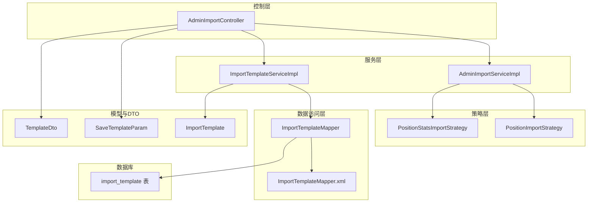
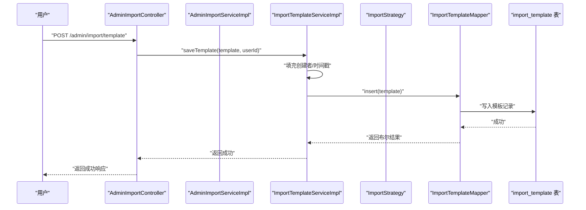
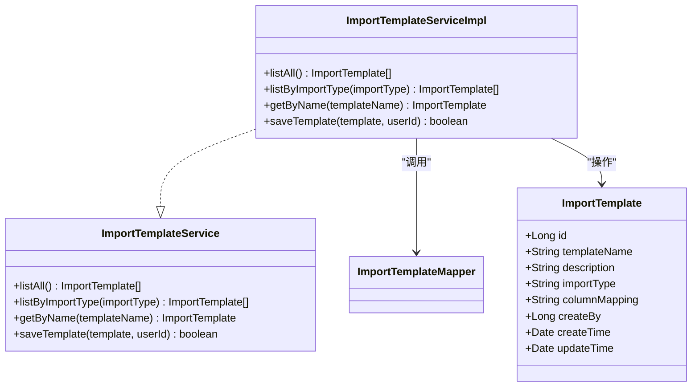
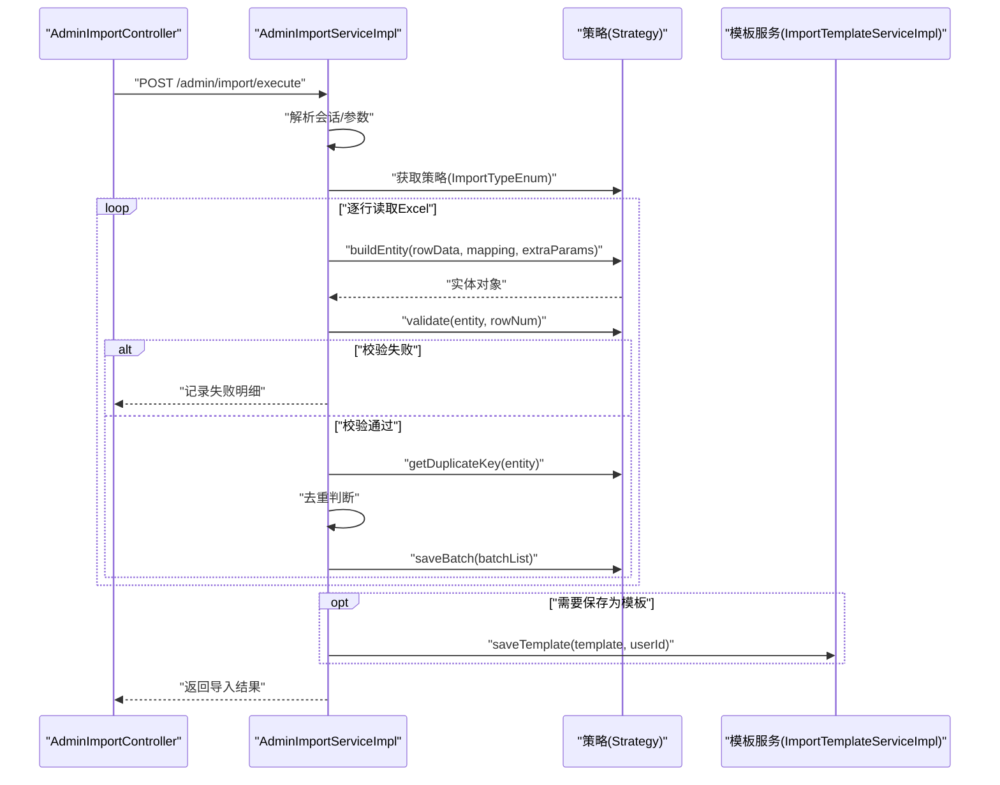
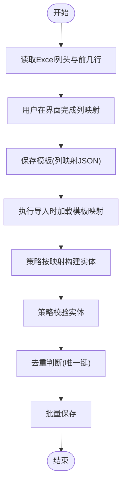
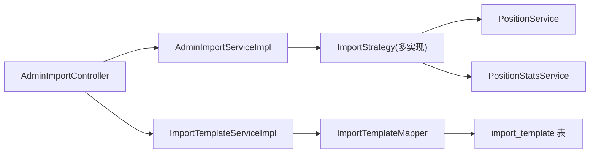

# 导入模板管理

<cite>
**本文引用的文件**
- [ImportTemplate.java](file://src/main/java/com/macro/mall/tiny/modules/ums/model/ImportTemplate.java)
- [SaveTemplateParam.java](file://src/main/java/com/macro/mall/tiny/modules/ums/dto/SaveTemplateParam.java)
- [TemplateDto.java](file://src/main/java/com/macro/mall/tiny/modules/ums/dto/TemplateDto.java)
- [ImportTemplateService.java](file://src/main/java/com/macro/mall/tiny/modules/ums/service/ImportTemplateService.java)
- [ImportTemplateServiceImpl.java](file://src/main/java/com/macro/mall/tiny/modules/ums/service/impl/ImportTemplateServiceImpl.java)
- [ImportTemplateMapper.java](file://src/main/java/com/macro/mall/tiny/modules/ums/mapper/ImportTemplateMapper.java)
- [ImportTemplateMapper.xml](file://src/main/resources/mapper/ums/ImportTemplateMapper.xml)
- [AdminImportController.java](file://src/main/java/com/macro/mall/tiny/modules/ums/controller/AdminImportController.java)
- [AdminImportService.java](file://src/main/java/com/macro/mall/tiny/modules/ums/service/AdminImportService.java)
- [AdminImportServiceImpl.java](file://src/main/java/com/macro/mall/tiny/modules/ums/service/impl/AdminImportServiceImpl.java)
- [ImportStrategy.java](file://src/main/java/com/macro/mall/tiny/modules/ums/strategy/ImportStrategy.java)
- [ImportTypeEnum.java](file://src/main/java/com/macro/mall/tiny/modules/ums/strategy/ImportTypeEnum.java)
- [PositionImportStrategy.java](file://src/main/java/com/macro/mall/tiny/modules/ums/strategy/PositionImportStrategy.java)
- [PositionStatsImportStrategy.java](file://src/main/java/com/macro/mall/tiny/modules/ums/strategy/PositionStatsImportStrategy.java)
- [import_template.sql](file://sql/import_template.sql)
</cite>

## 目录
1. [简介](#简介)
2. [项目结构](#项目结构)
3. [核心组件](#核心组件)
4. [架构总览](#架构总览)
5. [详细组件分析](#详细组件分析)
6. [依赖分析](#依赖分析)
7. [性能考虑](#性能考虑)
8. [故障排查指南](#故障排查指南)
9. [结论](#结论)
10. [附录](#附录)

## 简介
本文件系统性阐述“导入模板管理”功能的设计与实现，覆盖模板保存、模板列表查询、模板删除等核心能力；深入解析 ImportTemplate 实体模型、SaveTemplateParam 与 TemplateDto 数据传输对象；详解列映射机制、模板生命周期管理（创建/修改/删除/版本控制）、权限控制设计，并提供从模板保存到模板使用的完整流程示例与扩展指导。

## 项目结构
围绕导入模板管理的关键模块组织如下：
- 控制层：AdminImportController 提供导入类型、字段元数据、上传预览、执行导入、模板列表、删除模板、保存模板等接口
- 服务层：AdminImportService/Impl 负责上传预览、执行导入、策略调度、会话缓存、定时清理；ImportTemplateService/Impl 负责模板 CRUD
- 策略层：ImportStrategy 及其实现（PositionImportStrategy、PositionStatsImportStrategy）定义不同导入类型的字段元数据、实体构建、校验、去重与批量保存
- 数据访问层：ImportTemplateMapper/Xml 对接 MyBatis Plus
- 模型与DTO：ImportTemplate、SaveTemplateParam、TemplateDto
- 数据库：import_template 表

图表来源
- [AdminImportController.java:31-148](file://src/main/java/com/macro/mall/tiny/modules/ums/controller/AdminImportController.java#L31-L148)
- [AdminImportServiceImpl.java:37-332](file://src/main/java/com/macro/mall/tiny/modules/ums/service/impl/AdminImportServiceImpl.java#L37-L332)
- [ImportTemplateServiceImpl.java:17-47](file://src/main/java/com/macro/mall/tiny/modules/ums/service/impl/ImportTemplateServiceImpl.java#L17-L47)
- [ImportTemplateMapper.java:11-13](file://src/main/java/com/macro/mall/tiny/modules/ums/mapper/ImportTemplateMapper.java#L11-L13)
- [ImportTemplateMapper.xml:3-5](file://src/main/resources/mapper/ums/ImportTemplateMapper.xml#L3-L5)
- [ImportTemplate.java:17-58](file://src/main/java/com/macro/mall/tiny/modules/ums/model/ImportTemplate.java#L17-L58)
- [SaveTemplateParam.java:10-31](file://src/main/java/com/macro/mall/tiny/modules/ums/dto/SaveTemplateParam.java#L10-L31)
- [TemplateDto.java:10-33](file://src/main/java/com/macro/mall/tiny/modules/ums/dto/TemplateDto.java#L10-L33)
- [import_template.sql:2-11](file://sql/import_template.sql#L2-L11)

章节来源
- [AdminImportController.java:31-148](file://src/main/java/com/macro/mall/tiny/modules/ums/controller/AdminImportController.java#L31-L148)
- [AdminImportServiceImpl.java:37-332](file://src/main/java/com/macro/mall/tiny/modules/ums/service/impl/AdminImportServiceImpl.java#L37-L332)
- [ImportTemplateServiceImpl.java:17-47](file://src/main/java/com/macro/mall/tiny/modules/ums/service/impl/ImportTemplateServiceImpl.java#L17-L47)
- [ImportTemplateMapper.java:11-13](file://src/main/java/com/macro/mall/tiny/modules/ums/mapper/ImportTemplateMapper.java#L11-L13)
- [ImportTemplateMapper.xml:3-5](file://src/main/resources/mapper/ums/ImportTemplateMapper.xml#L3-L5)
- [ImportTemplate.java:17-58](file://src/main/java/com/macro/mall/tiny/modules/ums/model/ImportTemplate.java#L17-L58)
- [SaveTemplateParam.java:10-31](file://src/main/java/com/macro/mall/tiny/modules/ums/dto/SaveTemplateParam.java#L10-L31)
- [TemplateDto.java:10-33](file://src/main/java/com/macro/mall/tiny/modules/ums/dto/TemplateDto.java#L10-L33)
- [import_template.sql:2-11](file://sql/import_template.sql#L2-L11)

## 核心组件
- ImportTemplate 实体模型：承载模板基本信息、导入类型、列映射 JSON、创建者与时间戳
- SaveTemplateParam：保存模板时的请求参数载体
- TemplateDto：模板列表返回的轻量 DTO
- ImportTemplateService/Impl：模板的查询与保存逻辑
- AdminImportController：模板管理相关接口入口
- AdminImportService/Impl：导入流程编排、策略选择、会话缓存、定时清理
- 策略接口与实现：ImportStrategy、ImportTypeEnum、PositionImportStrategy、PositionStatsImportStrategy

章节来源
- [ImportTemplate.java:17-58](file://src/main/java/com/macro/mall/tiny/modules/ums/model/ImportTemplate.java#L17-L58)
- [SaveTemplateParam.java:10-31](file://src/main/java/com/macro/mall/tiny/modules/ums/dto/SaveTemplateParam.java#L10-L31)
- [TemplateDto.java:10-33](file://src/main/java/com/macro/mall/tiny/modules/ums/dto/TemplateDto.java#L10-L33)
- [ImportTemplateService.java:12-33](file://src/main/java/com/macro/mall/tiny/modules/ums/service/ImportTemplateService.java#L12-L33)
- [ImportTemplateServiceImpl.java:18-45](file://src/main/java/com/macro/mall/tiny/modules/ums/service/impl/ImportTemplateServiceImpl.java#L18-L45)
- [AdminImportController.java:95-146](file://src/main/java/com/macro/mall/tiny/modules/ums/controller/AdminImportController.java#L95-L146)
- [AdminImportService.java:12-33](file://src/main/java/com/macro/mall/tiny/modules/ums/service/AdminImportService.java#L12-L33)
- [AdminImportServiceImpl.java:37-332](file://src/main/java/com/macro/mall/tiny/modules/ums/service/impl/AdminImportServiceImpl.java#L37-L332)
- [ImportStrategy.java:15-68](file://src/main/java/com/macro/mall/tiny/modules/ums/strategy/ImportStrategy.java#L15-L68)
- [ImportTypeEnum.java:9-40](file://src/main/java/com/macro/mall/tiny/modules/ums/strategy/ImportTypeEnum.java#L9-L40)
- [PositionImportStrategy.java:16-231](file://src/main/java/com/macro/mall/tiny/modules/ums/strategy/PositionImportStrategy.java#L16-L231)
- [PositionStatsImportStrategy.java:18-152](file://src/main/java/com/macro/mall/tiny/modules/ums/strategy/PositionStatsImportStrategy.java#L18-L152)

## 架构总览
导入模板管理采用“控制器-服务-策略-数据访问”的分层架构，结合策略模式对不同导入类型进行解耦，模板管理与导入执行分离，通过会话缓存与定时任务保障临时文件生命周期。

图表来源
- [AdminImportController.java:127-146](file://src/main/java/com/macro/mall/tiny/modules/ums/controller/AdminImportController.java#L127-L146)
- [ImportTemplateServiceImpl.java:40-45](file://src/main/java/com/macro/mall/tiny/modules/ums/service/impl/ImportTemplateServiceImpl.java#L40-L45)
- [ImportTemplateMapper.java:11-13](file://src/main/java/com/macro/mall/tiny/modules/ums/mapper/ImportTemplateMapper.java#L11-L13)
- [ImportTemplateMapper.xml:3-5](file://src/main/resources/mapper/ums/ImportTemplateMapper.xml#L3-L5)
- [import_template.sql:2-11](file://sql/import_template.sql#L2-L11)

## 详细组件分析

### ImportTemplate 实体模型
- 字段说明
  - id：主键自增
  - templateName：模板名称
  - description：模板描述
  - importType：导入类型（如 position、position_stats），与 ImportTypeEnum 对应
  - columnMapping：列映射 JSON，格式为 {"字段名":Excel列索引,...}
  - createBy：创建者 ID
  - createTime/updateTime：创建与更新时间
- 设计要点
  - 以 JSON 存储列映射，便于灵活扩展字段映射关系
  - 通过 importType 与策略层解耦，支持多类型导入
  - createBy 记录创建者，便于后续权限控制与审计

章节来源
- [ImportTemplate.java:17-58](file://src/main/java/com/macro/mall/tiny/modules/ums/model/ImportTemplate.java#L17-L58)
- [import_template.sql:2-11](file://sql/import_template.sql#L2-L11)

### SaveTemplateParam 与 TemplateDto
- SaveTemplateParam
  - 作用：接收前端保存模板的请求参数，包含模板名称、描述、列映射 JSON、导入类型
  - 参数验证：控制器在保存模板前未做参数校验，建议在服务层补充校验（如名称非空、映射 JSON 合法、类型合法）
- TemplateDto
  - 作用：模板列表返回的轻量 DTO，包含 id、名称、描述、列映射 JSON、导入类型
  - 转换：控制器使用 BeanUtils 将 ImportTemplate 转换为 TemplateDto

章节来源
- [SaveTemplateParam.java:10-31](file://src/main/java/com/macro/mall/tiny/modules/ums/dto/SaveTemplateParam.java#L10-L31)
- [TemplateDto.java:10-33](file://src/main/java/com/macro/mall/tiny/modules/ums/dto/TemplateDto.java#L10-L33)
- [AdminImportController.java:99-113](file://src/main/java/com/macro/mall/tiny/modules/ums/controller/AdminImportController.java#L99-L113)

### ImportTemplateService/Impl：模板 CRUD
- listAll：按创建时间倒序列出全部模板
- listByImportType：按导入类型过滤并倒序排列
- getByName：按模板名称查询唯一模板
- saveTemplate：设置创建者、创建/更新时间后持久化

图表来源
- [ImportTemplate.java:17-58](file://src/main/java/com/macro/mall/tiny/modules/ums/model/ImportTemplate.java#L17-L58)
- [ImportTemplateService.java:12-33](file://src/main/java/com/macro/mall/tiny/modules/ums/service/ImportTemplateService.java#L12-L33)
- [ImportTemplateServiceImpl.java:18-45](file://src/main/java/com/macro/mall/tiny/modules/ums/service/impl/ImportTemplateServiceImpl.java#L18-L45)
- [ImportTemplateMapper.java:11-13](file://src/main/java/com/macro/mall/tiny/modules/ums/mapper/ImportTemplateMapper.java#L11-L13)

章节来源
- [ImportTemplateService.java:12-33](file://src/main/java/com/macro/mall/tiny/modules/ums/service/ImportTemplateService.java#L12-L33)
- [ImportTemplateServiceImpl.java:18-45](file://src/main/java/com/macro/mall/tiny/modules/ums/service/impl/ImportTemplateServiceImpl.java#L18-L45)

### AdminImportController：模板管理接口
- 获取导入类型列表：/admin/import/types
- 获取字段元数据：/admin/import/fields?type=...
- 上传并预览：/admin/import/upload（POST，multipart/form-data）
- 执行导入：/admin/import/execute（POST，ExecuteImportParam）
- 获取模板列表：/admin/import/templates（GET，可选 importType 过滤）
- 删除模板：/admin/import/template/{id}（DELETE）
- 保存模板：/admin/import/template（POST，SaveTemplateParam）

权限控制
- 模板管理相关接口需具备权限标识：导入模板管理
- 模板删除与保存需具备权限标识：ums:import:template
- 导入执行接口需具备权限标识：Excel导入执行

章节来源
- [AdminImportController.java:43-146](file://src/main/java/com/macro/mall/tiny/modules/ums/controller/AdminImportController.java#L43-L146)

### AdminImportService/Impl：导入流程与模板保存
- 上传预览：生成会话 ID，保存临时文件，读取前 5 行与列头，缓存会话信息
- 执行导入：根据导入类型获取策略，逐行读取 Excel，构建实体、校验、去重、批量保存
- 保存为模板：当请求携带保存模板标记与模板名时，将 mapping 转为 JSON 并持久化
- 定时清理：每小时清理超过 1 小时的临时文件

图表来源
- [AdminImportController.java:81-93](file://src/main/java/com/macro/mall/tiny/modules/ums/controller/AdminImportController.java#L81-L93)
- [AdminImportServiceImpl.java:159-257](file://src/main/java/com/macro/mall/tiny/modules/ums/service/impl/AdminImportServiceImpl.java#L159-L257)
- [ImportStrategy.java:15-68](file://src/main/java/com/macro/mall/tiny/modules/ums/strategy/ImportStrategy.java#L15-L68)

章节来源
- [AdminImportService.java:12-33](file://src/main/java/com/macro/mall/tiny/modules/ums/service/AdminImportService.java#L12-L33)
- [AdminImportServiceImpl.java:37-332](file://src/main/java/com/macro/mall/tiny/modules/ums/service/impl/AdminImportServiceImpl.java#L37-L332)

### 列映射机制
- 映射来源：前端上传 Excel 后，用户在界面上完成“列头 → 字段”的映射
- 映射存储：以 JSON 形式保存在 ImportTemplate.columnMapping 中，键为实体字段名，值为 Excel 列索引
- 执行时应用：导入时将 mapping 传入策略的 buildEntity，策略按映射从行数据中抽取字段值并构造实体

图表来源
- [AdminImportServiceImpl.java:100-157](file://src/main/java/com/macro/mall/tiny/modules/ums/service/impl/AdminImportServiceImpl.java#L100-L157)
- [AdminImportServiceImpl.java:174-257](file://src/main/java/com/macro/mall/tiny/modules/ums/service/impl/AdminImportServiceImpl.java#L174-L257)
- [ImportTemplate.java:40-42](file://src/main/java/com/macro/mall/tiny/modules/ums/model/ImportTemplate.java#L40-L42)

章节来源
- [AdminImportServiceImpl.java:100-157](file://src/main/java/com/macro/mall/tiny/modules/ums/service/impl/AdminImportServiceImpl.java#L100-L157)
- [AdminImportServiceImpl.java:174-257](file://src/main/java/com/macro/mall/tiny/modules/ums/service/impl/AdminImportServiceImpl.java#L174-L257)
- [ImportTemplate.java:40-42](file://src/main/java/com/macro/mall/tiny/modules/ums/model/ImportTemplate.java#L40-L42)

### 模板生命周期管理
- 创建：用户上传 Excel 并完成列映射后，点击“保存为模板”，服务端将 mapping 与导入类型持久化
- 修改：当前实现未提供模板修改接口；可在服务层增加 update 方法并在控制器开放 PUT 接口
- 删除：/admin/import/template/{id}（DELETE），基于主键删除
- 版本控制：当前未实现版本字段；建议新增 version 或 templateVersion 字段，配合 createBy 与 create_time 进行版本追踪

章节来源
- [AdminImportController.java:115-125](file://src/main/java/com/macro/mall/tiny/modules/ums/controller/AdminImportController.java#L115-L125)
- [AdminImportServiceImpl.java:283-292](file://src/main/java/com/macro/mall/tiny/modules/ums/service/impl/AdminImportServiceImpl.java#L283-L292)
- [ImportTemplateServiceImpl.java:40-45](file://src/main/java/com/macro/mall/tiny/modules/ums/service/impl/ImportTemplateServiceImpl.java#L40-L45)

### 权限控制设计
- 控制器方法通过注解声明所需权限
  - 模板管理：hasAuthority('导入模板管理')
  - 模板删除/保存：hasAuthority('ums:import:template')
  - 导入执行：hasAuthority('Excel导入执行')
- 建议
  - 在角色初始化与资源授权脚本中完善权限项
  - 结合动态权限过滤器实现细粒度控制

章节来源
- [AdminImportController.java:46-84](file://src/main/java/com/macro/mall/tiny/modules/ums/controller/AdminImportController.java#L46-L84)
- [AdminImportController.java:118-130](file://src/main/java/com/macro/mall/tiny/modules/ums/controller/AdminImportController.java#L118-L130)

### 模板管理流程示例（从保存到使用）
- 步骤
  1) 上传 Excel 文件并预览：/admin/import/upload
  2) 获取支持的导入类型：/admin/import/types
  3) 获取目标类型的字段元数据：/admin/import/fields?type=...
  4) 在前端完成列映射，提交保存模板：/admin/import/template（SaveTemplateParam）
  5) 查看模板列表：/admin/import/templates（可按 importType 过滤）
  6) 执行导入时选择模板映射并提交：/admin/import/execute（ExecuteImportParam）
  7) 如需将本次导入保存为模板，勾选“保存为模板”并提供模板名
- 关键点
  - 会话缓存确保上传文件与列头信息在导入执行阶段可用
  - 策略层负责字段校验、去重与批量保存

章节来源
- [AdminImportController.java:43-146](file://src/main/java/com/macro/mall/tiny/modules/ums/controller/AdminImportController.java#L43-L146)
- [AdminImportServiceImpl.java:159-257](file://src/main/java/com/macro/mall/tiny/modules/ums/service/impl/AdminImportServiceImpl.java#L159-L257)

## 依赖分析
- 控制器依赖服务：AdminImportController 依赖 AdminImportServiceImpl 与 ImportTemplateServiceImpl
- 服务依赖策略：AdminImportServiceImpl 通过 ApplicationContext 收集 ImportStrategy 实现，避免泛型注入问题
- 数据访问依赖：ImportTemplateServiceImpl 依赖 ImportTemplateMapper，Mapper 由 MyBatis Plus 自动实现
- 策略依赖业务服务：各策略实现依赖对应领域服务（如 PositionService、PositionStatsService）进行去重与批量保存

图表来源
- [AdminImportController.java:37-41](file://src/main/java/com/macro/mall/tiny/modules/ums/controller/AdminImportController.java#L37-L41)
- [AdminImportServiceImpl.java:63-72](file://src/main/java/com/macro/mall/tiny/modules/ums/service/impl/AdminImportServiceImpl.java#L63-L72)
- [ImportTemplateServiceImpl.java:18-18](file://src/main/java/com/macro/mall/tiny/modules/ums/service/impl/ImportTemplateServiceImpl.java#L18-L18)
- [ImportTemplateMapper.java:11-13](file://src/main/java/com/macro/mall/tiny/modules/ums/mapper/ImportTemplateMapper.java#L11-L13)
- [PositionImportStrategy.java:18-19](file://src/main/java/com/macro/mall/tiny/modules/ums/strategy/PositionImportStrategy.java#L18-L19)
- [PositionStatsImportStrategy.java:20-21](file://src/main/java/com/macro/mall/tiny/modules/ums/strategy/PositionStatsImportStrategy.java#L20-L21)

章节来源
- [AdminImportServiceImpl.java:63-72](file://src/main/java/com/macro/mall/tiny/modules/ums/service/impl/AdminImportServiceImpl.java#L63-L72)
- [ImportTemplateServiceImpl.java:18-18](file://src/main/java/com/macro/mall/tiny/modules/ums/service/impl/ImportTemplateServiceImpl.java#L18-L18)
- [ImportTemplateMapper.java:11-13](file://src/main/java/com/macro/mall/tiny/modules/ums/mapper/ImportTemplateMapper.java#L11-L13)

## 性能考虑
- 批量处理：导入时按 1000 条批量保存，减少事务开销
- 去重优化：利用策略层提供的现有唯一键集合与会话内唯一键集合，避免重复入库
- 临时文件管理：定时任务清理过期临时文件，防止磁盘膨胀
- 建议
  - 对于超大 Excel，可考虑分片读取与异步导入
  - 列映射 JSON 的解析与校验可在服务层前置处理，降低策略层负担

章节来源
- [AdminImportServiceImpl.java:232-236](file://src/main/java/com/macro/mall/tiny/modules/ums/service/impl/AdminImportServiceImpl.java#L232-L236)
- [AdminImportServiceImpl.java:297-311](file://src/main/java/com/macro/mall/tiny/modules/ums/service/impl/AdminImportServiceImpl.java#L297-L311)

## 故障排查指南
- 上传文件为空或格式不正确
  - 现象：返回“上传文件不能为空”或“文件格式不正确”
  - 处理：确认文件后缀为 .xlsx 或 .xls，文件非空
- 会话过期或文件失效
  - 现象：执行导入时报会话过期或文件无效
  - 处理：重新上传并获取新会话 ID，或检查定时清理任务是否提前清理
- 导入类型不支持
  - 现象：策略不存在或类型非法
  - 处理：确认导入类型枚举与策略注册一致
- 模板保存失败
  - 现象：保存模板返回失败
  - 处理：检查模板名称、列映射 JSON、导入类型是否合法；确认权限与用户 ID 设置

章节来源
- [AdminImportController.java:65-78](file://src/main/java/com/macro/mall/tiny/modules/ums/controller/AdminImportController.java#L65-L78)
- [AdminImportServiceImpl.java:177-185](file://src/main/java/com/macro/mall/tiny/modules/ums/service/impl/AdminImportServiceImpl.java#L177-L185)
- [AdminImportServiceImpl.java:77-83](file://src/main/java/com/macro/mall/tiny/modules/ums/service/impl/AdminImportServiceImpl.java#L77-L83)
- [AdminImportServiceImpl.java:286-292](file://src/main/java/com/macro/mall/tiny/modules/ums/service/impl/AdminImportServiceImpl.java#L286-L292)

## 结论
导入模板管理通过清晰的分层与策略模式实现了可扩展的导入体系，模板的列映射以 JSON 存储，便于灵活适配不同业务字段。当前实现提供了模板保存、列表查询与删除能力，建议后续增强模板修改、版本控制与参数校验，以进一步提升可用性与安全性。

## 附录
- 数据库表结构
  - import_template：包含 id、template_name、description、column_mapping、create_by、create_time、update_time
- 导入类型枚举
  - position：岗位信息
  - position_stats：报录比数据

章节来源
- [import_template.sql:2-11](file://sql/import_template.sql#L2-L11)
- [ImportTypeEnum.java:9-40](file://src/main/java/com/macro/mall/tiny/modules/ums/strategy/ImportTypeEnum.java#L9-L40)