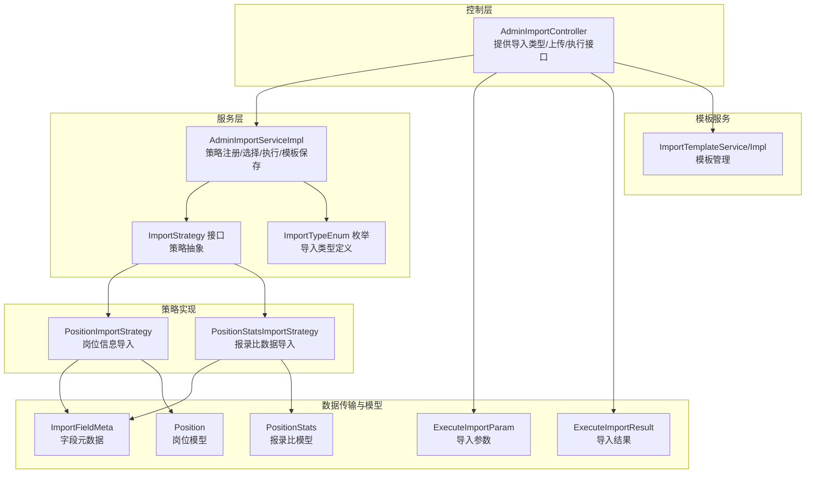
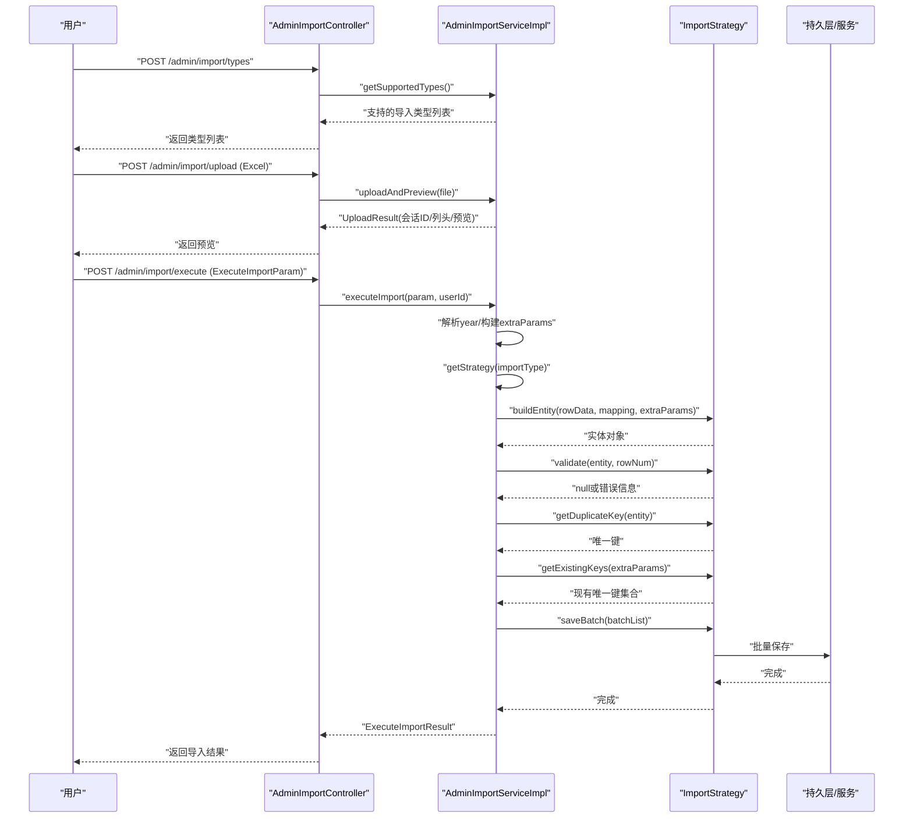
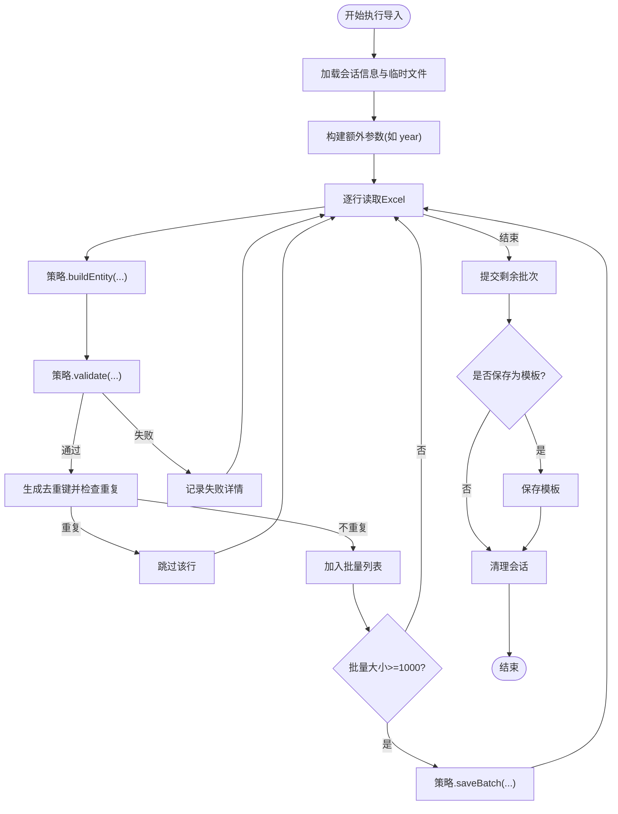
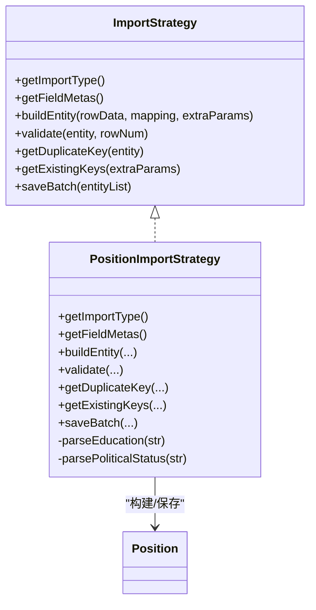
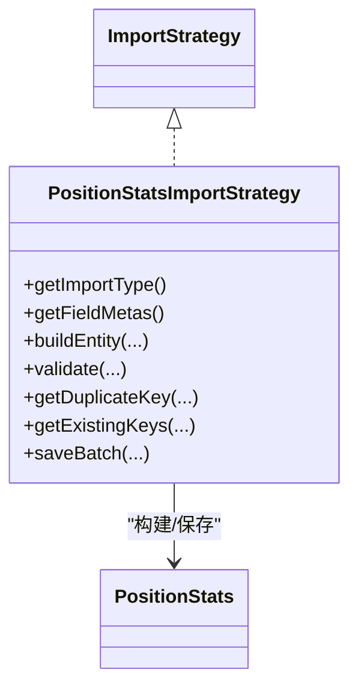
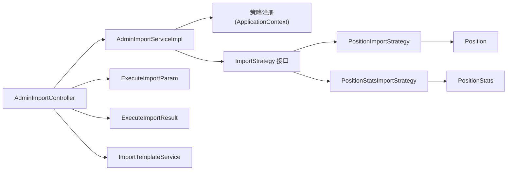

# 导入策略模式设计

<cite>
**本文引用的文件**
- [ImportStrategy.java](file://src/main/java/com/macro/mall/tiny/modules/ums/strategy/ImportStrategy.java)
- [ImportTypeEnum.java](file://src/main/java/com/macro/mall/tiny/modules/ums/strategy/ImportTypeEnum.java)
- [PositionImportStrategy.java](file://src/main/java/com/macro/mall/tiny/modules/ums/strategy/PositionImportStrategy.java)
- [PositionStatsImportStrategy.java](file://src/main/java/com/macro/mall/tiny/modules/ums/strategy/PositionStatsImportStrategy.java)
- [ImportFieldMeta.java](file://src/main/java/com/macro/mall/tiny/modules/ums/dto/ImportFieldMeta.java)
- [AdminImportServiceImpl.java](file://src/main/java/com/macro/mall/tiny/modules/ums/service/impl/AdminImportServiceImpl.java)
- [AdminImportController.java](file://src/main/java/com/macro/mall/tiny/modules/ums/controller/AdminImportController.java)
- [Position.java](file://src/main/java/com/macro/mall/tiny/modules/ums/model/Position.java)
- [PositionStats.java](file://src/main/java/com/macro/mall/tiny/modules/ums/model/PositionStats.java)
- [ExecuteImportParam.java](file://src/main/java/com/macro/mall/tiny/modules/ums/dto/ExecuteImportParam.java)
- [ExecuteImportResult.java](file://src/main/java/com/macro/mall/tiny/modules/ums/dto/ExecuteImportResult.java)
- [ImportTemplateService.java](file://src/main/java/com/macro/mall/tiny/modules/ums/service/ImportTemplateService.java)
- [ImportTemplateServiceImpl.java](file://src/main/java/com/macro/mall/tiny/modules/ums/service/impl/ImportTemplateServiceImpl.java)
- [AdminImportServiceTest.java](file://src/test/java/com/macro/mall/tiny/modules/ums/service/AdminImportServiceTest.java)
</cite>

## 目录
1. [简介](#简介)
2. [项目结构](#项目结构)
3. [核心组件](#核心组件)
4. [架构总览](#架构总览)
5. [详细组件分析](#详细组件分析)
6. [依赖分析](#依赖分析)
7. [性能考虑](#性能考虑)
8. [故障排查指南](#故障排查指南)
9. [结论](#结论)
10. [附录](#附录)

## 简介
本文件系统化阐述“导入策略模式”的设计与实现，重点围绕以下目标展开：
- 解释 ImportStrategy 接口的设计理念与职责边界
- 说明策略模式在 Excel 导入场景中的应用方式
- 详解 ImportTypeEnum 枚举的定义与导入类型管理机制
- 深入分析 PositionImportStrategy 与 PositionStatsImportStrategy 的实现细节，包括数据处理逻辑、字段映射、业务规则校验
- 解释策略选择机制：如何根据导入类型动态选择对应策略
- 说明 getFieldMetas 方法的作用：用于获取字段元数据与验证规则
- 提供策略扩展最佳实践：如何为新导入类型添加新策略实现
- 总结策略模式的优势：可扩展性、可维护性、可测试性等
- 面向开发者给出使用指导与扩展建议

## 项目结构
导入模块采用“接口 + 多策略实现 + 控制器 + 服务层 + DTO/模型”的分层设计，策略接口与具体策略位于 strategy 包；服务层负责策略注册、选择与执行；控制器提供导入类型查询、上传预览、执行导入等接口；DTO/模型用于传输与持久化。

图表来源
- [AdminImportController.java:1-148](file://src/main/java/com/macro/mall/tiny/modules/ums/controller/AdminImportController.java#L1-L148)
- [AdminImportServiceImpl.java:1-332](file://src/main/java/com/macro/mall/tiny/modules/ums/service/impl/AdminImportServiceImpl.java#L1-L332)
- [ImportStrategy.java:1-69](file://src/main/java/com/macro/mall/tiny/modules/ums/strategy/ImportStrategy.java#L1-L69)
- [ImportTypeEnum.java:1-41](file://src/main/java/com/macro/mall/tiny/modules/ums/strategy/ImportTypeEnum.java#L1-L41)
- [PositionImportStrategy.java:1-231](file://src/main/java/com/macro/mall/tiny/modules/ums/strategy/PositionImportStrategy.java#L1-L231)
- [PositionStatsImportStrategy.java:1-152](file://src/main/java/com/macro/mall/tiny/modules/ums/strategy/PositionStatsImportStrategy.java#L1-L152)
- [ImportFieldMeta.java:1-35](file://src/main/java/com/macro/mall/tiny/modules/ums/dto/ImportFieldMeta.java#L1-L35)
- [ExecuteImportParam.java:1-49](file://src/main/java/com/macro/mall/tiny/modules/ums/dto/ExecuteImportParam.java#L1-L49)
- [ExecuteImportResult.java:1-69](file://src/main/java/com/macro/mall/tiny/modules/ums/dto/ExecuteImportResult.java#L1-L69)
- [Position.java:1-68](file://src/main/java/com/macro/mall/tiny/modules/ums/model/Position.java#L1-L68)
- [PositionStats.java:1-59](file://src/main/java/com/macro/mall/tiny/modules/ums/model/PositionStats.java#L1-L59)
- [ImportTemplateService.java:1-34](file://src/main/java/com/macro/mall/tiny/modules/ums/service/ImportTemplateService.java#L1-L34)
- [ImportTemplateServiceImpl.java:1-47](file://src/main/java/com/macro/mall/tiny/modules/ums/service/impl/ImportTemplateServiceImpl.java#L1-L47)

章节来源
- [AdminImportController.java:1-148](file://src/main/java/com/macro/mall/tiny/modules/ums/controller/AdminImportController.java#L1-L148)
- [AdminImportServiceImpl.java:1-332](file://src/main/java/com/macro/mall/tiny/modules/ums/service/impl/AdminImportServiceImpl.java#L1-L332)

## 核心组件
- ImportStrategy<T>：定义导入策略的统一接口，包含获取导入类型、字段元数据、构建实体、校验、去重键生成、现有键集合、批量保存等方法。
- ImportTypeEnum：导入类型枚举，提供 code/label 与反序列化能力。
- ImportFieldMeta：字段元数据 DTO，承载字段名、标签、是否必填、描述等信息。
- AdminImportServiceImpl：策略注册与选择、导入流程编排、模板保存、定时清理等。
- AdminImportController：对外暴露导入类型查询、上传预览、执行导入、模板管理等接口。
- PositionImportStrategy / PositionStatsImportStrategy：两种具体策略实现，分别处理岗位信息与报录比数据的导入。

章节来源
- [ImportStrategy.java:1-69](file://src/main/java/com/macro/mall/tiny/modules/ums/strategy/ImportStrategy.java#L1-L69)
- [ImportTypeEnum.java:1-41](file://src/main/java/com/macro/mall/tiny/modules/ums/strategy/ImportTypeEnum.java#L1-L41)
- [ImportFieldMeta.java:1-35](file://src/main/java/com/macro/mall/tiny/modules/ums/dto/ImportFieldMeta.java#L1-L35)
- [AdminImportServiceImpl.java:1-332](file://src/main/java/com/macro/mall/tiny/modules/ums/service/impl/AdminImportServiceImpl.java#L1-L332)
- [AdminImportController.java:1-148](file://src/main/java/com/macro/mall/tiny/modules/ums/controller/AdminImportController.java#L1-L148)
- [PositionImportStrategy.java:1-231](file://src/main/java/com/macro/mall/tiny/modules/ums/strategy/PositionImportStrategy.java#L1-L231)
- [PositionStatsImportStrategy.java:1-152](file://src/main/java/com/macro/mall/tiny/modules/ums/strategy/PositionStatsImportStrategy.java#L1-L152)

## 架构总览
策略模式在此处的落地路径如下：
- 控制器接收请求，调用服务层
- 服务层根据导入类型从策略注册表中选择对应策略
- 策略负责字段元数据、实体构建、校验、去重、批量保存
- 服务层负责会话管理、Excel 读取、批量写入、模板保存与清理

图表来源
- [AdminImportController.java:1-148](file://src/main/java/com/macro/mall/tiny/modules/ums/controller/AdminImportController.java#L1-L148)
- [AdminImportServiceImpl.java:1-332](file://src/main/java/com/macro/mall/tiny/modules/ums/service/impl/AdminImportServiceImpl.java#L1-L332)
- [ImportStrategy.java:1-69](file://src/main/java/com/macro/mall/tiny/modules/ums/strategy/ImportStrategy.java#L1-L69)

## 详细组件分析

### ImportStrategy 接口设计
- 职责边界清晰：封装“导入类型识别 + 字段元数据 + 实体构建 + 校验 + 去重 + 批量保存”
- 泛型约束：通过 <T> 明确策略作用的实体类型，便于编排层统一处理
- 可扩展性：新增导入类型只需实现该接口并由容器自动注册

章节来源
- [ImportStrategy.java:1-69](file://src/main/java/com/macro/mall/tiny/modules/ums/strategy/ImportStrategy.java#L1-L69)

### ImportTypeEnum 枚举与类型管理
- 定义了 POSITION 与 POSITION_STATS 两类导入类型
- 提供 JSON 序列化/反序列化支持，便于前后端交互
- 通过 fromCode 反序列化，增强兼容性与健壮性

章节来源
- [ImportTypeEnum.java:1-41](file://src/main/java/com/macro/mall/tiny/modules/ums/strategy/ImportTypeEnum.java#L1-L41)

### AdminImportServiceImpl：策略注册与执行编排
- 初始化阶段通过 ApplicationContext 收集所有 ImportStrategy Bean，构建“类型 → 策略”映射，避免泛型注入问题
- 提供 getStrategy 与 getSupportedTypes，支撑控制器与前端交互
- 导入流程 doImport：
  - 读取会话信息与临时文件
  - 构建 extraParams（如 year）
  - 读取 Excel 行，逐行构建实体、校验、去重、批量保存
  - 支持将本次映射保存为模板
  - 定时清理过期会话文件

图表来源
- [AdminImportServiceImpl.java:1-332](file://src/main/java/com/macro/mall/tiny/modules/ums/service/impl/AdminImportServiceImpl.java#L1-L332)

章节来源
- [AdminImportServiceImpl.java:1-332](file://src/main/java/com/macro/mall/tiny/modules/ums/service/impl/AdminImportServiceImpl.java#L1-L332)

### PositionImportStrategy：岗位信息导入策略
- 字段元数据：部门、职位名称、专业要求、学历要求、政治面貌要求、是否限应届、招录人数
- 实体构建：从 mapping 中读取列索引，按字段名映射到实体属性；对学历与政治面貌进行标准化处理；年份来自 extraParams
- 校验规则：部门/职位名称必填；年份范围校验；学历与政治面貌枚举校验；招录人数>0
- 去重键：year||department||positionName
- 现有键集合：通过服务层查询全量数据生成去重集合
- 批量保存：委托 PositionService 执行

图表来源
- [ImportStrategy.java:1-69](file://src/main/java/com/macro/mall/tiny/modules/ums/strategy/ImportStrategy.java#L1-L69)
- [PositionImportStrategy.java:1-231](file://src/main/java/com/macro/mall/tiny/modules/ums/strategy/PositionImportStrategy.java#L1-L231)
- [Position.java:1-68](file://src/main/java/com/macro/mall/tiny/modules/ums/model/Position.java#L1-L68)

章节来源
- [PositionImportStrategy.java:1-231](file://src/main/java/com/macro/mall/tiny/modules/ums/strategy/PositionImportStrategy.java#L1-L231)
- [Position.java:1-68](file://src/main/java/com/macro/mall/tiny/modules/ums/model/Position.java#L1-L68)

### PositionStatsImportStrategy：报录比数据导入策略
- 字段元数据：部门、职位名称、报名人数、最低进面分、最高进面分
- 实体构建：年份来自 extraParams；报名人数与分数字段做数值解析
- 校验规则：部门/职位名称必填；年份范围校验；报名人数非负；最低分不大于最高分
- 去重键：year||department||positionName
- 现有键集合：通过 PositionStatsService 查询全量数据
- 批量保存：委托 PositionStatsService 执行

图表来源
- [PositionStatsImportStrategy.java:1-152](file://src/main/java/com/macro/mall/tiny/modules/ums/strategy/PositionStatsImportStrategy.java#L1-L152)
- [PositionStats.java:1-59](file://src/main/java/com/macro/mall/tiny/modules/ums/model/PositionStats.java#L1-L59)

章节来源
- [PositionStatsImportStrategy.java:1-152](file://src/main/java/com/macro/mall/tiny/modules/ums/strategy/PositionStatsImportStrategy.java#L1-L152)
- [PositionStats.java:1-59](file://src/main/java/com/macro/mall/tiny/modules/ums/model/PositionStats.java#L1-L59)

### 字段元数据与验证规则：getFieldMetas 的作用
- 作用：为前端提供“列映射下拉框”的字段元数据，包含字段名、中文标签、是否必填、描述
- 设计价值：将“字段定义”与“导入策略”解耦，前端可基于元数据自动生成映射界面，提升易用性与一致性

章节来源
- [ImportFieldMeta.java:1-35](file://src/main/java/com/macro/mall/tiny/modules/ums/dto/ImportFieldMeta.java#L1-L35)
- [PositionImportStrategy.java:70-81](file://src/main/java/com/macro/mall/tiny/modules/ums/strategy/PositionImportStrategy.java#L70-L81)
- [PositionStatsImportStrategy.java:28-37](file://src/main/java/com/macro/mall/tiny/modules/ums/strategy/PositionStatsImportStrategy.java#L28-L37)

### 策略选择机制：动态选择导入策略
- 服务层初始化时扫描所有 ImportStrategy Bean，以 getImportType() 作为键建立映射
- 执行导入时，根据 ExecuteImportParam.importType 选择对应策略
- 若未找到策略，抛出异常，保证类型安全

章节来源
- [AdminImportServiceImpl.java:61-83](file://src/main/java/com/macro/mall/tiny/modules/ums/service/impl/AdminImportServiceImpl.java#L61-L83)
- [ExecuteImportParam.java:1-49](file://src/main/java/com/macro/mall/tiny/modules/ums/dto/ExecuteImportParam.java#L1-L49)

### 控制器与服务交互：接口与参数
- 控制器提供：
  - 获取导入类型列表
  - 获取字段元数据
  - 上传 Excel 并预览
  - 执行导入
  - 模板列表、删除、保存模板
- 参数与结果：
  - ExecuteImportParam：导入类型、会话ID、列映射、年份、模板名称、是否保存模板
  - ExecuteImportResult：成功/失败/跳过数量与失败详情

章节来源
- [AdminImportController.java:1-148](file://src/main/java/com/macro/mall/tiny/modules/ums/controller/AdminImportController.java#L1-L148)
- [ExecuteImportParam.java:1-49](file://src/main/java/com/macro/mall/tiny/modules/ums/dto/ExecuteImportParam.java#L1-L49)
- [ExecuteImportResult.java:1-69](file://src/main/java/com/macro/mall/tiny/modules/ums/dto/ExecuteImportResult.java#L1-L69)

## 依赖分析
- 组件内聚与耦合：
  - 策略实现与实体模型松耦合，通过接口与 DTO 交互
  - 服务层与策略层通过接口解耦，便于扩展新策略
  - 控制器仅依赖服务接口，不感知具体策略实现
- 外部依赖：
  - EasyExcel 用于读取 Excel
  - Spring 容器负责策略注册与装配
  - 模板服务用于导入映射的持久化

图表来源
- [AdminImportController.java:1-148](file://src/main/java/com/macro/mall/tiny/modules/ums/controller/AdminImportController.java#L1-L148)
- [AdminImportServiceImpl.java:1-332](file://src/main/java/com/macro/mall/tiny/modules/ums/service/impl/AdminImportServiceImpl.java#L1-L332)
- [ImportStrategy.java:1-69](file://src/main/java/com/macro/mall/tiny/modules/ums/strategy/ImportStrategy.java#L1-L69)
- [PositionImportStrategy.java:1-231](file://src/main/java/com/macro/mall/tiny/modules/ums/strategy/PositionImportStrategy.java#L1-L231)
- [PositionStatsImportStrategy.java:1-152](file://src/main/java/com/macro/mall/tiny/modules/ums/strategy/PositionStatsImportStrategy.java#L1-L152)
- [Position.java:1-68](file://src/main/java/com/macro/mall/tiny/modules/ums/model/Position.java#L1-L68)
- [PositionStats.java:1-59](file://src/main/java/com/macro/mall/tiny/modules/ums/model/PositionStats.java#L1-L59)
- [ExecuteImportParam.java:1-49](file://src/main/java/com/macro/mall/tiny/modules/ums/dto/ExecuteImportParam.java#L1-L49)
- [ExecuteImportResult.java:1-69](file://src/main/java/com/macro/mall/tiny/modules/ums/dto/ExecuteImportResult.java#L1-L69)
- [ImportTemplateService.java:1-34](file://src/main/java/com/macro/mall/tiny/modules/ums/service/ImportTemplateService.java#L1-L34)

章节来源
- [AdminImportServiceImpl.java:1-332](file://src/main/java/com/macro/mall/tiny/modules/ums/service/impl/AdminImportServiceImpl.java#L1-L332)

## 性能考虑
- 批量写入：服务层在达到阈值后批量保存，减少数据库往返次数
- 内存控制：逐行读取 Excel，避免一次性加载全部数据
- 去重优化：利用策略提供的现有键集合与会话键集合，快速判断重复
- 年份参数：通过 extraParams 传递年份，避免每行重复解析

[本节为通用性能讨论，无需列出章节来源]

## 故障排查指南
- 会话过期：执行导入时若会话不存在，将抛出异常；需重新上传并获取新会话ID
- 不支持的导入类型：当传入类型不在策略注册表中，将抛出异常
- 字段映射错误：确保 mapping 中的列索引与实际 Excel 列一致
- 校验失败：根据失败详情定位具体行与原因，修正数据后重新导入
- 模板保存：确认模板名称与是否保存开关设置正确

章节来源
- [AdminImportServiceImpl.java:174-257](file://src/main/java/com/macro/mall/tiny/modules/ums/service/impl/AdminImportServiceImpl.java#L174-L257)
- [AdminImportController.java:60-93](file://src/main/java/com/macro/mall/tiny/modules/ums/controller/AdminImportController.java#L60-L93)

## 结论
该导入策略模式通过“接口 + 多策略实现 + 服务层编排”的架构，实现了 Excel 导入的高扩展性与强可维护性。策略接口统一了导入流程的关键步骤，使新增导入类型仅需实现接口即可无缝接入；服务层负责会话、读取、校验、去重与批量保存，形成稳定的执行流水线；控制器提供简洁的对外接口，配合字段元数据与模板功能，显著提升了用户体验与开发效率。

[本节为总结性内容，无需列出章节来源]

## 附录

### 策略扩展最佳实践
- 新增策略实现
  - 实现 ImportStrategy<T>，覆盖 getImportType、getFieldMetas、buildEntity、validate、getDuplicateKey、getExistingKeys、saveBatch
  - 在策略中定义字段元数据与校验规则，保持与业务一致
  - 通过 Spring 自动注册，无需修改服务层
- 新增导入类型
  - 在 ImportTypeEnum 中添加新类型，并提供 code/label
  - 在控制器中提供字段元数据查询接口，前端可动态展示
- 测试建议
  - 单元测试覆盖字段解析、校验规则、去重逻辑
  - 集成测试覆盖完整导入流程与模板保存

章节来源
- [ImportStrategy.java:1-69](file://src/main/java/com/macro/mall/tiny/modules/ums/strategy/ImportStrategy.java#L1-L69)
- [ImportTypeEnum.java:1-41](file://src/main/java/com/macro/mall/tiny/modules/ums/strategy/ImportTypeEnum.java#L1-L41)
- [AdminImportServiceImpl.java:61-83](file://src/main/java/com/macro/mall/tiny/modules/ums/service/impl/AdminImportServiceImpl.java#L61-L83)
- [AdminImportController.java:51-59](file://src/main/java/com/macro/mall/tiny/modules/ums/controller/AdminImportController.java#L51-L59)
- [AdminImportServiceTest.java:1-329](file://src/test/java/com/macro/mall/tiny/modules/ums/service/AdminImportServiceTest.java#L1-L329)