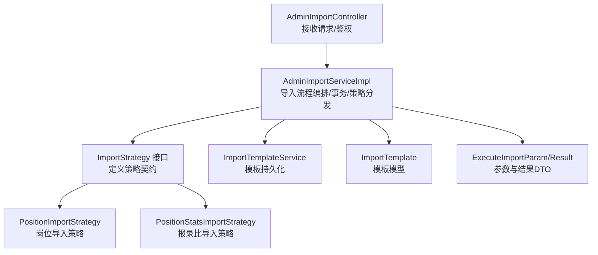
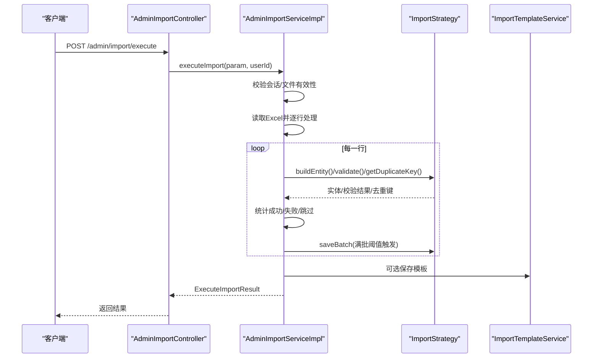
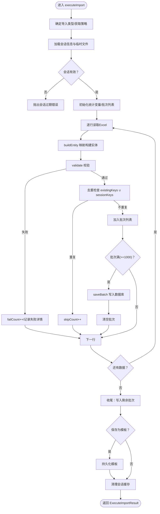
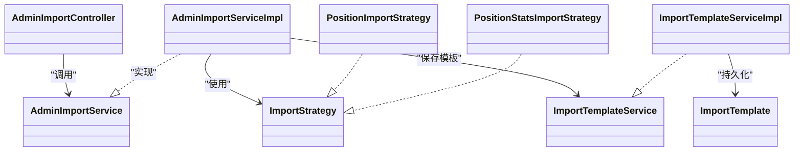

# 批量导入执行

<cite>
**本文引用的文件**
- [ExecuteImportParam.java](file://src/main/java/com/macro/mall/tiny/modules/ums/dto/ExecuteImportParam.java)
- [ExecuteImportResult.java](file://src/main/java/com/macro/mall/tiny/modules/ums/dto/ExecuteImportResult.java)
- [AdminImportService.java](file://src/main/java/com/macro/mall/tiny/modules/ums/service/AdminImportService.java)
- [AdminImportServiceImpl.java](file://src/main/java/com/macro/mall/tiny/modules/ums/service/impl/AdminImportServiceImpl.java)
- [AdminImportController.java](file://src/main/java/com/macro/mall/tiny/modules/ums/controller/AdminImportController.java)
- [ImportStrategy.java](file://src/main/java/com/macro/mall/tiny/modules/ums/strategy/ImportStrategy.java)
- [ImportTypeEnum.java](file://src/main/java/com/macro/mall/tiny/modules/ums/strategy/ImportTypeEnum.java)
- [PositionImportStrategy.java](file://src/main/java/com/macro/mall/tiny/modules/ums/strategy/PositionImportStrategy.java)
- [PositionStatsImportStrategy.java](file://src/main/java/com/macro/mall/tiny/modules/ums/strategy/PositionStatsImportStrategy.java)
- [ImportTemplateService.java](file://src/main/java/com/macro/mall/tiny/modules/ums/service/ImportTemplateService.java)
- [ImportTemplateServiceImpl.java](file://src/main/java/com/macro/mall/tiny/modules/ums/service/impl/ImportTemplateServiceImpl.java)
- [ImportTemplate.java](file://src/main/java/com/macro/mall/tiny/modules/ums/model/ImportTemplate.java)
- [ImportFieldMeta.java](file://src/main/java/com/macro/mall/tiny/modules/ums/dto/ImportFieldMeta.java)
- [AdminImportServiceTest.java](file://src/test/java/com/macro/mall/tiny/modules/ums/service/AdminImportServiceTest.java)
- [AdminImportControllerTest.java](file://src/test/java/com/macro/mall/tiny/modules/ums/controller/AdminImportControllerTest.java)
</cite>

## 目录
1. [简介](#简介)
2. [项目结构](#项目结构)
3. [核心组件](#核心组件)
4. [架构总览](#架构总览)
5. [详细组件分析](#详细组件分析)
6. [依赖分析](#依赖分析)
7. [性能考虑](#性能考虑)
8. [故障排查指南](#故障排查指南)
9. [结论](#结论)
10. [附录](#附录)

## 简介
本文件围绕“批量导入执行”功能进行系统化说明，重点覆盖以下方面：
- executeImport 方法的实现逻辑：参数校验、事务管理、批量处理、结果统计与错误收集
- ExecuteImportParam 参数设计：导入类型、文件标识、用户信息、配置选项等
- 事务控制与一致性保障：基于注解的事务边界、异常回滚策略
- ExecuteImportResult 结果组成：成功/失败/跳过计数、失败详情、行号与数据快照
- 性能优化策略：批量插入、连接池与数据库配置、内存控制
- 完整流程示例：从参数接收到底层数据写入的步骤
- 进度监控与状态跟踪：会话缓存、定时清理、失败明细
- 开发者调优建议与故障排查

## 项目结构
批量导入功能主要由三层构成：
- 控制器层：接收请求、鉴权与参数校验
- 服务层：导入流程编排、事务控制、策略分发
- 策略层：针对不同导入类型的具体构建、校验、去重与批量写入

图表来源
- [AdminImportController.java:81-93](file://src/main/java/com/macro/mall/tiny/modules/ums/controller/AdminImportController.java#L81-L93)
- [AdminImportServiceImpl.java:159-257](file://src/main/java/com/macro/mall/tiny/modules/ums/service/impl/AdminImportServiceImpl.java#L159-L257)
- [ImportStrategy.java:15-68](file://src/main/java/com/macro/mall/tiny/modules/ums/strategy/ImportStrategy.java#L15-L68)
- [PositionImportStrategy.java:15-231](file://src/main/java/com/macro/mall/tiny/modules/ums/strategy/PositionImportStrategy.java#L15-L231)
- [PositionStatsImportStrategy.java:17-152](file://src/main/java/com/macro/mall/tiny/modules/ums/strategy/PositionStatsImportStrategy.java#L17-L152)
- [ImportTemplateService.java:12-33](file://src/main/java/com/macro/mall/tiny/modules/ums/service/ImportTemplateService.java#L12-L33)
- [ImportTemplate.java:15-59](file://src/main/java/com/macro/mall/tiny/modules/ums/model/ImportTemplate.java#L15-L59)
- [ExecuteImportParam.java:13-48](file://src/main/java/com/macro/mall/tiny/modules/ums/dto/ExecuteImportParam.java#L13-L48)
- [ExecuteImportResult.java:13-68](file://src/main/java/com/macro/mall/tiny/modules/ums/dto/ExecuteImportResult.java#L13-L68)

章节来源
- [AdminImportController.java:31-147](file://src/main/java/com/macro/mall/tiny/modules/ums/controller/AdminImportController.java#L31-L147)
- [AdminImportServiceImpl.java:37-331](file://src/main/java/com/macro/mall/tiny/modules/ums/service/impl/AdminImportServiceImpl.java#L37-L331)
- [ImportStrategy.java:15-68](file://src/main/java/com/macro/mall/tiny/modules/ums/strategy/ImportStrategy.java#L15-L68)

## 核心组件
- 控制器 AdminImportController：提供导入类型查询、字段元数据获取、上传预览、执行导入、模板管理等接口，并进行权限控制
- 服务 AdminImportServiceImpl：负责会话缓存、上传预览、执行导入、模板保存、定时清理
- 策略接口 ImportStrategy 及其实现：定义构建实体、校验、去重、批量保存等能力；具体策略包括岗位与报录比导入
- DTO ExecuteImportParam/ExecuteImportResult：导入参数与结果的数据载体
- 模板服务与模型：ImportTemplateService/ImportTemplate，支持模板保存与查询

章节来源
- [AdminImportController.java:31-147](file://src/main/java/com/macro/mall/tiny/modules/ums/controller/AdminImportController.java#L31-L147)
- [AdminImportServiceImpl.java:37-331](file://src/main/java/com/macro/mall/tiny/modules/ums/service/impl/AdminImportServiceImpl.java#L37-L331)
- [ImportStrategy.java:15-68](file://src/main/java/com/macro/mall/tiny/modules/ums/strategy/ImportStrategy.java#L15-L68)
- [ExecuteImportParam.java:13-48](file://src/main/java/com/macro/mall/tiny/modules/ums/dto/ExecuteImportParam.java#L13-L48)
- [ExecuteImportResult.java:13-68](file://src/main/java/com/macro/mall/tiny/modules/ums/dto/ExecuteImportResult.java#L13-L68)
- [ImportTemplateService.java:12-33](file://src/main/java/com/macro/mall/tiny/modules/ums/service/ImportTemplateService.java#L12-L33)
- [ImportTemplate.java:15-59](file://src/main/java/com/macro/mall/tiny/modules/ums/model/ImportTemplate.java#L15-L59)

## 架构总览
批量导入采用“控制器-服务-策略”的分层架构，结合会话缓存与模板持久化，形成可扩展的导入体系。

图表来源
- [AdminImportController.java:81-93](file://src/main/java/com/macro/mall/tiny/modules/ums/controller/AdminImportController.java#L81-L93)
- [AdminImportServiceImpl.java:159-257](file://src/main/java/com/macro/mall/tiny/modules/ums/service/impl/AdminImportServiceImpl.java#L159-L257)
- [ImportStrategy.java:35-67](file://src/main/java/com/macro/mall/tiny/modules/ums/strategy/ImportStrategy.java#L35-L67)
- [ImportTemplateService.java:30-32](file://src/main/java/com/macro/mall/tiny/modules/ums/service/ImportTemplateService.java#L30-L32)

## 详细组件分析

### ExecuteImportParam 参数设计
- 导入类型 importType：决定使用哪种策略，支持枚举 POSITION、POSITION_STATS
- 会话ID sessionId：关联上传阶段生成的临时文件与列头信息
- 列映射 mapping：字段名到Excel列索引的映射，支持整数或可解析数字
- 年份 year：手动输入的年份，作为额外参数传递给策略
- 模板名称 templateName 与保存开关 saveAsTemplate：可选保存为模板

章节来源
- [ExecuteImportParam.java:13-48](file://src/main/java/com/macro/mall/tiny/modules/ums/dto/ExecuteImportParam.java#L13-L48)
- [ImportTypeEnum.java:9-40](file://src/main/java/com/macro/mall/tiny/modules/ums/strategy/ImportTypeEnum.java#L9-L40)

### ExecuteImportResult 结果组成
- 成功条数 successCount：批量写入成功的实体数量
- 失败条数 failCount：校验失败或写入异常的记录数
- 跳过条数 skipCount：因重复键被跳过的记录数
- 失败详情 failDetails：包含行号、原始数据快照、失败原因

章节来源
- [ExecuteImportResult.java:13-68](file://src/main/java/com/macro/mall/tiny/modules/ums/dto/ExecuteImportResult.java#L13-L68)

### executeImport 方法实现逻辑
- 事务管理：在服务层以注解开启事务，异常即回滚，保证数据一致性
- 参数与会话校验：确认 sessionId 存在且对应临时文件有效
- 策略分发：根据导入类型选择对应 ImportStrategy 实现
- 批量处理：
  - 逐行读取 Excel，构建实体并校验
  - 去重：结合数据库现有键与本次会话键集合
  - 批量阈值：达到阈值（默认1000）触发一次 saveBatch
  - 统计：累计成功/失败/跳过计数
- 模板保存：若开启保存模板且模板名有效，则持久化列映射
- 会话清理：导入完成后移除会话缓存，定时任务清理过期文件

图表来源
- [AdminImportServiceImpl.java:159-257](file://src/main/java/com/macro/mall/tiny/modules/ums/service/impl/AdminImportServiceImpl.java#L159-L257)
- [ImportStrategy.java:35-67](file://src/main/java/com/macro/mall/tiny/modules/ums/strategy/ImportStrategy.java#L35-L67)

章节来源
- [AdminImportServiceImpl.java:159-257](file://src/main/java/com/macro/mall/tiny/modules/ums/service/impl/AdminImportServiceImpl.java#L159-L257)

### 事务控制与一致性保障
- 事务边界：executeImport 在服务层以注解声明事务，异常自动回滚
- 一致性策略：
  - 批量写入在单个事务内完成，避免部分提交
  - 去重在内存中进行，结合数据库现有键集合，降低并发冲突
  - 失败记录单独统计与归档，不影响已成功提交的数据

章节来源
- [AdminImportServiceImpl.java:160-168](file://src/main/java/com/macro/mall/tiny/modules/ums/service/impl/AdminImportServiceImpl.java#L160-L168)

### 导入流程示例（从参数接收到底层写入）
- 步骤1：上传Excel并预览，生成会话ID与临时文件
- 步骤2：前端构造 ExecuteImportParam（sessionId、mapping、year、saveAsTemplate）
- 步骤3：控制器接收参数并调用服务 executeImport
- 步骤4：服务读取Excel，逐行构建实体、校验、去重、批量写入
- 步骤5：可选保存模板，清理会话缓存
- 步骤6：返回 ExecuteImportResult，包含成功/失败/跳过计数与失败详情

章节来源
- [AdminImportController.java:61-93](file://src/main/java/com/macro/mall/tiny/modules/ums/controller/AdminImportController.java#L61-L93)
- [AdminImportServiceImpl.java:100-157](file://src/main/java/com/macro/mall/tiny/modules/ums/service/impl/AdminImportServiceImpl.java#L100-L157)
- [AdminImportServiceImpl.java:159-257](file://src/main/java/com/macro/mall/tiny/modules/ums/service/impl/AdminImportServiceImpl.java#L159-L257)

### 进度监控与状态跟踪
- 会话缓存：以 sessionId 为键缓存临时文件路径、列头与创建时间
- 定时清理：每小时扫描并删除超过1小时未使用的临时文件
- 失败明细：记录行号、原始数据与失败原因，便于定位问题

章节来源
- [AdminImportServiceImpl.java:58-72](file://src/main/java/com/macro/mall/tiny/modules/ums/service/impl/AdminImportServiceImpl.java#L58-L72)
- [AdminImportServiceImpl.java:294-311](file://src/main/java/com/macro/mall/tiny/modules/ums/service/impl/AdminImportServiceImpl.java#L294-L311)
- [ExecuteImportResult.java:38-67](file://src/main/java/com/macro/mall/tiny/modules/ums/dto/ExecuteImportResult.java#L38-L67)

### 策略实现要点（岗位与报录比）
- 岗位导入策略 PositionImportStrategy：
  - 字段元数据：部门、职位名称、专业要求、学历要求、政治面貌要求、是否限应届、招录人数、年份
  - 校验规则：必填项、年份范围、学历/政治面貌枚举、人数>0
  - 去重键：年份+部门+职位名称
  - 批量写入：委托 PositionService.saveBatch
- 报录比导入策略 PositionStatsImportStrategy：
  - 字段元数据：部门、职位名称、报名人数、最低进面分、最高进面分、年份
  - 校验规则：必填项、年份范围、报名人数≥0、最低≤最高
  - 去重键：年份+部门+职位名称
  - 批量写入：委托 PositionStatsService.saveBatch

章节来源
- [PositionImportStrategy.java:70-186](file://src/main/java/com/macro/mall/tiny/modules/ums/strategy/PositionImportStrategy.java#L70-L186)
- [PositionStatsImportStrategy.java:28-132](file://src/main/java/com/macro/mall/tiny/modules/ums/strategy/PositionStatsImportStrategy.java#L28-L132)

## 依赖分析
- 控制器依赖服务：AdminImportController 注入 AdminImportServiceImpl
- 服务依赖策略：AdminImportServiceImpl 通过 ApplicationContext 收集 ImportStrategy 实现
- 策略依赖服务：各策略依赖对应领域服务（如 PositionService、PositionStatsService）
- 模板依赖持久化：ImportTemplateService 委托 ImportTemplateServiceImpl 实现持久化

图表来源
- [AdminImportController.java:37-41](file://src/main/java/com/macro/mall/tiny/modules/ums/controller/AdminImportController.java#L37-L41)
- [AdminImportServiceImpl.java:61-72](file://src/main/java/com/macro/mall/tiny/modules/ums/service/impl/AdminImportServiceImpl.java#L61-L72)
- [ImportStrategy.java:15-68](file://src/main/java/com/macro/mall/tiny/modules/ums/strategy/ImportStrategy.java#L15-L68)
- [PositionImportStrategy.java:15-231](file://src/main/java/com/macro/mall/tiny/modules/ums/strategy/PositionImportStrategy.java#L15-L231)
- [PositionStatsImportStrategy.java:17-152](file://src/main/java/com/macro/mall/tiny/modules/ums/strategy/PositionStatsImportStrategy.java#L17-L152)
- [ImportTemplateService.java:12-33](file://src/main/java/com/macro/mall/tiny/modules/ums/service/ImportTemplateService.java#L12-L33)
- [ImportTemplateServiceImpl.java:17-46](file://src/main/java/com/macro/mall/tiny/modules/ums/service/impl/ImportTemplateServiceImpl.java#L17-L46)
- [ImportTemplate.java:15-59](file://src/main/java/com/macro/mall/tiny/modules/ums/model/ImportTemplate.java#L15-L59)

章节来源
- [AdminImportController.java:31-147](file://src/main/java/com/macro/mall/tiny/modules/ums/controller/AdminImportController.java#L31-L147)
- [AdminImportServiceImpl.java:37-331](file://src/main/java/com/macro/mall/tiny/modules/ums/service/impl/AdminImportServiceImpl.java#L37-L331)

## 性能考虑
- 批量插入：达到阈值（默认1000）才写入数据库，减少事务开销与网络往返
- 连接池与数据库配置：确保连接池大小与超时合理，避免阻塞
- 内存控制：去重键集合与批次列表在内存中维护，建议控制单次导入规模与列映射复杂度
- 读取优化：EasyExcel 逐行读取，避免一次性加载整表
- 模板保存：仅在明确需要时保存模板，减少额外IO

章节来源
- [AdminImportServiceImpl.java:232-244](file://src/main/java/com/macro/mall/tiny/modules/ums/service/impl/AdminImportServiceImpl.java#L232-L244)

## 故障排查指南
- 会话过期：当 sessionId 无效或临时文件不存在时，抛出会话过期错误
- 文件格式错误：上传非Excel文件或空文件导致失败
- 校验失败：字段缺失、年份越界、学历/政治面貌不在枚举内、人数非法等
- 去重冲突：重复键导致记录被跳过
- 模板保存失败：模板名为空或保存过程异常

章节来源
- [AdminImportControllerTest.java:136-153](file://src/test/java/com/macro/mall/tiny/modules/ums/controller/AdminImportControllerTest.java#L136-L153)
- [AdminImportServiceTest.java:305-314](file://src/test/java/com/macro/mall/tiny/modules/ums/service/AdminImportServiceTest.java#L305-L314)
- [AdminImportServiceImpl.java:177-185](file://src/main/java/com/macro/mall/tiny/modules/ums/service/impl/AdminImportServiceImpl.java#L177-L185)
- [PositionImportStrategy.java:140-165](file://src/main/java/com/macro/mall/tiny/modules/ums/strategy/PositionImportStrategy.java#L140-L165)
- [PositionStatsImportStrategy.java:88-111](file://src/main/java/com/macro/mall/tiny/modules/ums/strategy/PositionStatsImportStrategy.java#L88-L111)

## 结论
批量导入执行功能通过“控制器-服务-策略”分层与会话缓存、模板持久化机制，实现了高扩展性与易用性。executeImport 方法在事务边界内完成参数校验、批量处理与结果统计，配合去重与失败明细，确保数据一致性与可观测性。开发者可依据本文提供的流程与调优建议，进一步提升导入性能与稳定性。

## 附录
- 字段元数据参考：岗位导入与报录比导入的字段定义与必填说明
- 模板模型：模板名称、描述、导入类型、列映射JSON、创建者与时间戳

章节来源
- [ImportFieldMeta.java:13-34](file://src/main/java/com/macro/mall/tiny/modules/ums/dto/ImportFieldMeta.java#L13-L34)
- [ImportTemplate.java:24-57](file://src/main/java/com/macro/mall/tiny/modules/ums/model/ImportTemplate.java#L24-L57)