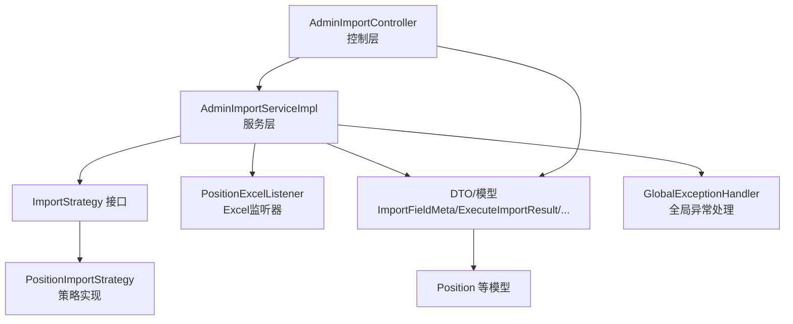
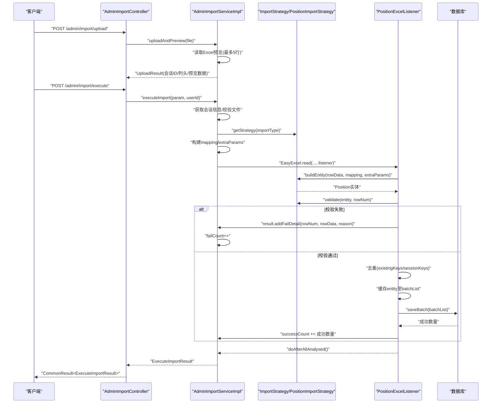
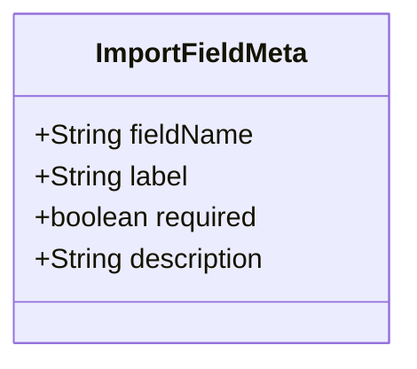
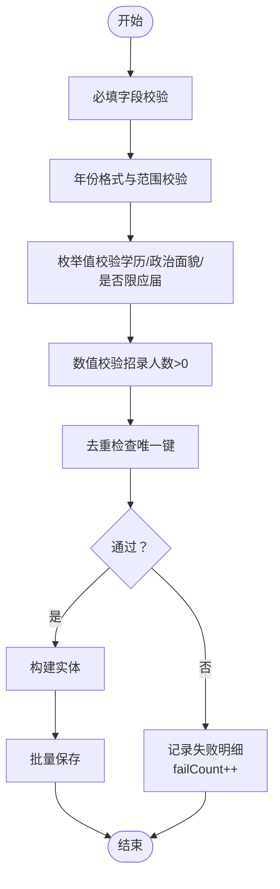
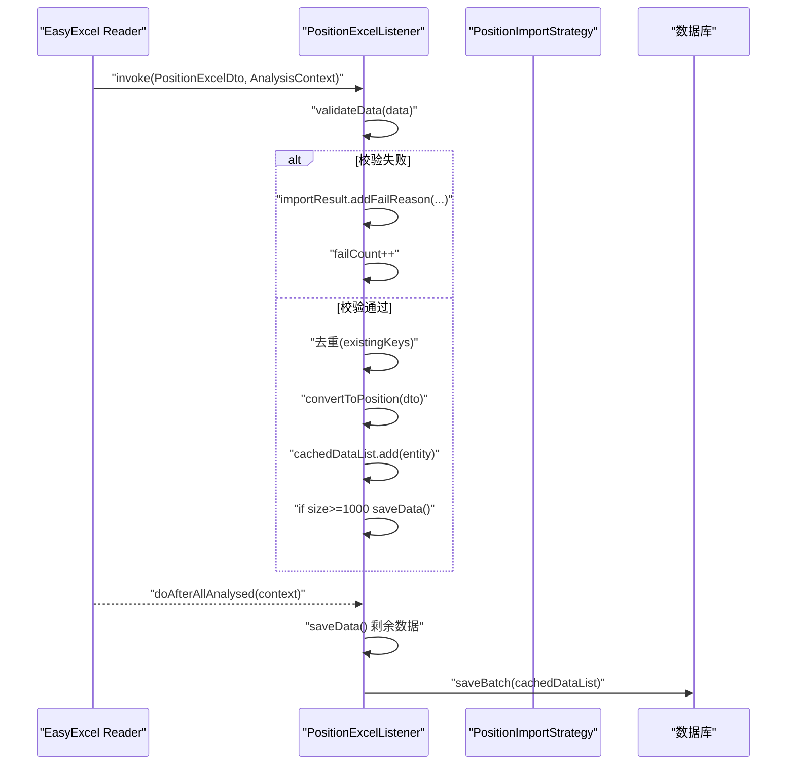
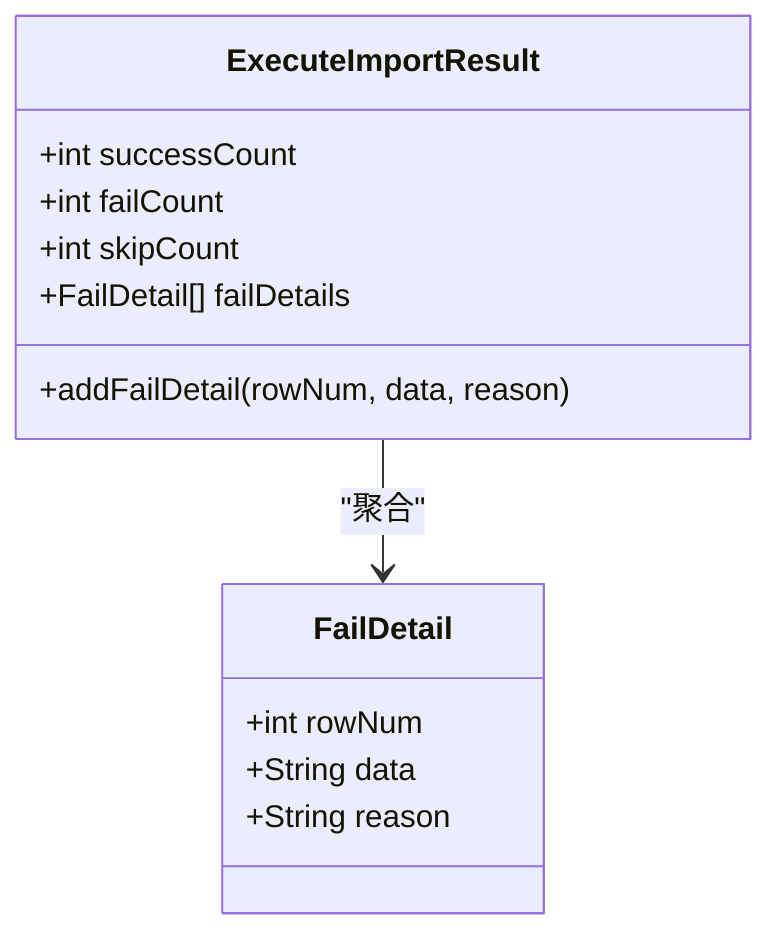
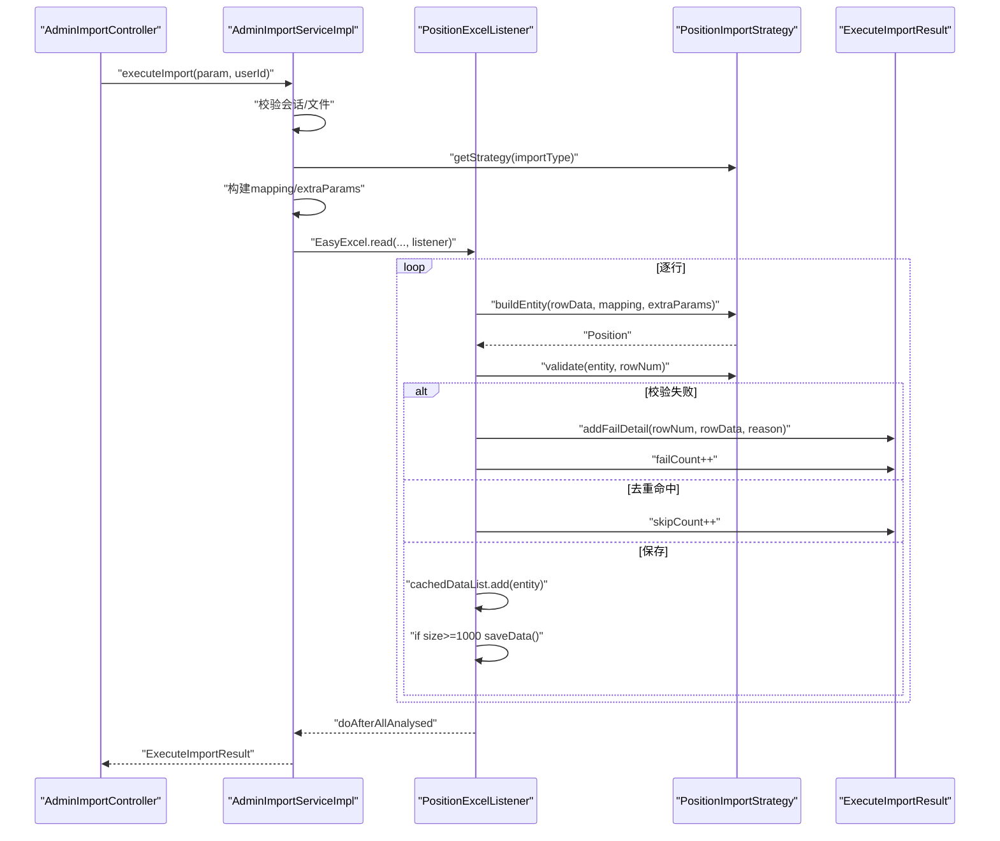
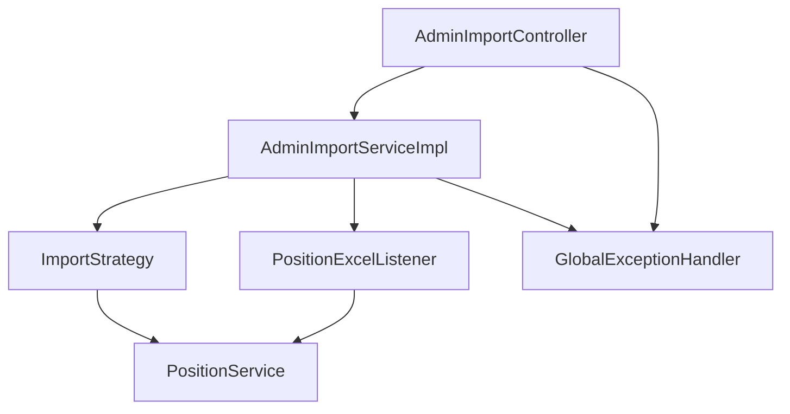

# 数据验证与错误处理

<cite>
**本文引用的文件**
- [ImportFieldMeta.java](file://src/main/java/com/macro/mall/tiny/modules/ums/dto/ImportFieldMeta.java)
- [ExecuteImportResult.java](file://src/main/java/com/macro/mall/tiny/modules/ums/dto/ExecuteImportResult.java)
- [PositionExcelListener.java](file://src/main/java/com/macro/mall/tiny/modules/ums/listener/PositionExcelListener.java)
- [AdminImportServiceImpl.java](file://src/main/java/com/macro/mall/tiny/modules/ums/service/impl/AdminImportServiceImpl.java)
- [AdminImportService.java](file://src/main/java/com/macro/mall/tiny/modules/ums/service/AdminImportService.java)
- [ImportResult.java](file://src/main/java/com/macro/mall/tiny/modules/ums/dto/ImportResult.java)
- [PositionExcelDto.java](file://src/main/java/com/macro/mall/tiny/modules/ums/dto/PositionExcelDto.java)
- [ImportStrategy.java](file://src/main/java/com/macro/mall/tiny/modules/ums/strategy/ImportStrategy.java)
- [PositionImportStrategy.java](file://src/main/java/com/macro/mall/tiny/modules/ums/strategy/PositionImportStrategy.java)
- [AdminImportController.java](file://src/main/java/com/macro/mall/tiny/modules/ums/controller/AdminImportController.java)
- [Position.java](file://src/main/java/com/macro/mall/tiny/modules/ums/model/Position.java)
- [IErrorCode.java](file://src/main/java/com/macro/mall/tiny/common/api/IErrorCode.java)
- [ApiException.java](file://src/main/java/com/macro/mall/tiny/common/exception/ApiException.java)
- [Asserts.java](file://src/main/java/com/macro/mall/tiny/common/exception/Asserts.java)
- [GlobalExceptionHandler.java](file://src/main/java/com/macro/mall/tiny/common/exception/GlobalExceptionHandler.java)
- [ExecuteImportParam.java](file://src/main/java/com/macro/mall/tiny/modules/ums/dto/ExecuteImportParam.java)
- [AdminImportServiceTest.java](file://src/test/java/com/macro/mall/tiny/modules/ums/service/AdminImportServiceTest.java)
</cite>

## 目录
1. [简介](#简介)
2. [项目结构](#项目结构)
3. [核心组件](#核心组件)
4. [架构总览](#架构总览)
5. [详细组件分析](#详细组件分析)
6. [依赖分析](#依赖分析)
7. [性能考虑](#性能考虑)
8. [故障排查指南](#故障排查指南)
9. [结论](#结论)
10. [附录](#附录)

## 简介
本文件围绕“数据验证与错误处理”主题，系统梳理并解释以下关键点：
- ImportFieldMeta 字段元数据的设计与使用，涵盖字段名、中文标签、是否必填、描述等属性。
- 数据验证的层次结构：格式验证、业务规则验证、数据完整性检查。
- PositionExcelListener 监听器的实现：数据读取监听、错误收集、批量处理。
- ExecuteImportResult 的错误处理设计：如何区分数据错误、系统错误、业务错误。
- 错误信息的收集与展示：行号标记、错误描述、修复建议。
- 完整的错误处理流程示例：从数据读取到错误汇总。
- 错误恢复策略：部分失败处理、数据回滚、增量导入。
- 面向开发者的最佳实践与调试技巧。

## 项目结构
本项目采用模块化与分层架构，导入功能主要涉及控制层、服务层、策略层、监听器与DTO/模型等。关键路径如下：
- 控制层：AdminImportController 提供导入类型查询、上传预览、执行导入、模板管理等接口。
- 服务层：AdminImportServiceImpl 实现通用导入流程模板，结合策略模式分发不同导入类型。
- 策略层：ImportStrategy 接口及 PositionImportStrategy 实现具体字段元数据、实体构建、校验、去重与批量保存。
- 监听器：PositionExcelListener 针对岗位导入场景，基于 EasyExcel 的 ReadListener 进行逐行读取与校验。
- DTO/模型：ImportFieldMeta、ExecuteImportResult、PositionExcelDto、Position、ExecuteImportParam 等承载数据与结果。
- 异常体系：ApiException、IErrorCode、Asserts、GlobalExceptionHandler 统一异常处理与响应封装。

**图表来源**
- [AdminImportController.java:1-148](file://src/main/java/com/macro/mall/tiny/modules/ums/controller/AdminImportController.java#L1-L148)
- [AdminImportServiceImpl.java:1-332](file://src/main/java/com/macro/mall/tiny/modules/ums/service/impl/AdminImportServiceImpl.java#L1-L332)
- [ImportStrategy.java:1-69](file://src/main/java/com/macro/mall/tiny/modules/ums/strategy/ImportStrategy.java#L1-L69)
- [PositionImportStrategy.java:1-231](file://src/main/java/com/macro/mall/tiny/modules/ums/strategy/PositionImportStrategy.java#L1-L231)
- [PositionExcelListener.java:1-240](file://src/main/java/com/macro/mall/tiny/modules/ums/listener/PositionExcelListener.java#L1-L240)
- [GlobalExceptionHandler.java:1-100](file://src/main/java/com/macro/mall/tiny/common/exception/GlobalExceptionHandler.java#L1-L100)

**章节来源**
- [AdminImportController.java:1-148](file://src/main/java/com/macro/mall/tiny/modules/ums/controller/AdminImportController.java#L1-L148)
- [AdminImportServiceImpl.java:1-332](file://src/main/java/com/macro/mall/tiny/modules/ums/service/impl/AdminImportServiceImpl.java#L1-L332)

## 核心组件
- ImportFieldMeta：定义字段元数据，用于前端列映射与校验提示，包含字段名、中文标签、是否必填、描述等。
- ExecuteImportResult：导入执行结果容器，记录成功/失败/跳过数量，并收集失败明细（行号、数据内容、失败原因）。
- PositionExcelListener：基于 EasyExcel 的监听器，负责逐行读取、格式与业务规则校验、去重、批量入库。
- AdminImportServiceImpl：通用导入流程模板，结合策略模式与 EasyExcel 事件驱动读取，完成数据构建、校验、去重、批量保存与结果统计。
- ImportStrategy/PositionImportStrategy：策略接口与岗位导入策略实现，提供字段元数据、实体构建、校验、去重键生成、现有数据去重键集合与批量保存。
- DTO/模型：ImportResult（旧版监听器使用）、PositionExcelDto（Excel映射）、Position（持久化模型）、ExecuteImportParam（导入参数）。
- 异常体系：Asserts、ApiException、IErrorCode、GlobalExceptionHandler，统一业务异常与系统异常的抛出与响应。

**章节来源**
- [ImportFieldMeta.java:1-35](file://src/main/java/com/macro/mall/tiny/modules/ums/dto/ImportFieldMeta.java#L1-L35)
- [ExecuteImportResult.java:1-69](file://src/main/java/com/macro/mall/tiny/modules/ums/dto/ExecuteImportResult.java#L1-L69)
- [PositionExcelListener.java:1-240](file://src/main/java/com/macro/mall/tiny/modules/ums/listener/PositionExcelListener.java#L1-L240)
- [AdminImportServiceImpl.java:1-332](file://src/main/java/com/macro/mall/tiny/modules/ums/service/impl/AdminImportServiceImpl.java#L1-L332)
- [ImportStrategy.java:1-69](file://src/main/java/com/macro/mall/tiny/modules/ums/strategy/ImportStrategy.java#L1-L69)
- [PositionImportStrategy.java:1-231](file://src/main/java/com/macro/mall/tiny/modules/ums/strategy/PositionImportStrategy.java#L1-L231)
- [ImportResult.java:1-42](file://src/main/java/com/macro/mall/tiny/modules/ums/dto/ImportResult.java#L1-L42)
- [PositionExcelDto.java:1-37](file://src/main/java/com/macro/mall/tiny/modules/ums/dto/PositionExcelDto.java#L1-L37)
- [Position.java:1-68](file://src/main/java/com/macro/mall/tiny/modules/ums/model/Position.java#L1-L68)
- [ExecuteImportParam.java:1-49](file://src/main/java/com/macro/mall/tiny/modules/ums/dto/ExecuteImportParam.java#L1-L49)
- [Asserts.java:1-19](file://src/main/java/com/macro/mall/tiny/common/exception/Asserts.java#L1-L19)
- [ApiException.java:1-34](file://src/main/java/com/macro/mall/tiny/common/exception/ApiException.java#L1-L34)
- [IErrorCode.java:1-12](file://src/main/java/com/macro/mall/tiny/common/api/IErrorCode.java#L1-L12)
- [GlobalExceptionHandler.java:1-100](file://src/main/java/com/macro/mall/tiny/common/exception/GlobalExceptionHandler.java#L1-L100)

## 架构总览
导入流程采用“控制层-服务层-策略层-监听器”的分层设计，配合 EasyExcel 的事件驱动读取，实现高性能、可扩展的批量导入能力。整体流程如下：

**图表来源**
- [AdminImportController.java:1-148](file://src/main/java/com/macro/mall/tiny/modules/ums/controller/AdminImportController.java#L1-L148)
- [AdminImportServiceImpl.java:160-257](file://src/main/java/com/macro/mall/tiny/modules/ums/service/impl/AdminImportServiceImpl.java#L160-L257)
- [PositionImportStrategy.java:83-137](file://src/main/java/com/macro/mall/tiny/modules/ums/strategy/PositionImportStrategy.java#L83-L137)
- [PositionExcelListener.java:82-121](file://src/main/java/com/macro/mall/tiny/modules/ums/listener/PositionExcelListener.java#L82-L121)

## 详细组件分析

### ImportFieldMeta 字段元数据设计
ImportFieldMeta 作为字段元数据载体，用于：
- 前端列映射下拉框选项生成；
- 校验提示与错误信息中的字段标识；
- 必填字段的显式标注，便于用户理解。

字段属性与用途：
- fieldName：后端字段名，用于映射与构建实体。
- label：中文标签，用于界面显示与错误提示。
- required：是否必填，用于格式与业务规则校验。
- description：字段描述，帮助用户理解字段含义。

**图表来源**
- [ImportFieldMeta.java:14-34](file://src/main/java/com/macro/mall/tiny/modules/ums/dto/ImportFieldMeta.java#L14-L34)

**章节来源**
- [ImportFieldMeta.java:1-35](file://src/main/java/com/macro/mall/tiny/modules/ums/dto/ImportFieldMeta.java#L1-L35)
- [PositionImportStrategy.java:71-81](file://src/main/java/com/macro/mall/tiny/modules/ums/strategy/PositionImportStrategy.java#L71-L81)

### 数据验证层次结构
系统在多层进行数据验证，确保导入质量与一致性：
- 格式验证：对必填字段、数值范围、字符串格式进行基础校验（如年份范围、招录人数>0）。
- 业务规则验证：对枚举值、关键字映射、逻辑约束进行校验（如学历/政治面貌的有效值、是否限应届的取值）。
- 数据完整性检查：基于唯一键（年份+部门+职位名称）进行去重，避免重复与冲突。

**图表来源**
- [PositionImportStrategy.java:140-165](file://src/main/java/com/macro/mall/tiny/modules/ums/strategy/PositionImportStrategy.java#L140-L165)
- [PositionExcelListener.java:126-187](file://src/main/java/com/macro/mall/tiny/modules/ums/listener/PositionExcelListener.java#L126-L187)

**章节来源**
- [PositionImportStrategy.java:140-165](file://src/main/java/com/macro/mall/tiny/modules/ums/strategy/PositionImportStrategy.java#L140-L165)
- [PositionExcelListener.java:126-187](file://src/main/java/com/macro/mall/tiny/modules/ums/listener/PositionExcelListener.java#L126-L187)

### PositionExcelListener 监听器实现
PositionExcelListener 作为 EasyExcel 的 ReadListener，承担以下职责：
- 数据读取监听：逐行触发 invoke 回调，进行校验与转换。
- 错误收集：将校验失败的行号、原始数据与失败原因加入导入结果。
- 去重：利用 existingKeys 防止数据库与Excel内的重复。
- 批量处理：达到阈值（默认1000）时批量保存，减少IO与内存压力。

关键流程与要点：
- 行号维护：currentRow 递增，用于错误定位。
- 校验入口：validateData 对必填、格式、枚举、数值进行校验。
- 唯一键：由年份、部门、职位名称拼接生成。
- 转换与保存：convertToPosition 构建 Position 实体；saveData 批量写入。

**图表来源**
- [PositionExcelListener.java:82-121](file://src/main/java/com/macro/mall/tiny/modules/ums/listener/PositionExcelListener.java#L82-L121)
- [PositionExcelListener.java:230-238](file://src/main/java/com/macro/mall/tiny/modules/ums/listener/PositionExcelListener.java#L230-L238)

**章节来源**
- [PositionExcelListener.java:1-240](file://src/main/java/com/macro/mall/tiny/modules/ums/listener/PositionExcelListener.java#L1-L240)

### ExecuteImportResult 错误处理设计
ExecuteImportResult 用于集中记录导入结果与错误信息：
- 计数指标：successCount、failCount、skipCount。
- 失败明细：FailDetail 包含 rowNum、data、reason，便于前端展示与修复建议。

错误分类与处理：
- 数据错误：由策略或监听器在 validate/build 阶段发现，记录到 failDetails。
- 业务错误：如会话过期、文件无效等，通过 Asserts 抛出业务异常，交由 GlobalExceptionHandler 统一处理。
- 系统错误：未捕获的异常由全局异常处理器兜底，返回系统繁忙提示。

**图表来源**
- [ExecuteImportResult.java:13-68](file://src/main/java/com/macro/mall/tiny/modules/ums/dto/ExecuteImportResult.java#L13-L68)

**章节来源**
- [ExecuteImportResult.java:1-69](file://src/main/java/com/macro/mall/tiny/modules/ums/dto/ExecuteImportResult.java#L1-L69)
- [AdminImportServiceImpl.java:175-257](file://src/main/java/com/macro/mall/tiny/modules/ums/service/impl/AdminImportServiceImpl.java#L175-L257)

### 错误信息收集与展示机制
- 行号标记：监听器与策略均以行号作为错误上下文，便于定位。
- 错误描述：validate/build 返回明确的中文错误信息，包含字段与期望值。
- 修复建议：错误信息中给出有效值列表或格式要求，指导用户修正。
- 展示方式：前端接收 ExecuteImportResult，渲染失败明细列表，支持下载失败报告。

**章节来源**
- [PositionExcelListener.java:86-92](file://src/main/java/com/macro/mall/tiny/modules/ums/listener/PositionExcelListener.java#L86-L92)
- [PositionImportStrategy.java:140-165](file://src/main/java/com/macro/mall/tiny/modules/ums/strategy/PositionImportStrategy.java#L140-L165)
- [ExecuteImportResult.java:38-63](file://src/main/java/com/macro/mall/tiny/modules/ums/dto/ExecuteImportResult.java#L38-L63)

### 完整错误处理流程示例
以下示例展示从数据读取到错误汇总的完整步骤（以岗位导入为例）：
1. 控制层接收上传文件并预览，返回会话ID与列头信息。
2. 控制层接收执行导入请求，携带会话ID与列映射。
3. 服务层加载会话文件，初始化策略与去重集合。
4. 事件驱动读取：逐行构建实体、校验、去重、缓存。
5. 达到批量阈值或读取结束：批量保存并更新计数。
6. 结果汇总：返回 ExecuteImportResult，包含成功/失败/跳过数量与失败明细。

**图表来源**
- [AdminImportController.java:81-93](file://src/main/java/com/macro/mall/tiny/modules/ums/controller/AdminImportController.java#L81-L93)
- [AdminImportServiceImpl.java:175-257](file://src/main/java/com/macro/mall/tiny/modules/ums/service/impl/AdminImportServiceImpl.java#L175-L257)
- [PositionExcelListener.java:82-121](file://src/main/java/com/macro/mall/tiny/modules/ums/listener/PositionExcelListener.java#L82-L121)
- [PositionImportStrategy.java:83-137](file://src/main/java/com/macro/mall/tiny/modules/ums/strategy/PositionImportStrategy.java#L83-L137)

**章节来源**
- [AdminImportController.java:81-93](file://src/main/java/com/macro/mall/tiny/modules/ums/controller/AdminImportController.java#L81-L93)
- [AdminImportServiceImpl.java:160-257](file://src/main/java/com/macro/mall/tiny/modules/ums/service/impl/AdminImportServiceImpl.java#L160-L257)

### 错误恢复策略
- 部分失败处理：失败明细单独记录，不影响已成功导入的数据。
- 数据回滚：当前实现未在单次事务内回滚失败记录，建议在需要强一致的场景引入更细粒度的事务控制。
- 增量导入：通过 existingKeys 与 sessionKeys 双重去重，避免重复导入；支持多次执行同一模板。
- 模板复用：支持将列映射保存为模板，提升后续导入效率与一致性。

**章节来源**
- [AdminImportServiceImpl.java:196-257](file://src/main/java/com/macro/mall/tiny/modules/ums/service/impl/AdminImportServiceImpl.java#L196-L257)
- [PositionImportStrategy.java:167-181](file://src/main/java/com/macro/mall/tiny/modules/ums/strategy/PositionImportStrategy.java#L167-L181)

### 面向开发者的最佳实践与调试技巧
- 明确字段元数据：在策略中提供清晰的 ImportFieldMeta 列表，确保前端与后端一致。
- 分层校验：将格式校验与业务规则校验分离，便于定位问题与扩展规则。
- 事件驱动读取：合理设置批量阈值，平衡内存占用与吞吐量。
- 错误信息友好：提供明确的错误描述与有效值列表，降低用户修改成本。
- 异常统一处理：使用 Asserts 抛出业务异常，借助 GlobalExceptionHandler 统一响应。
- 单元测试覆盖：通过反射调用私有方法（如学历/政治面貌解析），确保边界条件与关键字映射正确性。

**章节来源**
- [AdminImportServiceTest.java:35-190](file://src/test/java/com/macro/mall/tiny/modules/ums/service/AdminImportServiceTest.java#L35-L190)
- [Asserts.java:10-18](file://src/main/java/com/macro/mall/tiny/common/exception/Asserts.java#L10-L18)
- [GlobalExceptionHandler.java:27-98](file://src/main/java/com/macro/mall/tiny/common/exception/GlobalExceptionHandler.java#L27-L98)

## 依赖分析
- 控制层依赖服务层与模板服务，提供导入类型、上传预览、执行导入与模板管理接口。
- 服务层依赖策略接口与监听器，结合 EasyExcel 实现通用导入流程。
- 策略层依赖服务层（如 PositionService）进行去重与批量保存。
- 监听器依赖服务层（如 PositionService）与导入结果容器。
- 异常体系贯穿各层，保证错误信息的一致性与可追踪性。

**图表来源**
- [AdminImportController.java:1-148](file://src/main/java/com/macro/mall/tiny/modules/ums/controller/AdminImportController.java#L1-L148)
- [AdminImportServiceImpl.java:1-332](file://src/main/java/com/macro/mall/tiny/modules/ums/service/impl/AdminImportServiceImpl.java#L1-L332)
- [PositionExcelListener.java:1-240](file://src/main/java/com/macro/mall/tiny/modules/ums/listener/PositionExcelListener.java#L1-L240)
- [GlobalExceptionHandler.java:1-100](file://src/main/java/com/macro/mall/tiny/common/exception/GlobalExceptionHandler.java#L1-L100)

**章节来源**
- [AdminImportController.java:1-148](file://src/main/java/com/macro/mall/tiny/modules/ums/controller/AdminImportController.java#L1-L148)
- [AdminImportServiceImpl.java:1-332](file://src/main/java/com/macro/mall/tiny/modules/ums/service/impl/AdminImportServiceImpl.java#L1-L332)

## 性能考虑
- 批量阈值：监听器与服务层均采用批量处理（默认1000），减少数据库往返与内存峰值。
- 去重优化：利用 Set 快速判断重复，避免重复入库与后续冲突。
- 事件驱动：EasyExcel 的 ReadListener 在读取过程中即时处理，降低内存占用。
- 事务控制：服务层导入方法声明事务，确保批量保存的原子性。

**章节来源**
- [PositionExcelListener.java:24-30](file://src/main/java/com/macro/mall/tiny/modules/ums/listener/PositionExcelListener.java#L24-L30)
- [AdminImportServiceImpl.java:232-236](file://src/main/java/com/macro/mall/tiny/modules/ums/service/impl/AdminImportServiceImpl.java#L232-L236)

## 故障排查指南
常见问题与排查步骤：
- 会话过期/文件无效：检查 sessionId 是否存在与文件是否仍存在于临时目录，服务层会抛出业务异常。
- 参数校验失败：查看 GlobalExceptionHandler 对 MethodArgumentNotValidException/BindException 的处理，确认字段缺失或格式错误。
- 文件大小超限：MaxUploadSizeExceededException 将被统一拦截并返回提示。
- 导入失败明细：核对 ExecuteImportResult.failDetails，定位具体行号与错误原因。
- 关键字映射异常：检查学历/政治面貌解析逻辑，确认输入是否包含预期关键词。

**章节来源**
- [AdminImportServiceImpl.java:177-185](file://src/main/java/com/macro/mall/tiny/modules/ums/service/impl/AdminImportServiceImpl.java#L177-L185)
- [GlobalExceptionHandler.java:36-98](file://src/main/java/com/macro/mall/tiny/common/exception/GlobalExceptionHandler.java#L36-L98)
- [AdminImportServiceTest.java:305-314](file://src/test/java/com/macro/mall/tiny/modules/ums/service/AdminImportServiceTest.java#L305-L314)

## 结论
本系统通过 ImportFieldMeta、策略模式、监听器与统一异常处理，构建了清晰、可扩展且高效的导入与错误处理机制。其分层设计与事件驱动读取在保证性能的同时，提供了良好的可维护性与用户体验。建议在需要强一致性的场景中进一步细化事务与回滚策略，并持续完善字段元数据与错误提示，提升系统的健壮性与易用性。

## 附录
- 字段元数据与校验规则参考：
  - ImportFieldMeta：字段名、中文标签、是否必填、描述。
  - PositionImportStrategy：必填字段、枚举值、数值范围、唯一键生成。
- 错误处理与异常响应：
  - Asserts：统一抛出业务异常。
  - GlobalExceptionHandler：统一处理各类异常并返回标准响应。

**章节来源**
- [ImportFieldMeta.java:1-35](file://src/main/java/com/macro/mall/tiny/modules/ums/dto/ImportFieldMeta.java#L1-L35)
- [PositionImportStrategy.java:71-81](file://src/main/java/com/macro/mall/tiny/modules/ums/strategy/PositionImportStrategy.java#L71-L81)
- [Asserts.java:10-18](file://src/main/java/com/macro/mall/tiny/common/exception/Asserts.java#L10-L18)
- [GlobalExceptionHandler.java:27-98](file://src/main/java/com/macro/mall/tiny/common/exception/GlobalExceptionHandler.java#L27-L98)