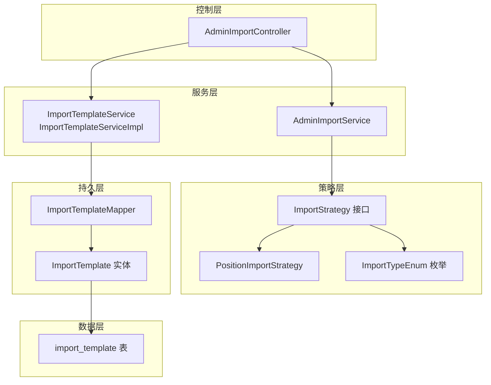
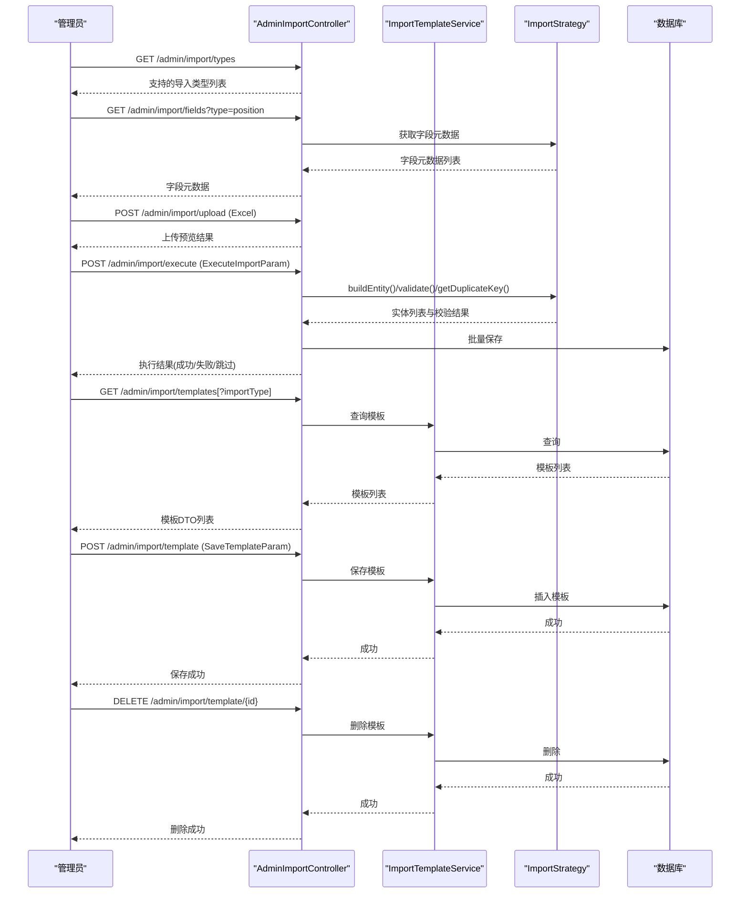
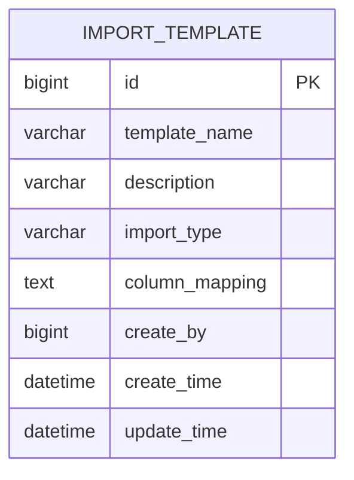
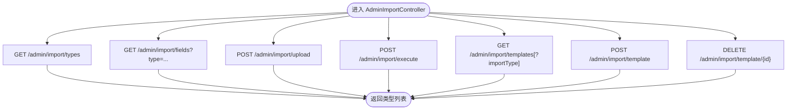
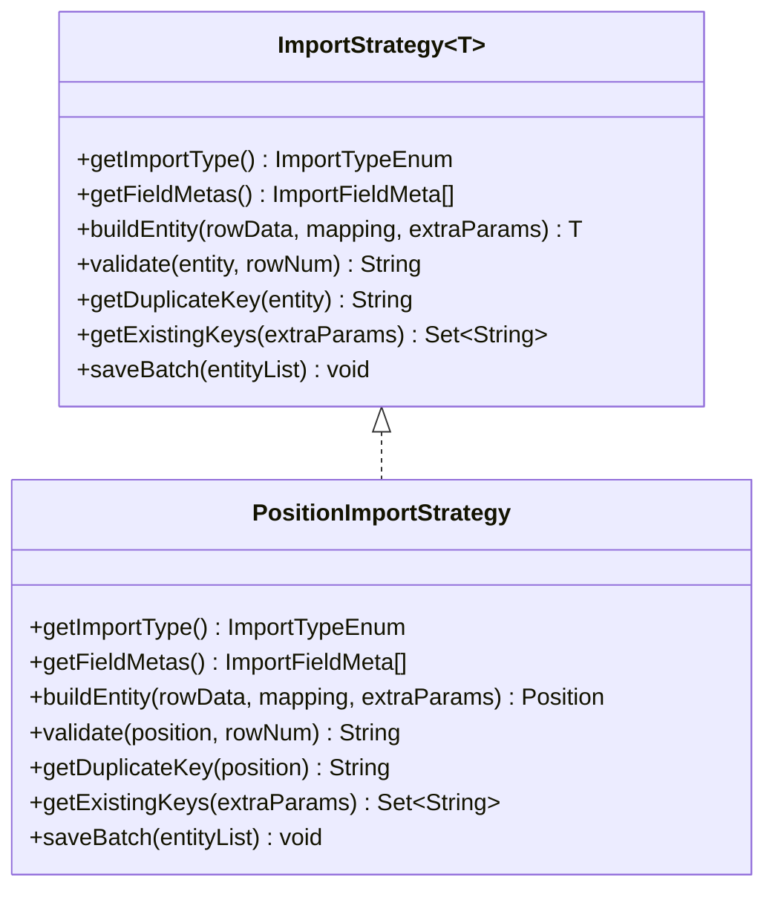
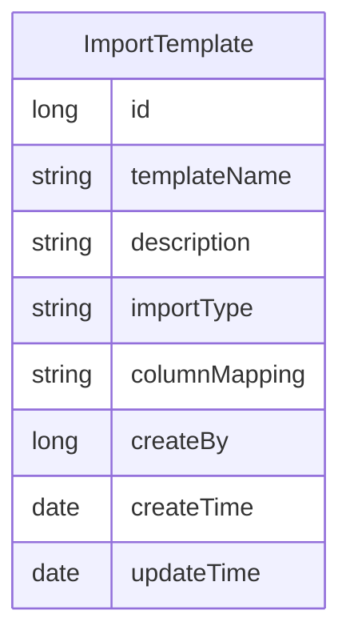
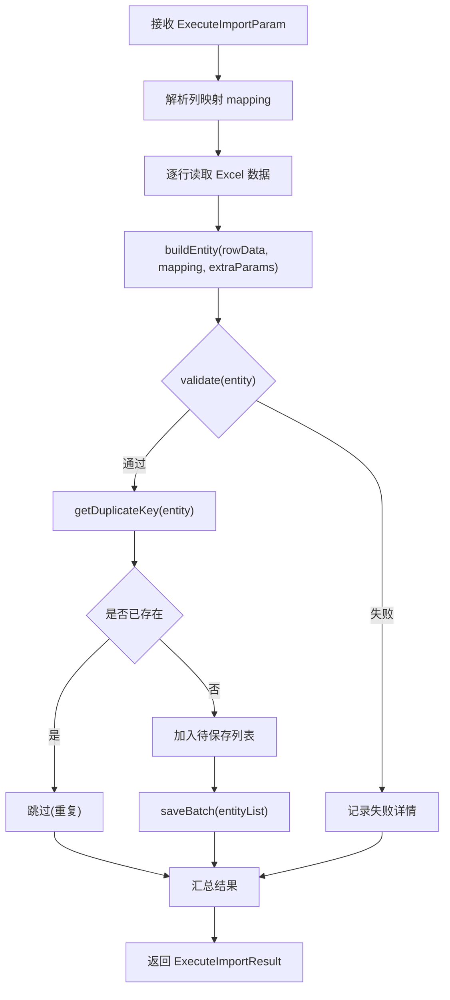
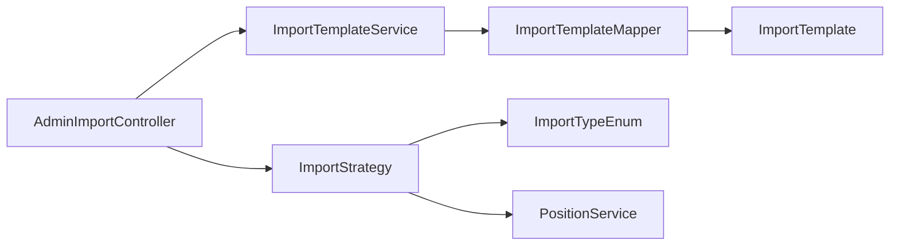

# 导入模板管理

<cite>
**本文引用的文件**
- [ImportTemplate.java](file://src/main/java/com/macro/mall/tiny/modules/ums/model/ImportTemplate.java)
- [ImportTemplateService.java](file://src/main/java/com/macro/mall/tiny/modules/ums/service/ImportTemplateService.java)
- [ImportTemplateServiceImpl.java](file://src/main/java/com/macro/mall/tiny/modules/ums/service/impl/ImportTemplateServiceImpl.java)
- [ImportTemplateMapper.java](file://src/main/java/com/macro/mall/tiny/modules/ums/mapper/ImportTemplateMapper.java)
- [AdminImportController.java](file://src/main/java/com/macro/mall/tiny/modules/ums/controller/AdminImportController.java)
- [SaveTemplateParam.java](file://src/main/java/com/macro/mall/tiny/modules/ums/dto/SaveTemplateParam.java)
- [TemplateDto.java](file://src/main/java/com/macro/mall/tiny/modules/ums/dto/TemplateDto.java)
- [ImportFieldMeta.java](file://src/main/java/com/macro/mall/tiny/modules/ums/dto/ImportFieldMeta.java)
- [ExecuteImportParam.java](file://src/main/java/com/macro/mall/tiny/modules/ums/dto/ExecuteImportParam.java)
- [ExecuteImportResult.java](file://src/main/java/com/macro/mall/tiny/modules/ums/dto/ExecuteImportResult.java)
- [ImportStrategy.java](file://src/main/java/com/macro/mall/tiny/modules/ums/strategy/ImportStrategy.java)
- [ImportTypeEnum.java](file://src/main/java/com/macro/mall/tiny/modules/ums/strategy/ImportTypeEnum.java)
- [PositionImportStrategy.java](file://src/main/java/com/macro/mall/tiny/modules/ums/strategy/PositionImportStrategy.java)
- [import_template.sql](file://sql/import_template.sql)
- [alter_import_template_add_type.sql](file://sql/alter_import_template_add_type.sql)
</cite>

## 目录
1. [简介](#简介)
2. [项目结构](#项目结构)
3. [核心组件](#核心组件)
4. [架构总览](#架构总览)
5. [详细组件分析](#详细组件分析)
6. [依赖分析](#依赖分析)
7. [性能考虑](#性能考虑)
8. [故障排查指南](#故障排查指南)
9. [结论](#结论)
10. [附录](#附录)

## 简介
本文件系统化梳理“导入模板管理”子系统的设计与实现，覆盖模板存储、字段映射、模板管理接口、策略模式扩展、以及模板版本与兼容性管理建议。文档面向管理员与开发者，提供从配置到运维的全栈指南。

## 项目结构
导入模板管理位于 ums 模块，采用典型的分层架构：
- 控制器层：AdminImportController 提供导入类型查询、字段元数据获取、Excel上传预览、执行导入、模板列表、保存与删除等接口。
- DTO 层：封装请求与响应参数，如 SaveTemplateParam、TemplateDto、ExecuteImportParam、ExecuteImportResult、ImportFieldMeta。
- 服务层：ImportTemplateService 及其实现类 ImportTemplateServiceImpl 提供模板 CRUD；AdminImportService 负责导入流程编排。
- 策略层：ImportStrategy 接口及具体实现（如 PositionImportStrategy）定义不同导入类型的字段元数据、实体构建、校验、去重与批量保存。
- 持久层：ImportTemplateMapper 与 MyBatis XML 映射，配合 ImportTemplate 实体完成模板持久化。
- 数据库：import_template 表承载模板元数据，含模板名称、描述、列映射 JSON、导入类型、创建者与时间戳。

**图表来源**
- [AdminImportController.java:1-148](file://src/main/java/com/macro/mall/tiny/modules/ums/controller/AdminImportController.java#L1-L148)
- [ImportTemplateService.java:1-34](file://src/main/java/com/macro/mall/tiny/modules/ums/service/ImportTemplateService.java#L1-L34)
- [ImportTemplateServiceImpl.java:1-47](file://src/main/java/com/macro/mall/tiny/modules/ums/service/impl/ImportTemplateServiceImpl.java#L1-L47)
- [ImportTemplateMapper.java:1-14](file://src/main/java/com/macro/mall/tiny/modules/ums/mapper/ImportTemplateMapper.java#L1-L14)
- [ImportTemplate.java:1-59](file://src/main/java/com/macro/mall/tiny/modules/ums/model/ImportTemplate.java#L1-L59)
- [ImportStrategy.java:1-69](file://src/main/java/com/macro/mall/tiny/modules/ums/strategy/ImportStrategy.java#L1-L69)
- [PositionImportStrategy.java:1-231](file://src/main/java/com/macro/mall/tiny/modules/ums/strategy/PositionImportStrategy.java#L1-L231)
- [ImportTypeEnum.java:1-41](file://src/main/java/com/macro/mall/tiny/modules/ums/strategy/ImportTypeEnum.java#L1-L41)
- [import_template.sql:1-12](file://sql/import_template.sql#L1-L12)

**章节来源**
- [AdminImportController.java:1-148](file://src/main/java/com/macro/mall/tiny/modules/ums/controller/AdminImportController.java#L1-L148)
- [ImportTemplate.java:1-59](file://src/main/java/com/macro/mall/tiny/modules/ums/model/ImportTemplate.java#L1-L59)
- [ImportTemplateService.java:1-34](file://src/main/java/com/macro/mall/tiny/modules/ums/service/ImportTemplateService.java#L1-L34)
- [ImportTemplateServiceImpl.java:1-47](file://src/main/java/com/macro/mall/tiny/modules/ums/service/impl/ImportTemplateServiceImpl.java#L1-L47)
- [ImportTemplateMapper.java:1-14](file://src/main/java/com/macro/mall/tiny/modules/ums/mapper/ImportTemplateMapper.java#L1-L14)
- [import_template.sql:1-12](file://sql/import_template.sql#L1-L12)

## 核心组件
- ImportTemplate 实体：承载模板元数据，包括模板名称、描述、导入类型、列映射 JSON、创建者与时间戳。
- ImportTemplateService/Impl：提供模板列表、按类型筛选、按名称查询、保存模板（填充创建者、时间）等能力。
- AdminImportController：对外暴露导入模板管理与执行接口，包括导入类型、字段元数据、上传预览、执行导入、模板列表、保存与删除。
- ImportStrategy/PositionImportStrategy：策略接口定义字段元数据、实体构建、校验、去重键生成、现有键集合与批量保存；PositionImportStrategy 具体实现岗位导入的字段映射、清洗与校验。
- DTO：SaveTemplateParam、TemplateDto、ExecuteImportParam、ExecuteImportResult、ImportFieldMeta 用于前后端交互与导入流程编排。
- 数据库：import_template 表定义模板字段，迁移脚本新增导入类型字段并回填默认值。

**章节来源**
- [ImportTemplate.java:1-59](file://src/main/java/com/macro/mall/tiny/modules/ums/model/ImportTemplate.java#L1-L59)
- [ImportTemplateService.java:1-34](file://src/main/java/com/macro/mall/tiny/modules/ums/service/ImportTemplateService.java#L1-L34)
- [ImportTemplateServiceImpl.java:1-47](file://src/main/java/com/macro/mall/tiny/modules/ums/service/impl/ImportTemplateServiceImpl.java#L1-L47)
- [AdminImportController.java:1-148](file://src/main/java/com/macro/mall/tiny/modules/ums/controller/AdminImportController.java#L1-L148)
- [ImportStrategy.java:1-69](file://src/main/java/com/macro/mall/tiny/modules/ums/strategy/ImportStrategy.java#L1-L69)
- [PositionImportStrategy.java:1-231](file://src/main/java/com/macro/mall/tiny/modules/ums/strategy/PositionImportStrategy.java#L1-L231)
- [SaveTemplateParam.java:1-32](file://src/main/java/com/macro/mall/tiny/modules/ums/dto/SaveTemplateParam.java#L1-L32)
- [TemplateDto.java:1-34](file://src/main/java/com/macro/mall/tiny/modules/ums/dto/TemplateDto.java#L1-L34)
- [ExecuteImportParam.java:1-49](file://src/main/java/com/macro/mall/tiny/modules/ums/dto/ExecuteImportParam.java#L1-L49)
- [ExecuteImportResult.java:1-69](file://src/main/java/com/macro/mall/tiny/modules/ums/dto/ExecuteImportResult.java#L1-L69)
- [ImportFieldMeta.java:1-35](file://src/main/java/com/macro/mall/tiny/modules/ums/dto/ImportFieldMeta.java#L1-L35)
- [import_template.sql:1-12](file://sql/import_template.sql#L1-L12)
- [alter_import_template_add_type.sql:1-8](file://sql/alter_import_template_add_type.sql#L1-L8)

## 架构总览
导入模板管理采用“控制器-服务-策略-持久层”的分层设计，结合策略模式实现多导入类型的可扩展。模板数据以 JSON 形式存储列映射，运行时由策略解析并构建目标实体，再进行校验、去重与批量保存。

**图表来源**
- [AdminImportController.java:1-148](file://src/main/java/com/macro/mall/tiny/modules/ums/controller/AdminImportController.java#L1-L148)
- [ImportTemplateService.java:1-34](file://src/main/java/com/macro/mall/tiny/modules/ums/service/ImportTemplateService.java#L1-L34)
- [ImportTemplateServiceImpl.java:1-47](file://src/main/java/com/macro/mall/tiny/modules/ums/service/impl/ImportTemplateServiceImpl.java#L1-L47)
- [ImportStrategy.java:1-69](file://src/main/java/com/macro/mall/tiny/modules/ums/strategy/ImportStrategy.java#L1-L69)
- [PositionImportStrategy.java:1-231](file://src/main/java/com/macro/mall/tiny/modules/ums/strategy/PositionImportStrategy.java#L1-L231)
- [import_template.sql:1-12](file://sql/import_template.sql#L1-L12)

## 详细组件分析

### ImportTemplate 模型设计
- 字段说明
  - id：主键自增
  - templateName：模板名称（非空）
  - description：模板描述（可空）
  - importType：导入类型（如 position、position_stats），迁移脚本新增并回填默认值
  - columnMapping：列映射 JSON，格式为 {"字段名":列索引}，如 {"department":0,"positionName":1}
  - createBy：创建者 ID（保存模板时填充）
  - createTime/updateTime：创建与更新时间（保存模板时填充）
- 设计要点
  - 使用 MyBatis-Plus 注解映射表结构，序列化支持便于 JSON 存储
  - 列映射以 JSON 存储，便于动态扩展字段映射规则
  - 引入 importType 字段，使同一模板表支持多种导入类型

**图表来源**
- [import_template.sql:1-12](file://sql/import_template.sql#L1-L12)
- [ImportTemplate.java:1-59](file://src/main/java/com/macro/mall/tiny/modules/ums/model/ImportTemplate.java#L1-L59)

**章节来源**
- [ImportTemplate.java:1-59](file://src/main/java/com/macro/mall/tiny/modules/ums/model/ImportTemplate.java#L1-L59)
- [import_template.sql:1-12](file://sql/import_template.sql#L1-L12)
- [alter_import_template_add_type.sql:1-8](file://sql/alter_import_template_add_type.sql#L1-L8)

### 模板管理接口实现
- 模板列表查询
  - 支持按导入类型筛选与全局查询，按创建时间倒序
- 模板保存
  - 接收 SaveTemplateParam，填充模板基础字段，调用服务层保存（设置创建者与时间）
- 模板删除
  - 根据模板 ID 删除
- 导入类型与字段元数据
  - 返回支持的导入类型列表
  - 根据导入类型获取字段元数据（必填、标签、描述）

**图表来源**
- [AdminImportController.java:1-148](file://src/main/java/com/macro/mall/tiny/modules/ums/controller/AdminImportController.java#L1-L148)

**章节来源**
- [AdminImportController.java:1-148](file://src/main/java/com/macro/mall/tiny/modules/ums/controller/AdminImportController.java#L1-L148)
- [SaveTemplateParam.java:1-32](file://src/main/java/com/macro/mall/tiny/modules/ums/dto/SaveTemplateParam.java#L1-L32)
- [TemplateDto.java:1-34](file://src/main/java/com/macro/mall/tiny/modules/ums/dto/TemplateDto.java#L1-L34)

### 策略模式与字段映射
- ImportStrategy 定义
  - 字段元数据：每个导入类型提供字段清单（字段名、标签、是否必填、描述）
  - 实体构建：根据 Excel 行数据与列映射构建目标实体
  - 校验：对实体进行业务校验，返回错误信息
  - 去重：生成唯一键，查询现有键集合，跳过重复
  - 批量保存：将实体列表持久化
- PositionImportStrategy 示例
  - 字段元数据：部门、职位名称、专业要求、学历要求、政治面貌、是否限应届、招录人数等
  - 清洗与校验：学历与政治面貌关键词标准化、年份范围校验、人数校验、必填项校验
  - 去重键：年份+部门+职位名称组合
  - 批量保存：委托 PositionService 批量保存

**图表来源**
- [ImportStrategy.java:1-69](file://src/main/java/com/macro/mall/tiny/modules/ums/strategy/ImportStrategy.java#L1-L69)
- [PositionImportStrategy.java:1-231](file://src/main/java/com/macro/mall/tiny/modules/ums/strategy/PositionImportStrategy.java#L1-L231)

**章节来源**
- [ImportStrategy.java:1-69](file://src/main/java/com/macro/mall/tiny/modules/ums/strategy/ImportStrategy.java#L1-L69)
- [PositionImportStrategy.java:1-231](file://src/main/java/com/macro/mall/tiny/modules/ums/strategy/PositionImportStrategy.java#L1-L231)
- [ImportFieldMeta.java:1-35](file://src/main/java/com/macro/mall/tiny/modules/ums/dto/ImportFieldMeta.java#L1-L35)

### 持久层与数据模型
- Mapper：ImportTemplateMapper 继承 MyBatis-Plus BaseMapper，提供通用 CRUD
- 实体：ImportTemplate 对应 import_template 表，包含模板元数据与列映射
- 迁移：alter_import_template_add_type.sql 新增 import_type 字段并回填默认值

**图表来源**
- [ImportTemplate.java:1-59](file://src/main/java/com/macro/mall/tiny/modules/ums/model/ImportTemplate.java#L1-L59)
- [ImportTemplateMapper.java:1-14](file://src/main/java/com/macro/mall/tiny/modules/ums/mapper/ImportTemplateMapper.java#L1-L14)
- [import_template.sql:1-12](file://sql/import_template.sql#L1-L12)
- [alter_import_template_add_type.sql:1-8](file://sql/alter_import_template_add_type.sql#L1-L8)

**章节来源**
- [ImportTemplateMapper.java:1-14](file://src/main/java/com/macro/mall/tiny/modules/ums/mapper/ImportTemplateMapper.java#L1-L14)
- [ImportTemplate.java:1-59](file://src/main/java/com/macro/mall/tiny/modules/ums/model/ImportTemplate.java#L1-L59)
- [import_template.sql:1-12](file://sql/import_template.sql#L1-L12)
- [alter_import_template_add_type.sql:1-8](file://sql/alter_import_template_add_type.sql#L1-L8)

### 导入执行流程
- 参数 ExecuteImportParam 包含导入类型、会话 ID、列映射（字段名→列索引）、年份、是否保存为模板、模板名称
- 执行流程
  - 解析 Excel 行数据
  - 应用列映射构建实体
  - 调用策略进行校验与去重
  - 批量保存并统计结果
  - 可选：将本次映射保存为模板

**图表来源**
- [ExecuteImportParam.java:1-49](file://src/main/java/com/macro/mall/tiny/modules/ums/dto/ExecuteImportParam.java#L1-L49)
- [ExecuteImportResult.java:1-69](file://src/main/java/com/macro/mall/tiny/modules/ums/dto/ExecuteImportResult.java#L1-L69)
- [ImportStrategy.java:1-69](file://src/main/java/com/macro/mall/tiny/modules/ums/strategy/ImportStrategy.java#L1-L69)
- [PositionImportStrategy.java:1-231](file://src/main/java/com/macro/mall/tiny/modules/ums/strategy/PositionImportStrategy.java#L1-L231)

**章节来源**
- [ExecuteImportParam.java:1-49](file://src/main/java/com/macro/mall/tiny/modules/ums/dto/ExecuteImportParam.java#L1-L49)
- [ExecuteImportResult.java:1-69](file://src/main/java/com/macro/mall/tiny/modules/ums/dto/ExecuteImportResult.java#L1-L69)
- [ImportStrategy.java:1-69](file://src/main/java/com/macro/mall/tiny/modules/ums/strategy/ImportStrategy.java#L1-L69)
- [PositionImportStrategy.java:1-231](file://src/main/java/com/macro/mall/tiny/modules/ums/strategy/PositionImportStrategy.java#L1-L231)

## 依赖分析
- 控制器依赖服务与策略，策略依赖服务层进行数据访问与批量保存
- 模板服务依赖 Mapper 与实体，持久化模板数据
- DTO 作为接口契约，贯穿导入流程各环节

**图表来源**
- [AdminImportController.java:1-148](file://src/main/java/com/macro/mall/tiny/modules/ums/controller/AdminImportController.java#L1-L148)
- [ImportTemplateService.java:1-34](file://src/main/java/com/macro/mall/tiny/modules/ums/service/ImportTemplateService.java#L1-L34)
- [ImportTemplateServiceImpl.java:1-47](file://src/main/java/com/macro/mall/tiny/modules/ums/service/impl/ImportTemplateServiceImpl.java#L1-L47)
- [ImportTemplateMapper.java:1-14](file://src/main/java/com/macro/mall/tiny/modules/ums/mapper/ImportTemplateMapper.java#L1-L14)
- [ImportTemplate.java:1-59](file://src/main/java/com/macro/mall/tiny/modules/ums/model/ImportTemplate.java#L1-L59)
- [ImportStrategy.java:1-69](file://src/main/java/com/macro/mall/tiny/modules/ums/strategy/ImportStrategy.java#L1-L69)
- [ImportTypeEnum.java:1-41](file://src/main/java/com/macro/mall/tiny/modules/ums/strategy/ImportTypeEnum.java#L1-L41)
- [PositionImportStrategy.java:1-231](file://src/main/java/com/macro/mall/tiny/modules/ums/strategy/PositionImportStrategy.java#L1-L231)

**章节来源**
- [AdminImportController.java:1-148](file://src/main/java/com/macro/mall/tiny/modules/ums/controller/AdminImportController.java#L1-L148)
- [ImportTemplateService.java:1-34](file://src/main/java/com/macro/mall/tiny/modules/ums/service/ImportTemplateService.java#L1-L34)
- [ImportTemplateServiceImpl.java:1-47](file://src/main/java/com/macro/mall/tiny/modules/ums/service/impl/ImportTemplateServiceImpl.java#L1-L47)
- [ImportTemplateMapper.java:1-14](file://src/main/java/com/macro/mall/tiny/modules/ums/mapper/ImportTemplateMapper.java#L1-L14)
- [ImportTemplate.java:1-59](file://src/main/java/com/macro/mall/tiny/modules/ums/model/ImportTemplate.java#L1-L59)
- [ImportStrategy.java:1-69](file://src/main/java/com/macro/mall/tiny/modules/ums/strategy/ImportStrategy.java#L1-L69)
- [ImportTypeEnum.java:1-41](file://src/main/java/com/macro/mall/tiny/modules/ums/strategy/ImportTypeEnum.java#L1-L41)
- [PositionImportStrategy.java:1-231](file://src/main/java/com/macro/mall/tiny/modules/ums/strategy/PositionImportStrategy.java#L1-L231)

## 性能考虑
- 批量导入
  - 使用策略的 saveBatch 批量写入，减少事务开销
  - 去重键集合一次性加载，避免逐条查询
- 列映射解析
  - mapping 为 JSON 字符串，解析成本低；建议在服务层缓存常用模板映射
- 分页与排序
  - 模板列表按创建时间倒序，便于发现最新模板；如数据量大可引入分页
- 文件上传
  - 限制文件类型与大小，避免内存溢出；建议异步处理与进度反馈

## 故障排查指南
- 模板保存失败
  - 检查模板名称是否重复（若后端增加唯一约束）
  - 确认 columnMapping JSON 结构合法
- 导入执行失败
  - 查看 ExecuteImportResult 中失败详情，定位具体行与原因
  - 校验字段元数据与列映射是否匹配
- 去重导致大量跳过
  - 检查 getDuplicateKey 生成规则与现有数据唯一键集合
- 权限问题
  - 确认用户具备“导入模板管理”“Excel导入执行”权限

**章节来源**
- [ExecuteImportResult.java:1-69](file://src/main/java/com/macro/mall/tiny/modules/ums/dto/ExecuteImportResult.java#L1-L69)
- [PositionImportStrategy.java:1-231](file://src/main/java/com/macro/mall/tiny/modules/ums/strategy/PositionImportStrategy.java#L1-L231)
- [AdminImportController.java:1-148](file://src/main/java/com/macro/mall/tiny/modules/ums/controller/AdminImportController.java#L1-L148)

## 结论
导入模板管理通过“策略+模板”的方式实现了多类型导入的可扩展与可复用。模板以 JSON 存储列映射，策略负责字段语义与业务校验，形成清晰的职责边界。建议在生产环境中完善模板版本与兼容性管理、增强导入进度与错误可视化，并持续优化批量导入性能。

## 附录

### 模板配置指南
- 字段映射规则
  - 字段名需与策略提供的 ImportFieldMeta.fieldName 一致
  - 列索引从 0 开始，确保与 Excel 表头对应
- 验证规则
  - 必填字段必须在策略中声明 required=true
  - 数值字段建议提供默认值（如招录人数默认 1）
- 默认值设置
  - 在 buildEntity 中为缺失字段设置合理默认值
- 模板命名规范
  - 建议使用“业务域_版本_日期”命名，便于追踪与归档
- 数据质量保证
  - 导入前进行字段元数据校验与样例预览
  - 对异常数据进行标记与导出，避免污染主数据

### 模板版本管理与兼容性
- 版本标识
  - 建议在模板名称中加入版本号，或新增 version 字段
- 兼容性处理
  - 当 Excel 列顺序变化时，仍可通过字段名映射解析
  - 对于策略字段变更，提供向后兼容的解析逻辑
- 历史版本管理
  - 保留历史模板快照，必要时支持回滚
  - 记录模板变更日志（修改人、时间、变更摘要）

### 最佳实践
- 标准化
  - 统一字段命名与枚举值，减少解析歧义
- 字段命名规范
  - 使用英文小写加下划线，避免特殊字符
- 数据质量
  - 导入前清洗与脱敏，严格校验必填与范围
- 安全与权限
  - 限制导入模板管理与执行权限，审计操作日志
- 可观测性
  - 导入过程记录成功/失败/跳过数量与失败明细，便于问题定位