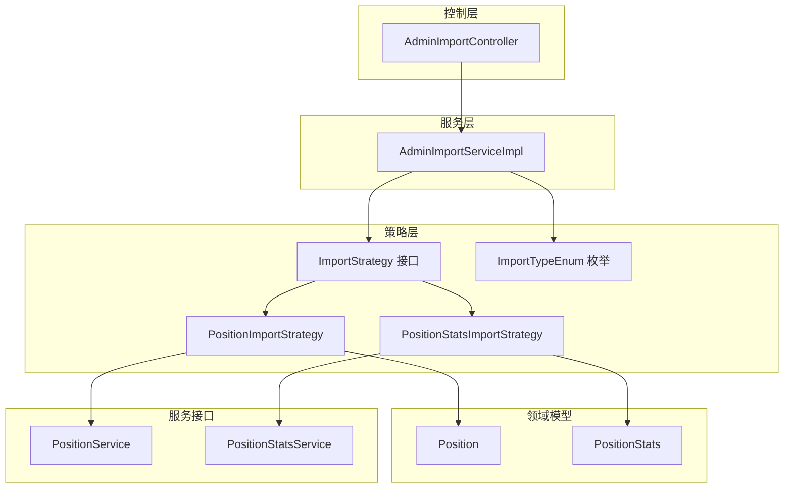
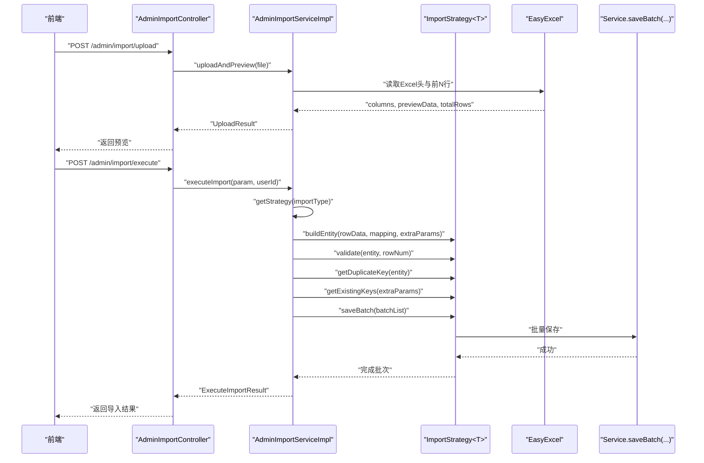
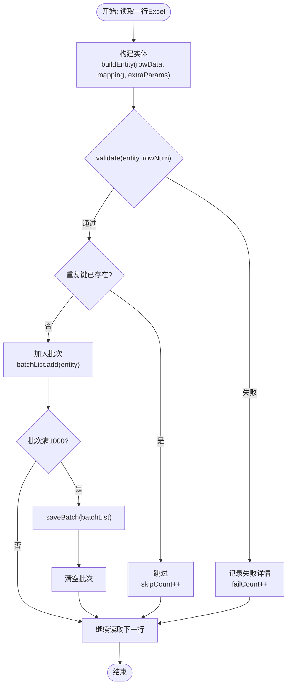
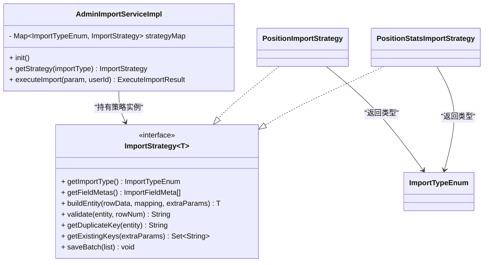
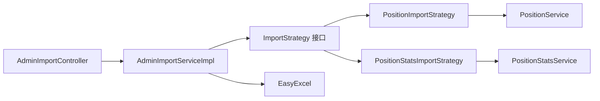

# 导入策略模式

<cite>
**本文引用的文件**
- [ImportStrategy.java](file://src/main/java/com/macro/mall/tiny/modules/ums/strategy/ImportStrategy.java)
- [ImportTypeEnum.java](file://src/main/java/com/macro/mall/tiny/modules/ums/strategy/ImportTypeEnum.java)
- [PositionImportStrategy.java](file://src/main/java/com/macro/mall/tiny/modules/ums/strategy/PositionImportStrategy.java)
- [PositionStatsImportStrategy.java](file://src/main/java/com/macro/mall/tiny/modules/ums/strategy/PositionStatsImportStrategy.java)
- [AdminImportServiceImpl.java](file://src/main/java/com/macro/mall/tiny/modules/ums/service/impl/AdminImportServiceImpl.java)
- [AdminImportController.java](file://src/main/java/com/macro/mall/tiny/modules/ums/controller/AdminImportController.java)
- [ImportFieldMeta.java](file://src/main/java/com/macro/mall/tiny/modules/ums/dto/ImportFieldMeta.java)
- [ExecuteImportParam.java](file://src/main/java/com/macro/mall/tiny/modules/ums/dto/ExecuteImportParam.java)
- [Position.java](file://src/main/java/com/macro/mall/tiny/modules/ums/model/Position.java)
- [PositionStats.java](file://src/main/java/com/macro/mall/tiny/modules/ums/model/PositionStats.java)
- [PositionService.java](file://src/main/java/com/macro/mall/tiny/modules/ums/service/PositionService.java)
- [PositionStatsService.java](file://src/main/java/com/macro/mall/tiny/modules/ums/service/PositionStatsService.java)
- [PositionExcelListener.java](file://src/main/java/com/macro/mall/tiny/modules/ums/listener/PositionExcelListener.java)
</cite>

## 目录
1. [简介](#简介)
2. [项目结构](#项目结构)
3. [核心组件](#核心组件)
4. [架构总览](#架构总览)
5. [详细组件分析](#详细组件分析)
6. [依赖分析](#依赖分析)
7. [性能考虑](#性能考虑)
8. [故障排查指南](#故障排查指南)
9. [结论](#结论)
10. [附录：策略扩展指南](#附录策略扩展指南)

## 简介
本文件系统性阐述Excel导入系统中的策略模式应用，围绕ImportStrategy接口设计、ImportTypeEnum枚举、具体策略实现类（PositionImportStrategy与PositionStatsImportStrategy）展开，深入分析字段映射、数据转换、业务验证、批量处理等核心逻辑；同时说明策略选择机制与扩展方式，总结策略模式在代码复用、易于扩展、符合开闭原则等方面的优势，为开发者提供最佳实践与扩展指导。

## 项目结构
导入模块采用“接口 + 多实现 + 上层调度”的分层组织：
- strategy包：策略接口与具体策略实现
- service.impl：导入服务实现，负责策略发现、调度与批量处理
- controller：对外暴露导入接口，供前端调用
- dto/model：导入参数、字段元数据、领域模型
- listener：历史版本的监听器实现（兼容旧流程）

图表来源
- [AdminImportController.java:31-148](file://src/main/java/com/macro/mall/tiny/modules/ums/controller/AdminImportController.java#L31-L148)
- [AdminImportServiceImpl.java:37-332](file://src/main/java/com/macro/mall/tiny/modules/ums/service/impl/AdminImportServiceImpl.java#L37-L332)
- [ImportStrategy.java:15-68](file://src/main/java/com/macro/mall/tiny/modules/ums/strategy/ImportStrategy.java#L15-L68)
- [ImportTypeEnum.java:9-40](file://src/main/java/com/macro/mall/tiny/modules/ums/strategy/ImportTypeEnum.java#L9-L40)
- [PositionImportStrategy.java:15-231](file://src/main/java/com/macro/mall/tiny/modules/ums/strategy/PositionImportStrategy.java#L15-L231)
- [PositionStatsImportStrategy.java:17-152](file://src/main/java/com/macro/mall/tiny/modules/ums/strategy/PositionStatsImportStrategy.java#L17-L152)
- [Position.java:23-67](file://src/main/java/com/macro/mall/tiny/modules/ums/model/Position.java#L23-L67)
- [PositionStats.java:26-58](file://src/main/java/com/macro/mall/tiny/modules/ums/model/PositionStats.java#L26-L58)
- [PositionService.java:20-46](file://src/main/java/com/macro/mall/tiny/modules/ums/service/PositionService.java#L20-L46)
- [PositionStatsService.java:14-16](file://src/main/java/com/macro/mall/tiny/modules/ums/service/PositionStatsService.java#L14-L16)

章节来源
- [AdminImportController.java:31-148](file://src/main/java/com/macro/mall/tiny/modules/ums/controller/AdminImportController.java#L31-L148)
- [AdminImportServiceImpl.java:37-332](file://src/main/java/com/macro/mall/tiny/modules/ums/service/impl/AdminImportServiceImpl.java#L37-L332)

## 核心组件
- ImportStrategy<T>：导入策略接口，定义统一的构建实体、校验、去重、获取字段元数据、批量保存等能力，泛型约束实体类型T。
- ImportTypeEnum：导入类型枚举，包含POSITION与POSITION_STATS两种类型，提供code/label与反序列化支持。
- 具体策略实现：
  - PositionImportStrategy：岗位信息导入策略，负责字段映射、数据清洗与标准化、业务规则校验、唯一键生成与去重、批量保存。
  - PositionStatsImportStrategy：报录比数据导入策略，独立于岗位表，负责字段映射、数值转换、范围校验、唯一键与去重、批量保存。
- AdminImportServiceImpl：策略发现与调度者，负责初始化策略映射、执行导入流程、批量读取Excel、错误统计与模板保存。
- DTO与模型：ImportFieldMeta描述字段元数据；ExecuteImportParam描述导入参数；Position/PositionStats为对应实体模型。
- 控制器：AdminImportController提供导入类型查询、字段元数据获取、上传预览、执行导入、模板管理等接口。

章节来源
- [ImportStrategy.java:15-68](file://src/main/java/com/macro/mall/tiny/modules/ums/strategy/ImportStrategy.java#L15-L68)
- [ImportTypeEnum.java:9-40](file://src/main/java/com/macro/mall/tiny/modules/ums/strategy/ImportTypeEnum.java#L9-L40)
- [PositionImportStrategy.java:15-231](file://src/main/java/com/macro/mall/tiny/modules/ums/strategy/PositionImportStrategy.java#L15-L231)
- [PositionStatsImportStrategy.java:17-152](file://src/main/java/com/macro/mall/tiny/modules/ums/strategy/PositionStatsImportStrategy.java#L17-L152)
- [AdminImportServiceImpl.java:37-332](file://src/main/java/com/macro/mall/tiny/modules/ums/service/impl/AdminImportServiceImpl.java#L37-L332)
- [ImportFieldMeta.java:10-34](file://src/main/java/com/macro/mall/tiny/modules/ums/dto/ImportFieldMeta.java#L10-L34)
- [ExecuteImportParam.java:12-48](file://src/main/java/com/macro/mall/tiny/modules/ums/dto/ExecuteImportParam.java#L12-L48)
- [Position.java:23-67](file://src/main/java/com/macro/mall/tiny/modules/ums/model/Position.java#L23-L67)
- [PositionStats.java:26-58](file://src/main/java/com/macro/mall/tiny/modules/ums/model/PositionStats.java#L26-L58)

## 架构总览
策略模式在导入系统中的作用：
- 解耦：上层仅依赖ImportStrategy接口，不关心具体实现细节。
- 可扩展：新增导入类型只需实现ImportStrategy并由Spring自动注册。
- 可维护：各策略职责单一，便于测试与演进。

图表来源
- [AdminImportController.java:43-93](file://src/main/java/com/macro/mall/tiny/modules/ums/controller/AdminImportController.java#L43-L93)
- [AdminImportServiceImpl.java:99-257](file://src/main/java/com/macro/mall/tiny/modules/ums/service/impl/AdminImportServiceImpl.java#L99-L257)
- [PositionImportStrategy.java:84-186](file://src/main/java/com/macro/mall/tiny/modules/ums/strategy/PositionImportStrategy.java#L84-L186)
- [PositionStatsImportStrategy.java:40-132](file://src/main/java/com/macro/mall/tiny/modules/ums/strategy/PositionStatsImportStrategy.java#L40-L132)

## 详细组件分析

### ImportStrategy接口设计
- 关键方法族：
  - getImportType：返回策略对应的导入类型
  - getFieldMetas：返回字段元数据列表，用于前端列映射下拉框
  - buildEntity：根据Excel行数据与列映射构建实体
  - validate：对实体进行业务校验，返回null表示通过
  - getDuplicateKey：生成唯一键，用于去重
  - getExistingKeys：获取现有数据的唯一键集合
  - saveBatch：批量保存实体
- 设计要点：
  - 统一抽象，屏蔽不同导入类型的差异
  - 明确职责边界，避免在接口中混入IO或框架细节
  - 通过extraParams传递上下文参数（如year），增强策略灵活性

章节来源
- [ImportStrategy.java:15-68](file://src/main/java/com/macro/mall/tiny/modules/ums/strategy/ImportStrategy.java#L15-L68)

### ImportTypeEnum枚举定义
- 定义了POSITION与POSITION_STATS两种导入类型，提供code/label与@JsonCreator反序列化支持
- 作为策略选择的关键标识，贯穿于控制器、服务与策略实现

章节来源
- [ImportTypeEnum.java:9-40](file://src/main/java/com/macro/mall/tiny/modules/ums/strategy/ImportTypeEnum.java#L9-L40)

### PositionImportStrategy实现分析
- 字段映射与数据转换：
  - 通过mapping将Excel列索引映射到实体字段，支持department、positionName、majorRequired、educationRequired、politicalStatusRequired、isFreshOnly、recruitmentNumber
  - 对educationRequired与politicalStatusRequired进行关键词匹配与标准化
  - 对recruitmentNumber进行数字解析与默认值处理
  - 年份year从extraParams传入，确保与岗位唯一键一致
- 业务验证：
  - 必填项校验（部门、职位名称、年份范围）
  - 学历与政治面貌的有效值校验
  - 招录人数必须大于0
- 去重与唯一键：
  - 唯一键组合为year||department||positionName
  - 通过existingKeys与sessionKeys双重去重
- 批量处理：
  - 每批1000条写入，减少内存压力
  - 保存后清空批次并累加成功计数

图表来源
- [PositionImportStrategy.java:84-186](file://src/main/java/com/macro/mall/tiny/modules/ums/strategy/PositionImportStrategy.java#L84-L186)
- [AdminImportServiceImpl.java:204-246](file://src/main/java/com/macro/mall/tiny/modules/ums/service/impl/AdminImportServiceImpl.java#L204-L246)

章节来源
- [PositionImportStrategy.java:15-231](file://src/main/java/com/macro/mall/tiny/modules/ums/strategy/PositionImportStrategy.java#L15-L231)
- [Position.java:23-67](file://src/main/java/com/macro/mall/tiny/modules/ums/model/Position.java#L23-L67)
- [PositionService.java:20-46](file://src/main/java/com/macro/mall/tiny/modules/ums/service/PositionService.java#L20-L46)

### PositionStatsImportStrategy实现分析
- 字段映射与数据转换：
  - 年份year从extraParams传入
  - 直接读取department、positionName、registrationCount、minEntryScore、maxEntryScore
  - 数值字段使用BigDecimal与Integer解析，异常时忽略
- 业务验证：
  - 必填项校验（部门、职位名称、年份范围）
  - 报名人数非负校验
  - minEntryScore与maxEntryScore的大小关系校验
- 去重与唯一键：
  - 唯一键组合为year||department||positionName
  - 通过existingKeys与sessionKeys双重去重
- 批量处理：
  - 同样采用1000条批次写入策略

图表来源
- [PositionStatsImportStrategy.java:40-132](file://src/main/java/com/macro/mall/tiny/modules/ums/strategy/PositionStatsImportStrategy.java#L40-L132)
- [AdminImportServiceImpl.java:204-246](file://src/main/java/com/macro/mall/tiny/modules/ums/service/impl/AdminImportServiceImpl.java#L204-L246)

章节来源
- [PositionStatsImportStrategy.java:17-152](file://src/main/java/com/macro/mall/tiny/modules/ums/strategy/PositionStatsImportStrategy.java#L17-L152)
- [PositionStats.java:26-58](file://src/main/java/com/macro/mall/tiny/modules/ums/model/PositionStats.java#L26-L58)
- [PositionStatsService.java:14-16](file://src/main/java/com/macro/mall/tiny/modules/ums/service/PositionStatsService.java#L14-L16)

### 策略选择机制
- 初始化阶段：
  - AdminImportServiceImpl在容器启动后扫描所有ImportStrategy实现，通过getImportType建立ImportTypeEnum到策略实例的映射
- 运行时选择：
  - 控制器接收导入类型参数，调用getStrategy(importType)获取对应策略
  - 若未找到策略，抛出不支持的导入类型异常
- 兼容性：
  - executeImport默认使用POSITION类型，保证旧接口兼容

图表来源
- [AdminImportServiceImpl.java:61-83](file://src/main/java/com/macro/mall/tiny/modules/ums/service/impl/AdminImportServiceImpl.java#L61-L83)
- [ImportStrategy.java:15-68](file://src/main/java/com/macro/mall/tiny/modules/ums/strategy/ImportStrategy.java#L15-L68)
- [PositionImportStrategy.java:65-68](file://src/main/java/com/macro/mall/tiny/modules/ums/strategy/PositionImportStrategy.java#L65-L68)
- [PositionStatsImportStrategy.java:23-26](file://src/main/java/com/macro/mall/tiny/modules/ums/strategy/PositionStatsImportStrategy.java#L23-L26)
- [ImportTypeEnum.java:9-40](file://src/main/java/com/macro/mall/tiny/modules/ums/strategy/ImportTypeEnum.java#L9-L40)

章节来源
- [AdminImportServiceImpl.java:37-332](file://src/main/java/com/macro/mall/tiny/modules/ums/service/impl/AdminImportServiceImpl.java#L37-L332)
- [AdminImportController.java:43-93](file://src/main/java/com/macro/mall/tiny/modules/ums/controller/AdminImportController.java#L43-L93)

## 依赖分析
- 组件耦合与内聚：
  - 控制器仅依赖AdminImportService接口，内聚度高
  - AdminImportServiceImpl依赖策略接口与EasyExcel，通过ApplicationContext收集策略，降低硬编码耦合
  - 具体策略依赖各自Service接口，职责清晰
- 外部依赖：
  - EasyExcel用于读取Excel
  - Spring容器负责策略实例的生命周期与装配
- 潜在循环依赖：
  - 未见直接循环依赖；策略与服务通过接口解耦

图表来源
- [AdminImportController.java:31-148](file://src/main/java/com/macro/mall/tiny/modules/ums/controller/AdminImportController.java#L31-L148)
- [AdminImportServiceImpl.java:37-332](file://src/main/java/com/macro/mall/tiny/modules/ums/service/impl/AdminImportServiceImpl.java#L37-L332)
- [ImportStrategy.java:15-68](file://src/main/java/com/macro/mall/tiny/modules/ums/strategy/ImportStrategy.java#L15-L68)
- [PositionImportStrategy.java:15-231](file://src/main/java/com/macro/mall/tiny/modules/ums/strategy/PositionImportStrategy.java#L15-L231)
- [PositionStatsImportStrategy.java:17-152](file://src/main/java/com/macro/mall/tiny/modules/ums/strategy/PositionStatsImportStrategy.java#L17-L152)
- [PositionService.java:20-46](file://src/main/java/com/macro/mall/tiny/modules/ums/service/PositionService.java#L20-L46)
- [PositionStatsService.java:14-16](file://src/main/java/com/macro/mall/tiny/modules/ums/service/PositionStatsService.java#L14-L16)

章节来源
- [AdminImportServiceImpl.java:61-83](file://src/main/java/com/macro/mall/tiny/modules/ums/service/impl/AdminImportServiceImpl.java#L61-L83)

## 性能考虑
- 批量处理：
  - 策略实现与服务实现均采用1000条批次写入，平衡吞吐与内存占用
- 去重策略：
  - existingKeys与sessionKeys双层去重，避免重复写入与跨文件重复
- IO与解析：
  - EasyExcel按行读取，避免一次性加载全部数据
- 年份处理：
  - 年份通过extraParams传入，避免字段映射复杂度，提升解析效率

[本节为通用性能建议，不直接分析具体文件]

## 故障排查指南
- 常见错误与定位：
  - 不支持的导入类型：检查ImportTypeEnum是否包含目标类型，确认策略实现是否被Spring扫描
  - 会话过期：executeImport前需先uploadAndPreview，sessionId需在缓存中存在
  - 文件无效：确认临时文件路径与权限，以及文件是否被清理
  - 字段映射错误：核对mapping中列索引是否与Excel列一致
  - 校验失败：查看validate返回的错误信息，逐项修正数据
- 日志与监控：
  - 服务初始化日志输出已注册的策略类型
  - 定时任务清理过期文件，避免磁盘占用

章节来源
- [AdminImportServiceImpl.java:77-83](file://src/main/java/com/macro/mall/tiny/modules/ums/service/impl/AdminImportServiceImpl.java#L77-L83)
- [AdminImportServiceImpl.java:177-185](file://src/main/java/com/macro/mall/tiny/modules/ums/service/impl/AdminImportServiceImpl.java#L177-L185)
- [AdminImportServiceImpl.java:297-311](file://src/main/java/com/macro/mall/tiny/modules/ums/service/impl/AdminImportServiceImpl.java#L297-L311)

## 结论
该导入系统通过策略模式实现了高度解耦与可扩展的架构：上层仅依赖接口，具体策略封装各自的业务规则与数据转换；AdminImportServiceImpl承担调度职责，结合EasyExcel实现高效批量导入；通过字段元数据、去重与批量写入等机制保障导入质量与性能。策略模式在此场景中充分体现了代码复用、易于扩展与符合开闭原则的设计优势。

[本节为总结性内容，不直接分析具体文件]

## 附录：策略扩展指南
- 新增导入类型步骤：
  1) 定义实体模型（如MyNewModel.java）
  2) 实现ImportStrategy<MyNewModel>，覆盖以下方法：
     - getImportType：返回新的ImportTypeEnum常量
     - getFieldMetas：返回字段元数据列表
     - buildEntity：基于mapping与rowData构建实体
     - validate：编写业务校验逻辑
     - getDuplicateKey/getExistingKeys：定义唯一键与现有键集合
     - saveBatch：调用对应Service的批量保存
  3) 在Spring容器中自动注册（无需额外配置）
  4) 控制器与前端可通过/type与/fields接口获取新类型元数据
- 最佳实践：
  - 保持策略纯函数式：尽量避免外部状态依赖
  - 明确异常与错误返回：validate返回明确的错误信息
  - 合理设置批次大小：根据数据规模与内存情况调整
  - 单元测试：为每个策略编写字段映射、校验、去重与批量保存的测试用例
  - 文档化字段含义：ImportFieldMeta的description要清晰易懂

章节来源
- [ImportStrategy.java:15-68](file://src/main/java/com/macro/mall/tiny/modules/ums/strategy/ImportStrategy.java#L15-L68)
- [AdminImportController.java:43-59](file://src/main/java/com/macro/mall/tiny/modules/ums/controller/AdminImportController.java#L43-L59)
- [AdminImportServiceImpl.java:61-72](file://src/main/java/com/macro/mall/tiny/modules/ums/service/impl/AdminImportServiceImpl.java#L61-L72)