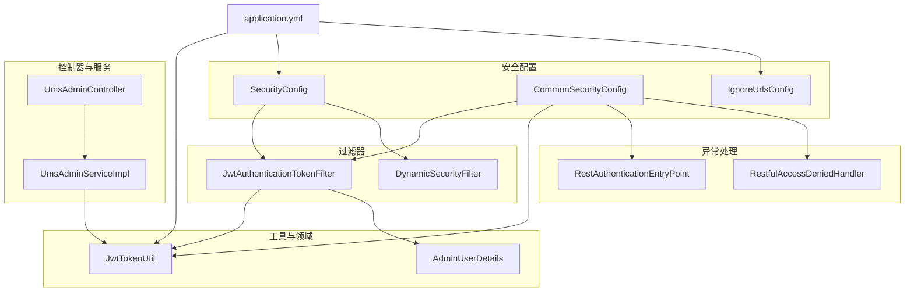
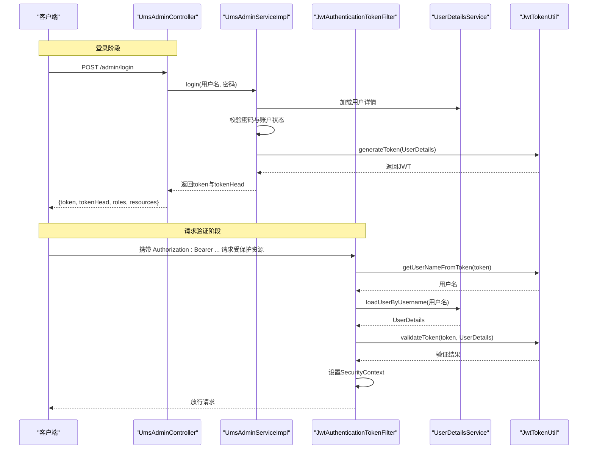
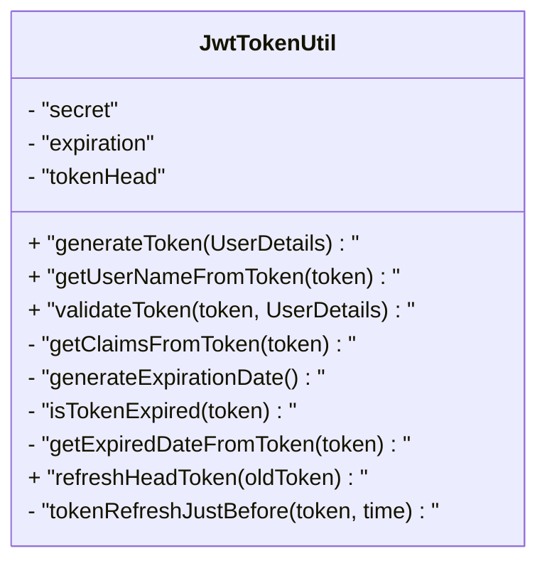
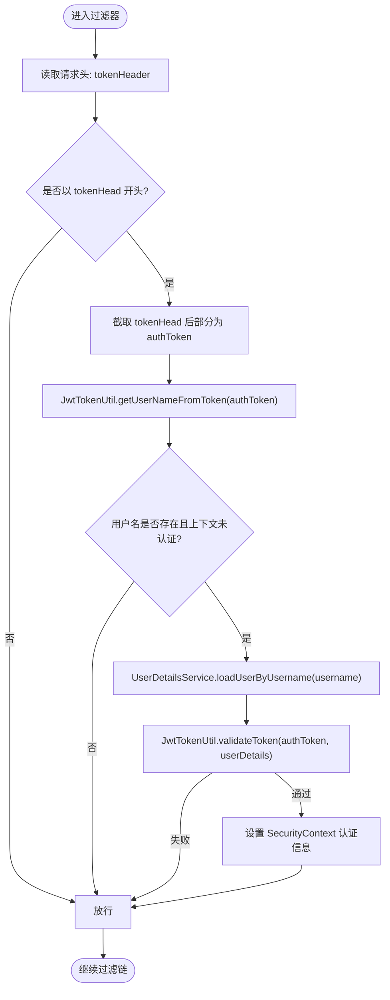
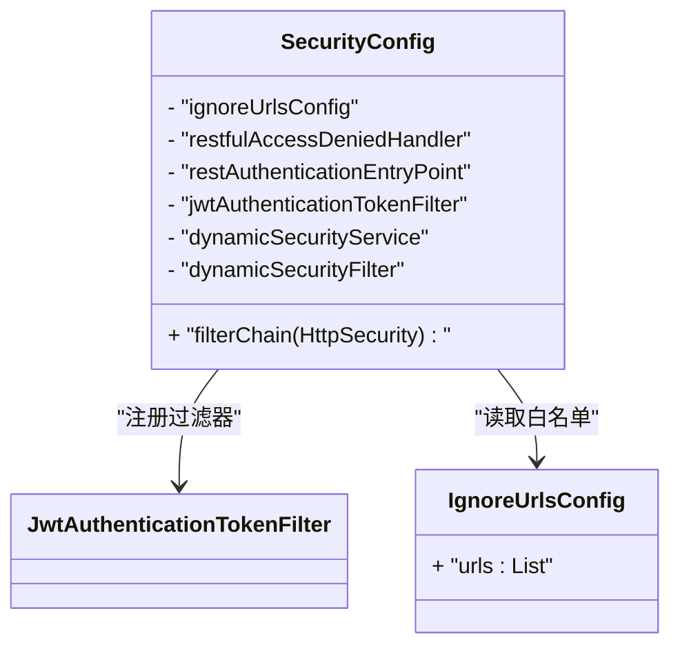
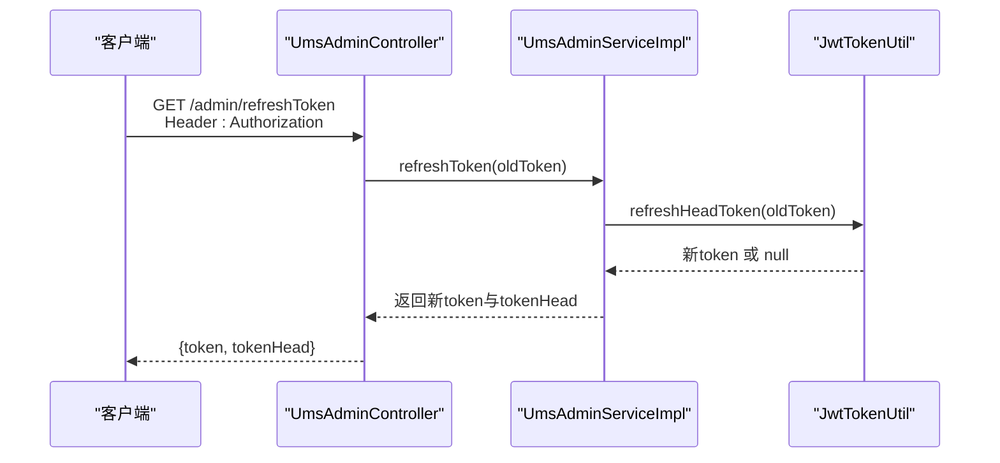
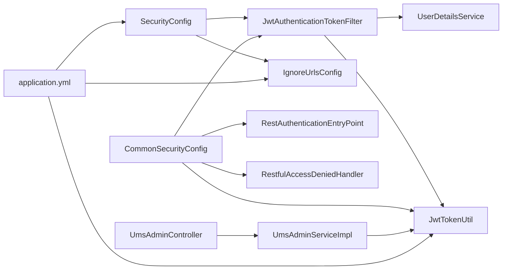

# JWT认证机制

<cite>
**本文引用的文件**
- [JwtAuthenticationTokenFilter.java](file://src/main/java/com/macro/mall/tiny/security/component/JwtAuthenticationTokenFilter.java)
- [JwtTokenUtil.java](file://src/main/java/com/macro/mall/tiny/security/util/JwtTokenUtil.java)
- [SecurityConfig.java](file://src/main/java/com/macro/mall/tiny/security/config/SecurityConfig.java)
- [CommonSecurityConfig.java](file://src/main/java/com/macro/mall/tiny/security/config/CommonSecurityConfig.java)
- [IgnoreUrlsConfig.java](file://src/main/java/com/macro/mall/tiny/security/config/IgnoreUrlsConfig.java)
- [RestAuthenticationEntryPoint.java](file://src/main/java/com/macro/mall/tiny/security/component/RestAuthenticationEntryPoint.java)
- [RestfulAccessDeniedHandler.java](file://src/main/java/com/macro/mall/tiny/security/component/RestfulAccessDeniedHandler.java)
- [UmsAdminController.java](file://src/main/java/com/macro/mall/tiny/modules/ums/controller/UmsAdminController.java)
- [UmsAdminServiceImpl.java](file://src/main/java/com/macro/mall/tiny/modules/ums/service/impl/UmsAdminServiceImpl.java)
- [AdminUserDetails.java](file://src/main/java/com/macro/mall/tiny/domain/AdminUserDetails.java)
- [application.yml](file://src/main/resources/application.yml)
- [DynamicSecurityFilter.java](file://src/main/java/com/macro/mall/tiny/security/component/DynamicSecurityFilter.java)
</cite>

## 目录
1. [简介](#简介)
2. [项目结构](#项目结构)
3. [核心组件](#核心组件)
4. [架构总览](#架构总览)
5. [详细组件分析](#详细组件分析)
6. [依赖关系分析](#依赖关系分析)
7. [性能考量](#性能考量)
8. [故障排查指南](#故障排查指南)
9. [结论](#结论)
10. [附录](#附录)

## 简介
本文件系统性阐述本项目中基于Spring Security的JWT认证机制，覆盖以下要点：
- JWT工作原理与Spring Security集成方式
- 令牌生成算法、签名验证机制、过期时间管理
- JwtAuthenticationTokenFilter过滤器的实现原理（请求头解析、令牌提取、用户身份验证）
- JwtTokenUtil工具类的核心功能（生成、解析、验证、刷新）
- JWT配置参数说明（tokenHeader、tokenHead、secret、expiration等）
- 完整认证流程图与时序图
- 安全最佳实践（密钥管理、令牌存储、跨域处理等）
- 开发者集成指南与常见问题解答

## 项目结构
围绕JWT认证的关键模块分布如下：
- 安全配置层：SecurityConfig、CommonSecurityConfig、IgnoreUrlsConfig
- 过滤器层：JwtAuthenticationTokenFilter、DynamicSecurityFilter
- 工具层：JwtTokenUtil
- 控制器与服务：UmsAdminController、UmsAdminServiceImpl
- 用户详情模型：AdminUserDetails
- 异常处理：RestAuthenticationEntryPoint、RestfulAccessDeniedHandler
- 配置文件：application.yml

图表来源
- [SecurityConfig.java:46-84](file://src/main/java/com/macro/mall/tiny/security/config/SecurityConfig.java#L46-L84)
- [CommonSecurityConfig.java:28-46](file://src/main/java/com/macro/mall/tiny/security/config/CommonSecurityConfig.java#L28-L46)
- [JwtAuthenticationTokenFilter.java:26-58](file://src/main/java/com/macro/mall/tiny/security/component/JwtAuthenticationTokenFilter.java#L26-L58)
- [JwtTokenUtil.java:28-171](file://src/main/java/com/macro/mall/tiny/security/util/JwtTokenUtil.java#L28-L171)
- [UmsAdminController.java:47-350](file://src/main/java/com/macro/mall/tiny/modules/ums/controller/UmsAdminController.java#L47-L350)
- [UmsAdminServiceImpl.java:48-200](file://src/main/java/com/macro/mall/tiny/modules/ums/service/impl/UmsAdminServiceImpl.java#L48-L200)
- [AdminUserDetails.java:17-87](file://src/main/java/com/macro/mall/tiny/domain/AdminUserDetails.java#L17-L87)
- [application.yml:24-57](file://src/main/resources/application.yml#L24-L57)

章节来源
- [SecurityConfig.java:46-84](file://src/main/java/com/macro/mall/tiny/security/config/SecurityConfig.java#L46-L84)
- [CommonSecurityConfig.java:15-62](file://src/main/java/com/macro/mall/tiny/security/config/CommonSecurityConfig.java#L15-L62)
- [application.yml:24-57](file://src/main/resources/application.yml#L24-L57)

## 核心组件
- JwtTokenUtil：负责JWT生成、解析、验证、刷新；使用对称密钥HS512签名，基于配置的secret与expiration。
- JwtAuthenticationTokenFilter：在请求到达受保护资源前，从请求头提取令牌，解析用户名，加载用户详情并完成身份验证。
- SecurityConfig：装配过滤器链，启用无状态会话策略，配置跨域与CSRF关闭。
- CommonSecurityConfig：声明通用Bean（密码编码器、JWT工具、异常处理器、过滤器等）。
- UmsAdminController/UmsAdminServiceImpl：提供登录接口、生成令牌、刷新令牌、获取当前用户信息等业务逻辑。
- AdminUserDetails：实现Spring Security的UserDetails，承载用户权限集合。
- application.yml：集中配置JWT参数（tokenHeader、tokenHead、secret、expiration）与安全白名单。

章节来源
- [JwtTokenUtil.java:28-171](file://src/main/java/com/macro/mall/tiny/security/util/JwtTokenUtil.java#L28-L171)
- [JwtAuthenticationTokenFilter.java:26-58](file://src/main/java/com/macro/mall/tiny/security/component/JwtAuthenticationTokenFilter.java#L26-L58)
- [SecurityConfig.java:46-84](file://src/main/java/com/macro/mall/tiny/security/config/SecurityConfig.java#L46-L84)
- [CommonSecurityConfig.java:18-46](file://src/main/java/com/macro/mall/tiny/security/config/CommonSecurityConfig.java#L18-L46)
- [UmsAdminController.java:166-211](file://src/main/java/com/macro/mall/tiny/modules/ums/controller/UmsAdminController.java#L166-L211)
- [UmsAdminServiceImpl.java:98-151](file://src/main/java/com/macro/mall/tiny/modules/ums/service/impl/UmsAdminServiceImpl.java#L98-L151)
- [AdminUserDetails.java:17-87](file://src/main/java/com/macro/mall/tiny/domain/AdminUserDetails.java#L17-L87)
- [application.yml:24-57](file://src/main/resources/application.yml#L24-L57)

## 架构总览
下图展示了从客户端发起登录请求到服务器颁发JWT，再到后续请求携带令牌进行身份验证的整体流程。

图表来源
- [UmsAdminController.java:166-196](file://src/main/java/com/macro/mall/tiny/modules/ums/controller/UmsAdminController.java#L166-L196)
- [UmsAdminServiceImpl.java:98-119](file://src/main/java/com/macro/mall/tiny/modules/ums/service/impl/UmsAdminServiceImpl.java#L98-L119)
- [JwtAuthenticationTokenFilter.java:37-57](file://src/main/java/com/macro/mall/tiny/security/component/JwtAuthenticationTokenFilter.java#L37-L57)
- [JwtTokenUtil.java:76-96](file://src/main/java/com/macro/mall/tiny/security/util/JwtTokenUtil.java#L76-L96)

## 详细组件分析

### 组件一：JwtTokenUtil（令牌工具）
- 职责
  - 生成令牌：基于UserDetails构建声明（用户名、创建时间），设置过期时间，使用HS512与secret签名。
  - 解析令牌：解析JWT负载，获取用户名与过期时间。
  - 验证令牌：比对用户名与账户未过期。
  - 刷新令牌：在未过期且“刚刷新过”的情况下更新创建时间并重新签发。
- 关键点
  - 使用对称密钥HS512签名，密钥来自配置。
  - 过期时间由配置的expiration（秒）决定。
  - 刷新窗口控制：仅在特定时间窗口内允许刷新，避免滥用。
- 复杂度
  - 生成/解析/验证均为O(1)，整体开销极低。

图表来源
- [JwtTokenUtil.java:28-171](file://src/main/java/com/macro/mall/tiny/security/util/JwtTokenUtil.java#L28-L171)

章节来源
- [JwtTokenUtil.java:28-171](file://src/main/java/com/macro/mall/tiny/security/util/JwtTokenUtil.java#L28-L171)
- [application.yml:24-28](file://src/main/resources/application.yml#L24-L28)

### 组件二：JwtAuthenticationTokenFilter（JWT过滤器）
- 职责
  - 在请求进入受保护资源前执行。
  - 从请求头读取Authorization字段，去除前缀tokenHead后得到原始token。
  - 通过JwtTokenUtil解析用户名，若上下文尚未认证，则加载UserDetails并验证token，最终将认证信息写入SecurityContext。
- 关键点
  - 依赖注入tokenHeader与tokenHead，分别对应请求头名与令牌前缀。
  - 仅在未认证且用户名非空时触发认证流程。
  - 与UserDetailsService配合完成用户加载。

图表来源
- [JwtAuthenticationTokenFilter.java:37-57](file://src/main/java/com/macro/mall/tiny/security/component/JwtAuthenticationTokenFilter.java#L37-L57)
- [JwtTokenUtil.java:76-96](file://src/main/java/com/macro/mall/tiny/security/util/JwtTokenUtil.java#L76-L96)

章节来源
- [JwtAuthenticationTokenFilter.java:26-58](file://src/main/java/com/macro/mall/tiny/security/component/JwtAuthenticationTokenFilter.java#L26-L58)
- [application.yml:24-28](file://src/main/resources/application.yml#L24-L28)

### 组件三：SecurityConfig（安全配置）
- 职责
  - 配置HTTP安全策略：允许白名单路径、OPTIONS预检、关闭CSRF、启用CORS。
  - 无状态会话：SessionCreationPolicy.STATELESS。
  - 注册自定义过滤器：在用户名密码过滤器之前插入JwtAuthenticationTokenFilter。
  - 注册动态权限过滤器（可选）。
  - 注册异常处理器：未登录与权限不足的统一响应。
- 关键点
  - 白名单由IgnoreUrlsConfig提供，配置在application.yml的secure.ignored.urls中。
  - 通过@Bean注入的JwtAuthenticationTokenFilter生效。

图表来源
- [SecurityConfig.java:31-84](file://src/main/java/com/macro/mall/tiny/security/config/SecurityConfig.java#L31-L84)
- [IgnoreUrlsConfig.java:14-21](file://src/main/java/com/macro/mall/tiny/security/config/IgnoreUrlsConfig.java#L14-L21)

章节来源
- [SecurityConfig.java:46-84](file://src/main/java/com/macro/mall/tiny/security/config/SecurityConfig.java#L46-L84)
- [CommonSecurityConfig.java:28-46](file://src/main/java/com/macro/mall/tiny/security/config/CommonSecurityConfig.java#L28-L46)
- [application.yml:38-57](file://src/main/resources/application.yml#L38-L57)

### 组件四：UmsAdminController/UmsAdminServiceImpl（登录与刷新）
- 登录流程
  - 接收用户名与密码，调用UmsAdminServiceImpl.login。
  - 服务层加载UserDetails，校验密码与账户状态，生成JWT并记录登录日志。
  - 控制器返回token与tokenHead，以及角色与资源列表。
- 刷新流程
  - 控制器接收Authorization头，调用UmsAdminServiceImpl.refreshToken。
  - 服务层委托JwtTokenUtil.refreshHeadToken进行刷新。
- 关键点
  - 登录成功后返回token与tokenHead，前端需在后续请求中拼接tokenHead与token作为Authorization值。
  - 刷新仅在未过期且处于刷新窗口内生效。

图表来源
- [UmsAdminController.java:198-211](file://src/main/java/com/macro/mall/tiny/modules/ums/controller/UmsAdminController.java#L198-L211)
- [UmsAdminServiceImpl.java:148-151](file://src/main/java/com/macro/mall/tiny/modules/ums/service/impl/UmsAdminServiceImpl.java#L148-L151)
- [JwtTokenUtil.java:129-153](file://src/main/java/com/macro/mall/tiny/security/util/JwtTokenUtil.java#L129-L153)

章节来源
- [UmsAdminController.java:166-211](file://src/main/java/com/macro/mall/tiny/modules/ums/controller/UmsAdminController.java#L166-L211)
- [UmsAdminServiceImpl.java:98-151](file://src/main/java/com/macro/mall/tiny/modules/ums/service/impl/UmsAdminServiceImpl.java#L98-L151)

### 组件五：AdminUserDetails（用户详情）
- 职责
  - 实现UserDetails，提供权限集合（支持id:name、name、url三种格式）。
  - 控制账户有效性（启用状态）。
- 关键点
  - 权限来源于资源列表，便于与动态权限系统协作。

章节来源
- [AdminUserDetails.java:17-87](file://src/main/java/com/macro/mall/tiny/domain/AdminUserDetails.java#L17-L87)

### 组件六：异常处理与跨域
- 未登录/登录过期：RestAuthenticationEntryPoint统一返回JSON。
- 权限不足：RestfulAccessDeniedHandler统一返回JSON。
- 跨域：SecurityConfig启用CORS；异常处理器在响应头设置跨域相关头。

章节来源
- [RestAuthenticationEntryPoint.java:17-27](file://src/main/java/com/macro/mall/tiny/security/component/RestAuthenticationEntryPoint.java#L17-L27)
- [RestfulAccessDeniedHandler.java:17-29](file://src/main/java/com/macro/mall/tiny/security/component/RestfulAccessDeniedHandler.java#L17-L29)
- [SecurityConfig.java:62-75](file://src/main/java/com/macro/mall/tiny/security/config/SecurityConfig.java#L62-L75)

## 依赖关系分析
- 组件耦合
  - JwtAuthenticationTokenFilter依赖JwtTokenUtil与UserDetailsService。
  - SecurityConfig依赖JwtAuthenticationTokenFilter、IgnoreUrlsConfig、异常处理器。
  - UmsAdminServiceImpl依赖JwtTokenUtil与PasswordEncoder。
  - UmsAdminController依赖UmsAdminServiceImpl。
- 外部依赖
  - JWT库（io.jsonwebtoken）、日期工具（cn.hutool.core.date.DateUtil）、字符串工具（cn.hutool.core.util.StrUtil）。
- 配置依赖
  - application.yml集中提供jwt与secure配置。

图表来源
- [JwtAuthenticationTokenFilter.java:28-35](file://src/main/java/com/macro/mall/tiny/security/component/JwtAuthenticationTokenFilter.java#L28-L35)
- [SecurityConfig.java:34-44](file://src/main/java/com/macro/mall/tiny/security/config/SecurityConfig.java#L34-L44)
- [CommonSecurityConfig.java:28-46](file://src/main/java/com/macro/mall/tiny/security/config/CommonSecurityConfig.java#L28-L46)
- [UmsAdminController.java:53-60](file://src/main/java/com/macro/mall/tiny/modules/ums/controller/UmsAdminController.java#L53-L60)
- [UmsAdminServiceImpl.java:50-53](file://src/main/java/com/macro/mall/tiny/modules/ums/service/impl/UmsAdminServiceImpl.java#L50-L53)
- [application.yml:24-57](file://src/main/resources/application.yml#L24-L57)

章节来源
- [JwtAuthenticationTokenFilter.java:26-58](file://src/main/java/com/macro/mall/tiny/security/component/JwtAuthenticationTokenFilter.java#L26-L58)
- [SecurityConfig.java:46-84](file://src/main/java/com/macro/mall/tiny/security/config/SecurityConfig.java#L46-L84)
- [CommonSecurityConfig.java:18-46](file://src/main/java/com/macro/mall/tiny/security/config/CommonSecurityConfig.java#L18-L46)
- [UmsAdminController.java:47-350](file://src/main/java/com/macro/mall/tiny/modules/ums/controller/UmsAdminController.java#L47-L350)
- [UmsAdminServiceImpl.java:48-200](file://src/main/java/com/macro/mall/tiny/modules/ums/service/impl/UmsAdminServiceImpl.java#L48-L200)
- [application.yml:24-57](file://src/main/resources/application.yml#L24-L57)

## 性能考量
- 令牌生成与验证为O(1)，对称签名计算开销小。
- 过滤器每请求执行一次解析与验证，建议合理设置expiration，避免频繁刷新导致额外开销。
- 使用无状态会话（STATELESS）减少服务器端会话存储压力。
- 白名单路径与OPTIONS预检放行降低无效认证成本。

## 故障排查指南
- 无法登录
  - 检查用户名/密码是否正确，确认账户启用状态。
  - 确认客户端是否按“tokenHead + token”格式设置Authorization头。
- 401未认证
  - 检查请求头是否包含正确的tokenHeader与tokenHead前缀。
  - 核对secret与expiration配置一致性。
  - 查看RestAuthenticationEntryPoint返回的未登录提示。
- 403权限不足
  - 检查用户角色与资源权限映射，确认动态权限过滤器是否正确配置。
  - 参考RestfulAccessDeniedHandler返回的权限不足提示。
- 刷新失败
  - 确认token未过期且处于刷新窗口内。
  - 检查tokenHead前缀是否正确去除。

章节来源
- [JwtAuthenticationTokenFilter.java:41-56](file://src/main/java/com/macro/mall/tiny/security/component/JwtAuthenticationTokenFilter.java#L41-L56)
- [JwtTokenUtil.java:129-153](file://src/main/java/com/macro/mall/tiny/security/util/JwtTokenUtil.java#L129-L153)
- [RestAuthenticationEntryPoint.java:17-27](file://src/main/java/com/macro/mall/tiny/security/component/RestAuthenticationEntryPoint.java#L17-L27)
- [RestfulAccessDeniedHandler.java:17-29](file://src/main/java/com/macro/mall/tiny/security/component/RestfulAccessDeniedHandler.java#L17-L29)

## 结论
本项目采用标准的JWT无状态认证方案，结合Spring Security的过滤器链实现请求级身份验证。通过集中配置与清晰的组件职责划分，实现了登录、令牌生成与验证、动态权限控制与跨域支持。建议在生产环境中强化密钥管理与传输安全，严格限制令牌有效期与刷新窗口，并完善审计与监控。

## 附录

### JWT配置参数说明
- tokenHeader：JWT存储的请求头名称，默认为“Authorization”。
- tokenHead：令牌前缀，默认为“Bearer ”，客户端需在请求头中拼接该前缀与实际token。
- secret：JWT加解密使用的对称密钥。
- expiration：JWT的过期时间（秒），默认为一周。

章节来源
- [application.yml:24-28](file://src/main/resources/application.yml#L24-L28)
- [JwtAuthenticationTokenFilter.java:32-35](file://src/main/java/com/macro/mall/tiny/security/component/JwtAuthenticationTokenFilter.java#L32-L35)
- [JwtTokenUtil.java:32-37](file://src/main/java/com/macro/mall/tiny/security/util/JwtTokenUtil.java#L32-L37)

### 安全最佳实践
- 密钥管理
  - 将secret置于安全的环境变量或配置中心，避免硬编码在代码或版本库中。
  - 定期轮换secret，并在切换期间支持双key验证与平滑过渡。
- 令牌存储
  - 前端建议存储在内存或安全的HttpOnly Cookie中，避免localStorage被XSS窃取。
  - 对于移动端，遵循平台的安全存储规范。
- 传输安全
  - 仅在HTTPS环境下传输Authorization头，防止中间人攻击。
- 令牌策略
  - 短有效期+刷新令牌窗口：降低泄露风险与扩大影响面。
  - 服务端记录登录日志与异常事件，便于审计与追踪。
- 跨域处理
  - 明确允许的源、方法与头，避免使用通配符。
  - 统一异常处理器返回标准化JSON，便于前端处理。