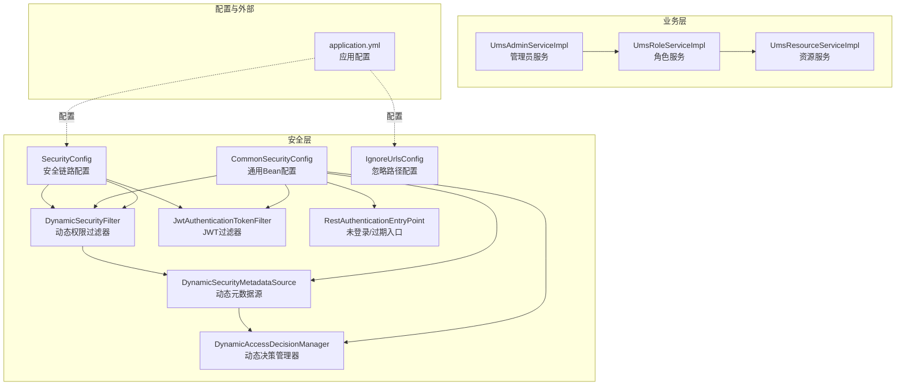
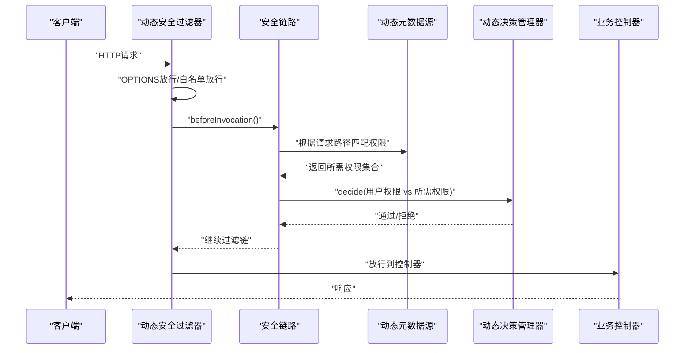
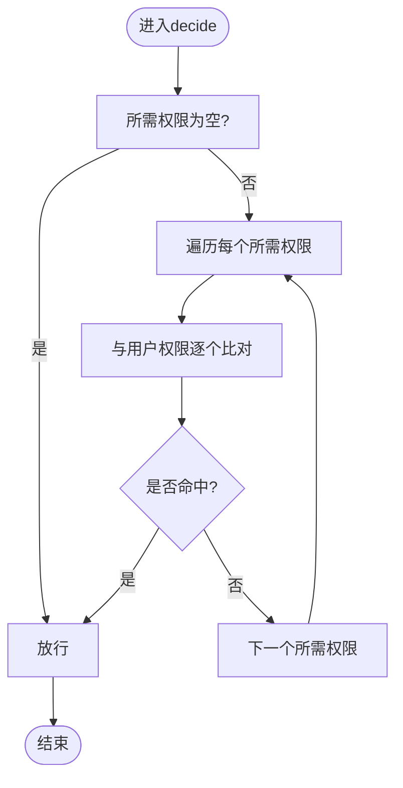
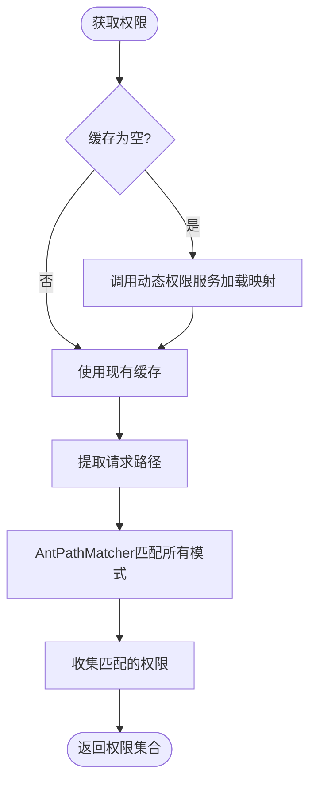
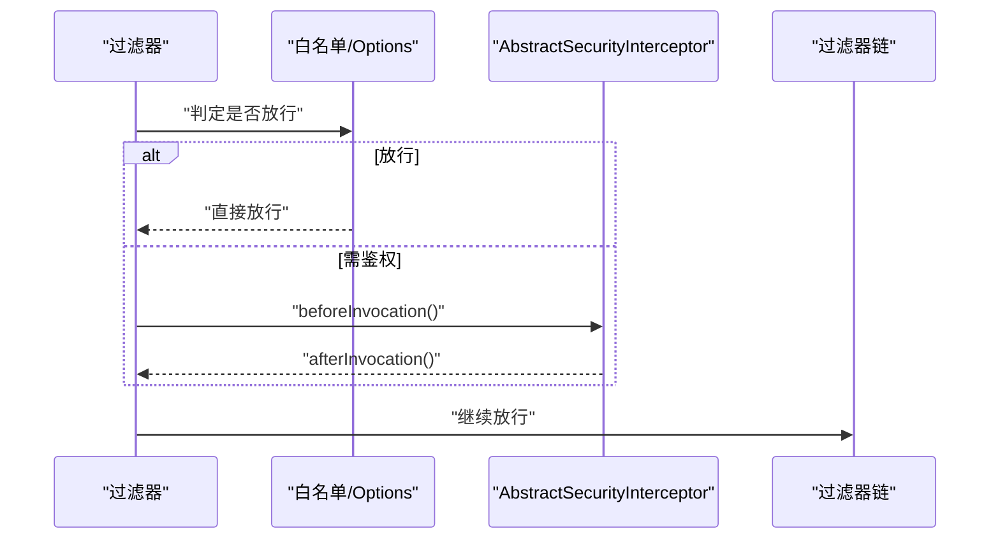
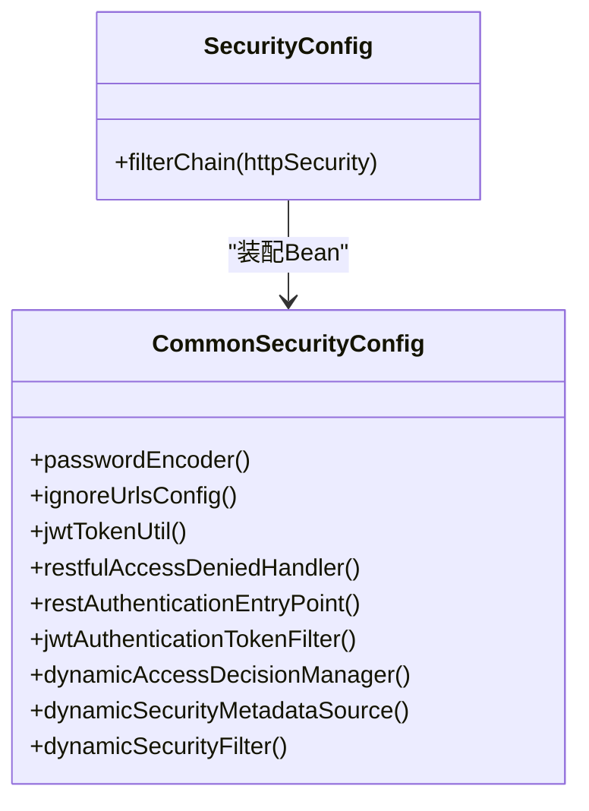
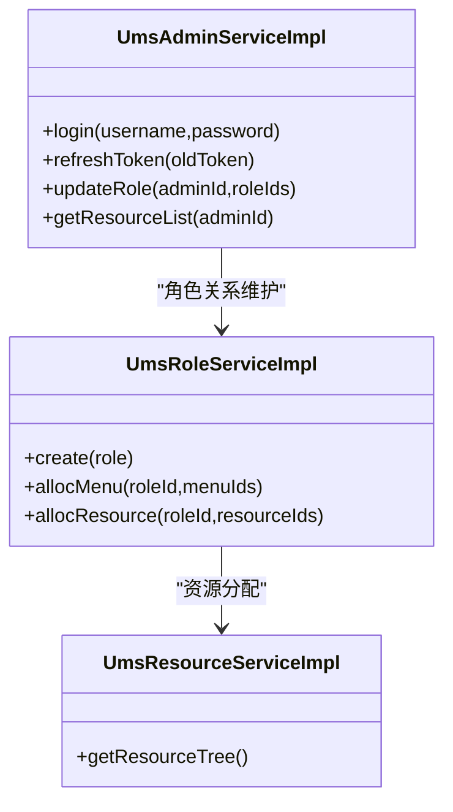
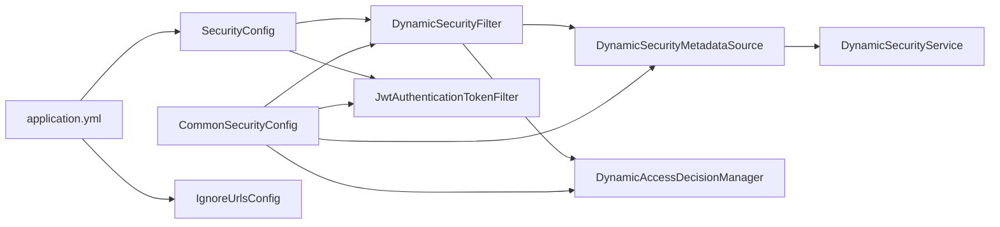
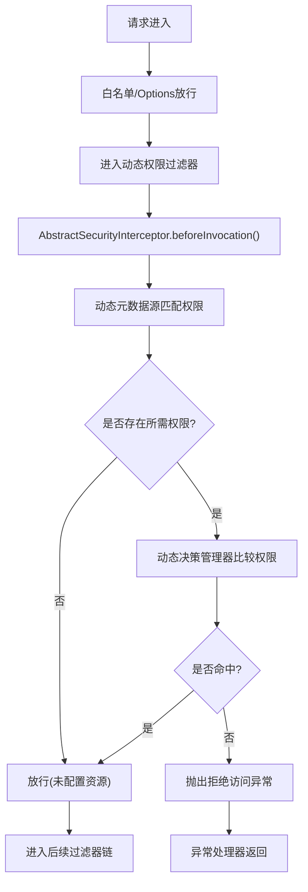

# 动态权限控制系统

<cite>
**本文引用的文件**
- [DynamicAccessDecisionManager.java](file://src/main/java/com/macro/mall/tiny/security/component/DynamicAccessDecisionManager.java)
- [DynamicSecurityMetadataSource.java](file://src/main/java/com/macro/mall/tiny/security/component/DynamicSecurityMetadataSource.java)
- [DynamicSecurityFilter.java](file://src/main/java/com/macro/mall/tiny/security/component/DynamicSecurityFilter.java)
- [DynamicSecurityService.java](file://src/main/java/com/macro/mall/tiny/security/component/DynamicSecurityService.java)
- [SecurityConfig.java](file://src/main/java/com/macro/mall/tiny/security/config/SecurityConfig.java)
- [CommonSecurityConfig.java](file://src/main/java/com/macro/mall/tiny/security/config/CommonSecurityConfig.java)
- [IgnoreUrlsConfig.java](file://src/main/java/com/macro/mall/tiny/security/config/IgnoreUrlsConfig.java)
- [JwtAuthenticationTokenFilter.java](file://src/main/java/com/macro/mall/tiny/security/component/JwtAuthenticationTokenFilter.java)
- [RestAuthenticationEntryPoint.java](file://src/main/java/com/macro/mall/tiny/security/component/RestAuthenticationEntryPoint.java)
- [UmsAdminServiceImpl.java](file://src/main/java/com/macro/mall/tiny/modules/ums/service/impl/UmsAdminServiceImpl.java)
- [UmsRoleServiceImpl.java](file://src/main/java/com/macro/mall/tiny/modules/ums/service/impl/UmsRoleServiceImpl.java)
- [UmsResourceServiceImpl.java](file://src/main/java/com/macro/mall/tiny/modules/ums/service/impl/UmsResourceServiceImpl.java)
- [application.yml](file://src/main/resources/application.yml)
</cite>

## 目录
1. [引言](#引言)
2. [项目结构](#项目结构)
3. [核心组件](#核心组件)
4. [架构总览](#架构总览)
5. [详细组件分析](#详细组件分析)
6. [依赖分析](#依赖分析)
7. [性能考虑](#性能考虑)
8. [故障排查指南](#故障排查指南)
9. [结论](#结论)
10. [附录](#附录)

## 引言
本文件面向安全工程师与后端开发人员，系统化阐述本项目的动态权限控制系统。围绕RBAC（基于角色的访问控制）模型，详细解析用户-角色-权限三层关系在系统中的落地方式；深入说明动态权限决策管理器、动态权限元数据源、动态安全过滤器与服务层的协作机制；给出从请求到达到底层权限判断的完整流程图与最佳实践建议。

## 项目结构
本项目采用分层+模块化的组织方式：
- 安全层：包含动态权限相关组件、JWT过滤器、异常处理器与安全配置
- 业务层：UMS模块提供后台管理员、角色、资源等RBAC实体的服务实现
- 配置层：Spring Security配置、忽略路径配置、应用配置文件

图表来源
- [SecurityConfig.java:46-84](file://src/main/java/com/macro/mall/tiny/security/config/SecurityConfig.java#L46-L84)
- [CommonSecurityConfig.java:49-61](file://src/main/java/com/macro/mall/tiny/security/config/CommonSecurityConfig.java#L49-L61)
- [DynamicSecurityFilter.java:23-82](file://src/main/java/com/macro/mall/tiny/security/component/DynamicSecurityFilter.java#L23-L82)
- [DynamicSecurityMetadataSource.java:18-64](file://src/main/java/com/macro/mall/tiny/security/component/DynamicSecurityMetadataSource.java#L18-L64)
- [DynamicAccessDecisionManager.java:18-51](file://src/main/java/com/macro/mall/tiny/security/component/DynamicAccessDecisionManager.java#L18-L51)
- [JwtAuthenticationTokenFilter.java:26-58](file://src/main/java/com/macro/mall/tiny/security/component/JwtAuthenticationTokenFilter.java#L26-L58)
- [RestAuthenticationEntryPoint.java:17-27](file://src/main/java/com/macro/mall/tiny/security/component/RestAuthenticationEntryPoint.java#L17-L27)
- [IgnoreUrlsConfig.java:14-21](file://src/main/java/com/macro/mall/tiny/security/config/IgnoreUrlsConfig.java#L14-L21)
- [UmsAdminServiceImpl.java:48-271](file://src/main/java/com/macro/mall/tiny/modules/ums/service/impl/UmsAdminServiceImpl.java#L48-L271)
- [UmsRoleServiceImpl.java:28-116](file://src/main/java/com/macro/mall/tiny/modules/ums/service/impl/UmsRoleServiceImpl.java#L28-L116)
- [UmsResourceServiceImpl.java:27-100](file://src/main/java/com/macro/mall/tiny/modules/ums/service/impl/UmsResourceServiceImpl.java#L27-L100)
- [application.yml:38-57](file://src/main/resources/application.yml#L38-L57)

章节来源
- [SecurityConfig.java:46-84](file://src/main/java/com/macro/mall/tiny/security/config/SecurityConfig.java#L46-L84)
- [CommonSecurityConfig.java:15-62](file://src/main/java/com/macro/mall/tiny/security/config/CommonSecurityConfig.java#L15-L62)
- [application.yml:38-57](file://src/main/resources/application.yml#L38-L57)

## 核心组件
- 动态权限决策管理器：负责在鉴权阶段对比“访问所需权限”与“用户拥有权限”，决定是否放行
- 动态权限元数据源：负责将请求路径与所需权限进行匹配，支持ANT风格通配符
- 动态安全过滤器：在请求进入时进行白名单放行、OPTIONS放行、以及委托AbstractSecurityInterceptor完成鉴权
- 动态权限服务接口：定义动态加载“URL-权限映射”的契约
- 安全配置：装配过滤器链、异常处理器、忽略路径、JWT过滤器与动态权限过滤器
- 业务服务：提供管理员、角色、资源的CRUD与关联关系维护，支撑RBAC模型

章节来源
- [DynamicAccessDecisionManager.java:18-51](file://src/main/java/com/macro/mall/tiny/security/component/DynamicAccessDecisionManager.java#L18-L51)
- [DynamicSecurityMetadataSource.java:18-64](file://src/main/java/com/macro/mall/tiny/security/component/DynamicSecurityMetadataSource.java#L18-L64)
- [DynamicSecurityFilter.java:23-82](file://src/main/java/com/macro/mall/tiny/security/component/DynamicSecurityFilter.java#L23-L82)
- [DynamicSecurityService.java:11-16](file://src/main/java/com/macro/mall/tiny/security/component/DynamicSecurityService.java#L11-L16)
- [SecurityConfig.java:46-84](file://src/main/java/com/macro/mall/tiny/security/config/SecurityConfig.java#L46-L84)

## 架构总览
下图展示了从HTTP请求进入，到鉴权与放行的关键路径，涵盖JWT认证、白名单放行、动态权限匹配与决策。

图表来源
- [DynamicSecurityFilter.java:40-65](file://src/main/java/com/macro/mall/tiny/security/component/DynamicSecurityFilter.java#L40-L65)
- [DynamicSecurityMetadataSource.java:34-52](file://src/main/java/com/macro/mall/tiny/security/component/DynamicSecurityMetadataSource.java#L34-L52)
- [DynamicAccessDecisionManager.java:20-39](file://src/main/java/com/macro/mall/tiny/security/component/DynamicAccessDecisionManager.java#L20-L39)
- [SecurityConfig.java:78-82](file://src/main/java/com/macro/mall/tiny/security/config/SecurityConfig.java#L78-L82)

## 详细组件分析

### 动态权限决策管理器（AccessDecisionManager）
- 决策算法：当接口未配置资源时直接放行；否则遍历所需权限，与用户权限逐一比对，命中即放行；全部不匹配则抛出拒绝访问异常
- 投票机制：采用“命中即通过”的简单策略，无需多票统计
- 复杂度：O(N×M)，N为所需权限数，M为用户权限数

图表来源
- [DynamicAccessDecisionManager.java:20-39](file://src/main/java/com/macro/mall/tiny/security/component/DynamicAccessDecisionManager.java#L20-L39)

章节来源
- [DynamicAccessDecisionManager.java:18-51](file://src/main/java/com/macro/mall/tiny/security/component/DynamicAccessDecisionManager.java#L18-L51)

### 动态权限元数据源（FilterInvocationSecurityMetadataSource）
- 路径匹配：使用AntPathMatcher对请求路径进行模式匹配，返回所有匹配的权限
- 数据加载：首次使用时通过注入的动态权限服务加载“URL模式→权限”的映射表
- 缓存策略：内存静态Map缓存，提供清空方法以支持刷新

图表来源
- [DynamicSecurityMetadataSource.java:24-52](file://src/main/java/com/macro/mall/tiny/security/component/DynamicSecurityMetadataSource.java#L24-L52)

章节来源
- [DynamicSecurityMetadataSource.java:18-64](file://src/main/java/com/macro/mall/tiny/security/component/DynamicSecurityMetadataSource.java#L18-L64)

### 动态安全过滤器（DynamicSecurityFilter）
- 执行流程：优先处理OPTIONS与白名单请求；随后委托AbstractSecurityInterceptor完成鉴权；最后放行至后续过滤器链
- 集成点：设置动态决策管理器与动态元数据源；声明安全对象类型为FilterInvocation

图表来源
- [DynamicSecurityFilter.java:40-65](file://src/main/java/com/macro/mall/tiny/security/component/DynamicSecurityFilter.java#L40-L65)

章节来源
- [DynamicSecurityFilter.java:23-82](file://src/main/java/com/macro/mall/tiny/security/component/DynamicSecurityFilter.java#L23-L82)

### 动态权限服务接口（DynamicSecurityService）
- 职责：定义加载“URL模式→权限映射”的契约，供元数据源按需拉取
- 实现：由业务侧提供具体实现，加载数据库中的资源-URL映射并转换为ANT模式

章节来源
- [DynamicSecurityService.java:11-16](file://src/main/java/com/macro/mall/tiny/security/component/DynamicSecurityService.java#L11-L16)

### 安全配置（SecurityConfig 与 CommonSecurityConfig）
- SecurityConfig：注册忽略路径、允许OPTIONS、启用无状态会话、配置异常处理器、添加JWT过滤器与动态权限过滤器
- CommonSecurityConfig：统一提供密码编码器、忽略路径配置、JWT工具、异常处理器、动态权限相关Bean

图表来源
- [SecurityConfig.java:46-84](file://src/main/java/com/macro/mall/tiny/security/config/SecurityConfig.java#L46-L84)
- [CommonSecurityConfig.java:15-62](file://src/main/java/com/macro/mall/tiny/security/config/CommonSecurityConfig.java#L15-L62)

章节来源
- [SecurityConfig.java:29-84](file://src/main/java/com/macro/mall/tiny/security/config/SecurityConfig.java#L29-L84)
- [CommonSecurityConfig.java:15-62](file://src/main/java/com/macro/mall/tiny/security/config/CommonSecurityConfig.java#L15-L62)

### 忽略路径配置（IgnoreUrlsConfig）
- 作用：集中管理无需鉴权的白名单路径，支持ANT风格
- 配置来源：application.yml中的secure.ignored.urls

章节来源
- [IgnoreUrlsConfig.java:14-21](file://src/main/java/com/macro/mall/tiny/security/config/IgnoreUrlsConfig.java#L14-L21)
- [application.yml:38-57](file://src/main/resources/application.yml#L38-L57)

### JWT认证过滤器（JwtAuthenticationTokenFilter）
- 功能：从请求头读取JWT，解析用户名，加载用户详情并设置认证上下文
- 适用场景：登录后携带令牌的请求自动完成身份认证

章节来源
- [JwtAuthenticationTokenFilter.java:26-58](file://src/main/java/com/macro/mall/tiny/security/component/JwtAuthenticationTokenFilter.java#L26-L58)

### 未登录/过期入口（RestAuthenticationEntryPoint）
- 功能：统一返回JSON格式的未登录或登录过期响应

章节来源
- [RestAuthenticationEntryPoint.java:17-27](file://src/main/java/com/macro/mall/tiny/security/component/RestAuthenticationEntryPoint.java#L17-L27)

### RBAC业务服务（管理员/角色/资源）
- 管理员服务：提供登录、刷新令牌、角色分配、资源列表缓存与清理等能力
- 角色服务：提供角色创建、菜单与资源分配、批量关系维护
- 资源服务：提供资源树构建、分类与关键字检索

图表来源
- [UmsAdminServiceImpl.java:98-231](file://src/main/java/com/macro/mall/tiny/modules/ums/service/impl/UmsAdminServiceImpl.java#L98-L231)
- [UmsRoleServiceImpl.java:39-115](file://src/main/java/com/macro/mall/tiny/modules/ums/service/impl/UmsRoleServiceImpl.java#L39-L115)
- [UmsResourceServiceImpl.java:71-99](file://src/main/java/com/macro/mall/tiny/modules/ums/service/impl/UmsResourceServiceImpl.java#L71-L99)

章节来源
- [UmsAdminServiceImpl.java:48-271](file://src/main/java/com/macro/mall/tiny/modules/ums/service/impl/UmsAdminServiceImpl.java#L48-L271)
- [UmsRoleServiceImpl.java:28-116](file://src/main/java/com/macro/mall/tiny/modules/ums/service/impl/UmsRoleServiceImpl.java#L28-L116)
- [UmsResourceServiceImpl.java:27-100](file://src/main/java/com/macro/mall/tiny/modules/ums/service/impl/UmsResourceServiceImpl.java#L27-L100)

## 依赖分析
- 组件耦合
  - 动态安全过滤器依赖动态元数据源与动态决策管理器
  - 元数据源依赖动态权限服务接口以加载URL-权限映射
  - 安全配置装配上述组件并将其接入Spring Security过滤器链
- 外部依赖
  - 应用配置文件提供忽略路径、JWT参数与Redis键空间等配置
  - JWT过滤器依赖UserDetailsService与JwtTokenUtil完成认证

图表来源
- [DynamicSecurityFilter.java:23-82](file://src/main/java/com/macro/mall/tiny/security/component/DynamicSecurityFilter.java#L23-L82)
- [DynamicSecurityMetadataSource.java:18-64](file://src/main/java/com/macro/mall/tiny/security/component/DynamicSecurityMetadataSource.java#L18-L64)
- [DynamicAccessDecisionManager.java:18-51](file://src/main/java/com/macro/mall/tiny/security/component/DynamicAccessDecisionManager.java#L18-L51)
- [SecurityConfig.java:46-84](file://src/main/java/com/macro/mall/tiny/security/config/SecurityConfig.java#L46-L84)
- [CommonSecurityConfig.java:49-61](file://src/main/java/com/macro/mall/tiny/security/config/CommonSecurityConfig.java#L49-L61)
- [application.yml:38-57](file://src/main/resources/application.yml#L38-L57)
- [IgnoreUrlsConfig.java:14-21](file://src/main/java/com/macro/mall/tiny/security/config/IgnoreUrlsConfig.java#L14-L21)

章节来源
- [SecurityConfig.java:46-84](file://src/main/java/com/macro/mall/tiny/security/config/SecurityConfig.java#L46-L84)
- [CommonSecurityConfig.java:15-62](file://src/main/java/com/macro/mall/tiny/security/config/CommonSecurityConfig.java#L15-L62)
- [application.yml:38-57](file://src/main/resources/application.yml#L38-L57)

## 性能考虑
- 权限匹配复杂度
  - 元数据源对每个请求需遍历所有URL模式，复杂度约为O(P)，P为模式总数；建议控制模式数量或引入前缀索引
- 缓存策略
  - 元数据源已内置内存缓存；可结合业务在动态权限服务实现中增加Redis缓存与失效策略
  - 管理员与资源列表已在业务层使用Redis缓存，降低数据库压力
- 过滤器链顺序
  - 将白名单与OPTIONS放行前置，减少不必要的鉴权开销
- 并发与线程安全
  - 元数据源的静态缓存需注意并发读写一致性，必要时引入读写锁或替换为线程安全容器

章节来源
- [DynamicSecurityMetadataSource.java:24-52](file://src/main/java/com/macro/mall/tiny/security/component/DynamicSecurityMetadataSource.java#L24-L52)
- [UmsAdminServiceImpl.java:220-231](file://src/main/java/com/macro/mall/tiny/modules/ums/service/impl/UmsAdminServiceImpl.java#L220-L231)
- [application.yml:30-37](file://src/main/resources/application.yml#L30-L37)

## 故障排查指南
- 未登录或登录过期
  - 现象：统一返回未登录/过期提示
  - 排查：确认JWT头字段、前缀与令牌有效性
  - 参考：[RestAuthenticationEntryPoint.java:17-27](file://src/main/java/com/macro/mall/tiny/security/component/RestAuthenticationEntryPoint.java#L17-L27)
- 访问被拒绝
  - 现象：抛出拒绝访问异常
  - 排查：确认请求路径是否匹配到所需权限；核对用户权限集合
  - 参考：[DynamicAccessDecisionManager.java:20-39](file://src/main/java/com/macro/mall/tiny/security/component/DynamicAccessDecisionManager.java#L20-L39)
- 白名单未生效
  - 现象：应放行的路径仍被鉴权
  - 排查：检查application.yml中的忽略路径配置与Ant风格是否正确
  - 参考：[application.yml:38-57](file://src/main/resources/application.yml#L38-L57)
- OPTIONS请求被拦截
  - 现象：前端预检失败
  - 排查：确认过滤器中OPTIONS放行逻辑与CORS配置
  - 参考：[DynamicSecurityFilter.java:46-50](file://src/main/java/com/macro/mall/tiny/security/component/DynamicSecurityFilter.java#L46-L50)
- 权限变更后未即时生效
  - 现象：更新角色/资源后权限未变化
  - 排查：确认动态元数据源缓存是否刷新；业务层是否清理了相关缓存
  - 参考：[DynamicSecurityMetadataSource.java:29-32](file://src/main/java/com/macro/mall/tiny/security/component/DynamicSecurityMetadataSource.java#L29-L32), [UmsAdminServiceImpl.java:194-213](file://src/main/java/com/macro/mall/tiny/modules/ums/service/impl/UmsAdminServiceImpl.java#L194-L213)

章节来源
- [RestAuthenticationEntryPoint.java:17-27](file://src/main/java/com/macro/mall/tiny/security/component/RestAuthenticationEntryPoint.java#L17-L27)
- [DynamicAccessDecisionManager.java:20-39](file://src/main/java/com/macro/mall/tiny/security/component/DynamicAccessDecisionManager.java#L20-L39)
- [application.yml:38-57](file://src/main/resources/application.yml#L38-L57)
- [DynamicSecurityFilter.java:46-50](file://src/main/java/com/macro/mall/tiny/security/component/DynamicSecurityFilter.java#L46-L50)
- [DynamicSecurityMetadataSource.java:29-32](file://src/main/java/com/macro/mall/tiny/security/component/DynamicSecurityMetadataSource.java#L29-L32)
- [UmsAdminServiceImpl.java:194-213](file://src/main/java/com/macro/mall/tiny/modules/ums/service/impl/UmsAdminServiceImpl.java#L194-L213)

## 结论
本动态权限控制系统以Spring Security为核心，通过动态权限过滤器、元数据源与决策管理器实现灵活的URL-权限映射与实时鉴权。配合业务层的RBAC模型与缓存策略，可在保证安全性的同时兼顾性能。建议在生产环境中完善缓存刷新、监控与审计能力，并持续优化权限模式数量与匹配效率。

## 附录

### 权限控制流程图（代码级）

图表来源
- [DynamicSecurityFilter.java:40-65](file://src/main/java/com/macro/mall/tiny/security/component/DynamicSecurityFilter.java#L40-L65)
- [DynamicSecurityMetadataSource.java:34-52](file://src/main/java/com/macro/mall/tiny/security/component/DynamicSecurityMetadataSource.java#L34-L52)
- [DynamicAccessDecisionManager.java:20-39](file://src/main/java/com/macro/mall/tiny/security/component/DynamicAccessDecisionManager.java#L20-L39)

### 最佳实践
- 权限粒度设计
  - 建议将URL与HTTP方法组合作为最小权限单元，避免过度宽泛的权限
- 模式管理
  - 控制ANT模式数量，优先使用前缀与层级模式，减少全量扫描
- 缓存与刷新
  - 在动态权限服务实现中引入Redis缓存；权限变更时主动失效或延迟生效
- 性能优化
  - 对热点路径进行缓存；对权限匹配过程进行限流与降级
- 安全加固
  - 严格管理白名单；开启CORS与跨域安全配置；定期审计权限分配