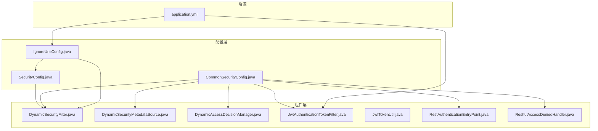
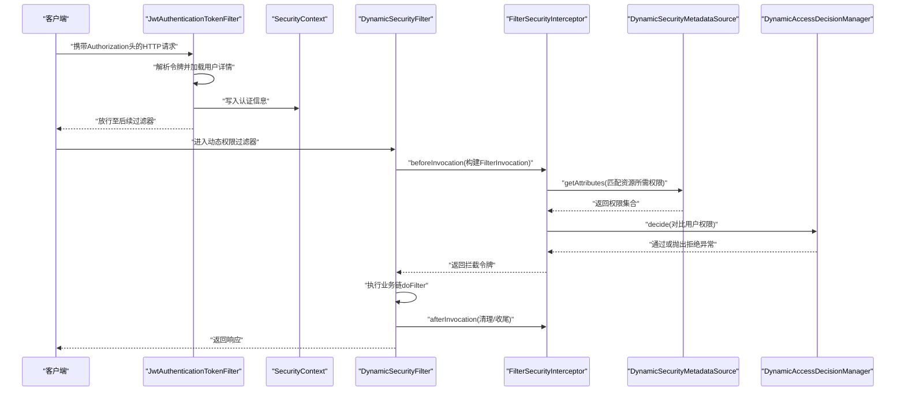
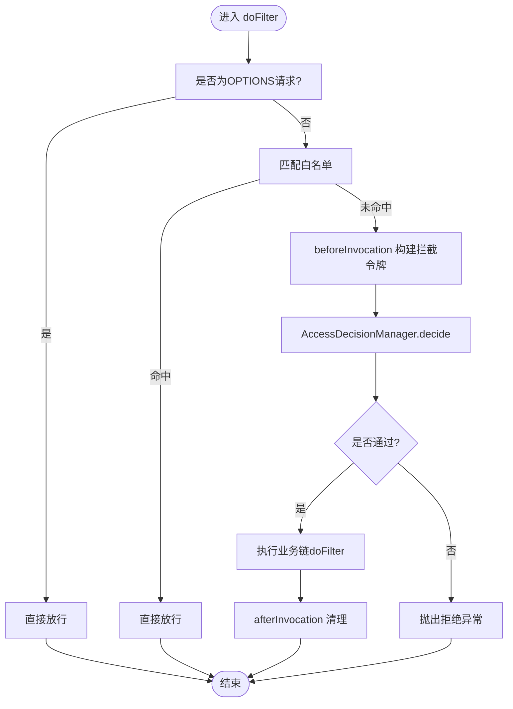
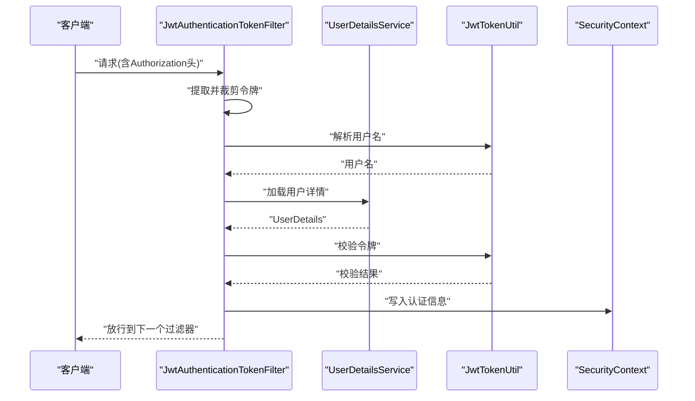
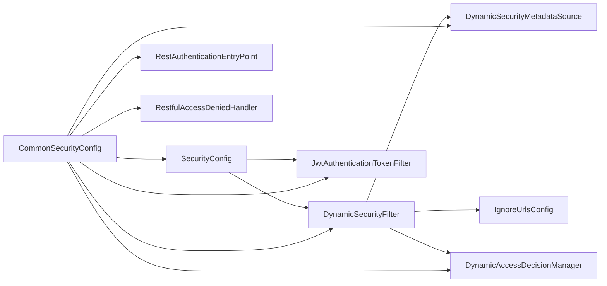

# 安全过滤器链

<cite>
**本文引用的文件**
- [DynamicSecurityFilter.java](file://src/main/java/com/macro/mall/tiny/security/component/DynamicSecurityFilter.java)
- [JwtAuthenticationTokenFilter.java](file://src/main/java/com/macro/mall/tiny/security/component/JwtAuthenticationTokenFilter.java)
- [DynamicSecurityMetadataSource.java](file://src/main/java/com/macro/mall/tiny/security/component/DynamicSecurityMetadataSource.java)
- [DynamicAccessDecisionManager.java](file://src/main/java/com/macro/mall/tiny/security/component/DynamicAccessDecisionManager.java)
- [DynamicSecurityService.java](file://src/main/java/com/macro/mall/tiny/security/component/DynamicSecurityService.java)
- [SecurityConfig.java](file://src/main/java/com/macro/mall/tiny/security/config/SecurityConfig.java)
- [CommonSecurityConfig.java](file://src/main/java/com/macro/mall/tiny/security/config/CommonSecurityConfig.java)
- [IgnoreUrlsConfig.java](file://src/main/java/com/macro/mall/tiny/security/config/IgnoreUrlsConfig.java)
- [JwtTokenUtil.java](file://src/main/java/com/macro/mall/tiny/security/util/JwtTokenUtil.java)
- [RestAuthenticationEntryPoint.java](file://src/main/java/com/macro/mall/tiny/security/component/RestAuthenticationEntryPoint.java)
- [RestfulAccessDeniedHandler.java](file://src/main/java/com/macro/mall/tiny/security/component/RestfulAccessDeniedHandler.java)
- [application.yml](file://src/main/resources/application.yml)
</cite>

## 目录
1. [简介](#简介)
2. [项目结构](#项目结构)
3. [核心组件](#核心组件)
4. [架构总览](#架构总览)
5. [详细组件分析](#详细组件分析)
6. [依赖分析](#依赖分析)
7. [性能考量](#性能考量)
8. [故障排查指南](#故障排查指南)
9. [结论](#结论)
10. [附录](#附录)

## 简介
本文件围绕“安全过滤器链”展开，重点解析 DynamicSecurityFilter 在过滤器链中的定位与职责，涵盖其继承关系、执行顺序、请求拦截机制、doFilter 内部流程、与其它过滤器的协作、异常传播与状态管理，并提供配置最佳实践、扩展性设计建议以及监控与诊断方法。

## 项目结构
本项目采用分层与功能模块结合的组织方式，安全相关代码集中在 security 包下，按“配置-组件-工具”分层组织：
- config：Spring Security 配置与通用 Bean 定义
- component：安全过滤器、元数据源、决策器、入口点与拒绝处理器
- util：JWT 工具类
- resources：应用配置，含安全白名单与 JWT 参数

图表来源
- [SecurityConfig.java:46-84](file://src/main/java/com/macro/mall/tiny/security/config/SecurityConfig.java#L46-L84)
- [CommonSecurityConfig.java:44-61](file://src/main/java/com/macro/mall/tiny/security/config/CommonSecurityConfig.java#L44-L61)
- [IgnoreUrlsConfig.java:14-21](file://src/main/java/com/macro/mall/tiny/security/config/IgnoreUrlsConfig.java#L14-L21)
- [application.yml:38-57](file://src/main/resources/application.yml#L38-L57)

章节来源
- [SecurityConfig.java:29-84](file://src/main/java/com/macro/mall/tiny/security/config/SecurityConfig.java#L29-L84)
- [CommonSecurityConfig.java:15-62](file://src/main/java/com/macro/mall/tiny/security/config/CommonSecurityConfig.java#L15-L62)
- [application.yml:1-57](file://src/main/resources/application.yml#L1-L57)

## 核心组件
- DynamicSecurityFilter：基于路径的动态权限过滤器，继承 Spring Security 的 AbstractSecurityInterceptor 并实现 javax.servlet.Filter，负责在进入业务控制器前进行权限判定。
- JwtAuthenticationTokenFilter：基于 JWT 的 OncePerRequestFilter，负责从请求头提取令牌、解析用户并写入 SecurityContext。
- DynamicSecurityMetadataSource：动态权限元数据源，加载资源-权限映射，供决策器使用。
- DynamicAccessDecisionManager：动态权限决策器，根据用户权限与资源需求进行比对。
- SecurityConfig：定义过滤器链顺序与策略，注册 JWT 与动态权限过滤器。
- CommonSecurityConfig：集中声明安全相关 Bean，便于装配。
- IgnoreUrlsConfig：白名单路径配置，来源于 application.yml。
- RestAuthenticationEntryPoint / RestfulAccessDeniedHandler：未登录与权限不足的统一响应。
- JwtTokenUtil：JWT 生成、解析与校验工具。

章节来源
- [DynamicSecurityFilter.java:23-82](file://src/main/java/com/macro/mall/tiny/security/component/DynamicSecurityFilter.java#L23-L82)
- [JwtAuthenticationTokenFilter.java:26-58](file://src/main/java/com/macro/mall/tiny/security/component/JwtAuthenticationTokenFilter.java#L26-L58)
- [DynamicSecurityMetadataSource.java:18-64](file://src/main/java/com/macro/mall/tiny/security/component/DynamicSecurityMetadataSource.java#L18-L64)
- [DynamicAccessDecisionManager.java:18-51](file://src/main/java/com/macro/mall/tiny/security/component/DynamicAccessDecisionManager.java#L18-L51)
- [SecurityConfig.java:46-84](file://src/main/java/com/macro/mall/tiny/security/config/SecurityConfig.java#L46-L84)
- [CommonSecurityConfig.java:44-61](file://src/main/java/com/macro/mall/tiny/security/config/CommonSecurityConfig.java#L44-L61)
- [IgnoreUrlsConfig.java:14-21](file://src/main/java/com/macro/mall/tiny/security/config/IgnoreUrlsConfig.java#L14-L21)
- [RestAuthenticationEntryPoint.java:17-27](file://src/main/java/com/macro/mall/tiny/security/component/RestAuthenticationEntryPoint.java#L17-L27)
- [RestfulAccessDeniedHandler.java:17-29](file://src/main/java/com/macro/mall/tiny/security/component/RestfulAccessDeniedHandler.java#L17-L29)
- [JwtTokenUtil.java:28-171](file://src/main/java/com/macro/mall/tiny/security/util/JwtTokenUtil.java#L28-L171)

## 架构总览
动态权限过滤器链由两部分组成：
- 认证阶段：JwtAuthenticationTokenFilter 在进入业务前解析 JWT，填充 SecurityContext。
- 授权阶段：DynamicSecurityFilter 调用 AbstractSecurityInterceptor 的 beforeInvocation/afterInvocation 流程，借助 DynamicSecurityMetadataSource 获取资源所需权限，再由 DynamicAccessDecisionManager 进行决策。

图表来源
- [JwtAuthenticationTokenFilter.java:38-57](file://src/main/java/com/macro/mall/tiny/security/component/JwtAuthenticationTokenFilter.java#L38-L57)
- [DynamicSecurityFilter.java:40-66](file://src/main/java/com/macro/mall/tiny/security/component/DynamicSecurityFilter.java#L40-L66)
- [DynamicSecurityMetadataSource.java:34-52](file://src/main/java/com/macro/mall/tiny/security/component/DynamicSecurityMetadataSource.java#L34-L52)
- [DynamicAccessDecisionManager.java:20-39](file://src/main/java/com/macro/mall/tiny/security/component/DynamicAccessDecisionManager.java#L20-L39)

## 详细组件分析

### DynamicSecurityFilter 组件分析
- 继承关系与职责
  - 继承 AbstractSecurityInterceptor，具备 Spring Security 安全拦截器能力；同时实现 javax.servlet.Filter，作为标准 Servlet 过滤器参与过滤器链。
  - 负责在进入业务控制器前进行权限判定，支持白名单放行、OPTIONS 预检放行、动态权限决策。
- 执行顺序
  - 在 SecurityConfig 中通过 addFilterBefore 将其置于 FilterSecurityInterceptor 之前，确保在常规 URL 授权之前完成动态权限判定。
- 请求拦截机制
  - 对于 OPTIONS 请求与白名单路径直接放行。
  - 使用 FilterInvocation 封装请求上下文，调用父类的 beforeInvocation/afterInvocation 完成拦截器生命周期管理。
- doFilter 内部逻辑要点
  - 预处理：识别请求方法与白名单路径，必要时提前放行。
  - 权限检查：调用 beforeInvocation 获取拦截令牌，交由 AccessDecisionManager 决策。
  - 后处理：finally 块中调用 afterInvocation 清理状态。
- 与其它组件的关系
  - 依赖 DynamicSecurityMetadataSource 提供资源-权限映射。
  - 通过 setAccessDecisionManager 注入 DynamicAccessDecisionManager。
  - 与 IgnoreUrlsConfig 协作实现白名单放行。
- 异常传播与状态管理
  - 决策失败会抛出 AccessDeniedException，由 RestfulAccessDeniedHandler 统一处理。
  - 生命周期通过 InterceptorStatusToken 管理，保证 afterInvocation 总是执行。

图表来源
- [DynamicSecurityFilter.java:40-66](file://src/main/java/com/macro/mall/tiny/security/component/DynamicSecurityFilter.java#L40-L66)

章节来源
- [DynamicSecurityFilter.java:23-82](file://src/main/java/com/macro/mall/tiny/security/component/DynamicSecurityFilter.java#L23-L82)
- [SecurityConfig.java:78-82](file://src/main/java/com/macro/mall/tiny/security/config/SecurityConfig.java#L78-L82)
- [IgnoreUrlsConfig.java:14-21](file://src/main/java/com/macro/mall/tiny/security/config/IgnoreUrlsConfig.java#L14-L21)

### JwtAuthenticationTokenFilter 组件分析
- 继承关系与职责
  - 继承 OncePerRequestFilter，确保每个请求只执行一次，避免重复认证。
- 认证流程
  - 从请求头读取 Authorization，去除前缀后解析用户名。
  - 若用户未认证且令牌有效，则构造 UsernamePasswordAuthenticationToken 并写入 SecurityContext。
- 与动态权限的关系
  - 在 DynamicSecurityFilter 之前运行，为后续动态权限决策提供认证主体。

图表来源
- [JwtAuthenticationTokenFilter.java:38-57](file://src/main/java/com/macro/mall/tiny/security/component/JwtAuthenticationTokenFilter.java#L38-L57)
- [JwtTokenUtil.java:76-96](file://src/main/java/com/macro/mall/tiny/security/util/JwtTokenUtil.java#L76-L96)

章节来源
- [JwtAuthenticationTokenFilter.java:26-58](file://src/main/java/com/macro/mall/tiny/security/component/JwtAuthenticationTokenFilter.java#L26-L58)
- [JwtTokenUtil.java:28-171](file://src/main/java/com/macro/mall/tiny/security/util/JwtTokenUtil.java#L28-L171)

### DynamicSecurityMetadataSource 组件分析
- 数据源加载
  - 通过 @PostConstruct 调用 DynamicSecurityService.loadDataSource 初始化资源-权限映射。
- 资源匹配
  - 使用 AntPathMatcher 对当前访问路径与资源模式进行匹配，返回所需权限集合。
- 空集合处理
  - 未配置资源时返回空集合，表示放行。

章节来源
- [DynamicSecurityMetadataSource.java:18-64](file://src/main/java/com/macro/mall/tiny/security/component/DynamicSecurityMetadataSource.java#L18-L64)
- [DynamicSecurityService.java:11-16](file://src/main/java/com/macro/mall/tiny/security/component/DynamicSecurityService.java#L11-L16)

### DynamicAccessDecisionManager 组件分析
- 决策逻辑
  - 若资源未配置权限则放行；否则遍历资源所需权限，与用户已授予权限进行比对，若存在匹配则通过，否则抛出拒绝异常。
- 支持性
  - supports 方法始终返回 true，适配所有场景。

章节来源
- [DynamicAccessDecisionManager.java:18-51](file://src/main/java/com/macro/mall/tiny/security/component/DynamicAccessDecisionManager.java#L18-L51)

### SecurityConfig 与 CommonSecurityConfig 组件分析
- SecurityConfig
  - 注册白名单路径与 OPTIONS 预检放行。
  - 在 UsernamePasswordAuthenticationFilter 之前插入 JwtAuthenticationTokenFilter。
  - 条件注册 DynamicSecurityFilter，在 FilterSecurityInterceptor 之前生效。
- CommonSecurityConfig
  - 统一声明忽略路径、JWT 工具、异常处理器、过滤器与动态权限相关 Bean。

章节来源
- [SecurityConfig.java:46-84](file://src/main/java/com/macro/mall/tiny/security/config/SecurityConfig.java#L46-L84)
- [CommonSecurityConfig.java:44-61](file://src/main/java/com/macro/mall/tiny/security/config/CommonSecurityConfig.java#L44-L61)

### 其它辅助组件
- IgnoreUrlsConfig：白名单路径集合，来源于 secure.ignored.urls。
- RestAuthenticationEntryPoint / RestfulAccessDeniedHandler：未登录与权限不足的统一响应。
- application.yml：定义 secure.ignored.urls 与 JWT 相关参数。

章节来源
- [IgnoreUrlsConfig.java:14-21](file://src/main/java/com/macro/mall/tiny/security/config/IgnoreUrlsConfig.java#L14-L21)
- [RestAuthenticationEntryPoint.java:17-27](file://src/main/java/com/macro/mall/tiny/security/component/RestAuthenticationEntryPoint.java#L17-L27)
- [RestfulAccessDeniedHandler.java:17-29](file://src/main/java/com/macro/mall/tiny/security/component/RestfulAccessDeniedHandler.java#L17-L29)
- [application.yml:38-57](file://src/main/resources/application.yml#L38-L57)

## 依赖分析
- 组件耦合
  - DynamicSecurityFilter 依赖 DynamicSecurityMetadataSource 与 IgnoreUrlsConfig；通过 setter 方式注入 DynamicAccessDecisionManager。
  - SecurityConfig 与 CommonSecurityConfig 负责装配与顺序控制。
- 外部依赖
  - Spring Security 的 FilterInvocation、AbstractSecurityInterceptor、FilterSecurityInterceptor。
  - AntPathMatcher 用于路径匹配。
- 可能的循环依赖
  - 通过 CommonSecurityConfig 统一装配，避免在 SecurityConfig 中直接构造导致的循环依赖风险。

图表来源
- [DynamicSecurityFilter.java:25-33](file://src/main/java/com/macro/mall/tiny/security/component/DynamicSecurityFilter.java#L25-L33)
- [SecurityConfig.java:46-84](file://src/main/java/com/macro/mall/tiny/security/config/SecurityConfig.java#L46-L84)
- [CommonSecurityConfig.java:44-61](file://src/main/java/com/macro/mall/tiny/security/config/CommonSecurityConfig.java#L44-L61)

章节来源
- [DynamicSecurityFilter.java:23-82](file://src/main/java/com/macro/mall/tiny/security/component/DynamicSecurityFilter.java#L23-L82)
- [SecurityConfig.java:29-84](file://src/main/java/com/macro/mall/tiny/security/config/SecurityConfig.java#L29-L84)
- [CommonSecurityConfig.java:15-62](file://src/main/java/com/macro/mall/tiny/security/config/CommonSecurityConfig.java#L15-L62)

## 性能考量
- 白名单与预检放行：减少不必要的权限匹配与决策开销。
- OncePerRequestFilter：避免重复认证带来的额外成本。
- 路径匹配策略：AntPathMatcher 在资源较多时可考虑缓存或优化匹配策略。
- 决策器短路：当资源未配置权限时直接放行，降低决策复杂度。
- 缓存与懒加载：DynamicSecurityMetadataSource 在首次使用时加载数据源，避免启动时的冷启动延迟。

[本节为通用性能建议，无需特定文件引用]

## 故障排查指南
- 常见问题与定位
  - 未登录或令牌无效：由 RestAuthenticationEntryPoint 统一输出未授权响应，检查 Authorization 头与令牌有效性。
  - 权限不足：由 RestfulAccessDeniedHandler 输出禁止访问响应，检查用户权限与资源权限映射。
  - 白名单未生效：确认 application.yml 中 secure.ignored.urls 配置正确，且路径匹配策略一致。
  - 动态权限不生效：确认 DynamicSecurityService 的数据源已加载，且 DynamicSecurityMetadataSource 的映射表非空。
- 调试技巧
  - 开启 Spring Security 日志，观察拦截器链与决策过程。
  - 在 JwtAuthenticationTokenFilter 与 DynamicSecurityFilter 中增加必要的日志，记录请求路径、用户身份与决策结果。
  - 使用最小化白名单与权限配置复现问题，逐步缩小范围。

章节来源
- [RestAuthenticationEntryPoint.java:17-27](file://src/main/java/com/macro/mall/tiny/security/component/RestAuthenticationEntryPoint.java#L17-L27)
- [RestfulAccessDeniedHandler.java:17-29](file://src/main/java/com/macro/mall/tiny/security/component/RestfulAccessDeniedHandler.java#L17-L29)
- [application.yml:38-57](file://src/main/resources/application.yml#L38-L57)
- [DynamicSecurityMetadataSource.java:24-32](file://src/main/java/com/macro/mall/tiny/security/component/DynamicSecurityMetadataSource.java#L24-L32)

## 结论
DynamicSecurityFilter 作为动态权限过滤器的核心，位于认证之后、URL 授权之前的恰当位置，通过 AbstractSecurityInterceptor 的生命周期与 DynamicAccessDecisionManager 的决策逻辑，实现了灵活可控的资源级权限控制。配合 JwtAuthenticationTokenFilter 与白名单机制，整体链路清晰、可扩展性强，适合在多变的业务权限场景中稳定运行。

[本节为总结性内容，无需特定文件引用]

## 附录

### 过滤器链配置最佳实践
- 过滤器顺序
  - JWT 过滤器应先于动态权限过滤器，确保 SecurityContext 已就绪。
  - 动态权限过滤器应位于 FilterSecurityInterceptor 之前，以便在常规授权前完成动态判定。
- 白名单管理
  - 将静态资源、文档、登录接口等加入白名单，减少鉴权压力。
  - 使用 Ant 风格路径，保持与 DynamicSecurityMetadataSource 的匹配策略一致。
- 性能优化
  - 合理拆分资源权限映射，避免过多全量匹配。
  - 在高并发场景下，考虑缓存权限映射与用户权限集合。
- 调试与可观测性
  - 为关键节点增加日志，记录请求路径、用户身份、决策结果。
  - 使用统一异常处理器输出结构化错误信息，便于前端展示与定位。

章节来源
- [SecurityConfig.java:78-82](file://src/main/java/com/macro/mall/tiny/security/config/SecurityConfig.java#L78-L82)
- [application.yml:38-57](file://src/main/resources/application.yml#L38-L57)

### 扩展性设计建议
- 自定义过滤器添加
  - 新增过滤器时，遵循 OncePerRequestFilter 或 AbstractSecurityInterceptor 的约定，明确在链中的相对位置。
- 过滤器组合模式
  - 将多个细粒度过滤器组合为复合过滤器，提升复用性与可维护性。
- 条件过滤
  - 通过 @ConditionalOnBean 或配置开关控制过滤器启用，满足不同环境与版本的需求。

[本节为概念性建议，无需特定文件引用]