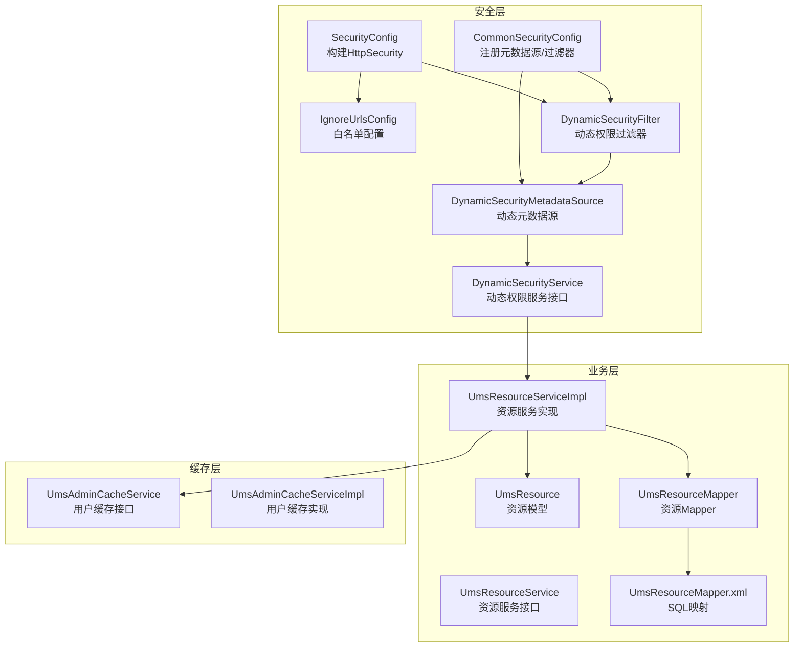
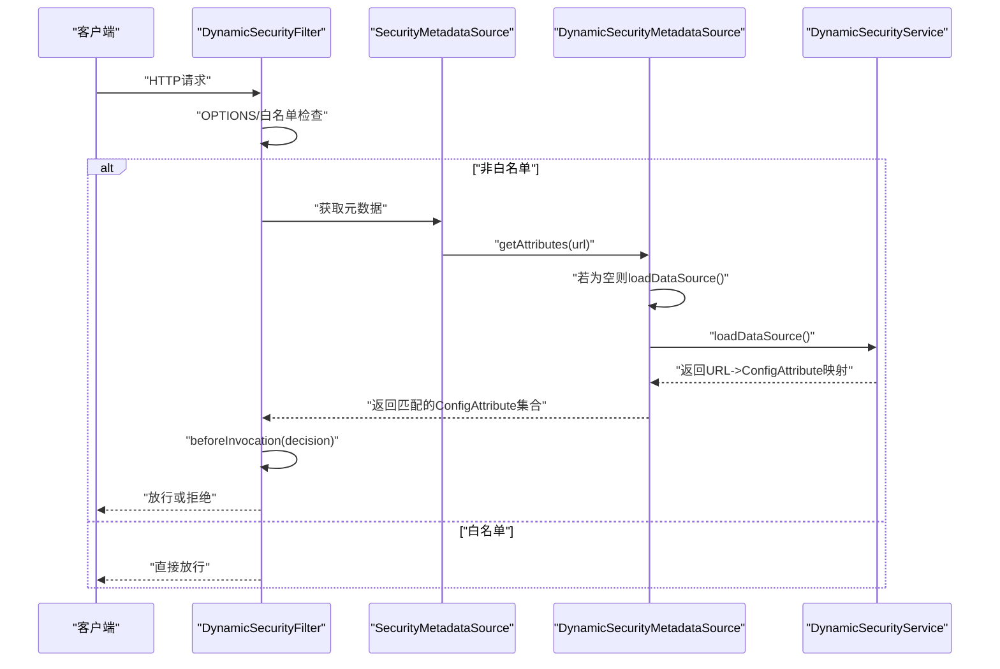
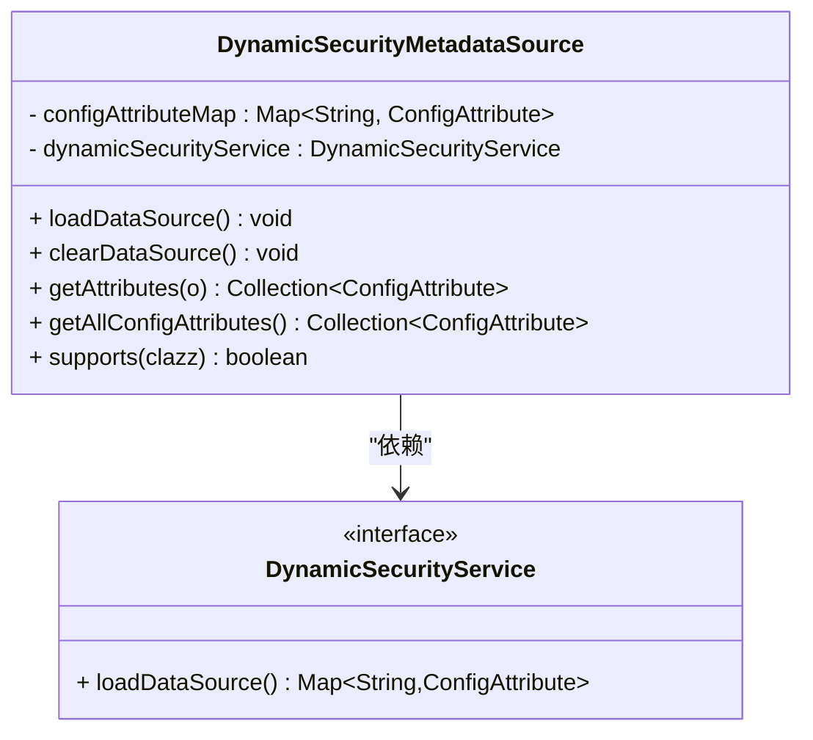
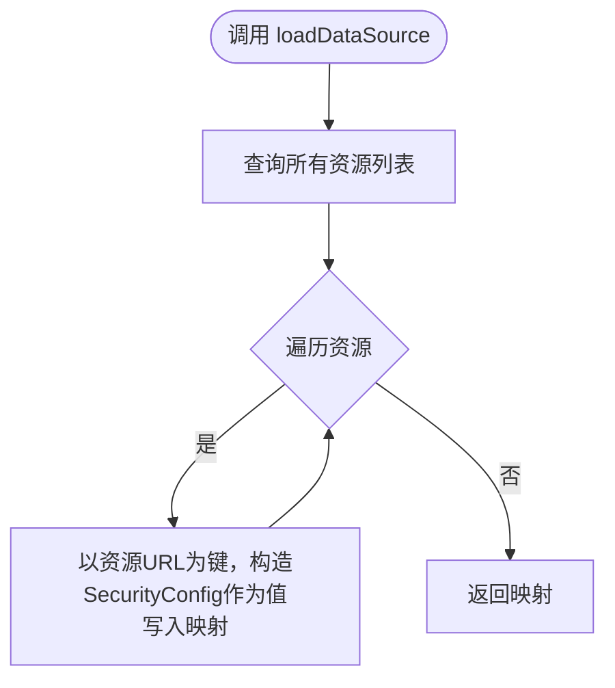
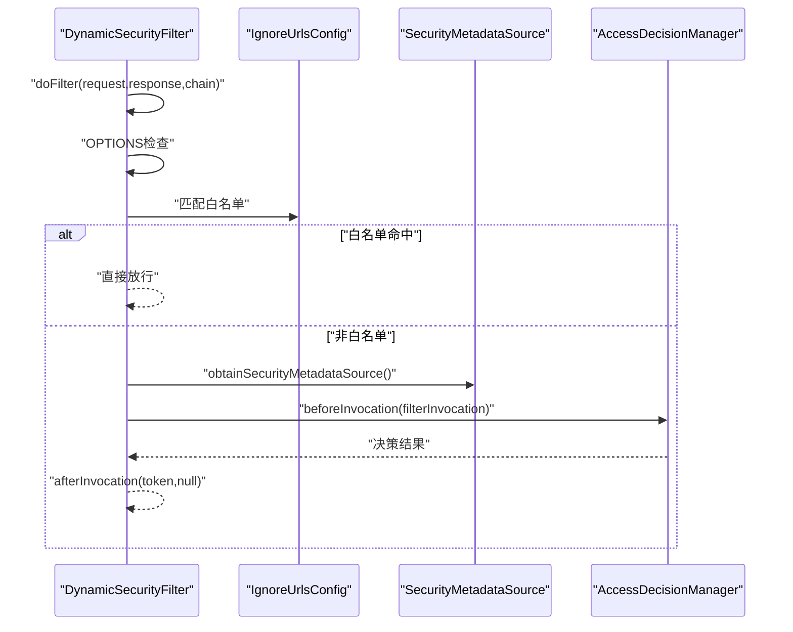
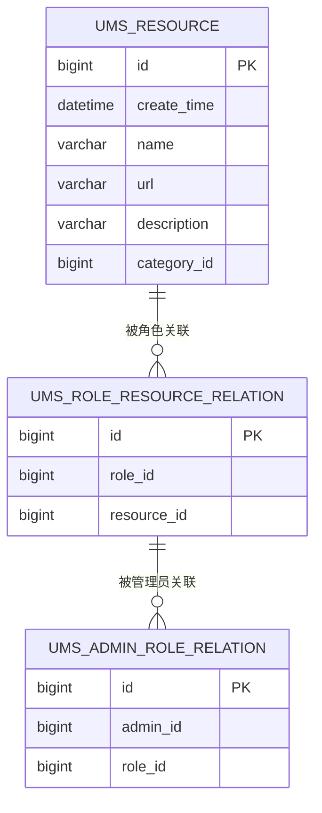
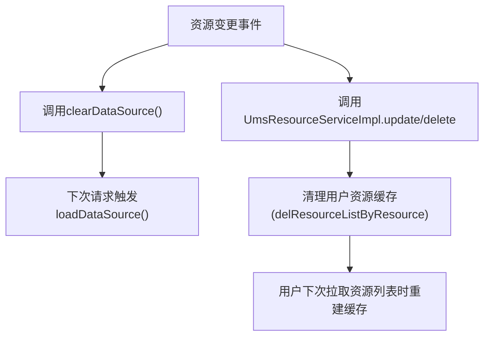
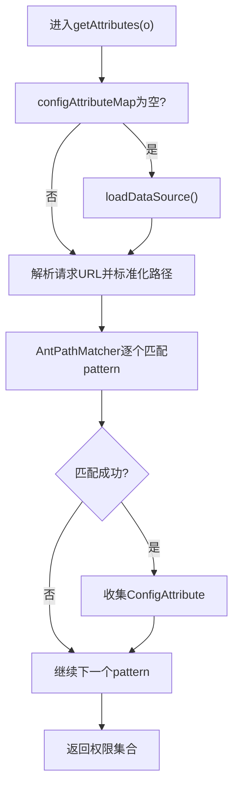
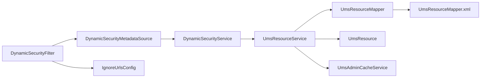

# 权限元数据源

<cite>
**本文引用的文件**
- [DynamicSecurityMetadataSource.java](file://src/main/java/com/macro/mall/tiny/security/component/DynamicSecurityMetadataSource.java)
- [DynamicSecurityService.java](file://src/main/java/com/macro/mall/tiny/security/component/DynamicSecurityService.java)
- [DynamicSecurityFilter.java](file://src/main/java/com/macro/mall/tiny/security/component/DynamicSecurityFilter.java)
- [SecurityConfig.java](file://src/main/java/com/macro/mall/tiny/security/config/SecurityConfig.java)
- [CommonSecurityConfig.java](file://src/main/java/com/macro/mall/tiny/security/config/CommonSecurityConfig.java)
- [IgnoreUrlsConfig.java](file://src/main/java/com/macro/mall/tiny/security/config/IgnoreUrlsConfig.java)
- [AdminUserDetails.java](file://src/main/java/com/macro/mall/tiny/domain/AdminUserDetails.java)
- [UmsResourceService.java](file://src/main/java/com/macro/mall/tiny/modules/ums/service/UmsResourceService.java)
- [UmsResourceServiceImpl.java](file://src/main/java/com/macro/mall/tiny/modules/ums/service/impl/UmsResourceServiceImpl.java)
- [UmsResource.java](file://src/main/java/com/macro/mall/tiny/modules/ums/model/UmsResource.java)
- [UmsResourceMapper.java](file://src/main/java/com/macro/mall/tiny/modules/ums/mapper/UmsResourceMapper.java)
- [UmsResourceMapper.xml](file://src/main/resources/mapper/ums/UmsResourceMapper.xml)
- [UmsAdminCacheService.java](file://src/main/java/com/macro/mall/tiny/modules/ums/service/UmsAdminCacheService.java)
- [UmsAdminCacheServiceImpl.java](file://src/main/java/com/macro/mall/tiny/modules/ums/service/impl/UmsAdminCacheServiceImpl.java)
- [mall_tiny.sql](file://sql/mall_tiny.sql)
- [init_import_permission.sql](file://sql/init_import_permission.sql)
</cite>

## 目录
1. [引言](#引言)
2. [项目结构](#项目结构)
3. [核心组件](#核心组件)
4. [架构总览](#架构总览)
5. [详细组件分析](#详细组件分析)
6. [依赖分析](#依赖分析)
7. [性能考虑](#性能考虑)
8. [故障排查指南](#故障排查指南)
9. [结论](#结论)
10. [附录](#附录)

## 引言
本文件围绕Spring Security中的“权限元数据源”展开，重点解释DynamicSecurityMetadataSource在运行期如何根据URL匹配动态加载权限配置，以及与之配套的动态权限过滤链路、白名单处理、权限缓存与失效策略。文档同时梳理了权限元数据的存储结构、加载流程、更新机制与最佳实践，帮助读者快速理解并落地到实际项目中。

## 项目结构
本项目采用分层+功能域划分的组织方式，安全相关代码集中在security包下，权限资源模型位于modules/ums子系统，数据库脚本位于sql目录。与权限元数据源直接相关的模块包括：
- 安全配置与过滤链：security/config、security/component
- 权限资源模型与查询：modules/ums/model、modules/ums/mapper、modules/ums/service
- 缓存与白名单：modules/ums/service/impl、security/config

图表来源
- [SecurityConfig.java:46-84](file://src/main/java/com/macro/mall/tiny/security/config/SecurityConfig.java#L46-L84)
- [CommonSecurityConfig.java:48-62](file://src/main/java/com/macro/mall/tiny/security/config/CommonSecurityConfig.java#L48-L62)
- [DynamicSecurityFilter.java:23-83](file://src/main/java/com/macro/mall/tiny/security/component/DynamicSecurityFilter.java#L23-L83)
- [DynamicSecurityMetadataSource.java:18-65](file://src/main/java/com/macro/mall/tiny/security/component/DynamicSecurityMetadataSource.java#L18-L65)
- [DynamicSecurityService.java:11-16](file://src/main/java/com/macro/mall/tiny/security/component/DynamicSecurityService.java#L11-L16)
- [UmsResourceService.java:15-40](file://src/main/java/com/macro/mall/tiny/modules/ums/service/UmsResourceService.java#L15-L40)
- [UmsResourceServiceImpl.java:27-101](file://src/main/java/com/macro/mall/tiny/modules/ums/service/impl/UmsResourceServiceImpl.java#L27-L101)
- [UmsResourceMapper.java:17-29](file://src/main/java/com/macro/mall/tiny/modules/ums/mapper/UmsResourceMapper.java#L17-L29)
- [UmsResourceMapper.xml:15-51](file://src/main/resources/mapper/ums/UmsResourceMapper.xml#L15-L51)
- [UmsResource.java:25-49](file://src/main/java/com/macro/mall/tiny/modules/ums/model/UmsResource.java#L25-L49)
- [UmsAdminCacheService.java:14-60](file://src/main/java/com/macro/mall/tiny/modules/ums/service/UmsAdminCacheService.java#L14-L60)
- [UmsAdminCacheServiceImpl.java:25-116](file://src/main/java/com/macro/mall/tiny/modules/ums/service/impl/UmsAdminCacheServiceImpl.java#L25-L116)
- [IgnoreUrlsConfig.java:14-22](file://src/main/java/com/macro/mall/tiny/security/config/IgnoreUrlsConfig.java#L14-L22)

章节来源
- [SecurityConfig.java:46-84](file://src/main/java/com/macro/mall/tiny/security/config/SecurityConfig.java#L46-L84)
- [CommonSecurityConfig.java:48-62](file://src/main/java/com/macro/mall/tiny/security/config/CommonSecurityConfig.java#L48-L62)
- [DynamicSecurityFilter.java:23-83](file://src/main/java/com/macro/mall/tiny/security/component/DynamicSecurityFilter.java#L23-L83)
- [DynamicSecurityMetadataSource.java:18-65](file://src/main/java/com/macro/mall/tiny/security/component/DynamicSecurityMetadataSource.java#L18-L65)
- [UmsResourceService.java:15-40](file://src/main/java/com/macro/mall/tiny/modules/ums/service/UmsResourceService.java#L15-L40)
- [UmsResourceServiceImpl.java:27-101](file://src/main/java/com/macro/mall/tiny/modules/ums/service/impl/UmsResourceServiceImpl.java#L27-L101)
- [UmsResourceMapper.java:17-29](file://src/main/java/com/macro/mall/tiny/modules/ums/mapper/UmsResourceMapper.java#L17-L29)
- [UmsResourceMapper.xml:15-51](file://src/main/resources/mapper/ums/UmsResourceMapper.xml#L15-L51)
- [UmsResource.java:25-49](file://src/main/java/com/macro/mall/tiny/modules/ums/model/UmsResource.java#L25-L49)
- [UmsAdminCacheService.java:14-60](file://src/main/java/com/macro/mall/tiny/modules/ums/service/UmsAdminCacheService.java#L14-L60)
- [UmsAdminCacheServiceImpl.java:25-116](file://src/main/java/com/macro/mall/tiny/modules/ums/service/impl/UmsAdminCacheServiceImpl.java#L25-L116)
- [IgnoreUrlsConfig.java:14-22](file://src/main/java/com/macro/mall/tiny/security/config/IgnoreUrlsConfig.java#L14-L22)

## 核心组件
- DynamicSecurityMetadataSource：实现FilterInvocationSecurityMetadataSource，负责将URL与权限配置映射为ConfigAttribute集合，支持ANT风格路径匹配。
- DynamicSecurityService：动态权限服务接口，定义loadDataSource()以加载资源URL到权限的映射。
- DynamicSecurityFilter：自定义过滤器，集成AbstractSecurityInterceptor，拦截请求前通过元数据源获取权限集合并交由决策管理器判断。
- SecurityConfig：构建HttpSecurity，注册JWT过滤器与动态权限过滤器，支持白名单路径。
- CommonSecurityConfig：注册DynamicSecurityMetadataSource、DynamicSecurityFilter等Bean。
- IgnoreUrlsConfig：白名单配置读取器，支持ant风格路径。
- UmsResource*：权限资源模型、Mapper与SQL映射，支撑权限元数据的持久化与查询。
- UmsAdminCacheService/Impl：用户资源列表缓存与失效策略，辅助权限元数据的缓存管理。

章节来源
- [DynamicSecurityMetadataSource.java:18-65](file://src/main/java/com/macro/mall/tiny/security/component/DynamicSecurityMetadataSource.java#L18-L65)
- [DynamicSecurityService.java:11-16](file://src/main/java/com/macro/mall/tiny/security/component/DynamicSecurityService.java#L11-L16)
- [DynamicSecurityFilter.java:23-83](file://src/main/java/com/macro/mall/tiny/security/component/DynamicSecurityFilter.java#L23-L83)
- [SecurityConfig.java:46-84](file://src/main/java/com/macro/mall/tiny/security/config/SecurityConfig.java#L46-L84)
- [CommonSecurityConfig.java:48-62](file://src/main/java/com/macro/mall/tiny/security/config/CommonSecurityConfig.java#L48-L62)
- [IgnoreUrlsConfig.java:14-22](file://src/main/java/com/macro/mall/tiny/security/config/IgnoreUrlsConfig.java#L14-L22)
- [UmsResourceService.java:15-40](file://src/main/java/com/macro/mall/tiny/modules/ums/service/UmsResourceService.java#L15-L40)
- [UmsResourceServiceImpl.java:27-101](file://src/main/java/com/macro/mall/tiny/modules/ums/service/impl/UmsResourceServiceImpl.java#L27-L101)
- [UmsResourceMapper.java:17-29](file://src/main/java/com/macro/mall/tiny/modules/ums/mapper/UmsResourceMapper.java#L17-L29)
- [UmsResourceMapper.xml:15-51](file://src/main/resources/mapper/ums/UmsResourceMapper.xml#L15-L51)
- [UmsAdminCacheService.java:14-60](file://src/main/java/com/macro/mall/tiny/modules/ums/service/UmsAdminCacheService.java#L14-L60)
- [UmsAdminCacheServiceImpl.java:25-116](file://src/main/java/com/macro/mall/tiny/modules/ums/service/impl/UmsAdminCacheServiceImpl.java#L25-L116)

## 架构总览
动态权限元数据源通过以下链路工作：
- 应用启动时，通过CommonSecurityConfig注册DynamicSecurityMetadataSource与DynamicSecurityFilter。
- SecurityConfig将动态过滤器加入过滤链，白名单路径由IgnoreUrlsConfig配置。
- 请求进入DynamicSecurityFilter后，先跳过OPTIONS与白名单，再调用父类beforeInvocation获取SecurityMetadataSource。
- DynamicSecurityMetadataSource在首次使用或清空后加载数据源，将请求URL标准化后与配置的ANT模式匹配，返回对应的ConfigAttribute集合。
- 决策管理器根据集合决定是否放行。

图表来源
- [DynamicSecurityFilter.java:40-66](file://src/main/java/com/macro/mall/tiny/security/component/DynamicSecurityFilter.java#L40-L66)
- [DynamicSecurityMetadataSource.java:24-52](file://src/main/java/com/macro/mall/tiny/security/component/DynamicSecurityMetadataSource.java#L24-L52)
- [DynamicSecurityService.java:11-16](file://src/main/java/com/macro/mall/tiny/security/component/DynamicSecurityService.java#L11-L16)
- [SecurityConfig.java:79-82](file://src/main/java/com/macro/mall/tiny/security/config/SecurityConfig.java#L79-L82)
- [IgnoreUrlsConfig.java:14-22](file://src/main/java/com/macro/mall/tiny/security/config/IgnoreUrlsConfig.java#L14-L22)

## 详细组件分析

### DynamicSecurityMetadataSource：动态元数据源
职责与实现要点：
- 实现FilterInvocationSecurityMetadataSource接口，提供getAttributes(Object)用于获取请求URL对应的权限集合。
- 使用AntPathMatcher进行ANT风格路径匹配，支持如"/product/**"等通配符。
- 在首次访问或clearDataSource()后重新加载数据源，确保权限变更即时生效。
- 支持supports(Class)始终返回true，表明其适用于FilterInvocation对象。

图表来源
- [DynamicSecurityMetadataSource.java:18-65](file://src/main/java/com/macro/mall/tiny/security/component/DynamicSecurityMetadataSource.java#L18-L65)
- [DynamicSecurityService.java:11-16](file://src/main/java/com/macro/mall/tiny/security/component/DynamicSecurityService.java#L11-L16)

章节来源
- [DynamicSecurityMetadataSource.java:18-65](file://src/main/java/com/macro/mall/tiny/security/component/DynamicSecurityMetadataSource.java#L18-L65)

### DynamicSecurityService：动态权限服务
- 接口定义loadDataSource()，返回URL到ConfigAttribute的映射。
- 在MallSecurityConfig中以匿名内部类形式实现，遍历UmsResource列表，将每个资源的url作为键，构造"资源id:资源名"格式的SecurityConfig作为值，形成URL->权限的映射。

图表来源
- [MallSecurityConfig.java:40-52](file://src/main/java/com/macro/mall/tiny/config/MallSecurityConfig.java#L40-L52)
- [UmsResourceService.java:15-40](file://src/main/java/com/macro/mall/tiny/modules/ums/service/UmsResourceService.java#L15-L40)
- [UmsResource.java:25-49](file://src/main/java/com/macro/mall/tiny/modules/ums/model/UmsResource.java#L25-L49)

章节来源
- [DynamicSecurityService.java:11-16](file://src/main/java/com/macro/mall/tiny/security/component/DynamicSecurityService.java#L11-L16)
- [MallSecurityConfig.java:40-52](file://src/main/java/com/macro/mall/tiny/config/MallSecurityConfig.java#L40-L52)

### DynamicSecurityFilter：动态权限过滤器
- 继承AbstractSecurityInterceptor，实现Filter接口，拦截请求前后完成鉴权。
- 白名单与OPTIONS请求直接放行，其余请求调用super.beforeInvocation()获取SecurityMetadataSource并进行决策。
- obtainSecurityMetadataSource()返回DynamicSecurityMetadataSource实例。

图表来源
- [DynamicSecurityFilter.java:40-82](file://src/main/java/com/macro/mall/tiny/security/component/DynamicSecurityFilter.java#L40-L82)
- [IgnoreUrlsConfig.java:14-22](file://src/main/java/com/macro/mall/tiny/security/config/IgnoreUrlsConfig.java#L14-L22)

章节来源
- [DynamicSecurityFilter.java:23-83](file://src/main/java/com/macro/mall/tiny/security/component/DynamicSecurityFilter.java#L23-L83)
- [IgnoreUrlsConfig.java:14-22](file://src/main/java/com/macro/mall/tiny/security/config/IgnoreUrlsConfig.java#L14-L22)

### 权限元数据的存储结构与加载
- 资源模型：UmsResource包含id、name、url、description、categoryId等字段，其中url即为动态权限的ANT模式键。
- SQL映射：UmsResourceMapper.xml提供按管理员id与角色id查询资源列表的SQL，支撑用户资源列表缓存。
- 数据加载：DynamicSecurityService在应用启动时加载所有资源，将资源url映射到SecurityConfig，后者在运行期被DynamicSecurityMetadataSource用于匹配。

图表来源
- [UmsResource.java:25-49](file://src/main/java/com/macro/mall/tiny/modules/ums/model/UmsResource.java#L25-L49)
- [UmsResourceMapper.xml:15-51](file://src/main/resources/mapper/ums/UmsResourceMapper.xml#L15-L51)
- [mall_tiny.sql:135-180](file://sql/mall_tiny.sql#L135-L180)

章节来源
- [UmsResource.java:25-49](file://src/main/java/com/macro/mall/tiny/modules/ums/model/UmsResource.java#L25-L49)
- [UmsResourceMapper.java:17-29](file://src/main/java/com/macro/mall/tiny/modules/ums/mapper/UmsResourceMapper.java#L17-L29)
- [UmsResourceMapper.xml:15-51](file://src/main/resources/mapper/ums/UmsResourceMapper.xml#L15-L51)
- [mall_tiny.sql:135-180](file://sql/mall_tiny.sql#L135-L180)

### 权限元数据的动态加载与更新机制
- 动态加载：应用启动时，通过CommonSecurityConfig注册Bean，DynamicSecurityMetadataSource在首次getAttributes时触发loadDataSource()。
- 更新机制：当资源发生变更（新增、修改、删除）时，需调用clearDataSource()使下次请求重新加载；同时，UmsResourceServiceImpl在更新/删除资源后清理相关用户资源缓存，保证权限一致性。
- 缓存策略：当前元数据源使用内存Map缓存URL->ConfigAttribute映射；用户资源列表缓存由UmsAdminCacheServiceImpl管理，支持按资源、角色、用户维度失效。

图表来源
- [DynamicSecurityMetadataSource.java:24-32](file://src/main/java/com/macro/mall/tiny/security/component/DynamicSecurityMetadataSource.java#L24-L32)
- [UmsResourceServiceImpl.java:40-52](file://src/main/java/com/macro/mall/tiny/modules/ums/service/impl/UmsResourceServiceImpl.java#L40-L52)
- [UmsAdminCacheServiceImpl.java:82-90](file://src/main/java/com/macro/mall/tiny/modules/ums/service/impl/UmsAdminCacheServiceImpl.java#L82-L90)

章节来源
- [DynamicSecurityMetadataSource.java:24-32](file://src/main/java/com/macro/mall/tiny/security/component/DynamicSecurityMetadataSource.java#L24-L32)
- [UmsResourceServiceImpl.java:40-52](file://src/main/java/com/macro/mall/tiny/modules/ums/service/impl/UmsResourceServiceImpl.java#L40-L52)
- [UmsAdminCacheServiceImpl.java:82-90](file://src/main/java/com/macro/mall/tiny/modules/ums/service/impl/UmsAdminCacheServiceImpl.java#L82-L90)

### getAttributesForObject（getAttributes）实现逻辑
- 参数校验与初始化：若configAttributeMap为空则先加载数据源。
- URL解析：从FilterInvocation中提取请求URL，使用URLUtil.getPath()规范化路径。
- 匹配策略：使用AntPathMatcher遍历映射键，匹配成功则收集对应的ConfigAttribute。
- 返回结果：返回匹配到的权限集合，未匹配到则返回空集合。

图表来源
- [DynamicSecurityMetadataSource.java:34-52](file://src/main/java/com/macro/mall/tiny/security/component/DynamicSecurityMetadataSource.java#L34-L52)

章节来源
- [DynamicSecurityMetadataSource.java:34-52](file://src/main/java/com/macro/mall/tiny/security/component/DynamicSecurityMetadataSource.java#L34-L52)

### 权限标识符、资源类型与访问控制规则
- 权限标识符：SecurityConfig构造参数为"资源id:资源名"，与AdminUserDetails中授予的权限保持一致，便于授权与审计。
- 资源类型：通过UmsResource的url字段承载资源类型与访问路径，配合ANT通配符实现细粒度控制。
- 访问控制规则：由ConfigAttribute集合驱动，结合AccessDecisionManager进行最终决策。

章节来源
- [MallSecurityConfig.java:43-48](file://src/main/java/com/macro/mall/tiny/config/MallSecurityConfig.java#L43-L48)
- [AdminUserDetails.java:36-55](file://src/main/java/com/macro/mall/tiny/domain/AdminUserDetails.java#L36-L55)
- [UmsResource.java:25-49](file://src/main/java/com/macro/mall/tiny/modules/ums/model/UmsResource.java#L25-L49)

### 配置示例与最佳实践
- 白名单配置：通过IgnoreUrlsConfig读取配置项secure.ignored.urls，支持ANT风格路径。
- 过滤器链配置：SecurityConfig在存在DynamicSecurityService时添加DynamicSecurityFilter至FilterSecurityInterceptor之前。
- 权限粒度设计：建议将URL与业务模块解耦，使用分类字段与描述字段提升可维护性。
- 查询优化：优先使用索引覆盖的查询（如按adminId/roleId查询资源），减少全表扫描。
- 缓存策略：对用户资源列表进行缓存，变更资源/角色时批量失效相关缓存键，避免脏读。

章节来源
- [IgnoreUrlsConfig.java:14-22](file://src/main/java/com/macro/mall/tiny/security/config/IgnoreUrlsConfig.java#L14-L22)
- [SecurityConfig.java:79-82](file://src/main/java/com/macro/mall/tiny/security/config/SecurityConfig.java#L79-L82)
- [UmsResourceMapper.xml:15-51](file://src/main/resources/mapper/ums/UmsResourceMapper.xml#L15-L51)
- [UmsAdminCacheServiceImpl.java:52-90](file://src/main/java/com/macro/mall/tiny/modules/ums/service/impl/UmsAdminCacheServiceImpl.java#L52-L90)

## 依赖分析
- 组件耦合：DynamicSecurityFilter依赖DynamicSecurityMetadataSource与IgnoreUrlsConfig；DynamicSecurityMetadataSource依赖DynamicSecurityService；DynamicSecurityService依赖UmsResourceService。
- 外部依赖：AntPathMatcher用于路径匹配；Hutool URLUtil用于URL解析；MyBatis用于资源查询；RedisService用于缓存（通过UmsAdminCacheServiceImpl间接体现）。

图表来源
- [DynamicSecurityFilter.java:23-83](file://src/main/java/com/macro/mall/tiny/security/component/DynamicSecurityFilter.java#L23-L83)
- [DynamicSecurityMetadataSource.java:18-65](file://src/main/java/com/macro/mall/tiny/security/component/DynamicSecurityMetadataSource.java#L18-L65)
- [DynamicSecurityService.java:11-16](file://src/main/java/com/macro/mall/tiny/security/component/DynamicSecurityService.java#L11-L16)
- [UmsResourceService.java:15-40](file://src/main/java/com/macro/mall/tiny/modules/ums/service/UmsResourceService.java#L15-L40)
- [UmsResourceMapper.java:17-29](file://src/main/java/com/macro/mall/tiny/modules/ums/mapper/UmsResourceMapper.java#L17-L29)
- [UmsResourceMapper.xml:15-51](file://src/main/resources/mapper/ums/UmsResourceMapper.xml#L15-L51)
- [UmsResource.java:25-49](file://src/main/java/com/macro/mall/tiny/modules/ums/model/UmsResource.java#L25-L49)
- [UmsAdminCacheService.java:14-60](file://src/main/java/com/macro/mall/tiny/modules/ums/service/UmsAdminCacheService.java#L14-L60)

章节来源
- [DynamicSecurityFilter.java:23-83](file://src/main/java/com/macro/mall/tiny/security/component/DynamicSecurityFilter.java#L23-L83)
- [DynamicSecurityMetadataSource.java:18-65](file://src/main/java/com/macro/mall/tiny/security/component/DynamicSecurityMetadataSource.java#L18-L65)
- [DynamicSecurityService.java:11-16](file://src/main/java/com/macro/mall/tiny/security/component/DynamicSecurityService.java#L11-L16)
- [UmsResourceService.java:15-40](file://src/main/java/com/macro/mall/tiny/modules/ums/service/UmsResourceService.java#L15-L40)
- [UmsResourceMapper.java:17-29](file://src/main/java/com/macro/mall/tiny/modules/ums/mapper/UmsResourceMapper.java#L17-L29)
- [UmsResourceMapper.xml:15-51](file://src/main/resources/mapper/ums/UmsResourceMapper.xml#L15-L51)
- [UmsResource.java:25-49](file://src/main/java/com/macro/mall/tiny/modules/ums/model/UmsResource.java#L25-L49)
- [UmsAdminCacheService.java:14-60](file://src/main/java/com/macro/mall/tiny/modules/ums/service/UmsAdminCacheService.java#L14-L60)

## 性能考虑
- 路径匹配复杂度：AntPathMatcher在大量URL模式时可能带来线性开销，建议控制资源数量与模式复杂度。
- 缓存命中：优先利用内存Map缓存URL->权限映射，减少重复加载；对用户资源列表进行缓存，降低频繁查询数据库的压力。
- 批量失效：资源/角色变更时，按用户维度批量删除缓存键，避免单点抖动。
- 查询优化：确保资源查询SQL具备合适的索引，减少全表扫描。

## 故障排查指南
- 无法匹配权限：检查资源URL是否正确配置为ANT模式，确认DynamicSecurityMetadataSource的匹配逻辑与请求路径一致。
- 白名单未生效：核对IgnoreUrlsConfig配置项secure.ignored.urls是否正确加载，确认请求方法与路径匹配。
- 权限变更未生效：确认是否调用了clearDataSource()，并等待下次请求触发重新加载。
- 用户资源列表异常：检查UmsAdminCacheServiceImpl的缓存键命名与失效逻辑，确保资源/角色变更时正确清理。

章节来源
- [DynamicSecurityMetadataSource.java:34-52](file://src/main/java/com/macro/mall/tiny/security/component/DynamicSecurityMetadataSource.java#L34-L52)
- [IgnoreUrlsConfig.java:14-22](file://src/main/java/com/macro/mall/tiny/security/config/IgnoreUrlsConfig.java#L14-L22)
- [UmsAdminCacheServiceImpl.java:52-90](file://src/main/java/com/macro/mall/tiny/modules/ums/service/impl/UmsAdminCacheServiceImpl.java#L52-L90)

## 结论
DynamicSecurityMetadataSource通过ANT风格的URL匹配与内存映射实现了灵活的动态权限控制，结合白名单与过滤器链路，能够在不重启的情况下响应权限变更。配合用户资源列表缓存与批量失效策略，可在保证实时性的前提下提升系统性能。建议在生产环境中合理设计权限粒度、优化查询与缓存策略，并完善权限变更后的同步与验证流程。

## 附录
- 示例SQL：导入权限初始化脚本展示了如何向ums_resource表插入导入相关权限并建立角色-资源关系。
- 数据库结构：mall_tiny.sql提供了完整的权限相关表结构与初始数据，便于对照理解。

章节来源
- [init_import_permission.sql:1-34](file://sql/init_import_permission.sql#L1-L34)
- [mall_tiny.sql:135-180](file://sql/mall_tiny.sql#L135-L180)