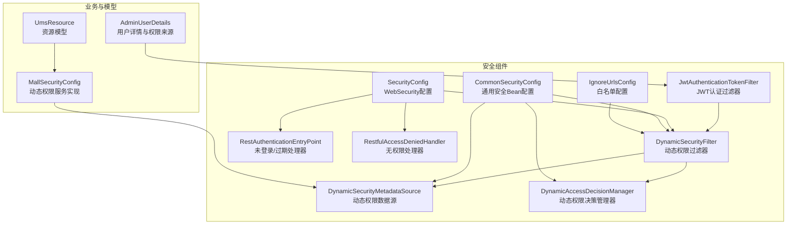
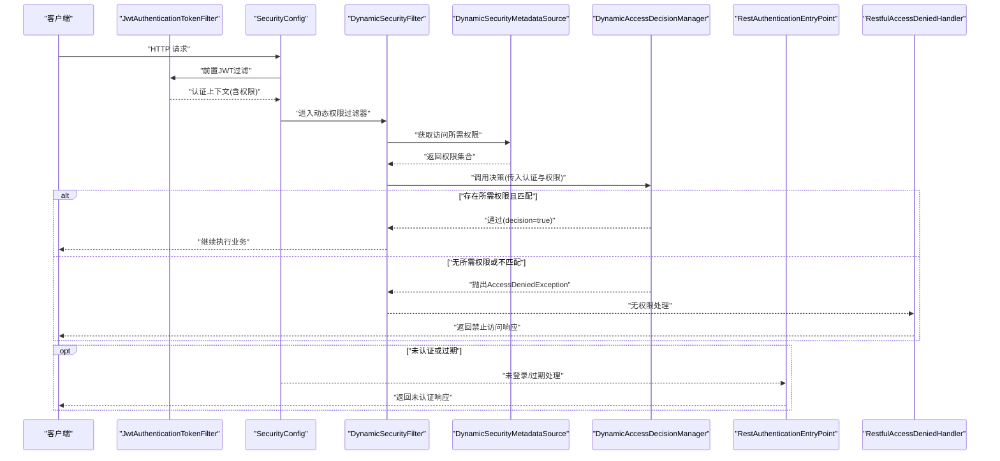
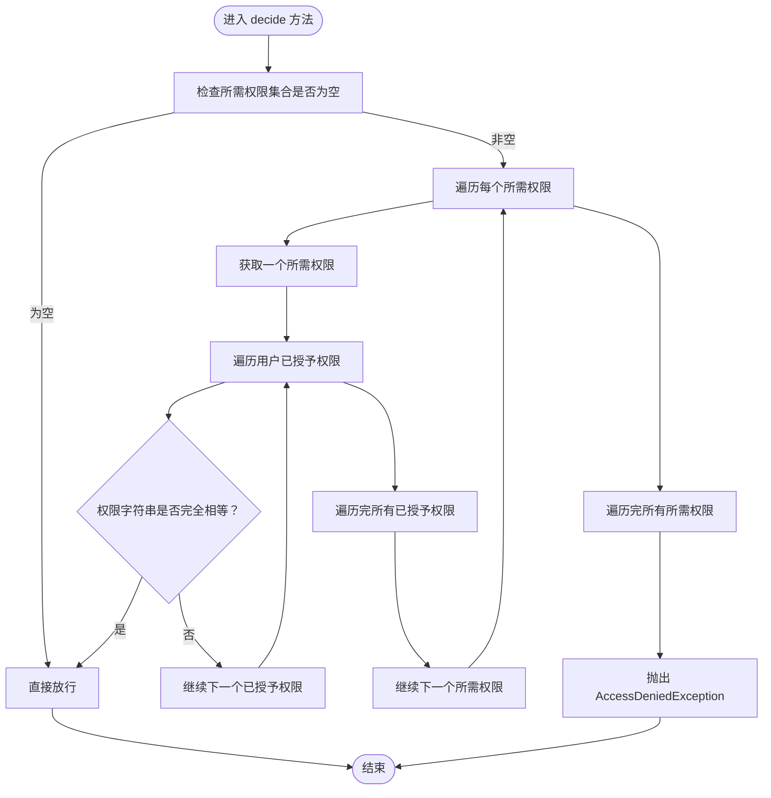
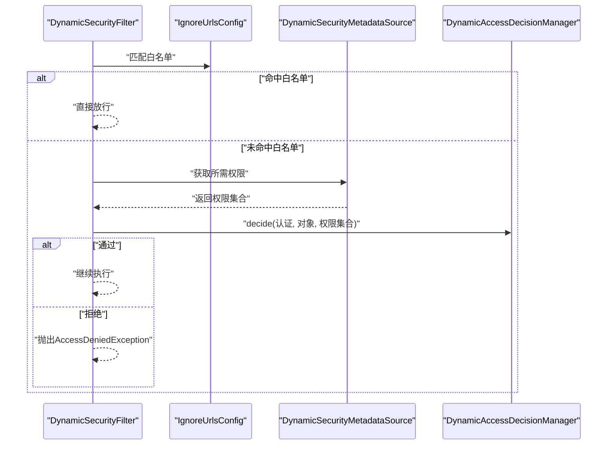
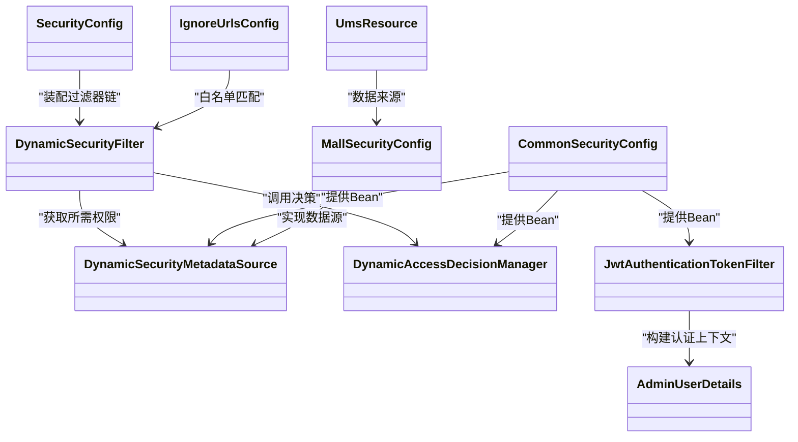
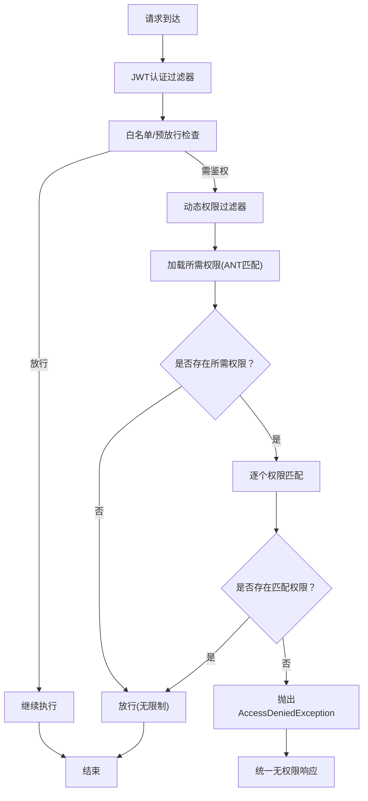

# 权限决策管理器

<cite>
**本文引用的文件**
- [DynamicAccessDecisionManager.java](file://src/main/java/com/macro/mall/tiny/security/component/DynamicAccessDecisionManager.java)
- [DynamicSecurityFilter.java](file://src/main/java/com/macro/mall/tiny/security/component/DynamicSecurityFilter.java)
- [DynamicSecurityMetadataSource.java](file://src/main/java/com/macro/mall/tiny/security/component/DynamicSecurityMetadataSource.java)
- [RestfulAccessDeniedHandler.java](file://src/main/java/com/macro/mall/tiny/security/component/RestfulAccessDeniedHandler.java)
- [RestAuthenticationEntryPoint.java](file://src/main/java/com/macro/mall/tiny/security/component/RestAuthenticationEntryPoint.java)
- [SecurityConfig.java](file://src/main/java/com/macro/mall/tiny/security/config/SecurityConfig.java)
- [CommonSecurityConfig.java](file://src/main/java/com/macro/mall/tiny/security/config/CommonSecurityConfig.java)
- [IgnoreUrlsConfig.java](file://src/main/java/com/macro/mall/tiny/security/config/IgnoreUrlsConfig.java)
- [JwtAuthenticationTokenFilter.java](file://src/main/java/com/macro/mall/tiny/security/component/JwtAuthenticationTokenFilter.java)
- [AdminUserDetails.java](file://src/main/java/com/macro/mall/tiny/domain/AdminUserDetails.java)
- [MallSecurityConfig.java](file://src/main/java/com/macro/mall/tiny/config/MallSecurityConfig.java)
- [UmsResource.java](file://src/main/java/com/macro/mall/tiny/modules/ums/model/UmsResource.java)
- [application.yml](file://src/main/resources/application.yml)
</cite>

## 目录
1. [简介](#简介)
2. [项目结构](#项目结构)
3. [核心组件](#核心组件)
4. [架构总览](#架构总览)
5. [详细组件分析](#详细组件分析)
6. [依赖关系分析](#依赖关系分析)
7. [性能考量](#性能考量)
8. [故障排查指南](#故障排查指南)
9. [结论](#结论)
10. [附录](#附录)

## 简介
本文件围绕权限决策管理器展开，重点解析 DynamicAccessDecisionManager 的实现原理与决策流程，涵盖 AccessDecisionManager 接口的决策算法、权限比对逻辑、投票机制；详细说明 decide 方法的执行流程（空权限检查、权限遍历比较、权限匹配判断）；解释权限匹配的判断条件与返回逻辑；给出权限决策失败的异常处理机制（AccessDeniedException 的抛出时机与错误信息）；并提供从权限获取到最终决策的完整流程图。最后提供配置与扩展指南，覆盖自定义权限规则与多因子认证等高级场景。

## 项目结构
本项目采用分层+模块化组织方式，安全相关组件集中在 security 子包下，配合配置类与领域模型共同完成动态权限控制链路。

图表来源
- [DynamicSecurityFilter.java:1-83](file://src/main/java/com/macro/mall/tiny/security/component/DynamicSecurityFilter.java#L1-L83)
- [DynamicSecurityMetadataSource.java:1-65](file://src/main/java/com/macro/mall/tiny/security/component/DynamicSecurityMetadataSource.java#L1-L65)
- [DynamicAccessDecisionManager.java:1-52](file://src/main/java/com/macro/mall/tiny/security/component/DynamicAccessDecisionManager.java#L1-L52)
- [JwtAuthenticationTokenFilter.java:1-59](file://src/main/java/com/macro/mall/tiny/security/component/JwtAuthenticationTokenFilter.java#L1-L59)
- [RestAuthenticationEntryPoint.java:1-28](file://src/main/java/com/macro/mall/tiny/security/component/RestAuthenticationEntryPoint.java#L1-L28)
- [RestfulAccessDeniedHandler.java:1-30](file://src/main/java/com/macro/mall/tiny/security/component/RestfulAccessDeniedHandler.java#L1-L30)
- [SecurityConfig.java:1-86](file://src/main/java/com/macro/mall/tiny/security/config/SecurityConfig.java#L1-L86)
- [CommonSecurityConfig.java:1-63](file://src/main/java/com/macro/mall/tiny/security/config/CommonSecurityConfig.java#L1-L63)
- [IgnoreUrlsConfig.java:1-22](file://src/main/java/com/macro/mall/tiny/security/config/IgnoreUrlsConfig.java#L1-L22)
- [AdminUserDetails.java:1-87](file://src/main/java/com/macro/mall/tiny/domain/AdminUserDetails.java#L1-L87)
- [MallSecurityConfig.java:32-53](file://src/main/java/com/macro/mall/tiny/config/MallSecurityConfig.java#L32-L53)
- [UmsResource.java:1-49](file://src/main/java/com/macro/mall/tiny/modules/ums/model/UmsResource.java#L1-L49)

章节来源
- [SecurityConfig.java:46-84](file://src/main/java/com/macro/mall/tiny/security/config/SecurityConfig.java#L46-L84)
- [CommonSecurityConfig.java:44-61](file://src/main/java/com/macro/mall/tiny/security/config/CommonSecurityConfig.java#L44-L61)

## 核心组件
- DynamicAccessDecisionManager：实现 AccessDecisionManager 接口，负责在“动态权限过滤器”之后对用户权限与访问所需权限进行比对，决定是否放行。
- DynamicSecurityFilter：继承 AbstractSecurityInterceptor，负责在请求进入时调用 SecurityMetadataSource 获取所需权限，并委托 AccessDecisionManager 进行决策。
- DynamicSecurityMetadataSource：实现 FilterInvocationSecurityMetadataSource，负责加载并匹配资源权限规则（ANT风格路径到权限标识的映射）。
- JwtAuthenticationTokenFilter：负责从请求头提取 JWT 并构建认证上下文，为后续权限决策提供用户权限集合。
- RestAuthenticationEntryPoint 与 RestfulAccessDeniedHandler：分别处理未登录/过期与无权限访问的响应。
- SecurityConfig 与 CommonSecurityConfig：装配上述组件，配置过滤器链、异常处理器与白名单。
- AdminUserDetails：提供用户权限集合（包含多种格式的权限字符串），供认证与决策使用。
- MallSecurityConfig：提供动态权限数据源的实现，将资源表映射为 ANT 路径到权限标识的映射。

章节来源
- [DynamicAccessDecisionManager.java:14-52](file://src/main/java/com/macro/mall/tiny/security/component/DynamicAccessDecisionManager.java#L14-L52)
- [DynamicSecurityFilter.java:19-83](file://src/main/java/com/macro/mall/tiny/security/component/DynamicSecurityFilter.java#L19-L83)
- [DynamicSecurityMetadataSource.java:14-65](file://src/main/java/com/macro/mall/tiny/security/component/DynamicSecurityMetadataSource.java#L14-L65)
- [JwtAuthenticationTokenFilter.java:22-59](file://src/main/java/com/macro/mall/tiny/security/component/JwtAuthenticationTokenFilter.java#L22-L59)
- [RestAuthenticationEntryPoint.java:13-28](file://src/main/java/com/macro/mall/tiny/security/component/RestAuthenticationEntryPoint.java#L13-L28)
- [RestfulAccessDeniedHandler.java:13-30](file://src/main/java/com/macro/mall/tiny/security/component/RestfulAccessDeniedHandler.java#L13-L30)
- [SecurityConfig.java:46-84](file://src/main/java/com/macro/mall/tiny/security/config/SecurityConfig.java#L46-L84)
- [CommonSecurityConfig.java:44-61](file://src/main/java/com/macro/mall/tiny/security/config/CommonSecurityConfig.java#L44-L61)
- [AdminUserDetails.java:13-87](file://src/main/java/com/macro/mall/tiny/domain/AdminUserDetails.java#L13-L87)
- [MallSecurityConfig.java:32-53](file://src/main/java/com/macro/mall/tiny/config/MallSecurityConfig.java#L32-L53)

## 架构总览
下图展示了从请求到达、认证、权限数据加载、到权限决策与异常处理的整体流程。

图表来源
- [JwtAuthenticationTokenFilter.java:37-57](file://src/main/java/com/macro/mall/tiny/security/component/JwtAuthenticationTokenFilter.java#L37-L57)
- [SecurityConfig.java:46-84](file://src/main/java/com/macro/mall/tiny/security/config/SecurityConfig.java#L46-L84)
- [DynamicSecurityFilter.java:39-66](file://src/main/java/com/macro/mall/tiny/security/component/DynamicSecurityFilter.java#L39-L66)
- [DynamicSecurityMetadataSource.java:34-52](file://src/main/java/com/macro/mall/tiny/security/component/DynamicSecurityMetadataSource.java#L34-L52)
- [DynamicAccessDecisionManager.java:20-39](file://src/main/java/com/macro/mall/tiny/security/component/DynamicAccessDecisionManager.java#L20-L39)
- [RestAuthenticationEntryPoint.java:18-26](file://src/main/java/com/macro/mall/tiny/security/component/RestAuthenticationEntryPoint.java#L18-L26)
- [RestfulAccessDeniedHandler.java:18-28](file://src/main/java/com/macro/mall/tiny/security/component/RestfulAccessDeniedHandler.java#L18-L28)

## 详细组件分析

### DynamicAccessDecisionManager 决策算法与流程
- 角色定位：实现 AccessDecisionManager 接口，在“动态权限过滤器”阶段对用户权限与访问所需权限进行比对。
- 决策算法：
  - 若访问所需权限集合为空，则直接放行。
  - 遍历每个所需权限，将其与用户已授予权限逐一比较，若存在完全相等的权限字符串则放行。
  - 若遍历完所有所需权限仍未找到匹配项，则抛出 AccessDeniedException。
- 投票机制：当前实现为“一票否决制”，只要有一个所需权限无法满足即拒绝，无需累计多个投票结果。
- 权限匹配条件：字符串精确相等（去空白后比较），匹配成功即返回。
- 返回逻辑：匹配成功直接返回；遍历完成后仍未匹配则抛出异常。

图表来源
- [DynamicAccessDecisionManager.java:20-39](file://src/main/java/com/macro/mall/tiny/security/component/DynamicAccessDecisionManager.java#L20-L39)

章节来源
- [DynamicAccessDecisionManager.java:14-52](file://src/main/java/com/macro/mall/tiny/security/component/DynamicAccessDecisionManager.java#L14-L52)

### DynamicSecurityFilter 执行流程
- 初始化：注入 DynamicSecurityMetadataSource 与 IgnoreUrlsConfig，并通过 setter 注入 DynamicAccessDecisionManager。
- 过滤逻辑：
  - OPTIONS 请求直接放行。
  - 白名单路径（IgnoreUrlsConfig）直接放行。
  - 调用父类 AbstractSecurityInterceptor 的 beforeInvocation，内部会触发 SecurityMetadataSource 获取所需权限并调用 AccessDecisionManager.decide。
  - 正常放行后续业务链。
- 安全对象类型：FilterInvocation。
- 安全元数据源：DynamicSecurityMetadataSource。

图表来源
- [DynamicSecurityFilter.java:39-66](file://src/main/java/com/macro/mall/tiny/security/component/DynamicSecurityFilter.java#L39-L66)
- [DynamicSecurityMetadataSource.java:34-52](file://src/main/java/com/macro/mall/tiny/security/component/DynamicSecurityMetadataSource.java#L34-L52)
- [DynamicAccessDecisionManager.java:20-39](file://src/main/java/com/macro/mall/tiny/security/component/DynamicAccessDecisionManager.java#L20-L39)
- [IgnoreUrlsConfig.java:14-22](file://src/main/java/com/macro/mall/tiny/security/config/IgnoreUrlsConfig.java#L14-L22)

章节来源
- [DynamicSecurityFilter.java:19-83](file://src/main/java/com/macro/mall/tiny/security/component/DynamicSecurityFilter.java#L19-L83)

### DynamicSecurityMetadataSource 权限规则加载与匹配
- 数据加载：通过 @PostConstruct 调用 DynamicSecurityService.loadDataSource() 将资源表映射为 ANT 路径到权限标识的映射。
- 规则匹配：对当前访问路径进行 ANT 匹配，收集所有匹配的权限条目作为“所需权限集合”返回。
- 缺省行为：若未设置任何权限，则返回空集合，交由决策器按“无所需权限即放行”的策略处理。

章节来源
- [DynamicSecurityMetadataSource.java:24-52](file://src/main/java/com/macro/mall/tiny/security/component/DynamicSecurityMetadataSource.java#L24-L52)
- [MallSecurityConfig.java:40-52](file://src/main/java/com/macro/mall/tiny/config/MallSecurityConfig.java#L40-L52)

### 用户权限来源与格式
- AdminUserDetails 提供用户权限集合，支持三种格式：
  - id:name（与动态权限规则一致）
  - name
  - url
- 这些权限字符串将作为 DynamicAccessDecisionManager 的“已授予权限”参与匹配。

章节来源
- [AdminUserDetails.java:29-55](file://src/main/java/com/macro/mall/tiny/domain/AdminUserDetails.java#L29-L55)

### 异常处理机制
- AccessDeniedException：当权限决策失败时抛出，错误信息为“抱歉，您没有访问权限”。由 RestfulAccessDeniedHandler 统一转换为 JSON 响应。
- 未登录/过期：由 RestAuthenticationEntryPoint 统一转换为 JSON 响应。
- 配置位置：SecurityConfig 中注册 accessDeniedHandler 与 authenticationEntryPoint。

章节来源
- [DynamicAccessDecisionManager.java:38](file://src/main/java/com/macro/mall/tiny/security/component/DynamicAccessDecisionManager.java#L38)
- [RestfulAccessDeniedHandler.java:18-28](file://src/main/java/com/macro/mall/tiny/security/component/RestfulAccessDeniedHandler.java#L18-L28)
- [RestAuthenticationEntryPoint.java:18-26](file://src/main/java/com/macro/mall/tiny/security/component/RestAuthenticationEntryPoint.java#L18-L26)
- [SecurityConfig.java:71-76](file://src/main/java/com/macro/mall/tiny/security/config/SecurityConfig.java#L71-L76)

## 依赖关系分析
- 组件耦合：
  - DynamicSecurityFilter 依赖 DynamicSecurityMetadataSource 与 DynamicAccessDecisionManager。
  - SecurityConfig 将过滤器链路与异常处理器装配到 Spring Security。
  - CommonSecurityConfig 提供默认 Bean，便于扩展与替换。
- 外部依赖：
  - JWT 认证由 JwtAuthenticationTokenFilter 提供，为后续权限决策提供认证上下文。
  - 白名单由 IgnoreUrlsConfig 提供，减少不必要的权限匹配开销。
  - 动态权限数据源由 MallSecurityConfig 中的 DynamicSecurityService 实现提供，来源于 UmsResource 表。

图表来源
- [DynamicSecurityFilter.java:23-33](file://src/main/java/com/macro/mall/tiny/security/component/DynamicSecurityFilter.java#L23-L33)
- [DynamicSecurityMetadataSource.java:21-27](file://src/main/java/com/macro/mall/tiny/security/component/DynamicSecurityMetadataSource.java#L21-L27)
- [DynamicAccessDecisionManager.java:18](file://src/main/java/com/macro/mall/tiny/security/component/DynamicAccessDecisionManager.java#L18)
- [JwtAuthenticationTokenFilter.java:26-57](file://src/main/java/com/macro/mall/tiny/security/component/JwtAuthenticationTokenFilter.java#L26-L57)
- [SecurityConfig.java:46-84](file://src/main/java/com/macro/mall/tiny/security/config/SecurityConfig.java#L46-L84)
- [CommonSecurityConfig.java:44-61](file://src/main/java/com/macro/mall/tiny/security/config/CommonSecurityConfig.java#L44-L61)
- [IgnoreUrlsConfig.java:14-22](file://src/main/java/com/macro/mall/tiny/security/config/IgnoreUrlsConfig.java#L14-L22)
- [AdminUserDetails.java:17-55](file://src/main/java/com/macro/mall/tiny/domain/AdminUserDetails.java#L17-L55)
- [MallSecurityConfig.java:40-52](file://src/main/java/com/macro/mall/tiny/config/MallSecurityConfig.java#L40-L52)
- [UmsResource.java:25-49](file://src/main/java/com/macro/mall/tiny/modules/ums/model/UmsResource.java#L25-L49)

章节来源
- [SecurityConfig.java:46-84](file://src/main/java/com/macro/mall/tiny/security/config/SecurityConfig.java#L46-L84)
- [CommonSecurityConfig.java:44-61](file://src/main/java/com/macro/mall/tiny/security/config/CommonSecurityConfig.java#L44-L61)

## 性能考量
- 白名单与预放行：通过 IgnoreUrlsConfig 与 OPTIONS 预放行减少不必要的权限匹配。
- 动态权限缓存：DynamicSecurityMetadataSource 在首次访问时加载数据源，建议结合缓存策略降低频繁查询成本。
- 权限匹配复杂度：当前实现为 O(N×M)（N 为所需权限数，M 为用户权限数），可通过索引化或权限前缀归并优化。
- 过滤器链顺序：确保 JWT 过滤器在动态权限过滤器之前执行，避免重复认证与权限计算。

## 故障排查指南
- 无权限访问：
  - 确认请求路径是否命中白名单或 OPTIONS 预放行。
  - 检查动态权限规则是否正确加载（MallSecurityConfig 的数据源实现）。
  - 核对用户权限格式（id:name、name、url）与规则是否一致。
- 未登录/过期：
  - 检查请求头 Authorization 是否携带正确的 Token 前缀。
  - 核对 JWT 配置（tokenHeader、tokenHead、secret、expiration）。
- 响应格式：
  - 无权限与未登录均返回 JSON，可依据响应体字段定位问题。

章节来源
- [DynamicSecurityFilter.java:46-58](file://src/main/java/com/macro/mall/tiny/security/component/DynamicSecurityFilter.java#L46-L58)
- [MallSecurityConfig.java:40-52](file://src/main/java/com/macro/mall/tiny/config/MallSecurityConfig.java#L40-L52)
- [AdminUserDetails.java:30-54](file://src/main/java/com/macro/mall/tiny/domain/AdminUserDetails.java#L30-L54)
- [application.yml:24-28](file://src/main/resources/application.yml#L24-L28)
- [application.yml:38-57](file://src/main/resources/application.yml#L38-L57)

## 结论
DynamicAccessDecisionManager 采用简洁明确的一致性匹配策略，结合 DynamicSecurityFilter 与 DynamicSecurityMetadataSource 形成完整的动态权限控制闭环。通过 JWT 认证提供权限基础，配合白名单与异常处理器，既保证了灵活性，也兼顾了易用性。对于高并发场景，建议引入缓存与索引优化，并在规则设计上尽量减少冗余匹配。

## 附录

### 权限决策流程图（从权限获取到最终决策）

图表来源
- [DynamicSecurityFilter.java:39-66](file://src/main/java/com/macro/mall/tiny/security/component/DynamicSecurityFilter.java#L39-L66)
- [DynamicSecurityMetadataSource.java:34-52](file://src/main/java/com/macro/mall/tiny/security/component/DynamicSecurityMetadataSource.java#L34-L52)
- [DynamicAccessDecisionManager.java:20-39](file://src/main/java/com/macro/mall/tiny/security/component/DynamicAccessDecisionManager.java#L20-L39)
- [RestfulAccessDeniedHandler.java:18-28](file://src/main/java/com/macro/mall/tiny/security/component/RestfulAccessDeniedHandler.java#L18-L28)

### 配置与扩展指南
- 自定义权限规则：
  - 在 MallSecurityConfig 的 DynamicSecurityService 实现中调整资源到权限的映射策略（例如增加 method、tenant 等维度）。
  - 通过 IgnoreUrlsConfig 增加白名单路径，减少权限匹配开销。
- 多因子认证（MFA）集成：
  - 在 JwtAuthenticationTokenFilter 之后增加二次校验（如短信/邮件验证码），在认证上下文中附加额外属性，再由决策器根据上下文属性决定放行。
- 动态权限刷新：
  - 通过 DynamicSecurityMetadataSource 的 clearDataSource 与 @PostConstruct 重新加载，或在运行时触发重建。
- 响应定制：
  - 可替换 RestfulAccessDeniedHandler 与 RestAuthenticationEntryPoint，以适配不同前端或网关的错误码规范。

章节来源
- [MallSecurityConfig.java:40-52](file://src/main/java/com/macro/mall/tiny/config/MallSecurityConfig.java#L40-L52)
- [IgnoreUrlsConfig.java:14-22](file://src/main/java/com/macro/mall/tiny/security/config/IgnoreUrlsConfig.java#L14-L22)
- [JwtAuthenticationTokenFilter.java:37-57](file://src/main/java/com/macro/mall/tiny/security/component/JwtAuthenticationTokenFilter.java#L37-L57)
- [DynamicSecurityMetadataSource.java:24-32](file://src/main/java/com/macro/mall/tiny/security/component/DynamicSecurityMetadataSource.java#L24-L32)
- [RestfulAccessDeniedHandler.java:18-28](file://src/main/java/com/macro/mall/tiny/security/component/RestfulAccessDeniedHandler.java#L18-L28)
- [RestAuthenticationEntryPoint.java:18-26](file://src/main/java/com/macro/mall/tiny/security/component/RestAuthenticationEntryPoint.java#L18-L26)