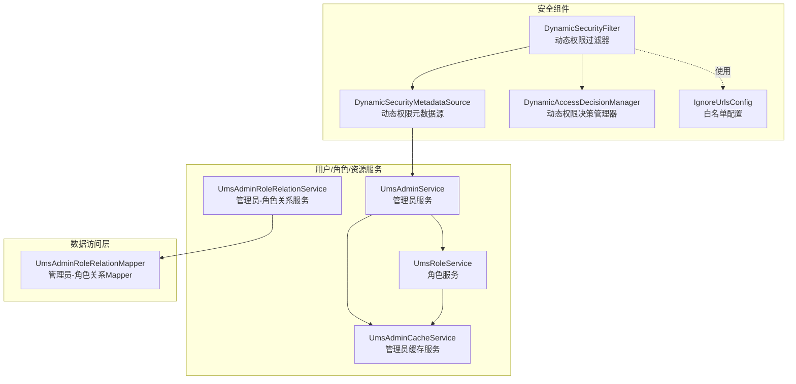
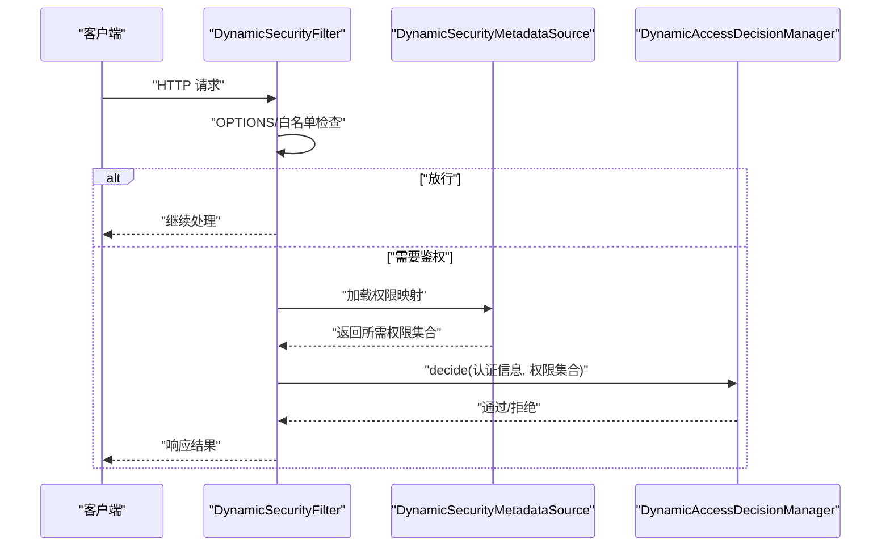
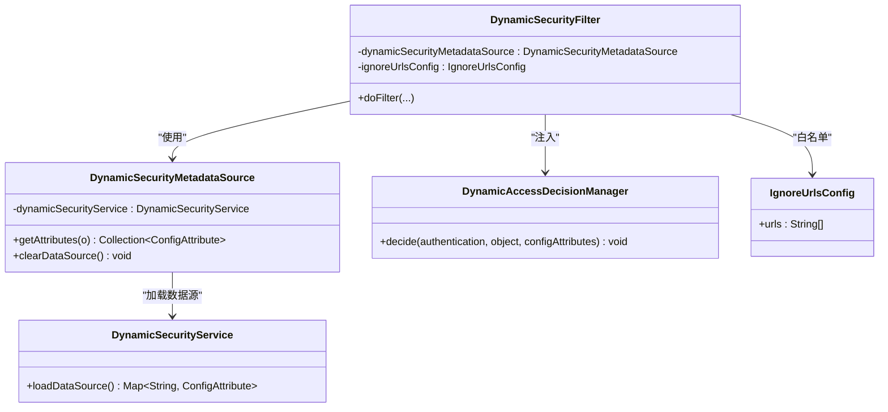
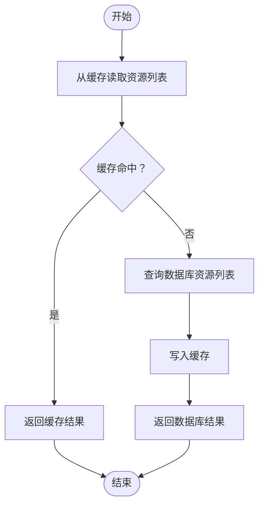
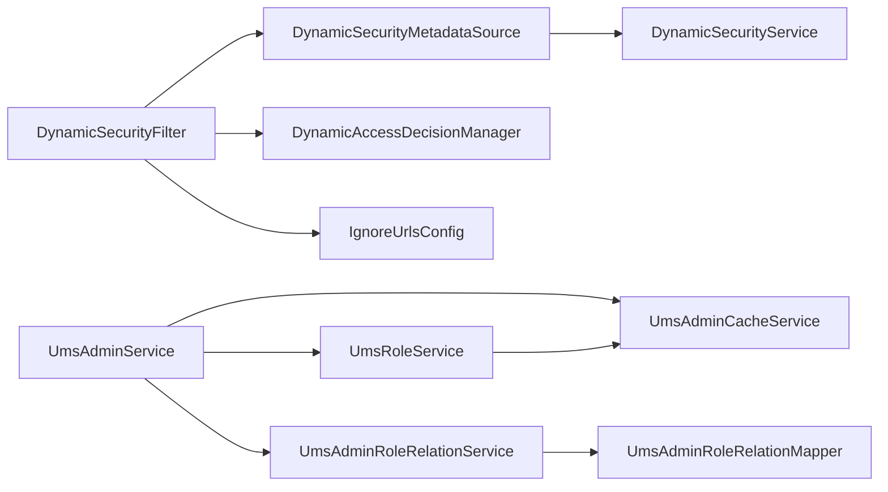

# 权限服务层

<cite>
**本文引用的文件**
- [DynamicSecurityService.java](file://src/main/java/com/macro/mall/tiny/security/component/DynamicSecurityService.java)
- [DynamicSecurityFilter.java](file://src/main/java/com/macro/mall/tiny/security/component/DynamicSecurityFilter.java)
- [DynamicSecurityMetadataSource.java](file://src/main/java/com/macro/mall/tiny/security/component/DynamicSecurityMetadataSource.java)
- [DynamicAccessDecisionManager.java](file://src/main/java/com/macro/mall/tiny/security/component/DynamicAccessDecisionManager.java)
- [IgnoreUrlsConfig.java](file://src/main/java/com/macro/mall/tiny/security/config/IgnoreUrlsConfig.java)
- [UmsAdminService.java](file://src/main/java/com/macro/mall/tiny/modules/ums/service/UmsAdminService.java)
- [UmsAdminServiceImpl.java](file://src/main/java/com/macro/mall/tiny/modules/ums/service/impl/UmsAdminServiceImpl.java)
- [UmsRoleService.java](file://src/main/java/com/macro/mall/tiny/modules/ums/service/UmsRoleService.java)
- [UmsRoleServiceImpl.java](file://src/main/java/com/macro/mall/tiny/modules/ums/service/impl/UmsRoleServiceImpl.java)
- [UmsAdminRoleRelationService.java](file://src/main/java/com/macro/mall/tiny/modules/ums/service/UmsAdminRoleRelationService.java)
- [UmsAdminRoleRelationServiceImpl.java](file://src/main/java/com/macro/mall/tiny/modules/ums/service/impl/UmsAdminRoleRelationServiceImpl.java)
- [UmsAdminCacheService.java](file://src/main/java/com/macro/mall/tiny/modules/ums/service/UmsAdminCacheService.java)
- [UmsAdminCacheServiceImpl.java](file://src/main/java/com/macro/mall/tiny/modules/ums/service/impl/UmsAdminCacheServiceImpl.java)
- [UmsAdminRoleRelationMapper.java](file://src/main/java/com/macro/mall/tiny/modules/ums/mapper/UmsAdminRoleRelationMapper.java)
- [application.yml](file://src/main/resources/application.yml)
</cite>

## 目录
1. [引言](#引言)
2. [项目结构](#项目结构)
3. [核心组件](#核心组件)
4. [架构总览](#架构总览)
5. [详细组件分析](#详细组件分析)
6. [依赖分析](#依赖分析)
7. [性能考虑](#性能考虑)
8. [故障排查指南](#故障排查指南)
9. [结论](#结论)
10. [附录](#附录)

## 引言
本文件面向权限服务层，系统性阐述动态权限（基于资源路径与角色授权）的设计理念、核心功能与实现细节。重点覆盖以下方面：
- DynamicSecurityService 接口及其在运行时加载资源权限映射的作用
- 基于路径匹配的动态权限过滤链路：过滤器、元数据源、决策管理器
- 角色与资源的分配与缓存同步机制
- 与数据访问层的交互模式：事务、批量写入、缓存失效
- 可扩展点：自定义权限规则、权限计算策略、权限验证扩展
- 性能优化：批量操作、异步处理建议、缓存利用
- 测试策略与质量保障：单元测试与集成测试最佳实践

## 项目结构
权限服务层位于 security 组件与 ums 模块的服务实现之间，形成“动态权限过滤链 + 用户/角色/资源服务 + 缓存 + 数据访问”的完整闭环。

图表来源
- [DynamicSecurityFilter.java:1-83](file://src/main/java/com/macro/mall/tiny/security/component/DynamicSecurityFilter.java#L1-L83)
- [DynamicSecurityMetadataSource.java:1-65](file://src/main/java/com/macro/mall/tiny/security/component/DynamicSecurityMetadataSource.java#L1-L65)
- [DynamicAccessDecisionManager.java:1-52](file://src/main/java/com/macro/mall/tiny/security/component/DynamicAccessDecisionManager.java#L1-L52)
- [IgnoreUrlsConfig.java:1-22](file://src/main/java/com/macro/mall/tiny/security/config/IgnoreUrlsConfig.java#L1-L22)
- [UmsAdminService.java:1-90](file://src/main/java/com/macro/mall/tiny/modules/ums/service/UmsAdminService.java#L1-L90)
- [UmsRoleService.java:1-59](file://src/main/java/com/macro/mall/tiny/modules/ums/service/UmsRoleService.java#L1-L59)
- [UmsAdminRoleRelationService.java:1-12](file://src/main/java/com/macro/mall/tiny/modules/ums/service/UmsAdminRoleRelationService.java#L1-L12)
- [UmsAdminCacheService.java:1-116](file://src/main/java/com/macro/mall/tiny/modules/ums/service/UmsAdminCacheService.java#L1-L116)
- [UmsAdminRoleRelationMapper.java:1-22](file://src/main/java/com/macro/mall/tiny/modules/ums/mapper/UmsAdminRoleRelationMapper.java#L1-L22)

章节来源
- [application.yml:38-57](file://src/main/resources/application.yml#L38-L57)

## 核心组件
- 动态权限接口与过滤链
  - DynamicSecurityService：定义运行时加载“资源ANT模式 → 权限标识”映射的方法
  - DynamicSecurityFilter：拦截HTTP请求，支持OPTIONS直放行与白名单放行，委托决策管理器进行鉴权
  - DynamicSecurityMetadataSource：持有并按需加载权限映射；根据请求路径匹配资源模式，返回所需权限集合
  - DynamicAccessDecisionManager：遍历所需权限与用户已授予权限，匹配则通过，否则拒绝
  - IgnoreUrlsConfig：白名单路径配置，来源于应用配置
- 用户/角色/资源服务
  - UmsAdminService：提供登录、注册、角色分配、资源查询、密码更新等能力；与缓存服务协作
  - UmsRoleService：提供角色增删改查、菜单/资源分配；分配时触发缓存失效
  - UmsAdminRoleRelationService：管理员-角色关系的CRUD服务
  - UmsAdminCacheService：基于Redis的管理员与资源列表缓存，提供读取与失效
- 配置
  - application.yml：声明白名单路径、JWT参数、Redis键空间与过期时间

章节来源
- [DynamicSecurityService.java:1-17](file://src/main/java/com/macro/mall/tiny/security/component/DynamicSecurityService.java#L1-L17)
- [DynamicSecurityFilter.java:1-83](file://src/main/java/com/macro/mall/tiny/security/component/DynamicSecurityFilter.java#L1-L83)
- [DynamicSecurityMetadataSource.java:1-65](file://src/main/java/com/macro/mall/tiny/security/component/DynamicSecurityMetadataSource.java#L1-L65)
- [DynamicAccessDecisionManager.java:1-52](file://src/main/java/com/macro/mall/tiny/security/component/DynamicAccessDecisionManager.java#L1-L52)
- [IgnoreUrlsConfig.java:1-22](file://src/main/java/com/macro/mall/tiny/security/config/IgnoreUrlsConfig.java#L1-L22)
- [UmsAdminService.java:1-90](file://src/main/java/com/macro/mall/tiny/modules/ums/service/UmsAdminService.java#L1-L90)
- [UmsRoleService.java:1-59](file://src/main/java/com/macro/mall/tiny/modules/ums/service/UmsRoleService.java#L1-L59)
- [UmsAdminRoleRelationService.java:1-12](file://src/main/java/com/macro/mall/tiny/modules/ums/service/UmsAdminRoleRelationService.java#L1-L12)
- [UmsAdminCacheService.java:1-116](file://src/main/java/com/macro/mall/tiny/modules/ums/service/UmsAdminCacheService.java#L1-L116)
- [application.yml:38-57](file://src/main/resources/application.yml#L38-L57)

## 架构总览
动态权限过滤链在请求进入时执行：
- 白名单与预检请求直接放行
- 其余请求由元数据源加载资源权限映射，匹配当前URL对应的权限集合
- 决策管理器对比用户权限与所需权限，决定放行或拒绝

图表来源
- [DynamicSecurityFilter.java:40-66](file://src/main/java/com/macro/mall/tiny/security/component/DynamicSecurityFilter.java#L40-L66)
- [DynamicSecurityMetadataSource.java:34-52](file://src/main/java/com/macro/mall/tiny/security/component/DynamicSecurityMetadataSource.java#L34-L52)
- [DynamicAccessDecisionManager.java:20-39](file://src/main/java/com/macro/mall/tiny/security/component/DynamicAccessDecisionManager.java#L20-L39)

## 详细组件分析

### 动态权限接口与过滤链
- DynamicSecurityService
  - 职责：提供运行时加载“资源ANT模式 → 权限标识”的映射
  - 设计要点：接口最小化，职责单一，便于替换不同加载策略（如数据库、配置中心）
- DynamicSecurityFilter
  - 职责：统一入口过滤，支持跨域预检与白名单快速放行，委托鉴权
  - 关键流程：构造FilterInvocation → 白名单匹配 → beforeInvocation → 放行 → afterInvocation
- DynamicSecurityMetadataSource
  - 职责：持有静态权限映射表；首次使用时通过DynamicSecurityService加载；按ANT路径匹配返回权限集合
  - 关键流程：PostConstruct加载 → 懒加载 → PathMatcher匹配 → 返回集合
- DynamicAccessDecisionManager
  - 职责：基于所需权限与用户已授予权限进行比对，匹配即通过，否则拒绝
  - 关键流程：空权限集合直接放行 → 遍历所需权限 → 对比用户权限 → 抛出拒绝异常
- IgnoreUrlsConfig
  - 职责：从配置文件读取白名单路径集合，供过滤器使用

图表来源
- [DynamicSecurityService.java:11-16](file://src/main/java/com/macro/mall/tiny/security/component/DynamicSecurityService.java#L11-L16)
- [DynamicSecurityFilter.java:23-82](file://src/main/java/com/macro/mall/tiny/security/component/DynamicSecurityFilter.java#L23-L82)
- [DynamicSecurityMetadataSource.java:18-64](file://src/main/java/com/macro/mall/tiny/security/component/DynamicSecurityMetadataSource.java#L18-L64)
- [DynamicAccessDecisionManager.java:18-51](file://src/main/java/com/macro/mall/tiny/security/component/DynamicAccessDecisionManager.java#L18-L51)
- [IgnoreUrlsConfig.java:14-21](file://src/main/java/com/macro/mall/tiny/security/config/IgnoreUrlsConfig.java#L14-L21)

章节来源
- [DynamicSecurityService.java:1-17](file://src/main/java/com/macro/mall/tiny/security/component/DynamicSecurityService.java#L1-L17)
- [DynamicSecurityFilter.java:1-83](file://src/main/java/com/macro/mall/tiny/security/component/DynamicSecurityFilter.java#L1-L83)
- [DynamicSecurityMetadataSource.java:1-65](file://src/main/java/com/macro/mall/tiny/security/component/DynamicSecurityMetadataSource.java#L1-L65)
- [DynamicAccessDecisionManager.java:1-52](file://src/main/java/com/macro/mall/tiny/security/component/DynamicAccessDecisionManager.java#L1-L52)
- [IgnoreUrlsConfig.java:1-22](file://src/main/java/com/macro/mall/tiny/security/config/IgnoreUrlsConfig.java#L1-L22)

### 用户/角色/资源服务与缓存
- UmsAdminService
  - 权限查询：通过UmsResourceMapper查询用户可访问资源，优先从缓存读取，未命中再查询数据库并回填缓存
  - 角色管理：批量删除管理员-角色关系，再批量保存新的关系；更新后清理相关缓存
  - 登录与刷新：生成JWT，记录登录日志
- UmsRoleService
  - 菜单/资源分配：先删除旧关系，再批量插入新关系；分配资源后清理相关缓存
  - 角色删除：删除角色后清理受影响的资源缓存
- UmsAdminCacheService
  - 提供管理员对象与资源列表的缓存读写与失效
  - 多种失效策略：按管理员、按角色、按资源维度批量失效
- UmsAdminRoleRelationService
  - 基于MyBatis-Plus的通用Service实现，支撑管理员-角色关系的批量写入与删除

图表来源
- [UmsAdminServiceImpl.java:221-231](file://src/main/java/com/macro/mall/tiny/modules/ums/service/impl/UmsAdminServiceImpl.java#L221-L231)
- [UmsAdminCacheServiceImpl.java:104-114](file://src/main/java/com/macro/mall/tiny/modules/ums/service/impl/UmsAdminCacheServiceImpl.java#L104-L114)

章节来源
- [UmsAdminService.java:1-90](file://src/main/java/com/macro/mall/tiny/modules/ums/service/UmsAdminService.java#L1-L90)
- [UmsAdminServiceImpl.java:1-272](file://src/main/java/com/macro/mall/tiny/modules/ums/service/impl/UmsAdminServiceImpl.java#L1-L272)
- [UmsRoleService.java:1-59](file://src/main/java/com/macro/mall/tiny/modules/ums/service/UmsRoleService.java#L1-L59)
- [UmsRoleServiceImpl.java:1-117](file://src/main/java/com/macro/mall/tiny/modules/ums/service/impl/UmsRoleServiceImpl.java#L1-L117)
- [UmsAdminCacheService.java:1-116](file://src/main/java/com/macro/mall/tiny/modules/ums/service/UmsAdminCacheService.java#L1-L116)
- [UmsAdminCacheServiceImpl.java:1-116](file://src/main/java/com/macro/mall/tiny/modules/ums/service/impl/UmsAdminCacheServiceImpl.java#L1-L116)
- [UmsAdminRoleRelationService.java:1-12](file://src/main/java/com/macro/mall/tiny/modules/ums/service/UmsAdminRoleRelationService.java#L1-L12)
- [UmsAdminRoleRelationServiceImpl.java:1-16](file://src/main/java/com/macro/mall/tiny/modules/ums/service/impl/UmsAdminRoleRelationServiceImpl.java#L1-L16)
- [UmsAdminRoleRelationMapper.java:1-22](file://src/main/java/com/macro/mall/tiny/modules/ums/mapper/UmsAdminRoleRelationMapper.java#L1-L22)

### 业务逻辑实现要点
- 权限数据的业务处理
  - 用户登录后，系统加载其资源列表并封装为UserDetails，后续鉴权时由决策管理器比对
  - 资源列表优先从缓存读取，减少数据库压力
- 权限关系的计算
  - 角色到资源的分配采用“先清后批”的策略，确保关系一致性
  - 管理员角色变更后，清理其资源缓存，避免脏读
- 权限状态的维护
  - 删除角色/资源或修改分配时，触发多维缓存失效，确保缓存与数据库一致

章节来源
- [UmsAdminServiceImpl.java:256-265](file://src/main/java/com/macro/mall/tiny/modules/ums/service/impl/UmsAdminServiceImpl.java#L256-L265)
- [UmsRoleServiceImpl.java:98-115](file://src/main/java/com/macro/mall/tiny/modules/ums/service/impl/UmsRoleServiceImpl.java#L98-L115)
- [UmsAdminCacheServiceImpl.java:52-90](file://src/main/java/com/macro/mall/tiny/modules/ums/service/impl/UmsAdminCacheServiceImpl.java#L52-L90)

### 与数据访问层的交互模式
- 权限数据的持久化
  - 管理员-角色关系：通过UmsAdminRoleRelationService批量写入，保证原子性
  - 角色-菜单/资源关系：通过对应关系Service批量写入
- 缓存同步
  - 写入成功后，按管理员、角色、资源维度主动失效缓存，确保强一致
- 事务管理
  - 角色分配与管理员角色变更标注@Transactional，确保失败回滚

章节来源
- [UmsAdminRoleRelationService.java:1-12](file://src/main/java/com/macro/mall/tiny/modules/ums/service/UmsAdminRoleRelationService.java#L1-L12)
- [UmsRoleService.java:50-57](file://src/main/java/com/macro/mall/tiny/modules/ums/service/UmsRoleService.java#L50-L57)
- [UmsAdminService.java:62-63](file://src/main/java/com/macro/mall/tiny/modules/ums/service/UmsAdminService.java#L62-L63)

### 扩展接口设计
- 自定义权限规则
  - 在DynamicSecurityService中实现自定义的数据源加载策略（如从配置中心、内存缓存、数据库动态表等）
- 权限计算策略
  - 在DynamicAccessDecisionManager中扩展更复杂的权限计算（如AND/OR组合、层级继承、动态权重）
- 权限验证扩展
  - 在DynamicSecurityMetadataSource中扩展匹配策略（如正则、前缀、后缀、通配符混合）

章节来源
- [DynamicSecurityService.java:11-16](file://src/main/java/com/macro/mall/tiny/security/component/DynamicSecurityService.java#L11-L16)
- [DynamicAccessDecisionManager.java:18-51](file://src/main/java/com/macro/mall/tiny/security/component/DynamicAccessDecisionManager.java#L18-L51)
- [DynamicSecurityMetadataSource.java:34-52](file://src/main/java/com/macro/mall/tiny/security/component/DynamicSecurityMetadataSource.java#L34-L52)

## 依赖分析
- 组件耦合
  - 过滤器依赖元数据源与决策管理器；元数据源依赖动态权限服务；过滤器依赖白名单配置
  - 管理员服务依赖角色服务、缓存服务与资源/角色Mapper；角色服务依赖关系Service与缓存服务
- 外部依赖
  - Spring Security：过滤器、认证上下文、权限模型
  - MyBatis-Plus：通用Service与批量操作
  - Redis：缓存读写与失效

图表来源
- [DynamicSecurityFilter.java:23-82](file://src/main/java/com/macro/mall/tiny/security/component/DynamicSecurityFilter.java#L23-L82)
- [DynamicSecurityMetadataSource.java:18-64](file://src/main/java/com/macro/mall/tiny/security/component/DynamicSecurityMetadataSource.java#L18-L64)
- [DynamicAccessDecisionManager.java:18-51](file://src/main/java/com/macro/mall/tiny/security/component/DynamicAccessDecisionManager.java#L18-L51)
- [IgnoreUrlsConfig.java:14-21](file://src/main/java/com/macro/mall/tiny/security/config/IgnoreUrlsConfig.java#L14-L21)
- [UmsAdminService.java:1-90](file://src/main/java/com/macro/mall/tiny/modules/ums/service/UmsAdminService.java#L1-L90)
- [UmsRoleService.java:1-59](file://src/main/java/com/macro/mall/tiny/modules/ums/service/UmsRoleService.java#L1-L59)
- [UmsAdminCacheService.java:1-116](file://src/main/java/com/macro/mall/tiny/modules/ums/service/UmsAdminCacheService.java#L1-L116)
- [UmsAdminRoleRelationService.java:1-12](file://src/main/java/com/macro/mall/tiny/modules/ums/service/UmsAdminRoleRelationService.java#L1-L12)
- [UmsAdminRoleRelationMapper.java:1-22](file://src/main/java/com/macro/mall/tiny/modules/ums/mapper/UmsAdminRoleRelationMapper.java#L1-L22)

## 性能考虑
- 批量操作
  - 管理员-角色关系与角色-菜单/资源关系采用批量写入，降低数据库往返次数
- 缓存利用
  - 管理员对象与资源列表缓存显著降低鉴权与查询开销；提供多维失效策略，避免脏读
- 异步处理建议
  - 缓存失效可结合消息队列异步化，进一步削峰填谷（扩展点）
- 事务边界
  - 角色分配与管理员角色变更置于事务内，保证一致性与回滚成本可控

章节来源
- [UmsAdminRoleRelationService.java:1-12](file://src/main/java/com/macro/mall/tiny/modules/ums/service/UmsAdminRoleRelationService.java#L1-L12)
- [UmsRoleServiceImpl.java:86-95](file://src/main/java/com/macro/mall/tiny/modules/ums/service/impl/UmsRoleServiceImpl.java#L86-L95)
- [UmsAdminCacheServiceImpl.java:104-114](file://src/main/java/com/macro/mall/tiny/modules/ums/service/impl/UmsAdminCacheServiceImpl.java#L104-L114)

## 故障排查指南
- 访问被拒绝
  - 检查请求是否命中白名单；确认元数据源是否加载成功；核对用户权限与所需权限是否一致
- 权限不生效
  - 确认角色-资源分配是否完成；检查缓存是否未失效；查看缓存键空间与过期时间配置
- 登录失败
  - 核对用户名是否存在、密码是否匹配、账户是否启用；检查JWT生成与头部携带格式

章节来源
- [DynamicSecurityFilter.java:40-66](file://src/main/java/com/macro/mall/tiny/security/component/DynamicSecurityFilter.java#L40-L66)
- [DynamicAccessDecisionManager.java:20-39](file://src/main/java/com/macro/mall/tiny/security/component/DynamicAccessDecisionManager.java#L20-L39)
- [UmsAdminServiceImpl.java:98-119](file://src/main/java/com/macro/mall/tiny/modules/ums/service/impl/UmsAdminServiceImpl.java#L98-L119)
- [application.yml:38-57](file://src/main/resources/application.yml#L38-L57)

## 结论
本权限服务层以“动态权限接口 + 过滤链 + 缓存 + 关系服务”为核心，实现了灵活、可扩展且高性能的权限控制方案。通过清晰的职责划分与完善的缓存同步机制，既能满足复杂权限场景，又具备良好的可维护性与扩展性。

## 附录
- 测试策略与质量保证
  - 单元测试
    - 动态权限过滤链：构造FilterInvocation与Mock认证信息，验证白名单、预检、鉴权分支
    - 权限决策管理器：构造所需权限与用户权限集合，断言通过/拒绝行为
    - 用户/角色服务：模拟登录、角色分配、资源查询，断言缓存读写与失效
  - 集成测试
    - 启动完整Spring上下文，配置白名单与JWT，发起HTTP请求验证过滤链与鉴权
    - 验证角色-资源分配后缓存一致性与数据库一致性

[本节为通用指导，无需特定文件引用]