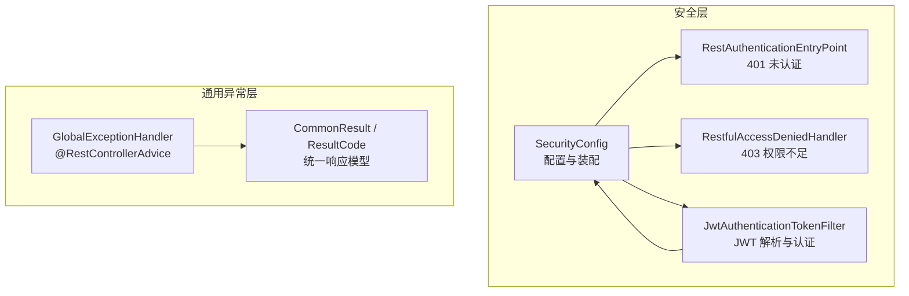
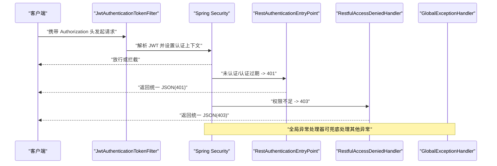
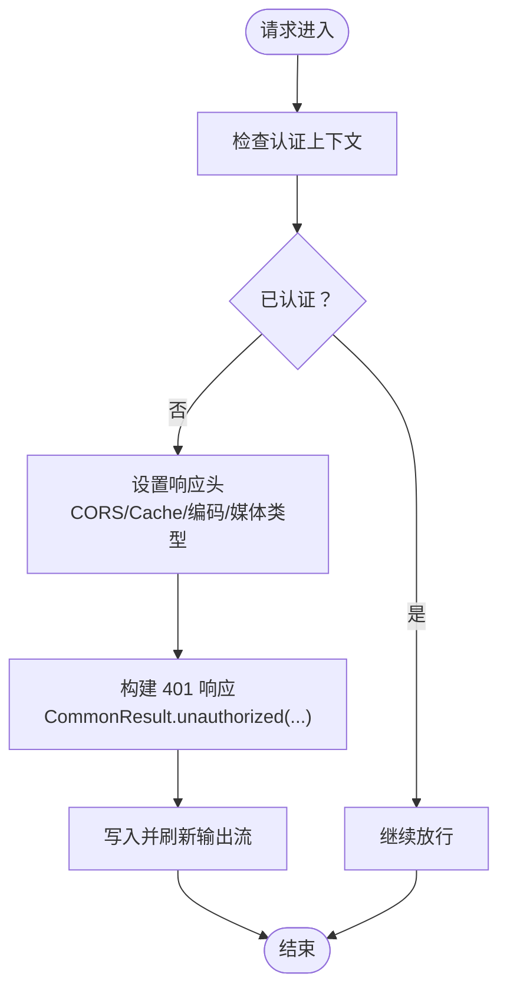
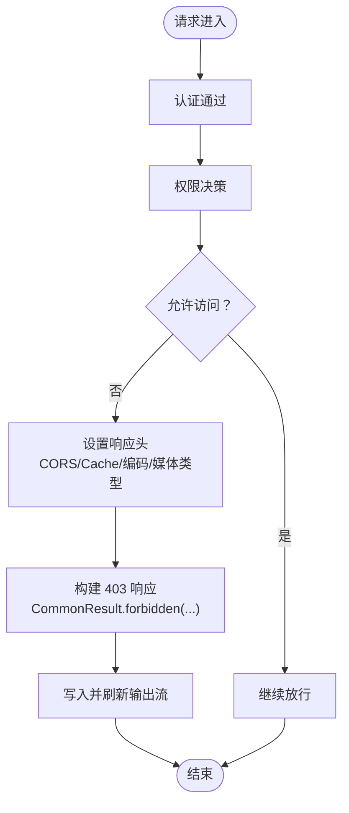
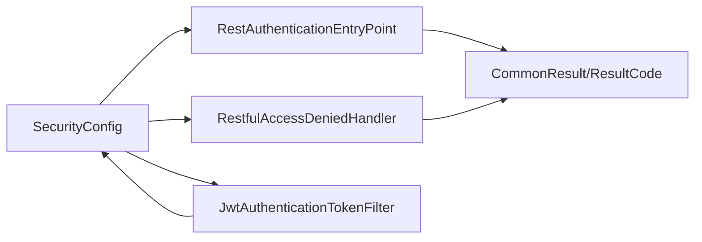
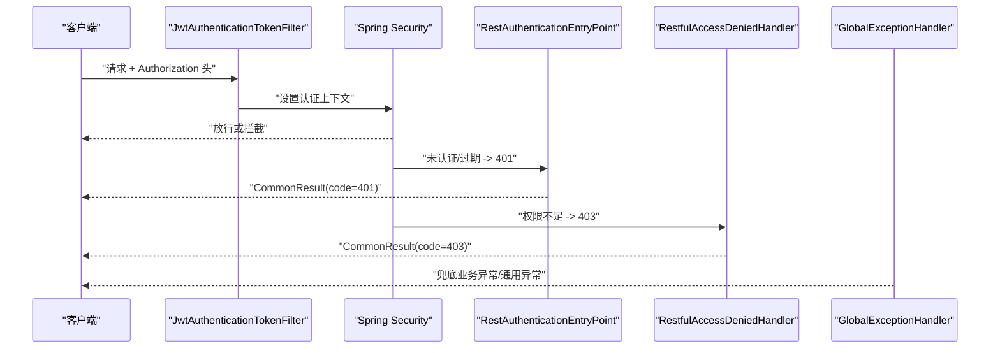

# 安全异常处理

<cite>
**本文引用的文件**
- [RestAuthenticationEntryPoint.java](file://src/main/java/com/macro/mall/tiny/security/component/RestAuthenticationEntryPoint.java)
- [RestfulAccessDeniedHandler.java](file://src/main/java/com/macro/mall/tiny/security/component/RestfulAccessDeniedHandler.java)
- [SecurityConfig.java](file://src/main/java/com/macro/mall/tiny/security/config/SecurityConfig.java)
- [JwtAuthenticationTokenFilter.java](file://src/main/java/com/macro/mall/tiny/security/component/JwtAuthenticationTokenFilter.java)
- [GlobalExceptionHandler.java](file://src/main/java/com/macro/mall/tiny/common/exception/GlobalExceptionHandler.java)
- [CommonResult.java](file://src/main/java/com/macro/mall/tiny/common/api/CommonResult.java)
- [ResultCode.java](file://src/main/java/com/macro/mall/tiny/common/api/ResultCode.java)
- [IErrorCode.java](file://src/main/java/com/macro/mall/tiny/common/api/IErrorCode.java)
- [ApiException.java](file://src/main/java/com/macro/mall/tiny/common/exception/ApiException.java)
- [Asserts.java](file://src/main/java/com/macro/mall/tiny/common/exception/Asserts.java)
- [application.yml](file://src/main/resources/application.yml)
- [GlobalExceptionHandlerTest.java](file://src/test/java/com/macro/mall/tiny/common/exception/GlobalExceptionHandlerTest.java)
</cite>

## 目录
1. [简介](#简介)
2. [项目结构](#项目结构)
3. [核心组件](#核心组件)
4. [架构总览](#架构总览)
5. [详细组件分析](#详细组件分析)
6. [依赖分析](#依赖分析)
7. [性能考虑](#性能考虑)
8. [故障排查指南](#故障排查指南)
9. [结论](#结论)
10. [附录](#附录)

## 简介
本文件聚焦于系统的安全异常处理机制，围绕以下目标展开：
- 深入解析 RestAuthenticationEntryPoint 认证入口点：未认证用户的处理策略、401 状态码返回、错误信息格式化。
- 详解 RestfulAccessDeniedHandler 访问拒绝处理器：权限不足用户的处理流程、403 响应、权限错误提示。
- 总结安全异常的统一处理模式：异常类型分类、错误码定义、国际化支持现状与建议。
- 区分安全异常与业务异常：异常转换、错误包装、日志记录策略。
- 提供最佳实践：用户体验优化、调试信息保护、安全审计。
- 给出端到端异常处理流程图与常见场景（令牌过期、权限不足、账户锁定）的处理方案。
- 面向开发者提供完整实现指南与调试技巧。

## 项目结构
本项目的异常处理涉及安全层与通用异常层两大模块：
- 安全层：自定义认证入口点与访问拒绝处理器，负责在 Spring Security 层面拦截未认证与权限不足的请求，并以统一 JSON 格式返回。
- 通用异常层：全局异常处理器，统一捕获业务异常、参数校验异常、HTTP 请求异常以及 Spring Security 的访问拒绝异常，输出标准化响应。

图表来源
- [SecurityConfig.java:46-84](file://src/main/java/com/macro/mall/tiny/security/config/SecurityConfig.java#L46-L84)
- [RestAuthenticationEntryPoint.java:17-26](file://src/main/java/com/macro/mall/tiny/security/component/RestAuthenticationEntryPoint.java#L17-L26)
- [RestfulAccessDeniedHandler.java:17-28](file://src/main/java/com/macro/mall/tiny/security/component/RestfulAccessDeniedHandler.java#L17-L28)
- [JwtAuthenticationTokenFilter.java:26-58](file://src/main/java/com/macro/mall/tiny/security/component/JwtAuthenticationTokenFilter.java#L26-L58)
- [GlobalExceptionHandler.java:22-98](file://src/main/java/com/macro/mall/tiny/common/exception/GlobalExceptionHandler.java#L22-L98)
- [CommonResult.java:7-125](file://src/main/java/com/macro/mall/tiny/common/api/CommonResult.java#L7-L125)
- [ResultCode.java:7-37](file://src/main/java/com/macro/mall/tiny/common/api/ResultCode.java#L7-L37)

章节来源
- [SecurityConfig.java:46-84](file://src/main/java/com/macro/mall/tiny/security/config/SecurityConfig.java#L46-L84)
- [application.yml:38-57](file://src/main/resources/application.yml#L38-L57)

## 核心组件
- RestAuthenticationEntryPoint：当请求未携带有效认证信息或认证已过期时，触发 401 未认证响应，返回统一 JSON 结构。
- RestfulAccessDeniedHandler：当用户已登录但权限不足时，触发 403 权限不足响应，返回统一 JSON 结构。
- GlobalExceptionHandler：作为全局异常处理器，统一处理业务异常、参数校验异常、HTTP 请求异常以及 Spring Security 的访问拒绝异常。
- 通用响应模型：CommonResult + ResultCode，提供统一的 code/message/data 结构，便于前端解析与展示。
- 安全配置：SecurityConfig 将上述处理器装配到 Spring Security 异常处理链路中，并启用无状态会话策略。

章节来源
- [RestAuthenticationEntryPoint.java:17-26](file://src/main/java/com/macro/mall/tiny/security/component/RestAuthenticationEntryPoint.java#L17-L26)
- [RestfulAccessDeniedHandler.java:17-28](file://src/main/java/com/macro/mall/tiny/security/component/RestfulAccessDeniedHandler.java#L17-L28)
- [GlobalExceptionHandler.java:22-98](file://src/main/java/com/macro/mall/tiny/common/exception/GlobalExceptionHandler.java#L22-L98)
- [CommonResult.java:7-125](file://src/main/java/com/macro/mall/tiny/common/api/CommonResult.java#L7-L125)
- [ResultCode.java:7-37](file://src/main/java/com/macro/mall/tiny/common/api/ResultCode.java#L7-L37)
- [SecurityConfig.java:46-84](file://src/main/java/com/macro/mall/tiny/security/config/SecurityConfig.java#L46-L84)

## 架构总览
下图展示了从请求进入系统到异常响应返回的完整流程，涵盖安全过滤、认证入口点、访问拒绝处理器与全局异常处理。

图表来源
- [JwtAuthenticationTokenFilter.java:37-57](file://src/main/java/com/macro/mall/tiny/security/component/JwtAuthenticationTokenFilter.java#L37-L57)
- [SecurityConfig.java:71-78](file://src/main/java/com/macro/mall/tiny/security/config/SecurityConfig.java#L71-L78)
- [RestAuthenticationEntryPoint.java:19-25](file://src/main/java/com/macro/mall/tiny/security/component/RestAuthenticationEntryPoint.java#L19-L25)
- [RestfulAccessDeniedHandler.java:19-27](file://src/main/java/com/macro/mall/tiny/security/component/RestfulAccessDeniedHandler.java#L19-L27)
- [GlobalExceptionHandler.java:88-92](file://src/main/java/com/macro/mall/tiny/common/exception/GlobalExceptionHandler.java#L88-L92)

## 详细组件分析

### RestAuthenticationEntryPoint 认证入口点
- 触发条件：请求未携带有效认证信息或认证已过期，无法通过 JwtAuthenticationTokenFilter 设置认证上下文。
- 处理策略：
  - 设置响应头：允许跨域、禁止缓存、UTF-8 编码、JSON 媒体类型。
  - 使用统一响应模型返回 401 未认证结果，消息来自 AuthenticationException 的异常信息。
- 输出格式：遵循 CommonResult 的 code/message/data 结构，code 对应 ResultCode.UNAUTHORIZED。

图表来源
- [RestAuthenticationEntryPoint.java:19-25](file://src/main/java/com/macro/mall/tiny/security/component/RestAuthenticationEntryPoint.java#L19-L25)
- [CommonResult.java:88-92](file://src/main/java/com/macro/mall/tiny/common/api/CommonResult.java#L88-L92)
- [ResultCode.java:11](file://src/main/java/com/macro/mall/tiny/common/api/ResultCode.java#L11)

章节来源
- [RestAuthenticationEntryPoint.java:17-26](file://src/main/java/com/macro/mall/tiny/security/component/RestAuthenticationEntryPoint.java#L17-L26)
- [CommonResult.java:88-92](file://src/main/java/com/macro/mall/tiny/common/api/CommonResult.java#L88-L92)
- [ResultCode.java:11](file://src/main/java/com/macro/mall/tiny/common/api/ResultCode.java#L11)

### RestfulAccessDeniedHandler 访问拒绝处理器
- 触发条件：用户已登录但权限不足，无法满足资源访问所需的动态权限。
- 处理策略：
  - 设置响应头：允许跨域、禁止缓存、UTF-8 编码、JSON 媒体类型。
  - 使用统一响应模型返回 403 无权限结果，消息来自 AccessDeniedException 的异常信息。
- 输出格式：遵循 CommonResult 的 code/message/data 结构，code 对应 ResultCode.FORBIDDEN。

图表来源
- [RestfulAccessDeniedHandler.java:19-27](file://src/main/java/com/macro/mall/tiny/security/component/RestfulAccessDeniedHandler.java#L19-L27)
- [CommonResult.java:94-99](file://src/main/java/com/macro/mall/tiny/common/api/CommonResult.java#L94-L99)
- [ResultCode.java:12](file://src/main/java/com/macro/mall/tiny/common/api/ResultCode.java#L12)

章节来源
- [RestfulAccessDeniedHandler.java:17-28](file://src/main/java/com/macro/mall/tiny/security/component/RestfulAccessDeniedHandler.java#L17-L28)
- [CommonResult.java:94-99](file://src/main/java/com/macro/mall/tiny/common/api/CommonResult.java#L94-L99)
- [ResultCode.java:12](file://src/main/java/com/macro/mall/tiny/common/api/ResultCode.java#L12)

### 安全异常的统一处理模式
- 异常类型分类：
  - 认证类：AuthenticationException（由 RestAuthenticationEntryPoint 处理，返回 401）。
  - 授权类：AccessDeniedException（由 RestfulAccessDeniedHandler 处理，返回 403；也可由全局异常处理器兜底）。
- 错误码定义：ResultCode 中定义了标准错误码（如 401、403），业务错误码（如导入会话过期、密码不匹配等）在业务层通过 ApiException 与 IErrorCode 组合使用。
- 国际化支持：当前实现未见专门的国际化配置与消息源，建议在全局异常处理器中结合 Locale 与 MessageSource 实现多语言提示。

章节来源
- [ResultCode.java:7-37](file://src/main/java/com/macro/mall/tiny/common/api/ResultCode.java#L7-L37)
- [ApiException.java:10-33](file://src/main/java/com/macro/mall/tiny/common/exception/ApiException.java#L10-L33)
- [IErrorCode.java:7-11](file://src/main/java/com/macro/mall/tiny/common/api/IErrorCode.java#L7-L11)
- [GlobalExceptionHandler.java:88-92](file://src/main/java/com/macro/mall/tiny/common/exception/GlobalExceptionHandler.java#L88-L92)

### 安全异常与业务异常的区别与处理策略
- 安全异常（认证/授权）：
  - 由 Spring Security 在过滤阶段触发，通过自定义 EntryPoint 与 AccessDeniedHandler 输出 401/403。
  - 日志记录：建议在处理器中记录关键信息（如 IP、URI、用户标识），但避免泄露敏感细节。
- 业务异常（ApiException）：
  - 由业务逻辑显式抛出，通过全局异常处理器统一包装为 CommonResult，便于前端展示与用户感知。
  - 支持 IErrorCode 自定义错误码与消息，便于扩展与维护。

章节来源
- [GlobalExceptionHandler.java:27-34](file://src/main/java/com/macro/mall/tiny/common/exception/GlobalExceptionHandler.java#L27-L34)
- [ApiException.java:10-33](file://src/main/java/com/macro/mall/tiny/common/exception/ApiException.java#L10-L33)
- [Asserts.java:10-18](file://src/main/java/com/macro/mall/tiny/common/exception/Asserts.java#L10-L18)

### 最佳实践
- 用户体验优化：
  - 401 场景：引导重新登录或刷新令牌；在前端进行自动跳转或弹窗提示。
  - 403 场景：提示“权限不足”，并引导联系管理员或调整角色。
- 调试信息保护：
  - 仅记录必要的审计信息（如用户 ID、请求 URI、时间戳），避免将堆栈或内部实现细节暴露给前端。
- 安全审计：
  - 在认证入口点与访问拒绝处理器中增加审计日志，记录异常类型、用户标识、IP、时间，便于追踪与分析。
- 国际化与可维护性：
  - 在全局异常处理器中引入消息源与 Locale，按语言返回本地化提示。
  - 对业务异常的 IErrorCode 进行分组管理，便于统一维护与扩展。

## 依赖分析
- 安全配置装配：
  - SecurityConfig 将 RestAuthenticationEntryPoint、RestfulAccessDeniedHandler 注入到 Spring Security 的异常处理链路，并启用无状态会话策略。
  - 配置白名单路径（如登录、注册、静态资源等）以减少不必要的拦截。
- 过滤器链：
  - JwtAuthenticationTokenFilter 在 UsernamePasswordAuthenticationFilter 之前执行，负责从请求头提取 JWT 并设置认证上下文。
- 统一响应：
  - 所有异常处理均通过 CommonResult 与 ResultCode 输出统一结构，保证前后端交互一致性。

图表来源
- [SecurityConfig.java:36-44](file://src/main/java/com/macro/mall/tiny/security/config/SecurityConfig.java#L36-L44)
- [SecurityConfig.java:71-78](file://src/main/java/com/macro/mall/tiny/security/config/SecurityConfig.java#L71-L78)
- [JwtAuthenticationTokenFilter.java:26-58](file://src/main/java/com/macro/mall/tiny/security/component/JwtAuthenticationTokenFilter.java#L26-L58)
- [CommonResult.java:7-125](file://src/main/java/com/macro/mall/tiny/common/api/CommonResult.java#L7-L125)
- [ResultCode.java:7-37](file://src/main/java/com/macro/mall/tiny/common/api/ResultCode.java#L7-L37)

章节来源
- [SecurityConfig.java:46-84](file://src/main/java/com/macro/mall/tiny/security/config/SecurityConfig.java#L46-L84)
- [application.yml:38-57](file://src/main/resources/application.yml#L38-L57)

## 性能考虑
- 无状态会话：通过 SessionCreationPolicy.STATELESS 减少会话开销，提升并发性能。
- 过滤器最小化：仅保留必要的过滤器链，避免重复认证与权限判断。
- 响应头设置：统一设置 CORS 与缓存控制，减少浏览器额外往返。
- 日志级别：对异常日志采用 warn/error 分级，避免高频异常导致磁盘压力。

## 故障排查指南
- 401 未认证频繁出现：
  - 检查请求头 Authorization 是否正确携带，确认 tokenHead 与 tokenHeader 配置一致。
  - 核对 JWT 过期时间与签发方，确保服务端与客户端配置一致。
- 403 权限不足：
  - 检查用户角色与资源权限映射是否正确，确认动态权限过滤器生效。
  - 查看审计日志，定位具体资源与用户。
- 全局异常兜底：
  - 若安全异常未被自定义处理器捕获，检查 SecurityConfig 的 exceptionHandling 配置是否正确装配。
  - 参考单元测试断言，验证 403 响应码与消息是否符合预期。

章节来源
- [application.yml:24-28](file://src/main/resources/application.yml#L24-L28)
- [SecurityConfig.java:71-78](file://src/main/java/com/macro/mall/tiny/security/config/SecurityConfig.java#L71-L78)
- [GlobalExceptionHandlerTest.java:102-108](file://src/test/java/com/macro/mall/tiny/common/exception/GlobalExceptionHandlerTest.java#L102-L108)

## 结论
本项目通过自定义认证入口点与访问拒绝处理器，实现了对未认证与权限不足场景的标准化响应；配合全局异常处理器与统一响应模型，形成了覆盖业务与安全的完整异常处理闭环。建议后续增强国际化支持、完善审计日志字段，并持续优化异常分类与错误码体系，以进一步提升可维护性与用户体验。

## 附录

### 常见安全异常场景与处理方案
- 令牌过期/无效：
  - 触发 401 未认证，前端引导重新登录或刷新令牌。
  - 后端记录审计日志，区分“过期”与“无效”两类，便于统计与告警。
- 权限不足：
  - 触发 403 无权限，前端提示“权限不足”，引导用户联系管理员或切换账号。
  - 后端记录资源、用户、IP、时间戳，形成权限审计报表。
- 账户锁定/禁用：
  - 建议在业务层抛出 ApiException 并指定业务错误码（如账户被锁定），由全局异常处理器统一返回，避免泄露内部状态。

### 完整异常处理流程图（代码级映射）

图表来源
- [JwtAuthenticationTokenFilter.java:37-57](file://src/main/java/com/macro/mall/tiny/security/component/JwtAuthenticationTokenFilter.java#L37-L57)
- [SecurityConfig.java:71-78](file://src/main/java/com/macro/mall/tiny/security/config/SecurityConfig.java#L71-L78)
- [RestAuthenticationEntryPoint.java:19-25](file://src/main/java/com/macro/mall/tiny/security/component/RestAuthenticationEntryPoint.java#L19-L25)
- [RestfulAccessDeniedHandler.java:19-27](file://src/main/java/com/macro/mall/tiny/security/component/RestfulAccessDeniedHandler.java#L19-L27)
- [GlobalExceptionHandler.java:88-98](file://src/main/java/com/macro/mall/tiny/common/exception/GlobalExceptionHandler.java#L88-L98)