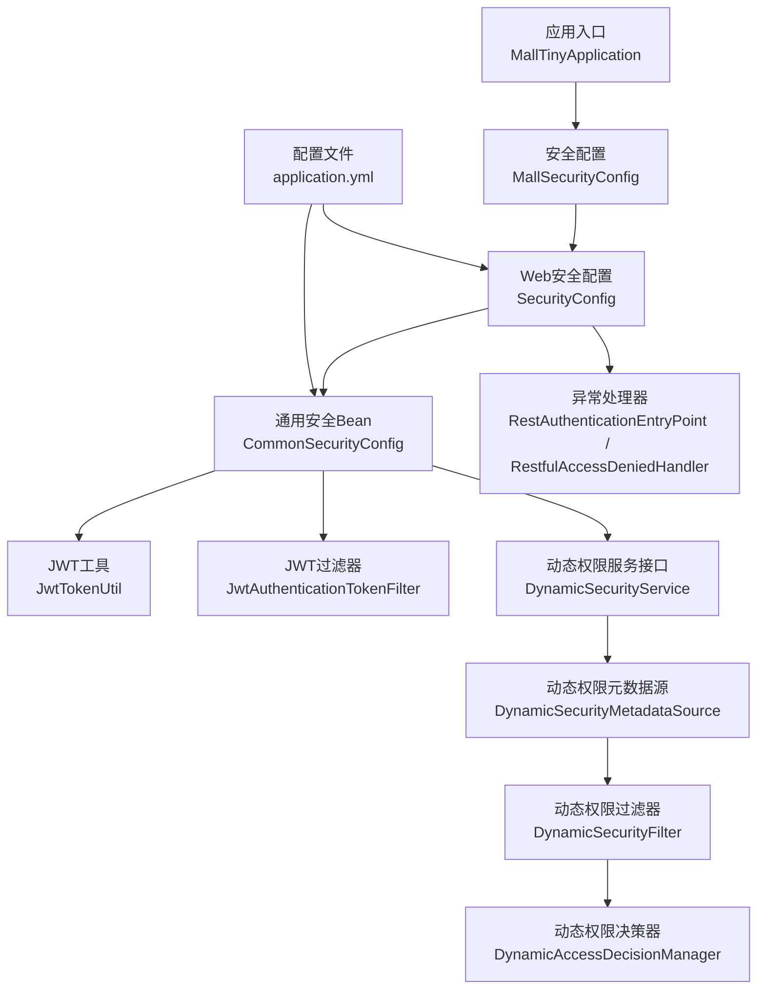
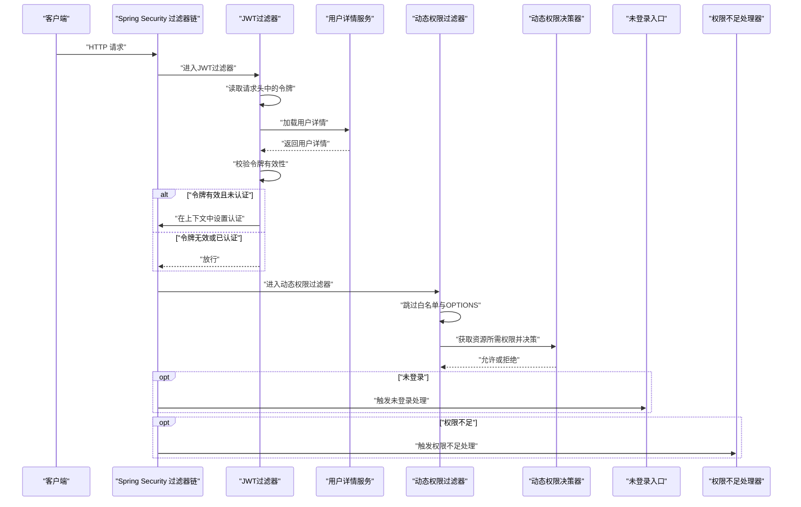
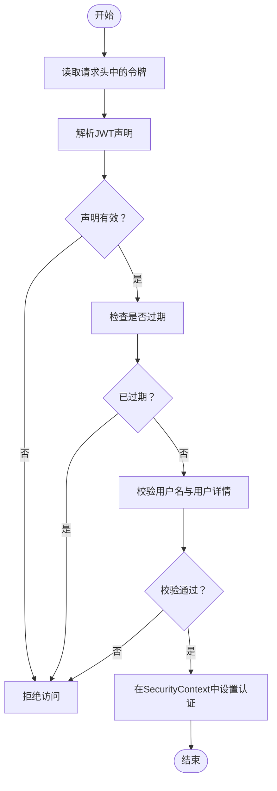
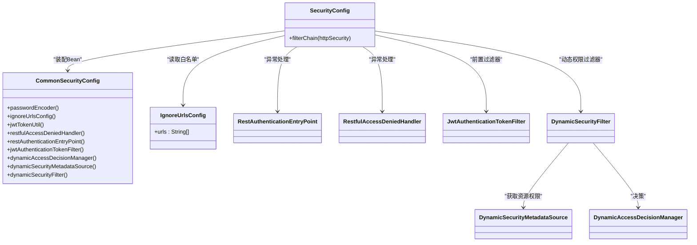
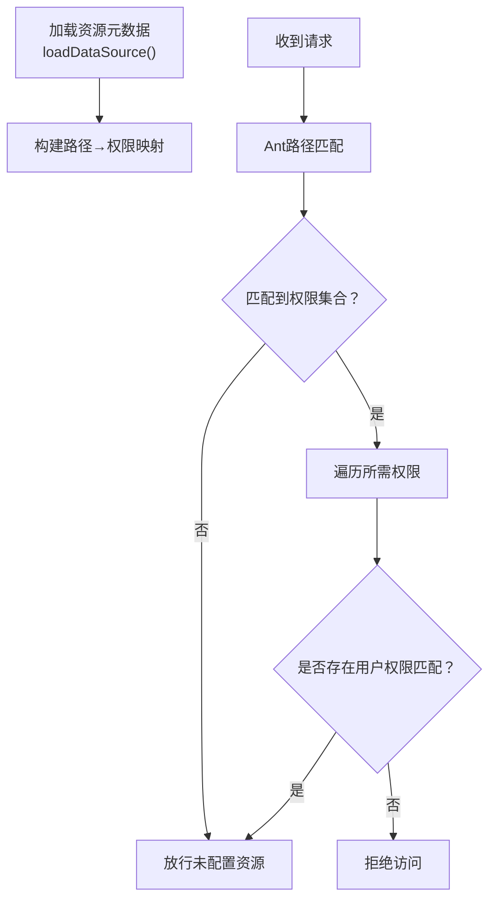
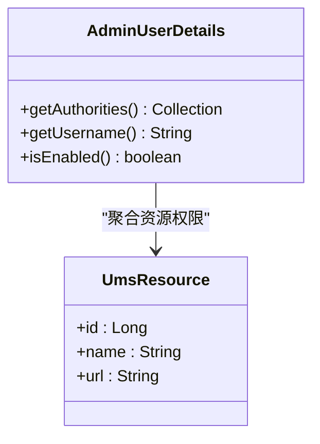
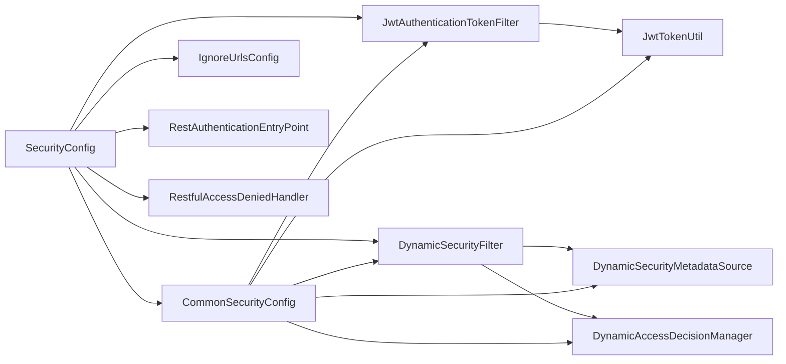

# 安全系统设计

<cite>
**本文引用的文件**
- [MallTinyApplication.java](file://src/main/java/com/macro/mall/tiny/MallTinyApplication.java)
- [MallSecurityConfig.java](file://src/main/java/com/macro/mall/tiny/config/MallSecurityConfig.java)
- [SecurityConfig.java](file://src/main/java/com/macro/mall/tiny/security/config/SecurityConfig.java)
- [CommonSecurityConfig.java](file://src/main/java/com/macro/mall/tiny/security/config/CommonSecurityConfig.java)
- [AdminUserDetails.java](file://src/main/java/com/macro/mall/tiny/domain/AdminUserDetails.java)
- [JwtTokenUtil.java](file://src/main/java/com/macro/mall/tiny/security/util/JwtTokenUtil.java)
- [JwtAuthenticationTokenFilter.java](file://src/main/java/com/macro/mall/tiny/security/component/JwtAuthenticationTokenFilter.java)
- [DynamicSecurityService.java](file://src/main/java/com/macro/mall/tiny/security/component/DynamicSecurityService.java)
- [DynamicSecurityMetadataSource.java](file://src/main/java/com/macro/mall/tiny/security/component/DynamicSecurityMetadataSource.java)
- [DynamicSecurityFilter.java](file://src/main/java/com/macro/mall/tiny/security/component/DynamicSecurityFilter.java)
- [DynamicAccessDecisionManager.java](file://src/main/java/com/macro/mall/tiny/security/component/DynamicAccessDecisionManager.java)
- [RestAuthenticationEntryPoint.java](file://src/main/java/com/macro/mall/tiny/security/component/RestAuthenticationEntryPoint.java)
- [RestfulAccessDeniedHandler.java](file://src/main/java/com/macro/mall/tiny/security/component/RestfulAccessDeniedHandler.java)
- [IgnoreUrlsConfig.java](file://src/main/java/com/macro/mall/tiny/security/config/IgnoreUrlsConfig.java)
- [application.yml](file://src/main/resources/application.yml)
</cite>

## 目录
1. [引言](#引言)
2. [项目结构](#项目结构)
3. [核心组件](#核心组件)
4. [架构总览](#架构总览)
5. [详细组件分析](#详细组件分析)
6. [依赖分析](#依赖分析)
7. [性能考虑](#性能考虑)
8. [故障排查指南](#故障排查指南)
9. [结论](#结论)
10. [附录](#附录)

## 引言
本设计文档面向安全工程师与架构师，系统性阐述本项目的安全体系：基于 JWT 的认证与授权机制、Spring Security 过滤器链与动态权限模型、RBAC 权限模型落地、安全配置最佳实践、异常与审计处理以及常见攻击的防护策略。文档以代码为依据，结合架构图与流程图，帮助读者快速理解并安全地扩展与维护系统。

## 项目结构
安全相关代码主要分布在以下包与文件：
- 应用入口：启动类
- 配置层：全局安全配置、通用安全 Bean、忽略路径配置
- 安全组件：JWT 工具、JWT 过滤器、动态权限元数据源、动态权限过滤器、动态权限决策器、异常处理器
- 用户领域：用户详情（承载 RBAC 权限）
- 配置文件：JWT、Redis、安全白名单等参数

图表来源
- [MallTinyApplication.java:1-14](file://src/main/java/com/macro/mall/tiny/MallTinyApplication.java#L1-L14)
- [MallSecurityConfig.java:1-54](file://src/main/java/com/macro/mall/tiny/config/MallSecurityConfig.java#L1-L54)
- [SecurityConfig.java:1-86](file://src/main/java/com/macro/mall/tiny/security/config/SecurityConfig.java#L1-L86)
- [CommonSecurityConfig.java:1-63](file://src/main/java/com/macro/mall/tiny/security/config/CommonSecurityConfig.java#L1-L63)
- [JwtTokenUtil.java:1-171](file://src/main/java/com/macro/mall/tiny/security/util/JwtTokenUtil.java#L1-L171)
- [JwtAuthenticationTokenFilter.java:1-59](file://src/main/java/com/macro/mall/tiny/security/component/JwtAuthenticationTokenFilter.java#L1-L59)
- [DynamicSecurityService.java:1-17](file://src/main/java/com/macro/mall/tiny/security/component/DynamicSecurityService.java#L1-L17)
- [DynamicSecurityMetadataSource.java:1-65](file://src/main/java/com/macro/mall/tiny/security/component/DynamicSecurityMetadataSource.java#L1-L65)
- [DynamicSecurityFilter.java:1-83](file://src/main/java/com/macro/mall/tiny/security/component/DynamicSecurityFilter.java#L1-L83)
- [DynamicAccessDecisionManager.java:1-52](file://src/main/java/com/macro/mall/tiny/security/component/DynamicAccessDecisionManager.java#L1-L52)
- [RestAuthenticationEntryPoint.java:1-28](file://src/main/java/com/macro/mall/tiny/security/component/RestAuthenticationEntryPoint.java#L1-L28)
- [RestfulAccessDeniedHandler.java:1-30](file://src/main/java/com/macro/mall/tiny/security/component/RestfulAccessDeniedHandler.java#L1-L30)
- [application.yml:1-57](file://src/main/resources/application.yml#L1-L57)

章节来源
- [MallTinyApplication.java:1-14](file://src/main/java/com/macro/mall/tiny/MallTinyApplication.java#L1-L14)
- [MallSecurityConfig.java:1-54](file://src/main/java/com/macro/mall/tiny/config/MallSecurityConfig.java#L1-L54)
- [SecurityConfig.java:1-86](file://src/main/java/com/macro/mall/tiny/security/config/SecurityConfig.java#L1-L86)
- [CommonSecurityConfig.java:1-63](file://src/main/java/com/macro/mall/tiny/security/config/CommonSecurityConfig.java#L1-L63)
- [application.yml:1-57](file://src/main/resources/application.yml#L1-L57)

## 核心组件
- JWT 认证与令牌管理：负责令牌生成、解析、校验与刷新
- Spring Security 过滤器链：基于状态的无会话策略，自定义异常处理
- 动态权限模型：基于资源路径的动态授权，支持运行时更新
- RBAC 权限模型：用户-角色-资源三者映射，权限以资源维度下发
- 安全异常与审计：统一未登录/未授权响应，可扩展审计日志

章节来源
- [JwtTokenUtil.java:1-171](file://src/main/java/com/macro/mall/tiny/security/util/JwtTokenUtil.java#L1-L171)
- [JwtAuthenticationTokenFilter.java:1-59](file://src/main/java/com/macro/mall/tiny/security/component/JwtAuthenticationTokenFilter.java#L1-L59)
- [SecurityConfig.java:1-86](file://src/main/java/com/macro/mall/tiny/security/config/SecurityConfig.java#L1-L86)
- [DynamicSecurityMetadataSource.java:1-65](file://src/main/java/com/macro/mall/tiny/security/component/DynamicSecurityMetadataSource.java#L1-L65)
- [DynamicSecurityFilter.java:1-83](file://src/main/java/com/macro/mall/tiny/security/component/DynamicSecurityFilter.java#L1-L83)
- [DynamicAccessDecisionManager.java:1-52](file://src/main/java/com/macro/mall/tiny/security/component/DynamicAccessDecisionManager.java#L1-L52)
- [AdminUserDetails.java:1-87](file://src/main/java/com/macro/mall/tiny/domain/AdminUserDetails.java#L1-L87)
- [RestAuthenticationEntryPoint.java:1-28](file://src/main/java/com/macro/mall/tiny/security/component/RestAuthenticationEntryPoint.java#L1-L28)
- [RestfulAccessDeniedHandler.java:1-30](file://src/main/java/com/macro/mall/tiny/security/component/RestfulAccessDeniedHandler.java#L1-L30)

## 架构总览
下图展示从客户端到后端的认证与授权流程，以及动态权限决策的关键节点。

图表来源
- [JwtAuthenticationTokenFilter.java:1-59](file://src/main/java/com/macro/mall/tiny/security/component/JwtAuthenticationTokenFilter.java#L1-L59)
- [SecurityConfig.java:1-86](file://src/main/java/com/macro/mall/tiny/security/config/SecurityConfig.java#L1-L86)
- [DynamicSecurityFilter.java:1-83](file://src/main/java/com/macro/mall/tiny/security/component/DynamicSecurityFilter.java#L1-L83)
- [DynamicAccessDecisionManager.java:1-52](file://src/main/java/com/macro/mall/tiny/security/component/DynamicAccessDecisionManager.java#L1-L52)
- [RestAuthenticationEntryPoint.java:1-28](file://src/main/java/com/macro/mall/tiny/security/component/RestAuthenticationEntryPoint.java#L1-L28)
- [RestfulAccessDeniedHandler.java:1-30](file://src/main/java/com/macro/mall/tiny/security/component/RestfulAccessDeniedHandler.java#L1-L30)

## 详细组件分析

### JWT 认证机制
- 令牌生成：基于 HS512 签名算法，包含用户名与签发时间等声明，过期时间由配置项控制
- 令牌解析与校验：从请求头提取令牌，解析签发方与签名，验证用户名与过期时间
- 令牌刷新：在未过期前提下，支持在一定时间窗口内刷新令牌，避免频繁重新登录
- 会话策略：禁用 Session，采用无状态 JWT，适合分布式与高并发场景

图表来源
- [JwtTokenUtil.java:1-171](file://src/main/java/com/macro/mall/tiny/security/util/JwtTokenUtil.java#L1-L171)
- [JwtAuthenticationTokenFilter.java:1-59](file://src/main/java/com/macro/mall/tiny/security/component/JwtAuthenticationTokenFilter.java#L1-L59)

章节来源
- [JwtTokenUtil.java:1-171](file://src/main/java/com/macro/mall/tiny/security/util/JwtTokenUtil.java#L1-L171)
- [JwtAuthenticationTokenFilter.java:1-59](file://src/main/java/com/macro/mall/tiny/security/component/JwtAuthenticationTokenFilter.java#L1-L59)
- [application.yml:24-28](file://src/main/resources/application.yml#L24-L28)

### Spring Security 集成与过滤器链
- 全局方法安全：启用方法级注解（如 prePostEnabled）
- 白名单路径：通过配置类注入忽略路径列表，允许匿名访问
- CORS 支持：开启跨域支持
- CSRF 关闭：无状态 JWT 场景关闭 CSRF
- 会话策略：STATELESS，禁用 Session
- 异常处理：未登录与权限不足分别返回统一 JSON 结果
- 过滤器顺序：JWT 过滤器在用户名密码过滤器之前执行；动态权限过滤器在安全拦截器之前

图表来源
- [SecurityConfig.java:1-86](file://src/main/java/com/macro/mall/tiny/security/config/SecurityConfig.java#L1-L86)
- [CommonSecurityConfig.java:1-63](file://src/main/java/com/macro/mall/tiny/security/config/CommonSecurityConfig.java#L1-L63)
- [IgnoreUrlsConfig.java:1-22](file://src/main/java/com/macro/mall/tiny/security/config/IgnoreUrlsConfig.java#L1-L22)
- [RestAuthenticationEntryPoint.java:1-28](file://src/main/java/com/macro/mall/tiny/security/component/RestAuthenticationEntryPoint.java#L1-L28)
- [RestfulAccessDeniedHandler.java:1-30](file://src/main/java/com/macro/mall/tiny/security/component/RestfulAccessDeniedHandler.java#L1-L30)
- [JwtAuthenticationTokenFilter.java:1-59](file://src/main/java/com/macro/mall/tiny/security/component/JwtAuthenticationTokenFilter.java#L1-L59)
- [DynamicSecurityFilter.java:1-83](file://src/main/java/com/macro/mall/tiny/security/component/DynamicSecurityFilter.java#L1-L83)
- [DynamicSecurityMetadataSource.java:1-65](file://src/main/java/com/macro/mall/tiny/security/component/DynamicSecurityMetadataSource.java#L1-L65)
- [DynamicAccessDecisionManager.java:1-52](file://src/main/java/com/macro/mall/tiny/security/component/DynamicAccessDecisionManager.java#L1-L52)

章节来源
- [SecurityConfig.java:1-86](file://src/main/java/com/macro/mall/tiny/security/config/SecurityConfig.java#L1-L86)
- [CommonSecurityConfig.java:1-63](file://src/main/java/com/macro/mall/tiny/security/config/CommonSecurityConfig.java#L1-L63)
- [application.yml:38-57](file://src/main/resources/application.yml#L38-L57)

### 动态权限元数据源与决策
- 资源元数据加载：从资源服务加载所有受控资源，构建“ANT 路径 → 资源标识”的映射
- 请求匹配：对每个访问请求，匹配其路径对应的资源集合
- 决策逻辑：遍历所需权限与用户权限，存在任一匹配即放行，否则拒绝

图表来源
- [MallSecurityConfig.java:39-52](file://src/main/java/com/macro/mall/tiny/config/MallSecurityConfig.java#L39-L52)
- [DynamicSecurityMetadataSource.java:18-65](file://src/main/java/com/macro/mall/tiny/security/component/DynamicSecurityMetadataSource.java#L18-L65)
- [DynamicAccessDecisionManager.java:18-52](file://src/main/java/com/macro/mall/tiny/security/component/DynamicAccessDecisionManager.java#L18-L52)

章节来源
- [MallSecurityConfig.java:39-52](file://src/main/java/com/macro/mall/tiny/config/MallSecurityConfig.java#L39-L52)
- [DynamicSecurityMetadataSource.java:18-65](file://src/main/java/com/macro/mall/tiny/security/component/DynamicSecurityMetadataSource.java#L18-L65)
- [DynamicAccessDecisionManager.java:18-52](file://src/main/java/com/macro/mall/tiny/security/component/DynamicAccessDecisionManager.java#L18-L52)

### RBAC 权限模型实现
- 角色-权限映射：用户详情聚合用户拥有的资源列表，资源权限以多种格式下发（id:name、name、url），满足不同粒度的匹配需求
- 菜单-权限关联：资源表包含菜单与接口两类条目，动态元数据源按路径匹配资源，菜单与接口均受控
- 资源访问控制：通过动态权限过滤器与决策器，实现基于路径的细粒度授权

图表来源
- [AdminUserDetails.java:17-87](file://src/main/java/com/macro/mall/tiny/domain/AdminUserDetails.java#L17-L87)

章节来源
- [AdminUserDetails.java:17-87](file://src/main/java/com/macro/mall/tiny/domain/AdminUserDetails.java#L17-L87)

### 安全配置最佳实践
- 密码加密策略：使用 BCryptPasswordEncoder 对密码进行编码与校验
- 会话管理：禁用 Session，采用无状态 JWT
- CSRF 防护：无状态场景关闭 CSRF；若需表单登录，请启用并配合同源策略
- CORS 配置：按需开启跨域支持
- 白名单管理：集中维护无需认证的路径，避免误放敏感接口
- 令牌安全：合理设置过期时间与刷新窗口，避免长期有效令牌带来的风险

章节来源
- [CommonSecurityConfig.java:18-21](file://src/main/java/com/macro/mall/tiny/security/config/CommonSecurityConfig.java#L18-L21)
- [SecurityConfig.java:66-70](file://src/main/java/com/macro/mall/tiny/security/config/SecurityConfig.java#L66-L70)
- [application.yml:24-28](file://src/main/resources/application.yml#L24-L28)
- [application.yml:38-57](file://src/main/resources/application.yml#L38-L57)

### 异常处理与审计
- 未登录处理：统一返回未登录结果，便于前端引导登录
- 权限不足处理：统一返回权限不足结果，便于前端提示
- 审计建议：可在动态权限过滤器或 JWT 过滤器中扩展审计日志，记录用户、IP、时间、资源与结果

章节来源
- [RestAuthenticationEntryPoint.java:17-27](file://src/main/java/com/macro/mall/tiny/security/component/RestAuthenticationEntryPoint.java#L17-L27)
- [RestfulAccessDeniedHandler.java:17-29](file://src/main/java/com/macro/mall/tiny/security/component/RestfulAccessDeniedHandler.java#L17-L29)

## 依赖分析
- 组件耦合：SecurityConfig 依赖多个安全组件；动态权限链路通过接口解耦，便于替换与扩展
- 外部依赖：JWT 工具依赖配置项；动态权限依赖资源服务；用户详情依赖管理员与资源模型
- 循环依赖规避：通过条件化装配与接口抽象降低耦合

图表来源
- [SecurityConfig.java:1-86](file://src/main/java/com/macro/mall/tiny/security/config/SecurityConfig.java#L1-L86)
- [CommonSecurityConfig.java:1-63](file://src/main/java/com/macro/mall/tiny/security/config/CommonSecurityConfig.java#L1-L63)
- [IgnoreUrlsConfig.java:1-22](file://src/main/java/com/macro/mall/tiny/security/config/IgnoreUrlsConfig.java#L1-L22)
- [JwtAuthenticationTokenFilter.java:1-59](file://src/main/java/com/macro/mall/tiny/security/component/JwtAuthenticationTokenFilter.java#L1-L59)
- [DynamicSecurityFilter.java:1-83](file://src/main/java/com/macro/mall/tiny/security/component/DynamicSecurityFilter.java#L1-L83)
- [DynamicSecurityMetadataSource.java:1-65](file://src/main/java/com/macro/mall/tiny/security/component/DynamicSecurityMetadataSource.java#L1-L65)
- [DynamicAccessDecisionManager.java:1-52](file://src/main/java/com/macro/mall/tiny/security/component/DynamicAccessDecisionManager.java#L1-L52)
- [JwtTokenUtil.java:1-171](file://src/main/java/com/macro/mall/tiny/security/util/JwtTokenUtil.java#L1-L171)

章节来源
- [SecurityConfig.java:1-86](file://src/main/java/com/macro/mall/tiny/security/config/SecurityConfig.java#L1-L86)
- [CommonSecurityConfig.java:1-63](file://src/main/java/com/macro/mall/tiny/security/config/CommonSecurityConfig.java#L1-L63)

## 性能考虑
- 无状态 JWT：避免服务器端会话存储，降低横向扩展复杂度
- 动态权限缓存：可对资源元数据映射进行缓存，减少每次请求的数据库查询
- 过滤器链短路：白名单与 OPTIONS 请求提前放行，减少后续处理开销
- 密码编码成本：BCrypt 默认成本适中，可根据硬件能力调整

## 故障排查指南
- 未登录/登录过期
  - 现象：统一返回未登录结果
  - 排查：确认请求头是否携带正确的令牌前缀；检查令牌是否过期；核对用户状态
- 权限不足
  - 现象：统一返回权限不足结果
  - 排查：确认资源是否已在资源表中配置；确认用户是否具备相应资源权限；检查动态权限元数据是否已加载
- 令牌刷新失败
  - 现象：刷新接口返回空或旧令牌
  - 排查：确认令牌未过期；确认刷新时间窗口；检查令牌头前缀是否正确
- 跨域问题
  - 现象：浏览器报跨域错误
  - 排查：确认已开启 CORS；核对允许的源与方法

章节来源
- [RestAuthenticationEntryPoint.java:17-27](file://src/main/java/com/macro/mall/tiny/security/component/RestAuthenticationEntryPoint.java#L17-L27)
- [RestfulAccessDeniedHandler.java:17-29](file://src/main/java/com/macro/mall/tiny/security/component/RestfulAccessDeniedHandler.java#L17-L29)
- [JwtTokenUtil.java:129-153](file://src/main/java/com/macro/mall/tiny/security/util/JwtTokenUtil.java#L129-L153)
- [SecurityConfig.java:62-70](file://src/main/java/com/macro/mall/tiny/security/config/SecurityConfig.java#L62-L70)

## 结论
本安全体系以 JWT 为核心，结合 Spring Security 的无状态过滤器链与动态权限模型，实现了灵活可控的 RBAC 授权。通过白名单、异常处理与可扩展的审计机制，系统在保证安全性的同时具备良好的可维护性与扩展性。建议在生产环境中进一步完善令牌黑名单、审计日志与监控告警，并持续评估权限模型与资源配置的合理性。

## 附录
- 配置项参考
  - JWT：令牌头、密钥、过期时间、令牌前缀
  - 安全白名单：无需认证的路径集合
  - Redis：缓存键空间与过期时间（用于用户与资源列表缓存）

章节来源
- [application.yml:24-28](file://src/main/resources/application.yml#L24-L28)
- [application.yml:38-57](file://src/main/resources/application.yml#L38-L57)
- [application.yml:30-37](file://src/main/resources/application.yml#L30-L37)