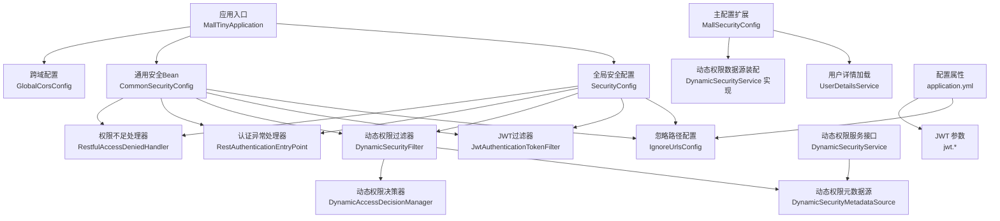
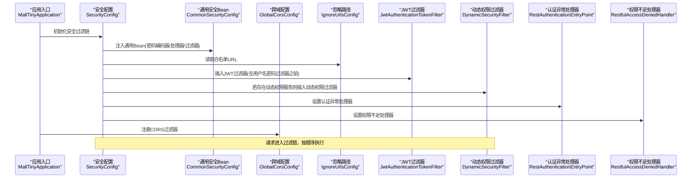
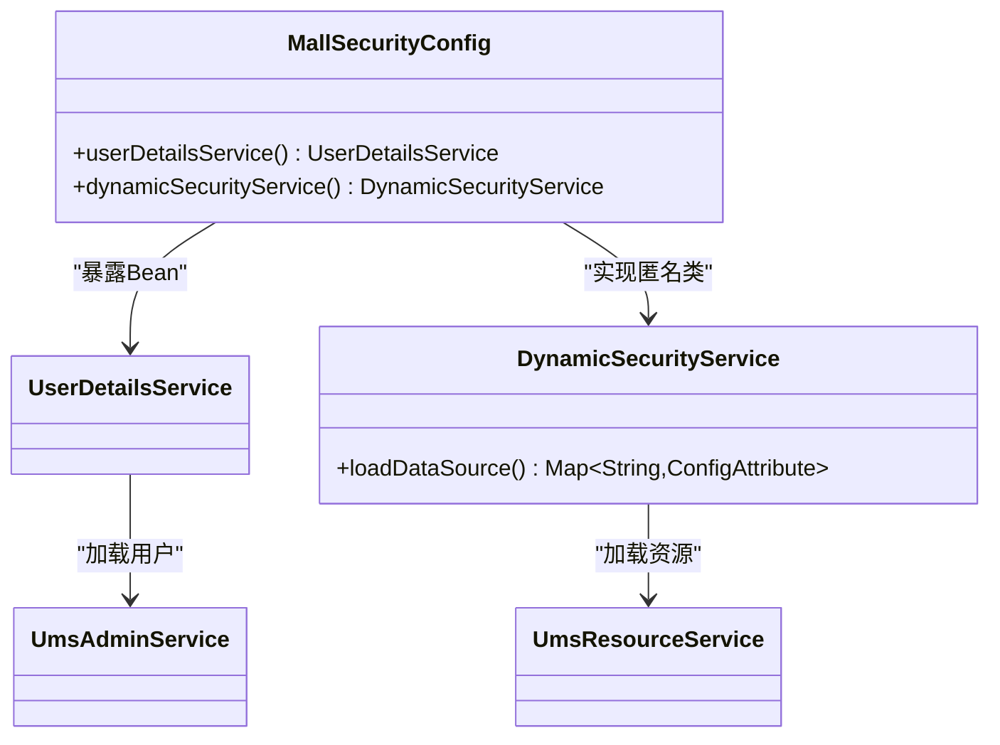
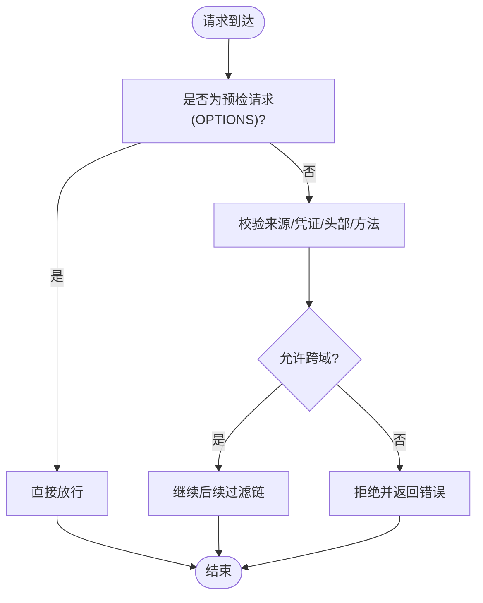
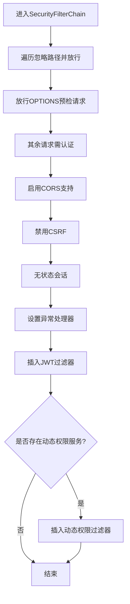
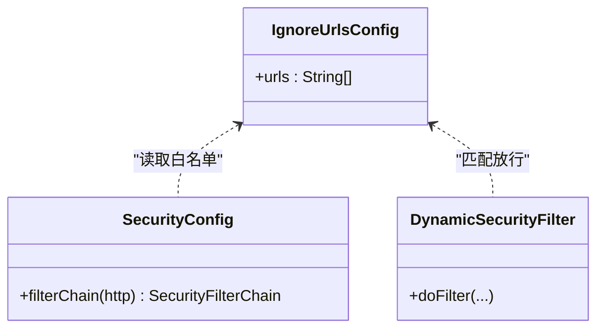
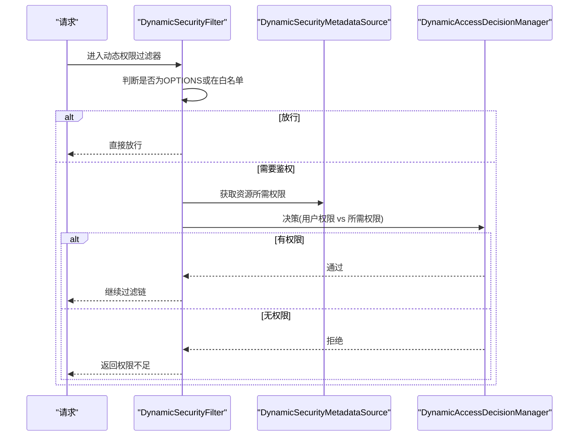
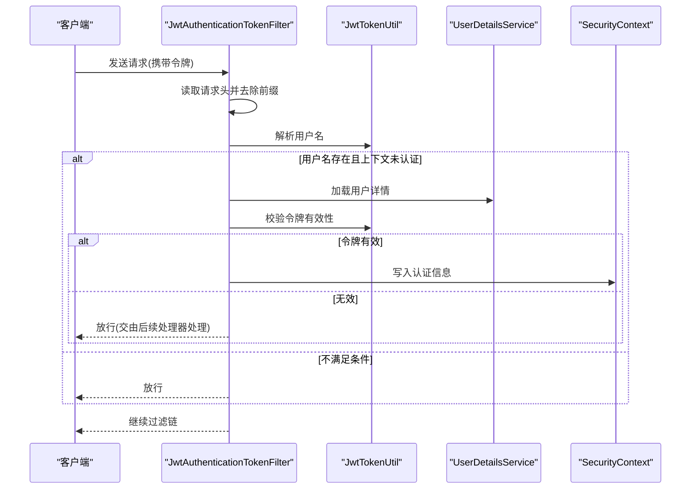
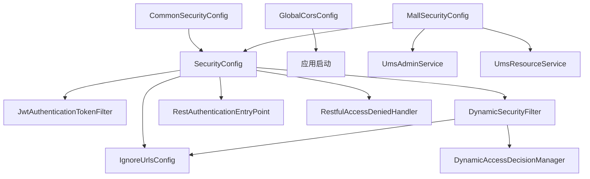

# 安全配置管理

<cite>
**本文引用的文件**
- [MallSecurityConfig.java](file://src/main/java/com/macro/mall/tiny/config/MallSecurityConfig.java)
- [GlobalCorsConfig.java](file://src/main/java/com/macro/mall/tiny/config/GlobalCorsConfig.java)
- [SecurityConfig.java](file://src/main/java/com/macro/mall/tiny/security/config/SecurityConfig.java)
- [CommonSecurityConfig.java](file://src/main/java/com/macro/mall/tiny/security/config/CommonSecurityConfig.java)
- [IgnoreUrlsConfig.java](file://src/main/java/com/macro/mall/tiny/security/config/IgnoreUrlsConfig.java)
- [JwtAuthenticationTokenFilter.java](file://src/main/java/com/macro/mall/tiny/security/component/JwtAuthenticationTokenFilter.java)
- [RestAuthenticationEntryPoint.java](file://src/main/java/com/macro/mall/tiny/security/component/RestAuthenticationEntryPoint.java)
- [RestfulAccessDeniedHandler.java](file://src/main/java/com/macro/mall/tiny/security/component/RestfulAccessDeniedHandler.java)
- [DynamicSecurityFilter.java](file://src/main/java/com/macro/mall/tiny/security/component/DynamicSecurityFilter.java)
- [DynamicSecurityService.java](file://src/main/java/com/macro/mall/tiny/security/component/DynamicSecurityService.java)
- [DynamicAccessDecisionManager.java](file://src/main/java/com/macro/mall/tiny/security/component/DynamicAccessDecisionManager.java)
- [JwtTokenUtil.java](file://src/main/java/com/macro/mall/tiny/security/util/JwtTokenUtil.java)
- [application.yml](file://src/main/resources/application.yml)
- [MallTinyApplication.java](file://src/main/java/com/macro/mall/tiny/MallTinyApplication.java)
- [GlobalExceptionHandler.java](file://src/main/java/com/macro/mall/tiny/common/exception/GlobalExceptionHandler.java)
</cite>

## 目录
1. [简介](#简介)
2. [项目结构](#项目结构)
3. [核心组件](#核心组件)
4. [架构总览](#架构总览)
5. [详细组件分析](#详细组件分析)
6. [依赖关系分析](#依赖关系分析)
7. [性能考量](#性能考量)
8. [故障排查指南](#故障排查指南)
9. [结论](#结论)
10. [附录](#附录)

## 简介
本文件围绕 Mall-Tiny 项目的安全配置体系，系统梳理并深入解析以下关键配置与组件：
- MallSecurityConfig 主配置类：用户详情加载、动态权限数据源装配、与安全过滤链的协作。
- GlobalCorsConfig 跨域配置：CORS 策略、预检请求处理、安全响应头设置。
- SecurityConfig 与 CommonSecurityConfig 基础安全配置：HTTP 安全约束、静态资源保护、会话管理、异常处理。
- IgnoreUrlsConfig 忽略路径配置：白名单路径来源、放行策略。
- 安全过滤器链：JWT 过滤器、动态权限过滤器、异常处理器。
- 安全配置的层次化设计与协作关系、端到端安全流程图、最佳实践与运维调优建议。

## 项目结构
安全相关代码主要分布在以下位置：
- 应用入口：MallTinyApplication
- 全局安全配置：SecurityConfig、CommonSecurityConfig、MallSecurityConfig、IgnoreUrlsConfig
- 跨域配置：GlobalCorsConfig
- 安全组件：JwtAuthenticationTokenFilter、DynamicSecurityFilter、RestAuthenticationEntryPoint、RestfulAccessDeniedHandler、DynamicAccessDecisionManager、DynamicSecurityService、JwtTokenUtil
- 配置文件：application.yml
- 全局异常处理：GlobalExceptionHandler

图表来源
- [MallTinyApplication.java:1-14](file://src/main/java/com/macro/mall/tiny/MallTinyApplication.java#L1-L14)
- [SecurityConfig.java:1-86](file://src/main/java/com/macro/mall/tiny/security/config/SecurityConfig.java#L1-L86)
- [CommonSecurityConfig.java:1-63](file://src/main/java/com/macro/mall/tiny/security/config/CommonSecurityConfig.java#L1-L63)
- [GlobalCorsConfig.java:1-37](file://src/main/java/com/macro/mall/tiny/config/GlobalCorsConfig.java#L1-L37)
- [IgnoreUrlsConfig.java:1-22](file://src/main/java/com/macro/mall/tiny/security/config/IgnoreUrlsConfig.java#L1-L22)
- [JwtAuthenticationTokenFilter.java:1-59](file://src/main/java/com/macro/mall/tiny/security/component/JwtAuthenticationTokenFilter.java#L1-L59)
- [DynamicSecurityFilter.java:1-83](file://src/main/java/com/macro/mall/tiny/security/component/DynamicSecurityFilter.java#L1-L83)
- [RestAuthenticationEntryPoint.java:1-28](file://src/main/java/com/macro/mall/tiny/security/component/RestAuthenticationEntryPoint.java#L1-L28)
- [RestfulAccessDeniedHandler.java:1-30](file://src/main/java/com/macro/mall/tiny/security/component/RestfulAccessDeniedHandler.java#L1-L30)
- [DynamicSecurityService.java:1-17](file://src/main/java/com/macro/mall/tiny/security/component/DynamicSecurityService.java#L1-L17)
- [MallSecurityConfig.java:1-54](file://src/main/java/com/macro/mall/tiny/config/MallSecurityConfig.java#L1-L54)
- [application.yml:1-57](file://src/main/resources/application.yml#L1-L57)

章节来源
- [MallTinyApplication.java:1-14](file://src/main/java/com/macro/mall/tiny/MallTinyApplication.java#L1-L14)
- [application.yml:1-57](file://src/main/resources/application.yml#L1-L57)

## 核心组件
本节聚焦安全配置的关键构件及其职责与交互。

- MallSecurityConfig
  - 用户详情加载：通过 UserDetailsService 将用户名映射为用户对象，供后续认证使用。
  - 动态权限数据源：实现 DynamicSecurityService 接口，从资源服务加载资源-权限映射，构建动态权限表。
  - 与安全过滤链协作：作为扩展配置，向 Spring 容器暴露用户详情与动态权限数据源 Bean，供 SecurityConfig 组合使用。

- GlobalCorsConfig
  - CORS 策略：允许任意来源模式、凭证、头部与方法；对所有路径注册跨域配置。
  - 预检请求处理：默认由 Spring MVC/CORS 框架处理，此处提供基础策略。
  - 安全响应头：配合异常处理器统一设置跨域响应头，确保前端可读取错误信息。

- SecurityConfig 与 CommonSecurityConfig
  - SecurityConfig：定义 HTTP 安全策略，包括忽略路径放行、OPTIONS 预检放行、禁用 CSRF、无状态会话、JWT 过滤器插入、动态权限过滤器插入、异常处理器装配。
  - CommonSecurityConfig：集中声明通用安全 Bean，包括密码编码器、忽略路径配置、JWT 工具、认证/权限处理器、JWT 过滤器、动态权限相关组件。

- IgnoreUrlsConfig
  - 白名单路径来源：从配置文件 secure.ignored.urls 中读取，用于放行公共接口、静态资源、健康检查端点等。

- 安全过滤器链
  - JwtAuthenticationTokenFilter：从请求头提取 JWT，解析用户并写入安全上下文，实现无状态认证。
  - DynamicSecurityFilter：在动态权限启用时，对非 OPTIONS 且不在白名单的请求进行动态权限校验。
  - 异常处理器：未登录/登录过期与权限不足分别返回统一 JSON 结果。

章节来源
- [MallSecurityConfig.java:1-54](file://src/main/java/com/macro/mall/tiny/config/MallSecurityConfig.java#L1-L54)
- [GlobalCorsConfig.java:1-37](file://src/main/java/com/macro/mall/tiny/config/GlobalCorsConfig.java#L1-L37)
- [SecurityConfig.java:1-86](file://src/main/java/com/macro/mall/tiny/security/config/SecurityConfig.java#L1-L86)
- [CommonSecurityConfig.java:1-63](file://src/main/java/com/macro/mall/tiny/security/config/CommonSecurityConfig.java#L1-L63)
- [IgnoreUrlsConfig.java:1-22](file://src/main/java/com/macro/mall/tiny/security/config/IgnoreUrlsConfig.java#L1-L22)
- [JwtAuthenticationTokenFilter.java:1-59](file://src/main/java/com/macro/mall/tiny/security/component/JwtAuthenticationTokenFilter.java#L1-L59)
- [DynamicSecurityFilter.java:1-83](file://src/main/java/com/macro/mall/tiny/security/component/DynamicSecurityFilter.java#L1-L83)
- [RestAuthenticationEntryPoint.java:1-28](file://src/main/java/com/macro/mall/tiny/security/component/RestAuthenticationEntryPoint.java#L1-L28)
- [RestfulAccessDeniedHandler.java:1-30](file://src/main/java/com/macro/mall/tiny/security/component/RestfulAccessDeniedHandler.java#L1-L30)

## 架构总览
下图展示了从应用启动到安全过滤器生效的全过程，以及各配置类之间的协作关系。

图表来源
- [MallTinyApplication.java:1-14](file://src/main/java/com/macro/mall/tiny/MallTinyApplication.java#L1-L14)
- [SecurityConfig.java:1-86](file://src/main/java/com/macro/mall/tiny/security/config/SecurityConfig.java#L1-L86)
- [CommonSecurityConfig.java:1-63](file://src/main/java/com/macro/mall/tiny/security/config/CommonSecurityConfig.java#L1-L63)
- [GlobalCorsConfig.java:1-37](file://src/main/java/com/macro/mall/tiny/config/GlobalCorsConfig.java#L1-L37)
- [IgnoreUrlsConfig.java:1-22](file://src/main/java/com/macro/mall/tiny/security/config/IgnoreUrlsConfig.java#L1-L22)
- [JwtAuthenticationTokenFilter.java:1-59](file://src/main/java/com/macro/mall/tiny/security/component/JwtAuthenticationTokenFilter.java#L1-L59)
- [DynamicSecurityFilter.java:1-83](file://src/main/java/com/macro/mall/tiny/security/component/DynamicSecurityFilter.java#L1-L83)
- [RestAuthenticationEntryPoint.java:1-28](file://src/main/java/com/macro/mall/tiny/security/component/RestAuthenticationEntryPoint.java#L1-L28)
- [RestfulAccessDeniedHandler.java:1-30](file://src/main/java/com/macro/mall/tiny/security/component/RestfulAccessDeniedHandler.java#L1-L30)

## 详细组件分析

### MallSecurityConfig 设计思路与配置策略
- 用户详情加载：通过 Bean 暴露 UserDetailsService，从管理员服务加载用户，供认证阶段使用。
- 动态权限数据源：通过实现 DynamicSecurityService 的匿名内部类，从资源服务加载资源列表，构建“URL → 权限标识”的映射，供动态权限过滤器使用。
- 与安全过滤链协作：作为扩展配置类，向容器提供用户详情与动态权限数据源 Bean，供 SecurityConfig 在过滤链中组合使用。

图表来源
- [MallSecurityConfig.java:1-54](file://src/main/java/com/macro/mall/tiny/config/MallSecurityConfig.java#L1-L54)
- [DynamicSecurityService.java:1-17](file://src/main/java/com/macro/mall/tiny/security/component/DynamicSecurityService.java#L1-L17)

章节来源
- [MallSecurityConfig.java:1-54](file://src/main/java/com/macro/mall/tiny/config/MallSecurityConfig.java#L1-L54)

### GlobalCorsConfig 跨域配置
- CORS 策略设置：允许任意来源模式、凭证、头部与方法；对所有路径注册配置。
- 预检请求处理：默认由框架处理，此处提供基础策略保证跨域 OPTIONS 请求放行。
- 安全头配置：异常处理器统一设置跨域响应头，便于前端获取错误信息。

图表来源
- [GlobalCorsConfig.java:1-37](file://src/main/java/com/macro/mall/tiny/config/GlobalCorsConfig.java#L1-L37)
- [RestAuthenticationEntryPoint.java:1-28](file://src/main/java/com/macro/mall/tiny/security/component/RestAuthenticationEntryPoint.java#L1-L28)
- [RestfulAccessDeniedHandler.java:1-30](file://src/main/java/com/macro/mall/tiny/security/component/RestfulAccessDeniedHandler.java#L1-L30)

章节来源
- [GlobalCorsConfig.java:1-37](file://src/main/java/com/macro/mall/tiny/config/GlobalCorsConfig.java#L1-L37)

### SecurityConfig 与 CommonSecurityConfig 基础安全配置
- HTTP 安全约束：遍历忽略路径集合，逐条 permitAll；显式放行 OPTIONS 预检；其余请求需认证。
- 静态资源保护：通过忽略路径配置放行静态资源与文档资源。
- 会话管理：禁用 CSRF，采用无状态 SessionCreationPolicy.STATELESS。
- 异常处理：设置认证异常处理器与权限不足处理器，统一返回 JSON 结果。
- 过滤器链：插入 JWT 过滤器于用户名密码过滤器之前；若存在动态权限服务，则插入动态权限过滤器于安全拦截器之前。

图表来源
- [SecurityConfig.java:1-86](file://src/main/java/com/macro/mall/tiny/security/config/SecurityConfig.java#L1-L86)
- [CommonSecurityConfig.java:1-63](file://src/main/java/com/macro/mall/tiny/security/config/CommonSecurityConfig.java#L1-L63)

章节来源
- [SecurityConfig.java:1-86](file://src/main/java/com/macro/mall/tiny/security/config/SecurityConfig.java#L1-L86)
- [CommonSecurityConfig.java:1-63](file://src/main/java/com/macro/mall/tiny/security/config/CommonSecurityConfig.java#L1-L63)

### IgnoreUrlsConfig 忽略路径配置
- 作用：集中管理白名单路径，用于放行公共接口、静态资源、健康检查端点等。
- 数据来源：从配置文件 secure.ignored.urls 读取路径列表，供 SecurityConfig 与 DynamicSecurityFilter 使用。

图表来源
- [IgnoreUrlsConfig.java:1-22](file://src/main/java/com/macro/mall/tiny/security/config/IgnoreUrlsConfig.java#L1-L22)
- [SecurityConfig.java:1-86](file://src/main/java/com/macro/mall/tiny/security/config/SecurityConfig.java#L1-L86)
- [DynamicSecurityFilter.java:1-83](file://src/main/java/com/macro/mall/tiny/security/component/DynamicSecurityFilter.java#L1-L83)

章节来源
- [IgnoreUrlsConfig.java:1-22](file://src/main/java/com/macro/mall/tiny/security/config/IgnoreUrlsConfig.java#L1-L22)
- [application.yml:38-57](file://src/main/resources/application.yml#L38-L57)

### 动态权限过滤链与决策
- 动态权限过滤器：在非 OPTIONS 且不在白名单的请求上，调用动态权限元数据源与决策器进行鉴权。
- 决策逻辑：当接口未配置资源时直接放行；否则要求用户权限与所需权限一致。

图表来源
- [DynamicSecurityFilter.java:1-83](file://src/main/java/com/macro/mall/tiny/security/component/DynamicSecurityFilter.java#L1-L83)
- [DynamicAccessDecisionManager.java:1-52](file://src/main/java/com/macro/mall/tiny/security/component/DynamicAccessDecisionManager.java#L1-L52)
- [DynamicSecurityService.java:1-17](file://src/main/java/com/macro/mall/tiny/security/component/DynamicSecurityService.java#L1-L17)

章节来源
- [DynamicSecurityFilter.java:1-83](file://src/main/java/com/macro/mall/tiny/security/component/DynamicSecurityFilter.java#L1-L83)
- [DynamicAccessDecisionManager.java:1-52](file://src/main/java/com/macro/mall/tiny/security/component/DynamicAccessDecisionManager.java#L1-L52)

### JWT 认证流程
- 请求头解析：从配置的请求头中提取带前缀的令牌。
- 用户解析：从令牌解析用户名，若上下文尚未认证且用户存在，则构造认证对象并写入安全上下文。
- 与异常处理：未登录/过期与权限不足分别由对应处理器返回统一 JSON。

图表来源
- [JwtAuthenticationTokenFilter.java:1-59](file://src/main/java/com/macro/mall/tiny/security/component/JwtAuthenticationTokenFilter.java#L1-L59)
- [JwtTokenUtil.java:1-171](file://src/main/java/com/macro/mall/tiny/security/util/JwtTokenUtil.java#L1-L171)
- [application.yml:24-28](file://src/main/resources/application.yml#L24-L28)

章节来源
- [JwtAuthenticationTokenFilter.java:1-59](file://src/main/java/com/macro/mall/tiny/security/component/JwtAuthenticationTokenFilter.java#L1-L59)
- [JwtTokenUtil.java:1-171](file://src/main/java/com/macro/mall/tiny/security/util/JwtTokenUtil.java#L1-L171)
- [application.yml:24-28](file://src/main/resources/application.yml#L24-L28)

## 依赖关系分析
- 层次化设计
  - CommonSecurityConfig 提供通用 Bean，SecurityConfig 组合这些 Bean 并构建安全过滤链。
  - MallSecurityConfig 作为扩展配置，提供用户详情与动态权限数据源，供 SecurityConfig 使用。
  - GlobalCorsConfig 单独提供跨域过滤器，独立于 Spring Security 过滤链之外。
- 组件耦合
  - SecurityConfig 依赖 IgnoreUrlsConfig、JwtAuthenticationTokenFilter、DynamicSecurityFilter、RestAuthenticationEntryPoint、RestfulAccessDeniedHandler。
  - DynamicSecurityFilter 依赖 DynamicSecurityMetadataSource 与 IgnoreUrlsConfig。
  - MallSecurityConfig 依赖 UmsAdminService 与 UmsResourceService。

图表来源
- [CommonSecurityConfig.java:1-63](file://src/main/java/com/macro/mall/tiny/security/config/CommonSecurityConfig.java#L1-L63)
- [SecurityConfig.java:1-86](file://src/main/java/com/macro/mall/tiny/security/config/SecurityConfig.java#L1-L86)
- [MallSecurityConfig.java:1-54](file://src/main/java/com/macro/mall/tiny/config/MallSecurityConfig.java#L1-L54)
- [GlobalCorsConfig.java:1-37](file://src/main/java/com/macro/mall/tiny/config/GlobalCorsConfig.java#L1-L37)
- [DynamicSecurityFilter.java:1-83](file://src/main/java/com/macro/mall/tiny/security/component/DynamicSecurityFilter.java#L1-L83)
- [DynamicAccessDecisionManager.java:1-52](file://src/main/java/com/macro/mall/tiny/security/component/DynamicAccessDecisionManager.java#L1-L52)
- [MallSecurityConfig.java:28-31](file://src/main/java/com/macro/mall/tiny/config/MallSecurityConfig.java#L28-L31)

章节来源
- [CommonSecurityConfig.java:1-63](file://src/main/java/com/macro/mall/tiny/security/config/CommonSecurityConfig.java#L1-L63)
- [SecurityConfig.java:1-86](file://src/main/java/com/macro/mall/tiny/security/config/SecurityConfig.java#L1-L86)
- [MallSecurityConfig.java:1-54](file://src/main/java/com/macro/mall/tiny/config/MallSecurityConfig.java#L1-L54)

## 性能考量
- 无状态会话：禁用会话、使用 JWT，降低服务器端状态存储开销。
- 过滤器链顺序：将 JWT 过滤器置于用户名密码过滤器之前，减少不必要的认证尝试。
- 动态权限缓存：建议在 DynamicSecurityService 的数据源加载中引入缓存（如 Redis），避免每次鉴权都查询数据库。
- CORS 策略：允许任意来源模式与方法会带来一定风险，建议在生产环境限定来源与方法，并结合安全头加固。
- 白名单路径：合理划分白名单，避免将敏感接口误放行。

## 故障排查指南
- 未登录/登录过期
  - 现象：返回统一 JSON，包含未登录或登录过期提示。
  - 排查：确认请求头是否包含正确的令牌前缀；检查令牌是否过期；核对异常处理器是否正确注入。
- 权限不足
  - 现象：返回统一 JSON，提示权限不足。
  - 排查：确认用户权限是否包含所需权限；检查动态权限元数据源是否正确加载；核对决策器逻辑。
- 跨域问题
  - 现象：前端无法读取响应或报跨域错误。
  - 排查：确认 CORS 策略是否允许来源与方法；核对异常处理器是否设置跨域响应头。
- 全局异常处理
  - 现象：系统异常统一返回“系统繁忙”。
  - 排查：查看日志输出；区分业务异常与系统异常；确保业务异常被正确捕获并返回。

章节来源
- [RestAuthenticationEntryPoint.java:1-28](file://src/main/java/com/macro/mall/tiny/security/component/RestAuthenticationEntryPoint.java#L1-L28)
- [RestfulAccessDeniedHandler.java:1-30](file://src/main/java/com/macro/mall/tiny/security/component/RestfulAccessDeniedHandler.java#L1-L30)
- [GlobalExceptionHandler.java:1-100](file://src/main/java/com/macro/mall/tiny/common/exception/GlobalExceptionHandler.java#L1-L100)

## 结论
本安全配置体系通过分层设计实现了清晰的职责分离：通用安全 Bean 由 CommonSecurityConfig 统一提供，核心安全策略由 SecurityConfig 组合实现，跨域由 GlobalCorsConfig 单独处理，动态权限由 MallSecurityConfig 扩展提供。整体以无状态 JWT 认证为核心，结合白名单放行与动态权限决策，形成可扩展、可维护的安全架构。

## 附录
- 配置优先级与环境差异化
  - 开发环境：可放宽 CORS 策略，便于本地联调。
  - 生产环境：严格限定 CORS 来源与方法；开启更严格的异常处理与审计。
- 性能优化建议
  - 缓存动态权限数据源；合并白名单匹配逻辑；减少不必要的数据库查询。
- 部署与调优方案
  - 在网关层统一处理 CORS 与限流；在应用层细化白名单与权限模型；结合监控与日志定位性能瓶颈。