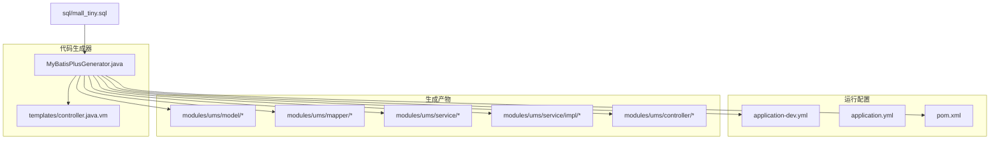
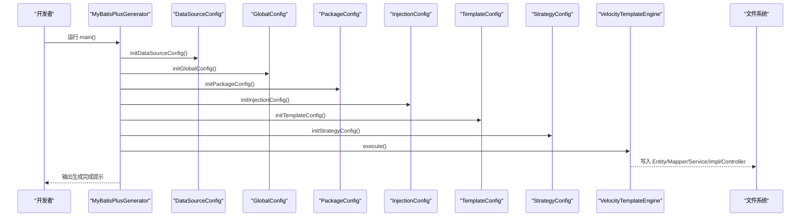
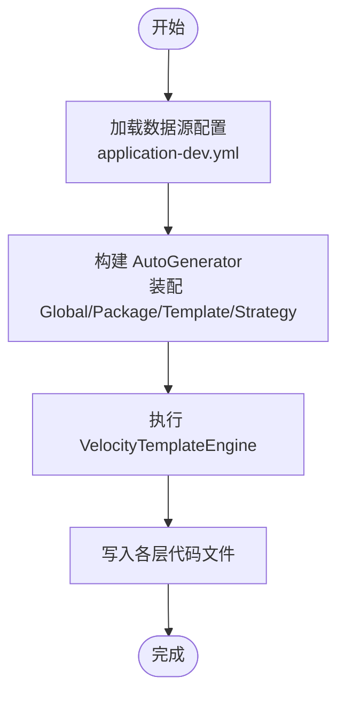
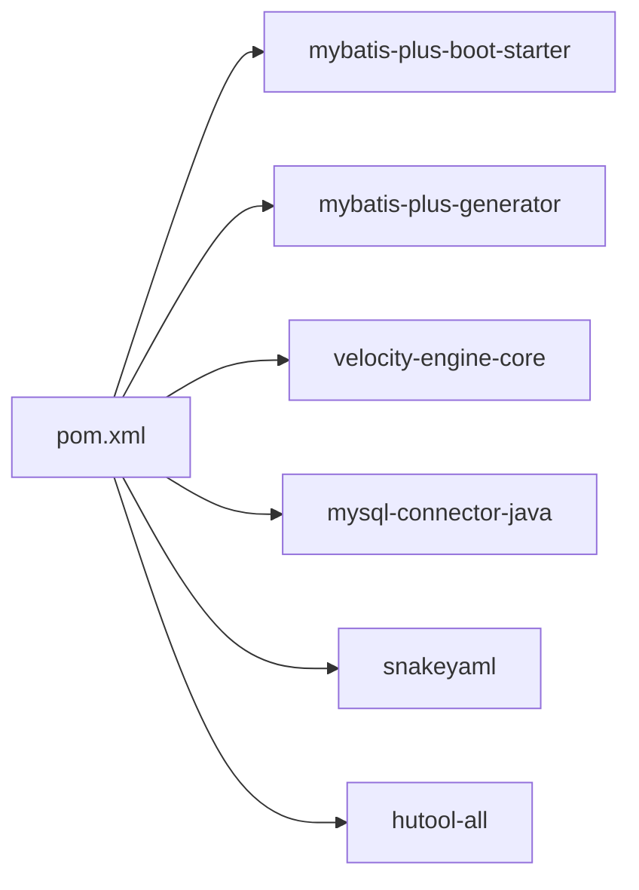

# 代码生成器使用

<cite>
**本文引用的文件**
- [MyBatisPlusGenerator.java](file://src/main/java/com/macro/mall/tiny/generator/MyBatisPlusGenerator.java)
- [controller.java.vm](file://src/main/resources/templates/controller.java.vm)
- [application-dev.yml](file://src/main/resources/application-dev.yml)
- [application.yml](file://src/main/resources/application.yml)
- [generator.properties](file://src/main/resources/generator.properties)
- [pom.xml](file://pom.xml)
- [UmsAdmin.java](file://src/main/java/com/macro/mall/tiny/modules/ums/model/UmsAdmin.java)
- [UmsAdminMapper.java](file://src/main/java/com/macro/mall/tiny/modules/ums/mapper/UmsAdminMapper.java)
- [UmsAdminService.java](file://src/main/java/com/macro/mall/tiny/modules/ums/service/UmsAdminService.java)
- [UmsAdminServiceImpl.java](file://src/main/java/com/macro/mall/tiny/modules/ums/service/impl/UmsAdminServiceImpl.java)
- [UmsAdminController.java](file://src/main/java/com/macro/mall/tiny/modules/ums/controller/UmsAdminController.java)
- [mall_tiny.sql](file://sql/mall_tiny.sql)
</cite>

## 目录
1. [简介](#简介)
2. [项目结构](#项目结构)
3. [核心组件](#核心组件)
4. [架构总览](#架构总览)
5. [详细组件分析](#详细组件分析)
6. [依赖分析](#依赖分析)
7. [性能考虑](#性能考虑)
8. [故障排查指南](#故障排查指南)
9. [结论](#结论)
10. [附录](#附录)

## 简介
本指南面向使用 MyBatis-Plus 代码生成器的开发者，围绕项目中的 MyBatisPlusGenerator 类展开，系统讲解配置参数、生成流程、单表与多表批量生成、模板引擎使用、生成代码结构规范以及常见问题与最佳实践。读者无需深入编程背景，也能通过本指南快速上手并高效产出高质量的 CRUD 代码骨架。

## 项目结构
项目采用标准 Spring Boot 结构，代码生成器位于 generator 包内，模板文件位于 resources/templates 下，生成的模块代码位于 modules/模块名 的标准分层目录中。数据库初始化脚本位于 sql 目录。

图表来源
- [MyBatisPlusGenerator.java:1-175](file://src/main/java/com/macro/mall/tiny/generator/MyBatisPlusGenerator.java#L1-L175)
- [controller.java.vm:1-82](file://src/main/resources/templates/controller.java.vm#L1-L82)
- [application-dev.yml:1-16](file://src/main/resources/application-dev.yml#L1-L16)
- [application.yml:1-57](file://src/main/resources/application.yml#L1-L57)
- [pom.xml:1-222](file://pom.xml#L1-L222)
- [mall_tiny.sql:1-362](file://sql/mall_tiny.sql#L1-L362)

章节来源
- [MyBatisPlusGenerator.java:1-175](file://src/main/java/com/macro/mall/tiny/generator/MyBatisPlusGenerator.java#L1-L175)
- [application-dev.yml:1-16](file://src/main/resources/application-dev.yml#L1-L16)
- [application.yml:1-57](file://src/main/resources/application.yml#L1-L57)
- [pom.xml:1-222](file://pom.xml#L1-L222)
- [mall_tiny.sql:1-362](file://sql/mall_tiny.sql#L1-L362)

## 核心组件
- MyBatisPlusGenerator：代码生成入口，负责数据源、包结构、模板、策略、注入配置的组装与执行。
- Velocity 模板：自定义 Controller 模板，控制 REST 控制器的生成风格。
- 数据库配置：通过 YAML 文件加载数据源，支持开发环境配置。
- Maven 依赖：包含 MyBatis-Plus Generator、Velocity 引擎、MySQL 驱动等。

章节来源
- [MyBatisPlusGenerator.java:1-175](file://src/main/java/com/macro/mall/tiny/generator/MyBatisPlusGenerator.java#L1-L175)
- [controller.java.vm:1-82](file://src/main/resources/templates/controller.java.vm#L1-L82)
- [application-dev.yml:1-16](file://src/main/resources/application-dev.yml#L1-L16)
- [pom.xml:111-128](file://pom.xml#L111-L128)

## 架构总览
下图展示代码生成器从数据库表到最终代码输出的完整流程，包括数据源加载、包结构映射、模板渲染与策略配置。

图表来源
- [MyBatisPlusGenerator.java:35-48](file://src/main/java/com/macro/mall/tiny/generator/MyBatisPlusGenerator.java#L35-L48)
- [MyBatisPlusGenerator.java:53-70](file://src/main/java/com/macro/mall/tiny/generator/MyBatisPlusGenerator.java#L53-L70)
- [MyBatisPlusGenerator.java:90-99](file://src/main/java/com/macro/mall/tiny/generator/MyBatisPlusGenerator.java#L90-L99)
- [MyBatisPlusGenerator.java:104-123](file://src/main/java/com/macro/mall/tiny/generator/MyBatisPlusGenerator.java#L104-L123)
- [MyBatisPlusGenerator.java:170-173](file://src/main/java/com/macro/mall/tiny/generator/MyBatisPlusGenerator.java#L170-L173)
- [MyBatisPlusGenerator.java:128-132](file://src/main/java/com/macro/mall/tiny/generator/MyBatisPlusGenerator.java#L128-L132)
- [MyBatisPlusGenerator.java:137-165](file://src/main/java/com/macro/mall/tiny/generator/MyBatisPlusGenerator.java#L137-L165)

## 详细组件分析

### MyBatisPlusGenerator 类详解
- 数据源配置
  - 从 application-dev.yml 中读取 spring.datasource.* 配置，构造 DataSourceConfig，并指定 MySQL 查询器。
  - 支持切换不同环境配置文件，便于本地与 CI 环境分离。
- 全局配置
  - 输出目录指向 src/main/java，作者、日期类型、Swagger 开启、覆盖写入等。
- 包结构配置
  - 指定模块名与父包 com.macro.mall.tiny.modules，映射各层代码输出路径至 modules/{module}/*。
  - 映射关系：mapperXml、controller、service、serviceImpl、mapper、entity。
- 模板配置
  - 使用自定义 controller.java.vm 模板，控制 REST 控制器生成格式。
- 策略配置
  - 表名命名策略：下划线转驼峰；列命名策略：下划线转驼峰。
  - 实体启用 Lombok；Mapper/Service/Controller 文件名格式化。
  - 支持通配符模式（当传入形如前缀_* 的表名时）。
- 注入配置
  - 当前为空，预留扩展点（如自定义常量、注释、业务逻辑片段注入）。
- 执行流程
  - 组装完成后调用 VelocityTemplateEngine 执行生成。

章节来源
- [MyBatisPlusGenerator.java:27-30](file://src/main/java/com/macro/mall/tiny/generator/MyBatisPlusGenerator.java#L27-L30)
- [MyBatisPlusGenerator.java:35-48](file://src/main/java/com/macro/mall/tiny/generator/MyBatisPlusGenerator.java#L35-L48)
- [MyBatisPlusGenerator.java:53-70](file://src/main/java/com/macro/mall/tiny/generator/MyBatisPlusGenerator.java#L53-L70)
- [MyBatisPlusGenerator.java:90-99](file://src/main/java/com/macro/mall/tiny/generator/MyBatisPlusGenerator.java#L90-L99)
- [MyBatisPlusGenerator.java:104-123](file://src/main/java/com/macro/mall/tiny/generator/MyBatisPlusGenerator.java#L104-L123)
- [MyBatisPlusGenerator.java:128-132](file://src/main/java/com/macro/mall/tiny/generator/MyBatisPlusGenerator.java#L128-L132)
- [MyBatisPlusGenerator.java:137-165](file://src/main/java/com/macro/mall/tiny/generator/MyBatisPlusGenerator.java#L137-L165)
- [MyBatisPlusGenerator.java:170-173](file://src/main/java/com/macro/mall/tiny/generator/MyBatisPlusGenerator.java#L170-L173)

### 模板引擎与自定义模板
- 模板位置：resources/templates/controller.java.vm
- 模板变量
  - 包路径：package.Controller、package.Entity、package.Service
  - 表信息：table.serviceName、table.controllerName、table.entityPath、table.comment
  - 作者与日期：author、date
- 模板特性
  - 自动生成 Swagger 注解、REST 控制器、分页查询、增删改查接口。
  - 控制器基于@RequestMapping("/{entityPath}")，统一前缀风格。
- 自定义建议
  - 可新增 entity、mapper、service、serviceImpl 模板，以满足不同层的差异化需求。
  - 在模板中加入业务注释、字段校验、分页参数校验等，提升生成代码质量。

章节来源
- [controller.java.vm:1-82](file://src/main/resources/templates/controller.java.vm#L1-L82)

### 生成代码结构规范
- 包结构
  - 父包：com.macro.mall.tiny.modules.{module}
  - 层级：model、mapper、service、service.impl、controller、mapperXml
- 命名规范
  - 实体类：表名下划线转驼峰，首字母大写
  - Mapper 接口：实体名 + Mapper
  - Service 接口：实体名 + Service
  - Service 实现类：实体名 + ServiceImpl
  - Controller 控制器：实体名 + Controller，REST 风格路由
- 示例参考
  - 生成的 UmsAdmin 对应 model、mapper、service、service.impl、controller 与 mapperXml。

章节来源
- [MyBatisPlusGenerator.java:104-123](file://src/main/java/com/macro/mall/tiny/generator/MyBatisPlusGenerator.java#L104-L123)
- [UmsAdmin.java:1-59](file://src/main/java/com/macro/mall/tiny/modules/ums/model/UmsAdmin.java#L1-L59)
- [UmsAdminMapper.java:1-25](file://src/main/java/com/macro/mall/tiny/modules/ums/mapper/UmsAdminMapper.java#L1-L25)
- [UmsAdminService.java:1-90](file://src/main/java/com/macro/mall/tiny/modules/ums/service/UmsAdminService.java#L1-L90)
- [UmsAdminServiceImpl.java:1-272](file://src/main/java/com/macro/mall/tiny/modules/ums/service/impl/UmsAdminServiceImpl.java#L1-L272)
- [UmsAdminController.java:1-350](file://src/main/java/com/macro/mall/tiny/modules/ums/controller/UmsAdminController.java#L1-L350)

### 代码生成流程（从数据库表到代码输出）

图表来源
- [MyBatisPlusGenerator.java:35-48](file://src/main/java/com/macro/mall/tiny/generator/MyBatisPlusGenerator.java#L35-L48)
- [MyBatisPlusGenerator.java:53-70](file://src/main/java/com/macro/mall/tiny/generator/MyBatisPlusGenerator.java#L53-L70)
- [MyBatisPlusGenerator.java:90-99](file://src/main/java/com/macro/mall/tiny/generator/MyBatisPlusGenerator.java#L90-L99)
- [MyBatisPlusGenerator.java:104-123](file://src/main/java/com/macro/mall/tiny/generator/MyBatisPlusGenerator.java#L104-L123)
- [MyBatisPlusGenerator.java:128-132](file://src/main/java/com/macro/mall/tiny/generator/MyBatisPlusGenerator.java#L128-L132)
- [MyBatisPlusGenerator.java:137-165](file://src/main/java/com/macro/mall/tiny/generator/MyBatisPlusGenerator.java#L137-L165)

## 依赖分析
- MyBatis-Plus 依赖
  - mybatis-plus-boot-starter 与 mybatis-plus-generator 提供代码生成能力与运行时支持。
- 模板引擎
  - velocity-engine-core 提供模板渲染能力。
- 数据库驱动
  - mysql-connector-java 提供 MySQL 连接支持。
- 工具与配置
  - snakeyaml 解析 YAML；hutool 用于配置读取与工具函数。

图表来源
- [pom.xml:111-128](file://pom.xml#L111-L128)
- [pom.xml:135-140](file://pom.xml#L135-L140)
- [pom.xml:86-91](file://pom.xml#L86-L91)

章节来源
- [pom.xml:111-128](file://pom.xml#L111-L128)
- [pom.xml:135-140](file://pom.xml#L135-L140)
- [pom.xml:86-91](file://pom.xml#L86-L91)

## 性能考虑
- 生成范围控制
  - 优先使用精确表名列表，避免全库扫描；仅在必要时启用通配符模式。
- 模板复杂度
  - 控制模板逻辑复杂度，减少不必要的循环与条件判断，提升生成速度。
- 输出目录与覆盖策略
  - 合理使用 fileOverride 与 disableOpenDir，避免重复打开目录影响性能。
- 并发与批处理
  - 多表生成时建议分模块并行执行，避免同一时间大量 I/O 冲突。

## 故障排查指南
- 数据库连接失败
  - 检查 application-dev.yml 中的 spring.datasource.url、username、password 是否正确。
  - 确认 MySQL 服务可用且网络可达。
- 模板加载失败
  - 确认 resources/templates/controller.java.vm 存在且路径与 TemplateConfig 配置一致。
- 生成代码包路径错误
  - 检查 PackageConfig 的 pathInfo 映射，确保 modules/{module}/* 路径正确。
- 通配符模式未生效
  - 确认 StrategyConfig 中传入的表名包含通配符前缀，且仅传入一个表名。
- 生成结果不符合预期
  - 检查 NamingStrategy、Lombok 启用、Swagger 开启等策略配置是否符合期望。

章节来源
- [application-dev.yml:1-16](file://src/main/resources/application-dev.yml#L1-L16)
- [MyBatisPlusGenerator.java:128-132](file://src/main/java/com/macro/mall/tiny/generator/MyBatisPlusGenerator.java#L128-L132)
- [MyBatisPlusGenerator.java:104-123](file://src/main/java/com/macro/mall/tiny/generator/MyBatisPlusGenerator.java#L104-L123)
- [MyBatisPlusGenerator.java:156-165](file://src/main/java/com/macro/mall/tiny/generator/MyBatisPlusGenerator.java#L156-L165)

## 结论
通过 MyBatisPlusGenerator，开发者可以快速、标准化地生成 CRUD 代码骨架，结合 Velocity 模板与策略配置，能够灵活适配不同模块与团队规范。建议在团队内统一模板与策略，持续优化生成流程，以提升研发效率与代码一致性。

## 附录

### 单表代码生成操作步骤
- 步骤
  - 在 TABLE_NAMES 数组中填入目标表名（例如 user_archive）。
  - 设置 MODULE_NAME 为目标模块名（例如 ums）。
  - 运行 MyBatisPlusGenerator.main()。
- 注意事项
  - 确保数据库连接正常，表存在且具备合理主键与字段。
  - 如需 REST 风格路由，确认 controllerBuilder 的 enableRestStyle 已启用。

章节来源
- [MyBatisPlusGenerator.java:27-30](file://src/main/java/com/macro/mall/tiny/generator/MyBatisPlusGenerator.java#L27-L30)
- [MyBatisPlusGenerator.java:35-48](file://src/main/java/com/macro/mall/tiny/generator/MyBatisPlusGenerator.java#L35-L48)

### 多表批量生成操作步骤
- 步骤
  - 将多个表名放入 TABLE_NAMES 数组。
  - 运行 MyBatisPlusGenerator.main()，生成对应模块下的各层代码。
- 通配符模式
  - 若传入形如前缀_* 的表名，将启用通配符匹配，生成同前缀的所有表。

章节来源
- [MyBatisPlusGenerator.java:156-165](file://src/main/java/com/macro/mall/tiny/generator/MyBatisPlusGenerator.java#L156-L165)

### 模板自定义与修改方法
- 新增模板
  - 在 resources/templates 下新增 vm 文件，如 entity.java.vm、mapper.java.vm、service.java.vm、serviceImpl.java.vm。
- 模板变量
  - 使用 package.*、table.*、entity、author、date 等变量，按需渲染。
- 模板应用
  - 在 TemplateConfig.Builder 中为各层设置模板路径，或保持默认覆盖。

章节来源
- [controller.java.vm:1-82](file://src/main/resources/templates/controller.java.vm#L1-L82)
- [MyBatisPlusGenerator.java:128-132](file://src/main/java/com/macro/mall/tiny/generator/MyBatisPlusGenerator.java#L128-L132)

### 生成代码结构示例参考
- 实体类：UmsAdmin.java
- Mapper 接口：UmsAdminMapper.java
- Service 接口：UmsAdminService.java
- Service 实现类：UmsAdminServiceImpl.java
- Controller 控制器：UmsAdminController.java

章节来源
- [UmsAdmin.java:1-59](file://src/main/java/com/macro/mall/tiny/modules/ums/model/UmsAdmin.java#L1-L59)
- [UmsAdminMapper.java:1-25](file://src/main/java/com/macro/mall/tiny/modules/ums/mapper/UmsAdminMapper.java#L1-L25)
- [UmsAdminService.java:1-90](file://src/main/java/com/macro/mall/tiny/modules/ums/service/UmsAdminService.java#L1-L90)
- [UmsAdminServiceImpl.java:1-272](file://src/main/java/com/macro/mall/tiny/modules/ums/service/impl/UmsAdminServiceImpl.java#L1-L272)
- [UmsAdminController.java:1-350](file://src/main/java/com/macro/mall/tiny/modules/ums/controller/UmsAdminController.java#L1-L350)

### 最佳实践建议
- 统一命名与包结构
  - 固化 NamingStrategy、包路径映射与文件命名规则，保证跨模块一致性。
- 模板复用与扩展
  - 将通用注释、分页参数、校验注解固化到模板，减少二次编辑成本。
- 生成范围与版本控制
  - 生成代码纳入版本控制，但仅保留必要的模板与配置文件；避免将生成代码作为模板修改的来源。
- 环境隔离
  - 使用 application-dev.yml 与 application.yml 分离开发与生产配置，避免误连生产库。
- 安全与合规
  - 生成代码中避免硬编码敏感信息；如需配置，使用环境变量或配置中心。

章节来源
- [MyBatisPlusGenerator.java:90-99](file://src/main/java/com/macro/mall/tiny/generator/MyBatisPlusGenerator.java#L90-L99)
- [MyBatisPlusGenerator.java:104-123](file://src/main/java/com/macro/mall/tiny/generator/MyBatisPlusGenerator.java#L104-L123)
- [application.yml:1-57](file://src/main/resources/application.yml#L1-L57)
- [application-dev.yml:1-16](file://src/main/resources/application-dev.yml#L1-L16)