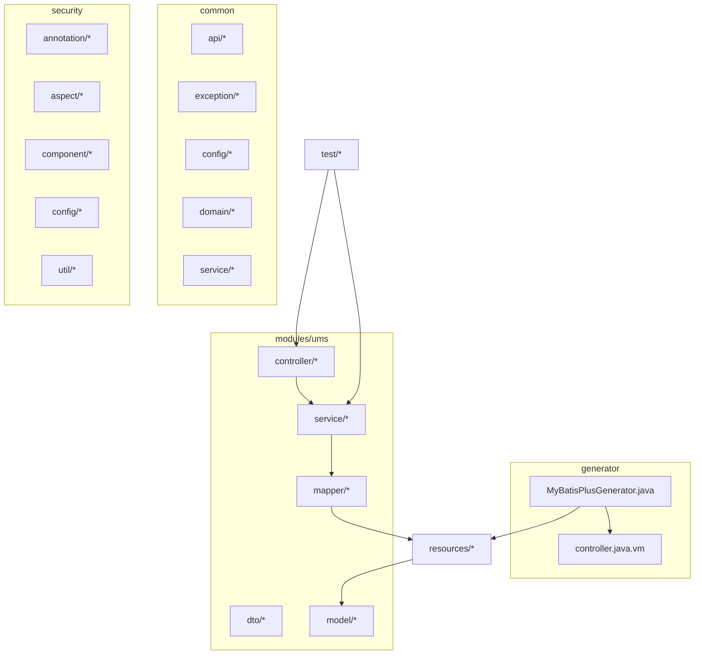
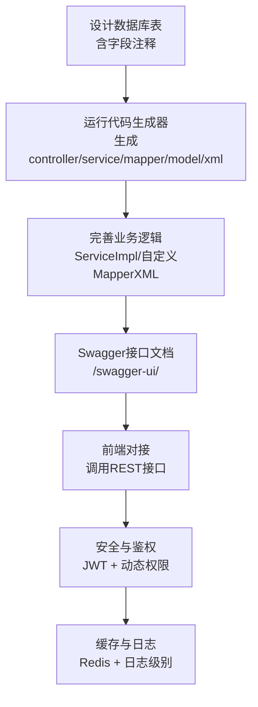
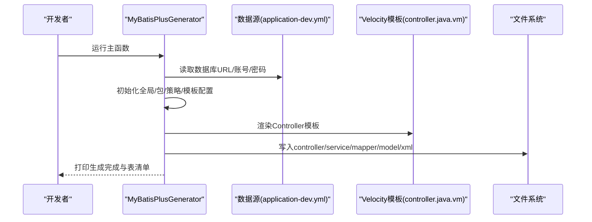
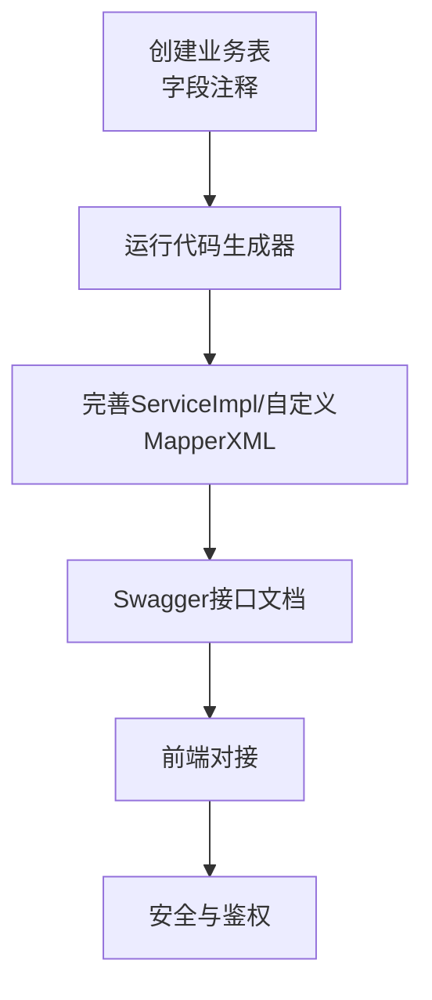
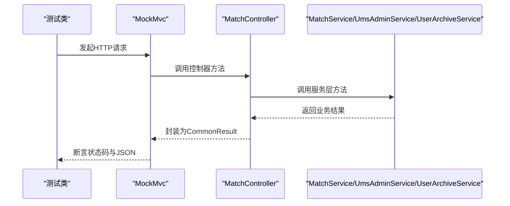
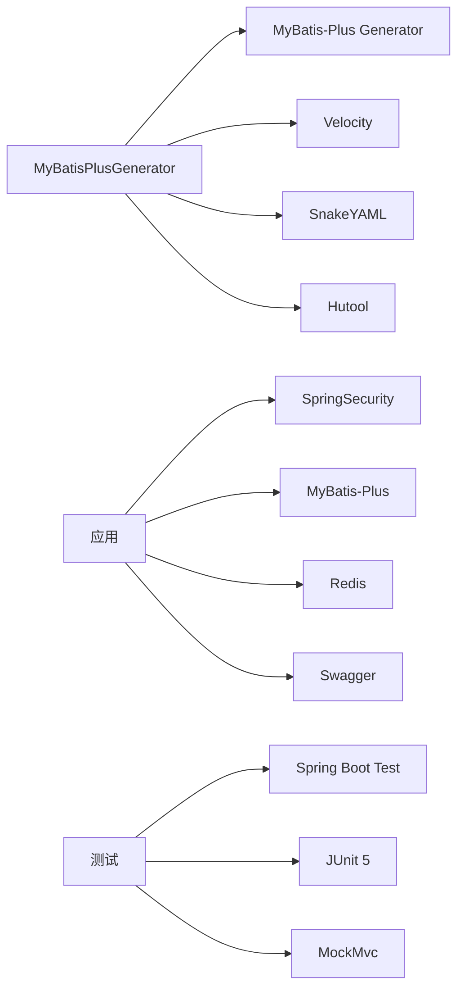

# 开发指南

<cite>
**本文引用的文件**
- [README.md](file://README.md)
- [MyBatisPlusGenerator.java](file://src/main/java/com/macro/mall/tiny/generator/MyBatisPlusGenerator.java)
- [generator.properties](file://src/main/resources/generator.properties)
- [application-dev.yml](file://src/main/resources/application-dev.yml)
- [application.yml](file://src/main/resources/application.yml)
- [controller.java.vm](file://src/main/resources/templates/controller.java.vm)
- [CommonResult.java](file://src/main/java/com/macro/mall/tiny/common/api/CommonResult.java)
- [GlobalExceptionHandler.java](file://src/main/java/com/macro/mall/tiny/common/exception/GlobalExceptionHandler.java)
- [UmsAdminService.java](file://src/main/java/com/macro/mall/tiny/modules/ums/service/UmsAdminService.java)
- [MallTinyApplicationTests.java](file://src/test/java/com/macro/mall/tiny/MallTinyApplicationTests.java)
- [MatchControllerTest.java](file://src/test/java/com/macro/mall/tiny/modules/ums/controller/MatchControllerTest.java)
</cite>

## 目录
1. [简介](#简介)
2. [项目结构](#项目结构)
3. [核心组件](#核心组件)
4. [架构总览](#架构总览)
5. [详细组件分析](#详细组件分析)
6. [依赖分析](#依赖分析)
7. [性能考虑](#性能考虑)
8. [故障排查指南](#故障排查指南)
9. [结论](#结论)
10. [附录](#附录)

## 简介
本指南面向初级与中级开发者，围绕 Mall-Tiny 项目提供从数据库表设计到前后端对接的完整开发流程，重点讲解 MyBatis Plus Generator 的使用方法（单表与模块级代码生成）、开发规范与最佳实践、单元与集成测试编写、性能优化建议以及调试与问题排查技巧。项目采用 Spring Boot + MyBatis-Plus 快速开发脚手架，内置 Swagger 文档、SpringSecurity 安全控制、Redis 缓存与 JWT 登录支持。

## 项目结构
项目采用按模块划分的层次化组织方式：
- generator：代码生成器入口类与模板
- modules/ums：权限管理模块（controller/dto/mapper/model/service）
- common：通用返回体、异常处理、配置、领域对象与通用服务
- security：安全认证与授权相关（注解、切面、组件、配置、工具）
- resources：MyBatis XML 映射、模板、配置文件
- test：集成测试样例

图表来源
- [MyBatisPlusGenerator.java:1-175](file://src/main/java/com/macro/mall/tiny/generator/MyBatisPlusGenerator.java#L1-L175)
- [controller.java.vm:1-82](file://src/main/resources/templates/controller.java.vm#L1-L82)

章节来源
- [README.md:61-87](file://README.md#L61-L87)
- [README.md:89-98](file://README.md#L89-L98)

## 核心组件
- 代码生成器：MyBatisPlusGenerator 负责从数据库读取元数据，结合模板生成 controller、service、mapper、model、mapper.xml，并按模块输出到标准包路径。
- 通用返回体与异常处理：CommonResult 统一响应结构；GlobalExceptionHandler 统一处理业务异常、参数校验异常、HTTP 解析异常、权限异常与系统异常。
- 安全与鉴权：基于 SpringSecurity + JWT，提供动态权限过滤、资源访问决策与切面缓存。
- 配置中心：application.yml 与 application-dev.yml 提供数据库、Redis、JWT、安全白名单等配置。

章节来源
- [MyBatisPlusGenerator.java:25-48](file://src/main/java/com/macro/mall/tiny/generator/MyBatisPlusGenerator.java#L25-L48)
- [CommonResult.java:1-125](file://src/main/java/com/macro/mall/tiny/common/api/CommonResult.java#L1-L125)
- [GlobalExceptionHandler.java:1-100](file://src/main/java/com/macro/mall/tiny/common/exception/GlobalExceptionHandler.java#L1-L100)
- [application.yml:1-57](file://src/main/resources/application.yml#L1-L57)
- [application-dev.yml:1-16](file://src/main/resources/application-dev.yml#L1-L16)

## 架构总览
下图展示从“数据库表”到“前端页面”的完整开发闭环：设计表 → 生成代码 → 编写业务 → 接口文档 → 前端对接。

图表来源
- [README.md:120-143](file://README.md#L120-L143)
- [README.md:300-313](file://README.md#L300-L313)
- [application.yml:24-57](file://src/main/resources/application.yml#L24-L57)

## 详细组件分析

### 代码生成器使用指南
- 运行入口：执行 generator 包下的 MyBatisPlusGenerator 主函数，自动从 application-dev.yml 读取数据源配置并生成代码。
- 生成范围：
  - 单表：传入模块名与表名（如 ums.user_archive），生成该表的全部层级代码。
  - 模块：传入模块名与通配前缀（如 ums_*），生成该模块下所有匹配表的代码。
- 输出路径：按模块输出到 modules/{module} 下的标准包结构，mapper.xml 输出至 resources/mapper/{module}。
- 模板：使用自定义 Velocity 模板 controller.java.vm，统一风格与注释。
- 关键点：
  - 表名与模块名在生成器中硬编码，便于快速批量生成。
  - 生成器通过 YAML 解析器读取 application-dev.yml，确保与运行配置一致。
  - 策略配置启用下划线转驼峰、Lombok、REST 风格、Hyphen 风格等，提升一致性。

图表来源
- [MyBatisPlusGenerator.java:35-48](file://src/main/java/com/macro/mall/tiny/generator/MyBatisPlusGenerator.java#L35-L48)
- [MyBatisPlusGenerator.java:53-70](file://src/main/java/com/macro/mall/tiny/generator/MyBatisPlusGenerator.java#L53-L70)
- [MyBatisPlusGenerator.java:128-132](file://src/main/java/com/macro/mall/tiny/generator/MyBatisPlusGenerator.java#L128-L132)
- [controller.java.vm:1-82](file://src/main/resources/templates/controller.java.vm#L1-L82)

章节来源
- [README.md:128-143](file://README.md#L128-L143)
- [MyBatisPlusGenerator.java:27-34](file://src/main/java/com/macro/mall/tiny/generator/MyBatisPlusGenerator.java#L27-L34)
- [MyBatisPlusGenerator.java:137-165](file://src/main/java/com/macro/mall/tiny/generator/MyBatisPlusGenerator.java#L137-L165)
- [application-dev.yml:1-16](file://src/main/resources/application-dev.yml#L1-L16)
- [generator.properties:1-5](file://src/main/resources/generator.properties#L1-L5)

### 开发规范与最佳实践
- 命名约定
  - 实体与字段：下划线转驼峰（策略已启用）。
  - 控制器：REST 风格与 Hyphen 风格，路径统一为模块小写路径。
  - 服务接口与实现：Service/ServiceImpl，Mapper/Impl。
- 代码注释
  - 控制器模板包含 Swagger 注解与接口描述，建议在生成后补充详细注释。
- 异常处理
  - 统一使用 CommonResult 返回结构；全局异常处理器覆盖参数校验、HTTP 解析、权限不足、系统异常等场景。
- 日志记录
  - application.yml 中设置根日志级别与 com.macro.mall 包的日志级别，便于开发调试。
- 参数校验
  - DTO 层使用 Jakarta Bean Validation 注解，Controller 方法添加 @Validated 开启校验。

章节来源
- [MyBatisPlusGenerator.java:137-154](file://src/main/java/com/macro/mall/tiny/generator/MyBatisPlusGenerator.java#L137-L154)
- [controller.java.vm:17-25](file://src/main/resources/templates/controller.java.vm#L17-L25)
- [CommonResult.java:21-100](file://src/main/java/com/macro/mall/tiny/common/api/CommonResult.java#L21-L100)
- [GlobalExceptionHandler.java:27-98](file://src/main/java/com/macro/mall/tiny/common/exception/GlobalExceptionHandler.java#L27-L98)
- [application.yml:13-16](file://src/main/resources/application.yml#L13-L16)
- [README.md:314-363](file://README.md#L314-L363)

### 业务开发流程（从表设计到前端对接）
- 设计表：在数据库中创建业务表，务必为字段添加注释，以便生成实体与接口文档。
- 生成代码：运行 MyBatisPlusGenerator，选择单表或模块生成。
- 编写业务：
  - 单表查询：优先使用 MyBatis-Plus 的 ServiceImpl/BaseMapper 方法，减少手写 SQL。
  - 分页查询：构造 Page 对象，调用 page 方法即可。
  - 多表查询：在 Mapper 接口中声明方法，在对应的 XML 中编写 SQL。
- 接口文档：启动项目后访问 Swagger UI 查看接口定义与参数说明。
- 前端对接：根据 Swagger 文档进行联调，注意鉴权与权限控制。

图表来源
- [README.md:120-143](file://README.md#L120-L143)
- [README.md:144-280](file://README.md#L144-L280)

章节来源
- [README.md:120-280](file://README.md#L120-L280)

### 测试指南（单元与集成）
- 单元测试
  - 使用 JUnit 5 与 Spring Boot Test，对服务层进行行为验证。
  - 示例：MallTinyApplicationTests 作为基础上下文测试样例。
- 集成测试
  - 使用 @WebMvcTest 与 MockMvc 对控制器进行端到端验证，配合 @MockBean 注入服务层依赖。
  - 示例：MatchControllerTest 展示了如何模拟用户、归档与匹配结果，断言状态码与 JSON 结果。
- 测试覆盖率
  - 建议为关键业务路径（增删改查、鉴权、异常分支）建立覆盖目标，结合 CI 工具统计覆盖率。

图表来源
- [MatchControllerTest.java:33-65](file://src/test/java/com/macro/mall/tiny/modules/ums/controller/MatchControllerTest.java#L33-L65)
- [MallTinyApplicationTests.java:1-16](file://src/test/java/com/macro/mall/tiny/MallTinyApplicationTests.java#L1-L16)

章节来源
- [MallTinyApplicationTests.java:1-16](file://src/test/java/com/macro/mall/tiny/MallTinyApplicationTests.java#L1-L16)
- [MatchControllerTest.java:27-65](file://src/test/java/com/macro/mall/tiny/modules/ums/controller/MatchControllerTest.java#L27-L65)

### 性能优化指导
- 数据库查询
  - 优先使用 MyBatis-Plus 的条件构造器与分页插件，避免 N+1 查询。
  - 对复杂多表查询，合理设计索引并在 XML 中编写高效 SQL。
- 缓存策略
  - 使用 Redis 缓存热点数据（如管理员与资源列表），降低数据库压力。
  - application.yml 中定义了 Redis key 前缀与过期时间，便于集中管理。
- 异步处理
  - 对非关键路径（如日志、统计任务）采用异步方式，减少请求延迟。
- 日志与监控
  - 合理设置日志级别，避免生产环境过多 DEBUG 日志影响性能。
  - 结合 Spring Boot Actuator 与 Druid 监控数据库连接池。

章节来源
- [application.yml:30-37](file://src/main/resources/application.yml#L30-L37)
- [README.md:282-296](file://README.md#L282-L296)

### 调试技巧与问题排查
- 接口调试
  - 通过 Swagger UI 调试接口，先登录获取 Token，再在页面顶部 Authorize 输入，随后调用受保护接口。
- 参数校验
  - 若出现参数校验失败，检查 DTO 字段上的校验注解与 Controller 上的 @Validated 是否正确配置。
- 异常处理
  - 全局异常处理器会将常见异常转换为统一返回结构，便于前端与测试定位问题。
- 日志定位
  - 在 application-dev.yml 中提高日志级别，观察业务链路与异常堆栈。
- 安全与权限
  - 确认安全白名单配置与 JWT 头部是否正确传递，避免 403/401。

章节来源
- [README.md:300-313](file://README.md#L300-L313)
- [GlobalExceptionHandler.java:36-98](file://src/main/java/com/macro/mall/tiny/common/exception/GlobalExceptionHandler.java#L36-L98)
- [application-dev.yml:13-16](file://src/main/resources/application-dev.yml#L13-L16)

## 依赖分析
- 生成器依赖
  - MyBatis-Plus Generator：负责代码生成。
  - Velocity：模板渲染引擎。
  - SnakeYAML：读取 application-dev.yml。
  - Hutool：字符串与配置工具。
- 运行时依赖
  - Spring Boot、SpringSecurity、MyBatis-Plus、Redis、JWT、Swagger 等。
- 测试依赖
  - Spring Boot Test、JUnit 5、MockMvc。

图表来源
- [MyBatisPlusGenerator.java:3-13](file://src/main/java/com/macro/mall/tiny/generator/MyBatisPlusGenerator.java#L3-L13)
- [application.yml:1-57](file://src/main/resources/application.yml#L1-L57)

章节来源
- [MyBatisPlusGenerator.java:3-13](file://src/main/java/com/macro/mall/tiny/generator/MyBatisPlusGenerator.java#L3-L13)
- [application.yml:1-57](file://src/main/resources/application.yml#L1-L57)

## 性能考虑
- 查询优化
  - 使用 MyBatis-Plus 的分页与条件构造器，避免一次性加载大结果集。
  - 对高频查询字段建立索引，减少全表扫描。
- 缓存优化
  - 合理设置缓存键与过期时间，避免缓存穿透与雪崩。
  - 对读多写少的数据优先走缓存。
- 并发与异步
  - 对耗时但非阻塞的操作采用异步处理，释放主线程。
- 监控与压测
  - 使用 Actuator 与 Druid 监控系统与数据库连接池，结合压测工具评估瓶颈。

## 故障排查指南
- 代码生成失败
  - 检查 application-dev.yml 的数据库连接是否正确，确认数据库服务可用。
  - 确认生成器读取的 YAML 文件路径与内容无误。
- 控制器无法访问
  - 检查安全白名单配置与 JWT 头部是否正确。
  - 确认控制器路径与请求方法匹配。
- 参数校验失败
  - 检查 DTO 字段注解与 Controller 的 @Validated 是否生效。
- 返回结构不一致
  - 确保使用 CommonResult 统一返回，异常由 GlobalExceptionHandler 统一处理。

章节来源
- [application-dev.yml:1-16](file://src/main/resources/application-dev.yml#L1-L16)
- [GlobalExceptionHandler.java:27-98](file://src/main/java/com/macro/mall/tiny/common/exception/GlobalExceptionHandler.java#L27-L98)
- [CommonResult.java:21-100](file://src/main/java/com/macro/mall/tiny/common/api/CommonResult.java#L21-L100)

## 结论
通过本指南，开发者可以快速掌握 Mall-Tiny 的代码生成、开发规范、测试与性能优化方法，并形成从数据库表设计到前端对接的完整开发闭环。建议在团队内固化命名与注释规范，统一异常与返回结构，持续完善测试覆盖与监控体系，保障系统的稳定性与可维护性。

## 附录
- 快速上手
  - 导入 mall_tiny.sql，启动应用，访问 Swagger UI 进行接口调试。
- 安全与鉴权
  - 登录接口获取 Token，使用 Swagger UI 的 Authorize 功能填入 Token 后访问受保护接口。
- 配置参考
  - application.yml 与 application-dev.yml 提供数据库、Redis、JWT、安全白名单等关键配置项。

章节来源
- [README.md:53-114](file://README.md#L53-L114)
- [application.yml:1-57](file://src/main/resources/application.yml#L1-L57)
- [application-dev.yml:1-16](file://src/main/resources/application-dev.yml#L1-L16)