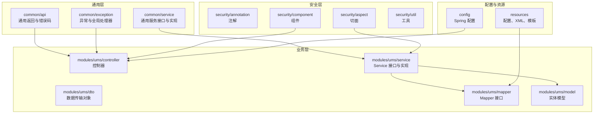
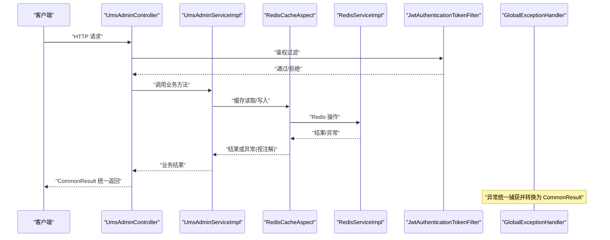
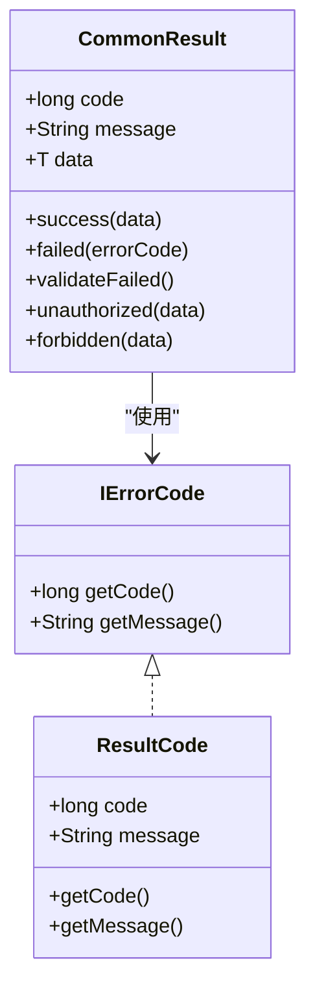
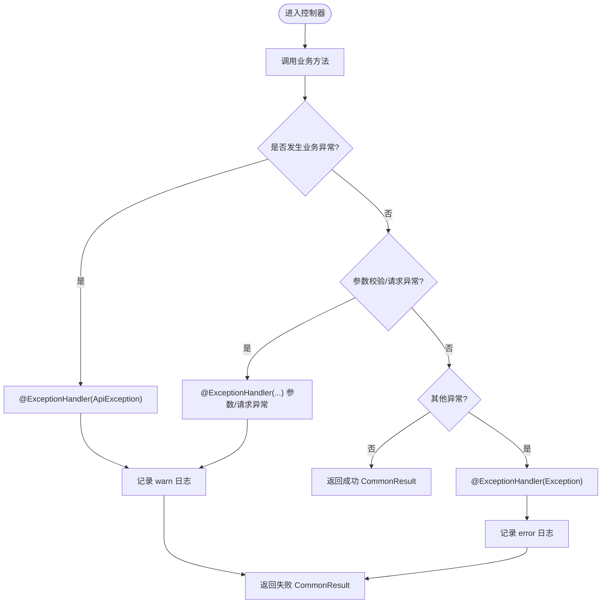
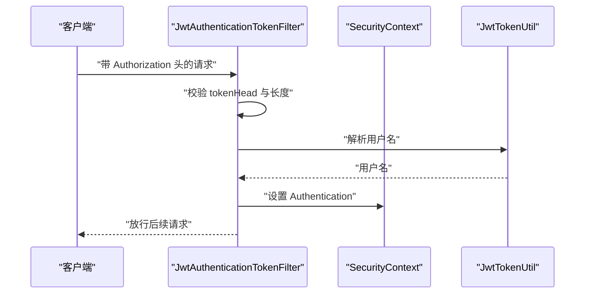
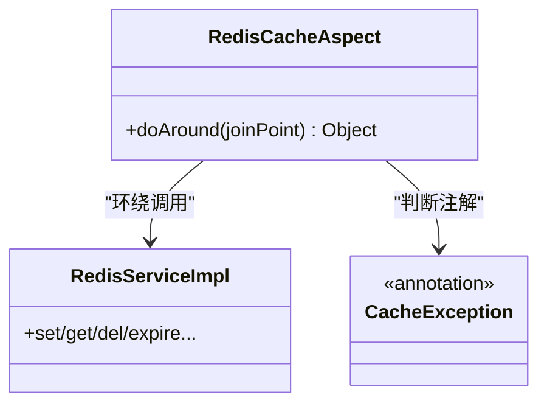
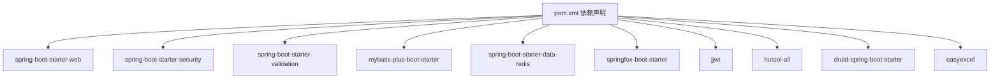

# 开发规范与最佳实践

<cite>
**本文引用的文件**
- [ApiException.java](file://src/main/java/com/macro/mall/tiny/common/exception/ApiException.java)
- [GlobalExceptionHandler.java](file://src/main/java/com/macro/mall/tiny/common/exception/GlobalExceptionHandler.java)
- [Asserts.java](file://src/main/java/com/macro/mall/tiny/common/exception/Asserts.java)
- [CommonResult.java](file://src/main/java/com/macro/mall/tiny/common/api/CommonResult.java)
- [IErrorCode.java](file://src/main/java/com/macro/mall/tiny/common/api/IErrorCode.java)
- [ResultCode.java](file://src/main/java/com/macro/mall/tiny/common/api/ResultCode.java)
- [RedisCacheAspect.java](file://src/main/java/com/macro/mall/tiny/security/aspect/RedisCacheAspect.java)
- [JwtAuthenticationTokenFilter.java](file://src/main/java/com/macro/mall/tiny/security/component/JwtAuthenticationTokenFilter.java)
- [UmsAdminController.java](file://src/main/java/com/macro/mall/tiny/modules/ums/controller/UmsAdminController.java)
- [application.yml](file://src/main/resources/application.yml)
- [pom.xml](file://pom.xml)
- [UmsAdminServiceImpl.java](file://src/main/java/com/macro/mall/tiny/modules/ums/service/impl/UmsAdminServiceImpl.java)
- [RedisServiceImpl.java](file://src/main/java/com/macro/mall/tiny/common/service/impl/RedisServiceImpl.java)
- [CacheException.java](file://src/main/java/com/macro/mall/tiny/security/annotation/CacheException.java)
- [README.md](file://README.md)
</cite>

## 目录
1. [简介](#简介)
2. [项目结构](#项目结构)
3. [核心组件](#核心组件)
4. [架构总览](#架构总览)
5. [详细组件分析](#详细组件分析)
6. [依赖分析](#依赖分析)
7. [性能考虑](#性能考虑)
8. [故障排查指南](#故障排查指南)
9. [结论](#结论)
10. [附录](#附录)

## 简介
本指南面向 Mall-Tiny 项目团队，旨在提供一套统一、可执行的开发规范与最佳实践，覆盖命名规范、注释规范、异常处理、日志记录、代码风格、安全编码、性能优化以及代码审查清单。所有规范均以仓库现有实现为依据，结合项目技术栈（Spring Boot、Spring Security、MyBatis-Plus、Redis、JWT 等）形成可落地的工程实践。

## 项目结构
Mall-Tiny 采用按领域与层次混合的组织方式，主要模块包括：
- common：通用结果封装、异常体系、通用配置与服务
- modules/ums：权限管理模块（控制器、DTO、Mapper、Model、Service）
- security：安全认证授权相关（注解、切面、组件、配置、工具）
- config：Spring Boot 配置类
- resources：配置文件、Mapper XML、模板与资源
- test：单元测试与集成测试

图表来源
- [UmsAdminController.java:1-350](file://src/main/java/com/macro/mall/tiny/modules/ums/controller/UmsAdminController.java#L1-L350)
- [CommonResult.java:1-125](file://src/main/java/com/macro/mall/tiny/common/api/CommonResult.java#L1-L125)
- [GlobalExceptionHandler.java:1-100](file://src/main/java/com/macro/mall/tiny/common/exception/GlobalExceptionHandler.java#L1-L100)
- [RedisCacheAspect.java:1-51](file://src/main/java/com/macro/mall/tiny/security/aspect/RedisCacheAspect.java#L1-L51)
- [JwtAuthenticationTokenFilter.java:1-59](file://src/main/java/com/macro/mall/tiny/security/component/JwtAuthenticationTokenFilter.java#L1-L59)

章节来源
- [README.md:59-98](file://README.md#L59-L98)

## 核心组件
- 统一返回对象与错误码：通过 CommonResult 与 ResultCode 统一响应结构与错误语义，便于前端与接口文档一致性。
- 异常体系：ApiException 作为业务异常载体，配合 Asserts 快速抛出；GlobalExceptionHandler 统一捕获并转换为统一返回。
- 安全与缓存：JWT 过滤器完成鉴权，Redis 切面保证缓存异常不影响主业务，CacheException 注解控制缓存方法异常传播策略。
- 业务控制器：UmsAdminController 展示了参数校验、日志记录、统一返回与业务流程编排的实践。

章节来源
- [CommonResult.java:1-125](file://src/main/java/com/macro/mall/tiny/common/api/CommonResult.java#L1-L125)
- [ResultCode.java:1-38](file://src/main/java/com/macro/mall/tiny/common/api/ResultCode.java#L1-L38)
- [ApiException.java:1-34](file://src/main/java/com/macro/mall/tiny/common/exception/ApiException.java#L1-L34)
- [Asserts.java:1-19](file://src/main/java/com/macro/mall/tiny/common/exception/Asserts.java#L1-L19)
- [GlobalExceptionHandler.java:1-100](file://src/main/java/com/macro/mall/tiny/common/exception/GlobalExceptionHandler.java#L1-L100)
- [RedisCacheAspect.java:1-51](file://src/main/java/com/macro/mall/tiny/security/aspect/RedisCacheAspect.java#L1-L51)
- [JwtAuthenticationTokenFilter.java:1-59](file://src/main/java/com/macro/mall/tiny/security/component/JwtAuthenticationTokenFilter.java#L1-L59)
- [UmsAdminController.java:1-350](file://src/main/java/com/macro/mall/tiny/modules/ums/controller/UmsAdminController.java#L1-L350)

## 架构总览
下图展示了请求从控制器到服务、缓存与安全组件的整体流转，以及异常与返回的统一处理路径。

图表来源
- [UmsAdminController.java:1-350](file://src/main/java/com/macro/mall/tiny/modules/ums/controller/UmsAdminController.java#L1-L350)
- [UmsAdminServiceImpl.java:1-200](file://src/main/java/com/macro/mall/tiny/modules/ums/service/impl/UmsAdminServiceImpl.java#L1-L200)
- [RedisCacheAspect.java:1-51](file://src/main/java/com/macro/mall/tiny/security/aspect/RedisCacheAspect.java#L1-L51)
- [RedisServiceImpl.java:1-198](file://src/main/java/com/macro/mall/tiny/common/service/impl/RedisServiceImpl.java#L1-L198)
- [JwtAuthenticationTokenFilter.java:1-59](file://src/main/java/com/macro/mall/tiny/security/component/JwtAuthenticationTokenFilter.java#L1-L59)
- [GlobalExceptionHandler.java:1-100](file://src/main/java/com/macro/mall/tiny/common/exception/GlobalExceptionHandler.java#L1-L100)

## 详细组件分析

### 统一返回与错误码
- 返回结构：CommonResult 提供 success/failed/validateFailed/unauthorized/forbidden 等静态工厂方法，统一前后端交互格式。
- 错误码：ResultCode 定义常用业务错误码，IErrorCode 为扩展提供接口约束。
- 使用建议：优先使用 ResultCode 内置枚举；自定义业务错误时实现 IErrorCode 并在 GlobalExceptionHandler 中统一映射。

图表来源
- [CommonResult.java:1-125](file://src/main/java/com/macro/mall/tiny/common/api/CommonResult.java#L1-L125)
- [IErrorCode.java:1-12](file://src/main/java/com/macro/mall/tiny/common/api/IErrorCode.java#L1-L12)
- [ResultCode.java:1-38](file://src/main/java/com/macro/mall/tiny/common/api/ResultCode.java#L1-L38)

章节来源
- [CommonResult.java:1-125](file://src/main/java/com/macro/mall/tiny/common/api/CommonResult.java#L1-L125)
- [ResultCode.java:1-38](file://src/main/java/com/macro/mall/tiny/common/api/ResultCode.java#L1-L38)
- [IErrorCode.java:1-12](file://src/main/java/com/macro/mall/tiny/common/api/IErrorCode.java#L1-L12)

### 异常处理最佳实践
- ApiException：承载业务错误码与消息，支持多种构造方式。
- Asserts：提供 fail(message/errorCode) 快速断言与抛错。
- GlobalExceptionHandler：集中处理业务异常、参数校验异常、请求体解析异常、访问拒绝、通用异常等，并统一返回 CommonResult。
- 建议：
  - 业务异常一律抛出 ApiException 或通过 Asserts.fail 触发。
  - 不同异常类型使用不同日志级别（warn/error），便于监控与审计。
  - 对外错误信息避免泄露内部细节，优先使用 ResultCode 的国际化友好文案。

图表来源
- [GlobalExceptionHandler.java:1-100](file://src/main/java/com/macro/mall/tiny/common/exception/GlobalExceptionHandler.java#L1-L100)
- [ApiException.java:1-34](file://src/main/java/com/macro/mall/tiny/common/exception/ApiException.java#L1-L34)
- [Asserts.java:1-19](file://src/main/java/com/macro/mall/tiny/common/exception/Asserts.java#L1-L19)

章节来源
- [GlobalExceptionHandler.java:1-100](file://src/main/java/com/macro/mall/tiny/common/exception/GlobalExceptionHandler.java#L1-L100)
- [ApiException.java:1-34](file://src/main/java/com/macro/mall/tiny/common/exception/ApiException.java#L1-L34)
- [Asserts.java:1-19](file://src/main/java/com/macro/mall/tiny/common/exception/Asserts.java#L1-L19)

### 安全与鉴权
- JWT 过滤器：从请求头提取令牌，解析用户信息并注入 Security 上下文，实现无状态鉴权。
- 白名单配置：application.yml 中的 secure.ignored.urls 定义免鉴权路径，确保 Swagger、登录、注册等接口可访问。
- 建议：
  - 所有受保护接口必须携带有效 JWT。
  - 登录/注册等敏感接口务必纳入白名单管理，避免重复鉴权。
  - 密码传输与存储使用强加密（项目已使用 PasswordEncoder）。

图表来源
- [JwtAuthenticationTokenFilter.java:1-59](file://src/main/java/com/macro/mall/tiny/security/component/JwtAuthenticationTokenFilter.java#L1-L59)
- [application.yml:38-57](file://src/main/resources/application.yml#L38-L57)

章节来源
- [JwtAuthenticationTokenFilter.java:1-59](file://src/main/java/com/macro/mall/tiny/security/component/JwtAuthenticationTokenFilter.java#L1-L59)
- [application.yml:38-57](file://src/main/resources/application.yml#L38-L57)

### 缓存与降级
- Redis 切面：对以 CacheService 结尾的服务进行环绕，拦截缓存异常；带 CacheException 注解的方法允许异常向上抛出，其余异常仅记录日志，保证主业务不受缓存故障影响。
- CacheException 注解：用于声明“缓存异常需暴露”的方法，确保关键路径的可用性。
- Redis 服务：提供键值、哈希、集合、列表等常用操作，支持过期时间与批量操作。

图表来源
- [RedisCacheAspect.java:1-51](file://src/main/java/com/macro/mall/tiny/security/aspect/RedisCacheAspect.java#L1-L51)
- [CacheException.java:1-13](file://src/main/java/com/macro/mall/tiny/security/annotation/CacheException.java#L1-L13)
- [RedisServiceImpl.java:1-198](file://src/main/java/com/macro/mall/tiny/common/service/impl/RedisServiceImpl.java#L1-L198)

章节来源
- [RedisCacheAspect.java:1-51](file://src/main/java/com/macro/mall/tiny/security/aspect/RedisCacheAspect.java#L1-L51)
- [CacheException.java:1-13](file://src/main/java/com/macro/mall/tiny/security/annotation/CacheException.java#L1-L13)
- [RedisServiceImpl.java:1-198](file://src/main/java/com/macro/mall/tiny/common/service/impl/RedisServiceImpl.java#L1-L198)

### 控制器与业务编排
- UmsAdminController：展示参数校验（@Validated）、日志记录（SLF4J）、统一返回（CommonResult）、业务流程（登录、注册、密码找回、角色与资源查询）等最佳实践。
- 建议：
  - 所有对外接口返回统一结构，避免直接抛异常给客户端。
  - 敏感操作（密码、角色变更）记录审计日志，便于追踪。

章节来源
- [UmsAdminController.java:1-350](file://src/main/java/com/macro/mall/tiny/modules/ums/controller/UmsAdminController.java#L1-L350)

## 依赖分析
- Maven 依赖：Spring Boot Web、Security、Validation、MyBatis-Plus、Redis、Swagger、JWT、Hutool、Druid、EasyExcel 等。
- 配置要点：application.yml 中定义了 JWT、Redis、安全白名单、MyBatis-Plus 映射与驼峰配置等。

图表来源
- [pom.xml:1-222](file://pom.xml#L1-L222)

章节来源
- [pom.xml:1-222](file://pom.xml#L1-L222)
- [application.yml:1-57](file://src/main/resources/application.yml#L1-L57)

## 性能考虑
- 数据访问层
  - 使用 MyBatis-Plus 的条件构造器与分页插件，避免手写复杂 SQL；多表关联尽量通过 XML 实现并合理加索引。
  - 对高频查询使用 Redis 缓存，结合 RedisCacheAspect 降低数据库压力。
- 缓存策略
  - 为用户信息、资源列表等热点数据设置合理过期时间；对写操作采用惰性失效或主动清理。
  - 使用 CacheException 注解标识关键路径，确保缓存异常不影响主流程。
- 安全与鉴权
  - JWT 解析与校验在过滤器中完成，减少控制器重复逻辑。
  - 白名单配置最小化，仅开放必要接口。
- 日志与监控
  - 使用 SLF4J 记录关键路径日志，避免过多 debug 输出影响性能。
  - 对异常与耗时操作进行告警与追踪。

[本节为通用指导，不直接分析具体文件]

## 故障排查指南
- 常见问题定位
  - 参数校验失败：查看 GlobalExceptionHandler 对 MethodArgumentNotValidException/BindException 的处理，确认字段与提示信息。
  - 请求体解析失败：检查 JSON 格式与 Content-Type。
  - 访问被拒绝：确认 JWT 是否正确、白名单配置是否覆盖目标路径。
  - 业务异常：通过 ApiException 与 Asserts 抛出，查看日志中的 warn/error 级别信息。
- 日志级别建议
  - warn：参数校验失败、业务异常、访问被拒绝等可控问题。
  - error：未捕获异常、系统内部错误、缓存异常等严重问题。
- 敏感信息处理
  - 日志中避免打印明文密码、令牌等敏感信息；对验证码等临时信息仅在演示场景短时输出。

章节来源
- [GlobalExceptionHandler.java:1-100](file://src/main/java/com/macro/mall/tiny/common/exception/GlobalExceptionHandler.java#L1-L100)
- [UmsAdminController.java:1-350](file://src/main/java/com/macro/mall/tiny/modules/ums/controller/UmsAdminController.java#L1-L350)

## 结论
本规范以 Mall-Tiny 现有实现为基础，明确了统一返回、异常处理、安全鉴权、缓存策略与日志记录等关键实践。建议团队在开发过程中严格遵循命名与注释规范，统一使用 CommonResult 与 ResultCode，规范使用 JWT 与缓存切面，并持续通过代码审查与测试保障质量与性能。

[本节为总结性内容，不直接分析具体文件]

## 附录

### 代码命名规范
- 包命名：采用反向域名 + 功能域，如 com.macro.mall.tiny.modules.ums。
- 类命名：采用帕斯卡命名法，如 UmsAdminController、RedisCacheAspect。
- 方法命名：采用小驼峰，如 login、refreshToken、getAdminByUsername。
- 变量命名：采用小驼峰，如 tokenHeader、tokenHead、jwtTokenUtil。
- 常量命名：全大写+下划线，如 DEFAULT_PAGE_SIZE。
- 接口与抽象类：以 I 前缀或抽象词开头，如 IErrorCode、ServiceImpl。

[本节为通用指导，不直接分析具体文件]

### 注释规范
- 类注释：说明职责、用途与关键行为，标注创建时间与作者。
- 方法注释：描述入参、出参、异常与边界条件；对复杂逻辑补充算法说明。
- 字段注释：对 DTO 与 Model 字段添加说明，便于 Swagger 文档生成。
- 示例参考：UmsAdminController、CommonResult、ResultCode 等均提供了良好的注释范式。

章节来源
- [UmsAdminController.java:1-350](file://src/main/java/com/macro/mall/tiny/modules/ums/controller/UmsAdminController.java#L1-L350)
- [CommonResult.java:1-125](file://src/main/java/com/macro/mall/tiny/common/api/CommonResult.java#L1-L125)
- [ResultCode.java:1-38](file://src/main/java/com/macro/mall/tiny/common/api/ResultCode.java#L1-L38)

### 异常处理最佳实践清单
- 业务异常统一使用 ApiException 或 Asserts.fail。
- 全局异常处理器统一返回 CommonResult，区分 warn/error 级别。
- 对外错误信息简洁、友好，避免泄露内部实现细节。
- 对参数校验、请求体解析、访问拒绝等异常分别处理并记录日志。

章节来源
- [ApiException.java:1-34](file://src/main/java/com/macro/mall/tiny/common/exception/ApiException.java#L1-L34)
- [Asserts.java:1-19](file://src/main/java/com/macro/mall/tiny/common/exception/Asserts.java#L1-L19)
- [GlobalExceptionHandler.java:1-100](file://src/main/java/com/macro/mall/tiny/common/exception/GlobalExceptionHandler.java#L1-L100)

### 日志记录规范
- 日志级别：warn 用于业务异常与参数校验失败；error 用于系统异常与未捕获异常。
- 内容格式：包含模块、方法、关键参数与结果摘要；避免打印敏感信息。
- 敏感信息：密码、令牌、验证码等不得出现在日志中。

章节来源
- [GlobalExceptionHandler.java:1-100](file://src/main/java/com/macro/mall/tiny/common/exception/GlobalExceptionHandler.java#L1-L100)
- [UmsAdminController.java:1-350](file://src/main/java/com/macro/mall/tiny/modules/ums/controller/UmsAdminController.java#L1-L350)

### 代码风格指南
- 缩进与空格：统一使用 4 空格缩进，行尾不保留多余空格。
- 换行：每行最大长度不超过 120；长表达式分行书写并保持对齐。
- 导入：按字母顺序排列，避免通配符导入。

[本节为通用指导，不直接分析具体文件]

### 安全编码规范
- SQL 注入防护：使用 MyBatis-Plus 条件构造器与预编译参数，避免字符串拼接。
- XSS 防护：对用户输入进行校验与转义；前后端配合限制富文本与特殊字符。
- 输入验证：使用 Jakarta Bean Validation 注解进行参数校验。
- 权限控制：基于 Spring Security 与 JWT 实现细粒度权限控制，白名单最小化。

章节来源
- [UmsAdminController.java:1-350](file://src/main/java/com/macro/mall/tiny/modules/ums/controller/UmsAdminController.java#L1-L350)
- [application.yml:38-57](file://src/main/resources/application.yml#L38-L57)

### 性能优化建议
- 数据库查询：使用分页与条件过滤；为热点字段建立索引；避免 N+1 查询。
- 缓存使用：热点数据缓存、合理过期、批量读写；缓存异常不影响主流程。
- 异步处理：对非关键路径（如日志、通知）采用异步或队列处理。
- 监控与告警：对慢查询、异常率与缓存命中率进行监控。

[本节为通用指导，不直接分析具体文件]

### 代码审查清单
- 命名与注释：类/方法/变量命名清晰，注释完整。
- 异常处理：业务异常统一、日志级别正确、对外信息友好。
- 安全：参数校验、权限控制、敏感信息处理到位。
- 性能：查询优化、缓存策略、异步处理。
- 测试：单元测试与集成测试覆盖关键路径。
- 配置：application.yml 参数正确、白名单合理。

[本节为通用指导，不直接分析具体文件]