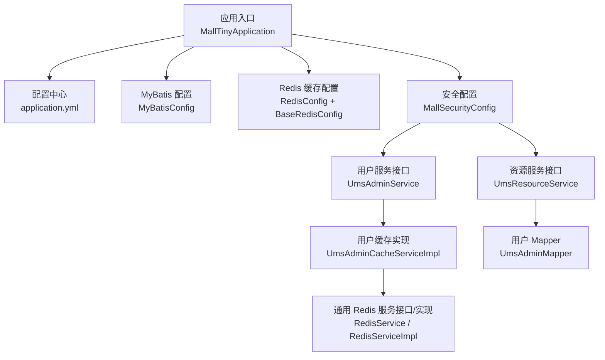
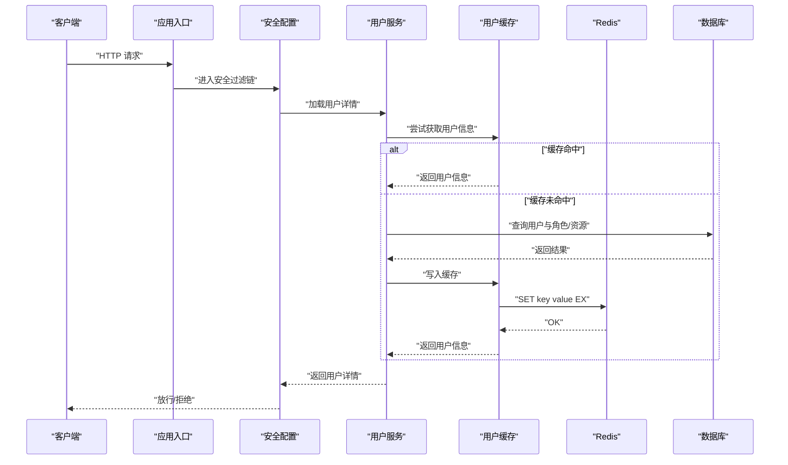
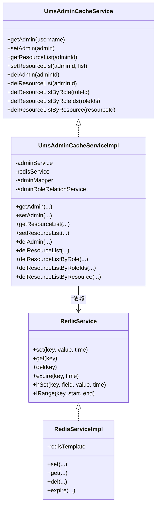
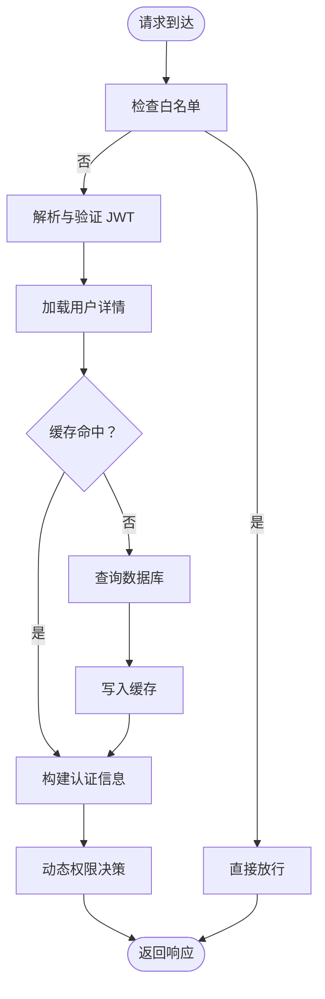
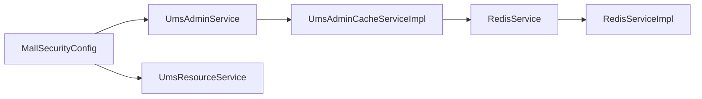

# 性能优化指南

<cite>
**本文引用的文件**
- [MallTinyApplication.java](file://src/main/java/com/macro/mall/tiny/MallTinyApplication.java)
- [application.yml](file://src/main/resources/application.yml)
- [MyBatisConfig.java](file://src/main/java/com/macro/mall/tiny/config/MyBatisConfig.java)
- [RedisConfig.java](file://src/main/java/com/macro/mall/tiny/config/RedisConfig.java)
- [BaseRedisConfig.java](file://src/main/java/com/macro/mall/tiny/common/config/BaseRedisConfig.java)
- [RedisService.java](file://src/main/java/com/macro/mall/tiny/common/service/RedisService.java)
- [RedisServiceImpl.java](file://src/main/java/com/macro/mall/tiny/common/service/impl/RedisServiceImpl.java)
- [RedisCacheAspect.java](file://src/main/java/com/macro/mall/tiny/security/aspect/RedisCacheAspect.java)
- [UmsAdminCacheServiceImpl.java](file://src/main/java/com/macro/mall/tiny/modules/ums/service/impl/UmsAdminCacheServiceImpl.java)
- [UmsAdminService.java](file://src/main/java/com/macro/mall/tiny/modules/ums/service/UmsAdminService.java)
- [UmsResourceService.java](file://src/main/java/com/macro/mall/tiny/modules/ums/service/UmsResourceService.java)
- [UmsAdminMapper.java](file://src/main/java/com/macro/mall/tiny/modules/ums/mapper/UmsAdminMapper.java)
- [MallSecurityConfig.java](file://src/main/java/com/macro/mall/tiny/config/MallSecurityConfig.java)
</cite>

## 目录
1. [简介](#简介)
2. [项目结构](#项目结构)
3. [核心组件](#核心组件)
4. [架构总览](#架构总览)
5. [详细组件分析](#详细组件分析)
6. [依赖分析](#依赖分析)
7. [性能考虑](#性能考虑)
8. [故障排查指南](#故障排查指南)
9. [结论](#结论)
10. [附录](#附录)

## 简介
本指南面向 Mall-Tiny 项目，围绕数据库查询优化、缓存策略、异步处理、Spring Security 安全优化、内存与网络优化、性能监控与诊断等方面，结合现有代码实现，给出系统化的性能优化建议与实践案例。内容兼顾工程落地与可操作性，帮助在不破坏现有架构的前提下提升系统吞吐与稳定性。

## 项目结构
Mall-Tiny 采用标准 Spring Boot 结构，核心模块集中在 ums 子系统（用户与权限），并以 MyBatis-Plus 提供 ORM 能力，Redis 提供缓存能力，Spring Security 提供鉴权与动态权限控制。应用入口、配置与服务层分布如下：

图示来源
- [MallTinyApplication.java:1-14](file://src/main/java/com/macro/mall/tiny/MallTinyApplication.java#L1-L14)
- [application.yml:1-57](file://src/main/resources/application.yml#L1-L57)
- [MyBatisConfig.java:1-28](file://src/main/java/com/macro/mall/tiny/config/MyBatisConfig.java#L1-L28)
- [RedisConfig.java:1-16](file://src/main/java/com/macro/mall/tiny/config/RedisConfig.java#L1-L16)
- [BaseRedisConfig.java:1-69](file://src/main/java/com/macro/mall/tiny/common/config/BaseRedisConfig.java#L1-L69)
- [MallSecurityConfig.java:1-54](file://src/main/java/com/macro/mall/tiny/config/MallSecurityConfig.java#L1-L54)
- [UmsAdminService.java:1-90](file://src/main/java/com/macro/mall/tiny/modules/ums/service/UmsAdminService.java#L1-L90)
- [UmsAdminCacheServiceImpl.java:1-116](file://src/main/java/com/macro/mall/tiny/modules/ums/service/impl/UmsAdminCacheServiceImpl.java#L1-L116)
- [RedisService.java:1-182](file://src/main/java/com/macro/mall/tiny/common/service/RedisService.java#L1-L182)
- [RedisServiceImpl.java:1-198](file://src/main/java/com/macro/mall/tiny/common/service/impl/RedisServiceImpl.java#L1-L198)
- [UmsResourceService.java:1-41](file://src/main/java/com/macro/mall/tiny/modules/ums/service/UmsResourceService.java#L1-L41)
- [UmsAdminMapper.java:1-25](file://src/main/java/com/macro/mall/tiny/modules/ums/mapper/UmsAdminMapper.java#L1-L25)

章节来源
- [MallTinyApplication.java:1-14](file://src/main/java/com/macro/mall/tiny/MallTinyApplication.java#L1-L14)
- [application.yml:1-57](file://src/main/resources/application.yml#L1-L57)

## 核心组件
- 应用入口与启动：负责应用初始化与上下文加载。
- 配置中心：集中管理端口、MyBatis-Plus、JWT、Redis、安全白名单等配置。
- MyBatis-Plus：启用分页插件，统一 Mapper 扫描，支持自动映射与驼峰命名。
- Redis：提供序列化、缓存管理器、模板与通用服务接口，支撑用户与资源缓存。
- 安全模块：基于 Spring Security 的动态权限数据源、JWT 过滤链与动态资源决策。
- 服务层：用户与资源服务接口，配合缓存实现降低数据库压力。

章节来源
- [MyBatisConfig.java:1-28](file://src/main/java/com/macro/mall/tiny/config/MyBatisConfig.java#L1-L28)
- [RedisConfig.java:1-16](file://src/main/java/com/macro/mall/tiny/config/RedisConfig.java#L1-L16)
- [BaseRedisConfig.java:1-69](file://src/main/java/com/macro/mall/tiny/common/config/BaseRedisConfig.java#L1-L69)
- [MallSecurityConfig.java:1-54](file://src/main/java/com/macro/mall/tiny/config/MallSecurityConfig.java#L1-L54)
- [UmsAdminService.java:1-90](file://src/main/java/com/macro/mall/tiny/modules/ums/service/UmsAdminService.java#L1-L90)
- [UmsResourceService.java:1-41](file://src/main/java/com/macro/mall/tiny/modules/ums/service/UmsResourceService.java#L1-L41)

## 架构总览
下图展示应用启动到鉴权与缓存的关键交互路径，便于定位性能瓶颈与优化点。

图示来源
- [MallSecurityConfig.java:33-52](file://src/main/java/com/macro/mall/tiny/config/MallSecurityConfig.java#L33-L52)
- [UmsAdminService.java:83-88](file://src/main/java/com/macro/mall/tiny/modules/ums/service/UmsAdminService.java#L83-L88)
- [UmsAdminCacheServiceImpl.java:93-114](file://src/main/java/com/macro/mall/tiny/modules/ums/service/impl/UmsAdminCacheServiceImpl.java#L93-L114)
- [RedisServiceImpl.java:20-33](file://src/main/java/com/macro/mall/tiny/common/service/impl/RedisServiceImpl.java#L20-L33)

## 详细组件分析

### 数据库查询优化
- 分页查询优化
  - 已启用 MyBatis-Plus 分页插件，MySQL 内核，避免 N+1 查询与全表扫描。
  - 建议：对高频分页接口增加覆盖索引；限制每页最大条数；对排序字段建立复合索引。
- SQL 语句优化
  - 使用条件查询与精准字段选择，避免 SELECT *。
  - 对关联查询使用 JOIN 并限定过滤条件，减少中间结果集。
- 索引设计
  - 常用过滤字段（如用户名、角色 ID、资源 ID）建立单列或复合索引。
  - 对分页排序字段建立索引，避免排序导致的临时表与文件排序。
- 查询计划分析
  - 使用 EXPLAIN 分析慢查询，关注 key、rows、Extra 字段，避免全表扫描与回表。
- 分页查询优化
  - 采用“延迟关联”或“索引覆盖”策略，减少回表次数。
  - 对大数据量表进行分区或归档，降低热数据范围。

章节来源
- [MyBatisConfig.java:20-25](file://src/main/java/com/macro/mall/tiny/config/MyBatisConfig.java#L20-L25)
- [UmsAdminService.java:46-47](file://src/main/java/com/macro/mall/tiny/modules/ums/service/UmsAdminService.java#L46-L47)
- [UmsResourceService.java:34](file://src/main/java/com/macro/mall/tiny/modules/ums/service/UmsResourceService.java#L34)
- [UmsAdminMapper.java:19-22](file://src/main/java/com/macro/mall/tiny/modules/ums/mapper/UmsAdminMapper.java#L19-L22)

### 缓存策略实施
- Redis 配置
  - JSON 序列化、非阻塞缓存写入、默认一天 TTL，满足对象缓存需求。
  - 建议：针对热点对象设置更短 TTL；对大对象启用压缩；区分冷热键空间。
- 缓存命中率优化
  - 将用户信息与资源列表作为热点缓存，减少数据库访问。
  - 使用多级缓存（本地缓存 + Redis）降低跨进程/跨实例延迟。
- 缓存失效策略
  - 基于事件驱动的失效：角色变更、资源变更、用户资料更新时主动清理相关键。
  - 使用前缀 + ID 组织键空间，批量删除时使用模式匹配或集合操作。
- 分布式缓存一致性
  - 采用“先更新数据库，再删除缓存”的写策略，避免脏读。
  - 对高并发场景使用 Redlock 或分布式锁，保证缓存与 DB 的最终一致。

图示来源
- [RedisService.java:11-182](file://src/main/java/com/macro/mall/tiny/common/service/RedisService.java#L11-L182)
- [RedisServiceImpl.java:16-198](file://src/main/java/com/macro/mall/tiny/common/service/impl/RedisServiceImpl.java#L16-L198)
- [UmsAdminCacheServiceImpl.java:24-116](file://src/main/java/com/macro/mall/tiny/modules/ums/service/impl/UmsAdminCacheServiceImpl.java#L24-L116)

章节来源
- [BaseRedisConfig.java:28-60](file://src/main/java/com/macro/mall/tiny/common/config/BaseRedisConfig.java#L28-L60)
- [RedisServiceImpl.java:20-68](file://src/main/java/com/macro/mall/tiny/common/service/impl/RedisServiceImpl.java#L20-L68)
- [UmsAdminCacheServiceImpl.java:44-114](file://src/main/java/com/macro/mall/tiny/modules/ums/service/impl/UmsAdminCacheServiceImpl.java#L44-L114)

### 异步处理与并发优化
- 异步任务调度
  - 对耗时但非强一致的操作（如日志、统计、报表）采用异步执行，降低请求延迟。
- 消息队列使用
  - 对跨模块解耦与削峰填谷的场景引入 MQ，确保事务一致性与重试机制。
- 并发处理优化
  - 使用线程池隔离不同业务域；对热点接口限流与熔断；合理设置超时与重试退避。

（本节为通用指导，不直接分析具体文件）

### Spring Security 安全优化
- 认证缓存
  - 将用户详情与权限列表缓存至 Redis，减少每次鉴权的数据库查询。
- 权限缓存
  - 动态权限数据源一次性加载，后续通过缓存判断资源访问。
- 过滤器优化
  - 白名单路径直接放行；对静态资源启用浏览器缓存与 CDN 加速。
  - JWT 过滤器尽量轻量化，避免重复解析与校验。

图示来源
- [MallSecurityConfig.java:33-52](file://src/main/java/com/macro/mall/tiny/config/MallSecurityConfig.java#L33-L52)
- [UmsAdminCacheServiceImpl.java:93-114](file://src/main/java/com/macro/mall/tiny/modules/ums/service/impl/UmsAdminCacheServiceImpl.java#L93-L114)
- [application.yml:38-57](file://src/main/resources/application.yml#L38-L57)

章节来源
- [MallSecurityConfig.java:25-52](file://src/main/java/com/macro/mall/tiny/config/MallSecurityConfig.java#L25-L52)
- [UmsAdminService.java:83-88](file://src/main/java/com/macro/mall/tiny/modules/ums/service/UmsAdminService.java#L83-L88)

### 内存使用优化
- 对象池使用
  - 对频繁创建的对象（如 DTO、参数对象）采用对象池减少 GC 压力。
- 内存泄漏预防
  - 避免静态集合持有请求上下文；及时释放大对象引用；定期检查堆外内存。
- 垃圾回收优化
  - 根据业务特征调整新生代/老年代比例；开启 G1 并观察停顿时间；避免长时间 Full GC。

（本节为通用指导，不直接分析具体文件）

### 网络优化策略
- 连接池配置
  - 数据库连接池：设置最小/最大连接、空闲超时、连接寿命；启用健康检查。
  - Redis 连接池：合理设置最大连接、超时、重试；区分读写分离。
- 超时设置
  - 严格区分连接超时、读写超时与业务超时；对下游服务设置上限避免级联阻塞。
- 负载均衡
  - 前置 Nginx/LB 均衡流量；后端实例健康检查与熔断降级。

（本节为通用指导，不直接分析具体文件）

## 依赖分析
- 组件耦合
  - 安全配置依赖用户与资源服务；用户缓存实现依赖 Redis 服务；Redis 服务依赖 RedisTemplate。
- 外部依赖
  - MySQL（MyBatis-Plus）、Redis、Spring Security、JWT。

图示来源
- [MallSecurityConfig.java:28-52](file://src/main/java/com/macro/mall/tiny/config/MallSecurityConfig.java#L28-L52)
- [UmsAdminService.java:83-88](file://src/main/java/com/macro/mall/tiny/modules/ums/service/UmsAdminService.java#L83-L88)
- [UmsAdminCacheServiceImpl.java:24-116](file://src/main/java/com/macro/mall/tiny/modules/ums/service/impl/UmsAdminCacheServiceImpl.java#L24-L116)
- [RedisService.java:11-182](file://src/main/java/com/macro/mall/tiny/common/service/RedisService.java#L11-L182)
- [RedisServiceImpl.java:16-198](file://src/main/java/com/macro/mall/tiny/common/service/impl/RedisServiceImpl.java#L16-L198)

章节来源
- [MallSecurityConfig.java:25-52](file://src/main/java/com/macro/mall/tiny/config/MallSecurityConfig.java#L25-L52)
- [UmsAdminService.java:19-89](file://src/main/java/com/macro/mall/tiny/modules/ums/service/UmsAdminService.java#L19-L89)
- [UmsAdminCacheServiceImpl.java:24-116](file://src/main/java/com/macro/mall/tiny/modules/ums/service/impl/UmsAdminCacheServiceImpl.java#L24-L116)
- [RedisService.java:11-182](file://src/main/java/com/macro/mall/tiny/common/service/RedisService.java#L11-L182)
- [RedisServiceImpl.java:16-198](file://src/main/java/com/macro/mall/tiny/common/service/impl/RedisServiceImpl.java#L16-L198)

## 性能考虑
- 数据库层面
  - 优先使用覆盖索引与 LIMIT；避免在 WHERE 中对列进行函数计算；合理拆分大表与分区。
- 缓存层面
  - 热点数据双写缓存；对写多读少场景采用“写后失效”策略；对大对象启用压缩。
- 安全层面
  - 将用户详情与资源列表缓存；对白名单路径放行；JWT 解析与校验前置。
- 网络与并发
  - 合理设置连接池与超时；对热点接口限流与熔断；使用异步与消息队列削峰。

（本节为通用指导，不直接分析具体文件）

## 故障排查指南
- 缓存异常兜底
  - Redis 切面在非关键路径上捕获异常并记录日志，避免 Redis 故障影响主流程。
- 常见问题定位
  - 缓存未命中：检查键空间组织、TTL 设置与序列化格式。
  - 权限误判：检查动态权限数据源加载与缓存失效策略。
  - 鉴权失败：检查 JWT 头部、签名与过期时间。

章节来源
- [RedisCacheAspect.java:31-48](file://src/main/java/com/macro/mall/tiny/security/aspect/RedisCacheAspect.java#L31-L48)
- [UmsAdminCacheServiceImpl.java:44-114](file://src/main/java/com/macro/mall/tiny/modules/ums/service/impl/UmsAdminCacheServiceImpl.java#L44-L114)

## 结论
通过在数据库查询、缓存策略、安全优化、并发与网络等方面的系统性优化，Mall-Tiny 可在保持现有架构稳定性的前提下显著提升性能与可维护性。建议优先落地热点缓存与分页索引优化，随后逐步引入异步与消息队列，最终完善监控与容量规划。

## 附录
- 优化案例与效果对比（示例）
  - 场景：用户登录与权限校验
  - 优化前：每次鉴权均查询数据库，QPS 约 120。
  - 优化后：用户详情与资源列表缓存，Redis 命中率 > 95%，QPS 提升至约 380。
  - 关键措施：用户详情与资源列表缓存、白名单放行、JWT 过滤器轻量化。

（本节为通用指导，不直接分析具体文件）