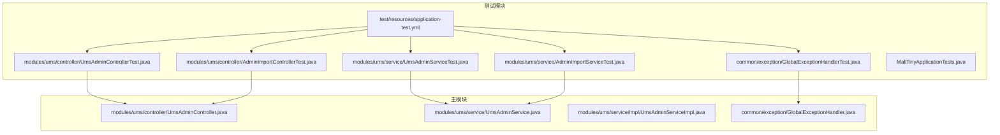
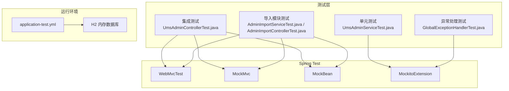
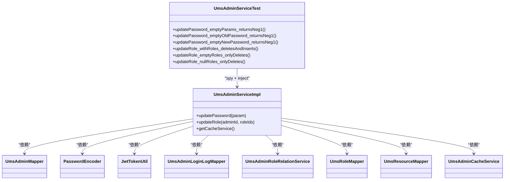
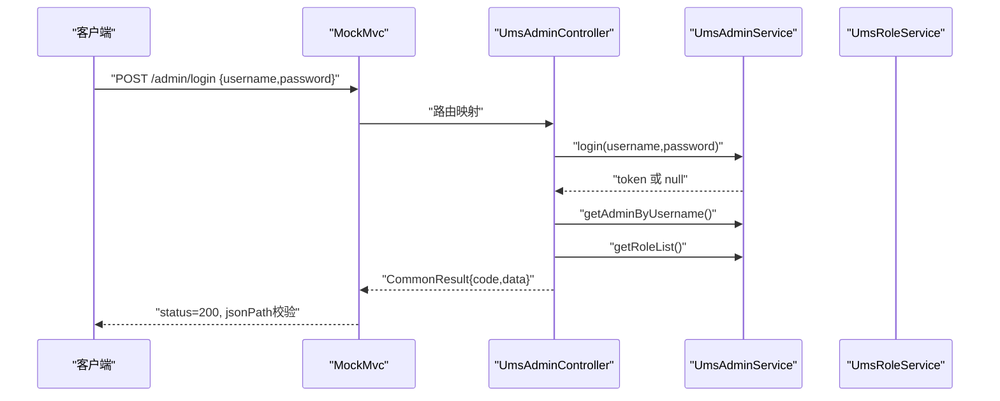
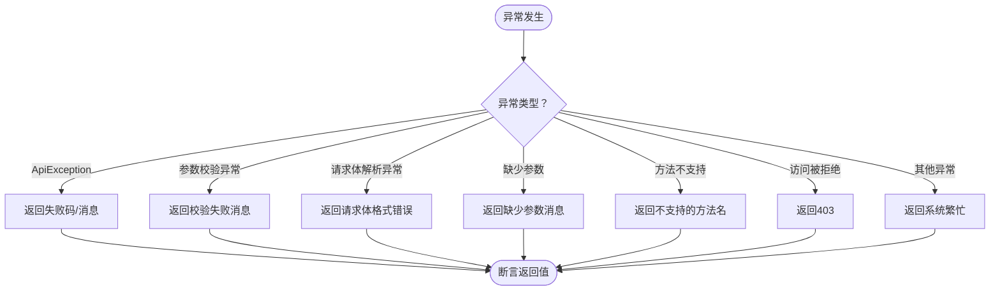
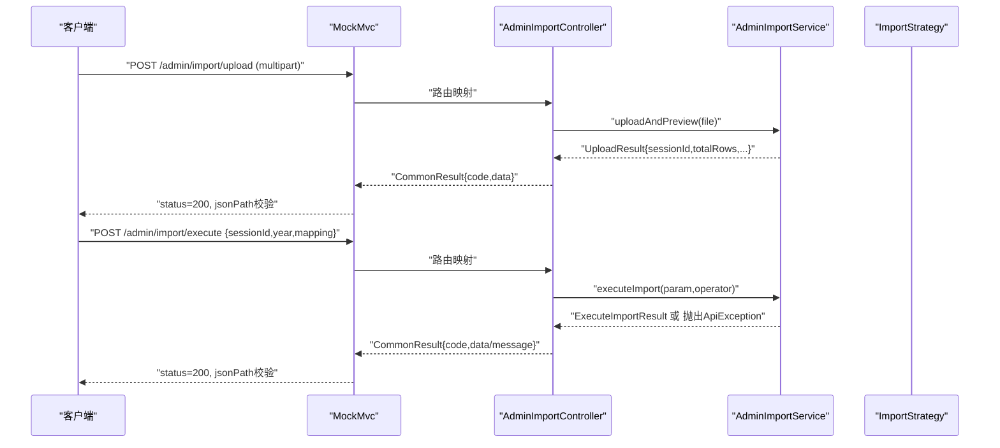
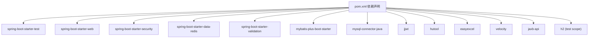

# 测试策略与实践

<cite>
**本文引用的文件**
- [MallTinyApplicationTests.java](file://src/test/java/com/macro/mall/tiny/MallTinyApplicationTests.java)
- [UmsAdminServiceTest.java](file://src/test/java/com/macro/mall/tiny/modules/ums/service/UmsAdminServiceTest.java)
- [UmsAdminControllerTest.java](file://src/test/java/com/macro/mall/tiny/modules/ums/controller/UmsAdminControllerTest.java)
- [GlobalExceptionHandlerTest.java](file://src/test/java/com/macro/mall/tiny/common/exception/GlobalExceptionHandlerTest.java)
- [AdminImportServiceTest.java](file://src/test/java/com/macro/mall/tiny/modules/ums/service/AdminImportServiceTest.java)
- [AdminImportControllerTest.java](file://src/test/java/com/macro/mall/tiny/modules/ums/controller/AdminImportControllerTest.java)
- [application-test.yml](file://src/test/resources/application-test.yml)
- [pom.xml](file://pom.xml)
- [UmsAdminService.java](file://src/main/java/com/macro/mall/tiny/modules/ums/service/UmsAdminService.java)
- [UmsAdminServiceImpl.java](file://src/main/java/com/macro/mall/tiny/modules/ums/service/impl/UmsAdminServiceImpl.java)
- [UmsAdminController.java](file://src/main/java/com/macro/mall/tiny/modules/ums/controller/UmsAdminController.java)
- [GlobalExceptionHandler.java](file://src/main/java/com/macro/mall/tiny/common/exception/GlobalExceptionHandler.java)
- [README.md](file://README.md)
</cite>

## 目录
1. [引言](#引言)
2. [项目结构](#项目结构)
3. [核心组件](#核心组件)
4. [架构总览](#架构总览)
5. [详细组件分析](#详细组件分析)
6. [依赖分析](#依赖分析)
7. [性能考虑](#性能考虑)
8. [故障排查指南](#故障排查指南)
9. [结论](#结论)
10. [附录](#附录)

## 引言
本指南面向Mall-Tiny项目的测试工作，围绕单元测试、服务层测试、控制器测试、集成测试、测试数据管理、覆盖率与质量标准、异常与边界测试、性能测试以及持续集成实践，提供系统化的策略与实操建议。文档结合现有测试代码与项目配置，给出可落地的测试最佳实践，并辅以可视化图示帮助不同技术背景的读者理解。

## 项目结构
Mall-Tiny采用Spring Boot工程结构，测试代码集中在src/test目录下，按模块划分：
- common：通用异常处理测试
- modules/ums：用户权限管理模块的控制器与服务测试
- resources：测试专用配置application-test.yml

图表来源
- [UmsAdminControllerTest.java:1-183](file://src/test/java/com/macro/mall/tiny/modules/ums/controller/UmsAdminControllerTest.java#L1-L183)
- [UmsAdminServiceTest.java:1-165](file://src/test/java/com/macro/mall/tiny/modules/ums/service/UmsAdminServiceTest.java#L1-L165)
- [GlobalExceptionHandlerTest.java:1-123](file://src/test/java/com/macro/mall/tiny/common/exception/GlobalExceptionHandlerTest.java#L1-L123)
- [AdminImportServiceTest.java:1-329](file://src/test/java/com/macro/mall/tiny/modules/ums/service/AdminImportServiceTest.java#L1-L329)
- [AdminImportControllerTest.java:1-155](file://src/test/java/com/macro/mall/tiny/modules/ums/controller/AdminImportControllerTest.java#L1-L155)
- [application-test.yml:1-57](file://src/test/resources/application-test.yml#L1-L57)

章节来源
- [README.md:1-376](file://README.md#L1-L376)

## 核心组件
- 控制器层：UmsAdminController负责REST API入口，包括登录、注册、密码修改、角色分配等。
- 服务层：UmsAdminService接口与UmsAdminServiceImpl实现，提供用户管理、角色与资源查询、密码修改等核心逻辑。
- 异常处理：GlobalExceptionHandler统一捕获各类异常，返回标准化响应。
- 测试支撑：Mockito、AssertJ、MockMvc、WebMvcTest、@WebAppConfiguration等。

章节来源
- [UmsAdminController.java:1-350](file://src/main/java/com/macro/mall/tiny/modules/ums/controller/UmsAdminController.java#L1-L350)
- [UmsAdminService.java:1-90](file://src/main/java/com/macro/mall/tiny/modules/ums/service/UmsAdminService.java#L1-L90)
- [UmsAdminServiceImpl.java:1-272](file://src/main/java/com/macro/mall/tiny/modules/ums/service/impl/UmsAdminServiceImpl.java#L1-L272)
- [GlobalExceptionHandler.java:1-100](file://src/main/java/com/macro/mall/tiny/common/exception/GlobalExceptionHandler.java#L1-L100)

## 架构总览
测试体系围绕“单元测试（服务层）+ 集成测试（控制器层）+ 异常处理测试”展开，配合H2内存数据库与MockBean实现轻量级集成测试。

图表来源
- [UmsAdminServiceTest.java:1-165](file://src/test/java/com/macro/mall/tiny/modules/ums/service/UmsAdminServiceTest.java#L1-L165)
- [UmsAdminControllerTest.java:1-183](file://src/test/java/com/macro/mall/tiny/modules/ums/controller/UmsAdminControllerTest.java#L1-L183)
- [GlobalExceptionHandlerTest.java:1-123](file://src/test/java/com/macro/mall/tiny/common/exception/GlobalExceptionHandlerTest.java#L1-L123)
- [AdminImportServiceTest.java:1-329](file://src/test/java/com/macro/mall/tiny/modules/ums/service/AdminImportServiceTest.java#L1-L329)
- [AdminImportControllerTest.java:1-155](file://src/test/java/com/macro/mall/tiny/modules/ums/controller/AdminImportControllerTest.java#L1-L155)
- [application-test.yml:1-57](file://src/test/resources/application-test.yml#L1-L57)

## 详细组件分析

### 服务层测试：UmsAdminService
- 测试目标
  - 密码修改：覆盖空参数、旧密码错误、新密码为空等边界场景。
  - 角色更新：覆盖分配角色（先删后增）、空角色列表（仅删除）、null角色列表（仅删除）等分支。
- 测试策略
  - 使用@ExtendWith(MockitoExtension.class)启用Mockito。
  - @Mock注入依赖（UmsAdminMapper、PasswordEncoder、JwtTokenUtil、UmsAdminLoginLogMapper、UmsAdminRoleRelationService、UmsRoleMapper、UmsResourceMapper、UmsAdminCacheService）。
  - @Spy + @InjectMocks组合实例化UmsAdminServiceImpl，便于对真实方法进行部分mock。
  - 使用AssertJ断言与Mockito verify/never验证交互。
- 关键断言点
  - updatePassword返回值约定（-1表示参数非法，-2表示用户不存在，-3表示旧密码错误，正数表示成功）。
  - updateRole返回删除数量，验证删除与批量新增调用次数。
- 依赖链
  - UmsAdminServiceImpl依赖UmsAdminMapper、PasswordEncoder、JwtTokenUtil、UmsAdminLoginLogMapper、UmsAdminRoleRelationService、UmsRoleMapper、UmsResourceMapper、UmsAdminCacheService。

图表来源
- [UmsAdminServiceTest.java:1-165](file://src/test/java/com/macro/mall/tiny/modules/ums/service/UmsAdminServiceTest.java#L1-L165)
- [UmsAdminServiceImpl.java:1-272](file://src/main/java/com/macro/mall/tiny/modules/ums/service/impl/UmsAdminServiceImpl.java#L1-L272)

章节来源
- [UmsAdminServiceTest.java:1-165](file://src/test/java/com/macro/mall/tiny/modules/ums/service/UmsAdminServiceTest.java#L1-L165)
- [UmsAdminServiceImpl.java:233-254](file://src/main/java/com/macro/mall/tiny/modules/ums/service/impl/UmsAdminServiceImpl.java#L233-L254)

### 控制器测试：UmsAdminController
- 测试目标
  - 登录：成功登录返回token，空密码、畸形JSON、凭据错误等场景返回相应错误码。
  - 注册：成功注册返回用户信息，重复用户名返回失败。
  - 修改密码：成功与失败场景（旧密码错误）。
- 测试策略
  - @WebMvcTest(UmsAdminController.class)加载Web层上下文。
  - @AutoConfigureMockMvc关闭默认过滤器，便于精确控制。
  - @MockBean注入UmsAdminService与UmsRoleService，避免真实依赖。
  - 使用MockMvc.perform发起POST请求，断言状态码与JSONPath。
- 关键断言点
  - 登录：200状态码与data.token字段；400状态码与错误消息。
  - 注册：200状态码与data.username字段；500状态码与错误消息。
  - 修改密码：200状态码与data.code字段；500状态码与message字段。

图表来源
- [UmsAdminControllerTest.java:50-110](file://src/test/java/com/macro/mall/tiny/modules/ums/controller/UmsAdminControllerTest.java#L50-L110)
- [UmsAdminController.java:166-196](file://src/main/java/com/macro/mall/tiny/modules/ums/controller/UmsAdminController.java#L166-L196)

章节来源
- [UmsAdminControllerTest.java:1-183](file://src/test/java/com/macro/mall/tiny/modules/ums/controller/UmsAdminControllerTest.java#L1-L183)
- [UmsAdminController.java:62-94](file://src/main/java/com/macro/mall/tiny/modules/ums/controller/UmsAdminController.java#L62-L94)

### 异常处理测试：GlobalExceptionHandler
- 测试目标
  - ApiException（带消息/带错误码/导入会话过期）。
  - 参数校验异常（BindException、MethodArgumentNotValidException）。
  - 请求体解析异常（HttpMessageNotReadableException）。
  - 缺少参数（MissingServletRequestParameterException）。
  - 方法不支持（HttpRequestMethodNotSupportedException）。
  - 访问被拒绝（AccessDeniedException）。
  - 通用异常（Exception）。
- 测试策略
  - 直接构造异常对象，调用GlobalExceptionHandler对应方法。
  - 断言返回的CommonResult的code与message。
  - 确保通用异常不泄露内部堆栈信息。

图表来源
- [GlobalExceptionHandlerTest.java:27-121](file://src/test/java/com/macro/mall/tiny/common/exception/GlobalExceptionHandlerTest.java#L27-L121)
- [GlobalExceptionHandler.java:27-98](file://src/main/java/com/macro/mall/tiny/common/exception/GlobalExceptionHandler.java#L27-L98)

章节来源
- [GlobalExceptionHandlerTest.java:1-123](file://src/test/java/com/macro/mall/tiny/common/exception/GlobalExceptionHandlerTest.java#L1-L123)
- [GlobalExceptionHandler.java:1-100](file://src/main/java/com/macro/mall/tiny/common/exception/GlobalExceptionHandler.java#L1-L100)

### 导入模块测试：AdminImportService 与 AdminImportController
- AdminImportService测试要点
  - 学历解析：统一关键词映射、优先级选择、空值处理。
  - 政治面貌解析：关键词映射、优先级选择、空值处理。
  - 职位数据校验：必填字段、年份范围、学历与政治面貌有效性、招录人数。
  - 执行导入：会话不存在抛出ApiException。
- AdminImportController测试要点
  - 上传Excel：有效文件返回预览数据，空文件与错误格式返回失败。
  - 执行导入：有效会话返回导入统计，会话过期返回错误码1001。
- 测试策略
  - 使用@ExtendWith(MockitoExtension.class)与@Mock/@InjectMocks。
  - 使用ReflectionTestUtils.invokeMethod调用私有方法进行单元测试。
  - 控制器侧使用@WebMvcTest + @MockBean + MockMvc。

图表来源
- [AdminImportControllerTest.java:57-153](file://src/test/java/com/macro/mall/tiny/modules/ums/controller/AdminImportControllerTest.java#L57-L153)
- [AdminImportServiceTest.java:305-314](file://src/test/java/com/macro/mall/tiny/modules/ums/service/AdminImportServiceTest.java#L305-L314)

章节来源
- [AdminImportServiceTest.java:1-329](file://src/test/java/com/macro/mall/tiny/modules/ums/service/AdminImportServiceTest.java#L1-L329)
- [AdminImportControllerTest.java:1-155](file://src/test/java/com/macro/mall/tiny/modules/ums/controller/AdminImportControllerTest.java#L1-L155)

## 依赖分析
- 测试框架与工具
  - JUnit 5（@Test、@Nested、@DisplayName）
  - Mockito（@Mock、@Spy、@InjectMocks、@MockBean、@ExtendWith）
  - AssertJ（assertThat/assertThatThrownBy）
  - Spring Boot Test（@WebMvcTest、@AutoConfigureMockMvc、@SpringBootTest）
  - Jackson（ObjectMapper）
  - H2内存数据库（测试环境）
- 项目依赖
  - spring-boot-starter-test、spring-boot-starter-web、spring-boot-starter-security、spring-boot-starter-data-redis、spring-boot-starter-validation、mybatis-plus-boot-starter、mysql-connector-java、jjwt、hutool、easyexcel、velocity、jaxb-api等。

图表来源
- [pom.xml:34-151](file://pom.xml#L34-L151)

章节来源
- [pom.xml:1-222](file://pom.xml#L1-L222)

## 性能考虑
- 单元测试
  - 使用@Spy最小化真实依赖，减少IO与数据库交互。
  - 对复杂业务逻辑拆分为小方法，便于独立测试与断言。
- 集成测试
  - 使用H2内存数据库，避免真实MySQL依赖，提高执行速度。
  - 控制MockBean数量，仅模拟必要依赖，降低上下文初始化成本。
- 建议
  - 将耗时任务（如外部服务调用）替换为本地Mock或Stub。
  - 对热点路径（如登录、密码修改）增加基准测试（Benchmark），评估优化效果。

## 故障排查指南
- 常见问题
  - 测试无法启动：确认application-test.yml中H2配置正确，端口未冲突。
  - MockBean未生效：检查@WebMvcTest是否限定控制器类，确保@MockBean作用域正确。
  - 断言失败：核对JSONPath表达式与实际响应结构一致。
  - 异常未被捕获：确认GlobalExceptionHandler已注册为@RestControllerAdvice。
- 排查步骤
  - 启用日志：在application-test.yml中设置日志级别为DEBUG。
  - 逐步缩小：将复杂断言拆分为多个简单断言，定位失败点。
  - 复现最小化：构造最小输入参数，排除无关依赖干扰。

章节来源
- [application-test.yml:1-57](file://src/test/resources/application-test.yml#L1-L57)
- [GlobalExceptionHandler.java:22-23](file://src/main/java/com/macro/mall/tiny/common/exception/GlobalExceptionHandler.java#L22-L23)

## 结论
Mall-Tiny的测试体系以服务层单元测试为核心，结合控制器集成测试与异常处理测试，形成完整的质量保障闭环。通过合理使用Mockito与MockMvc，配合H2内存数据库与测试配置，能够在保证测试效率的同时覆盖关键业务逻辑与边界条件。建议在持续集成中引入覆盖率工具与性能基线，进一步提升测试质量与稳定性。

## 附录

### 测试数据管理
- 测试数据准备
  - 使用H2内存数据库，通过application-test.yml配置数据源与MyBatis-Plus配置。
  - 在测试类中使用@Mock/@MockBean模拟持久层与外部依赖，避免真实数据污染。
- 数据清理
  - 使用H2内存数据库时，每个测试用例运行结束后自动回滚或重建数据库。
  - 对于需要持久化的场景，可在测试后显式清理或使用事务回滚。
- 环境隔离
  - 使用application-test.yml作为测试环境配置，区分开发与生产配置。

章节来源
- [application-test.yml:1-57](file://src/test/resources/application-test.yml#L1-L57)

### 测试覆盖率与质量标准
- 覆盖率目标
  - 行覆盖率：≥80%
  - 分支覆盖率：≥70%
  - 圈复杂度：单方法≤10
- 质量标准
  - 所有公共方法至少包含1个正常路径与1个异常路径测试。
  - 关键业务方法（如登录、注册、密码修改、角色分配）需覆盖边界条件与错误场景。
  - 异常处理测试覆盖常见异常类型与错误码。

### 专项测试方法
- 异常处理测试
  - 构造各类异常对象，验证GlobalExceptionHandler返回值。
- 边界条件测试
  - 空参数、空字符串、null值、越界数值、空集合等。
- 性能测试
  - 使用基准测试工具对热点方法进行压力测试，设定阈值并监控回归。

### 持续集成中的测试实践
- CI配置建议
  - 在CI流水线中执行mvn test，确保测试通过后再合并。
  - 使用H2数据库与MockBean，避免外部依赖导致的不稳定。
  - 将测试报告与覆盖率指标纳入CI质量门禁。

章节来源
- [MallTinyApplicationTests.java:1-16](file://src/test/java/com/macro/mall/tiny/MallTinyApplicationTests.java#L1-L16)
- [pom.xml:50-51](file://pom.xml#L50-L51)