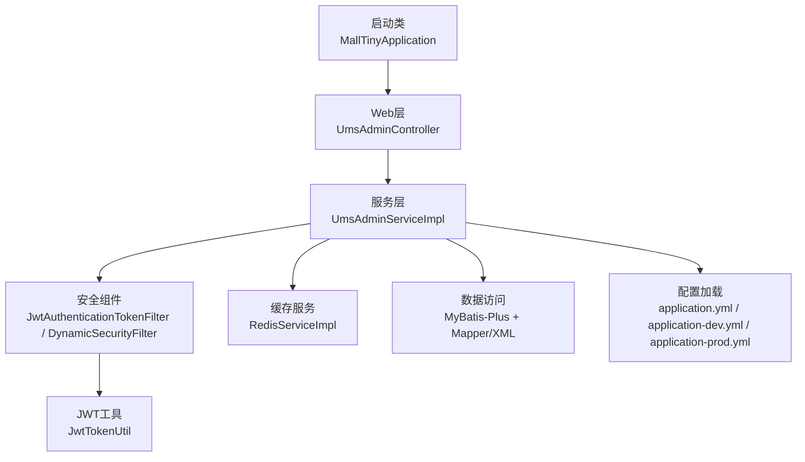
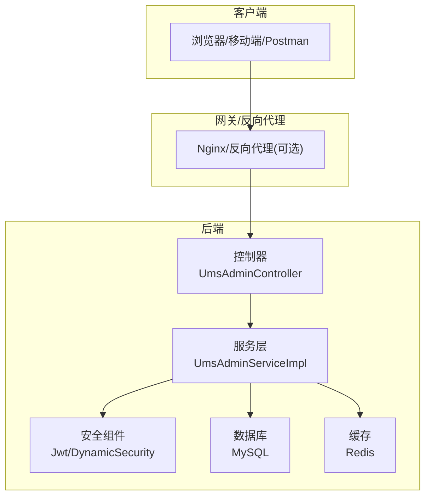
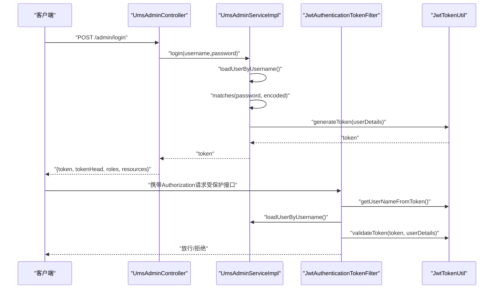
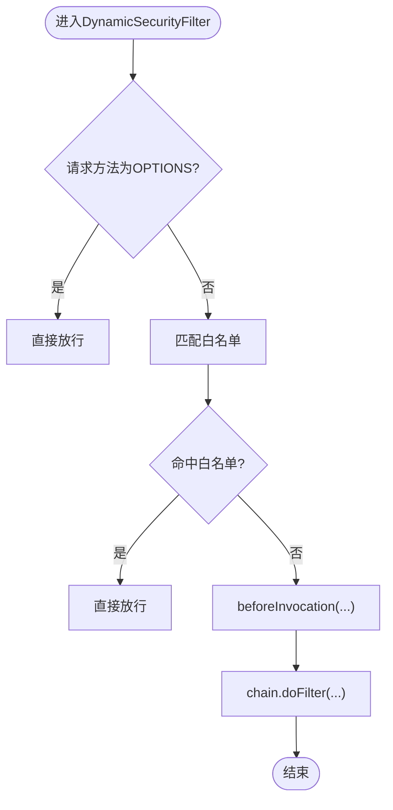
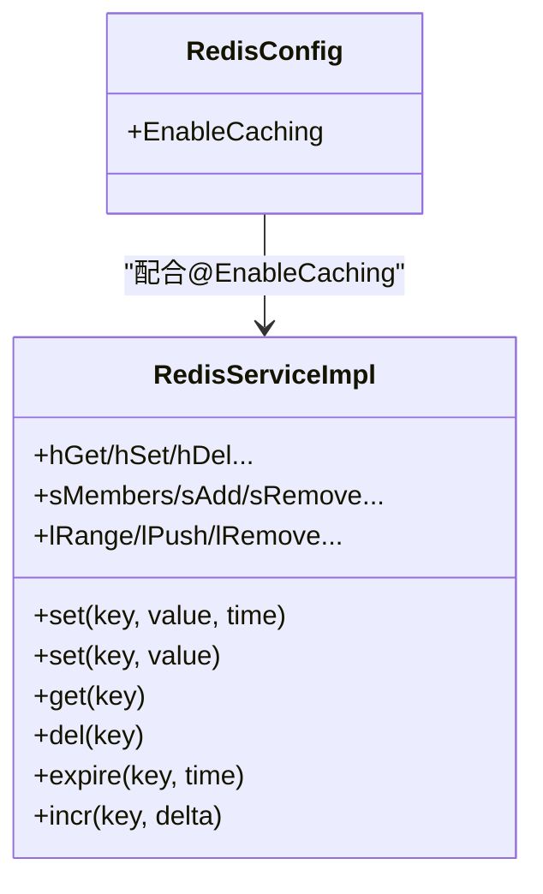
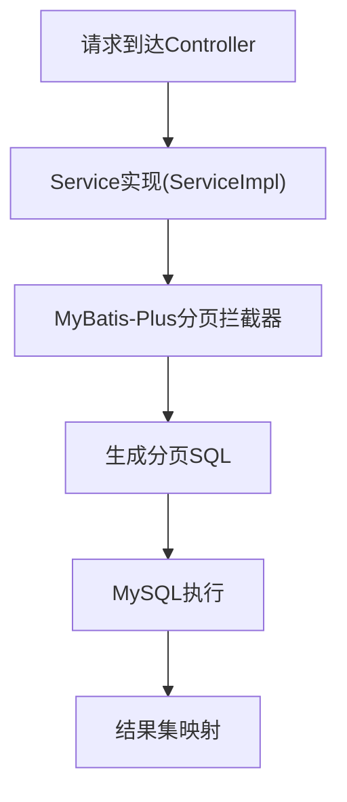
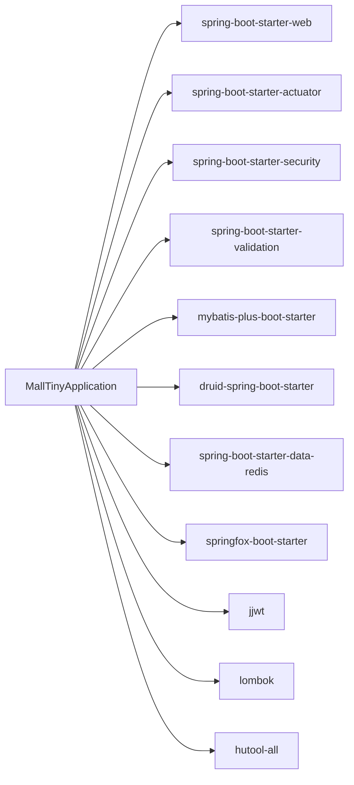

# 调试技巧与问题排查

<cite>
**本文引用的文件**
- [MallTinyApplication.java](file://src/main/java/com/macro/mall/tiny/MallTinyApplication.java)
- [application.yml](file://src/main/resources/application.yml)
- [application-dev.yml](file://src/main/resources/application-dev.yml)
- [application-prod.yml](file://src/main/resources/application-prod.yml)
- [GlobalExceptionHandler.java](file://src/main/java/com/macro/mall/tiny/common/exception/GlobalExceptionHandler.java)
- [JwtAuthenticationTokenFilter.java](file://src/main/java/com/macro/mall/tiny/security/component/JwtAuthenticationTokenFilter.java)
- [MallSecurityConfig.java](file://src/main/java/com/macro/mall/tiny/config/MallSecurityConfig.java)
- [JwtTokenUtil.java](file://src/main/java/com/macro/mall/tiny/security/util/JwtTokenUtil.java)
- [DynamicSecurityFilter.java](file://src/main/java/com/macro/mall/tiny/security/component/DynamicSecurityFilter.java)
- [RedisServiceImpl.java](file://src/main/java/com/macro/mall/tiny/common/service/impl/RedisServiceImpl.java)
- [UmsAdminController.java](file://src/main/java/com/macro/mall/tiny/modules/ums/controller/UmsAdminController.java)
- [UmsAdminServiceImpl.java](file://src/main/java/com/macro/mall/tiny/modules/ums/service/impl/UmsAdminServiceImpl.java)
- [UmsAdminLoginParam.java](file://src/main/java/com/macro/mall/tiny/modules/ums/dto/UmsAdminLoginParam.java)
- [RedisConfig.java](file://src/main/java/com/macro/mall/tiny/config/RedisConfig.java)
- [MyBatisConfig.java](file://src/main/java/com/macro/mall/tiny/config/MyBatisConfig.java)
- [pom.xml](file://pom.xml)
- [MallTinyApplicationTests.java](file://src/test/java/com/macro/mall/tiny/MallTinyApplicationTests.java)
- [README.md](file://README.md)
</cite>

## 目录
1. [简介](#简介)
2. [项目结构](#项目结构)
3. [核心组件](#核心组件)
4. [架构总览](#架构总览)
5. [详细组件分析](#详细组件分析)
6. [依赖分析](#依赖分析)
7. [性能考虑](#性能考虑)
8. [故障排查指南](#故障排查指南)
9. [结论](#结论)
10. [附录](#附录)

## 简介
本指南面向Mall-Tiny项目的开发者与运维人员，围绕开发调试、常见问题排查、日志分析、工具使用、性能与安全问题定位以及生产应急响应提供系统化方法论与实操建议。内容覆盖IDE调试器使用、断点与变量监视、调用栈分析、登录认证与权限控制异常、数据库与缓存问题、日志级别与关键日志提取、Postman与Swagger测试、数据库与Redis客户端工具、CPU/内存/慢查询定位、JWT与权限校验、生产应急流程与最佳实践。

## 项目结构
Mall-Tiny采用Spring Boot标准工程结构，按领域模块划分，核心模块包括权限管理UMS、安全组件、通用异常处理、Redis缓存、MyBatis-Plus配置等。开发与生产环境通过profile隔离，配置项集中于application.yml及其子文件。

图表来源
- [MallTinyApplication.java:1-14](file://src/main/java/com/macro/mall/tiny/MallTinyApplication.java#L1-L14)
- [UmsAdminController.java:1-350](file://src/main/java/com/macro/mall/tiny/modules/ums/controller/UmsAdminController.java#L1-L350)
- [UmsAdminServiceImpl.java:1-272](file://src/main/java/com/macro/mall/tiny/modules/ums/service/impl/UmsAdminServiceImpl.java#L1-L272)
- [JwtAuthenticationTokenFilter.java:1-59](file://src/main/java/com/macro/mall/tiny/security/component/JwtAuthenticationTokenFilter.java#L1-L59)
- [DynamicSecurityFilter.java:1-83](file://src/main/java/com/macro/mall/tiny/security/component/DynamicSecurityFilter.java#L1-L83)
- [JwtTokenUtil.java:1-171](file://src/main/java/com/macro/mall/tiny/security/util/JwtTokenUtil.java#L1-L171)
- [RedisServiceImpl.java:1-198](file://src/main/java/com/macro/mall/tiny/common/service/impl/RedisServiceImpl.java#L1-L198)
- [MyBatisConfig.java:1-28](file://src/main/java/com/macro/mall/tiny/config/MyBatisConfig.java#L1-L28)
- [application.yml:1-57](file://src/main/resources/application.yml#L1-L57)
- [application-dev.yml:1-16](file://src/main/resources/application-dev.yml#L1-L16)
- [application-prod.yml:1-18](file://src/main/resources/application-prod.yml#L1-L18)

章节来源
- [README.md:53-98](file://README.md#L53-L98)
- [application.yml:1-57](file://src/main/resources/application.yml#L1-L57)
- [application-dev.yml:1-16](file://src/main/resources/application-dev.yml#L1-L16)
- [application-prod.yml:1-18](file://src/main/resources/application-prod.yml#L1-L18)

## 核心组件
- 启动入口：Spring Boot启动类，负责应用上下文初始化与端口监听。
- 控制器层：UMS模块控制器，提供登录、注册、密码找回、信息查询、角色与资源权限等接口。
- 服务层：用户服务实现，负责登录认证、密码校验、JWT签发、缓存读写、角色与资源权限查询。
- 安全层：JWT过滤器与动态权限过滤器，结合Spring Security完成认证与授权。
- 缓存层：Redis服务实现，提供键值、哈希、集合、列表等常用操作。
- 配置层：MyBatis-Plus分页拦截器、Redis缓存启用、安全配置装配。

章节来源
- [MallTinyApplication.java:1-14](file://src/main/java/com/macro/mall/tiny/MallTinyApplication.java#L1-L14)
- [UmsAdminController.java:1-350](file://src/main/java/com/macro/mall/tiny/modules/ums/controller/UmsAdminController.java#L1-L350)
- [UmsAdminServiceImpl.java:1-272](file://src/main/java/com/macro/mall/tiny/modules/ums/service/impl/UmsAdminServiceImpl.java#L1-L272)
- [JwtAuthenticationTokenFilter.java:1-59](file://src/main/java/com/macro/mall/tiny/security/component/JwtAuthenticationTokenFilter.java#L1-L59)
- [DynamicSecurityFilter.java:1-83](file://src/main/java/com/macro/mall/tiny/security/component/DynamicSecurityFilter.java#L1-L83)
- [JwtTokenUtil.java:1-171](file://src/main/java/com/macro/mall/tiny/security/util/JwtTokenUtil.java#L1-L171)
- [RedisServiceImpl.java:1-198](file://src/main/java/com/macro/mall/tiny/common/service/impl/RedisServiceImpl.java#L1-L198)
- [MyBatisConfig.java:1-28](file://src/main/java/com/macro/mall/tiny/config/MyBatisConfig.java#L1-L28)

## 架构总览
Mall-Tiny采用前后端分离架构，后端通过Spring MVC暴露REST接口，使用Spring Security + JWT实现认证授权，MyBatis-Plus负责数据访问，Redis提供缓存能力。全局异常处理统一返回格式，开发/生产环境通过profile切换配置。

图表来源
- [UmsAdminController.java:1-350](file://src/main/java/com/macro/mall/tiny/modules/ums/controller/UmsAdminController.java#L1-L350)
- [UmsAdminServiceImpl.java:1-272](file://src/main/java/com/macro/mall/tiny/modules/ums/service/impl/UmsAdminServiceImpl.java#L1-L272)
- [JwtAuthenticationTokenFilter.java:1-59](file://src/main/java/com/macro/mall/tiny/security/component/JwtAuthenticationTokenFilter.java#L1-L59)
- [DynamicSecurityFilter.java:1-83](file://src/main/java/com/macro/mall/tiny/security/component/DynamicSecurityFilter.java#L1-L83)
- [application.yml:1-57](file://src/main/resources/application.yml#L1-L57)

## 详细组件分析

### 登录与JWT认证流程
登录流程涉及控制器接收参数、服务层校验密码与状态、签发JWT，并将角色与资源权限返回给前端。JWT过滤器在每个请求进入时解析请求头中的token，加载用户详情并完成认证。

图表来源
- [UmsAdminController.java:166-211](file://src/main/java/com/macro/mall/tiny/modules/ums/controller/UmsAdminController.java#L166-L211)
- [UmsAdminServiceImpl.java:98-119](file://src/main/java/com/macro/mall/tiny/modules/ums/service/impl/UmsAdminServiceImpl.java#L98-L119)
- [JwtAuthenticationTokenFilter.java:37-57](file://src/main/java/com/macro/mall/tiny/security/component/JwtAuthenticationTokenFilter.java#L37-L57)
- [JwtTokenUtil.java:117-122](file://src/main/java/com/macro/mall/tiny/security/util/JwtTokenUtil.java#L117-L122)

章节来源
- [UmsAdminController.java:166-211](file://src/main/java/com/macro/mall/tiny/modules/ums/controller/UmsAdminController.java#L166-L211)
- [UmsAdminServiceImpl.java:98-119](file://src/main/java/com/macro/mall/tiny/modules/ums/service/impl/UmsAdminServiceImpl.java#L98-L119)
- [JwtAuthenticationTokenFilter.java:37-57](file://src/main/java/com/macro/mall/tiny/security/component/JwtAuthenticationTokenFilter.java#L37-L57)
- [JwtTokenUtil.java:76-96](file://src/main/java/com/macro/mall/tiny/security/util/JwtTokenUtil.java#L76-L96)

### 动态权限与白名单过滤
动态权限过滤器对请求路径进行匹配，白名单路径直接放行，非OPTIONS请求交由决策器进行鉴权判断。安全配置从资源表加载URL与权限映射。

图表来源
- [DynamicSecurityFilter.java:39-66](file://src/main/java/com/macro/mall/tiny/security/component/DynamicSecurityFilter.java#L39-L66)
- [MallSecurityConfig.java:40-52](file://src/main/java/com/macro/mall/tiny/config/MallSecurityConfig.java#L40-L52)
- [application.yml:38-57](file://src/main/resources/application.yml#L38-L57)

章节来源
- [DynamicSecurityFilter.java:39-66](file://src/main/java/com/macro/mall/tiny/security/component/DynamicSecurityFilter.java#L39-L66)
- [MallSecurityConfig.java:40-52](file://src/main/java/com/macro/mall/tiny/config/MallSecurityConfig.java#L40-L52)
- [application.yml:38-57](file://src/main/resources/application.yml#L38-L57)

### Redis缓存操作与键空间
Redis服务实现提供多种数据结构操作，常用于用户信息与资源列表缓存。配置启用缓存注解，键空间遵循约定前缀。

图表来源
- [RedisServiceImpl.java:16-198](file://src/main/java/com/macro/mall/tiny/common/service/impl/RedisServiceImpl.java#L16-L198)
- [RedisConfig.java:11-15](file://src/main/java/com/macro/mall/tiny/config/RedisConfig.java#L11-L15)
- [application.yml:30-37](file://src/main/resources/application.yml#L30-L37)

章节来源
- [RedisServiceImpl.java:16-198](file://src/main/java/com/macro/mall/tiny/common/service/impl/RedisServiceImpl.java#L16-L198)
- [RedisConfig.java:11-15](file://src/main/java/com/macro/mall/tiny/config/RedisConfig.java#L11-L15)
- [application.yml:30-37](file://src/main/resources/application.yml#L30-L37)

### MyBatis-Plus分页与Mapper扫描
MyBatis-Plus配置启用分页内核与Mapper扫描，简化单表与分页查询，复杂关联查询通过XML实现。

图表来源
- [MyBatisConfig.java:15-27](file://src/main/java/com/macro/mall/tiny/config/MyBatisConfig.java#L15-L27)

章节来源
- [MyBatisConfig.java:15-27](file://src/main/java/com/macro/mall/tiny/config/MyBatisConfig.java#L15-L27)

## 依赖分析
- 启动类依赖Spring Boot Starter Web与Actuator，便于健康检查与监控。
- 安全依赖Spring Security与JWT，参数校验依赖Validation Starter。
- 数据访问依赖MyBatis-Plus与Druid连接池，Redis依赖Spring Boot Data Redis。
- Swagger用于接口文档生成，Lombok简化实体类，Hutool提供工具方法。

图表来源
- [pom.xml:34-152](file://pom.xml#L34-L152)

章节来源
- [pom.xml:34-152](file://pom.xml#L34-L152)

## 性能考虑
- 分页与SQL优化：优先使用MyBatis-Plus提供的条件构造器与分页插件，避免全表扫描；复杂查询通过Mapper XML优化并添加必要索引。
- 缓存策略：对高频读取的用户资源列表与用户信息进行缓存，合理设置TTL，避免热点key雪崩。
- Redis性能：使用Pipeline批量操作，避免多次网络往返；注意内存淘汰策略与过期键回收。
- JVM与线程：结合Actuator指标与外部APM观察GC、线程池与连接池使用情况。
- 并发与锁：在高并发场景下避免热点更新导致的缓存穿透与击穿，采用布隆过滤器或本地缓存兜底。

## 故障排查指南

### 开发环境调试方法
- IDE断点设置
  - 在控制器入口设置断点，验证请求参数与路由匹配。
  - 在服务层登录方法与JWT签发处设置断点，观察用户详情与token生成。
  - 在安全过滤器解析token处设置断点，确认请求头与token有效性。
- 变量监视
  - 观察UmsAdminLoginParam的用户名与密码是否为空。
  - 观察UserDetails与角色/资源列表是否正确加载。
  - 观察Redis中键是否存在与TTL是否合理。
- 调用栈分析
  - 通过调用栈定位异常抛出位置，结合全局异常处理器定位业务异常类型。

章节来源
- [UmsAdminController.java:166-211](file://src/main/java/com/macro/mall/tiny/modules/ums/controller/UmsAdminController.java#L166-L211)
- [UmsAdminServiceImpl.java:98-119](file://src/main/java/com/macro/mall/tiny/modules/ums/service/impl/UmsAdminServiceImpl.java#L98-L119)
- [JwtAuthenticationTokenFilter.java:37-57](file://src/main/java/com/macro/mall/tiny/security/component/JwtAuthenticationTokenFilter.java#L37-L57)
- [UmsAdminLoginParam.java:1-23](file://src/main/java/com/macro/mall/tiny/modules/ums/dto/UmsAdminLoginParam.java#L1-L23)

### 登录认证问题
- 症状
  - 登录失败或返回“用户名或密码错误”。
  - 返回403访问被拒绝。
- 排查步骤
  - 检查登录参数是否为空，确认UmsAdminLoginParam的校验是否生效。
  - 检查数据库中用户状态是否启用，密码是否正确编码。
  - 检查JWT过滤器是否正确解析请求头Authorization，tokenHead与tokenHeader配置是否一致。
  - 查看全局异常处理器对AccessDeniedException的处理与日志输出。
- 关键定位点
  - 登录接口返回tokenMap与角色/资源列表。
  - 服务层登录方法中密码匹配与状态校验。
  - JWT工具类的token解析与有效期校验。

章节来源
- [UmsAdminController.java:166-211](file://src/main/java/com/macro/mall/tiny/modules/ums/controller/UmsAdminController.java#L166-L211)
- [UmsAdminServiceImpl.java:98-119](file://src/main/java/com/macro/mall/tiny/modules/ums/service/impl/UmsAdminServiceImpl.java#L98-L119)
- [JwtAuthenticationTokenFilter.java:37-57](file://src/main/java/com/macro/mall/tiny/security/component/JwtAuthenticationTokenFilter.java#L37-L57)
- [JwtTokenUtil.java:76-96](file://src/main/java/com/macro/mall/tiny/security/util/JwtTokenUtil.java#L76-L96)
- [GlobalExceptionHandler.java:88-92](file://src/main/java/com/macro/mall/tiny/common/exception/GlobalExceptionHandler.java#L88-L92)

### 权限控制异常
- 症状
  - 访问受保护接口返回403。
  - 白名单路径仍被拦截。
- 排查步骤
  - 检查白名单urls配置是否包含目标路径。
  - 检查动态权限过滤器是否正确匹配Ant风格路径。
  - 检查安全配置中资源URL与权限映射是否正确加载。
- 关键定位点
  - 白名单匹配逻辑与OPTIONS请求放行。
  - 动态权限数据源加载与决策器调用。

章节来源
- [application.yml:38-57](file://src/main/resources/application.yml#L38-L57)
- [DynamicSecurityFilter.java:39-66](file://src/main/java/com/macro/mall/tiny/security/component/DynamicSecurityFilter.java#L39-L66)
- [MallSecurityConfig.java:40-52](file://src/main/java/com/macro/mall/tiny/config/MallSecurityConfig.java#L40-L52)

### 数据库连接问题
- 症状
  - 启动时报数据库连接失败或超时。
  - 运行时出现SQL异常或连接池耗尽。
- 排查步骤
  - 检查开发/生产环境数据库URL、账号与密码。
  - 检查Druid连接池配置与最大连接数、超时时间。
  - 检查MyBatis-Plus分页插件与Mapper扫描路径。
- 关键定位点
  - application-dev.yml与application-prod.yml中的spring.datasource配置。
  - MyBatis-Plus分页拦截器与Mapper包扫描。

章节来源
- [application-dev.yml:1-16](file://src/main/resources/application-dev.yml#L1-L16)
- [application-prod.yml:1-18](file://src/main/resources/application-prod.yml#L1-L18)
- [MyBatisConfig.java:15-27](file://src/main/java/com/macro/mall/tiny/config/MyBatisConfig.java#L15-L27)
- [pom.xml:58-69](file://pom.xml#L58-L69)

### 缓存访问异常
- 症状
  - Redis连接失败或命令执行异常。
  - 缓存读写不一致或TTL异常。
- 排查步骤
  - 检查Redis主机、端口、密码与超时配置。
  - 使用Redis客户端验证键是否存在与值类型。
  - 检查Redis服务实现中的过期设置与批量操作。
- 关键定位点
  - application-dev.yml与application-prod.yml中的spring.redis配置。
  - Redis服务实现的set/expire/get等方法。

章节来源
- [application-dev.yml:6-11](file://src/main/resources/application-dev.yml#L6-L11)
- [application-prod.yml:6-11](file://src/main/resources/application-prod.yml#L6-L11)
- [RedisServiceImpl.java:16-198](file://src/main/java/com/macro/mall/tiny/common/service/impl/RedisServiceImpl.java#L16-L198)

### 日志分析技巧
- 日志级别
  - 开发环境提升com.macro.mall包的日志级别至debug，便于跟踪业务流程。
  - 生产环境保持info级别，必要时临时调整以定位问题。
- 关键日志提取
  - 登录异常：GlobalExceptionHandler对登录异常的warn日志。
  - JWT验证失败：JwtTokenUtil对JWT格式验证失败的日志。
  - 参数校验失败：GlobalExceptionHandler对参数校验异常的日志。
- 错误堆栈分析
  - 结合调用栈定位异常发生点，优先处理业务异常而非系统异常。
- 性能日志解读
  - 结合Actuator指标与外部APM观察慢查询、慢接口与慢操作。

章节来源
- [application-dev.yml:13-16](file://src/main/resources/application-dev.yml#L13-L16)
- [application-prod.yml:13-18](file://src/main/resources/application-prod.yml#L13-L18)
- [GlobalExceptionHandler.java:27-98](file://src/main/java/com/macro/mall/tiny/common/exception/GlobalExceptionHandler.java#L27-L98)
- [JwtTokenUtil.java:53-64](file://src/main/java/com/macro/mall/tiny/security/util/JwtTokenUtil.java#L53-L64)

### 工具使用指南
- Postman API测试
  - 使用登录接口获取token，设置Authorization为配置的tokenHead + token。
  - 测试受保护接口，观察返回码与响应体。
- Swagger接口文档
  - 访问Swagger UI查看接口定义与示例。
  - 使用Authorize按钮输入token进行接口测试。
- 数据库管理工具
  - 使用Navicat/HeidiSQL/Studio 3T等连接MySQL，执行SQL验证数据。
- Redis客户端
  - 使用Redis Desktop Manager/CLI验证键空间与TTL。

章节来源
- [README.md:304-312](file://README.md#L304-L312)

### 性能问题排查
- CPU占用分析
  - 使用JProfiler/Arthas/Async Profiler采样，定位热点方法与线程阻塞。
- 内存使用监控
  - 结合JVM GC日志与内存快照，识别内存泄漏与大对象。
- 数据库慢查询定位
  - 打开慢查询日志，结合EXPLAIN分析SQL执行计划。
  - 优化索引与SQL结构，减少全表扫描。

### 安全问题排查
- JWT令牌问题
  - 检查tokenHeader与tokenHead配置一致性。
  - 校验签名算法与密钥，确认token未过期。
- 权限验证异常
  - 检查资源URL与权限映射是否正确加载。
  - 确认白名单路径不会绕过鉴权。
- SQL注入检测
  - 使用MyBatis-Plus条件构造器，避免拼接SQL。
  - 对输入参数进行严格校验与转义。

章节来源
- [application.yml:24-28](file://src/main/resources/application.yml#L24-L28)
- [JwtTokenUtil.java:117-122](file://src/main/java/com/macro/mall/tiny/security/util/JwtTokenUtil.java#L117-L122)
- [MallSecurityConfig.java:40-52](file://src/main/java/com/macro/mall/tiny/config/MallSecurityConfig.java#L40-L52)

### 生产环境问题处理流程与应急响应
- 快速响应
  - 通过Actuator与日志定位问题根因，必要时临时降级或限流。
- 配置回滚
  - 回滚最近一次变更的配置文件，恢复白名单或权限映射。
- 数据修复
  - 使用数据库管理工具回滚事务或修复数据。
- 缓存清理
  - 清理异常缓存键，确保数据一致性。
- 应急演练
  - 定期进行故障演练，完善应急预案与升级流程。

### 问题反馈与解决最佳实践
- 明确问题描述：包含环境、版本、复现步骤、期望与实际结果。
- 提供日志与截图：关键错误日志与接口响应截图。
- 附带配置文件：application.yml与环境配置文件片段。
- 优先使用全局异常处理器返回的错误码，便于前端与监控系统识别。

## 结论
通过掌握IDE调试方法、理解JWT认证与动态权限机制、合理使用日志与工具、结合性能与安全最佳实践，能够高效定位与解决Mall-Tiny项目中的各类问题。建议在开发与生产环境中分别制定标准化的调试与排障流程，持续优化配置与代码质量。

## 附录
- 启动与运行
  - 直接运行启动类main方法启动应用。
  - 使用Docker部署时，确保MySQL与Redis服务可用，并挂载日志目录。
- 测试注意事项
  - 单元测试依赖真实数据库，CI环境默认跳过。

章节来源
- [README.md:116-118](file://README.md#L116-L118)
- [MallTinyApplicationTests.java:7-15](file://src/test/java/com/macro/mall/tiny/MallTinyApplicationTests.java#L7-L15)