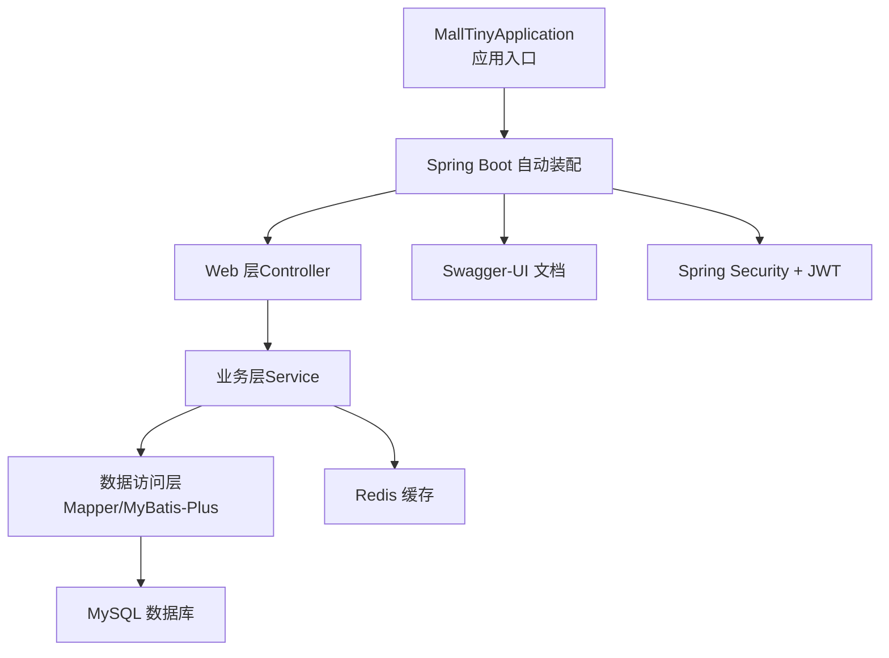
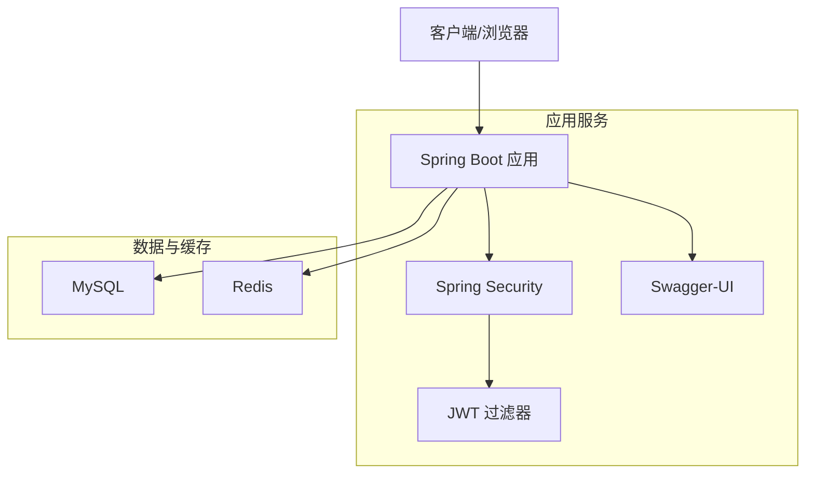
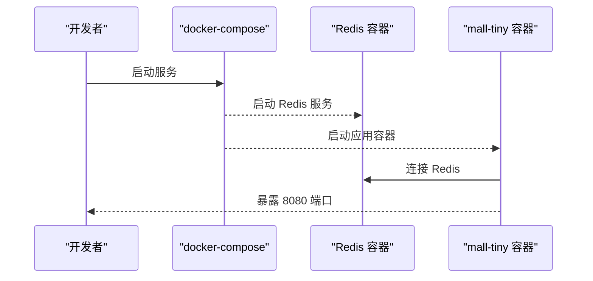
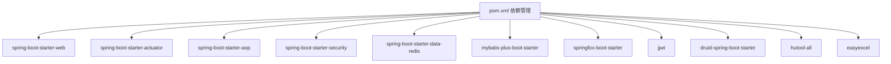

# 快速开始

<cite>
**本文引用的文件**
- [README.md](file://README.md)
- [MallTinyApplication.java](file://src/main/java/com/macro/mall/tiny/MallTinyApplication.java)
- [application.yml](file://src/main/resources/application.yml)
- [application-dev.yml](file://src/main/resources/application-dev.yml)
- [application-prod.yml](file://src/main/resources/application-prod.yml)
- [pom.xml](file://pom.xml)
- [Dockerfile](file://Dockerfile)
- [docker-compose.yml](file://docker-compose.yml)
- [RedisConfig.java](file://src/main/java/com/macro/mall/tiny/config/RedisConfig.java)
- [BaseRedisConfig.java](file://src/main/java/com/macro/mall/tiny/common/config/BaseRedisConfig.java)
- [SecurityConfig.java](file://src/main/java/com/macro/mall/tiny/security/config/SecurityConfig.java)
- [IgnoreUrlsConfig.java](file://src/main/java/com/macro/mall/tiny/security/config/IgnoreUrlsConfig.java)
- [JwtAuthenticationTokenFilter.java](file://src/main/java/com/macro/mall/tiny/security/component/JwtAuthenticationTokenFilter.java)
- [SwaggerConfig.java](file://src/main/java/com/macro/mall/tiny/config/SwaggerConfig.java)
- [mall_tiny.sql](file://sql/mall_tiny.sql)
</cite>

## 目录
1. [简介](#简介)
2. [项目结构](#项目结构)
3. [核心组件](#核心组件)
4. [架构总览](#架构总览)
5. [详细组件分析](#详细组件分析)
6. [依赖分析](#依赖分析)
7. [性能考虑](#性能考虑)
8. [故障排查指南](#故障排查指南)
9. [结论](#结论)
10. [附录](#附录)

## 简介
本指南面向首次接触 Mall-Tiny 的开发者，帮助你在约 30 分钟内完成环境准备、项目启动与基础功能验证。你将学会：
- 安装与配置 MySQL 与 Redis 服务
- 克隆项目、安装依赖、初始化数据库
- 配置 application.yml 中的关键参数（数据库、Redis、JWT 等）
- 三种启动方式：本地 IDE 运行、Docker 容器化部署、Maven 打包部署
- 访问 Swagger-UI 并进行基础 API 测试
- 常见启动问题的排查与解决

## 项目结构
Mall-Tiny 是一个基于 Spring Boot + MyBatis-Plus 的权限管理脚手架，采用模块化设计，核心模块为 ums（权限管理），并内置 Swagger-UI 文档、JWT 认证、Redis 缓存与 Spring Security 安全控制。

图表来源
- [MallTinyApplication.java:1-14](file://src/main/java/com/macro/mall/tiny/MallTinyApplication.java#L1-L14)
- [SwaggerConfig.java:1-72](file://src/main/java/com/macro/mall/tiny/config/SwaggerConfig.java#L1-L72)

章节来源
- [README.md:18-87](file://README.md#L18-L87)

## 核心组件
- 应用入口与启动
  - 应用入口类负责启动 Spring Boot 应用，无需额外配置即可加载全部自动装配。
  - 参考路径：[MallTinyApplication.java:1-14](file://src/main/java/com/macro/mall/tiny/MallTinyApplication.java#L1-L14)

- 配置文件
  - 通用配置：[application.yml:1-57](file://src/main/resources/application.yml#L1-L57)
  - 开发环境配置：[application-dev.yml:1-16](file://src/main/resources/application-dev.yml#L1-L16)
  - 生产环境配置：[application-prod.yml:1-18](file://src/main/resources/application-prod.yml#L1-L18)

- 安全与认证
  - 安全配置：[SecurityConfig.java:1-86](file://src/main/java/com/macro/mall/tiny/security/config/SecurityConfig.java#L1-L86)
  - 白名单配置：[IgnoreUrlsConfig.java:1-22](file://src/main/java/com/macro/mall/tiny/security/config/IgnoreUrlsConfig.java#L1-L22)
  - JWT 过滤器：[JwtAuthenticationTokenFilter.java:1-58](file://src/main/java/com/macro/mall/tiny/security/component/JwtAuthenticationTokenFilter.java#L1-L58)

- 缓存与 Redis
  - Redis 配置类：[RedisConfig.java:1-16](file://src/main/java/com/macro/mall/tiny/config/RedisConfig.java#L1-L16)
  - 基础 Redis 配置：[BaseRedisConfig.java:1-69](file://src/main/java/com/macro/mall/tiny/common/config/BaseRedisConfig.java#L1-L69)

- 文档与接口
  - Swagger 配置：[SwaggerConfig.java:1-72](file://src/main/java/com/macro/mall/tiny/config/SwaggerConfig.java#L1-L72)

章节来源
- [MallTinyApplication.java:1-14](file://src/main/java/com/macro/mall/tiny/MallTinyApplication.java#L1-L14)
- [application.yml:1-57](file://src/main/resources/application.yml#L1-L57)
- [application-dev.yml:1-16](file://src/main/resources/application-dev.yml#L1-L16)
- [application-prod.yml:1-18](file://src/main/resources/application-prod.yml#L1-L18)
- [SecurityConfig.java:1-86](file://src/main/java/com/macro/mall/tiny/security/config/SecurityConfig.java#L1-L86)
- [IgnoreUrlsConfig.java:1-22](file://src/main/java/com/macro/mall/tiny/security/config/IgnoreUrlsConfig.java#L1-L22)
- [JwtAuthenticationTokenFilter.java:1-58](file://src/main/java/com/macro/mall/tiny/security/component/JwtAuthenticationTokenFilter.java#L1-L58)
- [RedisConfig.java:1-16](file://src/main/java/com/macro/mall/tiny/config/RedisConfig.java#L1-L16)
- [BaseRedisConfig.java:1-69](file://src/main/java/com/macro/mall/tiny/common/config/BaseRedisConfig.java#L1-L69)
- [SwaggerConfig.java:1-72](file://src/main/java/com/macro/mall/tiny/config/SwaggerConfig.java#L1-L72)

## 架构总览
Mall-Tiny 的运行架构围绕“应用服务 + MySQL + Redis”展开，通过 Spring Security + JWT 实现无状态认证，Swagger-UI 提供接口文档与测试能力。

图表来源
- [SecurityConfig.java:46-84](file://src/main/java/com/macro/mall/tiny/security/config/SecurityConfig.java#L46-L84)
- [JwtAuthenticationTokenFilter.java:37-57](file://src/main/java/com/macro/mall/tiny/security/component/JwtAuthenticationTokenFilter.java#L37-L57)
- [SwaggerConfig.java:24-37](file://src/main/java/com/macro/mall/tiny/config/SwaggerConfig.java#L24-L37)

## 详细组件分析

### 环境与依赖准备
- MySQL
  - 安装并启动 MySQL 服务，创建数据库名为 mall_tiny，字符集建议 utf8mb4。
  - 初始化数据库：执行 SQL 文件 [mall_tiny.sql:1-200](file://sql/mall_tiny.sql#L1-L200)。
- Redis
  - 安装并启动 Redis 服务，确保可通过主机与端口访问。
- JDK 与 Maven
  - JDK 1.8+，Maven 3.6+，确保网络可访问中央仓库或镜像源。

章节来源
- [README.md:55-58](file://README.md#L55-L58)
- [mall_tiny.sql:1-200](file://sql/mall_tiny.sql#L1-L200)

### 项目克隆与依赖安装
- 克隆仓库至本地后，在项目根目录执行 Maven 安装，拉取依赖并编译打包。
- 依赖清单与版本由 [pom.xml:1-222](file://pom.xml#L1-L222) 统一管理，包含 Spring Boot Web、Security、MyBatis-Plus、Redis、Swagger-UI、JWT 等。

章节来源
- [pom.xml:1-222](file://pom.xml#L1-L222)

### 数据库初始化步骤
- 在 MySQL 中创建数据库 mall_tiny。
- 使用 SQL 文件 [mall_tiny.sql:1-200](file://sql/mall_tiny.sql#L1-L200) 初始化表结构与基础数据。
- 登录账户示例可在 SQL 文件中查看，初始密码为加密格式，需通过登录接口获取 JWT 后进行操作。

章节来源
- [mall_tiny.sql:39-44](file://sql/mall_tiny.sql#L39-L44)

### application.yml 关键参数说明
- 通用配置
  - server.port：应用监听端口，默认 8080。
  - spring.profiles.active：激活的配置文件（dev 或 prod）。
  - mybatis-plus：Mapper XML 路径、ID 类型策略、驼峰映射等。
  - jwt：tokenHeader、secret、expiration、tokenHead。
  - redis：database 名称、缓存 key 前缀、过期时间等。
  - secure.ignored.urls：安全白名单路径集合。
- 开发环境配置（application-dev.yml）
  - spring.datasource.url、username、password：本地 MySQL 连接参数。
  - spring.redis.host、port、timeout：本地 Redis 连接参数。
- 生产环境配置（application-prod.yml）
  - spring.datasource.url、username、password：生产 MySQL 连接参数。
  - spring.redis.host、port、timeout：生产 Redis 连接参数。
  - logging.file.path：容器化部署时的日志输出路径。

章节来源
- [application.yml:1-57](file://src/main/resources/application.yml#L1-L57)
- [application-dev.yml:1-16](file://src/main/resources/application-dev.yml#L1-L16)
- [application-prod.yml:1-18](file://src/main/resources/application-prod.yml#L1-L18)

### 启动方式

#### 方式一：本地 IDE 运行
- 在 IDE 中运行入口类 [MallTinyApplication.java:1-14](file://src/main/java/com/macro/mall/tiny/MallTinyApplication.java#L1-L14) 的 main 方法。
- 确认已正确配置 application-dev.yml 的数据库与 Redis 地址。
- 成功后访问 Swagger-UI：http://localhost:8080/swagger-ui/

章节来源
- [MallTinyApplication.java:1-14](file://src/main/java/com/macro/mall/tiny/MallTinyApplication.java#L1-L14)
- [README.md:116-118](file://README.md#L116-L118)

#### 方式二：Docker 容器化部署
- 使用 docker-compose 启动，Compose 文件见 [docker-compose.yml:1-26](file://docker-compose.yml#L1-L26)。
- compose 中已配置 Redis 服务与 mall-tiny 应用，应用通过 prod 环境连接 MySQL 与 Redis。
- 如需自定义数据库与 Redis 地址，请修改环境变量 spring.datasource.url 与 spring.redis.host。

图表来源
- [docker-compose.yml:1-26](file://docker-compose.yml#L1-L26)

章节来源
- [docker-compose.yml:1-26](file://docker-compose.yml#L1-L26)
- [README.md:282-296](file://README.md#L282-L296)

#### 方式三：Maven 打包部署
- 使用 Maven 插件构建镜像，镜像配置见 [pom.xml:154-205](file://pom.xml#L154-L205)。
- 构建完成后可直接运行镜像，Dockerfile 见 [Dockerfile:1-10](file://Dockerfile#L1-L10)。
- 运行时通过环境变量切换配置文件（例如 spring.profiles.active=prod）。

章节来源
- [pom.xml:154-205](file://pom.xml#L154-L205)
- [Dockerfile:1-10](file://Dockerfile#L1-L10)
- [README.md:282-296](file://README.md#L282-L296)

### Swagger-UI 接口文档与基础 API 测试
- 访问地址：http://localhost:8080/swagger-ui/
- 登录接口：/admin/login，获取 token 后在 Swagger UI 右上角点击 Authorize 输入 token，即可访问受保护接口。
- 基本流程：登录获取 token → 在 Swagger UI 中输入 token → 调用受保护接口进行验证。

章节来源
- [README.md:112-113](file://README.md#L112-L113)
- [SwaggerConfig.java:24-37](file://src/main/java/com/macro/mall/tiny/config/SwaggerConfig.java#L24-L37)

## 依赖分析
Mall-Tiny 的核心依赖包括 Spring Web、Security、MyBatis-Plus、Redis、Swagger-UI、JWT、Druid、Hutool、EasyExcel 等。这些依赖在 [pom.xml:34-152](file://pom.xml#L34-L152) 中统一声明与版本管理。

图表来源
- [pom.xml:34-152](file://pom.xml#L34-L152)

章节来源
- [pom.xml:1-222](file://pom.xml#L1-L222)

## 性能考虑
- Redis 缓存：通过 [BaseRedisConfig.java:26-69](file://src/main/java/com/macro/mall/tiny/common/config/BaseRedisConfig.java#L26-L69) 统一配置序列化与缓存 TTL，建议结合业务热点数据进行缓存优化。
- MyBatis-Plus：利用其增强能力减少手写 SQL，提高查询效率；复杂联表查询建议在 XML 中优化 SQL 并建立必要索引。
- 日志与监控：生产环境建议开启日志落盘与健康监控端点，便于问题定位与容量评估。

章节来源
- [BaseRedisConfig.java:26-69](file://src/main/java/com/macro/mall/tiny/common/config/BaseRedisConfig.java#L26-L69)
- [application-prod.yml:13-18](file://src/main/resources/application-prod.yml#L13-L18)

## 故障排查指南
- 无法连接数据库
  - 检查 application-dev.yml 或 application-prod.yml 中的数据库 URL、用户名、密码是否正确。
  - 确认 MySQL 已启动且网络可达。
- 无法连接 Redis
  - 检查 application-dev.yml 或 application-prod.yml 中的 Redis 主机、端口、超时设置。
  - 确认 Redis 已启动且防火墙未阻断端口。
- Swagger-UI 无法访问
  - 确认应用已成功启动，端口 8080 可访问。
  - 若受安全策略限制，检查白名单配置 [IgnoreUrlsConfig.java:14-21](file://src/main/java/com/macro/mall/tiny/security/config/IgnoreUrlsConfig.java#L14-L21)。
- 登录失败或接口 403
  - 使用 /admin/login 获取 token，并在 Swagger UI 中通过 Authorize 输入 token。
  - 检查 JWT 配置项（tokenHeader、tokenHead、secret、expiration）是否与前端一致。
- Docker 启动异常
  - 检查 docker-compose.yml 中的环境变量与卷挂载路径。
  - 确认宿主机与容器网络连通性。

章节来源
- [application-dev.yml:1-16](file://src/main/resources/application-dev.yml#L1-L16)
- [application-prod.yml:1-18](file://src/main/resources/application-prod.yml#L1-L18)
- [IgnoreUrlsConfig.java:14-21](file://src/main/java/com/macro/mall/tiny/security/config/IgnoreUrlsConfig.java#L14-L21)
- [JwtAuthenticationTokenFilter.java:32-35](file://src/main/java/com/macro/mall/tiny/security/component/JwtAuthenticationTokenFilter.java#L32-L35)

## 结论
按照本指南，你可以在 30 分钟内完成环境准备、数据库初始化、配置调整与应用启动，并通过 Swagger-UI 完成基础 API 测试。若遇到问题，可依据“故障排查指南”逐项核对配置与依赖，确保 MySQL、Redis、JVM 与网络均处于正常状态。

## 附录

### 关键配置项速查
- 数据库连接
  - 开发：spring.datasource.url、username、password
  - 生产：spring.datasource.url、username、password
- Redis 连接
  - spring.redis.host、port、timeout、database、password
- JWT 参数
  - jwt.tokenHeader、jwt.secret、jwt.expiration、jwt.tokenHead
- 安全白名单
  - secure.ignored.urls

章节来源
- [application.yml:24-57](file://src/main/resources/application.yml#L24-L57)
- [application-dev.yml:2-11](file://src/main/resources/application-dev.yml#L2-L11)
- [application-prod.yml:2-11](file://src/main/resources/application-prod.yml#L2-L11)
- [IgnoreUrlsConfig.java:14-21](file://src/main/java/com/macro/mall/tiny/security/config/IgnoreUrlsConfig.java#L14-L21)