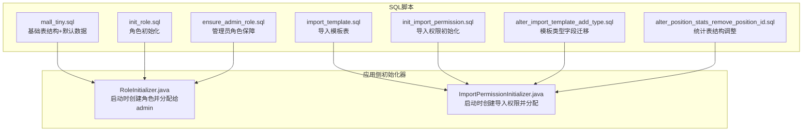
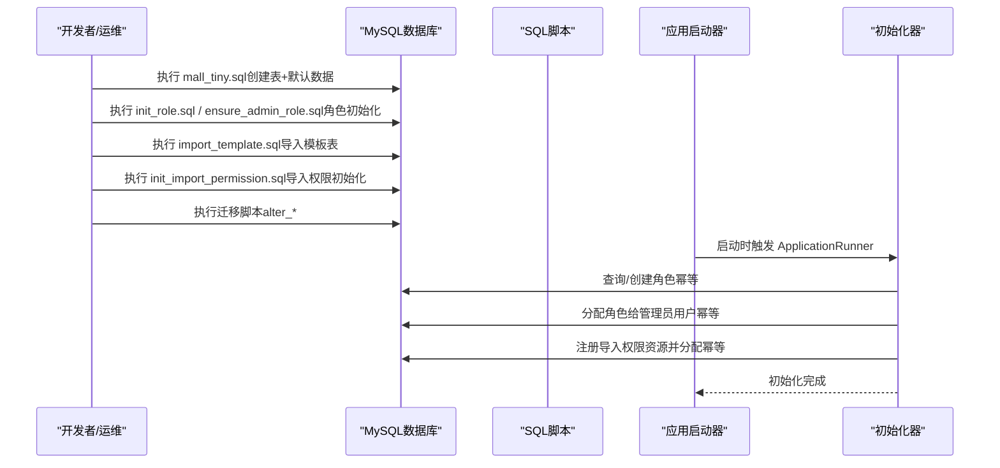
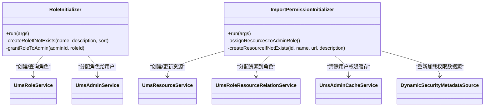
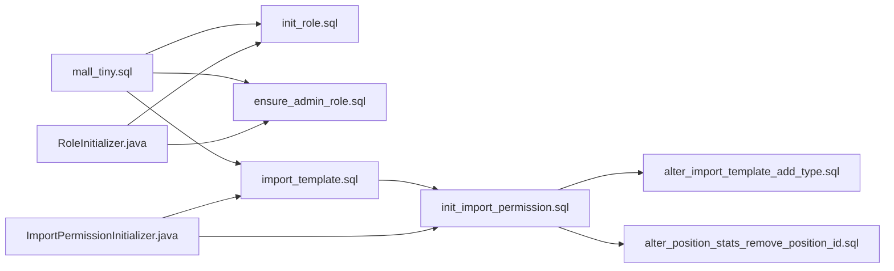

# 初始化脚本

<cite>
**本文引用的文件**
- [mall_tiny.sql](file://sql/mall_tiny.sql)
- [init_role.sql](file://sql/init_role.sql)
- [ensure_admin_role.sql](file://sql/ensure_admin_role.sql)
- [import_template.sql](file://sql/import_template.sql)
- [init_import_permission.sql](file://sql/init_import_permission.sql)
- [alter_import_template_add_type.sql](file://sql/alter_import_template_add_type.sql)
- [alter_position_stats_remove_position_id.sql](file://sql/alter_position_stats_remove_position_id.sql)
- [RoleInitializer.java](file://src/main/java/com/macro/mall/tiny/modules/ums/component/RoleInitializer.java)
- [ImportPermissionInitializer.java](file://src/main/java/com/macro/mall/tiny/modules/ums/component/ImportPermissionInitializer.java)
- [README.md](file://README.md)
</cite>

## 目录
1. [简介](#简介)
2. [项目结构](#项目结构)
3. [核心组件](#核心组件)
4. [架构总览](#架构总览)
5. [详细组件分析](#详细组件分析)
6. [依赖分析](#依赖分析)
7. [性能考虑](#性能考虑)
8. [故障排查指南](#故障排查指南)
9. [结论](#结论)
10. [附录](#附录)

## 简介
本文件面向数据库初始化与运维场景，系统性梳理 mall-tiny 项目的数据库初始化脚本与配套机制，覆盖以下主题：
- 基础表结构创建与默认数据插入
- 角色与权限初始化流程
- 数据库版本管理策略（命名规范、版本号管理、升级迁移）
- 备份与恢复策略（全量/增量/灾难恢复）
- 性能优化脚本（索引、统计信息、查询优化）
- 安全配置（用户权限、访问控制、审计日志）
- 监控与维护最佳实践

## 项目结构
本项目采用“脚本驱动 + 应用侧初始化器”的双轨机制：
- SQL 脚本：集中于 sql 目录，负责数据库结构与初始数据的落地
- 应用侧初始化器：通过 Spring Boot 的 ApplicationRunner 在启动阶段进行幂等初始化

图表来源
- [mall_tiny.sql:1-362](file://sql/mall_tiny.sql#L1-L362)
- [init_role.sql:1-31](file://sql/init_role.sql#L1-L31)
- [ensure_admin_role.sql:1-21](file://sql/ensure_admin_role.sql#L1-L21)
- [import_template.sql:1-12](file://sql/import_template.sql#L1-L12)
- [init_import_permission.sql:1-34](file://sql/init_import_permission.sql#L1-L34)
- [alter_import_template_add_type.sql:1-8](file://sql/alter_import_template_add_type.sql#L1-L8)
- [alter_position_stats_remove_position_id.sql:1-14](file://sql/alter_position_stats_remove_position_id.sql#L1-L14)
- [RoleInitializer.java:1-128](file://src/main/java/com/macro/mall/tiny/modules/ums/component/RoleInitializer.java#L1-L128)
- [ImportPermissionInitializer.java:1-126](file://src/main/java/com/macro/mall/tiny/modules/ums/component/ImportPermissionInitializer.java#L1-L126)

章节来源
- [README.md:45-52](file://README.md#L45-L52)
- [README.md:53-58](file://README.md#L53-L58)

## 核心组件
- 基础数据库脚本：mall_tiny.sql
  - 负责创建权限管理相关的核心表（用户、角色、菜单、资源、登录日志等），并插入默认数据（含管理员、普通用户等）
  - 适合首次部署或重建数据库时使用
- 角色初始化脚本：init_role.sql
  - 幂等地创建常用角色（管理员、普通用户、数据录入员），并将管理员角色分配给指定用户
- 管理员角色保障脚本：ensure_admin_role.sql
  - 保证管理员角色存在（带主键约束的幂等插入），并提供查询当前用户角色的示例
- 导入模板表脚本：import_template.sql
  - 创建导入模板表，支持列映射 JSON、创建者、时间戳等字段
- 导入权限初始化脚本：init_import_permission.sql
  - 注册导入相关权限资源，分配给管理员角色，并确保管理员角色存在
- 迁移脚本
  - alter_import_template_add_type.sql：为导入模板表增加导入类型字段并回填默认值
  - alter_position_stats_remove_position_id.sql：调整统计表结构，去除旧字段并新增部门与职位名称字段，建立唯一索引

章节来源
- [mall_tiny.sql:1-362](file://sql/mall_tiny.sql#L1-L362)
- [init_role.sql:1-31](file://sql/init_role.sql#L1-L31)
- [ensure_admin_role.sql:1-21](file://sql/ensure_admin_role.sql#L1-L21)
- [import_template.sql:1-12](file://sql/import_template.sql#L1-L12)
- [init_import_permission.sql:1-34](file://sql/init_import_permission.sql#L1-L34)
- [alter_import_template_add_type.sql:1-8](file://sql/alter_import_template_add_type.sql#L1-L8)
- [alter_position_stats_remove_position_id.sql:1-14](file://sql/alter_position_stats_remove_position_id.sql#L1-L14)

## 架构总览
数据库初始化的整体流程由“SQL脚本 + 应用侧初始化器”共同完成，确保系统启动时具备可用的角色、权限与基础数据。

图表来源
- [mall_tiny.sql:1-362](file://sql/mall_tiny.sql#L1-L362)
- [init_role.sql:1-31](file://sql/init_role.sql#L1-L31)
- [ensure_admin_role.sql:1-21](file://sql/ensure_admin_role.sql#L1-L21)
- [import_template.sql:1-12](file://sql/import_template.sql#L1-L12)
- [init_import_permission.sql:1-34](file://sql/init_import_permission.sql#L1-L34)
- [RoleInitializer.java:34-53](file://src/main/java/com/macro/mall/tiny/modules/ums/component/RoleInitializer.java#L34-L53)
- [ImportPermissionInitializer.java:46-72](file://src/main/java/com/macro/mall/tiny/modules/ums/component/ImportPermissionInitializer.java#L46-L72)

## 详细组件分析

### 基础表结构与默认数据（mall_tiny.sql）
- 责任边界
  - 创建权限管理核心表：后台用户、登录日志、角色、菜单、资源、资源分类、角色-菜单/资源关系等
  - 插入默认用户、角色、菜单、资源、资源分类等初始数据
- 关键点
  - 使用外键检查关闭语句，便于批量导入
  - 表结构与字段注释清晰，便于生成文档与前端展示
  - 初始数据包含管理员账户与多个角色，支撑后续权限体系
- 执行顺序建议
  - 先执行 mall_tiny.sql，再执行角色与权限初始化脚本，最后执行导入相关脚本

章节来源
- [mall_tiny.sql:16-362](file://sql/mall_tiny.sql#L16-L362)

### 角色初始化（init_role.sql）
- 功能目标
  - 幂等创建常用角色（管理员、普通用户、数据录入员）
  - 将管理员角色分配给指定用户（示例中为用户ID=1）
- 幂等策略
  - 使用条件查询判断是否存在，避免重复插入
  - 使用变量保存角色ID，再进行关系表插入
- 适用场景
  - 新环境首次部署或角色缺失时的修复

章节来源
- [init_role.sql:1-31](file://sql/init_role.sql#L1-L31)

### 管理员角色保障（ensure_admin_role.sql）
- 功能目标
  - 保证管理员角色存在（带主键约束的幂等插入）
  - 提供查询当前用户角色的示例
- 注意事项
  - 示例中包含注释掉的删除旧关系与插入新关系的步骤，便于按需启用
- 适用场景
  - 角色被误删或ID冲突时的快速修复

章节来源
- [ensure_admin_role.sql:1-21](file://sql/ensure_admin_role.sql#L1-L21)

### 导入模板表（import_template.sql）
- 功能目标
  - 创建导入模板表，支持模板名称、描述、列映射JSON、创建者、时间戳等
- 设计要点
  - 使用 utf8mb4 字符集，兼容更多字符
  - 自动时间戳字段，便于审计与追踪
- 适用场景
  - 支持 Excel 导入功能的模板管理

章节来源
- [import_template.sql:1-12](file://sql/import_template.sql#L1-L12)

### 导入权限初始化（init_import_permission.sql）
- 功能目标
  - 注册导入相关权限资源（上传、执行、模板管理等）
  - 将权限分配给管理员角色
  - 确保管理员角色存在
  - 将管理员角色分配给指定用户
- 幂等策略
  - 使用 ON DUPLICATE KEY UPDATE 与条件判断避免重复
  - 先清理旧关系，再插入新关系
- 适用场景
  - 新增导入功能或权限变更后的初始化

章节来源
- [init_import_permission.sql:1-34](file://sql/init_import_permission.sql#L1-L34)

### 迁移脚本（alter_*）
- import_template 增加类型字段
  - 为模板表增加 import_type 字段，默认值为 position
  - 回填已有模板的类型字段
- position_stats 结构调整
  - 去除 position_id 字段
  - 新增 department 与 position_name 字段
  - 新增年份+部门+职位名称的唯一索引，避免重复

章节来源
- [alter_import_template_add_type.sql:1-8](file://sql/alter_import_template_add_type.sql#L1-L8)
- [alter_position_stats_remove_position_id.sql:1-14](file://sql/alter_position_stats_remove_position_id.sql#L1-L14)

### 应用侧初始化器（启动时自动执行）
- 角色初始化器（RoleInitializer.java）
  - 启动时创建管理员、普通用户、数据录入员角色
  - 将管理员角色分配给用户ID=1
  - 日志记录创建与分配过程
- 导入权限初始化器（ImportPermissionInitializer.java）
  - 启动时注册导入相关权限资源
  - 将权限分配给管理员角色（角色ID=9）
  - 清除并重新加载动态权限数据源
  - 清除用户1的权限缓存

图表来源
- [RoleInitializer.java:24-127](file://src/main/java/com/macro/mall/tiny/modules/ums/component/RoleInitializer.java#L24-L127)
- [ImportPermissionInitializer.java:26-125](file://src/main/java/com/macro/mall/tiny/modules/ums/component/ImportPermissionInitializer.java#L26-L125)

章节来源
- [RoleInitializer.java:34-127](file://src/main/java/com/macro/mall/tiny/modules/ums/component/RoleInitializer.java#L34-L127)
- [ImportPermissionInitializer.java:46-125](file://src/main/java/com/macro/mall/tiny/modules/ums/component/ImportPermissionInitializer.java#L46-L125)

## 依赖分析
- 脚本间依赖
  - mall_tiny.sql 必须先于角色与权限初始化脚本执行
  - 导入模板表脚本应在导入权限初始化脚本之前执行
  - 迁移脚本在基础结构稳定后再执行
- 应用侧依赖
  - RoleInitializer 依赖 UmsRoleService 与 UmsAdminService
  - ImportPermissionInitializer 依赖 UmsResourceService、UmsRoleResourceRelationService、UmsAdminCacheService、DynamicSecurityMetadataSource

图表来源
- [mall_tiny.sql:1-362](file://sql/mall_tiny.sql#L1-L362)
- [init_role.sql:1-31](file://sql/init_role.sql#L1-L31)
- [ensure_admin_role.sql:1-21](file://sql/ensure_admin_role.sql#L1-L21)
- [import_template.sql:1-12](file://sql/import_template.sql#L1-L12)
- [init_import_permission.sql:1-34](file://sql/init_import_permission.sql#L1-L34)
- [alter_import_template_add_type.sql:1-8](file://sql/alter_import_template_add_type.sql#L1-L8)
- [alter_position_stats_remove_position_id.sql:1-14](file://sql/alter_position_stats_remove_position_id.sql#L1-L14)
- [RoleInitializer.java:24-127](file://src/main/java/com/macro/mall/tiny/modules/ums/component/RoleInitializer.java#L24-L127)
- [ImportPermissionInitializer.java:26-125](file://src/main/java/com/macro/mall/tiny/modules/ums/component/ImportPermissionInitializer.java#L26-L125)

## 性能考虑
- 索引与唯一约束
  - position_stats 新增唯一索引（年份+部门+职位名称），避免重复数据，提升查询稳定性
- 字段设计
  - 导入模板表使用 utf8mb4，支持更广泛的字符集，减少编码问题导致的性能损耗
- 查询优化建议
  - 对高频查询字段（如用户ID、角色ID、资源URL）建立合适索引
  - 定期更新表统计信息，确保执行计划最优
- 执行顺序
  - 先建表与索引，再批量插入数据，减少锁竞争与回滚成本

章节来源
- [alter_position_stats_remove_position_id.sql:11-14](file://sql/alter_position_stats_remove_position_id.sql#L11-L14)
- [import_template.sql:1-12](file://sql/import_template.sql#L1-L12)

## 故障排查指南
- 角色未生效
  - 检查 mall_tiny.sql 是否执行成功
  - 使用 ensure_admin_role.sql 保障管理员角色存在
  - 如需重置角色关系，参考脚本中的注释步骤
- 权限无法访问
  - 确认 init_import_permission.sql 已执行
  - 检查应用侧初始化器是否正常加载权限数据源
  - 清理用户权限缓存后重试
- 导入功能异常
  - 检查导入模板表是否创建成功
  - 确认迁移脚本已执行，特别是 import_type 字段
- 启动时初始化失败
  - 查看 RoleInitializer 与 ImportPermissionInitializer 的日志输出
  - 确认数据库连接与事务配置正确

章节来源
- [ensure_admin_role.sql:15-21](file://sql/ensure_admin_role.sql#L15-L21)
- [init_import_permission.sql:13-33](file://sql/init_import_permission.sql#L13-L33)
- [RoleInitializer.java:34-127](file://src/main/java/com/macro/mall/tiny/modules/ums/component/RoleInitializer.java#L34-L127)
- [ImportPermissionInitializer.java:46-125](file://src/main/java/com/macro/mall/tiny/modules/ums/component/ImportPermissionInitializer.java#L46-L125)

## 结论
mall-tiny 的数据库初始化采用“SQL脚本 + 应用侧初始化器”的双轨策略，既保证了结构与数据的标准化落地，又提供了启动时的幂等保障。通过合理的脚本命名、执行顺序与迁移策略，能够有效支撑系统的版本演进与运维管理。建议在生产环境中结合备份与监控策略，持续优化性能与安全性。

## 附录

### 数据库版本管理策略
- 脚本命名规范
  - 主初始化：mall_tiny.sql
  - 角色初始化：init_role.sql
  - 管理员角色保障：ensure_admin_role.sql
  - 导入模板表：import_template.sql
  - 导入权限初始化：init_import_permission.sql
  - 迁移脚本：alter_*.sql
- 版本号管理
  - 建议在脚本文件名中加入版本号前缀，例如 v1.0_mall_tiny.sql、v1.1_init_role.sql
  - 通过注释记录版本号与变更摘要
- 升级迁移流程
  - 评估变更影响，优先在测试环境验证
  - 先执行结构变更脚本，再执行数据迁移脚本
  - 使用幂等语句（如 ON DUPLICATE KEY UPDATE、条件判断）降低风险
  - 记录每次升级的变更清单与回滚方案

### 备份与恢复策略
- 全量备份
  - 使用逻辑备份（mysqldump）与物理备份（xtrabackup/LVM快照）相结合
  - 定期验证备份文件完整性与可恢复性
- 增量备份
  - 基于二进制日志（binlog）进行增量备份，缩短RPO
  - 设置 binlog 保留周期，平衡磁盘占用与恢复能力
- 灾难恢复
  - 制定 RTO/RPO 指标，明确恢复步骤与责任人
  - 定期演练恢复流程，验证备份数据可用性
  - 准备异地容灾方案，确保跨地域可用性

### 数据库安全配置
- 用户权限
  - 为不同环境创建专用数据库用户，最小权限原则
  - 限制远程访问，仅允许内网或特定IP访问
- 访问控制
  - 启用强密码策略与定期更换机制
  - 使用 SSL/TLS 加密连接，防止中间人攻击
- 审计日志
  - 启用审计日志（audit plugin 或通用查询日志），记录敏感操作
  - 定期审查日志，识别异常行为

### 监控与维护最佳实践
- 监控指标
  - 连接数、慢查询、锁等待、缓冲池命中率、磁盘IO
  - 备份与恢复任务的执行状态与耗时
- 维护任务
  - 定期重建索引、更新统计信息
  - 清理历史日志与临时数据，控制表膨胀
  - 评估并优化热点表与热点SQL