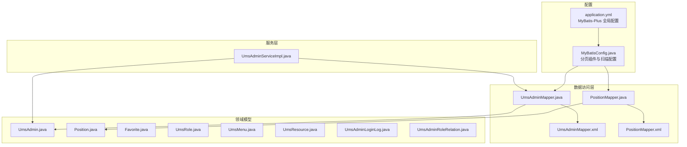
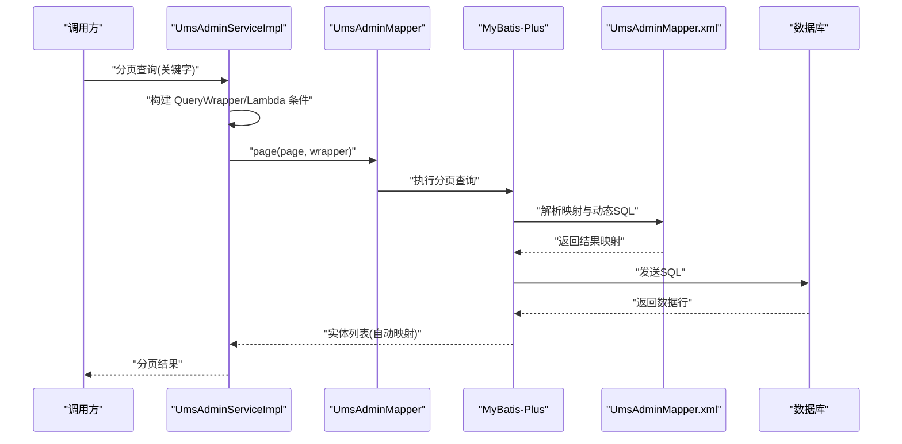
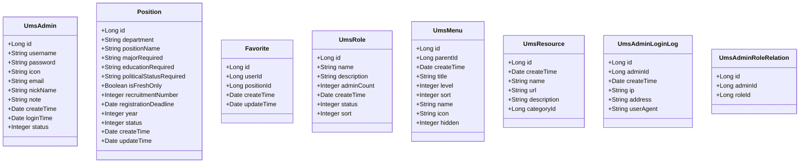
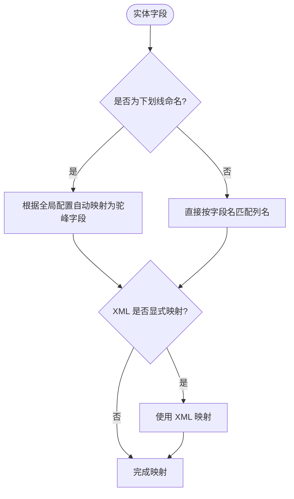
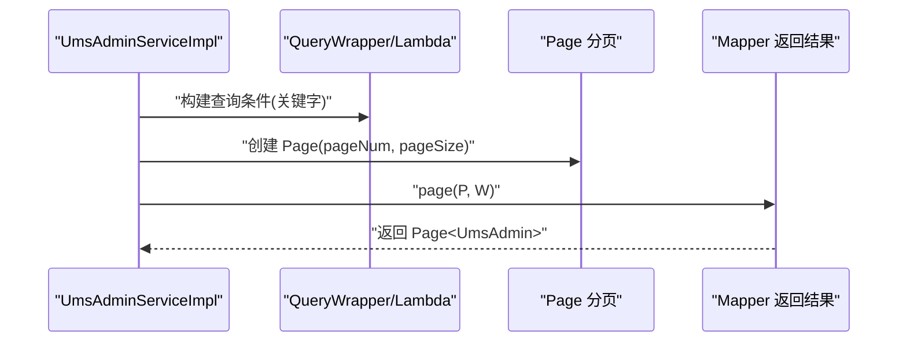
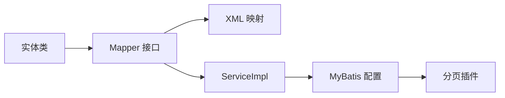

# 实体模型映射

<cite>
**本文引用的文件**
- [UmsAdmin.java](file://src/main/java/com/macro/mall/tiny/modules/ums/model/UmsAdmin.java)
- [Position.java](file://src/main/java/com/macro/mall/tiny/modules/ums/model/Position.java)
- [Favorite.java](file://src/main/java/com/macro/mall/tiny/modules/ums/model/Favorite.java)
- [UmsRole.java](file://src/main/java/com/macro/mall/tiny/modules/ums/model/UmsRole.java)
- [UmsMenu.java](file://src/main/java/com/macro/mall/tiny/modules/ums/model/UmsMenu.java)
- [UmsResource.java](file://src/main/java/com/macro/mall/tiny/modules/ums/model/UmsResource.java)
- [UmsAdminLoginLog.java](file://src/main/java/com/macro/mall/tiny/modules/ums/model/UmsAdminLoginLog.java)
- [UmsAdminRoleRelation.java](file://src/main/java/com/macro/mall/tiny/modules/ums/model/UmsAdminRoleRelation.java)
- [UmsAdminMapper.java](file://src/main/java/com/macro/mall/tiny/modules/ums/mapper/UmsAdminMapper.java)
- [PositionMapper.java](file://src/main/java/com/macro/mall/tiny/modules/ums/mapper/PositionMapper.java)
- [UmsAdminMapper.xml](file://src/main/resources/mapper/ums/UmsAdminMapper.xml)
- [PositionMapper.xml](file://src/main/resources/mapper/ums/PositionMapper.xml)
- [UmsAdminServiceImpl.java](file://src/main/java/com/macro/mall/tiny/modules/ums/service/impl/UmsAdminServiceImpl.java)
- [MyBatisConfig.java](file://src/main/java/com/macro/mall/tiny/config/MyBatisConfig.java)
- [application.yml](file://src/main/resources/application.yml)
- [generator.properties](file://src/main/resources/generator.properties)
</cite>

## 目录
1. [引言](#引言)
2. [项目结构](#项目结构)
3. [核心组件](#核心组件)
4. [架构总览](#架构总览)
5. [详细组件分析](#详细组件分析)
6. [依赖分析](#依赖分析)
7. [性能考虑](#性能考虑)
8. [故障排查指南](#故障排查指南)
9. [结论](#结论)
10. [附录](#附录)

## 引言
本文件围绕 MyBatis Plus 的实体模型映射展开，系统梳理实体类的设计与注解使用、与数据库表的映射关系、字段命名策略与驼峰/下划线转换规则、继承与泛型使用、序列化处理、以及在不同业务场景中的应用（查询条件构造、动态 SQL、分页、批量操作等）。同时给出最佳实践建议，帮助后端开发者高效、稳定地设计与维护实体模型。

## 项目结构
本项目采用模块化分层组织，实体模型位于模块的 model 包中，对应的 Mapper 接口位于 mapper 包，XML 映射文件位于 resources/mapper/** 下，MyBatis 配置集中在 config 包中，全局配置在 application.yml 中。

图表来源
- [application.yml:15-23](file://src/main/resources/application.yml#L15-L23)
- [MyBatisConfig.java:17-25](file://src/main/java/com/macro/mall/tiny/config/MyBatisConfig.java#L17-L25)
- [UmsAdminMapper.java:17](file://src/main/java/com/macro/mall/tiny/modules/ums/mapper/UmsAdminMapper.java#L17)
- [PositionMapper.java:14](file://src/main/java/com/macro/mall/tiny/modules/ums/mapper/PositionMapper.java#L14)
- [UmsAdminMapper.xml:3](file://src/main/resources/mapper/ums/UmsAdminMapper.xml#L3)
- [PositionMapper.xml:3](file://src/main/resources/mapper/ums/PositionMapper.xml#L3)
- [UmsAdmin.java:23](file://src/main/java/com/macro/mall/tiny/modules/ums/model/UmsAdmin.java#L23)
- [Position.java:22](file://src/main/java/com/macro/mall/tiny/modules/ums/model/Position.java#L22)
- [UmsAdminServiceImpl.java:48](file://src/main/java/com/macro/mall/tiny/modules/ums/service/impl/UmsAdminServiceImpl.java#L48)

章节来源
- [application.yml:15-23](file://src/main/resources/application.yml#L15-L23)
- [MyBatisConfig.java:17-25](file://src/main/java/com/macro/mall/tiny/config/MyBatisConfig.java#L17-L25)

## 核心组件
- 实体类与注解
  - 表名映射：通过 @TableName 指定数据库表名，如 UmsAdmin 对应 ums_admin。
  - 主键映射：通过 @TableId 指定主键字段及主键策略，如 AUTO。
  - 字段映射：默认按字段名与列名匹配；结合全局配置可自动进行下划线到驼峰转换。
- Mapper 接口与 XML
  - Mapper 接口继承 BaseMapper<T>，即可获得常用 CRUD 能力。
  - XML 文件用于复杂查询、动态 SQL 或显式字段映射。
- 服务层使用
  - 使用 QueryWrapper/LambdaQueryWrapper 构造查询条件。
  - 分页使用 Page 与 MyBatis-Plus 分页插件。
  - 批量操作通过 ServiceImpl 提供的 saveBatch 等方法。

章节来源
- [UmsAdmin.java:23](file://src/main/java/com/macro/mall/tiny/modules/ums/model/UmsAdmin.java#L23)
- [UmsAdminMapper.java:17](file://src/main/java/com/macro/mall/tiny/modules/ums/mapper/UmsAdminMapper.java#L17)
- [UmsAdminMapper.xml:6-17](file://src/main/resources/mapper/ums/UmsAdminMapper.xml#L6-L17)
- [UmsAdminServiceImpl.java:64-163](file://src/main/java/com/macro/mall/tiny/modules/ums/service/impl/UmsAdminServiceImpl.java#L64-L163)
- [application.yml:15-23](file://src/main/resources/application.yml#L15-L23)

## 架构总览
下面的图展示了实体模型、Mapper、XML 映射与服务层之间的交互关系，以及全局配置对字段映射的影响。

图表来源
- [UmsAdminServiceImpl.java:154-163](file://src/main/java/com/macro/mall/tiny/modules/ums/service/impl/UmsAdminServiceImpl.java#L154-L163)
- [UmsAdminMapper.xml:3-17](file://src/main/resources/mapper/ums/UmsAdminMapper.xml#L3-L17)
- [application.yml:20-22](file://src/main/resources/application.yml#L20-L22)

## 详细组件分析

### 实体类设计与注解使用
- @TableName：声明实体对应的数据表名，如 UmsAdmin 对应 ums_admin、UmsRole 对应 ums_role 等。
- @TableId：声明主键字段与主键策略，如 AUTO。
- 字段映射：默认按字段名与列名匹配；结合全局配置 map-underscore-to-camel-case: true 可实现下划线到驼峰的自动转换。
- 序列化：所有实体实现 Serializable，便于缓存与传输。
- Lombok：使用 @Data、@Getter/@Setter、@ApiModel 等简化代码与文档标注。

图表来源
- [UmsAdmin.java:25-58](file://src/main/java/com/macro/mall/tiny/modules/ums/model/UmsAdmin.java#L25-L58)
- [Position.java:23-67](file://src/main/java/com/macro/mall/tiny/modules/ums/model/Position.java#L23-L67)
- [Favorite.java:23-43](file://src/main/java/com/macro/mall/tiny/modules/ums/model/Favorite.java#L23-L43)
- [UmsRole.java:25-50](file://src/main/java/com/macro/mall/tiny/modules/ums/model/UmsRole.java#L25-L50)
- [UmsMenu.java:25-57](file://src/main/java/com/macro/mall/tiny/modules/ums/model/UmsMenu.java#L25-L57)
- [UmsResource.java:25-48](file://src/main/java/com/macro/mall/tiny/modules/ums/model/UmsResource.java#L25-L48)
- [UmsAdminLoginLog.java:25-44](file://src/main/java/com/macro/mall/tiny/modules/ums/model/UmsAdminLoginLog.java#L25-L44)
- [UmsAdminRoleRelation.java:24-36](file://src/main/java/com/macro/mall/tiny/modules/ums/model/UmsAdminRoleRelation.java#L24-L36)

章节来源
- [UmsAdmin.java:23-58](file://src/main/java/com/macro/mall/tiny/modules/ums/model/UmsAdmin.java#L23-L58)
- [UmsRole.java:23-50](file://src/main/java/com/macro/mall/tiny/modules/ums/model/UmsRole.java#L23-L50)
- [UmsMenu.java:23-57](file://src/main/java/com/macro/mall/tiny/modules/ums/model/UmsMenu.java#L23-L57)
- [UmsResource.java:23-48](file://src/main/java/com/macro/mall/tiny/modules/ums/model/UmsResource.java#L23-L48)
- [Position.java:22-67](file://src/main/java/com/macro/mall/tiny/modules/ums/model/Position.java#L22-L67)
- [Favorite.java:22-43](file://src/main/java/com/macro/mall/tiny/modules/ums/model/Favorite.java#L22-L43)
- [UmsAdminLoginLog.java:23-44](file://src/main/java/com/macro/mall/tiny/modules/ums/model/UmsAdminLoginLog.java#L23-L44)
- [UmsAdminRoleRelation.java:22-36](file://src/main/java/com/macro/mall/tiny/modules/ums/model/UmsAdminRoleRelation.java#L22-L36)

### 实体与数据库表的映射关系与命名策略
- 表名映射：实体类通过 @TableName 指定表名，如 UmsAdmin 对应 ums_admin。
- 字段映射：默认按字段名与列名匹配；全局配置 map-underscore-to-camel-case: true 将下划线列名自动映射为驼峰字段名。
- 示例映射：
  - UmsAdmin：字段 username 对应列 username；nickName 对应列 nick_name。
  - Position：字段 positionName 对应列 position_name；isFreshOnly 对应列 is_fresh_only。
- XML 映射：当字段名与列名不一致或需要显式映射时，可在 XML 中使用 <result> 与 <id> 进行精确映射。

图表来源
- [application.yml:20-22](file://src/main/resources/application.yml#L20-L22)
- [UmsAdminMapper.xml:6-17](file://src/main/resources/mapper/ums/UmsAdminMapper.xml#L6-L17)
- [PositionMapper.xml:6-19](file://src/main/resources/mapper/ums/PositionMapper.xml#L6-L19)

章节来源
- [application.yml:20-22](file://src/main/resources/application.yml#L20-L22)
- [UmsAdminMapper.xml:6-17](file://src/main/resources/mapper/ums/UmsAdminMapper.xml#L6-L17)
- [PositionMapper.xml:6-19](file://src/main/resources/mapper/ums/PositionMapper.xml#L6-L19)

### 查询条件构造与动态 SQL
- 条件构造器：使用 QueryWrapper 与 LambdaQueryWrapper 构建查询条件，支持链式调用与类型安全的字段引用。
- 动态 SQL：复杂查询可在 XML 中编写动态 SQL，并通过参数传入。
- 示例流程：分页查询时，根据关键字动态拼接 like 条件并分页返回。

图表来源
- [UmsAdminServiceImpl.java:154-163](file://src/main/java/com/macro/mall/tiny/modules/ums/service/impl/UmsAdminServiceImpl.java#L154-L163)

章节来源
- [UmsAdminServiceImpl.java:64-163](file://src/main/java/com/macro/mall/tiny/modules/ums/service/impl/UmsAdminServiceImpl.java#L64-L163)

### 批量操作与分页
- 批量保存：通过 ServiceImpl 提供的 saveBatch 方法实现批量插入或更新。
- 分页：MyBatis-Plus 分页插件在配置中启用，服务层直接传入 Page 对象即可分页查询。
- XML 扩展：对于复杂批量或聚合查询，可在 XML 中编写相应语句。

章节来源
- [MyBatisConfig.java:20-25](file://src/main/java/com/macro/mall/tiny/config/MyBatisConfig.java#L20-L25)
- [UmsAdminServiceImpl.java:201-210](file://src/main/java/com/macro/mall/tiny/modules/ums/service/impl/UmsAdminServiceImpl.java#L201-L210)

### 继承关系、泛型与序列化
- 继承关系：实体类之间无继承关系，均为独立的领域模型。
- 泛型使用：Mapper 接口泛型绑定实体类型，Service 层通过 BaseMapper 与 ServiceImpl 提供统一能力。
- 序列化：所有实体实现 Serializable，便于缓存与跨进程传输。

章节来源
- [UmsAdminMapper.java:17](file://src/main/java/com/macro/mall/tiny/modules/ums/mapper/UmsAdminMapper.java#L17)
- [UmsAdminServiceImpl.java:48](file://src/main/java/com/macro/mall/tiny/modules/ums/service/impl/UmsAdminServiceImpl.java#L48)
- [UmsAdmin.java:25-58](file://src/main/java/com/macro/mall/tiny/modules/ums/model/UmsAdmin.java#L25-L58)

### 高级特性配置（主键策略、乐观锁、逻辑删除）
- 主键策略：通过 @TableId(type = IdType.AUTO) 指定数据库自增主键策略。
- 乐观锁：可通过 @Version 注解开启，配合全局配置与数据库版本字段使用。
- 逻辑删除：可通过 @TableLogic 注解与全局配置启用软删除，避免真实删除造成的数据丢失。
- 注意：当前仓库未发现 @Version 与 @TableLogic 的使用，如需启用请在实体类中添加相应注解并在全局配置中开启。

章节来源
- [UmsAdmin.java:29](file://src/main/java/com/macro/mall/tiny/modules/ums/model/UmsAdmin.java#L29)
- [UmsRole.java:29](file://src/main/java/com/macro/mall/tiny/modules/ums/model/UmsRole.java#L29)
- [UmsMenu.java:29](file://src/main/java/com/macro/mall/tiny/modules/ums/model/UmsMenu.java#L29)
- [UmsResource.java:29](file://src/main/java/com/macro/mall/tiny/modules/ums/model/UmsResource.java#L29)
- [Position.java:27](file://src/main/java/com/macro/mall/tiny/modules/ums/model/Position.java#L27)
- [Favorite.java:27](file://src/main/java/com/macro/mall/tiny/modules/ums/model/Favorite.java#L27)
- [UmsAdminLoginLog.java:29](file://src/main/java/com/macro/mall/tiny/modules/ums/model/UmsAdminLoginLog.java#L29)
- [UmsAdminRoleRelation.java:28](file://src/main/java/com/macro/mall/tiny/modules/ums/model/UmsAdminRoleRelation.java#L28)

### 实体类在不同业务场景下的使用
- 登录与权限：通过 UmsAdminServiceImpl 加载用户详情与资源列表，结合 JWT 与 Spring Security 实现鉴权。
- 角色与资源：通过关联表实体（如 UmsAdminRoleRelation）维护用户与角色、角色与资源的关系。
- 日志与统计：通过 UmsAdminLoginLog 记录登录行为，辅助审计与统计分析。

章节来源
- [UmsAdminServiceImpl.java:257-265](file://src/main/java/com/macro/mall/tiny/modules/ums/service/impl/UmsAdminServiceImpl.java#L257-L265)
- [UmsAdminRoleRelation.java:24-36](file://src/main/java/com/macro/mall/tiny/modules/ums/model/UmsAdminRoleRelation.java#L24-L36)
- [UmsAdminLoginLog.java:25-44](file://src/main/java/com/macro/mall/tiny/modules/ums/model/UmsAdminLoginLog.java#L25-L44)

## 依赖分析
- Mapper 接口与实体类：Mapper 接口泛型绑定实体类型，实现对实体的 CRUD 能力。
- XML 映射：当字段命名与列名不一致或需要复杂映射时，XML 提供精确映射与动态 SQL。
- 全局配置：application.yml 中的 MyBatis-Plus 配置影响字段映射与分页行为。
- 插件配置：MyBatisConfig 中启用分页插件，扫描 Mapper 包路径。

图表来源
- [UmsAdminMapper.java:17](file://src/main/java/com/macro/mall/tiny/modules/ums/mapper/UmsAdminMapper.java#L17)
- [UmsAdminMapper.xml:3-17](file://src/main/resources/mapper/ums/UmsAdminMapper.xml#L3-L17)
- [UmsAdminServiceImpl.java:48](file://src/main/java/com/macro/mall/tiny/modules/ums/service/impl/UmsAdminServiceImpl.java#L48)
- [MyBatisConfig.java:17-25](file://src/main/java/com/macro/mall/tiny/config/MyBatisConfig.java#L17-L25)
- [application.yml:15-23](file://src/main/resources/application.yml#L15-L23)

章节来源
- [UmsAdminMapper.java:17](file://src/main/java/com/macro/mall/tiny/modules/ums/mapper/UmsAdminMapper.java#L17)
- [UmsAdminMapper.xml:3-17](file://src/main/resources/mapper/ums/UmsAdminMapper.xml#L3-L17)
- [UmsAdminServiceImpl.java:48](file://src/main/java/com/macro/mall/tiny/modules/ums/service/impl/UmsAdminServiceImpl.java#L48)
- [MyBatisConfig.java:17-25](file://src/main/java/com/macro/mall/tiny/config/MyBatisConfig.java#L17-L25)
- [application.yml:15-23](file://src/main/resources/application.yml#L15-L23)

## 性能考虑
- 字段粒度控制：仅映射必要字段，避免 N+1 查询；优先使用 selectColumns 控制查询字段。
- 避免 N+1：通过关联查询或批量加载减少多次查询；合理使用缓存。
- 分页与索引：确保分页查询的排序字段有索引；避免全表扫描。
- 批量操作：使用 saveBatch 等批量方法减少往返次数。
- 自动映射：利用 map-underscore-to-camel-case 减少手工映射开销。

## 故障排查指南
- 字段映射失败：检查 application.yml 中 map-underscore-to-camel-case 配置；确认 XML 是否存在显式映射。
- 分页无效：确认 MyBatisConfig 中分页插件已启用且扫描路径正确。
- 主键策略异常：确认 @TableId(type = IdType.AUTO) 与数据库自增一致。
- 复杂查询报错：核对 XML 中动态 SQL 语法与参数绑定。

章节来源
- [application.yml:15-23](file://src/main/resources/application.yml#L15-L23)
- [MyBatisConfig.java:20-25](file://src/main/java/com/macro/mall/tiny/config/MyBatisConfig.java#L20-L25)
- [UmsAdminMapper.xml:3-17](file://src/main/resources/mapper/ums/UmsAdminMapper.xml#L3-L17)

## 结论
本项目通过清晰的实体模型设计与 MyBatis-Plus 注解配置，实现了与数据库表的高效映射。结合全局配置与分页插件，能够在保证开发效率的同时满足性能需求。建议在实际项目中进一步引入乐观锁与逻辑删除等高级特性，并持续优化查询与缓存策略，以提升系统的稳定性与扩展性。

## 附录
- 生成器配置：generator.properties 中包含数据源与包路径配置，可用于代码生成工具初始化。
- 命名规范：建议统一使用下划线命名数据库列，利用驼峰映射减少手工映射成本。

章节来源
- [generator.properties:1-5](file://src/main/resources/generator.properties#L1-L5)