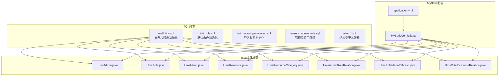
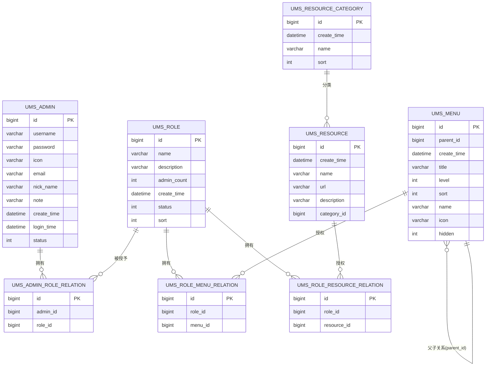
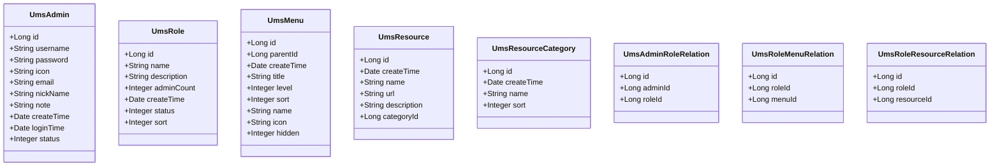
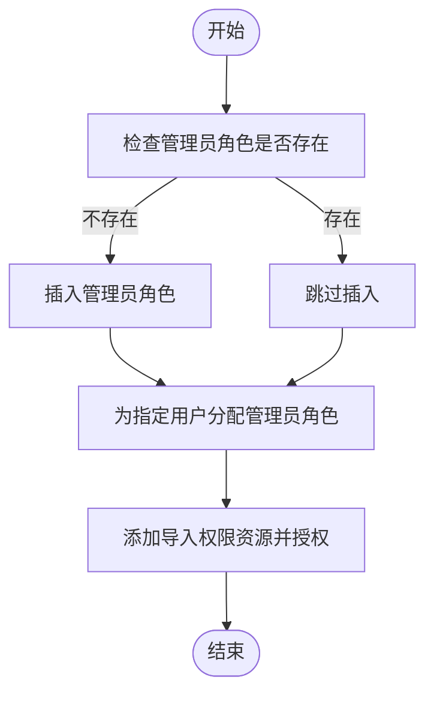
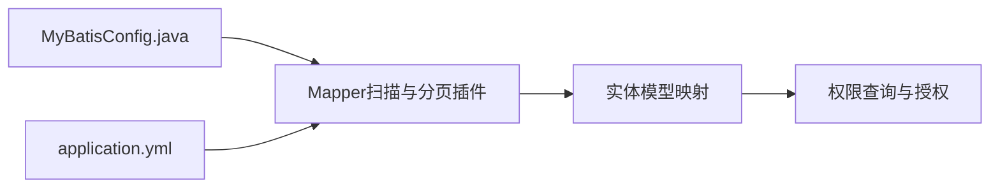

# 数据库设计

<cite>
**本文引用的文件**
- [mall_tiny.sql](file://sql/mall_tiny.sql)
- [init_role.sql](file://sql/init_role.sql)
- [init_import_permission.sql](file://sql/init_import_permission.sql)
- [ensure_admin_role.sql](file://sql/ensure_admin_role.sql)
- [alter_import_template_add_type.sql](file://sql/alter_import_template_add_type.sql)
- [alter_position_stats_remove_position_id.sql](file://sql/alter_position_stats_remove_position_id.sql)
- [UmsAdmin.java](file://src/main/java/com/macro/mall/tiny/modules/ums/model/UmsAdmin.java)
- [UmsRole.java](file://src/main/java/com/macro/mall/tiny/modules/ums/model/UmsRole.java)
- [UmsMenu.java](file://src/main/java/com/macro/mall/tiny/modules/ums/model/UmsMenu.java)
- [UmsResource.java](file://src/main/java/com/macro/mall/tiny/modules/ums/model/UmsResource.java)
- [UmsResourceCategory.java](file://src/main/java/com/macro/mall/tiny/modules/ums/model/UmsResourceCategory.java)
- [UmsAdminRoleRelation.java](file://src/main/java/com/macro/mall/tiny/modules/ums/model/UmsAdminRoleRelation.java)
- [UmsRoleMenuRelation.java](file://src/main/java/com/macro/mall/tiny/modules/ums/model/UmsRoleMenuRelation.java)
- [UmsRoleResourceRelation.java](file://src/main/java/com/macro/mall/tiny/modules/ums/model/UmsRoleResourceRelation.java)
- [MyBatisConfig.java](file://src/main/java/com/macro/mall/tiny/config/MyBatisConfig.java)
- [application.yml](file://src/main/resources/application.yml)
</cite>

## 目录
1. [简介](#简介)
2. [项目结构](#项目结构)
3. [核心组件](#核心组件)
4. [架构总览](#架构总览)
5. [详细组件分析](#详细组件分析)
6. [依赖分析](#依赖分析)
7. [性能考虑](#性能考虑)
8. [故障排查指南](#故障排查指南)
9. [结论](#结论)
10. [附录](#附录)

## 简介
本文件面向DBA与后端开发者，系统化梳理权限管理相关的数据库设计与实现，覆盖用户、角色、菜单、资源及其关系表的表结构、字段语义、关联关系、索引与约束、查询优化策略；同时结合MyBatis Plus实体映射与配置，给出数据库初始化脚本、数据导入顺序、默认配置与权限初始化流程，并总结数据库迁移与版本管理的最佳实践。

## 项目结构
围绕权限管理的核心数据库对象主要分布在以下位置：
- SQL初始化与迁移脚本位于 sql/ 目录
- MyBatis Plus 实体模型位于 src/main/java/.../modules/ums/model/
- MyBatis Plus 配置位于 src/main/java/.../config/ 与 src/main/resources/application.yml

**图表来源**
- [mall_tiny.sql](file://sql/mall_tiny.sql)
- [UmsAdmin.java](file://src/main/java/com/macro/mall/tiny/modules/ums/model/UmsAdmin.java)
- [UmsRole.java](file://src/main/java/com/macro/mall/tiny/modules/ums/model/UmsRole.java)
- [UmsMenu.java](file://src/main/java/com/macro/mall/tiny/modules/ums/model/UmsMenu.java)
- [UmsResource.java](file://src/main/java/com/macro/mall/tiny/modules/ums/model/UmsResource.java)
- [UmsResourceCategory.java](file://src/main/java/com/macro/mall/tiny/modules/ums/model/UmsResourceCategory.java)
- [UmsAdminRoleRelation.java](file://src/main/java/com/macro/mall/tiny/modules/ums/model/UmsAdminRoleRelation.java)
- [UmsRoleMenuRelation.java](file://src/main/java/com/macro/mall/tiny/modules/ums/model/UmsRoleMenuRelation.java)
- [UmsRoleResourceRelation.java](file://src/main/java/com/macro/mall/tiny/modules/ums/model/UmsRoleResourceRelation.java)
- [MyBatisConfig.java](file://src/main/java/com/macro/mall/tiny/config/MyBatisConfig.java)
- [application.yml](file://src/main/resources/application.yml)

**章节来源**
- [mall_tiny.sql](file://sql/mall_tiny.sql)
- [MyBatisConfig.java](file://src/main/java/com/macro/mall/tiny/config/MyBatisConfig.java)
- [application.yml](file://src/main/resources/application.yml)

## 核心组件
本节从数据库角度拆解权限管理的核心表与关系，明确字段含义、主键/索引、约束与典型查询模式。

- 用户表（ums_admin）
  - 主键：id
  - 关键字段：username、password、email、nick_name、status、create_time、login_time
  - 用途：存储后台用户基本信息与状态
  - 建议索引：username（唯一性校验）、status（启用过滤）

- 角色表（ums_role）
  - 主键：id
  - 关键字段：name、description、status、sort、create_time
  - 用途：定义角色与状态、排序
  - 建议索引：name（唯一性校验）、status

- 菜单表（ums_menu）
  - 主键：id
  - 关键字段：parent_id（树形结构）、level、sort、name、icon、hidden
  - 用途：构建后台菜单树与前端展示
  - 建议索引：parent_id、level、sort

- 资源表（ums_resource）
  - 主键：id
  - 关键字段：name、url、description、category_id、create_time
  - 用途：细粒度权限控制（URL级）
  - 建议索引：url（匹配访问路径）、category_id（分类聚合）

- 资源分类表（ums_resource_category）
  - 主键：id
  - 关键字段：name、sort、create_time
  - 用途：对资源进行模块化分组
  - 建议索引：name

- 关系表
  - 用户-角色（ums_admin_role_relation）：admin_id、role_id
  - 角色-菜单（ums_role_menu_relation）：role_id、menu_id
  - 角色-资源（ums_role_resource_relation）：role_id、resource_id

**章节来源**
- [mall_tiny.sql](file://sql/mall_tiny.sql)

## 架构总览
下图展示权限管理的数据库架构与实体映射关系，体现用户、角色、菜单、资源及三类关系表之间的多对多与树形结构。

**图表来源**
- [mall_tiny.sql](file://sql/mall_tiny.sql)

## 详细组件分析

### 用户表（ums_admin）
- 字段设计要点
  - 密码采用安全散列（示例值为BCrypt格式），不存储明文
  - 状态位用于快速启用/禁用控制
  - 登录时间用于审计与会话管理
- 查询优化建议
  - 按用户名登录时使用 username 索引
  - 启用状态过滤使用 status 索引
- 安全与合规
  - 建议在应用层强制密码复杂度与过期策略
  - 登录失败次数与封禁策略可在业务层扩展

**章节来源**
- [mall_tiny.sql](file://sql/mall_tiny.sql)
- [UmsAdmin.java](file://src/main/java/com/macro/mall/tiny/modules/ums/model/UmsAdmin.java)

### 角色表（ums_role）
- 字段设计要点
  - 名称用于标识与展示，建议保持唯一性
  - 排序字段支持角色优先级展示
  - 状态位便于灰度与降级
- 查询优化建议
  - 按名称或状态过滤时建立索引
- 扩展建议
  - 可增加“内置角色”标记，避免误删

**章节来源**
- [mall_tiny.sql](file://sql/mall_tiny.sql)
- [UmsRole.java](file://src/main/java/com/macro/mall/tiny/modules/ums/model/UmsRole.java)

### 菜单表（ums_menu）
- 字段设计要点
  - parent_id 支持树形结构，level 与 sort 决定层级与排序
  - hidden 控制前端显示
- 查询优化建议
  - 树形查询可按 parent_id + level + sort 进行分页与排序
- 架构建议
  - 建议在应用层缓存菜单树，减少数据库压力

**章节来源**
- [mall_tiny.sql](file://sql/mall_tiny.sql)
- [UmsMenu.java](file://src/main/java/com/macro/mall/tiny/modules/ums/model/UmsMenu.java)

### 资源表（ums_resource）与资源分类（ums_resource_category）
- 字段设计要点
  - 资源以URL模式匹配进行细粒度授权
  - 分类用于模块化管理与权限治理
- 查询优化建议
  - URL匹配建议使用前缀索引或规范化路径
  - 分类聚合查询按 category_id 建索引
- 权限设计建议
  - URL应遵循统一前缀与通配规则，便于网关或拦截器识别

**章节来源**
- [mall_tiny.sql](file://sql/mall_tiny.sql)
- [UmsResource.java](file://src/main/java/com/macro/mall/tiny/modules/ums/model/UmsResource.java)
- [UmsResourceCategory.java](file://src/main/java/com/macro/mall/tiny/modules/ums/model/UmsResourceCategory.java)

### 关系表
- 用户-角色（ums_admin_role_relation）
  - 多对多：一个用户可有多个角色，一个角色可授予多个用户
  - 建议复合唯一索引：(admin_id, role_id)
- 角色-菜单（ums_role_menu_relation）
  - 多对多：角色拥有多个菜单，菜单可被多个角色拥有
  - 建议复合唯一索引：(role_id, menu_id)
- 角色-资源（ums_role_resource_relation）
  - 多对多：角色拥有多个资源，资源可被多个角色拥有
  - 建议复合唯一索引：(role_id, resource_id)

**章节来源**
- [mall_tiny.sql](file://sql/mall_tiny.sql)
- [UmsAdminRoleRelation.java](file://src/main/java/com/macro/mall/tiny/modules/ums/model/UmsAdminRoleRelation.java)
- [UmsRoleMenuRelation.java](file://src/main/java/com/macro/mall/tiny/modules/ums/model/UmsRoleMenuRelation.java)
- [UmsRoleResourceRelation.java](file://src/main/java/com/macro/mall/tiny/modules/ums/model/UmsRoleResourceRelation.java)

### MyBatis Plus 实体模型与映射
- 注解使用
  - @TableName：声明实体对应表名
  - @TableId + IdType.AUTO：声明自增主键
  - @ApiModelProperty：Swagger文档注解
- 字段映射
  - application.yml 中开启下划线转驼峰映射，确保数据库字段与实体属性自动映射
- 类型处理器
  - 默认行为满足基础类型映射；如需特殊类型（枚举、JSON、LocalDateTime等），可在全局配置中注册类型处理器或使用注解指定

**图表来源**
- [UmsAdmin.java](file://src/main/java/com/macro/mall/tiny/modules/ums/model/UmsAdmin.java)
- [UmsRole.java](file://src/main/java/com/macro/mall/tiny/modules/ums/model/UmsRole.java)
- [UmsMenu.java](file://src/main/java/com/macro/mall/tiny/modules/ums/model/UmsMenu.java)
- [UmsResource.java](file://src/main/java/com/macro/mall/tiny/modules/ums/model/UmsResource.java)
- [UmsResourceCategory.java](file://src/main/java/com/macro/mall/tiny/modules/ums/model/UmsResourceCategory.java)
- [UmsAdminRoleRelation.java](file://src/main/java/com/macro/mall/tiny/modules/ums/model/UmsAdminRoleRelation.java)
- [UmsRoleMenuRelation.java](file://src/main/java/com/macro/mall/tiny/modules/ums/model/UmsRoleMenuRelation.java)
- [UmsRoleResourceRelation.java](file://src/main/java/com/macro/mall/tiny/modules/ums/model/UmsRoleResourceRelation.java)

**章节来源**
- [UmsAdmin.java](file://src/main/java/com/macro/mall/tiny/modules/ums/model/UmsAdmin.java)
- [UmsRole.java](file://src/main/java/com/macro/mall/tiny/modules/ums/model/UmsRole.java)
- [UmsMenu.java](file://src/main/java/com/macro/mall/tiny/modules/ums/model/UmsMenu.java)
- [UmsResource.java](file://src/main/java/com/macro/mall/tiny/modules/ums/model/UmsResource.java)
- [UmsResourceCategory.java](file://src/main/java/com/macro/mall/tiny/modules/ums/model/UmsResourceCategory.java)
- [UmsAdminRoleRelation.java](file://src/main/java/com/macro/mall/tiny/modules/ums/model/UmsAdminRoleRelation.java)
- [UmsRoleMenuRelation.java](file://src/main/java/com/macro/mall/tiny/modules/ums/model/UmsRoleMenuRelation.java)
- [UmsRoleResourceRelation.java](file://src/main/java/com/macro/mall/tiny/modules/ums/model/UmsRoleResourceRelation.java)
- [application.yml](file://src/main/resources/application.yml)

### 初始化脚本与数据导入顺序
- 完整初始化（mall_tiny.sql）
  - 顺序：先建表再插入基础数据，包含用户、角色、菜单、资源、资源分类与关系表
  - 适用场景：全新环境或还原测试环境
- 角色初始化（init_role.sql）
  - 功能：插入默认“管理员”角色，避免重复插入
  - 适用场景：首次部署或修复缺失角色
- 导入权限初始化（init_import_permission.sql）
  - 功能：新增导入相关资源与授权，保证管理员具备导入能力
  - 适用场景：启用数据导入功能时
- 管理员角色保障（ensure_admin_role.sql）
  - 功能：确保ID=1的角色存在，便于后续分配
  - 适用场景：角色表被意外清空或ID冲突

**图表来源**
- [ensure_admin_role.sql](file://sql/ensure_admin_role.sql)
- [init_role.sql](file://sql/init_role.sql)
- [init_import_permission.sql](file://sql/init_import_permission.sql)

**章节来源**
- [mall_tiny.sql](file://sql/mall_tiny.sql)
- [init_role.sql](file://sql/init_role.sql)
- [init_import_permission.sql](file://sql/init_import_permission.sql)
- [ensure_admin_role.sql](file://sql/ensure_admin_role.sql)

### 数据库迁移与版本管理
- 结构变更脚本
  - alter_import_template_add_type.sql：为模板表新增导入类型字段并回填默认值
  - alter_position_stats_remove_position_id.sql：调整统计表结构，移除冗余字段并新增唯一索引
- 版本管理建议
  - 采用“增量脚本 + 版本号”的命名方式，确保可重复执行且幂等
  - 在每次变更前备份目标表结构与关键数据
  - 使用事务包裹关键变更，失败回滚
  - 变更前在测试环境验证，变更后进行回归测试

**章节来源**
- [alter_import_template_add_type.sql](file://sql/alter_import_template_add_type.sql)
- [alter_position_stats_remove_position_id.sql](file://sql/alter_position_stats_remove_position_id.sql)

## 依赖分析
- 应用层依赖
  - MyBatisConfig 扫描 Mapper 包并注入分页插件
  - application.yml 开启下划线转驼峰映射，提升实体字段匹配效率
- 数据层依赖
  - 关系表通过外键约束保证数据一致性（需数据库引擎支持外键）
  - 唯一索引避免重复授权
- 查询依赖
  - 用户-角色、角色-菜单、角色-资源三类关系表支撑权限计算
  - 菜单树与资源URL匹配是权限决策的关键

**图表来源**
- [MyBatisConfig.java](file://src/main/java/com/macro/mall/tiny/config/MyBatisConfig.java)
- [application.yml](file://src/main/resources/application.yml)

**章节来源**
- [MyBatisConfig.java](file://src/main/java/com/macro/mall/tiny/config/MyBatisConfig.java)
- [application.yml](file://src/main/resources/application.yml)

## 性能考虑
- 索引策略
  - 用户：username（唯一）、status（过滤）
  - 角色：name（唯一）、status（过滤）
  - 菜单：parent_id、level、sort（树形与排序）
  - 资源：url（匹配）、category_id（分类）
  - 关系表：(admin_id, role_id)、(role_id, menu_id)、(role_id, resource_id)（复合唯一）
- 查询优化
  - 权限树构建与资源匹配尽量走索引
  - 对高频查询结果进行缓存（如菜单树、用户权限集合）
- 存储引擎与字符集
  - 建议使用 InnoDB 与 utf8mb4，支持表情与国际化
- 分页与批量
  - 使用 MyBatis Plus 分页插件，避免一次性加载大结果集

## 故障排查指南
- 常见问题
  - 用户无法登录：检查 status 是否启用、密码是否正确
  - 无权限访问：核对角色-资源关系是否正确、资源URL是否匹配
  - 菜单不显示：检查 hidden 与角色-菜单关系
- 排查步骤
  - 核对角色与用户关系表数据
  - 核对资源URL与请求路径是否一致
  - 检查索引是否存在、是否被使用
- 日志与审计
  - 登录日志表可用于追踪登录行为与异常

**章节来源**
- [mall_tiny.sql](file://sql/mall_tiny.sql)

## 结论
本设计以“用户-角色-资源/菜单”为核心，通过关系表实现灵活的权限编排与动态授权。配合MyBatis Plus的实体映射与分页插件，既保证了开发效率也兼顾了运行性能。建议在生产环境中强化索引与缓存策略，并完善数据库迁移与版本管理流程，确保权限体系的稳定演进。

## 附录
- 命名规范
  - 表名统一使用小写加下划线，如 ums_admin
  - 字段统一使用小写加下划线，如 create_time
- 数据完整性
  - 使用唯一索引避免重复授权
  - 使用状态位与启用标志控制可见性
- 最佳实践
  - 权限最小化原则：仅授予必要资源
  - 定期清理无效角色与资源
  - 引入权限审计与定期复核机制