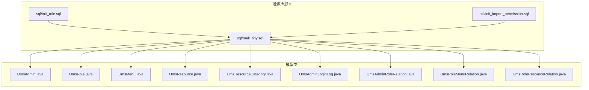
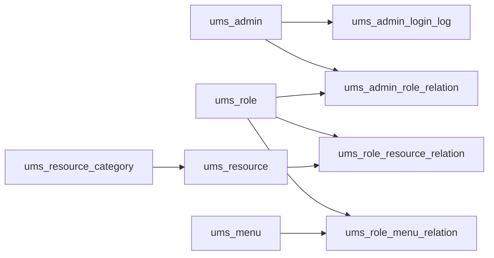

# 表结构设计

<cite>
**本文引用的文件**
- [mall_tiny.sql](file://sql/mall_tiny.sql)
- [init_import_permission.sql](file://sql/init_import_permission.sql)
- [init_role.sql](file://sql/init_role.sql)
- [UmsAdmin.java](file://src/main/java/com/macro/mall/tiny/modules/ums/model/UmsAdmin.java)
- [UmsRole.java](file://src/main/java/com/macro/mall/tiny/modules/ums/model/UmsRole.java)
- [UmsMenu.java](file://src/main/java/com/macro/mall/tiny/modules/ums/model/UmsMenu.java)
- [UmsResource.java](file://src/main/java/com/macro/mall/tiny/modules/ums/model/UmsResource.java)
- [UmsResourceCategory.java](file://src/main/java/com/macro/mall/tiny/modules/ums/model/UmsResourceCategory.java)
- [UmsAdminLoginLog.java](file://src/main/java/com/macro/mall/tiny/modules/ums/model/UmsAdminLoginLog.java)
- [UmsAdminRoleRelation.java](file://src/main/java/com/macro/mall/tiny/modules/ums/model/UmsAdminRoleRelation.java)
- [UmsRoleMenuRelation.java](file://src/main/java/com/macro/mall/tiny/modules/ums/model/UmsRoleMenuRelation.java)
- [UmsRoleResourceRelation.java](file://src/main/java/com/macro/mall/tiny/modules/ums/model/UmsRoleResourceRelation.java)
</cite>

## 目录
1. [简介](#简介)
2. [项目结构](#项目结构)
3. [核心组件](#核心组件)
4. [架构总览](#架构总览)
5. [详细组件分析](#详细组件分析)
6. [依赖分析](#依赖分析)
7. [性能考虑](#性能考虑)
8. [故障排查指南](#故障排查指南)
9. [结论](#结论)
10. [附录](#附录)

## 简介
本文件面向数据库设计师与后端开发者，系统化梳理权限管理子系统（UMS）的数据库表结构设计。围绕用户、角色、菜单、资源、登录日志及其多对多关系表，逐项给出字段定义、数据类型、约束、索引与外键关系的设计考量，并通过ER图与关系图展示实体间关联，帮助读者快速理解并高效落地实现。

## 项目结构
权限管理模块采用“领域驱动”的分层组织方式：
- 数据库脚本位于 sql 目录，包含完整建表与初始化数据
- Java 模型类位于 src/main/java/com/macro/mall/tiny/modules/ums/model，映射各表结构
- 关系表模型对应多对多关系，便于 MyBatis Plus 映射与业务逻辑处理

图表来源
- [mall_tiny.sql](file://sql/mall_tiny.sql)
- [UmsAdmin.java](file://src/main/java/com/macro/mall/tiny/modules/ums/model/UmsAdmin.java)
- [UmsRole.java](file://src/main/java/com/macro/mall/tiny/modules/ums/model/UmsRole.java)
- [UmsMenu.java](file://src/main/java/com/macro/mall/tiny/modules/ums/model/UmsMenu.java)
- [UmsResource.java](file://src/main/java/com/macro/mall/tiny/modules/ums/model/UmsResource.java)
- [UmsResourceCategory.java](file://src/main/java/com/macro/mall/tiny/modules/ums/model/UmsResourceCategory.java)
- [UmsAdminLoginLog.java](file://src/main/java/com/macro/mall/tiny/modules/ums/model/UmsAdminLoginLog.java)
- [UmsAdminRoleRelation.java](file://src/main/java/com/macro/mall/tiny/modules/ums/model/UmsAdminRoleRelation.java)
- [UmsRoleMenuRelation.java](file://src/main/java/com/macro/mall/tiny/modules/ums/model/UmsRoleMenuRelation.java)
- [UmsRoleResourceRelation.java](file://src/main/java/com/macro/mall/tiny/modules/ums/model/UmsRoleResourceRelation.java)

章节来源
- [mall_tiny.sql](file://sql/mall_tiny.sql)
- [UmsAdmin.java](file://src/main/java/com/macro/mall/tiny/modules/ums/model/UmsAdmin.java)
- [UmsRole.java](file://src/main/java/com/macro/mall/tiny/modules/ums/model/UmsRole.java)
- [UmsMenu.java](file://src/main/java/com/macro/mall/tiny/modules/ums/model/UmsMenu.java)
- [UmsResource.java](file://src/main/java/com/macro/mall/tiny/modules/ums/model/UmsResource.java)
- [UmsResourceCategory.java](file://src/main/java/com/macro/mall/tiny/modules/ums/model/UmsResourceCategory.java)
- [UmsAdminLoginLog.java](file://src/main/java/com/macro/mall/tiny/modules/ums/model/UmsAdminLoginLog.java)
- [UmsAdminRoleRelation.java](file://src/main/java/com/macro/mall/tiny/modules/ums/model/UmsAdminRoleRelation.java)
- [UmsRoleMenuRelation.java](file://src/main/java/com/macro/mall/tiny/modules/ums/model/UmsRoleMenuRelation.java)
- [UmsRoleResourceRelation.java](file://src/main/java/com/macro/mall/tiny/modules/ums/model/UmsRoleResourceRelation.java)

## 核心组件
本节按表维度逐一解析字段、类型、约束、索引与外键关系，并给出设计要点与取舍。

- 用户表（ums_admin）
  - 字段与类型：自增主键 id，字符串用户名、密码、头像、邮箱、昵称、备注、创建时间、最后登录时间、状态
  - 约束：主键 id；状态默认值为启用
  - 索引：无显式索引（建议在 username 建唯一索引以支持登录查询）
  - 外键：无
  - 设计要点：密码使用安全散列存储；状态位便于快速启用/禁用；登录时间用于审计

- 角色表（ums_role）
  - 字段与类型：自增主键 id，名称、描述、后台用户数量统计、创建时间、启用状态、排序
  - 约束：主键 id；状态默认启用
  - 索引：无显式索引
  - 外键：无
  - 设计要点：admin_count 为冗余统计字段，便于前端展示；sort 支持角色排序

- 菜单表（ums_menu）
  - 字段与类型：自增主键 id，父级 ID、创建时间、菜单名称、级数、排序、前端名称、前端图标、前端隐藏
  - 约束：主键 id；hidden 用于前端控制显示
  - 索引：无显式索引
  - 外键：无
  - 设计要点：父子关系通过 parent_id 实现树形结构；level/sort 支持层级与排序

- 资源表（ums_resource）
  - 字段与类型：自增主键 id，创建时间、资源名称、资源 URL、描述、资源分类 ID
  - 约束：主键 id
  - 索引：无显式索引
  - 外键：无
  - 设计要点：URL 作为鉴权匹配的关键字段；categoryId 关联资源分类

- 资源分类表（ums_resource_category）
  - 字段与类型：自增主键 id，创建时间、分类名称、排序
  - 约束：主键 id
  - 索引：无显式索引
  - 外键：无
  - 设计要点：模块化分类，便于资源归类与权限治理

- 登录日志表（ums_admin_login_log）
  - 字段与类型：自增主键 id，用户 ID、创建时间、IP、地址、User-Agent
  - 约束：主键 id
  - 索引：无显式索引
  - 外键：无
  - 设计要点：记录登录行为，支持安全审计与风控

- 用户-角色关系表（ums_admin_role_relation）
  - 字段与类型：自增主键 id，用户 ID、角色 ID
  - 约束：主键 id
  - 索引：无显式索引
  - 外键：无
  - 设计要点：多对多关系，支持用户拥有多个角色

- 角色-菜单关系表（ums_role_menu_relation）
  - 字段与类型：自增主键 id，角色 ID、菜单 ID
  - 约束：主键 id
  - 索引：无显式索引
  - 外键：无
  - 设计要点：多对多关系，支撑菜单授权

- 角色-资源关系表（ums_role_resource_relation）
  - 字段与类型：自增主键 id，角色 ID、资源 ID
  - 约束：主键 id
  - 索引：无显式索引
  - 外键：无
  - 设计要点：多对多关系，支撑资源授权（接口/页面）

章节来源
- [mall_tiny.sql](file://sql/mall_tiny.sql)
- [UmsAdmin.java](file://src/main/java/com/macro/mall/tiny/modules/ums/model/UmsAdmin.java)
- [UmsRole.java](file://src/main/java/com/macro/mall/tiny/modules/ums/model/UmsRole.java)
- [UmsMenu.java](file://src/main/java/com/macro/mall/tiny/modules/ums/model/UmsMenu.java)
- [UmsResource.java](file://src/main/java/com/macro/mall/tiny/modules/ums/model/UmsResource.java)
- [UmsResourceCategory.java](file://src/main/java/com/macro/mall/tiny/modules/ums/model/UmsResourceCategory.java)
- [UmsAdminLoginLog.java](file://src/main/java/com/macro/mall/tiny/modules/ums/model/UmsAdminLoginLog.java)
- [UmsAdminRoleRelation.java](file://src/main/java/com/macro/mall/tiny/modules/ums/model/UmsAdminRoleRelation.java)
- [UmsRoleMenuRelation.java](file://src/main/java/com/macro/mall/tiny/modules/ums/model/UmsRoleMenuRelation.java)
- [UmsRoleResourceRelation.java](file://src/main/java/com/macro/mall/tiny/modules/ums/model/UmsRoleResourceRelation.java)

## 架构总览
下图展示权限系统的核心实体与关系，体现“用户-角色-菜单/资源”的授权链路。

```mermaid
erDiagram
UMS_ADMIN {
bigint id PK
varchar username
varchar password
varchar icon
varchar email
varchar nick_name
varchar note
datetime create_time
datetime login_time
int status
}
UMS_ROLE {
bigint id PK
varchar name
varchar description
int admin_count
datetime create_time
int status
int sort
}
UMS_MENU {
bigint id PK
bigint parent_id
datetime create_time
varchar title
int level
int sort
varchar name
varchar icon
int hidden
}
UMS_RESOURCE {
bigint id PK
datetime create_time
varchar name
varchar url
varchar description
bigint category_id
}
UMS_RESOURCE_CATEGORY {
bigint id PK
datetime create_time
varchar name
int sort
}
UMS_ADMIN_LOGIN_LOG {
bigint id PK
bigint admin_id
datetime create_time
varchar ip
varchar address
varchar user_agent
}
UMS_ADMIN_ROLE_RELATION {
bigint id PK
bigint admin_id
bigint role_id
}
UMS_ROLE_MENU_RELATION {
bigint id PK
bigint role_id
bigint menu_id
}
UMS_ROLE_RESOURCE_RELATION {
bigint id PK
bigint role_id
bigint resource_id
}
UMS_ADMIN ||--o{ UMS_ADMIN_ROLE_RELATION : "拥有"
UMS_ROLE ||--o{ UMS_ADMIN_ROLE_RELATION : "被拥有"
UMS_ROLE ||--o{ UMS_ROLE_MENU_RELATION : "授权菜单"
UMS_MENU ||--o{ UMS_ROLE_MENU_RELATION : "被授权"
UMS_ROLE ||--o{ UMS_ROLE_RESOURCE_RELATION : "授权资源"
UMS_RESOURCE ||--o{ UMS_ROLE_RESOURCE_RELATION : "被授权"
UMS_RESOURCE_CATEGORY ||--o{ UMS_RESOURCE : "分类"
UMS_ADMIN ||--o{ UMS_ADMIN_LOGIN_LOG : "登录"
```

图表来源
- [mall_tiny.sql](file://sql/mall_tiny.sql)

## 详细组件分析

### 用户表（ums_admin）
- 字段与类型
  - id：自增主键
  - username/password/icon/email/nick_name/note：字符串，长度适配业务需求
  - create_time/login_time：时间戳，记录创建与最后登录
  - status：启用状态（0/1）
- 约束与索引
  - 主键 id
  - 建议在 username 上建立唯一索引以支持登录查询
- 外键
  - 无
- 设计考量
  - 密码采用安全散列存储；状态位便于快速启用/禁用；登录时间用于审计与风控

章节来源
- [mall_tiny.sql](file://sql/mall_tiny.sql)
- [UmsAdmin.java](file://src/main/java/com/macro/mall/tiny/modules/ums/model/UmsAdmin.java)

### 角色表（ums_role）
- 字段与类型
  - id：自增主键
  - name/description：角色标识与描述
  - admin_count：冗余统计字段
  - create_time/status/sort：创建时间、启用状态、排序
- 约束与索引
  - 主键 id
  - 建议在 name 上建立唯一索引以保证角色名唯一性
- 外键
  - 无
- 设计考量
  - admin_count 便于前端展示；sort 支持角色排序；status 控制启用状态

章节来源
- [mall_tiny.sql](file://sql/mall_tiny.sql)
- [UmsRole.java](file://src/main/java/com/macro/mall/tiny/modules/ums/model/UmsRole.java)

### 菜单表（ums_menu）
- 字段与类型
  - id：自增主键
  - parent_id：父级菜单 ID，支持树形结构
  - create_time/title/level/sort/name/icon/hidden：菜单元数据
- 约束与索引
  - 主键 id
  - 建议在 parent_id 上建立索引以提升树形查询性能
- 外键
  - 无
- 设计考量
  - 通过 parent_id 构建菜单树；level/sort 支持层级与排序；hidden 控制前端显示

章节来源
- [mall_tiny.sql](file://sql/mall_tiny.sql)
- [UmsMenu.java](file://src/main/java/com/macro/mall/tiny/modules/ums/model/UmsMenu.java)

### 资源表（ums_resource）
- 字段与类型
  - id：自增主键
  - create_time/name/url/description/category_id：资源元数据
- 约束与索引
  - 主键 id
  - 建议在 url 上建立唯一索引以避免重复授权
- 外键
  - 无
- 设计考量
  - url 作为鉴权匹配的关键字段；categoryId 关联资源分类

章节来源
- [mall_tiny.sql](file://sql/mall_tiny.sql)
- [UmsResource.java](file://src/main/java/com/macro/mall/tiny/modules/ums/model/UmsResource.java)

### 资源分类表（ums_resource_category）
- 字段与类型
  - id：自增主键
  - create_time/name/sort：分类元数据
- 约束与索引
  - 主键 id
- 外键
  - 无
- 设计考量
  - 模块化分类，便于资源归类与权限治理

章节来源
- [mall_tiny.sql](file://sql/mall_tiny.sql)
- [UmsResourceCategory.java](file://src/main/java/com/macro/mall/tiny/modules/ums/model/UmsResourceCategory.java)

### 登录日志表（ums_admin_login_log）
- 字段与类型
  - id：自增主键
  - admin_id/create_time/ip/address/user_agent：登录行为记录
- 约束与索引
  - 主键 id
  - 建议在 admin_id 和 create_time 上建立复合索引以支持审计查询
- 外键
  - 无
- 设计考量
  - 记录登录行为，支持安全审计与风控

章节来源
- [mall_tiny.sql](file://sql/mall_tiny.sql)
- [UmsAdminLoginLog.java](file://src/main/java/com/macro/mall/tiny/modules/ums/model/UmsAdminLoginLog.java)

### 用户-角色关系表（ums_admin_role_relation）
- 字段与类型
  - id：自增主键
  - admin_id/role_id：用户与角色标识
- 约束与索引
  - 主键 id
  - 建议在 (admin_id, role_id) 上建立唯一索引以避免重复授权
- 外键
  - 无
- 设计考量
  - 多对多关系，支持用户拥有多个角色

章节来源
- [mall_tiny.sql](file://sql/mall_tiny.sql)
- [UmsAdminRoleRelation.java](file://src/main/java/com/macro/mall/tiny/modules/ums/model/UmsAdminRoleRelation.java)

### 角色-菜单关系表（ums_role_menu_relation）
- 字段与类型
  - id：自增主键
  - role_id/menu_id：角色与菜单标识
- 约束与索引
  - 主键 id
  - 建议在 (role_id, menu_id) 上建立唯一索引以避免重复授权
- 外键
  - 无
- 设计考量
  - 多对多关系，支撑菜单授权

章节来源
- [mall_tiny.sql](file://sql/mall_tiny.sql)
- [UmsRoleMenuRelation.java](file://src/main/java/com/macro/mall/tiny/modules/ums/model/UmsRoleMenuRelation.java)

### 角色-资源关系表（ums_role_resource_relation）
- 字段与类型
  - id：自增主键
  - role_id/resource_id：角色与资源标识
- 约束与索引
  - 主键 id
  - 建议在 (role_id, resource_id) 上建立唯一索引以避免重复授权
- 外键
  - 无
- 设计考量
  - 多对多关系，支撑资源授权（接口/页面）

章节来源
- [mall_tiny.sql](file://sql/mall_tiny.sql)
- [UmsRoleResourceRelation.java](file://src/main/java/com/macro/mall/tiny/modules/ums/model/UmsRoleResourceRelation.java)

## 依赖分析
- 实体耦合度
  - 用户与角色：通过关系表解耦，支持多对多
  - 角色与菜单/资源：通过关系表解耦，支持灵活授权
  - 资源与分类：一对一关系，便于资源归类
- 外键缺失与参照完整性
  - 当前脚本未定义外键约束，需在生产环境补充外键以确保参照完整性
  - 建议外键如下：
    - ums_admin_role_relation.admin_id → ums_admin.id
    - ums_admin_role_relation.role_id → ums_role.id
    - ums_role_menu_relation.role_id → ums_role.id
    - ums_role_menu_relation.menu_id → ums_menu.id
    - ums_role_resource_relation.role_id → ums_role.id
    - ums_role_resource_relation.resource_id → ums_resource.id
    - ums_resource.category_id → ums_resource_category.id
    - ums_admin_login_log.admin_id → ums_admin.id
- 循环依赖
  - 无循环依赖，关系均为单向授权

图表来源
- [mall_tiny.sql](file://sql/mall_tiny.sql)

章节来源
- [mall_tiny.sql](file://sql/mall_tiny.sql)

## 性能考虑
- 索引策略
  - 在 ums_admin(username) 建唯一索引，加速登录与去重
  - 在 ums_role(name) 建唯一索引，保证角色名唯一
  - 在 ums_resource(url) 建唯一索引，避免重复授权
  - 在关系表上建立 (role_id, target_id) 的唯一索引，避免重复授权
  - 在 ums_admin_login_log(admin_id, create_time) 建复合索引，支持审计查询
- 查询模式
  - 用户授权树构建：先查角色，再查菜单/资源，最后合并去重
  - 资源授权匹配：基于 url 前缀或通配符匹配（如 /product/**）
- 缓存与降载
  - 将用户的角色、菜单、资源集合缓存于 Redis，降低数据库压力
  - 对高频查询结果进行分页与限流

## 故障排查指南
- 常见问题
  - 登录失败：检查 ums_admin.status 是否启用；确认 username 是否存在且唯一
  - 权限不足：核对 ums_admin_role_relation、ums_role_menu_relation、ums_role_resource_relation 是否正确
  - 资源重复：检查 ums_resource.url 是否重复
  - 审计缺失：确认 ums_admin_login_log 是否正常写入
- 排查步骤
  - 核对用户与角色关系：查询 ums_admin_role_relation
  - 核对角色与菜单/资源关系：查询 ums_role_menu_relation、ums_role_resource_relation
  - 核对资源与分类关系：查询 ums_resource.category_id
  - 核对登录日志：查询 ums_admin_login_log 并校验 admin_id

章节来源
- [mall_tiny.sql](file://sql/mall_tiny.sql)
- [UmsAdminLoginLog.java](file://src/main/java/com/macro/mall/tiny/modules/ums/model/UmsAdminLoginLog.java)

## 结论
该权限系统采用清晰的“用户-角色-菜单/资源”三层授权模型，通过关系表实现灵活的多对多授权。当前脚本未定义外键，建议在生产环境补充外键约束以保障参照完整性；同时完善索引策略与缓存机制，以满足高并发下的性能与一致性要求。

## 附录
- 字段命名规范
  - 表名统一使用小写加下划线（如 ums_admin），字段同理
  - 时间字段统一使用 create_time、update_time（如适用）
  - 状态字段使用 0/1 或枚举值，保持语义明确
- 数据类型选择依据
  - 主键统一使用 bigint 自增
  - 文本字段根据业务长度选择 varchar，必要时建立唯一索引
  - 时间字段使用 datetime
  - 状态位使用 int 或 tinyint
- 初始化脚本参考
  - 角色初始化：[init_role.sql](file://sql/init_role.sql)
  - 导入权限初始化：[init_import_permission.sql](file://sql/init_import_permission.sql)