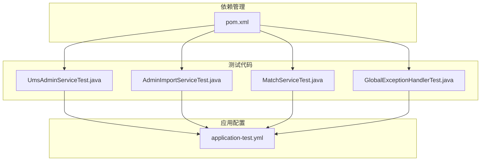
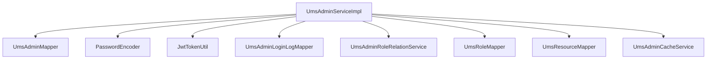
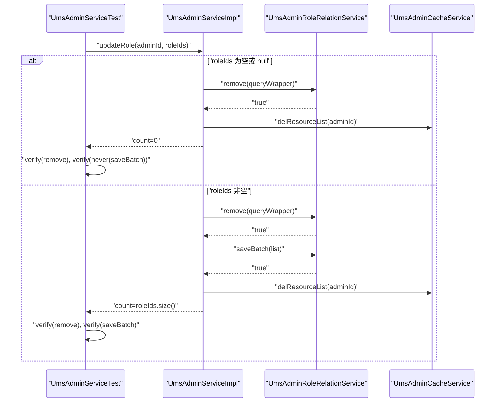
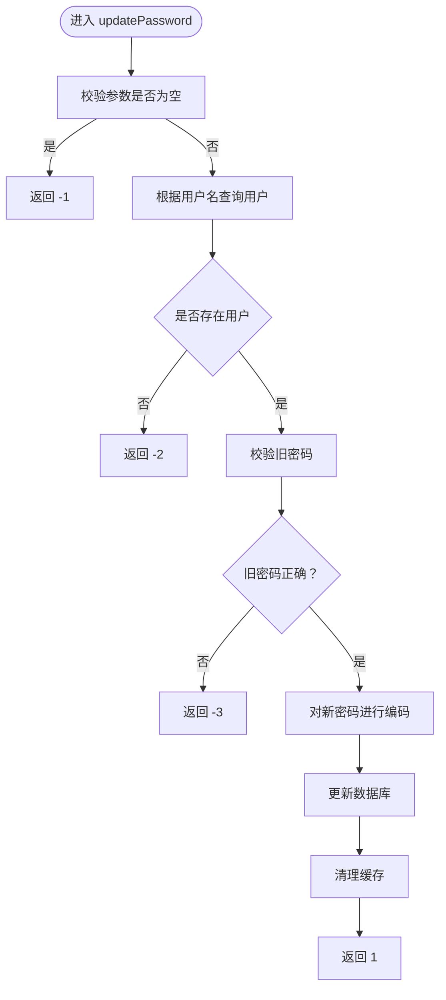
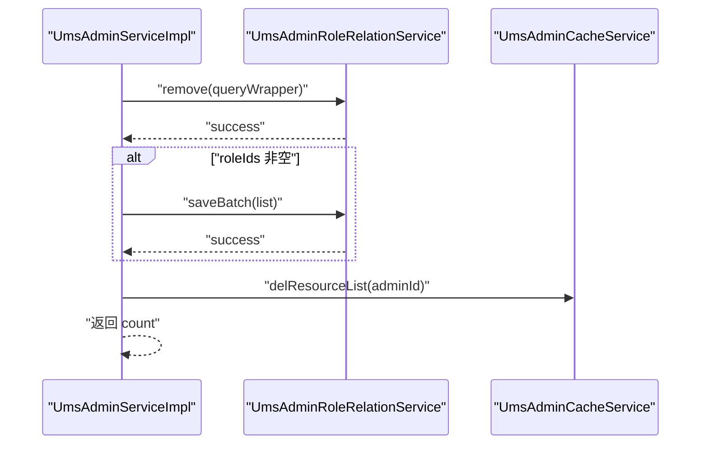
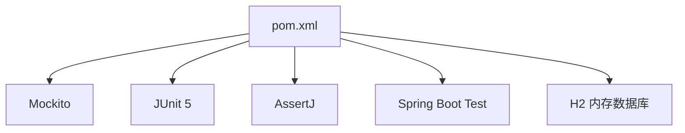

# 单元测试

<cite>
**本文引用的文件**
- [UmsAdminServiceTest.java](file://src/test/java/com/macro/mall/tiny/modules/ums/service/UmsAdminServiceTest.java)
- [UmsAdminService.java](file://src/main/java/com/macro/mall/tiny/modules/ums/service/UmsAdminService.java)
- [UmsAdminServiceImpl.java](file://src/main/java/com/macro/mall/tiny/modules/ums/service/impl/UmsAdminServiceImpl.java)
- [UmsAdminCacheService.java](file://src/main/java/com/macro/mall/tiny/modules/ums/service/UmsAdminCacheService.java)
- [UmsAdminMapper.java](file://src/main/java/com/macro/mall/tiny/modules/ums/mapper/UmsAdminMapper.java)
- [UmsAdminRoleRelationService.java](file://src/main/java/com/macro/mall/tiny/modules/ums/service/UmsAdminRoleRelationService.java)
- [UmsAdminRoleRelationServiceImpl.java](file://src/main/java/com/macro/mall/tiny/modules/ums/service/impl/UmsAdminRoleRelationServiceImpl.java)
- [UpdateAdminPasswordParam.java](file://src/main/java/com/macro/mall/tiny/modules/ums/dto/UpdateAdminPasswordParam.java)
- [Asserts.java](file://src/main/java/com/macro/mall/tiny/common/exception/Asserts.java)
- [AdminImportServiceTest.java](file://src/test/java/com/macro/mall/tiny/modules/ums/service/AdminImportServiceTest.java)
- [application-test.yml](file://src/test/resources/application-test.yml)
- [pom.xml](file://pom.xml)
</cite>

## 目录
1. [引言](#引言)
2. [项目结构](#项目结构)
3. [核心组件](#核心组件)
4. [架构总览](#架构总览)
5. [详细组件分析](#详细组件分析)
6. [依赖分析](#依赖分析)
7. [性能考虑](#性能考虑)
8. [故障排查指南](#故障排查指南)
9. [结论](#结论)
10. [附录](#附录)

## 引言
本文件聚焦于 Mall-Tiny 项目的单元测试，特别是服务层单元测试的编写方法与最佳实践。以 UmsAdminServiceTest 为例，系统讲解如何使用 Mockito 模拟依赖、准备测试数据、设计断言策略，并覆盖边界条件与异常场景。同时结合项目现有测试样例，总结测试隔离、可读性与可维护性的关键原则，并给出测试覆盖率与质量标准建议，帮助开发者编写高质量的单元测试。

## 项目结构
Mall-Tiny 的测试位于 src/test 下，采用与主代码一致的包结构，便于定位与维护。测试主要分为两类：
- 控制器层测试：验证接口行为与响应
- 服务层测试：验证业务逻辑、数据校验与异常处理

图表来源
- [UmsAdminServiceTest.java:1-165](file://src/test/java/com/macro/mall/tiny/modules/ums/service/UmsAdminServiceTest.java#L1-L165)
- [AdminImportServiceTest.java:1-329](file://src/test/java/com/macro/mall/tiny/modules/ums/service/AdminImportServiceTest.java#L1-L329)
- [application-test.yml:1-57](file://src/test/resources/application-test.yml#L1-L57)
- [pom.xml:1-222](file://pom.xml#L1-L222)

章节来源
- [UmsAdminServiceTest.java:1-165](file://src/test/java/com/macro/mall/tiny/modules/ums/service/UmsAdminServiceTest.java#L1-L165)
- [AdminImportServiceTest.java:1-329](file://src/test/java/com/macro/mall/tiny/modules/ums/service/AdminImportServiceTest.java#L1-L329)
- [application-test.yml:1-57](file://src/test/resources/application-test.yml#L1-L57)
- [pom.xml:1-222](file://pom.xml#L1-L222)

## 核心组件
- UmsAdminService：定义管理员相关服务契约，包括登录、注册、分页查询、角色更新、密码修改、资源权限等。
- UmsAdminServiceImpl：具体实现，包含业务逻辑、缓存交互、密码编码、登录日志、事务与异常处理等。
- UmsAdminServiceTest：基于 Mockito 的服务层单元测试，覆盖密码修改与角色更新两大场景。
- 测试辅助：UpdateAdminPasswordParam 作为输入 DTO；Asserts 提供断言与异常抛出；application-test.yml 提供 H2 内存数据库与 Redis 配置；pom.xml 提供测试依赖与插件。

章节来源
- [UmsAdminService.java:1-90](file://src/main/java/com/macro/mall/tiny/modules/ums/service/UmsAdminService.java#L1-L90)
- [UmsAdminServiceImpl.java:1-272](file://src/main/java/com/macro/mall/tiny/modules/ums/service/impl/UmsAdminServiceImpl.java#L1-L272)
- [UmsAdminServiceTest.java:1-165](file://src/test/java/com/macro/mall/tiny/modules/ums/service/UmsAdminServiceTest.java#L1-L165)
- [UpdateAdminPasswordParam.java:1-26](file://src/main/java/com/macro/mall/tiny/modules/ums/dto/UpdateAdminPasswordParam.java#L1-L26)
- [Asserts.java:1-19](file://src/main/java/com/macro/mall/tiny/common/exception/Asserts.java#L1-L19)
- [application-test.yml:1-57](file://src/test/resources/application-test.yml#L1-L57)
- [pom.xml:1-222](file://pom.xml#L1-L222)

## 架构总览
下图展示了 UmsAdminService 的调用链与依赖关系，以及测试中对依赖的 Mock 方式：

图表来源
- [UmsAdminServiceImpl.java:48-272](file://src/main/java/com/macro/mall/tiny/modules/ums/service/impl/UmsAdminServiceImpl.java#L48-L272)
- [UmsAdminMapper.java:1-25](file://src/main/java/com/macro/mall/tiny/modules/ums/mapper/UmsAdminMapper.java#L1-L25)
- [UmsAdminRoleRelationService.java:1-12](file://src/main/java/com/macro/mall/tiny/modules/ums/service/UmsAdminRoleRelationService.java#L1-L12)
- [UmsAdminRoleRelationServiceImpl.java:1-16](file://src/main/java/com/macro/mall/tiny/modules/ums/service/impl/UmsAdminRoleRelationServiceImpl.java#L1-L16)
- [UmsAdminCacheService.java:1-60](file://src/main/java/com/macro/mall/tiny/modules/ums/service/UmsAdminCacheService.java#L1-L60)

## 详细组件分析

### UmsAdminServiceTest：Mock 对象使用与断言策略
- Mock 注入与 Spy/Spy 注入
  - 使用 @Mock 注入多个依赖（如 UmsAdminMapper、PasswordEncoder、JwtTokenUtil、UmsAdminLoginLogMapper、UmsAdminRoleRelationService、UmsRoleMapper、UmsResourceMapper、UmsAdminCacheService）。
  - 使用 @Spy + @InjectMocks 组合，对 UmsAdminServiceImpl 进行部分 Mock，以便在测试中替换特定行为（例如通过 doReturn(cacheService).when(spy).getCacheService()）。
- 测试数据准备
  - 通过构造 DTO 或集合（如 UpdateAdminPasswordParam、List<Long> roleIds）准备输入数据。
  - 使用静态工具类或直接赋值方式构造边界数据（空字符串、空集合、null）。
- 断言策略
  - 使用 AssertJ 的 assertThat 进行返回值断言。
  - 使用 assertThatThrownBy 验证异常抛出。
  - 使用 verify/never 验证依赖方法是否被调用及调用次数。
- 场景覆盖
  - 密码修改：针对用户名/旧密码/新密码为空的边界条件进行断言，确保返回特定错误码。
  - 角色更新：覆盖“先删后增”、“空角色列表仅删除”、“null 角色列表仅删除”的分支，验证依赖调用与返回计数。

图表来源
- [UmsAdminServiceTest.java:124-162](file://src/test/java/com/macro/mall/tiny/modules/ums/service/UmsAdminServiceTest.java#L124-L162)
- [UmsAdminServiceImpl.java:193-213](file://src/main/java/com/macro/mall/tiny/modules/ums/service/impl/UmsAdminServiceImpl.java#L193-L213)

章节来源
- [UmsAdminServiceTest.java:1-165](file://src/test/java/com/macro/mall/tiny/modules/ums/service/UmsAdminServiceTest.java#L1-L165)

### 密码修改流程：边界条件与异常处理
- 输入校验：当用户名/旧密码/新密码任一为空时，直接返回特定错误码，避免后续数据库访问。
- 用户存在性：若未找到用户，返回另一个错误码。
- 旧密码校验：使用密码编码器比对失败则返回错误码。
- 成功场景：对新密码进行编码并更新，清理缓存，返回成功码。

图表来源
- [UmsAdminServiceImpl.java:233-254](file://src/main/java/com/macro/mall/tiny/modules/ums/service/impl/UmsAdminServiceImpl.java#L233-L254)
- [UpdateAdminPasswordParam.java:15-25](file://src/main/java/com/macro/mall/tiny/modules/ums/dto/UpdateAdminPasswordParam.java#L15-L25)

章节来源
- [UmsAdminServiceImpl.java:233-254](file://src/main/java/com/macro/mall/tiny/modules/ums/service/impl/UmsAdminServiceImpl.java#L233-L254)
- [UpdateAdminPasswordParam.java:15-25](file://src/main/java/com/macro/mall/tiny/modules/ums/dto/UpdateAdminPasswordParam.java#L15-L25)

### 角色更新流程：事务语义与缓存一致性
- 先删除旧关系，再批量保存新关系，保证幂等与一致性。
- 清理相关用户资源缓存，确保缓存与数据库一致。
- 返回新增关系数量（空集合时为 0），便于上层统计与日志。

图表来源
- [UmsAdminServiceImpl.java:193-213](file://src/main/java/com/macro/mall/tiny/modules/ums/service/impl/UmsAdminServiceImpl.java#L193-L213)

章节来源
- [UmsAdminServiceImpl.java:193-213](file://src/main/java/com/macro/mall/tiny/modules/ums/service/impl/UmsAdminServiceImpl.java#L193-L213)

### 服务层测试最佳实践
- 测试隔离
  - 使用 @ExtendWith(MockitoExtension.class) 与 @Mock/@Spy/@InjectMocks，确保每个测试独立运行且不依赖外部状态。
  - 使用 doReturn(...).when(spy).method(...) 替换复杂依赖行为（如缓存服务）。
- 可读性
  - 使用 @Nested 分组测试用例，配合 @DisplayName 提升可读性。
  - 将测试数据构造封装为私有方法，减少重复。
- 断言策略
  - 对返回值使用 assertThat；对异常使用 assertThatThrownBy；对依赖调用使用 verify/never。
- 边界与异常
  - 明确输入边界（空字符串、null、空集合）与异常路径（用户不存在、旧密码错误、会话不存在等）。
  - 结合 Asserts.fail 抛出自定义异常，验证异常类型与消息。

章节来源
- [UmsAdminServiceTest.java:1-165](file://src/test/java/com/macro/mall/tiny/modules/ums/service/UmsAdminServiceTest.java#L1-L165)
- [AdminImportServiceTest.java:1-329](file://src/test/java/com/macro/mall/tiny/modules/ums/service/AdminImportServiceTest.java#L1-L329)
- [Asserts.java:10-18](file://src/main/java/com/macro/mall/tiny/common/exception/Asserts.java#L10-L18)

## 依赖分析
- 测试依赖
  - JUnit 5 + Mockito + AssertJ：提供测试框架、Mock 能力与断言库。
  - Spring Boot Test：提供测试上下文与自动配置能力。
  - H2 内存数据库：用于测试环境的数据持久化模拟。
- 运行时依赖
  - MyBatis-Plus、Spring Security、Redis、JWT 等在测试中通过 Mock 或内存实现替代，避免真实外部依赖。

图表来源
- [pom.xml:40-57](file://pom.xml#L40-L57)
- [application-test.yml:6-9](file://src/test/resources/application-test.yml#L6-L9)

章节来源
- [pom.xml:1-222](file://pom.xml#L1-L222)
- [application-test.yml:1-57](file://src/test/resources/application-test.yml#L1-L57)

## 性能考虑
- 单元测试应保持快速与稳定，避免真实数据库与网络 IO。
- 使用内存数据库与 Mock 服务，减少测试执行时间。
- 对热点路径（如密码编码、登录日志）进行轻量断言，避免过度验证导致脆弱性。

## 故障排查指南
- 常见问题
  - 依赖未注入：确认 @Mock/@Spy/@InjectMocks 使用正确，必要时使用 doReturn 替换复杂依赖。
  - 缓存未清理：角色更新后需清理资源缓存，否则可能影响后续查询结果。
  - 参数校验失败：确保 DTO 字段非空，避免返回错误码。
- 定位手段
  - 使用 verify/never 检查依赖调用是否发生。
  - 使用 assertThatThrownBy 验证异常类型与消息。
  - 在 application-test.yml 中启用内存数据库与最小化配置，便于复现问题。

章节来源
- [UmsAdminServiceTest.java:124-162](file://src/test/java/com/macro/mall/tiny/modules/ums/service/UmsAdminServiceTest.java#L124-L162)
- [application-test.yml:1-57](file://src/test/resources/application-test.yml#L1-L57)

## 结论
通过对 UmsAdminService 的单元测试实践，可以总结出服务层测试的关键要点：合理使用 Mockito 进行依赖隔离、精心设计边界与异常场景、采用清晰的断言策略与可读性命名。结合项目现有的测试样例与配置，开发者可以在不引入真实外部依赖的前提下，高效地验证业务逻辑、数据校验与异常处理，从而提升代码质量与交付效率。

## 附录
- 测试覆盖率建议
  - 服务层：目标达到 80%+ 行覆盖率与 70%+ 分支覆盖率。
  - 关键路径：登录、注册、密码修改、角色更新、资源权限加载等。
- 测试质量标准
  - 每个测试职责单一，命名明确表达意图。
  - 使用 @Nested 与 @DisplayName 提升可读性。
  - 避免在测试中混入业务细节，保持测试与实现解耦。
  - 对异常路径与边界条件进行充分覆盖。