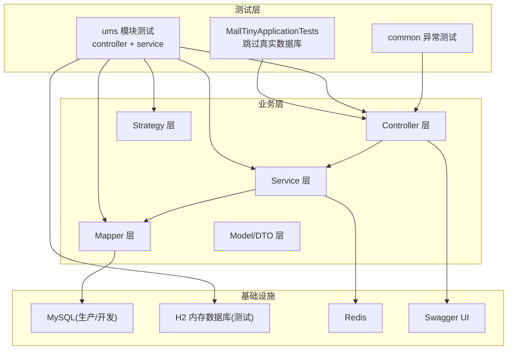
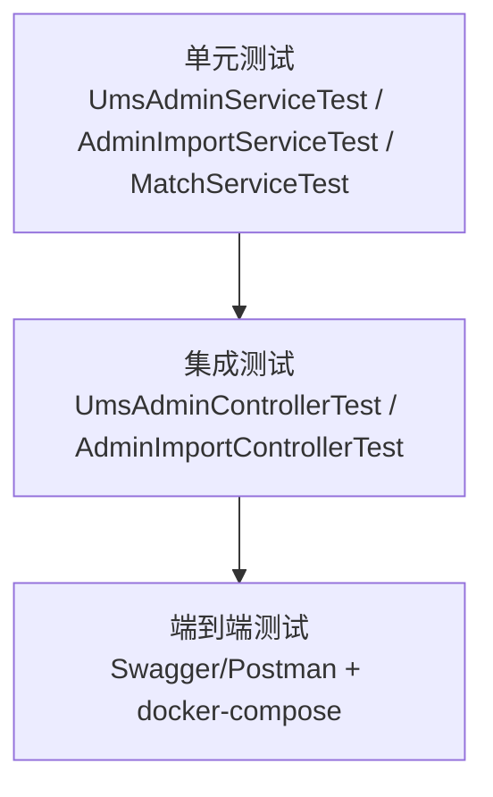
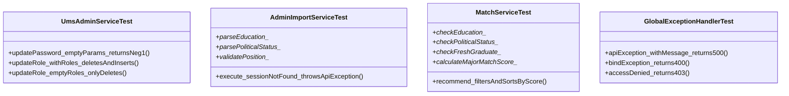
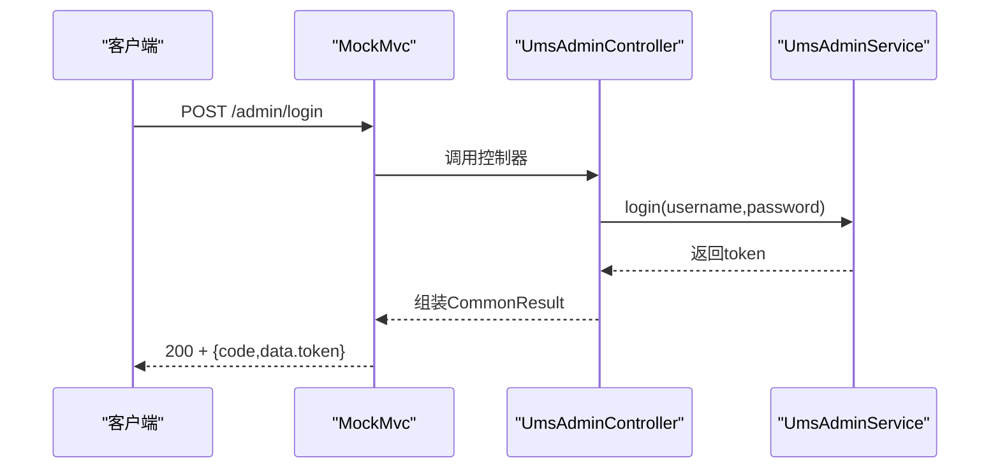
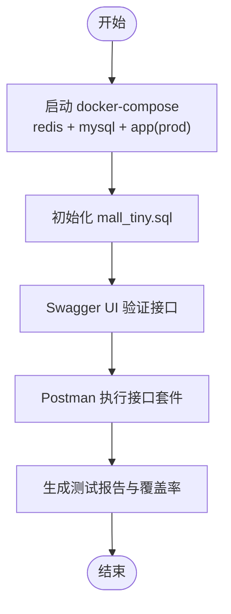
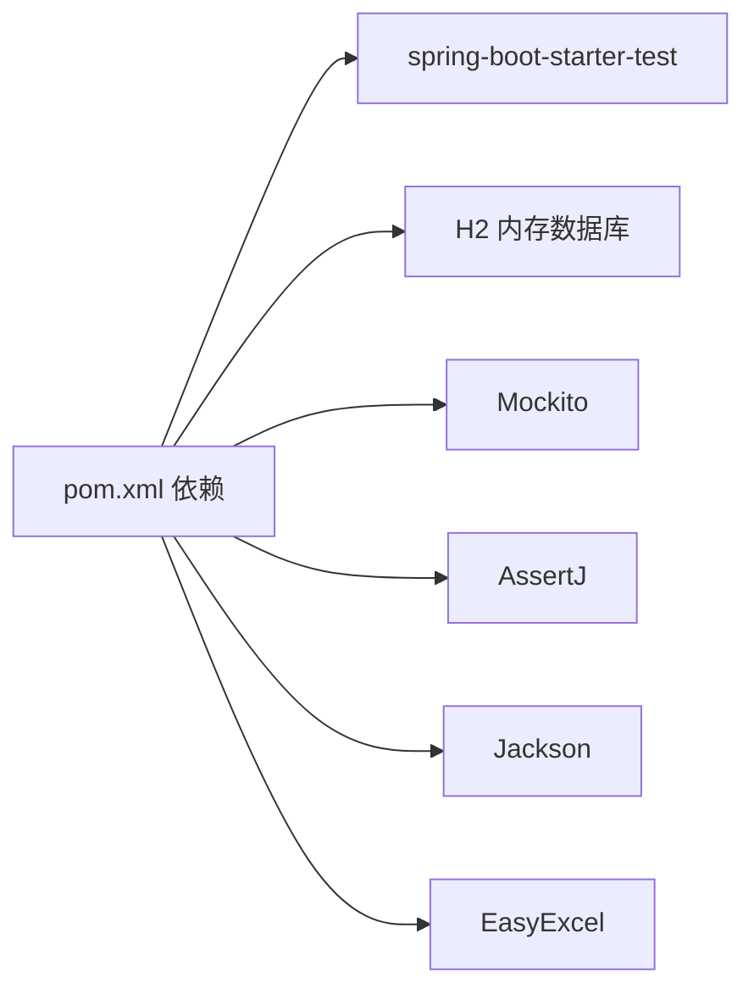

# 测试策略

<cite>
**本文引用的文件**   
- [README.md](file://README.md)
- [pom.xml](file://pom.xml)
- [application.yml](file://src/main/resources/application.yml)
- [application-dev.yml](file://src/main/resources/application-dev.yml)
- [application-prod.yml](file://src/main/resources/application-prod.yml)
- [application-test.yml](file://src/test/resources/application-test.yml)
- [docker-compose.yml](file://docker-compose.yml)
- [mall_tiny.sql](file://sql/mall_tiny.sql)
- [MallTinyApplicationTests.java](file://src/test/java/com/macros/mall/tiny/MallTinyApplicationTests.java)
- [UmsAdminControllerTest.java](file://src/test/java/com/macros/mall/tiny/modules/ums/controller/UmsAdminControllerTest.java)
- [AdminImportControllerTest.java](file://src/test/java/com/macros/mall/tiny/modules/ums/controller/AdminImportControllerTest.java)
- [UmsAdminServiceTest.java](file://src/test/java/com/macros/mall/tiny/modules/ums/service/UmsAdminServiceTest.java)
- [AdminImportServiceTest.java](file://src/test/java/com/macros/mall/tiny/modules/ums/service/AdminImportServiceTest.java)
- [MatchServiceTest.java](file://src/test/java/com/macros/mall/tiny/modules/ums/service/MatchServiceTest.java)
- [GlobalExceptionHandlerTest.java](file://src/test/java/com/macros/mall/tiny/common/exception/GlobalExceptionHandlerTest.java)
</cite>

## 目录
1. [简介](#简介)
2. [项目结构](#项目结构)
3. [核心组件](#核心组件)
4. [架构总览](#架构总览)
5. [详细组件分析](#详细组件分析)
6. [依赖分析](#依赖分析)
7. [性能考虑](#性能考虑)
8. [故障排查指南](#故障排查指南)
9. [结论](#结论)
10. [附录](#附录)

## 简介
本测试策略文档面向测试工程师与开发者，围绕 Mall-Tiny 项目制定系统化的测试金字塔方案，覆盖单元测试、集成测试与端到端测试，并配套测试环境配置、测试数据库搭建、测试数据管理、测试自动化（CI）、测试报告与覆盖率统计、性能与压力测试指导，帮助团队建立稳定高效的测试体系。

## 项目结构
Mall-Tiny 采用 Spring Boot + MyBatis-Plus 架构，权限模块（ums）为主要业务域，包含 Controller、Service、Mapper、Model、DTO、Strategy 等层次。测试位于 src/test 下，按模块与层次划分，配合独立的测试配置文件与 H2 内存数据库进行隔离测试。

图示来源
- [pom.xml:146-151](file://pom.xml#L146-L151)
- [application-test.yml:6-10](file://src/test/resources/application-test.yml#L6-L10)
- [application.yml:4-7](file://src/main/resources/application.yml#L4-L7)

章节来源
- [README.md:55-118](file://README.md#L55-L118)
- [pom.xml:146-151](file://pom.xml#L146-L151)
- [application-test.yml:6-10](file://src/test/resources/application-test.yml#L6-L10)
- [application.yml:4-7](file://src/main/resources/application.yml#L4-L7)

## 核心组件
- 控制器层（Controller）：负责 HTTP 接口与参数校验，典型如管理员登录、注册、密码修改、导入上传与执行等。
- 服务层（Service）：封装业务逻辑，如管理员服务、导入服务、匹配服务等，包含复杂的数据清洗、规则校验与评分。
- 持久层（Mapper/MyBatis-Plus）：基于注解与 XML 的 SQL 映射，支持分页、条件查询与多表关联。
- 异常处理（GlobalExceptionHandler）：统一封装业务异常、参数校验异常、HTTP 解析异常、权限异常等。
- 安全与配置：Spring Security、JWT、Redis 缓存、Swagger 文档、跨域配置等。

章节来源
- [UmsAdminControllerTest.java:33-36](file://src/test/java/com/macros/mall/tiny/modules/ums/controller/UmsAdminControllerTest.java#L33-L36)
- [UmsAdminServiceTest.java:41-71](file://src/test/java/com/macros/mall/tiny/modules/ums/service/UmsAdminServiceTest.java#L41-L71)
- [AdminImportServiceTest.java:22-33](file://src/test/java/com/macros/mall/tiny/modules/ums/service/AdminImportServiceTest.java#L22-L33)
- [MatchServiceTest.java:28-36](file://src/test/java/com/macros/mall/tiny/modules/ums/service/MatchServiceTest.java#L28-L36)
- [GlobalExceptionHandlerTest.java:22-25](file://src/test/java/com/macros/mall/tiny/common/exception/GlobalExceptionHandlerTest.java#L22-L25)

## 架构总览
测试金字塔在 Mall-Tiny 中体现为：
- 单元测试：Service 与工具方法，使用 Mockito 注入/桩替依赖，断言业务逻辑与边界条件。
- 集成测试：Controller + Service + 数据库（H2 内存库），验证接口行为与数据一致性。
- 端到端测试：基于真实容器（MySQL + Redis）与 Swagger/Postman，验证完整业务链路。

图示来源
- [UmsAdminServiceTest.java:41-71](file://src/test/java/com/macros/mall/tiny/modules/ums/service/UmsAdminServiceTest.java#L41-L71)
- [AdminImportServiceTest.java:22-33](file://src/test/java/com/macros/mall/tiny/modules/ums/service/AdminImportServiceTest.java#L22-L33)
- [MatchServiceTest.java:28-36](file://src/test/java/com/macros/mall/tiny/modules/ums/service/MatchServiceTest.java#L28-L36)
- [UmsAdminControllerTest.java:33-36](file://src/test/java/com/macros/mall/tiny/modules/ums/controller/UmsAdminControllerTest.java#L33-L36)
- [AdminImportControllerTest.java:37-40](file://src/test/java/com/macros/mall/tiny/modules/ums/controller/AdminImportControllerTest.java#L37-L40)

## 详细组件分析

### 单元测试策略
- Mock 框架：使用 Mockito 注解（@Mock、@Spy、@InjectMocks、@ExtendWith(MockitoExtension.class)）隔离外部依赖。
- 断言策略：使用 AssertJ 提供更丰富的断言能力；对异常场景使用 Assertions.assertThrows 或 assertThatThrownBy。
- 测试隔离：每个测试方法独立，避免共享状态；必要时使用 @BeforeEach 初始化 DTO/Model。
- 边界与分支：覆盖正常路径、空值、非法输入、异常抛出等分支。
- 反射调用：对私有方法或静态工具方法使用 ReflectionTestUtils.invokeMethod 进行测试。

图示来源
- [UmsAdminServiceTest.java:41-163](file://src/test/java/com/macros/mall/tiny/modules/ums/service/UmsAdminServiceTest.java#L41-L163)
- [AdminImportServiceTest.java:22-328](file://src/test/java/com/macros/mall/tiny/modules/ums/service/AdminImportServiceTest.java#L22-L328)
- [MatchServiceTest.java:28-367](file://src/test/java/com/macros/mall/tiny/modules/ums/service/MatchServiceTest.java#L28-L367)
- [GlobalExceptionHandlerTest.java:22-122](file://src/test/java/com/macros/mall/tiny/common/exception/GlobalExceptionHandlerTest.java#L22-L122)

章节来源
- [UmsAdminServiceTest.java:41-163](file://src/test/java/com/macros/mall/tiny/modules/ums/service/UmsAdminServiceTest.java#L41-L163)
- [AdminImportServiceTest.java:22-328](file://src/test/java/com/macros/mall/tiny/modules/ums/service/AdminImportServiceTest.java#L22-L328)
- [MatchServiceTest.java:28-367](file://src/test/java/com/macros/mall/tiny/modules/ums/service/MatchServiceTest.java#L28-L367)
- [GlobalExceptionHandlerTest.java:22-122](file://src/test/java/com/macros/mall/tiny/common/exception/GlobalExceptionHandlerTest.java#L22-L122)

### 集成测试策略（基于 WebMvcTest）
- 目标：验证 Controller 行为与 JSON 响应，不启动完整应用上下文，减少依赖。
- Mock：使用 @WebMvcTest 与 @MockBean 注入 Service，模拟外部依赖。
- 场景：登录/注册/修改密码、Excel 上传/执行导入、参数校验与异常响应。
- 断言：基于 MockMvc 的 status() 与 jsonPath() 判断 HTTP 状态与响应体字段。

图示来源
- [UmsAdminControllerTest.java:50-71](file://src/test/java/com/macros/mall/tiny/modules/ums/controller/UmsAdminControllerTest.java#L50-L71)
- [UmsAdminControllerTest.java:44-48](file://src/test/java/com/macros/mall/tiny/modules/ums/controller/UmsAdminControllerTest.java#L44-L48)

章节来源
- [UmsAdminControllerTest.java:33-182](file://src/test/java/com/macros/mall/tiny/modules/ums/controller/UmsAdminControllerTest.java#L33-L182)
- [AdminImportControllerTest.java:37-154](file://src/test/java/com/macros/mall/tiny/modules/ums/controller/AdminImportControllerTest.java#L37-L154)

### 端到端测试设计
- 环境：使用 docker-compose 启动 MySQL 与 Redis，应用以 prod 配置运行。
- 覆盖：Swagger UI 手工验证核心接口；结合 Postman 执行导入、鉴权、权限控制等场景。
- 数据：使用 mall_tiny.sql 初始化数据库，确保测试数据一致性。
- 自动化：建议在 CI 中拉起容器，执行接口测试套件，产出测试报告与覆盖率。

图示来源
- [docker-compose.yml:1-26](file://docker-compose.yml#L1-L26)
- [mall_tiny.sql:18-34](file://sql/mall_tiny.sql#L18-L34)

章节来源
- [docker-compose.yml:1-26](file://docker-compose.yml#L1-L26)
- [mall_tiny.sql:18-34](file://sql/mall_tiny.sql#L18-L34)

### 测试数据与环境配置
- 测试数据库：H2 内存库，配置在 application-test.yml，使用 MySQL 兼容模式，避免迁移成本。
- 开发/生产数据库：application-dev.yml 与 application-prod.yml 提供不同环境配置。
- Redis：测试与生产分别配置，注意命名空间区分（如 test 与 prod）。
- JWT：测试配置中提供固定密钥与过期时间，便于接口鉴权测试。

章节来源
- [application-test.yml:6-30](file://src/test/resources/application-test.yml#L6-L30)
- [application-dev.yml:1-16](file://src/main/resources/application-dev.yml#L1-L16)
- [application-prod.yml:1-18](file://src/main/resources/application-prod.yml#L1-L18)
- [application.yml:24-28](file://src/main/resources/application.yml#L24-L28)

### 异常处理测试
- 覆盖常见异常：业务异常、参数绑定异常、JSON 解析异常、缺少参数、方法不支持、权限拒绝等。
- 断言要点：状态码、错误码、消息内容（不泄露内部细节）。

章节来源
- [GlobalExceptionHandlerTest.java:22-122](file://src/test/java/com/macros/mall/tiny/common/exception/GlobalExceptionHandlerTest.java#L22-L122)

## 依赖分析
- Maven 依赖：spring-boot-starter-test、H2 内存数据库、Mockito、AssertJ、Jackson、EasyExcel 等。
- 测试隔离：H2 与 @WebMvcTest 降低对真实数据库与外部服务的依赖。
- 外部服务：Redis 在测试与生产中均需可用，注意端口与连接参数。

图示来源
- [pom.xml:50-52](file://pom.xml#L50-L52)
- [pom.xml:146-151](file://pom.xml#L146-L151)

章节来源
- [pom.xml:50-52](file://pom.xml#L50-L52)
- [pom.xml:146-151](file://pom.xml#L146-L151)

## 性能考虑
- 单元测试：保持轻量，避免 IO 与外部依赖，关注算法复杂度与边界条件。
- 集成测试：使用 H2 内存库与最小化数据集，缩短测试时长。
- 端到端测试：在 CI 中并行执行，拆分套件，避免长时间占用资源。
- 压力测试：建议使用 JMeter 或 Gatling，针对登录、导入、匹配等热点接口设计场景，关注吞吐、响应时间与错误率。

## 故障排查指南
- 单元测试失败：检查 @Mock/@Spy 注入是否正确，verify 是否覆盖预期调用；对私有方法使用反射调用。
- 集成测试失败：确认 @WebMvcTest 范围内已注入所需 @MockBean；核对 JSON 请求体与字段映射。
- 端到端测试失败：检查 docker-compose 服务是否就绪、数据库初始化是否完成、Redis 连接参数是否正确。
- 异常处理：确保全局异常处理器对各类异常返回一致的错误码与消息格式。

章节来源
- [MallTinyApplicationTests.java:7-8](file://src/test/java/com/macros/mall/tiny/MallTinyApplicationTests.java#L7-L8)
- [docker-compose.yml:1-26](file://docker-compose.yml#L1-L26)

## 结论
通过“单元测试打地基、集成测试稳流程、端到端测试验闭环”的测试金字塔，结合 H2 内存数据库与容器化环境，Mall-Tiny 能够在开发与 CI 中高效执行测试，保障核心业务（登录、导入、匹配、权限）的稳定性与可维护性。建议持续完善测试覆盖率与性能指标，形成可追溯的质量闭环。

## 附录
- 测试执行建议
  - 本地：mvn test 执行全部单元与集成测试。
  - CI：使用 docker-compose 启动环境，执行端到端测试套件，生成报告与覆盖率。
- 测试报告与覆盖率
  - 建议引入 JaCoCo 插件生成覆盖率报告，结合 SonarQube 或 GitHub Actions Artifacts 归档。
- 数据库初始化
  - 使用 mall_tiny.sql 初始化测试与生产数据库，确保表结构与初始数据一致。

章节来源
- [README.md:282-296](file://README.md#L282-L296)
- [mall_tiny.sql:18-34](file://sql/mall_tiny.sql#L18-L34)