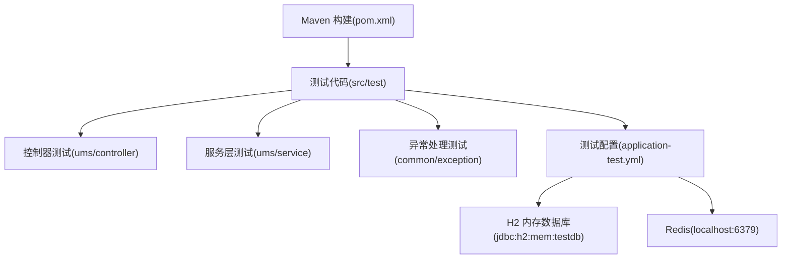
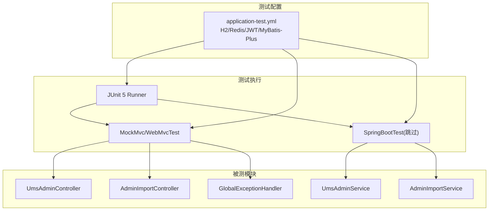
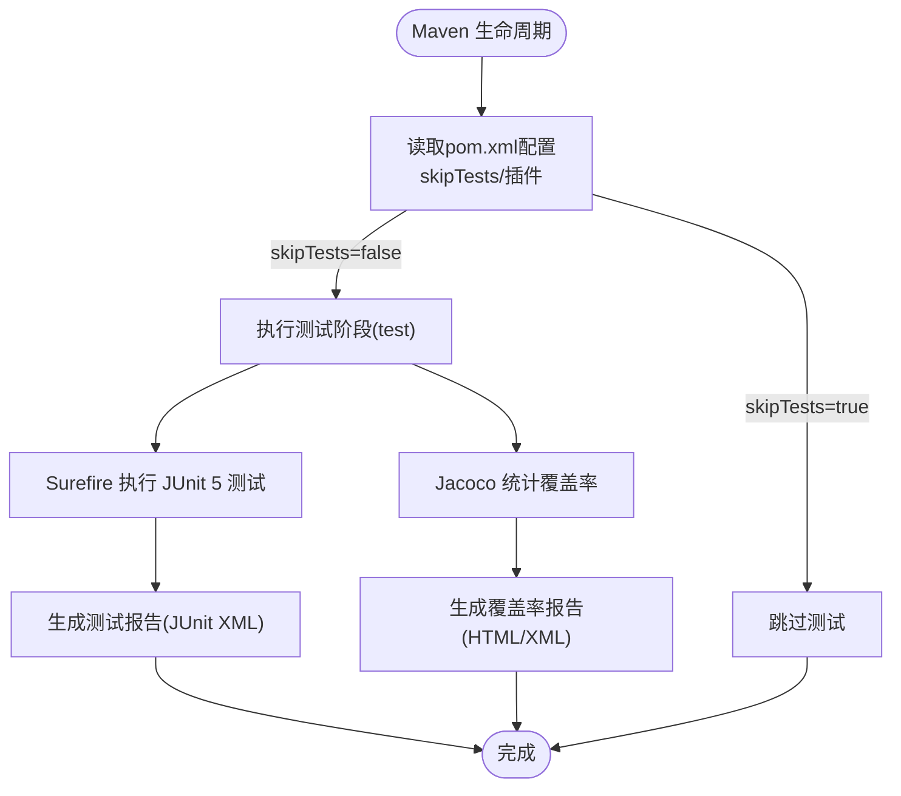
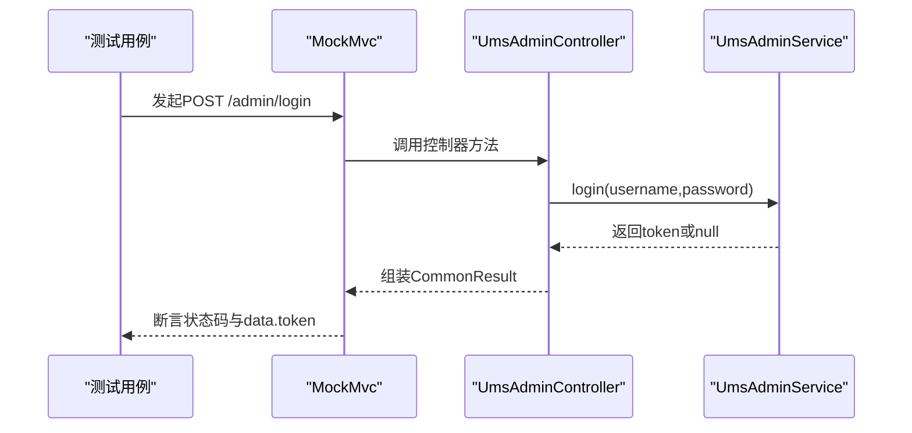
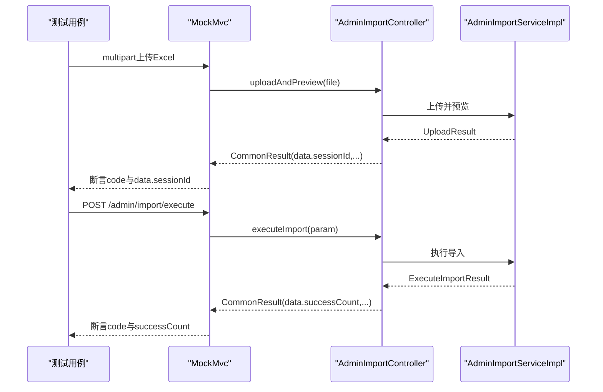
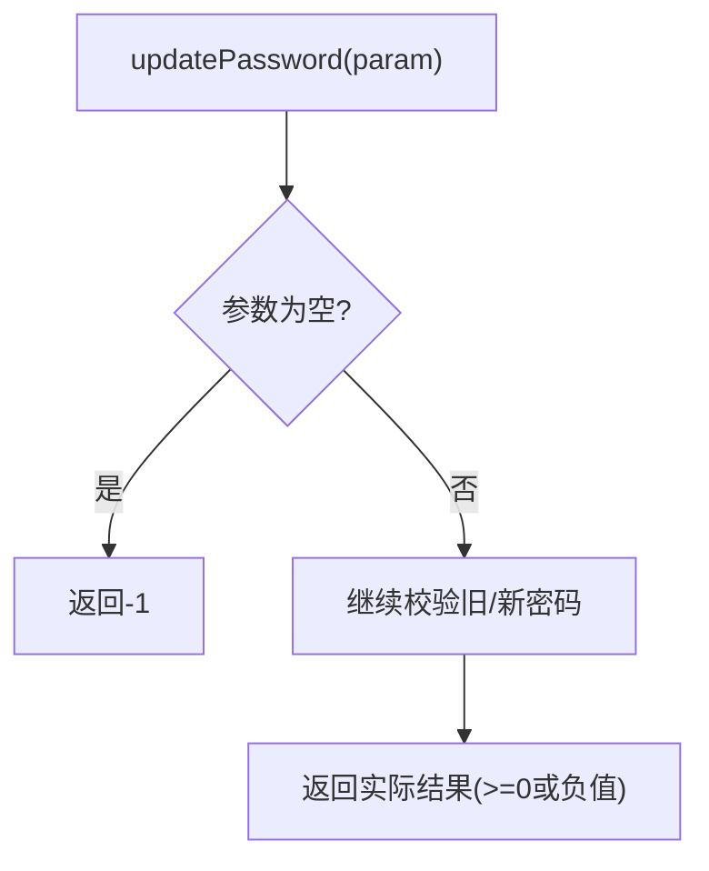
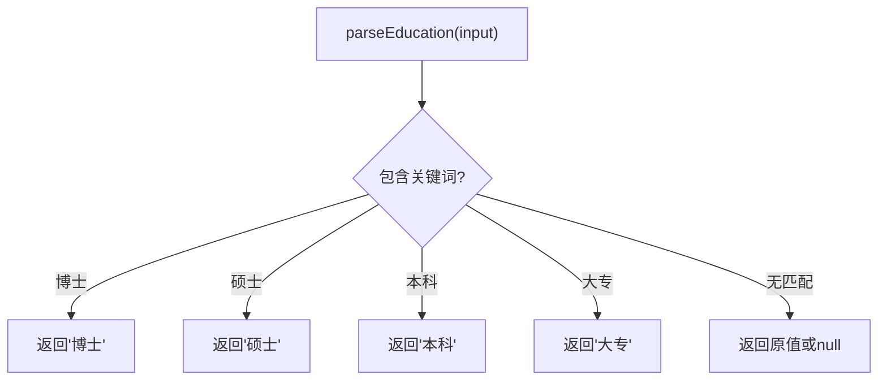
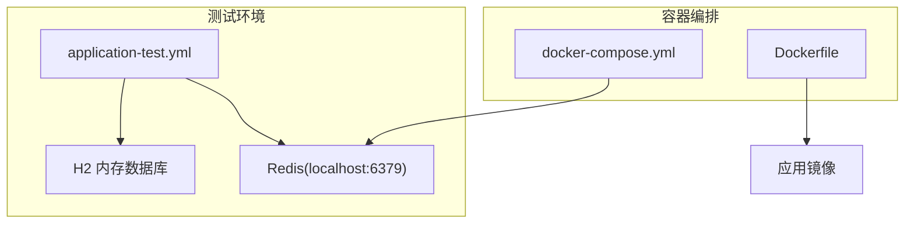
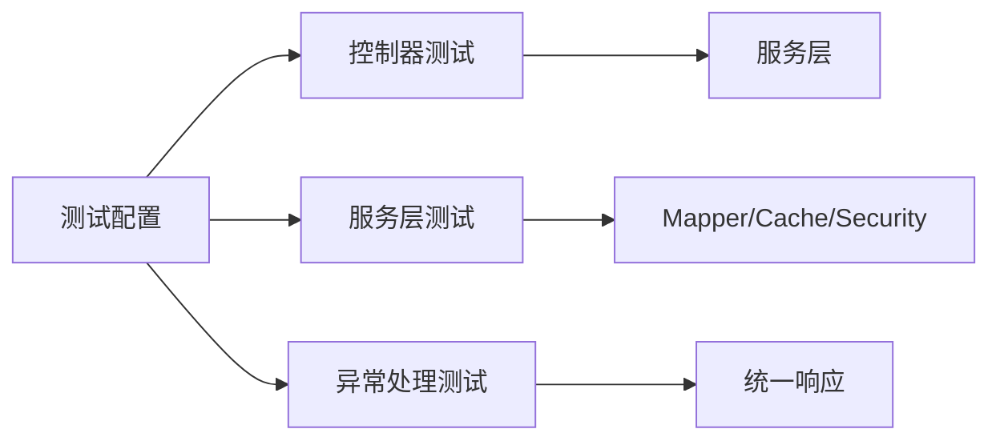

# 测试自动化

<cite>
**本文引用的文件**
- [pom.xml](file://pom.xml)
- [README.md](file://README.md)
- [MallTinyApplicationTests.java](file://src/test/java/com/macro/mall/tiny/MallTinyApplicationTests.java)
- [application-test.yml](file://src/test/resources/application-test.yml)
- [UmsAdminControllerTest.java](file://src/test/java/com/macro/mall/tiny/modules/ums/controller/UmsAdminControllerTest.java)
- [AdminImportControllerTest.java](file://src/test/java/com/macro/mall/tiny/modules/ums/controller/AdminImportControllerTest.java)
- [UmsAdminServiceTest.java](file://src/test/java/com/macro/mall/tiny/modules/ums/service/UmsAdminServiceTest.java)
- [AdminImportServiceTest.java](file://src/test/java/com/macro/mall/tiny/modules/ums/service/AdminImportServiceTest.java)
- [GlobalExceptionHandlerTest.java](file://src/test/java/com/macro/mall/tiny/common/exception/GlobalExceptionHandlerTest.java)
- [docker-compose.yml](file://docker-compose.yml)
- [Dockerfile](file://Dockerfile)
- [mall_tiny.sql](file://sql/mall_tiny.sql)
- [init_role.sql](file://sql/init_role.sql)
</cite>

## 目录
1. [简介](#简介)
2. [项目结构](#项目结构)
3. [核心组件](#核心组件)
4. [架构总览](#架构总览)
5. [详细组件分析](#详细组件分析)
6. [依赖分析](#依赖分析)
7. [性能考量](#性能考量)
8. [故障排查指南](#故障排查指南)
9. [结论](#结论)
10. [附录](#附录)

## 简介
本指南面向Mall-Tiny项目的测试自动化落地，围绕Maven构建配置、测试执行与报告、测试覆盖率统计、CI/CD（Jenkins、GitHub Actions）集成策略、测试环境自动化（数据库与Redis）、并行执行与重试、失败恢复与监控告警等方面，提供可操作的实施建议与最佳实践，帮助团队建立稳定高效的测试自动化流水线。

## 项目结构
Mall-Tiny采用Spring Boot标准工程结构，测试代码位于src/test目录，覆盖控制器与服务层，并通过独立的测试配置文件application-test.yml隔离测试环境依赖（H2内存数据库、本地Redis）。

**图表来源**
- [pom.xml](file://pom.xml)
- [application-test.yml](file://src/test/resources/application-test.yml)

**章节来源**
- [pom.xml](file://pom.xml)
- [application-test.yml](file://src/test/resources/application-test.yml)

## 核心组件
- 测试框架与断言
  - JUnit 5（@SpringBootTest、@WebMvcTest、@Test、@DisplayName）
  - Mockito（@MockBean、@InjectMocks、@Spy、@ExtendWith）
  - AssertJ（assertThat系列断言）
- 测试配置
  - application-test.yml：H2内存数据库、Redis、MyBatis-Plus配置、JWT测试密钥、忽略路径等
- 控制器测试
  - UmsAdminControllerTest：登录、注册、修改密码等接口行为验证
  - AdminImportControllerTest：Excel上传、导入预览、执行导入等流程验证
- 服务层测试
  - UmsAdminServiceTest：密码修改、角色更新等业务逻辑验证
  - AdminImportServiceTest：教育背景、政治面貌解析、职位数据校验等
- 异常处理测试
  - GlobalExceptionHandlerTest：各类异常映射到统一响应结构

**章节来源**
- [UmsAdminControllerTest.java](file://src/test/java/com/macro/mall/tiny/modules/ums/controller/UmsAdminControllerTest.java)
- [AdminImportControllerTest.java](file://src/test/java/com/macro/mall/tiny/modules/ums/controller/AdminImportControllerTest.java)
- [UmsAdminServiceTest.java](file://src/test/java/com/macro/mall/tiny/modules/ums/service/UmsAdminServiceTest.java)
- [AdminImportServiceTest.java](file://src/test/java/com/macro/mall/tiny/modules/ums/service/AdminImportServiceTest.java)
- [GlobalExceptionHandlerTest.java](file://src/test/java/com/macro/mall/tiny/common/exception/GlobalExceptionHandlerTest.java)
- [application-test.yml](file://src/test/resources/application-test.yml)

## 架构总览
测试自动化在Mall-Tiny中的执行路径与依赖关系如下：

**图表来源**
- [UmsAdminControllerTest.java](file://src/test/java/com/macro/mall/tiny/modules/ums/controller/UmsAdminControllerTest.java)
- [AdminImportControllerTest.java](file://src/test/java/com/macro/mall/tiny/modules/ums/controller/AdminImportControllerTest.java)
- [UmsAdminServiceTest.java](file://src/test/java/com/macro/mall/tiny/modules/ums/service/UmsAdminServiceTest.java)
- [AdminImportServiceTest.java](file://src/test/java/com/macro/mall/tiny/modules/ums/service/AdminImportServiceTest.java)
- [GlobalExceptionHandlerTest.java](file://src/test/java/com/macro/mall/tiny/common/exception/GlobalExceptionHandlerTest.java)
- [application-test.yml](file://src/test/resources/application-test.yml)

## 详细组件分析

### Maven测试执行与报告
- 测试插件与生命周期
  - spring-boot-maven-plugin：打包与运行
  - docker-maven-plugin：镜像构建（与测试解耦）
- 测试执行开关
  - skipTests：可通过命令行或CI变量控制是否跳过测试
- 测试依赖
  - spring-boot-starter-test：JUnit 5、Mockito、AssertJ等
  - H2内存数据库：测试数据库依赖
- 测试报告与覆盖率
  - 建议在pom.xml中引入Surefire与Jacoco插件，分别用于测试执行与覆盖率统计
  - Surefire输出JUnit XML报告，便于CI平台聚合
  - Jacoco生成覆盖率报告，支持HTML与XML输出

**图表来源**
- [pom.xml](file://pom.xml)

**章节来源**
- [pom.xml](file://pom.xml)

### 控制器测试：UmsAdminController
- 测试目标
  - 登录成功/失败、注册成功/失败、修改密码成功/失败
- 关键点
  - @WebMvcTest加载控制器上下文，@MockBean注入服务
  - MockMvc发起HTTP请求，断言状态码与JSON响应字段
  - 使用ObjectMapper序列化请求体

**图表来源**
- [UmsAdminControllerTest.java](file://src/test/java/com/macro/mall/tiny/modules/ums/controller/UmsAdminControllerTest.java)

**章节来源**
- [UmsAdminControllerTest.java](file://src/test/java/com/macro/mall/tiny/modules/ums/controller/UmsAdminControllerTest.java)

### 控制器测试：AdminImportController
- 测试目标
  - Excel上传（有效/空/格式错误）
  - 导入预览与执行（会话有效期、映射关系）
- 关键点
  - multipart上传MockMultipartFile
  - ExecuteImportParam参数校验与异常映射

**图表来源**
- [AdminImportControllerTest.java](file://src/test/java/com/macro/mall/tiny/modules/ums/controller/AdminImportControllerTest.java)

**章节来源**
- [AdminImportControllerTest.java](file://src/test/java/com/macro/mall/tiny/modules/ums/controller/AdminImportControllerTest.java)

### 服务层测试：UmsAdminService
- 测试目标
  - updatePassword参数校验与返回值
  - updateRole角色分配（先删后增、仅删除、空列表）
- 关键点
  - @ExtendWith(MockitoExtension)启用Mockito
  - @Spy/@InjectMocks组合使用，对部分方法进行真实调用
  - 使用verify/never验证交互

**图表来源**
- [UmsAdminServiceTest.java](file://src/test/java/com/macro/mall/tiny/modules/ums/service/UmsAdminServiceTest.java)

**章节来源**
- [UmsAdminServiceTest.java](file://src/test/java/com/macro/mall/tiny/modules/ums/service/UmsAdminServiceTest.java)

### 服务层测试：AdminImportService
- 测试目标
  - 教育背景解析（统一到“博士/硕士/本科/大专”）
  - 政治面貌解析（统一到“不限/群众/共青团员/中共党员”）
  - 职位数据校验（合法性判断）
- 关键点
  - 使用ReflectionTestUtils调用私有方法进行单元测试
  - 基于关键词映射与优先级策略的断言

**图表来源**
- [AdminImportServiceTest.java](file://src/test/java/com/macro/mall/tiny/modules/ums/service/AdminImportServiceTest.java)

**章节来源**
- [AdminImportServiceTest.java](file://src/test/java/com/macro/mall/tiny/modules/ums/service/AdminImportServiceTest.java)

### 异常处理测试：GlobalExceptionHandler
- 测试目标
  - ApiException、BindException、HttpMessageNotReadableException、MissingServletRequestParameterException、HttpRequestMethodNotSupportedException、AccessDeniedException等映射
- 关键点
  - 断言返回码与消息内容，确保不泄露内部堆栈细节

**章节来源**
- [GlobalExceptionHandlerTest.java](file://src/test/java/com/macro/mall/tiny/common/exception/GlobalExceptionHandlerTest.java)

### 测试环境自动化
- 测试数据库（H2）
  - application-test.yml中配置H2内存数据库，支持MySQL兼容模式
  - 适合快速执行单元测试与集成测试，避免外部依赖
- Redis
  - application-test.yml指向localhost:6379，需确保本地或CI容器内Redis可用
- 数据初始化
  - 可在测试前执行mall_tiny.sql与init_role.sql，或通过Flyway/Liquibase在测试启动时迁移
- Docker化测试
  - 使用docker-compose启动Redis，容器内应用通过环境变量连接
  - Dockerfile用于构建镜像，便于在CI中复用

**图表来源**
- [application-test.yml](file://src/test/resources/application-test.yml)
- [docker-compose.yml](file://docker-compose.yml)
- [Dockerfile](file://Dockerfile)

**章节来源**
- [application-test.yml](file://src/test/resources/application-test.yml)
- [docker-compose.yml](file://docker-compose.yml)
- [Dockerfile](file://Dockerfile)
- [mall_tiny.sql](file://sql/mall_tiny.sql)
- [init_role.sql](file://sql/init_role.sql)

### CI/CD测试执行策略
- Jenkins
  - 使用Maven Pipeline，设置MAVEN_OPTS与Jacoco参数，执行mvn test -DskipTests=false
  - 使用publishTestResults与junit插件聚合测试报告
  - 使用cobertura或jacoco插件上传覆盖率
- GitHub Actions
  - 使用actions/setup-java与maven-test步骤
  - 使用junit-report与coverage的action进行报告与覆盖率收集
  - 可结合docker-compose在Job内启动Redis

**章节来源**
- [pom.xml](file://pom.xml)
- [README.md](file://README.md)

### 并行执行、重试与失败恢复
- 并行执行
  - 在CI中拆分测试任务（按模块或包），并行运行多个Job
  - 控制器测试与服务测试分离，减少相互阻塞
- 重试机制
  - 对网络依赖（Redis/H2）失败场景，在CI中增加重试与超时配置
- 失败恢复
  - 失败后清理H2数据库与Redis缓存，确保下次测试隔离
  - 使用容器编排时，重启相关服务容器

**章节来源**
- [application-test.yml](file://src/test/resources/application-test.yml)
- [docker-compose.yml](file://docker-compose.yml)

### 监控与告警
- 测试报告与覆盖率
  - Surefire生成JUnit XML，Jacoco生成覆盖率报告
  - 在CI中归档报告，设置阈值告警（如覆盖率低于阈值触发告警）
- 日志与指标
  - 结合Actuator暴露健康与指标，CI中采集关键指标
- 告警策略
  - 失败率、平均测试时长、覆盖率变化趋势异常时触发告警

**章节来源**
- [pom.xml](file://pom.xml)
- [README.md](file://README.md)

## 依赖分析
- 测试依赖关系
  - 控制器测试依赖MockBean注入的服务
  - 服务测试依赖Mapper与外部服务（通过MockBean模拟）
  - 异常处理测试独立于业务，验证全局异常映射
- 外部依赖
  - H2内存数据库与Redis在测试环境中提供
  - Docker Compose用于容器化依赖服务

**图表来源**
- [UmsAdminControllerTest.java](file://src/test/java/com/macro/mall/tiny/modules/ums/controller/UmsAdminControllerTest.java)
- [UmsAdminServiceTest.java](file://src/test/java/com/macro/mall/tiny/modules/ums/service/UmsAdminServiceTest.java)
- [GlobalExceptionHandlerTest.java](file://src/test/java/com/macro/mall/tiny/common/exception/GlobalExceptionHandlerTest.java)
- [application-test.yml](file://src/test/resources/application-test.yml)

**章节来源**
- [UmsAdminControllerTest.java](file://src/test/java/com/macro/mall/tiny/modules/ums/controller/UmsAdminControllerTest.java)
- [UmsAdminServiceTest.java](file://src/test/java/com/macro/mall/tiny/modules/ums/service/UmsAdminServiceTest.java)
- [GlobalExceptionHandlerTest.java](file://src/test/java/com/macro/mall/tiny/common/exception/GlobalExceptionHandlerTest.java)
- [application-test.yml](file://src/test/resources/application-test.yml)

## 性能考量
- 测试执行性能
  - 使用H2内存数据库避免磁盘IO
  - 减少HTTP客户端初始化与MockBean数量
- 覆盖率统计
  - 合理拆分测试，避免过度Mock导致覆盖率失真
- CI性能
  - 并行化与缓存依赖（Maven/容器镜像）

## 故障排查指南
- 测试跳过
  - MallTinyApplicationTests标注@Disabled且声明跳过，确保CI中不会误执行需要真实数据库的测试
- 数据库连接
  - application-test.yml中H2 URL与驱动需正确配置
  - 如使用真实数据库，需调整数据源URL与凭据
- Redis不可用
  - 确认docker-compose或本地Redis服务正常
- 覆盖率异常
  - 检查Jacoco插件配置与报告输出路径

**章节来源**
- [MallTinyApplicationTests.java](file://src/test/java/com/macro/mall/tiny/MallTinyApplicationTests.java)
- [application-test.yml](file://src/test/resources/application-test.yml)
- [docker-compose.yml](file://docker-compose.yml)

## 结论
通过在Maven中完善测试插件配置、利用H2与Redis的测试环境、分层设计控制器与服务测试、以及在CI中实施并行执行与覆盖率监控，Mall-Tiny能够建立起稳定、可扩展的测试自动化流水线。建议在现有基础上补充Surefire与Jacoco插件配置，并在CI中完善报告归档与告警策略，持续提升测试质量与交付效率。

## 附录
- SQL初始化脚本
  - mall_tiny.sql：完整权限模块表结构与示例数据
  - init_role.sql：默认角色与关联关系初始化
- Docker与Compose
  - Dockerfile：应用镜像构建
  - docker-compose.yml：Redis与应用容器编排

**章节来源**
- [mall_tiny.sql](file://sql/mall_tiny.sql)
- [init_role.sql](file://sql/init_role.sql)
- [Dockerfile](file://Dockerfile)
- [docker-compose.yml](file://docker-compose.yml)