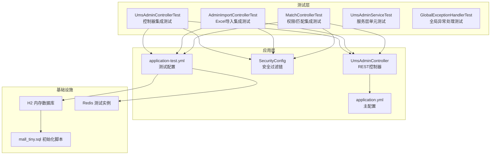
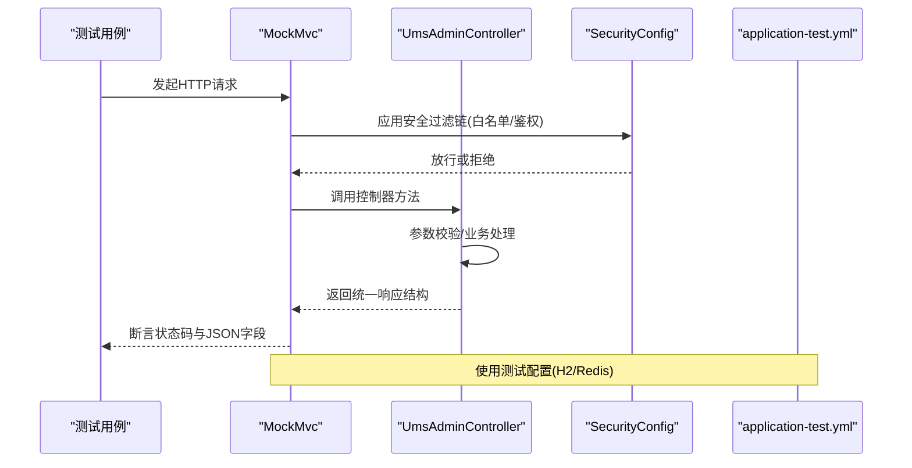
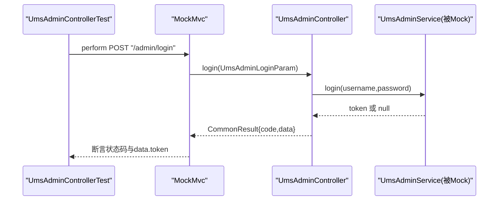
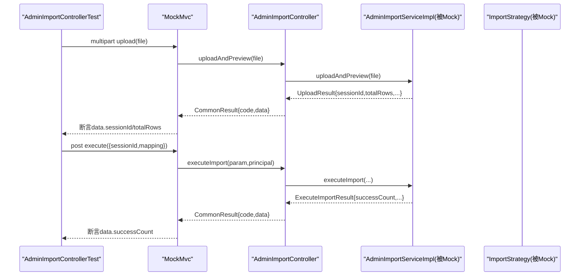
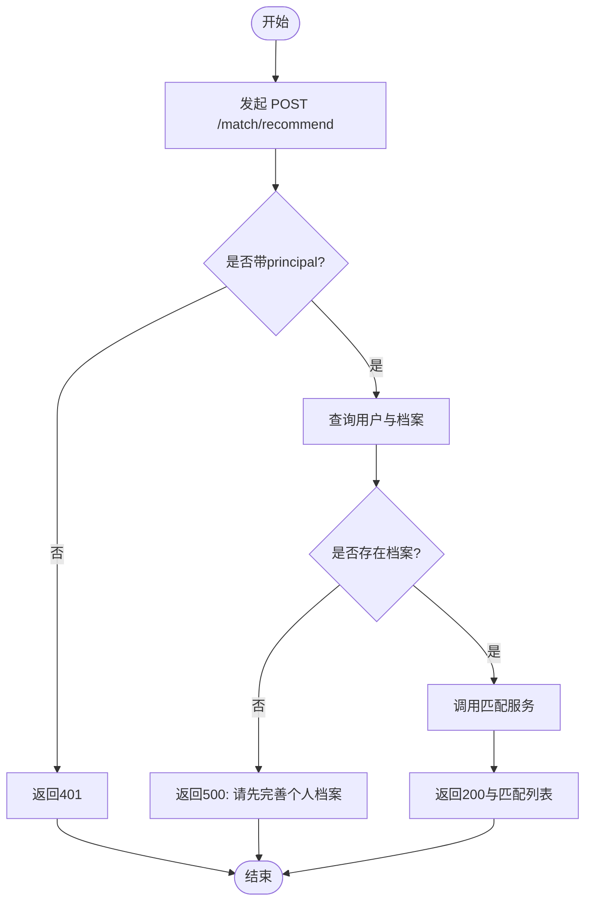
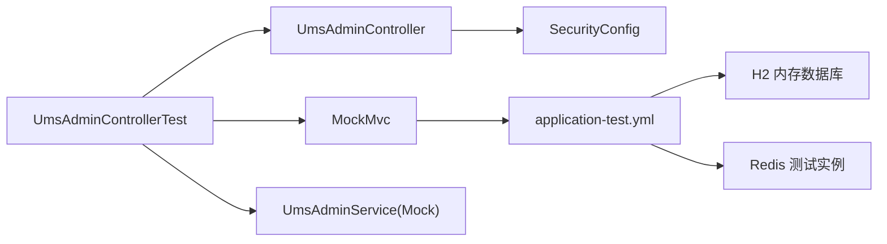

# 集成测试

<cite>
**本文引用的文件**
- [UmsAdminControllerTest.java](file://src/test/java/com/macro/mall/tiny/modules/ums/controller/UmsAdminControllerTest.java)
- [AdminImportControllerTest.java](file://src/test/java/com/macro/mall/tiny/modules/ums/controller/AdminImportControllerTest.java)
- [MatchControllerTest.java](file://src/test/java/com/macro/mall/tiny/modules/ums/controller/MatchControllerTest.java)
- [UmsAdminController.java](file://src/main/java/com/macro/mall/tiny/modules/ums/controller/UmsAdminController.java)
- [application-test.yml](file://src/test/resources/application-test.yml)
- [application.yml](file://src/main/resources/application.yml)
- [SecurityConfig.java](file://src/main/java/com/macro/mall/tiny/security/config/SecurityConfig.java)
- [UmsAdminServiceTest.java](file://src/test/java/com/macro/mall/tiny/modules/ums/service/UmsAdminServiceTest.java)
- [GlobalExceptionHandlerTest.java](file://src/test/java/com/macro/mall/tiny/common/exception/GlobalExceptionHandlerTest.java)
- [mall_tiny.sql](file://sql/mall_tiny.sql)
- [pom.xml](file://pom.xml)
</cite>

## 目录
1. [简介](#简介)
2. [项目结构](#项目结构)
3. [核心组件](#核心组件)
4. [架构总览](#架构总览)
5. [详细组件分析](#详细组件分析)
6. [依赖分析](#依赖分析)
7. [性能考虑](#性能考虑)
8. [故障排查指南](#故障排查指南)
9. [结论](#结论)
10. [附录](#附录)

## 简介
本文件面向Mall-Tiny项目的集成测试体系，围绕控制器层集成测试展开，重点以UmsAdminControllerTest为例，系统讲解如何使用MockMvc对HTTP接口进行端到端验证；同时覆盖测试环境配置（application-test.yml）、测试数据库与初始化脚本、Excel导入功能测试、权限控制与动态权限匹配测试、测试数据管理策略、测试环境隔离以及测试执行顺序建议，帮助团队建立可维护、可扩展的集成测试体系。

## 项目结构
- 测试入口位于src/test/java，按模块划分控制器与服务测试；
- 控制器测试通过@WebMvcTest加载Web层上下文，结合MockMvc发起HTTP请求；
- 测试配置位于src/test/resources/application-test.yml，使用H2内存数据库与Redis；
- 主应用配置位于src/main/resources/application.yml；
- 安全配置位于security/config/SecurityConfig.java，定义白名单与过滤链；
- SQL初始化脚本位于sql/mall_tiny.sql，包含用户、角色、资源等基础数据；
- Maven依赖中包含H2内存数据库，便于快速搭建测试环境。

图表来源
- [UmsAdminControllerTest.java:33-36](file://src/test/java/com/macro/mall/tiny/modules/ums/controller/UmsAdminControllerTest.java#L33-L36)
- [AdminImportControllerTest.java:37-40](file://src/test/java/com/macro/mall/tiny/modules/ums/controller/AdminImportControllerTest.java#L37-L40)
- [MatchControllerTest.java:33-36](file://src/test/java/com/macro/mall/tiny/modules/ums/controller/MatchControllerTest.java#L33-L36)
- [UmsAdminController.java:47-47](file://src/main/java/com/macro/mall/tiny/modules/ums/controller/UmsAdminController.java#L47-L47)
- [SecurityConfig.java:46-84](file://src/main/java/com/macro/mall/tiny/security/config/SecurityConfig.java#L46-L84)
- [application-test.yml:1-57](file://src/test/resources/application-test.yml#L1-L57)
- [application.yml:1-57](file://src/main/resources/application.yml#L1-L57)
- [mall_tiny.sql:1-200](file://sql/mall_tiny.sql#L1-L200)

章节来源
- [UmsAdminControllerTest.java:33-36](file://src/test/java/com/macro/mall/tiny/modules/ums/controller/UmsAdminControllerTest.java#L33-L36)
- [AdminImportControllerTest.java:37-40](file://src/test/java/com/macro/mall/tiny/modules/ums/controller/AdminImportControllerTest.java#L37-L40)
- [MatchControllerTest.java:33-36](file://src/test/java/com/macro/mall/tiny/modules/ums/controller/MatchControllerTest.java#L33-L36)
- [UmsAdminController.java:47-47](file://src/main/java/com/macro/mall/tiny/modules/ums/controller/UmsAdminController.java#L47-L47)
- [SecurityConfig.java:46-84](file://src/main/java/com/macro/mall/tiny/security/config/SecurityConfig.java#L46-L84)
- [application-test.yml:1-57](file://src/test/resources/application-test.yml#L1-L57)
- [application.yml:1-57](file://src/main/resources/application.yml#L1-L57)
- [mall_tiny.sql:1-200](file://sql/mall_tiny.sql#L1-L200)

## 核心组件
- 控制器层集成测试：通过@WebMvcTest加载目标控制器，使用MockMvc发起HTTP请求，断言响应状态码与JSON结构；
- 服务层单元测试：通过Mockito模拟DAO与外部依赖，验证业务逻辑分支；
- 全局异常处理测试：验证不同异常类型映射到统一响应结构；
- 安全配置：基于白名单与JWT过滤器，控制受保护资源访问；
- 测试环境：application-test.yml使用H2内存数据库与Redis，避免对真实环境造成影响；
- 初始化脚本：mall_tiny.sql提供基础数据，便于权限与资源测试。

章节来源
- [UmsAdminControllerTest.java:50-181](file://src/test/java/com/macro/mall/tiny/modules/ums/controller/UmsAdminControllerTest.java#L50-L181)
- [UmsAdminServiceTest.java:74-163](file://src/test/java/com/macro/mall/tiny/modules/ums/service/UmsAdminServiceTest.java#L74-L163)
- [GlobalExceptionHandlerTest.java:27-121](file://src/test/java/com/macro/mall/tiny/common/exception/GlobalExceptionHandlerTest.java#L27-L121)
- [SecurityConfig.java:46-84](file://src/main/java/com/macro/mall/tiny/security/config/SecurityConfig.java#L46-L84)
- [application-test.yml:4-57](file://src/test/resources/application-test.yml#L4-L57)
- [mall_tiny.sql:18-200](file://sql/mall_tiny.sql#L18-L200)

## 架构总览
下图展示控制器集成测试在整体架构中的位置与交互流程，包括MockMvc、控制器、服务层、安全过滤链与测试配置的关系。

图表来源
- [UmsAdminControllerTest.java:50-181](file://src/test/java/com/macro/mall/tiny/modules/ums/controller/UmsAdminControllerTest.java#L50-L181)
- [UmsAdminController.java:166-196](file://src/main/java/com/macro/mall/tiny/modules/ums/controller/UmsAdminController.java#L166-L196)
- [SecurityConfig.java:46-84](file://src/main/java/com/macro/mall/tiny/security/config/SecurityConfig.java#L46-L84)
- [application-test.yml:1-57](file://src/test/resources/application-test.yml#L1-L57)

## 详细组件分析

### UmsAdminControllerTest：控制器集成测试实践
- 测试范围：登录、注册、修改密码等核心接口；
- Mock策略：使用@WebMvcTest加载UmsAdminController，配合@MockBean注入服务层依赖；
- 请求方式：POST /admin/login、/admin/register、/admin/updatePassword；
- 断言策略：status().isOk()与jsonPath()断言统一响应结构字段；
- 异常场景：空密码、畸形JSON、错误凭据、重复用户名、旧密码错误等；
- 优势：无需启动完整应用，快速验证控制器行为与响应格式一致性。

图表来源
- [UmsAdminControllerTest.java:50-110](file://src/test/java/com/macro/mall/tiny/modules/ums/controller/UmsAdminControllerTest.java#L50-L110)
- [UmsAdminController.java:166-196](file://src/main/java/com/macro/mall/tiny/modules/ums/controller/UmsAdminController.java#L166-L196)

章节来源
- [UmsAdminControllerTest.java:50-181](file://src/test/java/com/macro/mall/tiny/modules/ums/controller/UmsAdminControllerTest.java#L50-L181)
- [UmsAdminController.java:62-94](file://src/main/java/com/macro/mall/tiny/modules/ums/controller/UmsAdminController.java#L62-L94)

### Excel导入功能测试：AdminImportControllerTest
- 测试范围：上传Excel预览、执行导入、会话过期错误；
- Mock策略：@WebMvcTest加载AdminImportController，Mock AdminImportServiceImpl、ImportTemplateService与ImportStrategy；
- 请求方式：multipart /admin/import/upload、POST /admin/import/execute；
- 断言策略：断言统一响应结构与导入统计字段；
- 场景覆盖：空文件、格式错误、有效Excel、会话过期；
- 实践要点：使用MockMultipartFile构造二进制流，模拟真实上传场景。

图表来源
- [AdminImportControllerTest.java:57-153](file://src/test/java/com/macro/mall/tiny/modules/ums/controller/AdminImportControllerTest.java#L57-L153)
- [AdminImportControllerTest.java:58-106](file://src/test/java/com/macro/mall/tiny/modules/ums/controller/AdminImportControllerTest.java#L58-L106)
- [AdminImportControllerTest.java:108-153](file://src/test/java/com/macro/mall/tiny/modules/ums/controller/AdminImportControllerTest.java#L108-L153)

章节来源
- [AdminImportControllerTest.java:57-153](file://src/test/java/com/macro/mall/tiny/modules/ums/controller/AdminImportControllerTest.java#L57-L153)

### 权限控制与动态权限匹配：MatchControllerTest
- 测试范围：未认证用户、无档案用户、正常匹配；
- Mock策略：@WebMvcTest加载MatchController，Mock MatchService、UmsAdminService、UserArchiveService；
- 请求方式：POST /match/recommend，通过principal(() -> "testuser")模拟已认证用户；
- 断言策略：401未认证、500无档案、200返回匹配列表；
- 动态权限：SecurityConfig中配置白名单与JWT过滤器，确保受保护接口的安全性。

图表来源
- [MatchControllerTest.java:50-97](file://src/test/java/com/macro/mall/tiny/modules/ums/controller/MatchControllerTest.java#L50-L97)
- [SecurityConfig.java:46-84](file://src/main/java/com/macro/mall/tiny/security/config/SecurityConfig.java#L46-L84)

章节来源
- [MatchControllerTest.java:50-97](file://src/test/java/com/macro/mall/tiny/modules/ums/controller/MatchControllerTest.java#L50-L97)
- [SecurityConfig.java:46-84](file://src/main/java/com/macro/mall/tiny/security/config/SecurityConfig.java#L46-L84)

### 测试环境配置与隔离
- 测试配置：application-test.yml使用H2内存数据库与Redis，端口、路径匹配策略、JWT参数均独立配置；
- 白名单：/admin/login、/admin/register、/admin/info、/admin/logout、/admin/import/**等接口免鉴权；
- 隔离策略：测试数据库与Redis键空间独立，避免污染生产数据；
- 依赖支持：pom.xml引入H2内存数据库依赖，便于测试阶段快速启动。

章节来源
- [application-test.yml:1-57](file://src/test/resources/application-test.yml#L1-L57)
- [application.yml:38-57](file://src/main/resources/application.yml#L38-L57)
- [pom.xml:146-151](file://pom.xml#L146-L151)

### 测试数据管理策略
- 初始化脚本：mall_tiny.sql包含用户、角色、菜单、资源等基础数据，便于权限与资源测试；
- 建议：在测试前执行初始化脚本，或在测试中通过SQL脚本或事务回滚保证一致性；
- 缓存隔离：测试Redis使用独立database与key前缀，避免与生产冲突。

章节来源
- [mall_tiny.sql:18-200](file://sql/mall_tiny.sql#L18-L200)
- [application-test.yml:32-39](file://src/test/resources/application-test.yml#L32-L39)

### 全局异常处理测试
- 覆盖异常类型：业务异常(ApiException)、参数校验异常(BindException)、消息不可读(HttpMessageNotReadableException)、缺少参数、方法不支持、访问拒绝等；
- 断言策略：统一返回CommonResult，断言code与message；
- 价值：确保控制器异常场景与全局异常处理器协同工作，保持对外一致的错误语义。

章节来源
- [GlobalExceptionHandlerTest.java:27-121](file://src/test/java/com/macro/mall/tiny/common/exception/GlobalExceptionHandlerTest.java#L27-L121)

## 依赖分析
- 控制器测试依赖：MockMvc、@WebMvcTest、@MockBean；
- 安全依赖：SecurityConfig定义过滤链与白名单；
- 配置依赖：application-test.yml与application.yml；
- 数据依赖：H2内存数据库与Redis；
- 服务层依赖：UmsAdminService、AdminImportServiceImpl等通过Mock注入。

图表来源
- [UmsAdminControllerTest.java:33-48](file://src/test/java/com/macro/mall/tiny/modules/ums/controller/UmsAdminControllerTest.java#L33-L48)
- [UmsAdminController.java:47-61](file://src/main/java/com/macro/mall/tiny/modules/ums/controller/UmsAdminController.java#L47-L61)
- [SecurityConfig.java:46-84](file://src/main/java/com/macro/mall/tiny/security/config/SecurityConfig.java#L46-L84)
- [application-test.yml:4-15](file://src/test/resources/application-test.yml#L4-L15)

章节来源
- [UmsAdminControllerTest.java:33-48](file://src/test/java/com/macro/mall/tiny/modules/ums/controller/UmsAdminControllerTest.java#L33-L48)
- [SecurityConfig.java:46-84](file://src/main/java/com/macro/mall/tiny/security/config/SecurityConfig.java#L46-L84)
- [application-test.yml:4-15](file://src/test/resources/application-test.yml#L4-L15)

## 性能考虑
- Mock策略：通过@MockBean替换真实服务，避免数据库与网络开销，提升测试执行速度；
- 内存数据库：H2内存数据库读写性能高，适合集成测试；
- 并发与隔离：测试之间避免共享状态，必要时使用事务回滚或临时表；
- 执行顺序：优先执行无副作用的控制器测试，再执行可能影响状态的服务测试。

## 故障排查指南
- 登录失败场景：确认UmsAdminService.login返回值与UmsAdminController.login逻辑一致；
- Excel导入失败：检查AdminImportServiceImpl.uploadAndPreview与executeImport的Mock返回；
- 权限相关：核对SecurityConfig白名单与JWT过滤器是否生效；
- 统一响应：若断言失败，检查全局异常处理器是否正确映射异常到CommonResult；
- 数据初始化：如出现404/401，确认mall_tiny.sql是否在测试前执行。

章节来源
- [UmsAdminControllerTest.java:73-110](file://src/test/java/com/macro/mall/tiny/modules/ums/controller/UmsAdminControllerTest.java#L73-L110)
- [AdminImportControllerTest.java:80-106](file://src/test/java/com/macro/mall/tiny/modules/ums/controller/AdminImportControllerTest.java#L80-L106)
- [MatchControllerTest.java:91-97](file://src/test/java/com/macro/mall/tiny/modules/ums/controller/MatchControllerTest.java#L91-L97)
- [GlobalExceptionHandlerTest.java:27-121](file://src/test/java/com/macro/mall/tiny/common/exception/GlobalExceptionHandlerTest.java#L27-L121)

## 结论
通过控制器层集成测试（以UmsAdminControllerTest为代表），结合MockMvc、MockBean与application-test.yml配置，Mall-Tiny实现了对登录、注册、密码修改、Excel导入、权限控制等关键功能的端到端验证。配合安全配置与全局异常处理测试，能够稳定地发现接口契约与异常处理问题。建议在团队内推广此测试模式，并持续完善初始化脚本与测试数据管理策略，以保障测试的可重复性与可维护性。

## 附录
- 测试执行顺序建议：
  1) 先执行无副作用的控制器测试（登录/注册/修改密码）；
  2) 再执行Excel导入测试（上传/执行/过期场景）；
  3) 最后执行权限相关测试（未认证/无档案/正常匹配）；
  4) 服务层单元测试作为补充，验证边界条件与业务分支。
- 测试数据准备：
  - 在测试前执行mall_tiny.sql，确保用户、角色、资源等基础数据可用；
  - 对于需要特定状态的测试，可在测试方法内使用事务回滚或临时清理。