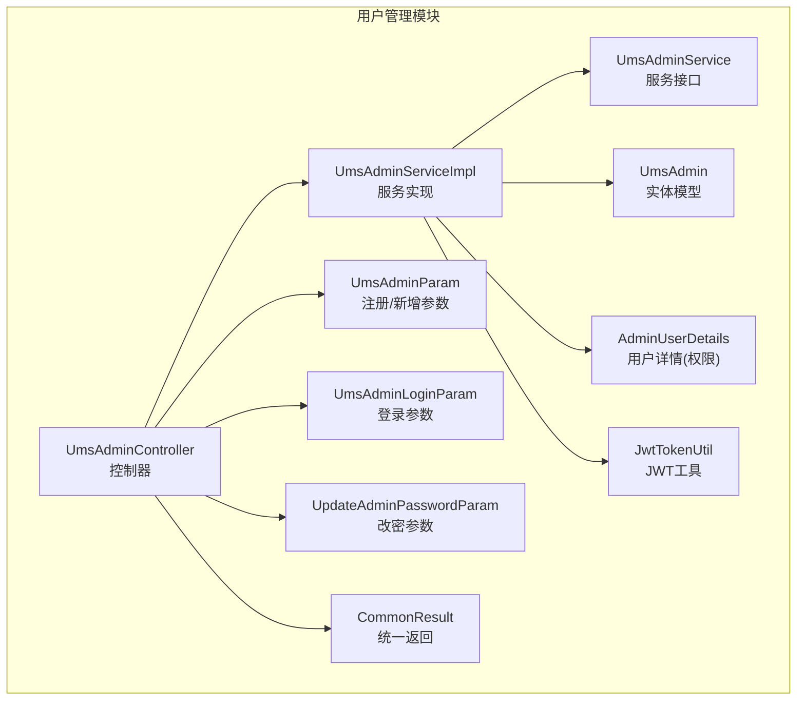
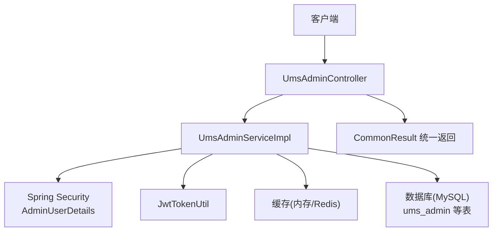
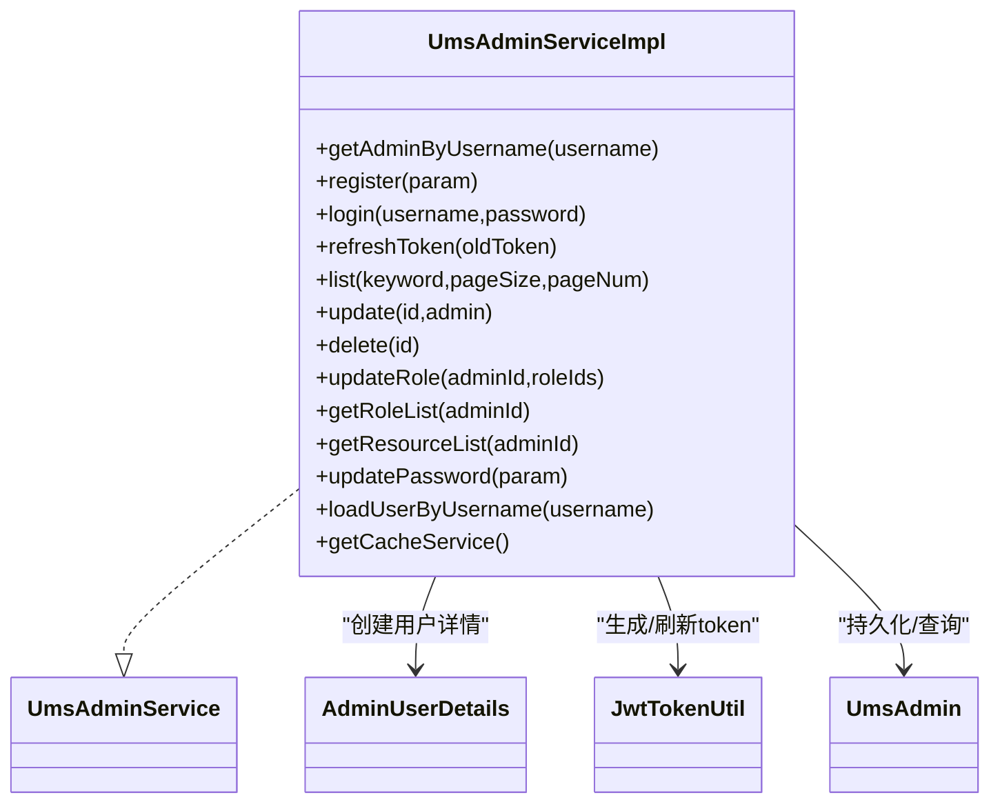
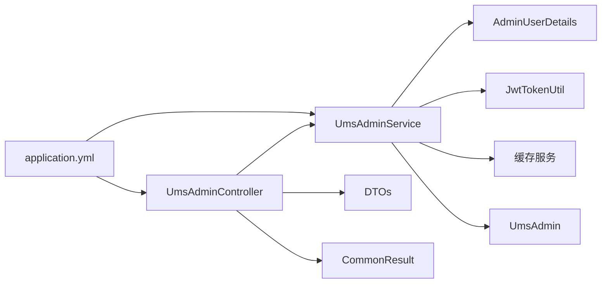
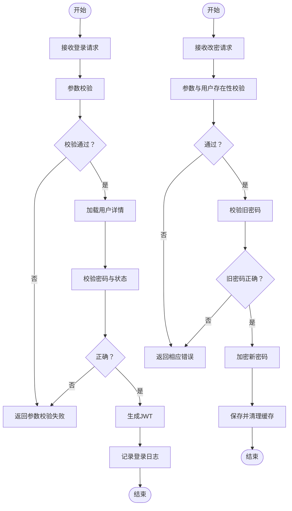
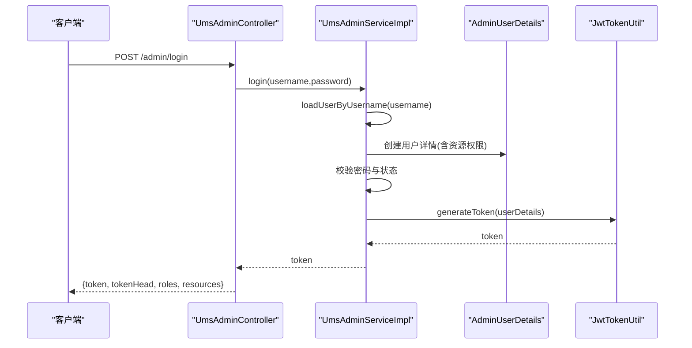

# 用户管理模块

<cite>
**本文引用的文件**
- [UmsAdminController.java](file://src/main/java/com/macro/mall/tiny/modules/ums/controller/UmsAdminController.java)
- [UmsAdminServiceImpl.java](file://src/main/java/com/macro/mall/tiny/modules/ums/service/impl/UmsAdminServiceImpl.java)
- [UmsAdminService.java](file://src/main/java/com/macro/mall/tiny/modules/ums/service/UmsAdminService.java)
- [UmsAdminCacheService.java](file://src/main/java/com/macro/mall/tiny/modules/ums/service/UmsAdminCacheService.java)
- [UmsAdmin.java](file://src/main/java/com/macro/mall/tiny/modules/ums/model/UmsAdmin.java)
- [UmsAdminParam.java](file://src/main/java/com/macro/mall/tiny/modules/ums/dto/UmsAdminParam.java)
- [UmsAdminLoginParam.java](file://src/main/java/com/macro/mall/tiny/modules/ums/dto/UmsAdminLoginParam.java)
- [UpdateAdminPasswordParam.java](file://src/main/java/com/macro/mall/tiny/modules/ums/dto/UpdateAdminPasswordParam.java)
- [AdminUserDetails.java](file://src/main/java/com/macro/mall/tiny/domain/AdminUserDetails.java)
- [JwtTokenUtil.java](file://src/main/java/com/macro/mall/tiny/security/util/JwtTokenUtil.java)
- [CommonResult.java](file://src/main/java/com/macro/mall/tiny/common/api/CommonResult.java)
- [application.yml](file://src/main/resources/application.yml)
- [mall_tiny.sql](file://sql/mall_tiny.sql)
- [UmsAdminControllerTest.java](file://src/test/java/com/macro/mall/tiny/modules/ums/controller/UmsAdminControllerTest.java)
- [README.md](file://README.md)
</cite>

## 目录
1. [简介](#简介)
2. [项目结构](#项目结构)
3. [核心组件](#核心组件)
4. [架构总览](#架构总览)
5. [详细组件分析](#详细组件分析)
6. [依赖分析](#依赖分析)
7. [性能考虑](#性能考虑)
8. [故障排查指南](#故障排查指南)
9. [结论](#结论)
10. [附录](#附录)

## 简介
本文件聚焦“用户管理模块”，围绕后台管理员（UmsAdmin）的用户注册、登录认证、密码管理、信息维护与权限控制等核心业务，系统梳理控制器、服务层、实体模型与数据传输对象之间的协作关系，并给出API接口清单、错误码说明、流程图与时序图，帮助不同层次的开发者快速理解与扩展功能。

## 项目结构
用户管理模块位于模块目录下，采用按职责分层的组织方式：
- 控制器层：UmsAdminController 提供REST接口，负责请求接入与响应封装
- 服务层：UmsAdminService 接口与 UmsAdminServiceImpl 实现类，承载业务逻辑
- 模型与DTO：UmsAdmin 实体、UmsAdminParam、UmsAdminLoginParam、UpdateAdminPasswordParam
- 安全与认证：AdminUserDetails、JwtTokenUtil、Spring Security 集成
- 配置与常量：application.yml 中的JWT、Redis、安全白名单配置
- 测试：UmsAdminControllerTest 验证登录、注册、改密等关键场景

图表来源
- [UmsAdminController.java:47-350](file://src/main/java/com/macro/mall/tiny/modules/ums/controller/UmsAdminController.java#L47-L350)
- [UmsAdminServiceImpl.java:48-272](file://src/main/java/com/macro/mall/tiny/modules/ums/service/impl/UmsAdminServiceImpl.java#L48-L272)
- [UmsAdminService.java:19-90](file://src/main/java/com/macro/mall/tiny/modules/ums/service/UmsAdminService.java#L19-L90)
- [UmsAdmin.java:25-59](file://src/main/java/com/macro/mall/tiny/modules/ums/model/UmsAdmin.java#L25-L59)
- [UmsAdminParam.java:16-33](file://src/main/java/com/macro/mall/tiny/modules/ums/dto/UmsAdminParam.java#L16-L33)
- [UmsAdminLoginParam.java:15-23](file://src/main/java/com/macro/mall/tiny/modules/ums/dto/UmsAdminLoginParam.java#L15-L23)
- [UpdateAdminPasswordParam.java:15-26](file://src/main/java/com/macro/mall/tiny/modules/ums/dto/UpdateAdminPasswordParam.java#L15-L26)
- [AdminUserDetails.java:17-87](file://src/main/java/com/macro/mall/tiny/domain/AdminUserDetails.java#L17-L87)
- [JwtTokenUtil.java:28-171](file://src/main/java/com/macro/mall/tiny/security/util/JwtTokenUtil.java#L28-L171)
- [CommonResult.java:7-125](file://src/main/java/com/macro/mall/tiny/common/api/CommonResult.java#L7-L125)

章节来源
- [README.md:61-98](file://README.md#L61-L98)

## 核心组件
- 控制器 UmsAdminController：提供注册、登录、刷新token、获取当前用户信息、登出、用户列表分页、用户详情、更新、删除、修改状态、分配角色、获取角色等接口
- 服务 UmsAdminServiceImpl：实现用户注册、登录、刷新token、分页查询、更新、删除、分配角色、获取角色与资源列表、修改密码、加载用户详情等
- 实体 UmsAdmin：后台用户表映射，包含基础字段与状态
- DTO：UmsAdminParam、UmsAdminLoginParam、UpdateAdminPasswordParam 封装请求参数
- 安全：AdminUserDetails 提供权限集合；JwtTokenUtil 生成与刷新token
- 统一返回：CommonResult 统一封装响应结构

章节来源
- [UmsAdminController.java:47-350](file://src/main/java/com/macro/mall/tiny/modules/ums/controller/UmsAdminController.java#L47-L350)
- [UmsAdminServiceImpl.java:48-272](file://src/main/java/com/macro/mall/tiny/modules/ums/service/impl/UmsAdminServiceImpl.java#L48-L272)
- [UmsAdmin.java:25-59](file://src/main/java/com/macro/mall/tiny/modules/ums/model/UmsAdmin.java#L25-L59)
- [UmsAdminParam.java:16-33](file://src/main/java/com/macro/mall/tiny/modules/ums/dto/UmsAdminParam.java#L16-L33)
- [UmsAdminLoginParam.java:15-23](file://src/main/java/com/macro/mall/tiny/modules/ums/dto/UmsAdminLoginParam.java#L15-L23)
- [UpdateAdminPasswordParam.java:15-26](file://src/main/java/com/macro/mall/tiny/modules/ums/dto/UpdateAdminPasswordParam.java#L15-L26)
- [AdminUserDetails.java:17-87](file://src/main/java/com/macro/mall/tiny/domain/AdminUserDetails.java#L17-L87)
- [JwtTokenUtil.java:28-171](file://src/main/java/com/macro/mall/tiny/security/util/JwtTokenUtil.java#L28-L171)
- [CommonResult.java:7-125](file://src/main/java/com/macro/mall/tiny/common/api/CommonResult.java#L7-L125)

## 架构总览
用户管理模块遵循经典的分层架构：
- 表现层：UmsAdminController 接收HTTP请求，参数校验，调用服务层，组装统一返回
- 业务层：UmsAdminServiceImpl 执行业务规则，访问缓存、持久层与安全组件
- 数据层：MyBatis-Plus Mapper/Entity 映射数据库表
- 安全层：Spring Security + JWT + 自定义用户详情与权限集合
- 配置层：application.yml 提供JWT、Redis、安全白名单等配置

图表来源
- [UmsAdminController.java:47-350](file://src/main/java/com/macro/mall/tiny/modules/ums/controller/UmsAdminController.java#L47-L350)
- [UmsAdminServiceImpl.java:48-272](file://src/main/java/com/macro/mall/tiny/modules/ums/service/impl/UmsAdminServiceImpl.java#L48-L272)
- [AdminUserDetails.java:17-87](file://src/main/java/com/macro/mall/tiny/domain/AdminUserDetails.java#L17-L87)
- [JwtTokenUtil.java:28-171](file://src/main/java/com/macro/mall/tiny/security/util/JwtTokenUtil.java#L28-L171)
- [CommonResult.java:7-125](file://src/main/java/com/macro/mall/tiny/common/api/CommonResult.java#L7-L125)
- [application.yml:24-57](file://src/main/resources/application.yml#L24-L57)

## 详细组件分析

### 控制器：UmsAdminController
- 路由前缀：/admin
- 主要接口
  - POST /admin/register：用户注册（参数：username、password、confirmPassword、nickName、email）
  - POST /admin/forgot/send-code：发送验证码（参数：email）
  - POST /admin/forgot/reset：重置密码（参数：email、code、newPassword、confirmPassword）
  - POST /admin/login：登录（参数：UmsAdminLoginParam）
  - GET /admin/refreshToken：刷新token
  - GET /admin/info：获取当前登录用户信息（含菜单、角色、资源URL）
  - POST /admin/logout：登出
  - GET /admin/list：分页查询用户（参数：keyword、pageSize、pageNum）
  - GET /admin/{id}：获取用户详情
  - POST /admin/update/{id}：更新用户
  - POST /admin/updatePassword：修改密码（参数：UpdateAdminPasswordParam）
  - POST /admin/delete/{id}：删除用户
  - POST /admin/updateStatus/{id}：修改状态（参数：status）
  - POST /admin/role/update：分配角色（参数：adminId、roleIds）
  - GET /admin/role/{adminId}：获取用户角色

- 参数校验与返回
  - 使用 @Validated 对登录参数进行校验
  - 统一返回 CommonResult，包含 code、message、data

- 关键流程
  - 登录：校验用户名/密码，生成JWT，返回token与角色、资源URL
  - 忘记密码：校验邮箱是否存在，生成6位验证码存Redis，重置时校验验证码并更新密码
  - 改密：校验参数合法性、用户存在性、旧密码匹配，加密新密码并清除缓存

章节来源
- [UmsAdminController.java:62-348](file://src/main/java/com/macro/mall/tiny/modules/ums/controller/UmsAdminController.java#L62-L348)
- [UmsAdminLoginParam.java:15-23](file://src/main/java/com/macro/mall/tiny/modules/ums/dto/UmsAdminLoginParam.java#L15-L23)
- [UpdateAdminPasswordParam.java:15-26](file://src/main/java/com/macro/mall/tiny/modules/ums/dto/UpdateAdminPasswordParam.java#L15-L26)
- [CommonResult.java:7-125](file://src/main/java/com/macro/mall/tiny/common/api/CommonResult.java#L7-L125)

### 服务层：UmsAdminServiceImpl
- 用户注册：复制参数到实体，设置默认状态与创建时间，密码加密后入库
- 登录：加载用户详情，校验密码与启用状态，生成JWT，记录登录日志
- 刷新token：基于JWT工具刷新带前缀的token
- 分页查询：支持按用户名/昵称模糊查询
- 更新用户：若密码未变更则清空密码字段避免覆盖，否则加密后更新；更新后清理缓存
- 删除用户：删除后清理用户缓存与资源缓存
- 分配角色：先删除旧关系，再批量保存新关系，清理相关缓存
- 获取角色与资源：优先从缓存读取，缺失则查询数据库并回填缓存
- 修改密码：校验参数、用户存在性、旧密码匹配，加密新密码并清理缓存

图表来源
- [UmsAdminServiceImpl.java:48-272](file://src/main/java/com/macro/mall/tiny/modules/ums/service/impl/UmsAdminServiceImpl.java#L48-L272)
- [UmsAdminService.java:19-90](file://src/main/java/com/macro/mall/tiny/modules/ums/service/UmsAdminService.java#L19-L90)
- [AdminUserDetails.java:17-87](file://src/main/java/com/macro/mall/tiny/domain/AdminUserDetails.java#L17-L87)
- [JwtTokenUtil.java:28-171](file://src/main/java/com/macro/mall/tiny/security/util/JwtTokenUtil.java#L28-L171)
- [UmsAdmin.java:25-59](file://src/main/java/com/macro/mall/tiny/modules/ums/model/UmsAdmin.java#L25-L59)

章节来源
- [UmsAdminServiceImpl.java:63-272](file://src/main/java/com/macro/mall/tiny/modules/ums/service/impl/UmsAdminServiceImpl.java#L63-L272)

### 实体模型：UmsAdmin
- 字段定义与含义
  - id：主键
  - username/password：用户名与密码
  - icon/email/nickName：头像、邮箱、昵称
  - note：备注
  - createTime/loginTime：创建时间与最后登录时间
  - status：启用状态（0禁用/1启用）

- 约束与业务规则
  - 默认状态为启用
  - 密码需加密存储
  - 登录时依据status判断是否可用

章节来源
- [UmsAdmin.java:25-59](file://src/main/java/com/macro/mall/tiny/modules/ums/model/UmsAdmin.java#L25-L59)
- [mall_tiny.sql:22-34](file://sql/mall_tiny.sql#L22-L34)

### 数据传输对象：DTO
- UmsAdminParam：注册/新增用户时的入参，包含用户名、密码、头像、邮箱、昵称、备注
- UmsAdminLoginParam：登录时的入参，包含用户名与密码
- UpdateAdminPasswordParam：修改密码时的入参，包含用户名、旧密码、新密码

章节来源
- [UmsAdminParam.java:16-33](file://src/main/java/com/macro/mall/tiny/modules/ums/dto/UmsAdminParam.java#L16-L33)
- [UmsAdminLoginParam.java:15-23](file://src/main/java/com/macro/mall/tiny/modules/ums/dto/UmsAdminLoginParam.java#L15-L23)
- [UpdateAdminPasswordParam.java:15-26](file://src/main/java/com/macro/mall/tiny/modules/ums/dto/UpdateAdminPasswordParam.java#L15-L26)

### 安全与认证：AdminUserDetails 与 JwtTokenUtil
- AdminUserDetails
  - 提供权限集合：支持 id:name、name、url 三种格式
  - isEnabled 依据用户状态返回
- JwtTokenUtil
  - 生成token、解析claims、校验token有效性
  - 支持刷新token（带前缀），并限制刷新窗口

章节来源
- [AdminUserDetails.java:17-87](file://src/main/java/com/macro/mall/tiny/domain/AdminUserDetails.java#L17-L87)
- [JwtTokenUtil.java:28-171](file://src/main/java/com/macro/mall/tiny/security/util/JwtTokenUtil.java#L28-L171)

### 统一返回：CommonResult
- 成功/失败/参数校验失败/未登录/未授权等标准化返回结构
- 便于前端统一处理

章节来源
- [CommonResult.java:7-125](file://src/main/java/com/macro/mall/tiny/common/api/CommonResult.java#L7-L125)

## 依赖分析
- 控制器依赖服务接口与DTO，返回统一结果
- 服务实现依赖安全组件（UserDetails、JwtTokenUtil）、缓存服务、持久层
- 实体与DTO分别承担数据模型与请求参数职责
- 配置文件提供JWT、Redis、安全白名单等全局参数

图表来源
- [UmsAdminController.java:47-350](file://src/main/java/com/macro/mall/tiny/modules/ums/controller/UmsAdminController.java#L47-L350)
- [UmsAdminServiceImpl.java:48-272](file://src/main/java/com/macro/mall/tiny/modules/ums/service/impl/UmsAdminServiceImpl.java#L48-L272)
- [application.yml:24-57](file://src/main/resources/application.yml#L24-L57)

章节来源
- [UmsAdminController.java:47-350](file://src/main/java/com/macro/mall/tiny/modules/ums/controller/UmsAdminController.java#L47-L350)
- [UmsAdminServiceImpl.java:48-272](file://src/main/java/com/macro/mall/tiny/modules/ums/service/impl/UmsAdminServiceImpl.java#L48-L272)
- [application.yml:24-57](file://src/main/resources/application.yml#L24-L57)

## 性能考虑
- 缓存策略：用户详情与资源列表缓存减少数据库压力，分配角色/资源变更时主动清理缓存
- 密码加密：使用PasswordEncoder，避免明文存储
- 分页查询：使用MyBatis-Plus Page，避免一次性加载大量数据
- 登录日志：记录IP与时间，便于审计与风控
- JWT刷新：支持在有效期内刷新，降低频繁登录成本

[本节为通用建议，不直接分析具体文件]

## 故障排查指南
- 登录失败
  - 检查用户名/密码是否为空、是否被禁用
  - 核对JWT配置（secret、expiration、tokenHead）
- 忘记密码
  - 验证邮箱是否存在、验证码是否正确、是否过期
- 修改密码
  - 确认参数完整性、旧密码匹配、新旧密码不一致时才加密
- 用户状态
  - status=0 会导致无法登录，需调整状态
- 接口未授权
  - 确认请求头携带正确的Authorization头与tokenHead前缀

章节来源
- [UmsAdminController.java:166-211](file://src/main/java/com/macro/mall/tiny/modules/ums/controller/UmsAdminController.java#L166-L211)
- [UmsAdminServiceImpl.java:98-119](file://src/main/java/com/macro/mall/tiny/modules/ums/service/impl/UmsAdminServiceImpl.java#L98-L119)
- [application.yml:24-28](file://src/main/resources/application.yml#L24-L28)

## 结论
用户管理模块以清晰的分层设计实现了完整的后台用户生命周期管理，结合Spring Security与JWT提供了认证与权限控制能力。通过统一返回、参数校验与缓存策略，既保证了易用性也兼顾了性能与安全性。建议在生产环境中进一步完善邮件验证码、密码复杂度策略、登录失败阈值与审计日志等能力。

[本节为总结性内容，不直接分析具体文件]

## 附录

### API 接口文档

- 用户注册
  - 方法：POST
  - 路径：/admin/register
  - 请求参数：
    - username：字符串，必填
    - password：字符串，必填
    - confirmPassword：字符串，必填，需与password一致
    - nickName：字符串，可选
    - email：字符串，可选
  - 响应：CommonResult，data为null
  - 错误码：用户名/密码为空、两次密码不一致、用户名重复

- 发送验证码（忘记密码）
  - 方法：POST
  - 路径：/admin/forgot/send-code
  - 请求参数：email（必填）
  - 响应：CommonResult，data包含message与code（演示模式）
  - 错误码：邮箱为空、邮箱未绑定用户

- 重置密码（忘记密码）
  - 方法：POST
  - 路径：/admin/forgot/reset
  - 请求参数：email、code、newPassword、confirmPassword
  - 响应：CommonResult
  - 错误码：参数不完整、两次密码不一致、验证码无效、邮箱未绑定用户

- 登录
  - 方法：POST
  - 路径：/admin/login
  - 请求参数：UmsAdminLoginParam（username、password）
  - 响应：CommonResult，data包含token、tokenHead、roles、resources
  - 错误码：用户名或密码错误

- 刷新token
  - 方法：GET
  - 路径：/admin/refreshToken
  - 请求头：Authorization（带tokenHead前缀）
  - 响应：CommonResult，data包含新的token与tokenHead
  - 错误码：token已过期

- 获取当前登录用户信息
  - 方法：GET
  - 路径：/admin/info
  - 响应：CommonResult，data包含username、icon、menus、roles、resources
  - 错误码：未登录

- 登出
  - 方法：POST
  - 路径：/admin/logout
  - 响应：CommonResult

- 分页获取用户列表
  - 方法：GET
  - 路径：/admin/list
  - 查询参数：keyword（可选）、pageSize（默认5）、pageNum（默认1）
  - 响应：CommonResult，data为分页包装

- 获取指定用户信息
  - 方法：GET
  - 路径：/admin/{id}
  - 路径参数：id（必填）
  - 响应：CommonResult，data为UmsAdmin

- 修改指定用户信息
  - 方法：POST
  - 路径：/admin/update/{id}
  - 路径参数：id（必填）
  - 请求体：UmsAdmin（可选字段）
  - 响应：CommonResult

- 修改指定用户密码
  - 方法：POST
  - 路径：/admin/updatePassword
  - 请求参数：UpdateAdminPasswordParam（username、oldPassword、newPassword）
  - 响应：CommonResult，data为状态码
  - 返回值：>0成功，-1参数不合法，-2找不到用户，-3旧密码错误

- 删除指定用户信息
  - 方法：POST
  - 路径：/admin/delete/{id}
  - 路径参数：id（必填）
  - 响应：CommonResult

- 修改账号状态
  - 方法：POST
  - 路径：/admin/updateStatus/{id}
  - 路径参数：id（必填）
  - 查询参数：status（必填）
  - 响应：CommonResult

- 给用户分配角色
  - 方法：POST
  - 路径：/admin/role/update
  - 查询参数：adminId（必填）、roleIds（必填列表）
  - 响应：CommonResult，data为分配数量

- 获取指定用户的角色
  - 方法：GET
  - 路径：/admin/role/{adminId}
  - 路径参数：adminId（必填）
  - 响应：CommonResult，data为角色列表

章节来源
- [UmsAdminController.java:62-348](file://src/main/java/com/macro/mall/tiny/modules/ums/controller/UmsAdminController.java#L62-L348)
- [UmsAdminLoginParam.java:15-23](file://src/main/java/com/macro/mall/tiny/modules/ums/dto/UmsAdminLoginParam.java#L15-L23)
- [UpdateAdminPasswordParam.java:15-26](file://src/main/java/com/macro/mall/tiny/modules/ums/dto/UpdateAdminPasswordParam.java#L15-L26)

### 业务流程图：登录与改密

图表来源
- [UmsAdminController.java:166-196](file://src/main/java/com/macro/mall/tiny/modules/ums/controller/UmsAdminController.java#L166-L196)
- [UmsAdminServiceImpl.java:98-119](file://src/main/java/com/macro/mall/tiny/modules/ums/service/impl/UmsAdminServiceImpl.java#L98-L119)
- [UmsAdminServiceImpl.java:233-254](file://src/main/java/com/macro/mall/tiny/modules/ums/service/impl/UmsAdminServiceImpl.java#L233-L254)

### 时序图：登录流程

图表来源
- [UmsAdminController.java:166-196](file://src/main/java/com/macro/mall/tiny/modules/ums/controller/UmsAdminController.java#L166-L196)
- [UmsAdminServiceImpl.java:98-119](file://src/main/java/com/macro/mall/tiny/modules/ums/service/impl/UmsAdminServiceImpl.java#L98-L119)
- [AdminUserDetails.java:17-87](file://src/main/java/com/macro/mall/tiny/domain/AdminUserDetails.java#L17-L87)
- [JwtTokenUtil.java:117-122](file://src/main/java/com/macro/mall/tiny/security/util/JwtTokenUtil.java#L117-L122)

### 测试要点（来自测试类）
- 登录成功：返回200与token
- 登录失败（空密码/畸形JSON）：返回400
- 登录失败（凭据错误）：返回校验失败消息
- 注册成功/失败（重复用户名）：返回相应状态码
- 修改密码成功/失败（旧密码错误）：返回相应状态码

章节来源
- [UmsAdminControllerTest.java:50-182](file://src/test/java/com/macro/mall/tiny/modules/ums/controller/UmsAdminControllerTest.java#L50-L182)

### 配置与数据库
- JWT配置：tokenHeader、secret、expiration、tokenHead
- Redis配置：数据库名、键前缀、过期时间
- 安全白名单：允许匿名访问的路径
- 数据库表：ums_admin、ums_admin_login_log、ums_admin_role_relation、ums_menu、ums_resource、ums_resource_category 等

章节来源
- [application.yml:24-57](file://src/main/resources/application.yml#L24-L57)
- [mall_tiny.sql:22-200](file://sql/mall_tiny.sql#L22-L200)