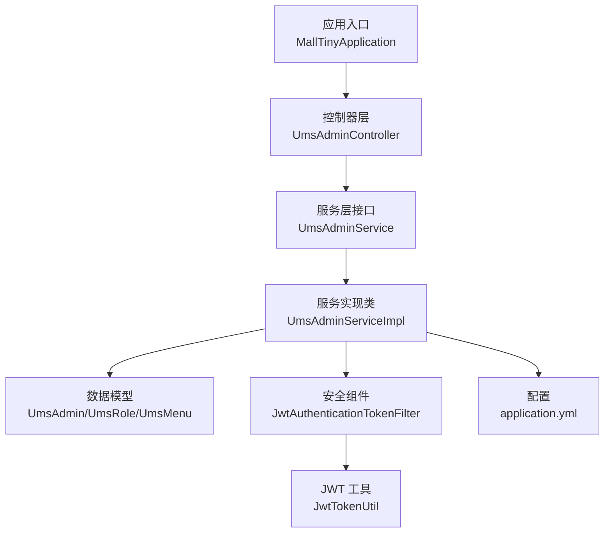
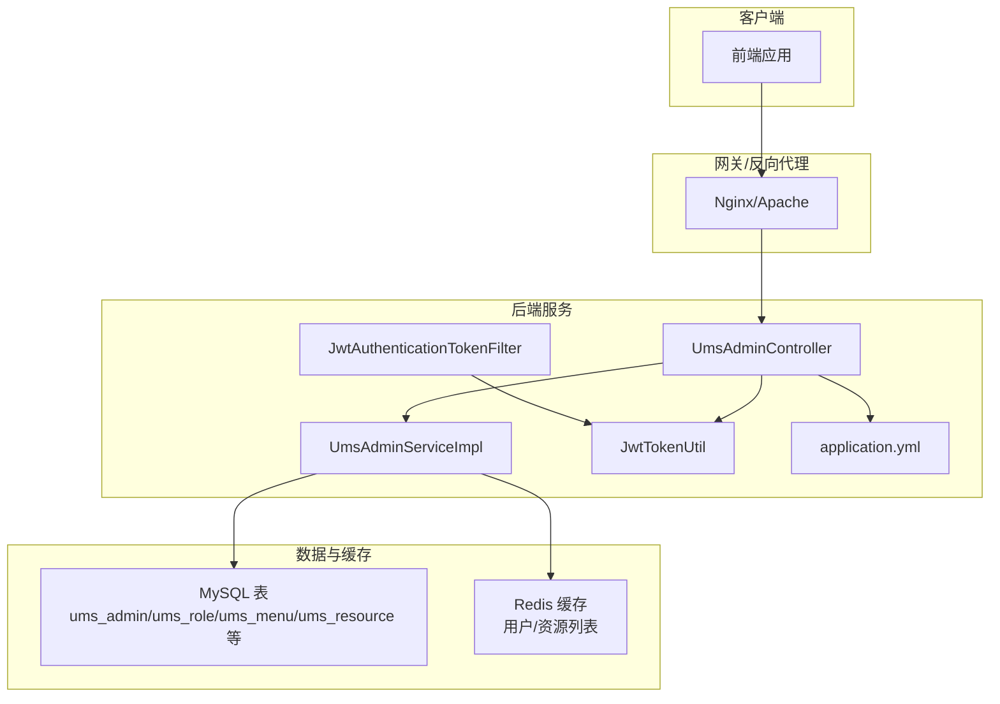
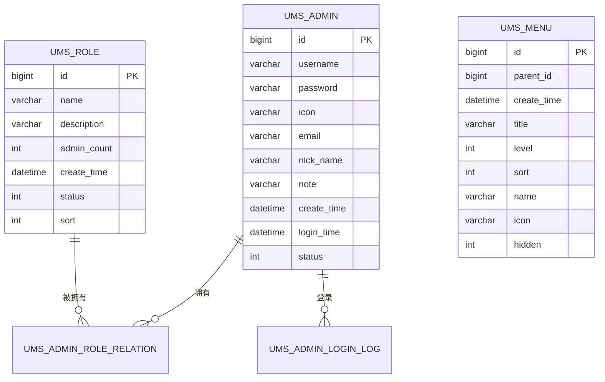
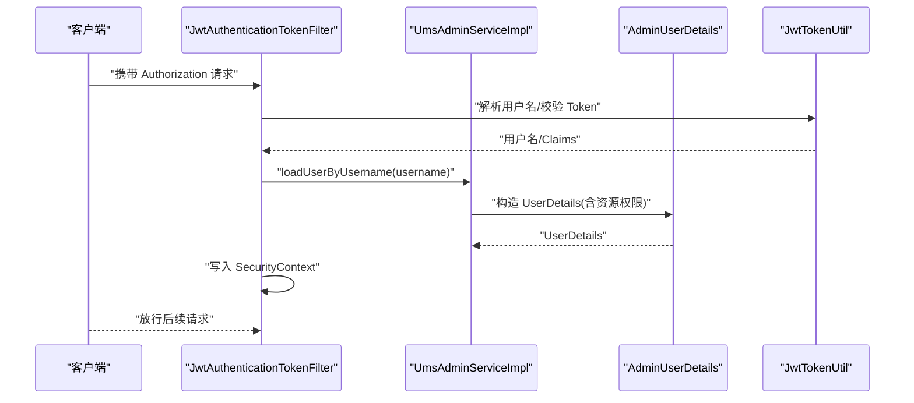
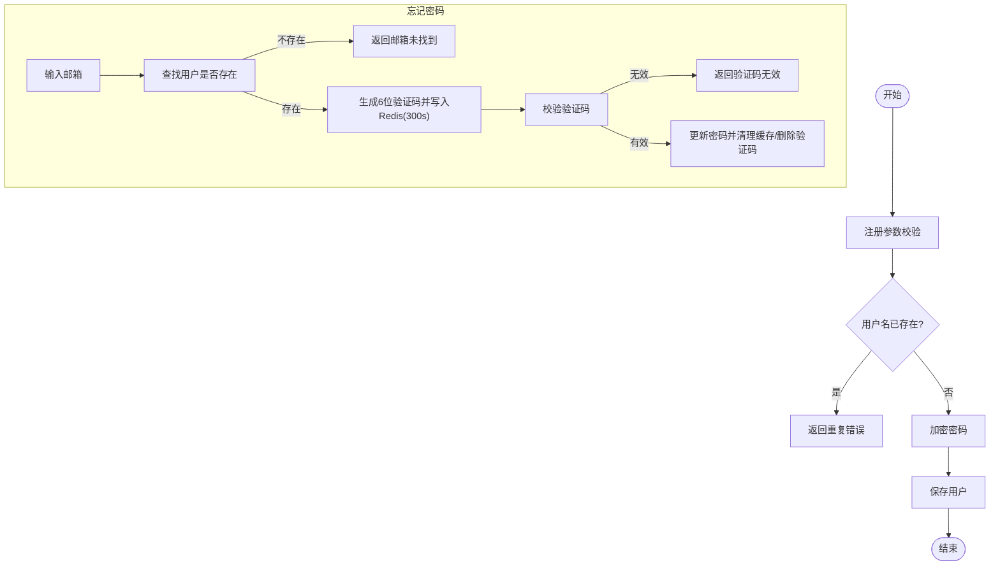
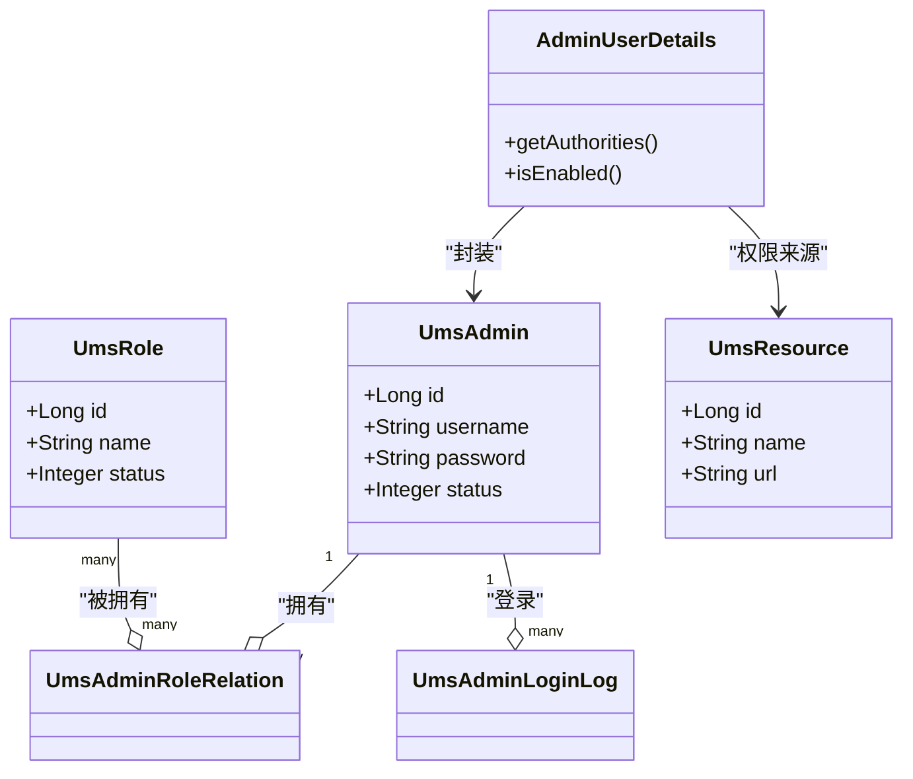
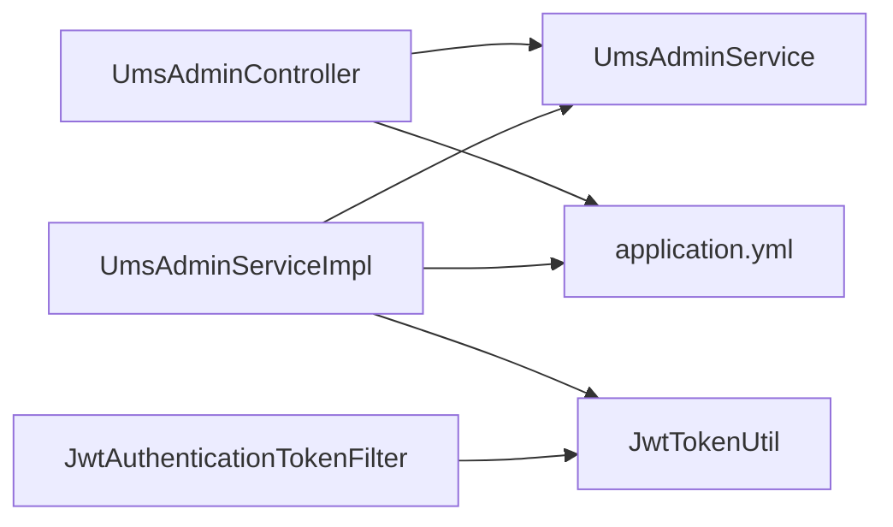

# 用户管理系统

<cite>
**本文引用的文件**
- [MallTinyApplication.java](file://src/main/java/com/macro/mall/tiny/MallTinyApplication.java)
- [UmsAdminController.java](file://src/main/java/com/macro/mall/tiny/modules/ums/controller/UmsAdminController.java)
- [UmsAdminService.java](file://src/main/java/com/macro/mall/tiny/modules/ums/service/UmsAdminService.java)
- [UmsAdminServiceImpl.java](file://src/main/java/com/macro/mall/tiny/modules/ums/service/impl/UmsAdminServiceImpl.java)
- [UmsAdmin.java](file://src/main/java/com/macro/mall/tiny/modules/ums/model/UmsAdmin.java)
- [UmsRole.java](file://src/main/java/com/macro/mall/tiny/modules/ums/model/UmsRole.java)
- [UmsMenu.java](file://src/main/java/com/macro/mall/tiny/modules/ums/model/UmsMenu.java)
- [UmsAdminParam.java](file://src/main/java/com/macro/mall/tiny/modules/ums/dto/UmsAdminParam.java)
- [UmsAdminLoginParam.java](file://src/main/java/com/macro/mall/tiny/modules/ums/dto/UmsAdminLoginParam.java)
- [UpdateAdminPasswordParam.java](file://src/main/java/com/macro/mall/tiny/modules/ums/dto/UpdateAdminPasswordParam.java)
- [AdminUserDetails.java](file://src/main/java/com/macro/mall/tiny/domain/AdminUserDetails.java)
- [JwtAuthenticationTokenFilter.java](file://src/main/java/com/macro/mall/tiny/security/component/JwtAuthenticationTokenFilter.java)
- [JwtTokenUtil.java](file://src/main/java/com/macro/mall/tiny/security/util/JwtTokenUtil.java)
- [application.yml](file://src/main/resources/application.yml)
- [mall_tiny.sql](file://sql/mall_tiny.sql)
</cite>

## 目录
1. [简介](#简介)
2. [项目结构](#项目结构)
3. [核心组件](#核心组件)
4. [架构总览](#架构总览)
5. [详细组件分析](#详细组件分析)
6. [依赖分析](#依赖分析)
7. [性能考虑](#性能考虑)
8. [故障排查指南](#故障排查指南)
9. [结论](#结论)
10. [附录](#附录)

## 简介
本文件为“用户管理系统（UMS）”的综合技术文档，覆盖用户注册、登录认证、密码管理、用户信息维护、权限体系与角色分配、菜单访问控制等核心能力。文档以代码为依据，结合实体模型、业务流程、API 接口与安全配置，提供从入门到进阶的多层次技术解读，并给出最佳实践与排障建议。

## 项目结构
- 应用入口位于模块根包下的启动类，负责应用初始化与运行。
- 用户管理相关代码集中在 modules/ums 包下，采用分层架构：
  - controller 层：对外暴露 REST API
  - service 层：业务逻辑与事务控制
  - model/dto/mapper：数据模型、传输对象与持久化映射
- 安全与鉴权位于 security 子包，基于 Spring Security + JWT 实现。
- 配置集中于 application.yml，包含 JWT、Redis 缓存、白名单等。

图表来源
- [MallTinyApplication.java:1-14](file://src/main/java/com/macro/mall/tiny/MallTinyApplication.java#L1-L14)
- [UmsAdminController.java:1-350](file://src/main/java/com/macro/mall/tiny/modules/ums/controller/UmsAdminController.java#L1-L350)
- [UmsAdminService.java:1-90](file://src/main/java/com/macro/mall/tiny/modules/ums/service/UmsAdminService.java#L1-L90)
- [UmsAdminServiceImpl.java:1-272](file://src/main/java/com/macro/mall/tiny/modules/ums/service/impl/UmsAdminServiceImpl.java#L1-L272)
- [UmsAdmin.java:1-59](file://src/main/java/com/macro/mall/tiny/modules/ums/model/UmsAdmin.java#L1-L59)
- [UmsRole.java:1-51](file://src/main/java/com/macro/mall/tiny/modules/ums/model/UmsRole.java#L1-L51)
- [UmsMenu.java:1-58](file://src/main/java/com/macro/mall/tiny/modules/ums/model/UmsMenu.java#L1-L58)
- [JwtAuthenticationTokenFilter.java:1-59](file://src/main/java/com/macro/mall/tiny/security/component/JwtAuthenticationTokenFilter.java#L1-L59)
- [JwtTokenUtil.java:1-171](file://src/main/java/com/macro/mall/tiny/security/util/JwtTokenUtil.java#L1-L171)
- [application.yml:1-57](file://src/main/resources/application.yml#L1-L57)

章节来源
- [MallTinyApplication.java:1-14](file://src/main/java/com/macro/mall/tiny/MallTinyApplication.java#L1-L14)
- [application.yml:1-57](file://src/main/resources/application.yml#L1-L57)

## 核心组件
- 控制器层：UmsAdminController 提供用户注册、登录、刷新 Token、获取用户信息、修改密码、删除、状态变更、角色分配与查询等接口。
- 服务层：UmsAdminService 定义用户管理核心方法；UmsAdminServiceImpl 实现具体业务逻辑，含密码加密、登录鉴权、角色与资源缓存、登录日志等。
- 安全层：JwtAuthenticationTokenFilter 在请求进入时解析并验证 JWT；JwtTokenUtil 负责生成、刷新与校验 Token。
- 数据模型：UmsAdmin（用户）、UmsRole（角色）、UmsMenu（菜单）及 AdminUserDetails（用户详情与权限集合）。
- 配置：application.yml 中定义 JWT 头部、密钥、过期时间、Redis 缓存键前缀、安全白名单等。

章节来源
- [UmsAdminController.java:1-350](file://src/main/java/com/macro/mall/tiny/modules/ums/controller/UmsAdminController.java#L1-L350)
- [UmsAdminService.java:1-90](file://src/main/java/com/macro/mall/tiny/modules/ums/service/UmsAdminService.java#L1-L90)
- [UmsAdminServiceImpl.java:1-272](file://src/main/java/com/macro/mall/tiny/modules/ums/service/impl/UmsAdminServiceImpl.java#L1-L272)
- [AdminUserDetails.java:1-87](file://src/main/java/com/macro/mall/tiny/domain/AdminUserDetails.java#L1-L87)
- [JwtAuthenticationTokenFilter.java:1-59](file://src/main/java/com/macro/mall/tiny/security/component/JwtAuthenticationTokenFilter.java#L1-L59)
- [JwtTokenUtil.java:1-171](file://src/main/java/com/macro/mall/tiny/security/util/JwtTokenUtil.java#L1-L171)
- [application.yml:24-57](file://src/main/resources/application.yml#L24-L57)

## 架构总览
UMS 采用前后端分离架构，后端基于 Spring Boot + Spring Security + JWT + MyBatis-Plus。请求通过 JwtAuthenticationTokenFilter 进行拦截与鉴权，服务层完成业务处理与缓存更新，数据层通过 Mapper/ServiceImpl 与数据库交互。

图表来源
- [UmsAdminController.java:43-47](file://src/main/java/com/macro/mall/tiny/modules/ums/controller/UmsAdminController.java#L43-L47)
- [UmsAdminServiceImpl.java:48-76](file://src/main/java/com/macro/mall/tiny/modules/ums/service/impl/UmsAdminServiceImpl.java#L48-L76)
- [JwtAuthenticationTokenFilter.java:26-58](file://src/main/java/com/macro/mall/tiny/security/component/JwtAuthenticationTokenFilter.java#L26-L58)
- [JwtTokenUtil.java:28-171](file://src/main/java/com/macro/mall/tiny/security/util/JwtTokenUtil.java#L28-L171)
- [application.yml:24-57](file://src/main/resources/application.yml#L24-L57)

## 详细组件分析

### 用户实体模型与数据流
- UmsAdmin：后台用户表，包含主键、用户名、密码、头像、邮箱、昵称、备注、创建时间、最后登录时间、状态等字段。
- UmsRole：后台用户角色表，包含主键、名称、描述、后台用户数量、创建时间、启用状态、排序等字段。
- UmsMenu：后台菜单表，包含主键、父级 ID、创建时间、菜单名称、级数、排序、前端名称、图标、前端隐藏等字段。
- AdminUserDetails：实现 UserDetails，将用户与资源权限集合关联，支持 id:name、name、url 三种权限格式。

图表来源
- [UmsAdmin.java:25-58](file://src/main/java/com/macro/mall/tiny/modules/ums/model/UmsAdmin.java#L25-L58)
- [UmsRole.java:25-49](file://src/main/java/com/macro/mall/tiny/modules/ums/model/UmsRole.java#L25-L49)
- [UmsMenu.java:25-56](file://src/main/java/com/macro/mall/tiny/modules/ums/model/UmsMenu.java#L25-L56)
- [mall_tiny.sql:19-105](file://sql/mall_tiny.sql#L19-L105)

章节来源
- [UmsAdmin.java:1-59](file://src/main/java/com/macro/mall/tiny/modules/ums/model/UmsAdmin.java#L1-L59)
- [UmsRole.java:1-51](file://src/main/java/com/macro/mall/tiny/modules/ums/model/UmsRole.java#L1-L51)
- [UmsMenu.java:1-58](file://src/main/java/com/macro/mall/tiny/modules/ums/model/UmsMenu.java#L1-L58)
- [AdminUserDetails.java:17-87](file://src/main/java/com/macro/mall/tiny/domain/AdminUserDetails.java#L17-L87)
- [mall_tiny.sql:19-105](file://sql/mall_tiny.sql#L19-L105)

### 登录认证与 Token 流程
- 请求进入 JwtAuthenticationTokenFilter，从请求头读取 Authorization，去除前缀后解析用户名。
- 若上下文未认证且 Token 有效，则通过 UserDetails 加载用户与资源权限，写入 SecurityContext。
- 登录成功后，UmsAdminController 返回 token、tokenHead、角色与资源列表。

图表来源
- [JwtAuthenticationTokenFilter.java:37-57](file://src/main/java/com/macro/mall/tiny/security/component/JwtAuthenticationTokenFilter.java#L37-L57)
- [UmsAdminServiceImpl.java:257-265](file://src/main/java/com/macro/mall/tiny/modules/ums/service/impl/UmsAdminServiceImpl.java#L257-L265)
- [AdminUserDetails.java:17-55](file://src/main/java/com/macro/mall/tiny/domain/AdminUserDetails.java#L17-L55)
- [JwtTokenUtil.java:76-96](file://src/main/java/com/macro/mall/tiny/security/util/JwtTokenUtil.java#L76-L96)

章节来源
- [JwtAuthenticationTokenFilter.java:1-59](file://src/main/java/com/macro/mall/tiny/security/component/JwtAuthenticationTokenFilter.java#L1-L59)
- [UmsAdminController.java:166-196](file://src/main/java/com/macro/mall/tiny/modules/ums/controller/UmsAdminController.java#L166-L196)
- [UmsAdminServiceImpl.java:98-119](file://src/main/java/com/macro/mall/tiny/modules/ums/service/impl/UmsAdminServiceImpl.java#L98-L119)
- [JwtTokenUtil.java:117-153](file://src/main/java/com/macro/mall/tiny/security/util/JwtTokenUtil.java#L117-L153)

### 用户注册与密码管理流程
- 注册：UmsAdminController 校验用户名/密码/确认密码，检查重复，调用 UmsAdminService.register 加密保存。
- 忘记密码：发送验证码至 Redis（5 分钟过期），校验后更新密码并清理缓存。
- 修改密码：UmsAdminServiceImpl 校验旧密码，加密新密码并更新。

图表来源
- [UmsAdminController.java:62-94](file://src/main/java/com/macro/mall/tiny/modules/ums/controller/UmsAdminController.java#L62-L94)
- [UmsAdminController.java:96-123](file://src/main/java/com/macro/mall/tiny/modules/ums/controller/UmsAdminController.java#L96-L123)
- [UmsAdminController.java:125-164](file://src/main/java/com/macro/mall/tiny/modules/ums/controller/UmsAdminController.java#L125-L164)
- [UmsAdminServiceImpl.java:78-96](file://src/main/java/com/macro/mall/tiny/modules/ums/service/impl/UmsAdminServiceImpl.java#L78-L96)
- [UmsAdminServiceImpl.java:233-254](file://src/main/java/com/macro/mall/tiny/modules/ums/service/impl/UmsAdminServiceImpl.java#L233-L254)

章节来源
- [UmsAdminController.java:62-164](file://src/main/java/com/macro/mall/tiny/modules/ums/controller/UmsAdminController.java#L62-L164)
- [UmsAdminServiceImpl.java:78-96](file://src/main/java/com/macro/mall/tiny/modules/ums/service/impl/UmsAdminServiceImpl.java#L78-L96)
- [UmsAdminServiceImpl.java:233-254](file://src/main/java/com/macro/mall/tiny/modules/ums/service/impl/UmsAdminServiceImpl.java#L233-L254)

### 权限体系与角色分配
- 角色与资源：UmsAdmin 通过 UmsAdminRoleRelation 关联 UmsRole；资源权限来源于 UmsResource。
- 权限加载：AdminUserDetails 将资源 id:name、name、url 组合为权限集合；isEnabled 受用户状态控制。
- 动态权限：UmsAdminController 在登录后返回用户可访问的资源 URL 列表，前端据此控制菜单与按钮显示。

图表来源
- [AdminUserDetails.java:17-87](file://src/main/java/com/macro/mall/tiny/domain/AdminUserDetails.java#L17-L87)
- [UmsAdmin.java:25-58](file://src/main/java/com/macro/mall/tiny/modules/ums/model/UmsAdmin.java#L25-L58)
- [UmsRole.java:25-49](file://src/main/java/com/macro/mall/tiny/modules/ums/model/UmsRole.java#L25-L49)
- [mall_tiny.sql:67-105](file://sql/mall_tiny.sql#L67-L105)

章节来源
- [AdminUserDetails.java:17-87](file://src/main/java/com/macro/mall/tiny/domain/AdminUserDetails.java#L17-L87)
- [UmsAdminController.java:177-194](file://src/main/java/com/macro/mall/tiny/modules/ums/controller/UmsAdminController.java#L177-L194)
- [mall_tiny.sql:67-105](file://sql/mall_tiny.sql#L67-L105)

### API 接口规范（摘要）
- 用户注册
  - 方法与路径：POST /admin/register
  - 请求体：username, password, confirmPassword, nickName, email
  - 返回：CommonResult
- 忘记密码-发送验证码
  - 方法与路径：POST /admin/forgot/send-code
  - 请求体：email
  - 返回：CommonResult（含 message/code）
- 忘记密码-重置密码
  - 方法与路径：POST /admin/forgot/reset
  - 请求体：email, code, newPassword, confirmPassword
  - 返回：CommonResult
- 登录
  - 方法与路径：POST /admin/login
  - 请求体：UmsAdminLoginParam（username, password）
  - 返回：token、tokenHead、roles、resources
- 刷新 Token
  - 方法与路径：GET /admin/refreshToken
  - 请求头：Authorization: Bearer xxx
  - 返回：新 token
- 获取当前用户信息
  - 方法与路径：GET /admin/info
  - 返回：username、icon、menus、roles、resources
- 用户 CRUD 与状态管理
  - 列表：GET /admin/list
  - 获取：GET /admin/{id}
  - 更新：POST /admin/update/{id}
  - 删除：POST /admin/delete/{id}
  - 更新状态：POST /admin/updateStatus/{id}?status=...
- 密码修改
  - 方法与路径：POST /admin/updatePassword
  - 请求体：UpdateAdminPasswordParam（username, oldPassword, newPassword）
- 角色管理
  - 分配角色：POST /admin/role/update?adminId=&roleIds=
  - 查询角色：GET /admin/role/{adminId}

章节来源
- [UmsAdminController.java:62-348](file://src/main/java/com/macro/mall/tiny/modules/ums/controller/UmsAdminController.java#L62-L348)
- [UmsAdminLoginParam.java:15-22](file://src/main/java/com/macro/mall/tiny/modules/ums/dto/UmsAdminLoginParam.java#L15-L22)
- [UpdateAdminPasswordParam.java:15-25](file://src/main/java/com/macro/mall/tiny/modules/ums/dto/UpdateAdminPasswordParam.java#L15-L25)

## 依赖分析
- 控制器依赖服务接口与 DTO，服务实现依赖 Mapper、缓存服务与 JWT 工具。
- 安全过滤器依赖用户详情服务与 JWT 工具。
- 配置文件提供 JWT、Redis、白名单等全局参数。

图表来源
- [UmsAdminController.java:53-60](file://src/main/java/com/macro/mall/tiny/modules/ums/controller/UmsAdminController.java#L53-L60)
- [UmsAdminServiceImpl.java:50-61](file://src/main/java/com/macro/mall/tiny/modules/ums/service/impl/UmsAdminServiceImpl.java#L50-L61)
- [JwtAuthenticationTokenFilter.java:26-35](file://src/main/java/com/macro/mall/tiny/security/component/JwtAuthenticationTokenFilter.java#L26-L35)
- [application.yml:24-57](file://src/main/resources/application.yml#L24-L57)

章节来源
- [UmsAdminController.java:1-350](file://src/main/java/com/macro/mall/tiny/modules/ums/controller/UmsAdminController.java#L1-L350)
- [UmsAdminServiceImpl.java:1-272](file://src/main/java/com/macro/mall/tiny/modules/ums/service/impl/UmsAdminServiceImpl.java#L1-L272)
- [JwtAuthenticationTokenFilter.java:1-59](file://src/main/java/com/macro/mall/tiny/security/component/JwtAuthenticationTokenFilter.java#L1-L59)
- [application.yml:1-57](file://src/main/resources/application.yml#L1-L57)

## 性能考虑
- 缓存策略：用户与资源列表通过 Redis 缓存，减少数据库压力；更新用户信息与角色关系后及时清理缓存。
- 密码加密：使用 PasswordEncoder 对密码进行加密存储，避免明文泄露风险。
- Token 过期与刷新：合理设置过期时间与刷新窗口，避免频繁重新登录。
- 分页查询：用户列表支持分页，降低一次性数据量。
- 白名单：对无需鉴权的路径（如登录、注册、静态资源）配置白名单，减少鉴权开销。

## 故障排查指南
- 登录失败
  - 检查用户名/密码是否正确，确认用户状态为启用。
  - 查看日志中登录异常信息与密码匹配结果。
- Token 无效
  - 确认请求头 Authorization 是否包含正确的 tokenHead 前缀。
  - 校验签名密钥、过期时间配置是否一致。
- 验证码问题
  - 确认 Redis 中验证码键值是否存在且未过期。
  - 生产环境需替换为真实邮件服务，演示模式下的验证码直接返回仅用于开发调试。
- 权限不足
  - 确认用户角色与资源权限映射是否正确。
  - 检查前端是否根据返回的 resources 列表进行菜单/按钮控制。

章节来源
- [UmsAdminServiceImpl.java:98-119](file://src/main/java/com/macro/mall/tiny/modules/ums/service/impl/UmsAdminServiceImpl.java#L98-L119)
- [JwtAuthenticationTokenFilter.java:37-57](file://src/main/java/com/macro/mall/tiny/security/component/JwtAuthenticationTokenFilter.java#L37-L57)
- [UmsAdminController.java:96-123](file://src/main/java/com/macro/mall/tiny/modules/ums/controller/UmsAdminController.java#L96-L123)
- [application.yml:24-57](file://src/main/resources/application.yml#L24-L57)

## 结论
本用户管理系统以清晰的分层架构、完善的权限模型与安全机制，提供了从用户注册、登录认证到密码管理、角色与菜单控制的完整能力。通过 Redis 缓存与 JWT 的组合，兼顾了性能与安全性；通过白名单与动态权限，满足了灵活的访问控制需求。建议在生产环境中完善邮件服务、审计日志与更细粒度的权限控制策略。

## 附录
- 数据库初始化脚本包含用户、角色、菜单、资源等核心表结构与示例数据，便于快速搭建与验证。
- 配置文件集中管理 JWT、Redis、白名单等参数，便于按环境切换与运维。

章节来源
- [mall_tiny.sql:19-200](file://sql/mall_tiny.sql#L19-L200)
- [application.yml:24-57](file://src/main/resources/application.yml#L24-L57)