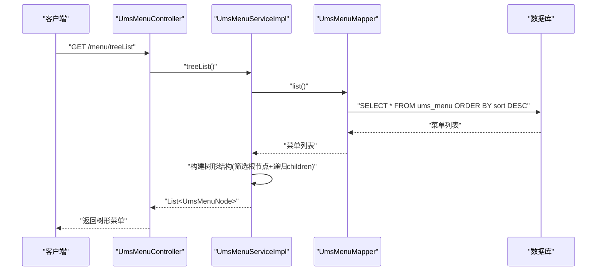
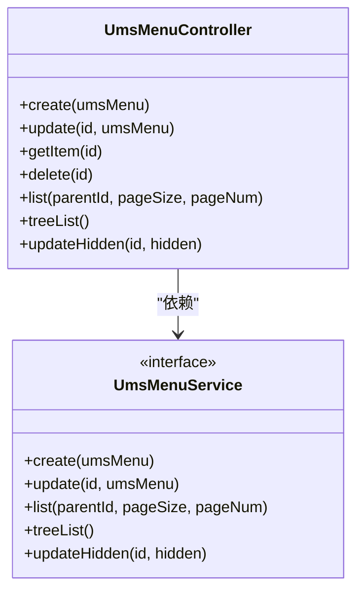
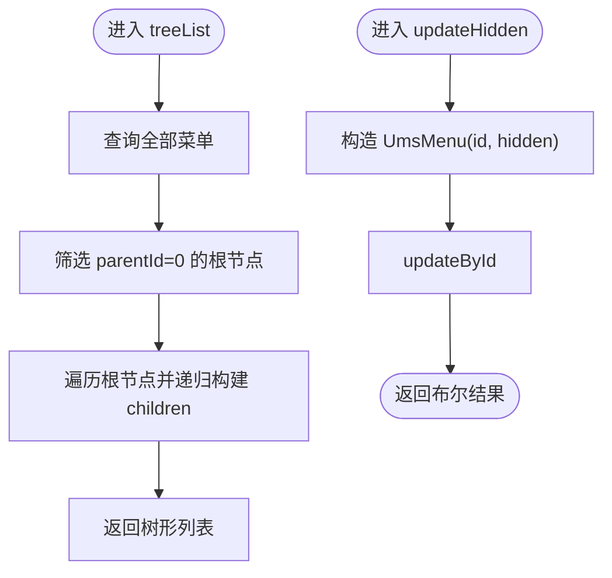
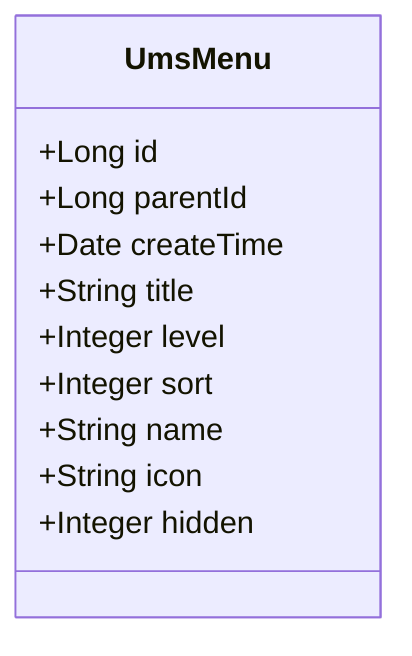
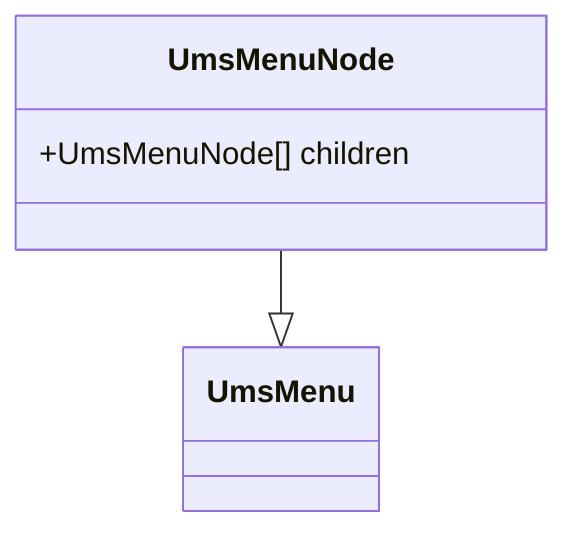
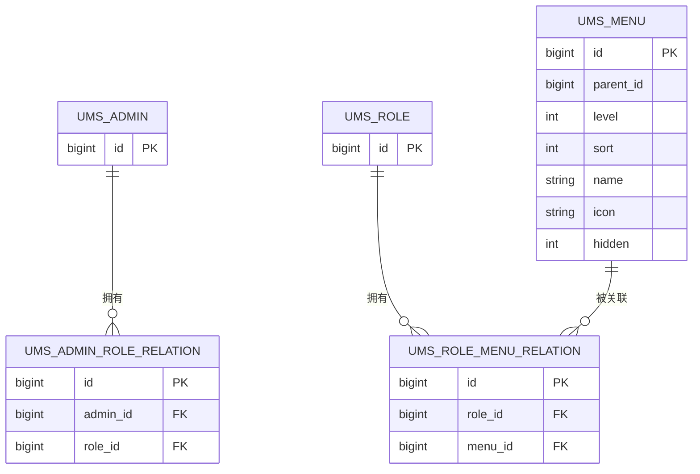
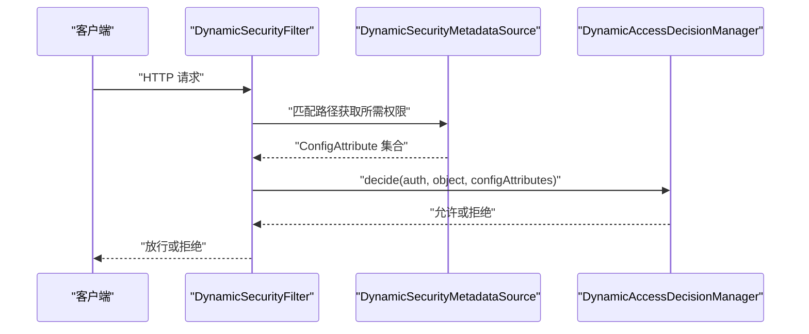
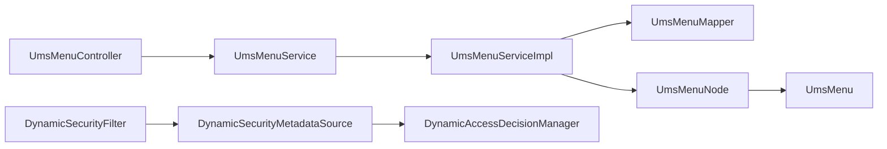

# 菜单管理模块

<cite>
**本文引用的文件**
- [UmsMenuController.java](file://src/main/java/com/macro/mall/tiny/modules/ums/controller/UmsMenuController.java)
- [UmsMenuService.java](file://src/main/java/com/macro/mall/tiny/modules/ums/service/UmsMenuService.java)
- [UmsMenuServiceImpl.java](file://src/main/java/com/macro/mall/tiny/modules/ums/service/impl/UmsMenuServiceImpl.java)
- [UmsMenu.java](file://src/main/java/com/macro/mall/tiny/modules/ums/model/UmsMenu.java)
- [UmsMenuNode.java](file://src/main/java/com/macro/mall/tiny/modules/ums/dto/UmsMenuNode.java)
- [UmsMenuMapper.java](file://src/main/java/com/macro/mall/tiny/modules/ums/mapper/UmsMenuMapper.java)
- [UmsMenuMapper.xml](file://src/main/resources/mapper/ums/UmsMenuMapper.xml)
- [mall_tiny.sql](file://sql/mall_tiny.sql)
- [DynamicSecurityFilter.java](file://src/main/java/com/macro/mall/tiny/security/component/DynamicSecurityFilter.java)
- [DynamicAccessDecisionManager.java](file://src/main/java/com/macro/mall/tiny/security/component/DynamicAccessDecisionManager.java)
- [DynamicSecurityMetadataSource.java](file://src/main/java/com/macro/mall/tiny/security/component/DynamicSecurityMetadataSource.java)
- [DynamicSecurityService.java](file://src/main/java/com/macro/mall/tiny/security/component/DynamicSecurityService.java)
</cite>

## 目录
1. [简介](#简介)
2. [项目结构](#项目结构)
3. [核心组件](#核心组件)
4. [架构总览](#架构总览)
5. [详细组件分析](#详细组件分析)
6. [依赖分析](#依赖分析)
7. [性能考虑](#性能考虑)
8. [故障排查指南](#故障排查指南)
9. [结论](#结论)
10. [附录](#附录)

## 简介
本文件系统性梳理“菜单管理模块”的设计与实现，覆盖动态菜单管理的核心能力：菜单创建、层级管理、权限控制、动态展示等。重点解析控制器 UmsMenuController 的 API 设计、服务层 UmsMenuServiceImpl 的业务逻辑、实体模型 UmsMenu 与节点模型 UmsMenuNode 的数据结构，并结合数据库与动态权限过滤链路，给出完整的菜单管理 API 文档与权限体系说明。

## 项目结构
菜单管理模块位于 ums 子系统中，采用典型的分层架构：
- 控制层：UmsMenuController 提供 REST API
- 服务层：UmsMenuService 及其实现 UmsMenuServiceImpl
- 数据访问层：UmsMenuMapper 及其 XML 映射
- 模型与 DTO：UmsMenu（实体）、UmsMenuNode（树节点）
- 权限控制：Spring Security 动态权限过滤链与菜单关联

```mermaid
graph TB
subgraph "控制层"
C1["UmsMenuController"]
end
subgraph "服务层"
S1["UmsMenuService"]
S2["UmsMenuServiceImpl"]
end
subgraph "数据访问层"
M1["UmsMenuMapper"]
MX["UmsMenuMapper.xml"]
end
subgraph "模型与DTO"
E1["UmsMenu"]
D1["UmsMenuNode"]
end
subgraph "权限控制"
P1["DynamicSecurityFilter"]
P2["DynamicSecurityMetadataSource"]
P3["DynamicAccessDecisionManager"]
end
C1 --> S1
S1 < --> S2
S2 --> M1
M1 --> MX
S2 --> D1
D1 --> E1
P1 --> P2
P2 --> P3
```

图表来源
- [UmsMenuController.java:22-106](file://src/main/java/com/macro/mall/tiny/modules/ums/controller/UmsMenuController.java#L22-L106)
- [UmsMenuService.java:15-41](file://src/main/java/com/macro/mall/tiny/modules/ums/service/UmsMenuService.java#L15-L41)
- [UmsMenuServiceImpl.java:21-95](file://src/main/java/com/macro/mall/tiny/modules/ums/service/impl/UmsMenuServiceImpl.java#L21-L95)
- [UmsMenuMapper.java:17-28](file://src/main/java/com/macro/mall/tiny/modules/ums/mapper/UmsMenuMapper.java#L17-L28)
- [UmsMenuMapper.xml:3-62](file://src/main/resources/mapper/ums/UmsMenuMapper.xml#L3-L62)
- [UmsMenu.java:25-58](file://src/main/java/com/macro/mall/tiny/modules/ums/model/UmsMenu.java#L25-L58)
- [UmsMenuNode.java:14-20](file://src/main/java/com/macro/mall/tiny/modules/ums/dto/UmsMenuNode.java#L14-L20)
- [DynamicSecurityFilter.java:23-83](file://src/main/java/com/macro/mall/tiny/security/component/DynamicSecurityFilter.java#L23-L83)
- [DynamicSecurityMetadataSource.java:18-65](file://src/main/java/com/macro/mall/tiny/security/component/DynamicSecurityMetadataSource.java#L18-L65)
- [DynamicAccessDecisionManager.java:18-52](file://src/main/java/com/macro/mall/tiny/security/component/DynamicAccessDecisionManager.java#L18-L52)

章节来源
- [UmsMenuController.java:22-106](file://src/main/java/com/macro/mall/tiny/modules/ums/controller/UmsMenuController.java#L22-L106)
- [UmsMenuService.java:15-41](file://src/main/java/com/macro/mall/tiny/modules/ums/service/UmsMenuService.java#L15-L41)
- [UmsMenuServiceImpl.java:21-95](file://src/main/java/com/macro/mall/tiny/modules/ums/service/impl/UmsMenuServiceImpl.java#L21-L95)
- [UmsMenuMapper.java:17-28](file://src/main/java/com/macro/mall/tiny/modules/ums/mapper/UmsMenuMapper.java#L17-L28)
- [UmsMenuMapper.xml:3-62](file://src/main/resources/mapper/ums/UmsMenuMapper.xml#L3-L62)
- [UmsMenu.java:25-58](file://src/main/java/com/macro/mall/tiny/modules/ums/model/UmsMenu.java#L25-L58)
- [UmsMenuNode.java:14-20](file://src/main/java/com/macro/mall/tiny/modules/ums/dto/UmsMenuNode.java#L14-L20)

## 核心组件
- UmsMenuController：提供菜单 CRUD、分页查询、树形结构返回、显示状态更新等接口。
- UmsMenuService：定义菜单管理的业务契约。
- UmsMenuServiceImpl：实现菜单层级计算、树形构建、分页查询、显示状态更新。
- UmsMenu：菜单实体，包含父子关系、层级、排序、前端展示字段等。
- UmsMenuNode：树形节点 DTO，扩展 children 字段用于前端渲染。
- UmsMenuMapper：菜单数据访问接口，提供按用户/角色查询菜单列表的方法。
- UmsMenuMapper.xml：SQL 映射，支持按管理员与角色维度查询菜单。
- 动态权限组件：DynamicSecurityFilter、DynamicSecurityMetadataSource、DynamicAccessDecisionManager，配合资源权限体系实现菜单级权限控制。

章节来源
- [UmsMenuController.java:22-106](file://src/main/java/com/macro/mall/tiny/modules/ums/controller/UmsMenuController.java#L22-L106)
- [UmsMenuService.java:15-41](file://src/main/java/com/macro/mall/tiny/modules/ums/service/UmsMenuService.java#L15-L41)
- [UmsMenuServiceImpl.java:21-95](file://src/main/java/com/macro/mall/tiny/modules/ums/service/impl/UmsMenuServiceImpl.java#L21-L95)
- [UmsMenu.java:25-58](file://src/main/java/com/macro/mall/tiny/modules/ums/model/UmsMenu.java#L25-L58)
- [UmsMenuNode.java:14-20](file://src/main/java/com/macro/mall/tiny/modules/ums/dto/UmsMenuNode.java#L14-L20)
- [UmsMenuMapper.java:17-28](file://src/main/java/com/macro/mall/tiny/modules/ums/mapper/UmsMenuMapper.java#L17-L28)
- [UmsMenuMapper.xml:18-59](file://src/main/resources/mapper/ums/UmsMenuMapper.xml#L18-L59)

## 架构总览
菜单管理的端到端流程如下：
- 控制器接收请求，调用服务层执行业务逻辑
- 服务层通过 MyBatis Plus 访问数据库，构建树形结构或执行分页查询
- 树形结构由 UmsMenuNode 承载，便于前端递归渲染
- 动态权限过滤链根据请求路径匹配资源权限，决定是否放行



图表来源
- [UmsMenuController.java:86-92](file://src/main/java/com/macro/mall/tiny/modules/ums/controller/UmsMenuController.java#L86-L92)
- [UmsMenuServiceImpl.java:65-93](file://src/main/java/com/macro/mall/tiny/modules/ums/service/impl/UmsMenuServiceImpl.java#L65-L93)
- [UmsMenuMapper.xml:3-16](file://src/main/resources/mapper/ums/UmsMenuMapper.xml#L3-L16)

## 详细组件分析

### 控制器：UmsMenuController
- 职责：暴露菜单管理的 REST API，负责参数接收、响应封装与调用服务层。
- 关键接口
  - POST /menu/create：新增菜单
  - POST /menu/update/{id}：更新菜单
  - GET /menu/{id}：按 ID 获取菜单详情
  - POST /menu/delete/{id}：删除菜单
  - GET /menu/list/{parentId}：分页查询某父级下的菜单
  - GET /menu/treeList：返回树形结构菜单列表
  - POST /menu/updateHidden/{id}：更新菜单显示状态



图表来源
- [UmsMenuController.java:22-106](file://src/main/java/com/macro/mall/tiny/modules/ums/controller/UmsMenuController.java#L22-L106)
- [UmsMenuService.java:15-41](file://src/main/java/com/macro/mall/tiny/modules/ums/service/UmsMenuService.java#L15-L41)

章节来源
- [UmsMenuController.java:22-106](file://src/main/java/com/macro/mall/tiny/modules/ums/controller/UmsMenuController.java#L22-L106)

### 服务层：UmsMenuServiceImpl
- 职责：实现菜单业务逻辑，包括层级计算、树形构建、分页查询、显示状态更新。
- 关键实现要点
  - 层级计算：根据 parentId 决定 level，0 表示一级菜单
  - 树形构建：从全量菜单中筛选根节点，递归生成 children
  - 分页查询：按父级 ID 查询并按 sort 倒序
  - 显示状态更新：仅更新 hidden 字段



图表来源
- [UmsMenuServiceImpl.java:65-93](file://src/main/java/com/macro/mall/tiny/modules/ums/service/impl/UmsMenuServiceImpl.java#L65-L93)
- [UmsMenuServiceImpl.java:74-80](file://src/main/java/com/macro/mall/tiny/modules/ums/service/impl/UmsMenuServiceImpl.java#L74-L80)

章节来源
- [UmsMenuServiceImpl.java:21-95](file://src/main/java/com/macro/mall/tiny/modules/ums/service/impl/UmsMenuServiceImpl.java#L21-L95)

### 实体模型：UmsMenu
- 字段说明
  - id：主键
  - parentId：父级 ID，0 表示一级菜单
  - createTime：创建时间
  - title：菜单名称
  - level：菜单级数（由服务层计算）
  - sort：菜单排序（用于分页查询排序）
  - name：前端路由名称
  - icon：前端图标
  - hidden：前端隐藏标志



图表来源
- [UmsMenu.java:25-58](file://src/main/java/com/macro/mall/tiny/modules/ums/model/UmsMenu.java#L25-L58)

章节来源
- [UmsMenu.java:25-58](file://src/main/java/com/macro/mall/tiny/modules/ums/model/UmsMenu.java#L25-L58)

### 节点模型：UmsMenuNode
- 继承自 UmsMenu，扩展 children 字段，用于树形结构渲染。
- 作用：在服务层将 UmsMenu 列表转换为树形结构，便于前端递归渲染。



图表来源
- [UmsMenuNode.java:14-20](file://src/main/java/com/macro/mall/tiny/modules/ums/dto/UmsMenuNode.java#L14-L20)
- [UmsMenu.java:25-58](file://src/main/java/com/macro/mall/tiny/modules/ums/model/UmsMenu.java#L25-L58)

章节来源
- [UmsMenuNode.java:14-20](file://src/main/java/com/macro/mall/tiny/modules/ums/dto/UmsMenuNode.java#L14-L20)

### 数据访问层：UmsMenuMapper 与 SQL 映射
- 方法
  - getMenuList(adminId)：按管理员 ID 查询其可访问的菜单列表
  - getMenuListByRoleId(roleId)：按角色 ID 查询菜单列表
- SQL 特点
  - 通过中间表关联角色、角色菜单关系与菜单表
  - 支持去重与按菜单 ID 分组



图表来源
- [UmsMenuMapper.xml:18-59](file://src/main/resources/mapper/ums/UmsMenuMapper.xml#L18-L59)
- [mall_tiny.sql:91-134](file://sql/mall_tiny.sql#L91-L134)

章节来源
- [UmsMenuMapper.java:17-28](file://src/main/java/com/macro/mall/tiny/modules/ums/mapper/UmsMenuMapper.java#L17-L28)
- [UmsMenuMapper.xml:3-62](file://src/main/resources/mapper/ums/UmsMenuMapper.xml#L3-L62)
- [mall_tiny.sql:91-134](file://sql/mall_tiny.sql#L91-L134)

### 权限控制与动态加载机制
- 动态权限过滤链
  - DynamicSecurityFilter：拦截请求，跳过 OPTIONS 与白名单，调用决策器
  - DynamicSecurityMetadataSource：根据请求路径匹配资源权限规则
  - DynamicAccessDecisionManager：校验用户权限集合是否包含所需权限
- 菜单与权限的关系
  - 菜单通过角色菜单关系与角色关联
  - 用户通过角色关系获得菜单集合
  - 动态权限链根据请求路径匹配资源权限，实现菜单级访问控制



图表来源
- [DynamicSecurityFilter.java:39-66](file://src/main/java/com/macro/mall/tiny/security/component/DynamicSecurityFilter.java#L39-L66)
- [DynamicSecurityMetadataSource.java:34-52](file://src/main/java/com/macro/mall/tiny/security/component/DynamicSecurityMetadataSource.java#L34-L52)
- [DynamicAccessDecisionManager.java:20-39](file://src/main/java/com/macro/mall/tiny/security/component/DynamicAccessDecisionManager.java#L20-L39)

章节来源
- [DynamicSecurityFilter.java:23-83](file://src/main/java/com/macro/mall/tiny/security/component/DynamicSecurityFilter.java#L23-L83)
- [DynamicSecurityMetadataSource.java:18-65](file://src/main/java/com/macro/mall/tiny/security/component/DynamicSecurityMetadataSource.java#L18-L65)
- [DynamicAccessDecisionManager.java:18-52](file://src/main/java/com/macro/mall/tiny/security/component/DynamicAccessDecisionManager.java#L18-L52)

## 依赖分析
- 控制器依赖服务接口，服务实现依赖 Mapper 与 MyBatis Plus
- 树形构建依赖 UmsMenuNode 对象，继承 UmsMenu
- 权限控制依赖 Spring Security 动态权限组件与资源权限配置



图表来源
- [UmsMenuController.java:22-106](file://src/main/java/com/macro/mall/tiny/modules/ums/controller/UmsMenuController.java#L22-L106)
- [UmsMenuService.java:15-41](file://src/main/java/com/macro/mall/tiny/modules/ums/service/UmsMenuService.java#L15-L41)
- [UmsMenuServiceImpl.java:21-95](file://src/main/java/com/macro/mall/tiny/modules/ums/service/impl/UmsMenuServiceImpl.java#L21-L95)
- [UmsMenuMapper.java:17-28](file://src/main/java/com/macro/mall/tiny/modules/ums/mapper/UmsMenuMapper.java#L17-L28)
- [UmsMenuNode.java:14-20](file://src/main/java/com/macro/mall/tiny/modules/ums/dto/UmsMenuNode.java#L14-L20)
- [UmsMenu.java:25-58](file://src/main/java/com/macro/mall/tiny/modules/ums/model/UmsMenu.java#L25-L58)
- [DynamicSecurityFilter.java:23-83](file://src/main/java/com/macro/mall/tiny/security/component/DynamicSecurityFilter.java#L23-L83)
- [DynamicSecurityMetadataSource.java:18-65](file://src/main/java/com/macro/mall/tiny/security/component/DynamicSecurityMetadataSource.java#L18-L65)
- [DynamicAccessDecisionManager.java:18-52](file://src/main/java/com/macro/mall/tiny/security/component/DynamicAccessDecisionManager.java#L18-L52)

章节来源
- [UmsMenuController.java:22-106](file://src/main/java/com/macro/mall/tiny/modules/ums/controller/UmsMenuController.java#L22-L106)
- [UmsMenuServiceImpl.java:21-95](file://src/main/java/com/macro/mall/tiny/modules/ums/service/impl/UmsMenuServiceImpl.java#L21-L95)
- [UmsMenuMapper.java:17-28](file://src/main/java/com/macro/mall/tiny/modules/ums/mapper/UmsMenuMapper.java#L17-L28)
- [UmsMenuNode.java:14-20](file://src/main/java/com/macro/mall/tiny/modules/ums/dto/UmsMenuNode.java#L14-L20)
- [UmsMenu.java:25-58](file://src/main/java/com/macro/mall/tiny/modules/ums/model/UmsMenu.java#L25-L58)
- [DynamicSecurityFilter.java:23-83](file://src/main/java/com/macro/mall/tiny/security/component/DynamicSecurityFilter.java#L23-L83)
- [DynamicSecurityMetadataSource.java:18-65](file://src/main/java/com/macro/mall/tiny/security/component/DynamicSecurityMetadataSource.java#L18-L65)
- [DynamicAccessDecisionManager.java:18-52](file://src/main/java/com/macro/mall/tiny/security/component/DynamicAccessDecisionManager.java#L18-L52)

## 性能考虑
- 树形构建：当前实现对全量菜单进行一次遍历并递归筛选，时间复杂度 O(n^2)，适合中小规模菜单。若菜单量较大，建议：
  - 在数据库侧维护 level 与 parentId 索引
  - 使用一次性查询构建邻接表，再进行树构建
- 分页查询：已按 sort 倒序并使用分页包装，避免一次性加载过多数据
- 权限匹配：动态权限链在每次请求时进行路径匹配，建议：
  - 缓存权限规则映射表
  - 对热点路径进行预热

## 故障排查指南
- 树形菜单为空
  - 检查是否存在 parentId=0 的根节点
  - 确认服务层筛选逻辑与数据库记录一致
- 菜单层级不正确
  - 确认父菜单存在且 level 正确
  - 检查服务层 updateLevel 的分支逻辑
- 权限控制异常
  - 检查动态权限过滤链是否生效
  - 确认请求路径与资源权限规则匹配
  - 核对用户角色与菜单关系是否正确

章节来源
- [UmsMenuServiceImpl.java:34-47](file://src/main/java/com/macro/mall/tiny/modules/ums/service/impl/UmsMenuServiceImpl.java#L34-L47)
- [UmsMenuMapper.xml:18-59](file://src/main/resources/mapper/ums/UmsMenuMapper.xml#L18-L59)
- [DynamicSecurityFilter.java:39-66](file://src/main/java/com/macro/mall/tiny/security/component/DynamicSecurityFilter.java#L39-L66)
- [DynamicSecurityMetadataSource.java:34-52](file://src/main/java/com/macro/mall/tiny/security/component/DynamicSecurityMetadataSource.java#L34-L52)

## 结论
菜单管理模块以清晰的分层设计实现了动态菜单的增删改查、层级管理与树形展示，并通过动态权限过滤链实现菜单级访问控制。服务层在构建树形结构与层级计算方面逻辑简洁高效，适合中小规模应用场景。对于大规模菜单与高并发场景，建议引入缓存与数据库索引优化，以进一步提升性能与稳定性。

## 附录

### 完整菜单管理 API 文档
- 新增菜单
  - 方法：POST
  - 路径：/menu/create
  - 参数：UmsMenu（除 id 外）
  - 返回：CommonResult<Boolean>
- 更新菜单
  - 方法：POST
  - 路径：/menu/update/{id}
  - 参数：UmsMenu（包含 id）
  - 返回：CommonResult<Boolean>
- 获取菜单详情
  - 方法：GET
  - 路径：/menu/{id}
  - 返回：CommonResult<UmsMenu>
- 删除菜单
  - 方法：POST
  - 路径：/menu/delete/{id}
  - 返回：CommonResult<Boolean>
- 分页查询菜单
  - 方法：GET
  - 路径：/menu/list/{parentId}
  - 查询参数：pageSize（默认5）、pageNum（默认1）
  - 返回：CommonResult<CommonPage<UmsMenu>>
- 树形结构返回菜单
  - 方法：GET
  - 路径：/menu/treeList
  - 返回：CommonResult<List<UmsMenuNode>>
- 更新菜单显示状态
  - 方法：POST
  - 路径：/menu/updateHidden/{id}
  - 查询参数：hidden（0/1）
  - 返回：CommonResult<Boolean>

章节来源
- [UmsMenuController.java:31-104](file://src/main/java/com/macro/mall/tiny/modules/ums/controller/UmsMenuController.java#L31-L104)

### 菜单权限体系设计原理
- 角色与菜单：通过 ums_role_menu_relation 将角色与菜单关联
- 用户与角色：通过 ums_admin_role_relation 将用户与角色关联
- 动态权限：请求路径与资源权限规则匹配，决定是否放行
- 菜单展示：前端根据后端返回的树形菜单与权限规则进行渲染与控制

章节来源
- [UmsMenuMapper.xml:18-59](file://src/main/resources/mapper/ums/UmsMenuMapper.xml#L18-L59)
- [mall_tiny.sql:67-134](file://sql/mall_tiny.sql#L67-L134)
- [DynamicSecurityFilter.java:39-66](file://src/main/java/com/macro/mall/tiny/security/component/DynamicSecurityFilter.java#L39-L66)
- [DynamicSecurityMetadataSource.java:34-52](file://src/main/java/com/macro/mall/tiny/security/component/DynamicSecurityMetadataSource.java#L34-L52)
- [DynamicAccessDecisionManager.java:20-39](file://src/main/java/com/macro/mall/tiny/security/component/DynamicAccessDecisionManager.java#L20-L39)