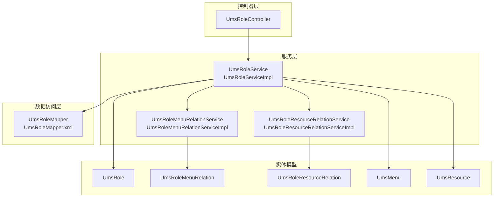
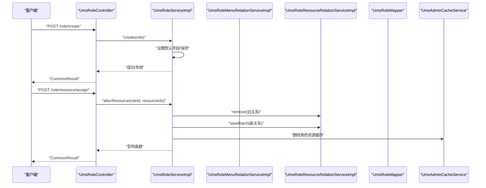
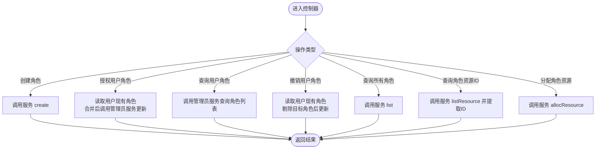
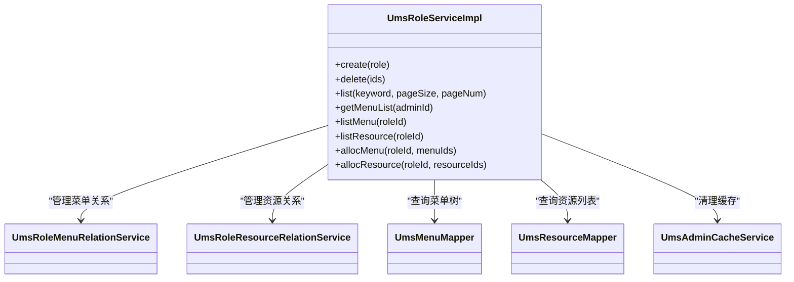
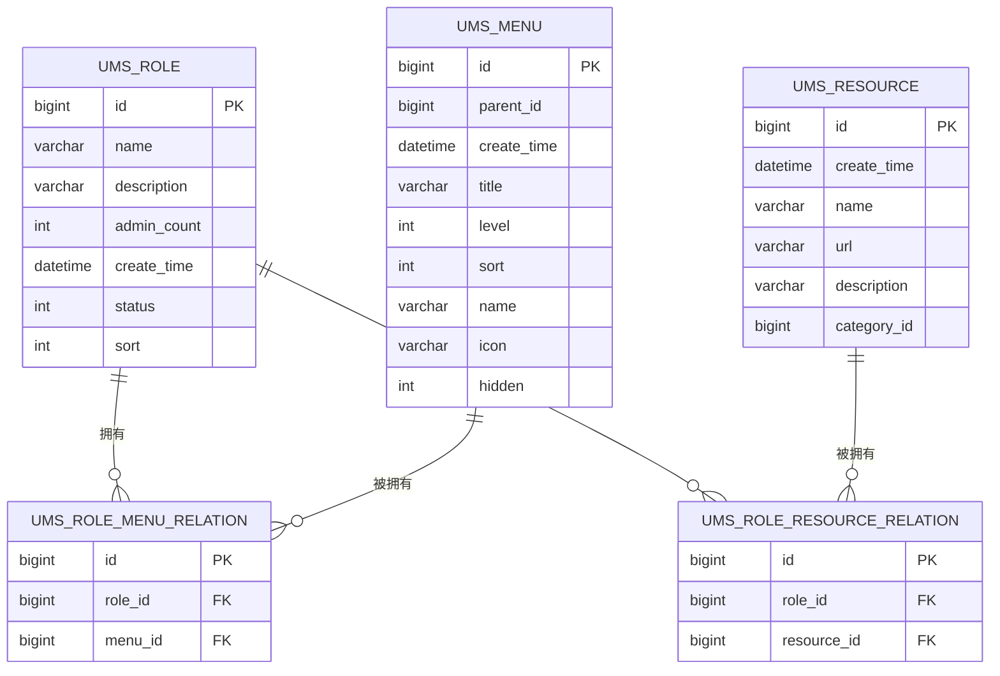
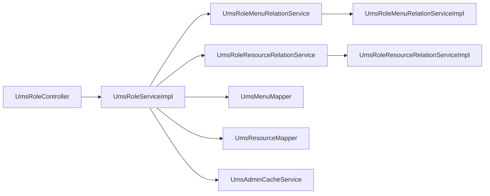

# 角色管理模块

<cite>
**本文引用的文件**
- [UmsRoleController.java](file://src/main/java/com/macro/mall/tiny/modules/ums/controller/UmsRoleController.java)
- [UmsRoleServiceImpl.java](file://src/main/java/com/macro/mall/tiny/modules/ums/service/impl/UmsRoleServiceImpl.java)
- [UmsRoleService.java](file://src/main/java/com/macro/mall/tiny/modules/ums/service/UmsRoleService.java)
- [UmsRole.java](file://src/main/java/com/macro/mall/tiny/modules/ums/model/UmsRole.java)
- [UmsRoleMenuRelation.java](file://src/main/java/com/macro/mall/tiny/modules/ums/model/UmsRoleMenuRelation.java)
- [UmsRoleResourceRelation.java](file://src/main/java/com/macro/mall/tiny/modules/ums/model/UmsRoleResourceRelation.java)
- [UmsMenu.java](file://src/main/java/com/macro/mall/tiny/modules/ums/model/UmsMenu.java)
- [UmsResource.java](file://src/main/java/com/macro/mall/tiny/modules/ums/model/UmsResource.java)
- [UmsRoleMapper.java](file://src/main/java/com/macro/mall/tiny/modules/ums/mapper/UmsRoleMapper.java)
- [UmsRoleMapper.xml](file://src/main/resources/mapper/ums/UmsRoleMapper.xml)
- [UmsRoleMenuRelationService.java](file://src/main/java/com/macro/mall/tiny/modules/ums/service/UmsRoleMenuRelationService.java)
- [UmsRoleMenuRelationServiceImpl.java](file://src/main/java/com/macro/mall/tiny/modules/ums/service/impl/UmsRoleMenuRelationServiceImpl.java)
- [UmsRoleResourceRelationService.java](file://src/main/java/com/macro/mall/tiny/modules/ums/service/UmsRoleResourceRelationService.java)
- [UmsRoleResourceRelationServiceImpl.java](file://src/main/java/com/macro/mall/tiny/modules/ums/service/impl/UmsRoleResourceRelationServiceImpl.java)
- [UmsMenuService.java](file://src/main/java/com/macro/mall/tiny/modules/ums/service/UmsMenuService.java)
- [init_role.sql](file://sql/init_role.sql)
</cite>

## 目录
1. [简介](#简介)
2. [项目结构](#项目结构)
3. [核心组件](#核心组件)
4. [架构总览](#架构总览)
5. [详细组件分析](#详细组件分析)
6. [依赖分析](#依赖分析)
7. [性能考量](#性能考量)
8. [故障排查指南](#故障排查指南)
9. [结论](#结论)
10. [附录](#附录)

## 简介
本文件系统性梳理“角色管理模块”的设计与实现，覆盖角色的创建、查询、删除、状态管理，以及角色与菜单、资源的权限分配与关系维护。文档重点解析以下内容：
- 控制器 UmsRoleController 的 API 设计与调用流程
- 服务层 UmsRoleServiceImpl 的业务逻辑与事务处理
- 实体模型 UmsRole、UmsRoleMenuRelation、UmsRoleResourceRelation 的字段与关系
- 角色权限体系与最佳实践、安全注意事项
- 面向不同层次开发者的分层技术深度说明

## 项目结构
角色管理模块位于 ums 子系统中，采用典型的分层架构：控制器层、服务层、数据访问层（Mapper/MyBatis）、实体模型层。关键文件分布如下：
- 控制器：UmsRoleController
- 服务接口与实现：UmsRoleService、UmsRoleServiceImpl
- 关联关系服务：UmsRoleMenuRelationService、UmsRoleResourceRelationService 及其实现
- 实体模型：UmsRole、UmsRoleMenuRelation、UmsRoleResourceRelation、UmsMenu、UmsResource
- 数据访问：UmsRoleMapper 及其 XML 映射
- 初始化脚本：init_role.sql

图表来源
- [UmsRoleController.java:1-174](file://src/main/java/com/macro/mall/tiny/modules/ums/controller/UmsRoleController.java#L1-L174)
- [UmsRoleServiceImpl.java:1-117](file://src/main/java/com/macro/mall/tiny/modules/ums/service/impl/UmsRoleServiceImpl.java#L1-L117)
- [UmsRoleService.java:1-59](file://src/main/java/com/macro/mall/tiny/modules/ums/service/UmsRoleService.java#L1-L59)
- [UmsRoleMapper.java:1-25](file://src/main/java/com/macro/mall/tiny/modules/ums/mapper/UmsRoleMapper.java#L1-L25)
- [UmsRoleMapper.xml:1-23](file://src/main/resources/mapper/ums/UmsRoleMapper.xml#L1-L23)
- [UmsRoleMenuRelationService.java:1-12](file://src/main/java/com/macro/mall/tiny/modules/ums/service/UmsRoleMenuRelationService.java#L1-L12)
- [UmsRoleMenuRelationServiceImpl.java:1-16](file://src/main/java/com/macro/mall/tiny/modules/ums/service/impl/UmsRoleMenuRelationServiceImpl.java#L1-L16)
- [UmsRoleResourceRelationService.java:1-12](file://src/main/java/com/macro/mall/tiny/modules/ums/service/UmsRoleResourceRelationService.java#L1-L12)
- [UmsRoleResourceRelationServiceImpl.java:1-16](file://src/main/java/com/macro/mall/tiny/modules/ums/service/impl/UmsRoleResourceRelationServiceImpl.java#L1-L16)
- [UmsRole.java:1-51](file://src/main/java/com/macro/mall/tiny/modules/ums/model/UmsRole.java#L1-L51)
- [UmsRoleMenuRelation.java:1-39](file://src/main/java/com/macro/mall/tiny/modules/ums/model/UmsRoleMenuRelation.java#L1-L39)
- [UmsRoleResourceRelation.java:1-39](file://src/main/java/com/macro/mall/tiny/modules/ums/model/UmsRoleResourceRelation.java#L1-L39)
- [UmsMenu.java:1-58](file://src/main/java/com/macro/mall/tiny/modules/ums/model/UmsMenu.java#L1-L58)
- [UmsResource.java:1-49](file://src/main/java/com/macro/mall/tiny/modules/ums/model/UmsResource.java#L1-L49)

章节来源
- [UmsRoleController.java:1-174](file://src/main/java/com/macro/mall/tiny/modules/ums/controller/UmsRoleController.java#L1-L174)
- [UmsRoleServiceImpl.java:1-117](file://src/main/java/com/macro/mall/tiny/modules/ums/service/impl/UmsRoleServiceImpl.java#L1-L117)
- [UmsRoleService.java:1-59](file://src/main/java/com/macro/mall/tiny/modules/ums/service/UmsRoleService.java#L1-L59)
- [UmsRoleMapper.java:1-25](file://src/main/java/com/macro/mall/tiny/modules/ums/mapper/UmsRoleMapper.java#L1-L25)
- [UmsRoleMapper.xml:1-23](file://src/main/resources/mapper/ums/UmsRoleMapper.xml#L1-L23)

## 核心组件
- 控制器 UmsRoleController：提供角色 CRUD、角色与用户的授权/撤销、角色与资源的分配、角色菜单与资源查询等接口。
- 服务接口 UmsRoleService：定义角色管理的业务契约，包括创建、删除、分页查询、菜单/资源查询、菜单/资源分配等。
- 服务实现 UmsRoleServiceImpl：具体业务逻辑，包括角色初始化字段、删除后的缓存清理、菜单/资源关系的全量替换、事务控制等。
- 实体模型：
  - UmsRole：角色基本信息（名称、描述、状态、排序、创建时间等）
  - UmsRoleMenuRelation：角色-菜单关联表
  - UmsRoleResourceRelation：角色-资源关联表
  - UmsMenu：菜单信息
  - UmsResource：资源信息
- 关联关系服务：UmsRoleMenuRelationService、UmsRoleResourceRelationService 提供对中间表的增删改查能力。

章节来源
- [UmsRoleController.java:1-174](file://src/main/java/com/macro/mall/tiny/modules/ums/controller/UmsRoleController.java#L1-L174)
- [UmsRoleService.java:1-59](file://src/main/java/com/macro/mall/tiny/modules/ums/service/UmsRoleService.java#L1-L59)
- [UmsRoleServiceImpl.java:1-117](file://src/main/java/com/macro/mall/tiny/modules/ums/service/impl/UmsRoleServiceImpl.java#L1-L117)
- [UmsRole.java:1-51](file://src/main/java/com/macro/mall/tiny/modules/ums/model/UmsRole.java#L1-L51)
- [UmsRoleMenuRelation.java:1-39](file://src/main/java/com/macro/mall/tiny/modules/ums/model/UmsRoleMenuRelation.java#L1-L39)
- [UmsRoleResourceRelation.java:1-39](file://src/main/java/com/macro/mall/tiny/modules/ums/model/UmsRoleResourceRelation.java#L1-L39)
- [UmsMenu.java:1-58](file://src/main/java/com/macro/mall/tiny/modules/ums/model/UmsMenu.java#L1-L58)
- [UmsResource.java:1-49](file://src/main/java/com/macro/mall/tiny/modules/ums/model/UmsResource.java#L1-L49)

## 架构总览
角色管理模块遵循经典的分层架构，控制器负责对外暴露 API，服务层封装业务规则与事务，数据访问层负责持久化，实体模型承载数据结构。

图表来源
- [UmsRoleController.java:34-124](file://src/main/java/com/macro/mall/tiny/modules/ums/controller/UmsRoleController.java#L34-L124)
- [UmsRoleServiceImpl.java:40-115](file://src/main/java/com/macro/mall/tiny/modules/ums/service/impl/UmsRoleServiceImpl.java#L40-L115)
- [UmsRoleResourceRelationServiceImpl.java:1-16](file://src/main/java/com/macro/mall/tiny/modules/ums/service/impl/UmsRoleResourceRelationServiceImpl.java#L1-L16)

## 详细组件分析

### 控制器：UmsRoleController
- 职责
  - 角色创建：接收角色对象，调用服务层创建并返回统一结果包装。
  - 用户角色授权/撤销：通过合并用户已有角色与目标角色，调用管理员服务更新用户角色集合。
  - 查询用户角色：根据管理员 ID 查询其角色列表。
  - 查询所有角色：分页或全量查询角色列表。
  - 角色资源查询与分配：支持查询角色已绑定的资源 ID 列表，并支持全量替换分配。
  - 角色菜单查询与分配：支持查询角色菜单树及全量替换分配（当前服务实现中提供方法，控制器未直接暴露）。
- 参数与返回
  - 授权/撤销参数：GrantRoleParam（adminId、roleId）
  - 资源分配参数：AssignResourceParam（roleId、resourceIds）
  - 返回值：统一使用 CommonResult 包装，包含状态码、消息与数据。

图表来源
- [UmsRoleController.java:34-124](file://src/main/java/com/macro/mall/tiny/modules/ums/controller/UmsRoleController.java#L34-L124)

章节来源
- [UmsRoleController.java:1-174](file://src/main/java/com/macro/mall/tiny/modules/ums/controller/UmsRoleController.java#L1-L174)

### 服务层：UmsRoleServiceImpl
- 职责
  - 角色创建：设置默认字段（创建时间、管理员数量、排序），保存角色。
  - 角色删除：批量删除角色，并清理相关角色的资源缓存。
  - 角色分页查询：支持按关键字模糊查询。
  - 菜单/资源查询：基于角色 ID 查询菜单树或资源列表。
  - 菜单/资源分配：全量替换角色与菜单/资源的关联关系，保证一致性。
  - 事务控制：分配操作使用事务，确保删除旧关系与插入新关系的原子性。
- 关键点
  - 删除后清理缓存：避免脏数据导致权限判断异常。
  - 全量替换策略：先删除旧关系，再批量插入新关系，简化权限变更逻辑。
  - 与菜单/资源 Mapper 的协作：通过自定义 SQL 获取菜单树与资源列表。

图表来源
- [UmsRoleServiceImpl.java:27-117](file://src/main/java/com/macro/mall/tiny/modules/ums/service/impl/UmsRoleServiceImpl.java#L27-L117)
- [UmsRoleMenuRelationService.java:1-12](file://src/main/java/com/macro/mall/tiny/modules/ums/service/UmsRoleMenuRelationService.java#L1-L12)
- [UmsRoleResourceRelationService.java:1-12](file://src/main/java/com/macro/mall/tiny/modules/ums/service/UmsRoleResourceRelationService.java#L1-L12)

章节来源
- [UmsRoleServiceImpl.java:1-117](file://src/main/java/com/macro/mall/tiny/modules/ums/service/impl/UmsRoleServiceImpl.java#L1-L117)
- [UmsRoleService.java:1-59](file://src/main/java/com/macro/mall/tiny/modules/ums/service/UmsRoleService.java#L1-L59)

### 实体模型：UmsRole、UmsRoleMenuRelation、UmsRoleResourceRelation
- UmsRole：角色主表，包含名称、描述、状态、排序、创建时间等字段，用于标识角色的基本属性与启用状态。
- UmsRoleMenuRelation：角色与菜单的多对多中间表，记录角色与菜单的绑定关系。
- UmsRoleResourceRelation：角色与资源的多对多中间表，记录角色与资源的绑定关系。
- UmsMenu：菜单表，包含父级 ID、层级、排序、前端名称与图标等，支撑菜单树构建。
- UmsResource：资源表，包含资源名称、URL、分类等，支撑细粒度权限控制。

图表来源
- [UmsRole.java:25-51](file://src/main/java/com/macro/mall/tiny/modules/ums/model/UmsRole.java#L25-L51)
- [UmsRoleMenuRelation.java:24-39](file://src/main/java/com/macro/mall/tiny/modules/ums/model/UmsRoleMenuRelation.java#L24-L39)
- [UmsRoleResourceRelation.java:24-39](file://src/main/java/com/macro/mall/tiny/modules/ums/model/UmsRoleResourceRelation.java#L24-L39)
- [UmsMenu.java:25-58](file://src/main/java/com/macro/mall/tiny/modules/ums/model/UmsMenu.java#L25-L58)
- [UmsResource.java:25-49](file://src/main/java/com/macro/mall/tiny/modules/ums/model/UmsResource.java#L25-L49)

章节来源
- [UmsRole.java:1-51](file://src/main/java/com/macro/mall/tiny/modules/ums/model/UmsRole.java#L1-L51)
- [UmsRoleMenuRelation.java:1-39](file://src/main/java/com/macro/mall/tiny/modules/ums/model/UmsRoleMenuRelation.java#L1-L39)
- [UmsRoleResourceRelation.java:1-39](file://src/main/java/com/macro/mall/tiny/modules/ums/model/UmsRoleResourceRelation.java#L1-L39)
- [UmsMenu.java:1-58](file://src/main/java/com/macro/mall/tiny/modules/ums/model/UmsMenu.java#L1-L58)
- [UmsResource.java:1-49](file://src/main/java/com/macro/mall/tiny/modules/ums/model/UmsResource.java#L1-L49)

### 数据访问层：UmsRoleMapper 与 XML
- UmsRoleMapper：继承 MyBatis-Plus 基类，提供通用 CRUD 能力与自定义查询。
- UmsRoleMapper.xml：定义角色查询 SQL，通过管理员与角色的关联表查询用户的角色列表，支持分页与条件过滤。

章节来源
- [UmsRoleMapper.java:1-25](file://src/main/java/com/macro/mall/tiny/modules/ums/mapper/UmsRoleMapper.java#L1-L25)
- [UmsRoleMapper.xml:16-20](file://src/main/resources/mapper/ums/UmsRoleMapper.xml#L16-L20)

### 角色与菜单、资源的关系管理
- 关系维护策略
  - 全量替换：分配时先删除旧关系，再批量插入新关系，确保权限边界清晰。
  - 事务保障：分配操作在服务层以事务包裹，避免部分更新导致的数据不一致。
- 缓存清理
  - 分配资源后主动清理该角色的资源缓存，确保后续权限校验命中最新数据。
- 菜单树与资源列表
  - 通过服务层方法查询菜单树与资源列表，供前端渲染与权限判断使用。

章节来源
- [UmsRoleServiceImpl.java:80-115](file://src/main/java/com/macro/mall/tiny/modules/ums/service/impl/UmsRoleServiceImpl.java#L80-L115)
- [UmsRoleResourceRelationServiceImpl.java:1-16](file://src/main/java/com/macro/mall/tiny/modules/ums/service/impl/UmsRoleResourceRelationServiceImpl.java#L1-L16)

### 角色管理 API 文档
- 基础路径：/role
- 统一返回：CommonResult，包含 code、message、data 字段
- 接口清单
  - POST /create
    - 请求体：UmsRole 对象（名称、描述、状态等）
    - 返回：CommonResult<Boolean>
  - POST /grant
    - 请求体：GrantRoleParam（adminId、roleId）
    - 行为：合并用户现有角色与目标角色后更新
    - 返回：CommonResult<Void>
  - GET /user/{adminId}
    - 路径参数：adminId
    - 返回：CommonResult<List<UmsRole>>
  - DELETE /revoke
    - 请求体：GrantRoleParam（adminId、roleId）
    - 行为：移除指定角色后更新
    - 返回：CommonResult<Void>
  - GET /list
    - 返回：CommonResult<List<UmsRole>>
  - GET /resource/{roleId}
    - 路径参数：roleId
    - 返回：CommonResult<List<Long>>（资源ID列表）
  - POST /resource/assign
    - 请求体：AssignResourceParam（roleId、resourceIds）
    - 行为：全量替换角色资源关系
    - 返回：CommonResult<Integer>（影响条数）

章节来源
- [UmsRoleController.java:34-124](file://src/main/java/com/macro/mall/tiny/modules/ums/controller/UmsRoleController.java#L34-L124)

## 依赖分析
- 控制器依赖服务接口与管理员服务，用于用户角色授权/撤销。
- 服务实现依赖：
  - 关联关系服务：UmsRoleMenuRelationService、UmsRoleResourceRelationService
  - 菜单与资源 Mapper：用于查询菜单树与资源列表
  - 缓存服务：UmsAdminCacheService，用于清理角色资源缓存
- 实体模型之间通过中间表建立多对多关系，形成清晰的权限边界。

图表来源
- [UmsRoleController.java:28-32](file://src/main/java/com/macro/mall/tiny/modules/ums/controller/UmsRoleController.java#L28-L32)
- [UmsRoleServiceImpl.java:29-38](file://src/main/java/com/macro/mall/tiny/modules/ums/service/impl/UmsRoleServiceImpl.java#L29-L38)
- [UmsRoleMenuRelationServiceImpl.java:14](file://src/main/java/com/macro/mall/tiny/modules/ums/service/impl/UmsRoleMenuRelationServiceImpl.java#L14)
- [UmsRoleResourceRelationServiceImpl.java:14](file://src/main/java/com/macro/mall/tiny/modules/ums/service/impl/UmsRoleResourceRelationServiceImpl.java#L14)

章节来源
- [UmsRoleController.java:1-174](file://src/main/java/com/macro/mall/tiny/modules/ums/controller/UmsRoleController.java#L1-L174)
- [UmsRoleServiceImpl.java:1-117](file://src/main/java/com/macro/mall/tiny/modules/ums/service/impl/UmsRoleServiceImpl.java#L1-L117)

## 性能考量
- 批量写入优化：分配资源时采用批量插入新关系，减少多次往返数据库的开销。
- 缓存一致性：分配资源后立即清理缓存，避免重复读取旧数据带来的额外查询。
- 分页查询：角色列表支持分页与关键字过滤，降低大数据量下的传输与渲染压力。
- 事务边界：分配操作在服务层以事务包裹，确保原子性的同时避免长事务占用资源。

## 故障排查指南
- 授权/撤销失败
  - 检查管理员服务是否正确更新用户角色集合
  - 确认传入的 adminId、roleId 是否有效
- 分配资源无效果
  - 确认服务层是否执行了删除旧关系与批量插入新关系
  - 检查是否触发了缓存清理
- 查询不到用户角色
  - 检查 UmsRoleMapper 的 SQL 是否正确连接管理员与角色关联表
- 角色删除后权限仍生效
  - 确认删除操作是否清理了相关角色的资源缓存

章节来源
- [UmsRoleController.java:45-93](file://src/main/java/com/macro/mall/tiny/modules/ums/controller/UmsRoleController.java#L45-L93)
- [UmsRoleServiceImpl.java:48-51](file://src/main/java/com/macro/mall/tiny/modules/ums/service/impl/UmsRoleServiceImpl.java#L48-L51)
- [UmsRoleMapper.xml:16-20](file://src/main/resources/mapper/ums/UmsRoleMapper.xml#L16-L20)

## 结论
角色管理模块通过清晰的分层设计与严格的权限关系维护策略，实现了角色的创建、查询、删除与状态管理，以及角色与菜单、资源的灵活授权。服务层采用全量替换与事务控制，确保权限变更的一致性与可靠性；同时配合缓存清理机制，保障权限判断的实时性。建议在生产环境中结合初始化脚本与权限审计，持续完善角色与权限体系。

## 附录
- 角色初始化示例：参考初始化脚本，创建默认管理员角色并授予 admin 用户。
  
章节来源
- [init_role.sql:1-31](file://sql/init_role.sql#L1-L31)