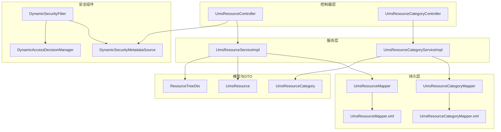
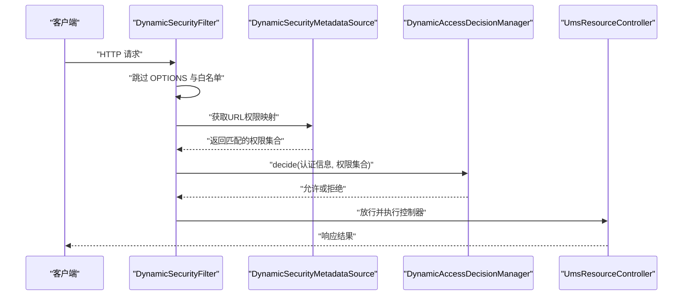
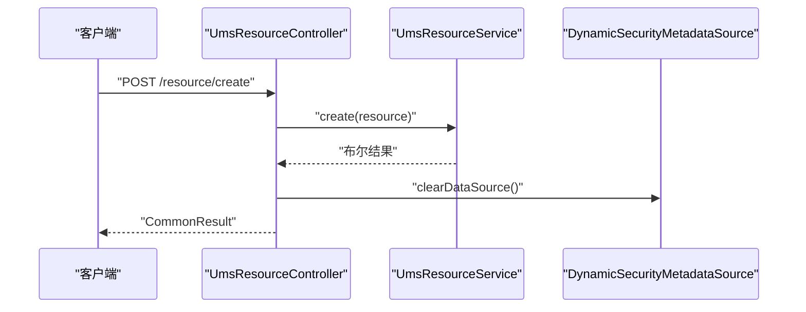
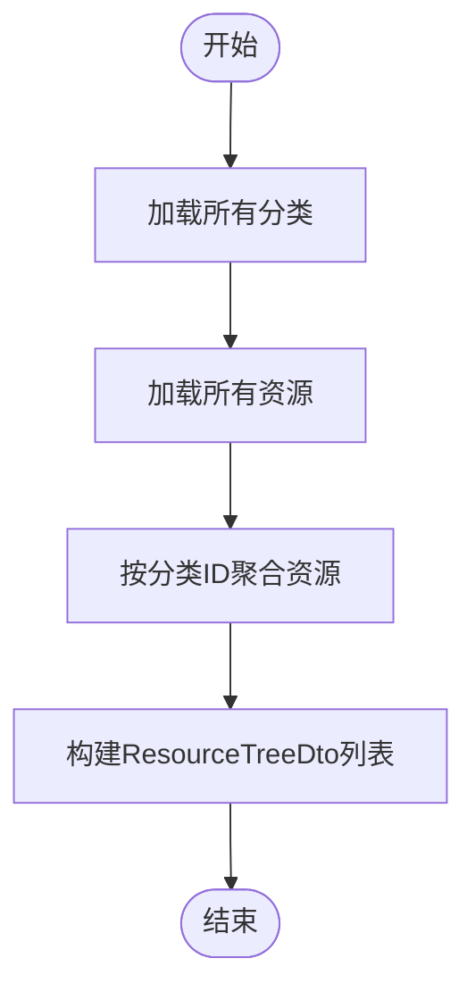
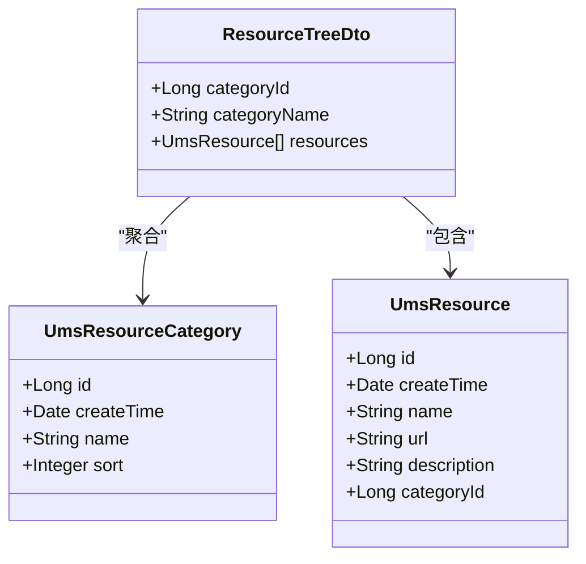
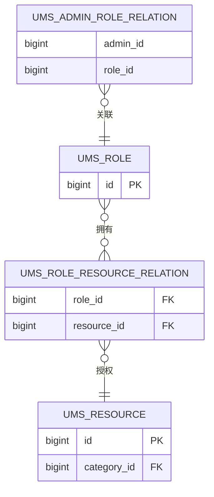
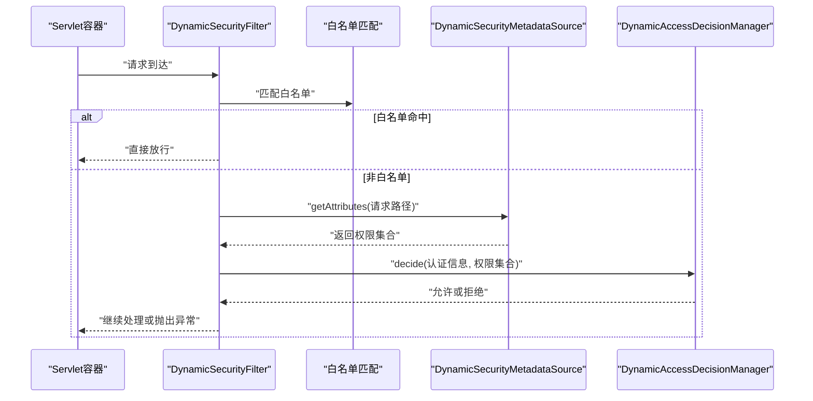
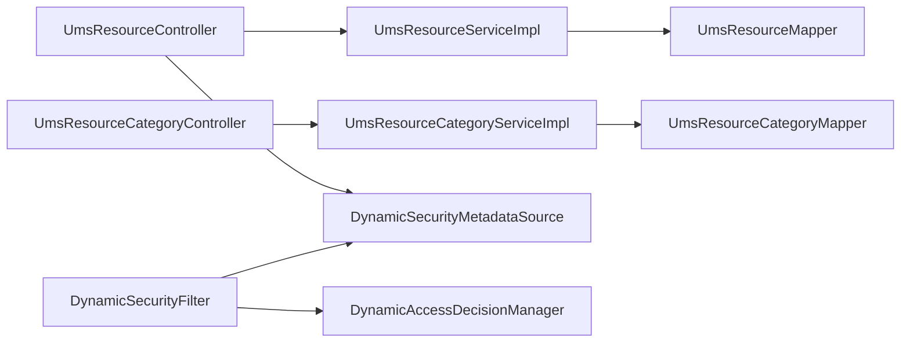

# 资源管理模块

<cite>
**本文引用的文件**
- [UmsResourceController.java](file://src/main/java/com/macro/mall/tiny/modules/ums/controller/UmsResourceController.java)
- [UmsResourceCategoryController.java](file://src/main/java/com/macro/mall/tiny/modules/ums/controller/UmsResourceCategoryController.java)
- [UmsResourceServiceImpl.java](file://src/main/java/com/macro/mall/tiny/modules/ums/service/impl/UmsResourceServiceImpl.java)
- [UmsResourceCategoryServiceImpl.java](file://src/main/java/com/macro/mall/tiny/modules/ums/service/impl/UmsResourceCategoryServiceImpl.java)
- [UmsResource.java](file://src/main/java/com/macro/mall/tiny/modules/ums/model/UmsResource.java)
- [UmsResourceCategory.java](file://src/main/java/com/macro/mall/tiny/modules/ums/model/UmsResourceCategory.java)
- [ResourceTreeDto.java](file://src/main/java/com/macro/mall/tiny/modules/ums/dto/ResourceTreeDto.java)
- [UmsResourceMapper.java](file://src/main/java/com/macro/mall/tiny/modules/ums/mapper/UmsResourceMapper.java)
- [UmsResourceCategoryMapper.java](file://src/main/java/com/macro/mall/tiny/modules/ums/mapper/UmsResourceCategoryMapper.java)
- [UmsResourceMapper.xml](file://src/main/resources/mapper/ums/UmsResourceMapper.xml)
- [UmsResourceCategoryMapper.xml](file://src/main/resources/mapper/ums/UmsResourceCategoryMapper.xml)
- [DynamicSecurityMetadataSource.java](file://src/main/java/com/macro/mall/tiny/security/component/DynamicSecurityMetadataSource.java)
- [DynamicSecurityFilter.java](file://src/main/java/com/macro/mall/tiny/security/component/DynamicSecurityFilter.java)
- [DynamicAccessDecisionManager.java](file://src/main/java/com/macro/mall/tiny/security/component/DynamicAccessDecisionManager.java)
</cite>

## 目录
1. [简介](#简介)
2. [项目结构](#项目结构)
3. [核心组件](#核心组件)
4. [架构总览](#架构总览)
5. [详细组件分析](#详细组件分析)
6. [依赖分析](#依赖分析)
7. [性能考量](#性能考量)
8. [故障排查指南](#故障排查指南)
9. [结论](#结论)
10. [附录](#附录)

## 简介
本文件系统性梳理资源管理模块的设计与实现，覆盖资源分类、资源权限控制、动态权限分配等核心能力。文档从控制器API、服务层业务逻辑、实体模型到安全组件联动进行全链路解析，并提供架构图、序列图与流程图帮助不同层次的读者快速理解。

## 项目结构
资源管理模块位于 ums 子系统中，采用典型的分层架构：控制器层负责对外暴露REST API；服务层封装业务逻辑；持久层通过MyBatis-Plus与XML映射完成数据库交互；安全层通过动态权限组件实现URL级权限校验。

图表来源
- [UmsResourceController.java:1-110](file://src/main/java/com/macro/mall/tiny/modules/ums/controller/UmsResourceController.java#L1-L110)
- [UmsResourceCategoryController.java:1-73](file://src/main/java/com/macro/mall/tiny/modules/ums/controller/UmsResourceCategoryController.java#L1-L73)
- [UmsResourceServiceImpl.java:1-101](file://src/main/java/com/macro/mall/tiny/modules/ums/service/impl/UmsResourceServiceImpl.java#L1-L101)
- [UmsResourceCategoryServiceImpl.java:1-33](file://src/main/java/com/macro/mall/tiny/modules/ums/service/impl/UmsResourceCategoryServiceImpl.java#L1-L33)
- [UmsResourceMapper.java:1-30](file://src/main/java/com/macro/mall/tiny/modules/ums/mapper/UmsResourceMapper.java#L1-L30)
- [UmsResourceCategoryMapper.java:1-17](file://src/main/java/com/macro/mall/tiny/modules/ums/mapper/UmsResourceCategoryMapper.java#L1-L17)
- [UmsResourceMapper.xml:1-54](file://src/main/resources/mapper/ums/UmsResourceMapper.xml#L1-L54)
- [UmsResourceCategoryMapper.xml:1-14](file://src/main/resources/mapper/ums/UmsResourceCategoryMapper.xml#L1-L14)
- [UmsResource.java:1-49](file://src/main/java/com/macro/mall/tiny/modules/ums/model/UmsResource.java#L1-L49)
- [UmsResourceCategory.java:1-43](file://src/main/java/com/macro/mall/tiny/modules/ums/model/UmsResourceCategory.java#L1-L43)
- [ResourceTreeDto.java:1-24](file://src/main/java/com/macro/mall/tiny/modules/ums/dto/ResourceTreeDto.java#L1-L24)
- [DynamicSecurityMetadataSource.java:1-65](file://src/main/java/com/macro/mall/tiny/security/component/DynamicSecurityMetadataSource.java#L1-L65)
- [DynamicSecurityFilter.java:1-83](file://src/main/java/com/macro/mall/tiny/security/component/DynamicSecurityFilter.java#L1-L83)
- [DynamicAccessDecisionManager.java:1-52](file://src/main/java/com/macro/mall/tiny/security/component/DynamicAccessDecisionManager.java#L1-L52)

章节来源
- [UmsResourceController.java:1-110](file://src/main/java/com/macro/mall/tiny/modules/ums/controller/UmsResourceController.java#L1-L110)
- [UmsResourceCategoryController.java:1-73](file://src/main/java/com/macro/mall/tiny/modules/ums/controller/UmsResourceCategoryController.java#L1-L73)
- [UmsResourceServiceImpl.java:1-101](file://src/main/java/com/macro/mall/tiny/modules/ums/service/impl/UmsResourceServiceImpl.java#L1-L101)
- [UmsResourceCategoryServiceImpl.java:1-33](file://src/main/java/com/macro/mall/tiny/modules/ums/service/impl/UmsResourceCategoryServiceImpl.java#L1-L33)

## 核心组件
- 控制器层
  - UmsResourceController：提供资源的增删改查、分页检索、资源树展示等接口。
  - UmsResourceCategoryController：提供资源分类的增删改查与查询全部接口。
- 服务层
  - UmsResourceServiceImpl：实现资源的创建、更新、删除、分页查询、资源树构建等。
  - UmsResourceCategoryServiceImpl：实现分类查询与新增。
- 数据模型
  - UmsResource：资源实体，包含名称、URL、描述、分类ID等字段。
  - UmsResourceCategory：资源分类实体，包含名称、排序等字段。
  - ResourceTreeDto：资源树DTO，按分类聚合资源列表。
- 安全组件
  - DynamicSecurityFilter：拦截HTTP请求，结合白名单与动态权限规则进行鉴权。
  - DynamicSecurityMetadataSource：动态加载URL到权限标识的映射。
  - DynamicAccessDecisionManager：基于用户权限集合与所需权限进行匹配决策。

章节来源
- [UmsResourceController.java:23-109](file://src/main/java/com/macro/mall/tiny/modules/ums/controller/UmsResourceController.java#L23-L109)
- [UmsResourceCategoryController.java:19-72](file://src/main/java/com/macro/mall/tiny/modules/ums/controller/UmsResourceCategoryController.java#L19-L72)
- [UmsResourceServiceImpl.java:27-99](file://src/main/java/com/macro/mall/tiny/modules/ums/service/impl/UmsResourceServiceImpl.java#L27-L99)
- [UmsResourceCategoryServiceImpl.java:18-32](file://src/main/java/com/macro/mall/tiny/modules/ums/service/impl/UmsResourceCategoryServiceImpl.java#L18-L32)
- [UmsResource.java:25-48](file://src/main/java/com/macro/mall/tiny/modules/ums/model/UmsResource.java#L25-L48)
- [UmsResourceCategory.java:25-42](file://src/main/java/com/macro/mall/tiny/modules/ums/model/UmsResourceCategory.java#L25-L42)
- [ResourceTreeDto.java:14-23](file://src/main/java/com/macro/mall/tiny/modules/ums/dto/ResourceTreeDto.java#L14-L23)
- [DynamicSecurityFilter.java:23-82](file://src/main/java/com/macro/mall/tiny/security/component/DynamicSecurityFilter.java#L23-L82)
- [DynamicSecurityMetadataSource.java:18-64](file://src/main/java/com/macro/mall/tiny/security/component/DynamicSecurityMetadataSource.java#L18-L64)
- [DynamicAccessDecisionManager.java:18-51](file://src/main/java/com/macro/mall/tiny/security/component/DynamicAccessDecisionManager.java#L18-L51)

## 架构总览
资源管理模块与安全组件协同工作，形成“控制器—服务—持久层—安全过滤”的闭环。动态权限过滤器在进入业务处理前，依据当前请求路径匹配已加载的URL权限映射，再由决策管理器判定用户是否具备相应权限。

图表来源
- [DynamicSecurityFilter.java:40-66](file://src/main/java/com/macro/mall/tiny/security/component/DynamicSecurityFilter.java#L40-L66)
- [DynamicSecurityMetadataSource.java:34-52](file://src/main/java/com/macro/mall/tiny/security/component/DynamicSecurityMetadataSource.java#L34-L52)
- [DynamicAccessDecisionManager.java:20-39](file://src/main/java/com/macro/mall/tiny/security/component/DynamicAccessDecisionManager.java#L20-L39)
- [UmsResourceController.java:34-108](file://src/main/java/com/macro/mall/tiny/modules/ums/controller/UmsResourceController.java#L34-L108)

## 详细组件分析

### 控制器层：UmsResourceController
- 职责
  - 提供资源的创建、更新、删除、详情查询、分页查询、全量查询、资源树查询。
  - 在资源变更后主动清理动态权限缓存，确保权限规则即时生效。
- 关键接口
  - POST /resource/create：新增资源
  - POST /resource/update/{id}：更新资源
  - GET /resource/{id}：按ID查询资源
  - POST /resource/delete/{id}：删除资源
  - GET /resource/list：分页模糊查询（支持分类ID、名称关键词、URL关键词）
  - GET /resource/listAll：查询所有资源
  - GET /resource/tree：按分类聚合的资源树
- 返回约定
  - 统一使用通用响应包装类型，成功/失败状态明确。

图表来源
- [UmsResourceController.java:34-45](file://src/main/java/com/macro/mall/tiny/modules/ums/controller/UmsResourceController.java#L34-L45)
- [UmsResourceServiceImpl.java:34-37](file://src/main/java/com/macro/mall/tiny/modules/ums/service/impl/UmsResourceServiceImpl.java#L34-L37)
- [DynamicSecurityMetadataSource.java:29-32](file://src/main/java/com/macro/mall/tiny/security/component/DynamicSecurityMetadataSource.java#L29-L32)

章节来源
- [UmsResourceController.java:23-109](file://src/main/java/com/macro/mall/tiny/modules/ums/controller/UmsResourceController.java#L23-L109)

### 控制器层：UmsResourceCategoryController
- 职责
  - 提供资源分类的查询全部、新增、更新、删除接口。
- 关键接口
  - GET /resourceCategory/listAll：查询所有分类
  - POST /resourceCategory/create：新增分类
  - POST /resourceCategory/update/{id}：更新分类
  - POST /resourceCategory/delete/{id}：删除分类

章节来源
- [UmsResourceCategoryController.java:19-72](file://src/main/java/com/macro/mall/tiny/modules/ums/controller/UmsResourceCategoryController.java#L19-L72)

### 服务层：UmsResourceServiceImpl
- 职责
  - 实现资源的创建、更新、删除、分页查询与资源树构建。
  - 更新/删除资源后清理管理员资源缓存，避免脏读。
- 查询策略
  - 支持按分类ID、名称关键词、URL关键词进行条件筛选与分页。
- 资源树构建
  - 先获取所有分类与资源，再按分类ID进行聚合，输出ResourceTreeDto列表。

图表来源
- [UmsResourceServiceImpl.java:72-99](file://src/main/java/com/macro/mall/tiny/modules/ums/service/impl/UmsResourceServiceImpl.java#L72-L99)

章节来源
- [UmsResourceServiceImpl.java:27-99](file://src/main/java/com/macro/mall/tiny/modules/ums/service/impl/UmsResourceServiceImpl.java#L27-L99)

### 服务层：UmsResourceCategoryServiceImpl
- 职责
  - 实现分类查询与新增。
  - 查询时按sort降序排列。

章节来源
- [UmsResourceCategoryServiceImpl.java:18-32](file://src/main/java/com/macro/mall/tiny/modules/ums/service/impl/UmsResourceCategoryServiceImpl.java#L18-L32)

### 模型与DTO
- UmsResource
  - 字段：主键、创建时间、名称、URL、描述、分类ID。
  - 作用：承载资源元数据，支撑权限匹配与树形展示。
- UmsResourceCategory
  - 字段：主键、创建时间、名称、排序。
  - 作用：组织资源分组，便于权限治理与界面展示。
- ResourceTreeDto
  - 字段：分类ID、分类名称、资源列表。
  - 作用：控制器返回的资源树结构载体。

图表来源
- [UmsResource.java:25-48](file://src/main/java/com/macro/mall/tiny/modules/ums/model/UmsResource.java#L25-L48)
- [UmsResourceCategory.java:25-42](file://src/main/java/com/macro/mall/tiny/modules/ums/model/UmsResourceCategory.java#L25-L42)
- [ResourceTreeDto.java:14-23](file://src/main/java/com/macro/mall/tiny/modules/ums/dto/ResourceTreeDto.java#L14-L23)

章节来源
- [UmsResource.java:25-48](file://src/main/java/com/macro/mall/tiny/modules/ums/model/UmsResource.java#L25-L48)
- [UmsResourceCategory.java:25-42](file://src/main/java/com/macro/mall/tiny/modules/ums/model/UmsResourceCategory.java#L25-L42)
- [ResourceTreeDto.java:14-23](file://src/main/java/com/macro/mall/tiny/modules/ums/dto/ResourceTreeDto.java#L14-L23)

### 持久层：Mapper与SQL
- UmsResourceMapper
  - getResourceList：按管理员ID查询其可访问资源（通过角色-资源关联查询）。
  - getResourceListByRoleId：按角色ID查询资源集合。
- UmsResourceCategoryMapper
  - 基础CRUD接口，配合XML映射结果集。

图表来源
- [UmsResourceMapper.xml:15-33](file://src/main/resources/mapper/ums/UmsResourceMapper.xml#L15-L33)
- [UmsResourceMapper.xml:35-51](file://src/main/resources/mapper/ums/UmsResourceMapper.xml#L35-L51)

章节来源
- [UmsResourceMapper.java:17-29](file://src/main/java/com/macro/mall/tiny/modules/ums/mapper/UmsResourceMapper.java#L17-L29)
- [UmsResourceCategoryMapper.java:14-16](file://src/main/java/com/macro/mall/tiny/modules/ums/mapper/UmsResourceCategoryMapper.java#L14-L16)
- [UmsResourceMapper.xml:15-51](file://src/main/resources/mapper/ums/UmsResourceMapper.xml#L15-L51)
- [UmsResourceCategoryMapper.xml:5-11](file://src/main/resources/mapper/ums/UmsResourceCategoryMapper.xml#L5-L11)

### 安全组件：动态权限控制
- DynamicSecurityFilter
  - 过滤OPTIONS请求与白名单路径。
  - 将请求交由Spring Security拦截链处理，触发权限决策。
- DynamicSecurityMetadataSource
  - 加载URL模式到权限标识的映射，支持Ant风格路径匹配。
  - 提供清空缓存的能力，配合资源变更实时生效。
- DynamicAccessDecisionManager
  - 对比用户权限集合与所需权限，任一匹配即通过，否则拒绝。

图表来源
- [DynamicSecurityFilter.java:40-66](file://src/main/java/com/macro/mall/tiny/security/component/DynamicSecurityFilter.java#L40-L66)
- [DynamicSecurityMetadataSource.java:34-52](file://src/main/java/com/macro/mall/tiny/security/component/DynamicSecurityMetadataSource.java#L34-L52)
- [DynamicAccessDecisionManager.java:20-39](file://src/main/java/com/macro/mall/tiny/security/component/DynamicAccessDecisionManager.java#L20-L39)

章节来源
- [DynamicSecurityFilter.java:23-82](file://src/main/java/com/macro/mall/tiny/security/component/DynamicSecurityFilter.java#L23-L82)
- [DynamicSecurityMetadataSource.java:18-64](file://src/main/java/com/macro/mall/tiny/security/component/DynamicSecurityMetadataSource.java#L18-L64)
- [DynamicAccessDecisionManager.java:18-51](file://src/main/java/com/macro/mall/tiny/security/component/DynamicAccessDecisionManager.java#L18-L51)

## 依赖分析
- 控制器依赖服务层，服务层依赖Mapper与缓存服务；控制器还依赖动态权限元数据源以刷新权限映射。
- 资源树构建依赖分类服务与资源服务，形成“分类+资源”的聚合关系。
- 安全组件之间存在强耦合：过滤器依赖元数据源与决策管理器；元数据源依赖动态服务加载URL权限映射。

图表来源
- [UmsResourceController.java:29-32](file://src/main/java/com/macro/mall/tiny/modules/ums/controller/UmsResourceController.java#L29-L32)
- [UmsResourceServiceImpl.java:29-32](file://src/main/java/com/macro/mall/tiny/modules/ums/service/impl/UmsResourceServiceImpl.java#L29-L32)
- [UmsResourceCategoryServiceImpl.java:18-32](file://src/main/java/com/macro/mall/tiny/modules/ums/service/impl/UmsResourceCategoryServiceImpl.java#L18-L32)
- [DynamicSecurityFilter.java:25-33](file://src/main/java/com/macro/mall/tiny/security/component/DynamicSecurityFilter.java#L25-L33)
- [DynamicSecurityMetadataSource.java:21-22](file://src/main/java/com/macro/mall/tiny/security/component/DynamicSecurityMetadataSource.java#L21-L22)

章节来源
- [UmsResourceController.java:29-32](file://src/main/java/com/macro/mall/tiny/modules/ums/controller/UmsResourceController.java#L29-L32)
- [UmsResourceCategoryController.java:25](file://src/main/java/com/macro/mall/tiny/modules/ums/controller/UmsResourceCategoryController.java#L25)
- [UmsResourceServiceImpl.java:29-32](file://src/main/java/com/macro/mall/tiny/modules/ums/service/impl/UmsResourceServiceImpl.java#L29-L32)
- [UmsResourceCategoryServiceImpl.java:18-32](file://src/main/java/com/macro/mall/tiny/modules/ums/service/impl/UmsResourceCategoryServiceImpl.java#L18-L32)
- [DynamicSecurityFilter.java:25-33](file://src/main/java/com/macro/mall/tiny/security/component/DynamicSecurityFilter.java#L25-L33)
- [DynamicSecurityMetadataSource.java:21-22](file://src/main/java/com/macro/mall/tiny/security/component/DynamicSecurityMetadataSource.java#L21-L22)

## 性能考量
- 分页查询
  - 使用MyBatis-Plus分页器，避免一次性加载大量资源数据。
- 条件查询
  - 基于Lambda条件构造器进行非空参数拼接，减少无效SQL开销。
- 资源树构建
  - 采用内存聚合策略，适合分类与资源规模适中的场景；若数据量大，建议引入数据库侧聚合或缓存优化。
- 动态权限缓存
  - 变更资源后主动清空元数据缓存，保证一致性；频繁变更时可考虑批量刷新策略降低抖动。

## 故障排查指南
- 权限不生效
  - 确认资源URL是否正确配置到权限映射；检查动态权限缓存是否已刷新。
  - 排查白名单配置是否误放行了目标路径。
- 资源树为空
  - 检查是否存在分类与资源；确认分类与资源的关联关系是否正确。
- 查询无结果
  - 检查分页参数与关键词是否合理；确认数据库中是否存在匹配记录。
- 更新/删除后缓存问题
  - 确认服务层是否调用了缓存清理逻辑；检查缓存键命名是否一致。

章节来源
- [UmsResourceController.java:39,53,74](file://src/main/java/com/macro/mall/tiny/modules/ums/controller/UmsResourceController.java#L39,L53,L74)
- [UmsResourceServiceImpl.java:43,50](file://src/main/java/com/macro/mall/tiny/modules/ums/service/impl/UmsResourceServiceImpl.java#L43,L50)
- [DynamicSecurityMetadataSource.java:29-32](file://src/main/java/com/macro/mall/tiny/security/component/DynamicSecurityMetadataSource.java#L29-L32)
- [DynamicSecurityFilter.java:52-58](file://src/main/java/com/macro/mall/tiny/security/component/DynamicSecurityFilter.java#L52-L58)

## 结论
资源管理模块通过清晰的分层设计与动态权限机制，实现了资源的全生命周期管理与细粒度权限控制。控制器提供完备的资源与分类API，服务层承担数据验证与关系维护，安全组件保障URL级访问控制。整体架构易于扩展与维护，适合在多角色、多资源权限场景下稳定运行。

## 附录

### API定义概览
- 资源管理
  - POST /resource/create：新增资源
  - POST /resource/update/{id}：更新资源
  - GET /resource/{id}：按ID查询资源
  - POST /resource/delete/{id}：删除资源
  - GET /resource/list：分页查询（支持分类ID、名称关键词、URL关键词）
  - GET /resource/listAll：查询所有资源
  - GET /resource/tree：按分类聚合的资源树
- 资源分类管理
  - GET /resourceCategory/listAll：查询所有分类
  - POST /resourceCategory/create：新增分类
  - POST /resourceCategory/update/{id}：更新分类
  - POST /resourceCategory/delete/{id}：删除分类

章节来源
- [UmsResourceController.java:34-108](file://src/main/java/com/macro/mall/tiny/modules/ums/controller/UmsResourceController.java#L34-L108)
- [UmsResourceCategoryController.java:27-71](file://src/main/java/com/macro/mall/tiny/modules/ums/controller/UmsResourceCategoryController.java#L27-L71)