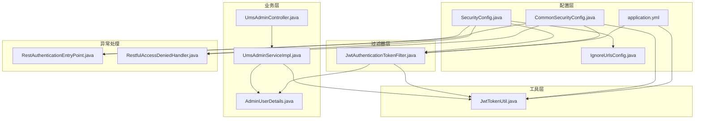
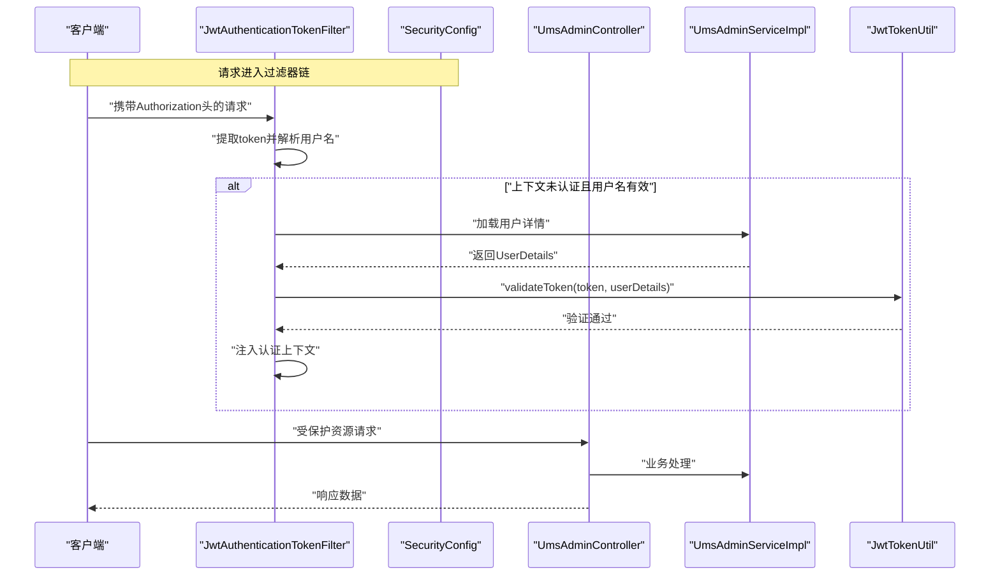
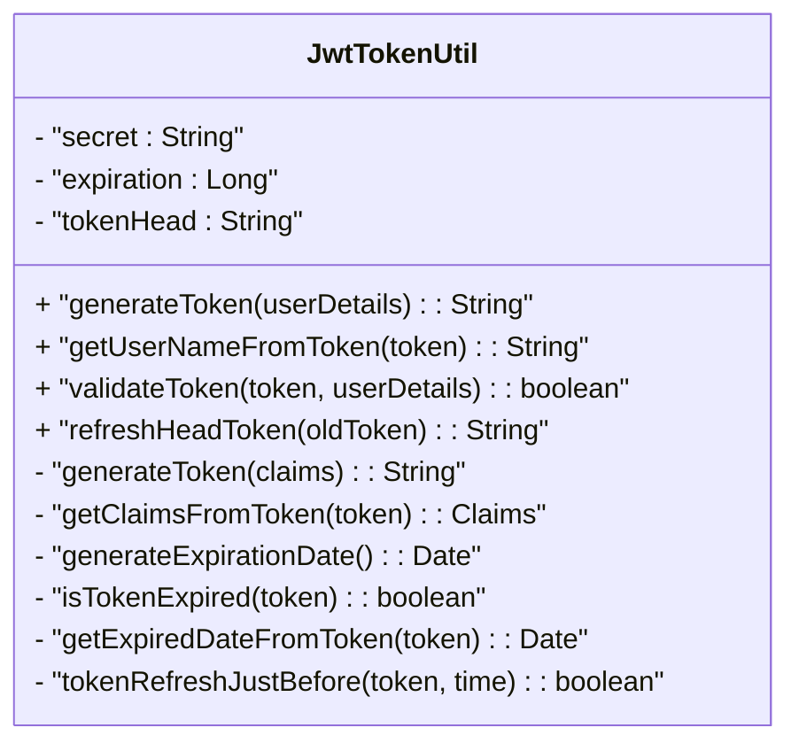
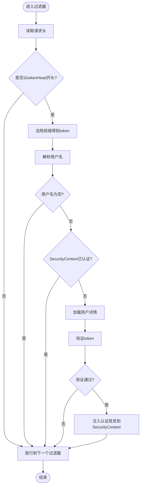
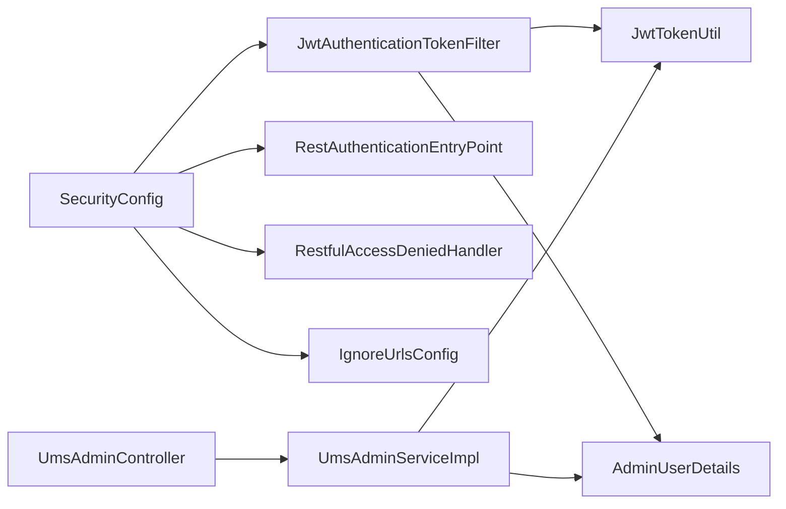

# JWT认证机制

<cite>
**本文引用的文件**
- [JwtTokenUtil.java](file://src/main/java/com/macro/mall/tiny/security/util/JwtTokenUtil.java)
- [JwtAuthenticationTokenFilter.java](file://src/main/java/com/macro/mall/tiny/security/component/JwtAuthenticationTokenFilter.java)
- [SecurityConfig.java](file://src/main/java/com/macro/mall/tiny/security/config/SecurityConfig.java)
- [CommonSecurityConfig.java](file://src/main/java/com/macro/mall/tiny/security/config/CommonSecurityConfig.java)
- [AdminUserDetails.java](file://src/main/java/com/macro/mall/tiny/domain/AdminUserDetails.java)
- [UmsAdminController.java](file://src/main/java/com/macro/mall/tiny/modules/ums/controller/UmsAdminController.java)
- [UmsAdminServiceImpl.java](file://src/main/java/com/macro/mall/tiny/modules/ums/service/impl/UmsAdminServiceImpl.java)
- [application.yml](file://src/main/resources/application.yml)
- [RestAuthenticationEntryPoint.java](file://src/main/java/com/macro/mall/tiny/security/component/RestAuthenticationEntryPoint.java)
- [RestfulAccessDeniedHandler.java](file://src/main/java/com/macro/mall/tiny/security/component/RestfulAccessDeniedHandler.java)
- [IgnoreUrlsConfig.java](file://src/main/java/com/macro/mall/tiny/security/config/IgnoreUrlsConfig.java)
</cite>

## 目录
1. [引言](#引言)
2. [项目结构](#项目结构)
3. [核心组件](#核心组件)
4. [架构总览](#架构总览)
5. [详细组件分析](#详细组件分析)
6. [依赖分析](#依赖分析)
7. [性能考量](#性能考量)
8. [故障排查指南](#故障排查指南)
9. [结论](#结论)
10. [附录](#附录)

## 引言
本文件系统性梳理并解释本项目中的JWT认证机制，覆盖以下要点：
- JWT工作原理：头部、载荷、签名三部分结构与语义
- 令牌生成流程：用户身份验证、声明构建、签名算法应用
- 令牌验证机制：签名验证、过期检查、声明解析
- 过滤器实现：请求拦截、令牌提取、用户身份解析、认证信息注入
- 令牌刷新机制与安全考虑
- 认证流程图、令牌结构示例、关键实现细节与最佳实践

## 项目结构
围绕JWT认证的关键模块分布如下：
- 安全配置层：定义过滤链、会话策略、异常处理与过滤器装配
- 工具层：JWT生成、解析、过期判断、刷新控制
- 过滤器层：拦截HTTP请求，提取并验证JWT，注入认证上下文
- 控制器层：登录接口返回JWT，刷新接口支持令牌续签
- 用户详情层：实现Spring Security的UserDetails，承载权限集合
- 配置与白名单：加载JWT参数、忽略路径白名单

图表来源
- [SecurityConfig.java:46-84](file://src/main/java/com/macro/mall/tiny/security/config/SecurityConfig.java#L46-L84)
- [CommonSecurityConfig.java:28-46](file://src/main/java/com/macro/mall/tiny/security/config/CommonSecurityConfig.java#L28-L46)
- [application.yml:24-28](file://src/main/resources/application.yml#L24-L28)
- [JwtTokenUtil.java:32-37](file://src/main/java/com/macro/mall/tiny/security/util/JwtTokenUtil.java#L32-L37)
- [JwtAuthenticationTokenFilter.java:32-35](file://src/main/java/com/macro/mall/tiny/security/component/JwtAuthenticationTokenFilter.java#L32-L35)
- [UmsAdminController.java:166-196](file://src/main/java/com/macro/mall/tiny/modules/ums/controller/UmsAdminController.java#L166-L196)
- [UmsAdminServiceImpl.java:98-113](file://src/main/java/com/macro/mall/tiny/modules/ums/service/impl/UmsAdminServiceImpl.java#L98-L113)
- [AdminUserDetails.java:17-86](file://src/main/java/com/macro/mall/tiny/domain/AdminUserDetails.java#L17-L86)

章节来源
- [SecurityConfig.java:46-84](file://src/main/java/com/macro/mall/tiny/security/config/SecurityConfig.java#L46-L84)
- [CommonSecurityConfig.java:28-46](file://src/main/java/com/macro/mall/tiny/security/config/CommonSecurityConfig.java#L28-L46)
- [application.yml:24-28](file://src/main/resources/application.yml#L24-L28)

## 核心组件
- JwtTokenUtil：封装JWT生成、解析、过期判断与刷新逻辑
- JwtAuthenticationTokenFilter：请求过滤器，负责从请求头提取令牌、解析用户、注入认证上下文
- SecurityConfig：定义安全过滤链、关闭CSRF与Session、配置异常处理器与动态权限过滤器
- CommonSecurityConfig：统一装配密码编码器、JWT工具、过滤器与异常处理器等Bean
- AdminUserDetails：实现UserDetails，提供权限集合与账户状态
- UmsAdminController：登录接口返回JWT，刷新接口支持令牌续签
- UmsAdminServiceImpl：登录时生成JWT，加载用户详情
- application.yml：JWT相关参数（密钥、过期时间、请求头、前缀）

章节来源
- [JwtTokenUtil.java:28-170](file://src/main/java/com/macro/mall/tiny/security/util/JwtTokenUtil.java#L28-L170)
- [JwtAuthenticationTokenFilter.java:26-58](file://src/main/java/com/macro/mall/tiny/security/component/JwtAuthenticationTokenFilter.java#L26-L58)
- [SecurityConfig.java:46-84](file://src/main/java/com/macro/mall/tiny/security/config/SecurityConfig.java#L46-L84)
- [CommonSecurityConfig.java:28-46](file://src/main/java/com/macro/mall/tiny/security/config/CommonSecurityConfig.java#L28-L46)
- [AdminUserDetails.java:17-86](file://src/main/java/com/macro/mall/tiny/domain/AdminUserDetails.java#L17-L86)
- [UmsAdminController.java:166-211](file://src/main/java/com/macro/mall/tiny/modules/ums/controller/UmsAdminController.java#L166-L211)
- [UmsAdminServiceImpl.java:98-113](file://src/main/java/com/macro/mall/tiny/modules/ums/service/impl/UmsAdminServiceImpl.java#L98-L113)
- [application.yml:24-28](file://src/main/resources/application.yml#L24-L28)

## 架构总览
下图展示JWT认证在请求生命周期中的关键交互：

图表来源
- [JwtAuthenticationTokenFilter.java:37-56](file://src/main/java/com/macro/mall/tiny/security/component/JwtAuthenticationTokenFilter.java#L37-L56)
- [SecurityConfig.java:46-84](file://src/main/java/com/macro/mall/tiny/security/config/SecurityConfig.java#L46-L84)
- [UmsAdminController.java:166-196](file://src/main/java/com/macro/mall/tiny/modules/ums/controller/UmsAdminController.java#L166-L196)
- [UmsAdminServiceImpl.java:98-113](file://src/main/java/com/macro/mall/tiny/modules/ums/service/impl/UmsAdminServiceImpl.java#L98-L113)
- [JwtTokenUtil.java:93-96](file://src/main/java/com/macro/mall/tiny/security/util/JwtTokenUtil.java#L93-L96)

## 详细组件分析

### 组件一：JwtTokenUtil（令牌生成与验证）
- 职责
  - 生成JWT：设置声明、过期时间、签名算法，返回紧凑型JWT字符串
  - 解析JWT：从令牌中提取Claims，解析用户名、过期时间
  - 验证JWT：比对用户名与启用状态，检查过期
  - 刷新JWT：在未过期前提下更新“created”声明并重签发
- 关键点
  - 使用对称签名算法（HS512），密钥来自配置
  - 过期时间由配置项决定，单位为秒
  - 刷新窗口控制：若在指定时间内刚刷新过则返回原token，避免频繁重签

图表来源
- [JwtTokenUtil.java:28-170](file://src/main/java/com/macro/mall/tiny/security/util/JwtTokenUtil.java#L28-L170)

章节来源
- [JwtTokenUtil.java:32-37](file://src/main/java/com/macro/mall/tiny/security/util/JwtTokenUtil.java#L32-L37)
- [JwtTokenUtil.java:42-48](file://src/main/java/com/macro/mall/tiny/security/util/JwtTokenUtil.java#L42-L48)
- [JwtTokenUtil.java:53-64](file://src/main/java/com/macro/mall/tiny/security/util/JwtTokenUtil.java#L53-L64)
- [JwtTokenUtil.java:69-71](file://src/main/java/com/macro/mall/tiny/security/util/JwtTokenUtil.java#L69-L71)
- [JwtTokenUtil.java:76-85](file://src/main/java/com/macro/mall/tiny/security/util/JwtTokenUtil.java#L76-L85)
- [JwtTokenUtil.java:93-96](file://src/main/java/com/macro/mall/tiny/security/util/JwtTokenUtil.java#L93-L96)
- [JwtTokenUtil.java:101-112](file://src/main/java/com/macro/mall/tiny/security/util/JwtTokenUtil.java#L101-L112)
- [JwtTokenUtil.java:129-153](file://src/main/java/com/macro/mall/tiny/security/util/JwtTokenUtil.java#L129-L153)
- [JwtTokenUtil.java:160-169](file://src/main/java/com/macro/mall/tiny/security/util/JwtTokenUtil.java#L160-L169)

### 组件二：JwtAuthenticationTokenFilter（请求过滤器）
- 职责
  - 从请求头读取Authorization字段
  - 去除前缀后提取token，解析用户名
  - 若上下文未认证且用户名有效，则加载用户详情并验证token
  - 将认证信息写入SecurityContext，供后续访问决策使用
- 关键点
  - 仅在请求头以配置前缀开头时处理
  - 与动态权限过滤器配合，实现细粒度访问控制

图表来源
- [JwtAuthenticationTokenFilter.java:37-56](file://src/main/java/com/macro/mall/tiny/security/component/JwtAuthenticationTokenFilter.java#L37-L56)

章节来源
- [JwtAuthenticationTokenFilter.java:32-35](file://src/main/java/com/macro/mall/tiny/security/component/JwtAuthenticationTokenFilter.java#L32-L35)
- [JwtAuthenticationTokenFilter.java:41-56](file://src/main/java/com/macro/mall/tiny/security/component/JwtAuthenticationTokenFilter.java#L41-L56)

### 组件三：SecurityConfig（安全配置）
- 职责
  - 配置忽略路径白名单
  - 允许OPTIONS预检请求
  - 设置无状态会话策略（STATELESS）
  - 注册JWT过滤器于登录过滤器之前
  - 注册动态权限过滤器（如启用）
  - 配置未登录与权限不足的异常处理器
- 关键点
  - 通过IgnoreUrlsConfig读取白名单
  - 与JwtAuthenticationTokenFilter、异常处理器Bean协同

章节来源
- [SecurityConfig.java:46-84](file://src/main/java/com/macro/mall/tiny/security/config/SecurityConfig.java#L46-L84)
- [IgnoreUrlsConfig.java:14-21](file://src/main/java/com/macro/mall/tiny/security/config/IgnoreUrlsConfig.java#L14-L21)

### 组件四：CommonSecurityConfig（Bean装配）
- 职责
  - 提供BCrypt密码编码器
  - 装配忽略路径配置、JWT工具、JWT过滤器、异常处理器
  - 动态权限相关Bean（如启用）

章节来源
- [CommonSecurityConfig.java:18-46](file://src/main/java/com/macro/mall/tiny/security/config/CommonSecurityConfig.java#L18-L46)

### 组件五：AdminUserDetails（用户详情）
- 职责
  - 实现UserDetails，提供密码、用户名、权限集合
  - 权限来源：资源ID+名称、资源名称、资源URL
  - 账户状态：启用/禁用由管理员状态决定

章节来源
- [AdminUserDetails.java:17-86](file://src/main/java/com/macro/mall/tiny/domain/AdminUserDetails.java#L17-L86)

### 组件六：UmsAdminController（登录与刷新）
- 登录接口
  - 校验凭据，调用服务生成JWT
  - 返回token与tokenHead，以及角色与资源列表
- 刷新接口
  - 从请求头读取token，调用服务刷新
  - 返回新的token与tokenHead

章节来源
- [UmsAdminController.java:166-196](file://src/main/java/com/macro/mall/tiny/modules/ums/controller/UmsAdminController.java#L166-L196)
- [UmsAdminController.java:198-211](file://src/main/java/com/macro/mall/tiny/modules/ums/controller/UmsAdminController.java#L198-L211)

### 组件七：UmsAdminServiceImpl（登录与用户加载）
- 登录流程
  - 加载用户详情并校验密码与启用状态
  - 将认证信息写入SecurityContext
  - 调用JwtTokenUtil生成JWT
- 用户加载
  - 从缓存或数据库加载管理员
  - 组合资源列表构造AdminUserDetails

章节来源
- [UmsAdminServiceImpl.java:98-113](file://src/main/java/com/macro/mall/tiny/modules/ums/service/impl/UmsAdminServiceImpl.java#L98-L113)
- [UmsAdminServiceImpl.java:257-265](file://src/main/java/com/macro/mall/tiny/modules/ums/service/impl/UmsAdminServiceImpl.java#L257-L265)

### 组件八：异常处理与白名单
- 未登录/登录过期：RestAuthenticationEntryPoint返回统一JSON
- 权限不足：RestfulAccessDeniedHandler返回统一JSON
- 忽略路径：IgnoreUrlsConfig从配置读取白名单

章节来源
- [RestAuthenticationEntryPoint.java:17-27](file://src/main/java/com/macro/mall/tiny/security/component/RestAuthenticationEntryPoint.java#L17-L27)
- [RestfulAccessDeniedHandler.java:17-29](file://src/main/java/com/macro/mall/tiny/security/component/RestfulAccessDeniedHandler.java#L17-L29)
- [IgnoreUrlsConfig.java:14-21](file://src/main/java/com/macro/mall/tiny/security/config/IgnoreUrlsConfig.java#L14-L21)

## 依赖分析
- 组件耦合
  - SecurityConfig依赖JwtAuthenticationTokenFilter、异常处理器与忽略路径配置
  - JwtAuthenticationTokenFilter依赖JwtTokenUtil与UserDetailsService
  - UmsAdminController依赖UmsAdminServiceImpl
  - UmsAdminServiceImpl依赖JwtTokenUtil与AdminUserDetails
- 外部依赖
  - JWT库（io.jsonwebtoken）、Hutool（日期与字符串工具）
  - Spring Security（过滤器链、认证上下文、异常处理）
  - Spring Boot自动装配（配置属性、Bean装配）

图表来源
- [SecurityConfig.java:40-82](file://src/main/java/com/macro/mall/tiny/security/config/SecurityConfig.java#L40-L82)
- [JwtAuthenticationTokenFilter.java:28-35](file://src/main/java/com/macro/mall/tiny/security/component/JwtAuthenticationTokenFilter.java#L28-L35)
- [UmsAdminController.java:54-60](file://src/main/java/com/macro/mall/tiny/modules/ums/controller/UmsAdminController.java#L54-L60)
- [UmsAdminServiceImpl.java:50-51](file://src/main/java/com/macro/mall/tiny/modules/ums/service/impl/UmsAdminServiceImpl.java#L50-L51)

章节来源
- [SecurityConfig.java:40-82](file://src/main/java/com/macro/mall/tiny/security/config/SecurityConfig.java#L40-L82)
- [JwtAuthenticationTokenFilter.java:28-35](file://src/main/java/com/macro/mall/tiny/security/component/JwtAuthenticationTokenFilter.java#L28-L35)
- [UmsAdminController.java:54-60](file://src/main/java/com/macro/mall/tiny/modules/ums/controller/UmsAdminController.java#L54-L60)
- [UmsAdminServiceImpl.java:50-51](file://src/main/java/com/macro/mall/tiny/modules/ums/service/impl/UmsAdminServiceImpl.java#L50-L51)

## 性能考量
- 无状态设计：基于JWT的无状态认证避免服务器端会话存储，降低扩展复杂度
- 缓存策略：用户详情与资源列表可结合缓存减少数据库压力
- 刷新策略：合理设置刷新窗口，避免频繁重签导致签名开销增加
- 密钥与算法：对称算法（HS512）计算开销较低；密钥长度与轮转策略需平衡安全性与性能
- 过滤器链：仅在必要路径执行JWT过滤，白名单与动态权限过滤器减少无效验证

## 故障排查指南
- 未登录或登录过期
  - 现象：返回统一未登录/过期提示
  - 排查：确认请求头Authorization格式、tokenHead前缀、token是否过期
- 权限不足
  - 现象：返回统一权限不足提示
  - 排查：确认用户权限集合与资源URL映射、动态权限元数据源
- 白名单未生效
  - 现象：静态资源或登录接口仍被拦截
  - 排查：核对IgnoreUrlsConfig配置与ant匹配规则
- 过滤器未生效
  - 现象：请求未进入JWT过滤器
  - 排查：确认SecurityConfig中过滤器注册顺序与请求路径匹配

章节来源
- [RestAuthenticationEntryPoint.java:17-27](file://src/main/java/com/macro/mall/tiny/security/component/RestAuthenticationEntryPoint.java#L17-L27)
- [RestfulAccessDeniedHandler.java:17-29](file://src/main/java/com/macro/mall/tiny/security/component/RestfulAccessDeniedHandler.java#L17-L29)
- [SecurityConfig.java:46-84](file://src/main/java/com/macro/mall/tiny/security/config/SecurityConfig.java#L46-L84)
- [IgnoreUrlsConfig.java:14-21](file://src/main/java/com/macro/mall/tiny/security/config/IgnoreUrlsConfig.java#L14-L21)

## 结论
本项目采用标准JWT方案实现无状态认证，结合Spring Security过滤器链完成请求拦截与权限控制。通过明确的配置与组件职责划分，实现了登录、验证、刷新与异常处理的闭环。建议在生产环境中强化密钥管理、引入黑名单与滑动过期策略，并持续优化权限元数据与缓存策略以提升整体性能与安全性。

## 附录

### JWT工作原理与结构
- 结构组成
  - 头部（Header）：包含签名算法与令牌类型
  - 载荷（Payload）：包含声明（如sub、created、exp等）
  - 签名（Signature）：基于头部与载荷的签名
- 生成流程
  - 构建声明（用户名、创建时间、过期时间）
  - 选择签名算法（如HS512）
  - 使用密钥对头部与载荷进行签名
- 验证流程
  - 校验签名
  - 检查过期时间
  - 解析声明并比对用户名与启用状态

章节来源
- [JwtTokenUtil.java:17-26](file://src/main/java/com/macro/mall/tiny/security/util/JwtTokenUtil.java#L17-L26)
- [JwtTokenUtil.java:42-48](file://src/main/java/com/macro/mall/tiny/security/util/JwtTokenUtil.java#L42-L48)
- [JwtTokenUtil.java:53-64](file://src/main/java/com/macro/mall/tiny/security/util/JwtTokenUtil.java#L53-L64)
- [JwtTokenUtil.java:93-96](file://src/main/java/com/macro/mall/tiny/security/util/JwtTokenUtil.java#L93-L96)

### 令牌刷新机制与安全考虑
- 刷新条件
  - 未过期：仅在未过期情况下允许刷新
  - 刷新窗口：在指定时间窗口内避免重复刷新
- 安全建议
  - 密钥轮换：定期更换密钥并处理存量token
  - 最小权限：载荷仅包含必要声明
  - HTTPS传输：防止中间人攻击
  - 日志审计：记录登录与刷新事件

章节来源
- [JwtTokenUtil.java:129-153](file://src/main/java/com/macro/mall/tiny/security/util/JwtTokenUtil.java#L129-L153)
- [JwtTokenUtil.java:160-169](file://src/main/java/com/macro/mall/tiny/security/util/JwtTokenUtil.java#L160-L169)

### 常见使用场景与最佳实践
- 场景
  - 管理后台登录：登录成功返回JWT，后续请求携带Authorization头
  - 资源访问：JWT过滤器解析并注入认证上下文，动态权限过滤器进行细粒度控制
  - 令牌续签：前端在接近过期时调用刷新接口获取新token
- 最佳实践
  - 合理设置过期时间与刷新窗口
  - 使用强密钥并妥善保管
  - 对敏感接口开启动态权限校验
  - 在网关或统一入口集中处理白名单与跨域

章节来源
- [UmsAdminController.java:166-196](file://src/main/java/com/macro/mall/tiny/modules/ums/controller/UmsAdminController.java#L166-L196)
- [UmsAdminController.java:198-211](file://src/main/java/com/macro/mall/tiny/modules/ums/controller/UmsAdminController.java#L198-L211)
- [SecurityConfig.java:46-84](file://src/main/java/com/macro/mall/tiny/security/config/SecurityConfig.java#L46-L84)